

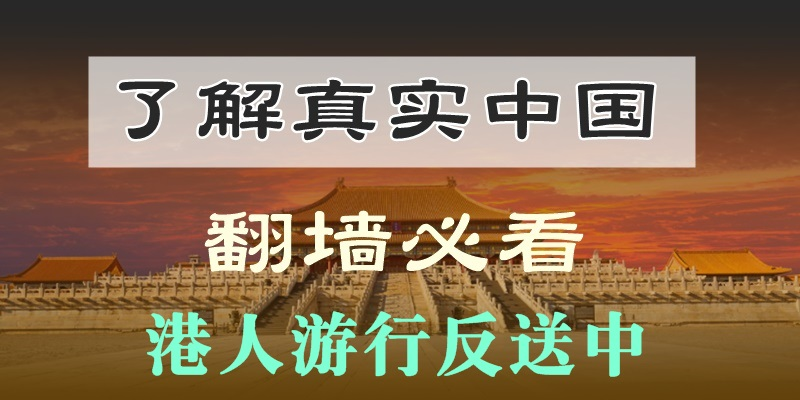
  <h3 align=center>翻墙必看 视频 http://36.228.8.66 </h3>
  
  

 <h1><b><a href="https://github.com/awwkk/usdom/blob/master/forfor.md">● 红潮即将倾覆  天之将明 ● </a></b></h1> 

 

 

 
 

<a name=list><h3><a href="https://">中国禁闻 时时更新 请随时关注 並记下短连结 【 https://git.io/kkopop 】</a></h3>

<table>
   <tr>
    <td width=440>

<a href="https://git.io/tgc">• 点阅《共产主义的终极目的》•</a>

</td>
  <td width=440>

<a href="https://git.io/sos">• 点阅《九评共产党》•</a>

</td>
  </tr> 
</table>

 

<h2> <a href="https://github.com/3fmd/true/blob/master/README.md"> ◆  中共正在收紧对私有资产的控制 ◆</a></h2>
 
  
<table>
  
<tr>
    <td width=680><a href=#b5>➤  私企遭入户清查 专家：中国经济全面倒退   </a> </td>
    <td width=200 ><a href=#b5>大纪元 2019年09月24日</a> </td>
 </tr>     
  
<tr>
    <td width=680><a href=#b4>➤  电动车“拜腾”创始人：因中共干预而离职   </a> </td>
    <td width=200 ><a href=#b4>大纪元 2019年09月22日</a> </td>
 </tr>    
  
<tr>
    <td width=680><a href=#b3>➤ 杭州派官员进驻阿里巴巴等百家私企   </a> </td>
    <td width=200 ><a href=#b3>大纪元 2019年09月22日</a> </td>
 </tr>     
  
<tr>
    <td width=680><a href=#b2>➤ 程晓容：9月新闻透警讯 中共动手侵吞民企   </a> </td>
    <td width=200 ><a href=#b2>大纪元 2019年09月20日</a> </td>
 </tr>   
  
<tr>
    <td width=680><a href=#b1>➤ 网文：深度揭秘中国顶级富豪逃跑计划   </a> </td>
    <td width=200 ><a href=#b1>大纪元 2019年07月28日</a> </td>
 </tr>     
  
 <tr>
    <td width=680><a href=#b0>➤ 胡耀邦长子胡德平批新公私合营：后果很可怕   </a> </td>
    <td width=200 ><a href=#b0>大纪元 2018年09月28日</a> </td>
 </tr>   
  
</table>

 

<table>
  <tr>
<td>

<h2> <a href="https://github.com/3fmd/true/blob/master/README.md"> ◆  港人游行反送中 ◆</a></h2>

香港反送中运动迄今将近3个月，尽管香港特首林郑月娥日前宣布撤回“逃犯条例”修订草案，反送中抗争却依然方兴未艾。然而，抗争过程中，香港市民不仅用血泪捍卫家园，更用善良、人性与正义写下许多可歌可泣的故事与历史片段，广为海内外流传称颂。
 

</td>
  </tr> 
</table>

<table>

<tr>
    <td width=680><a href=#a33>➤ 川普联大演讲撑香港 批共产、社会主义毁人   </a> </td>
    <td width=200 ><a href=#a33>新唐人 2019年09月25日</a> </td>
 </tr>  

<tr>
    <td width=680><a href=#a32>➤ 武警黑道合作 香港开启戒严状态   </a> </td>
    <td width=200 ><a href=#a32>大纪元 2019年09月20日</a> </td>
 </tr> 

<tr>
    <td width=680><a href=#a31>➤ 香港人权法案若通过 对大陆和香港有何影响   </a> </td>
    <td width=200 ><a href=#a31>大纪元 2019年09月20日</a> </td>
 </tr> 

<tr>
    <td width=680><a href=#a30>➤ 美议长力挺香港人权法案 向中共释强硬信号   </a> </td>
    <td width=200 ><a href=#a30>大纪元 2019年09月19日</a> </td>
 </tr> 

<tr>
    <td width=680><a href=#a29>➤ 香港反送中运动百日 民间诉求转向驱逐中共   </a> </td>
    <td width=200 ><a href=#a29>大纪元 2019年09月18日</a> </td>
 </tr> 

<tr>
    <td width=680><a href=#a28>➤ 黄之锋访德：香港是抗共桥头堡.新冷战的柏林   </a> </td>
    <td width=200 ><a href=#a28>新唐人 2019年09月10日</a> </td>
 </tr> 

<tr>
    <td width=680><a href=#a25-2>➤ 【十字路口】反送中十大史诗片段鼓舞人心(下) </a>   https://youtu.be/tHlbdGOXgLM </td>
    <td width=200 ><a href=#a25-2>大纪元 2019年09月10日</a> </td>
 </tr> 

<tr>
    <td width=680><a href=#a27>➤ 北京为何注定得不到香港的真实情报    </a> </td>
    <td width=200 ><a href=#a27>大纪元 2019年09月08日</a> </td>
 </tr> 

<tr>
    <td width=680><a href=#a26>➤ 多国精英联名 吁美速立香港人权法 实施制裁    </a> </td>
    <td width=200 ><a href=#a26>大纪元 2019年09月07日</a> </td>
 </tr> 

<tr>
    <td width=680><a href=#a25-1>➤ 【十字路口】反送中十大史诗片段鼓舞人心(上)  </a>    https://youtu.be/FtoEwyG9vyQ</td>
    <td width=200 ><a href=#a25-1>大纪元 2019年09月06日</a> </td>
 </tr> 

<tr>
    <td width=680><a href=#a25>➤ 美国会委员会挺港人抗争 支持五大诉求    </a> </td>
    <td width=200 ><a href=#a25>大纪元 2019年09月05日</a> </td>
 </tr> 

<tr>
    <td width=680><a href=#a24>➤ 林郑公布：正式撤回修例 拒设独立调查    </a> </td>
    <td width=200 ><a href=#a24>大纪元 2019年09月04日</a> </td>
 </tr> 

<tr>
    <td width=680><a href=#a23>➤ 专访萧若元：习最后时刻叫停紧急法    </a> </td>
    <td width=200 ><a href=#a23>大纪元 2019年09月04日</a> </td>
 </tr> 

<tr>
    <td width=680><a href=#a22>➤ 专访萧若元：林郑录音泄露可能是北京授意    </a> </td>
    <td width=200 ><a href=#a22>大纪元 2019年09月04日</a> </td>
 </tr> 

<tr>
    <td width=680><a href=#a21>➤ 美共和党领袖警告中共：香港局势 全球注视    </a> </td>
    <td width=200 ><a href=#a21>大纪元 2019年09月03日</a> </td>
 </tr>  
    
<tr>
    <td width=680><a href=#a20>➤ 局势突然剧变 武警部队疑换防时进入香港     </a> </td>
    <td width=200 ><a href=#a20>大纪元 2019年09月02日</a> </td>
 </tr>  

<tr>
<td width=680><a href=#a19>➤ 吴明德: 《紧急法》惨过《送中条例》十倍    </a> </td>
    <td width=200 ><a href=#a19>大纪元 2019年09月01日</a> </td>
 </tr>  

<tr>
    <td width=680><a href=#a15>➤ 港警抓人引发局势升级 欧盟发声力挺抗议者    </a> </td>
    <td width=200 ><a href=#a15>大纪元 2019年08月31日</a> </td>
 </tr>  

<tr>
    <td width=680><a href=#a17>➤ 抗议者被抓 港人：即使亮出坦克也不退缩    </a> </td>
    <td width=200 ><a href=#a17>大纪元 2019年08月30日</a> </td>
 </tr>  

<tr>
    <td width=680><a href=#a16>➤ 路透：林郑提议撤送中法案 遭中共否决    </a> </td>
    <td width=200 ><a href=#a16>大纪元 2019年08月30日</a> </td>
 </tr>  

<tr>
    <td width=680><a href=#a14>➤ 军队入港 三股力量围绕香港反送中激战    </a> </td>
    <td width=200 ><a href=#a14>大纪元 2019年08月29日</a> </td>
 </tr>  

<tr>
    <td width=680><a href=#a12>➤ 七国首脑联合肯定《中英联合声明》    </a> 
  ( 香港抗争出路正汇入全球灭共大潮 )</td>
    <td width=200 ><a href=#a12>大纪元 2019年08月29日</a> </td>
 </tr>    
  
 <td width=680><a href=#a13>➤ 张林：香港人为什么坚持抗争？    </a> </td>
    <td width=200 ><a href=#a13>大纪元 2019年08月28日</a> </td>
 </tr>     
  
  
<tr>
    <td width=680><a href=#a11>➤ 专家：反送中200万港人觉醒 中共恐惧    </a> </td>
    <td width=200 ><a href=#a11>大纪元 2019年08月27日</a> </td>
 </tr>  

<tr>
    <td width=680><a href=#a18>➤ 专访班农：美中贸易战 中共谎话连篇（下）    </a> </td>
    <td width=200 ><a href=#a18>大纪元 2019年08月22日</a> </td>
 </tr>  

  
  <tr>
    <td width=680><a href=#a10>➤ 专访班农：香港若重演六四 中共将灭亡(上)     </a> </td>
    <td width=200 ><a href=#a10>大纪元 2019年08月21日</a> </td>
 </tr>    
   
 <tr>
    <td width=680><a href=#a9>➤ 中共封锁反送中讯息 专家：恐惧全球反共潮   </a> </td>
    <td width=200 ><a href=#a9>大纪元 2019年08月21日</a> </td>
 </tr>      
  
 
 <tr>
    <td width=680><a href=#a8>➤ 170万港人和平抗暴 流水式集会再创历史  </a> </td>
    <td width=200 ><a href=#a8>大纪元 2019年08月19日</a> </td>
 </tr>    
  
 <tr>
    <td width=680><a href=#a6>➤ 欧盟加拿大联合声明 支持香港自由及自治  </a> </td>
    <td width=200 ><a href=#a6>大纪元 2019年08月18日 </a> </td>
 </tr>   
  
<tr>
    <td width=680><a href=#a5>➤ 美专家：若中共武力干预香港 美应立即制裁  </a> </td>
    <td width=200 ><a href=#a5>大纪元 2019年08月17日</a> </td>
 </tr>    
 
 <tr>
    <td width=680><a href=#a4>➤ 王友群：香港反送中必将激励全民反中共  </a> </td>
    <td width=200 ><a href=#a4>大纪元 2019年08月15日</a> </td>
 </tr>   
 
 <tr>
    <td width=680><a href=#a1>➤ 美国会拟通过两党法案 制裁破坏香港自由者  </a> </td>
    <td width=200 ><a href=#a1>大纪元 2019年08月15日</a> </td>
 </tr>   
 
 
   <tr>
    <td width=680><a href=#a2>➤ 英政治家：西方要挺香港 决定如何对付中共  </a> </td>
    <td width=200 ><a href=#a2>大纪元 2019年08月11日</a> </td>
 </tr>    
  
  
<tr>
    <td width=680><a href=#a3>➤ 不理解反送中？大陆青年：因他们不懂共产党  </a> </td>
    <td width=200 ><a href=#a3>大纪元 2019年08月10日</a> </td>
 </tr>    
  
 <tr>
    <td width=680><a href=#a>➤ 一文看懂 香港反送中条例的来龙去脉  </a> </td>
    <td width=200 ><a href=#a>大纪元 2019年06月17日</a> </td>
 </tr>  
  
 
<tr>
    <td width=680><a href=#a9-1>➤ 史无前例两百万人反送中 你需了解五件事  </a> </td>
    <td width=200 ><a href=#a9-1>大纪元 2019年06月17日 </a> </td>
 </tr>   
    
  <tr>
    <td width=680><a href=#a7>➤ 促撤送中条例 103万港人大游行创历史  </a> </td>
    <td width=200 ><a href=#a7>大纪元 2019年06月10日</a> </td>
 </tr>    
  
</table> 
 
  
   

 
  
  
  
<table>  

<tr>
    <td width=680><a href=#w16>b. 神秘录音流出 官员泄露中共陷统治危机 <a href="https://github.com/awwkk/usdom/blob/master/vidio/bbaaw23ssa.aac?raw=true"> ➤【录音下载.aac】</a>  </a> </td>
    <td width=200 ><a href=#w16>大纪元</a> </td>
 </tr>  

<tr>
    <td width=680><a href=#w15>b. 王赫：习近平当前面临的四重困境   </a> </td>
    <td width=200 ><a href=#w15>大纪元</a> </td>
 </tr>  

<tr>
    <td width=680><a href=#w14>b. 程晓容：中共代理人海外行不义 下场可悲   </a> </td>
    <td width=200 ><a href=#w14>大纪元</a> </td>
 </tr>   

 <tr>
    <td width=680><a href=#w13>b. 中共在LinkedIn招间谍 丹麦前外交官揭秘   </a> </td>
    <td width=200 ><a href=#w13>大纪元</a> </td>
 </tr>    
 
 <tr>
    <td width=680><a href=#w12>b. 法轮功学员将恶人名单递交美国国务院   </a> </td>
    <td width=200 ><a href=#w12>明慧网</a> </td>
 </tr>  
   
<tr>
    <td width=680><a href=#w11>b. 迫害法轮功者 美拒发签证 新制裁震慑中共   </a> </td>
    <td width=200 ><a href=#w11>大纪元</a> </td>
 </tr>     
 
 <tr>
    <td width=680><a href=#w10>b. 接见宗教受迫害者 川普询问法轮功学员情况  </a> </td>
    <td width=200 ><a href=#w10>大纪元</a> </td>
 </tr>    
   
<tr>
    <td width=680><a href=#w8>b. 大陆汽车经销巨头“庞大集团”宣布破产  </a> </td>
    <td width=200 ><a href=#w8>大纪元</a> </td>
 </tr>     
    
<tr>
    <td width=680><a href=#w6>b. 美中谈判纳入人权议题 江家资产面临清算  </a> </td>
    <td width=200 ><a href=#w6>新唐人</a> </td>
 </tr>    
  
 
<tr>
    <td width=680><a href=#w5>b. 美国严审签证 魏京生：亲共者需要考虑了</a> </td>
    <td width=200 ><a href=#w5>大纪元</a> </td>
 </tr>   
  
 <tr>
    <td width=680><a href=#w5-1>b. 独家调查：劳教所秘拍视频揭中共奴工黑幕</a> </td>
    <td width=200 ><a href=#w5-1>大纪元</a> </td>
 </tr>    
  
   <tr>
    <td width=680><a href=#w5-2>b. 冒死拍摄中共迫害罪行 于溟：挽救更多生命</a> </td>
    <td width=200 ><a href=#w5-2>大纪元</a> </td>
 </tr>   
  
  <tr>
    <td width=680><a href=#w4-a>b. 【九评13周年】中共给中国带来了什么</a> </td>
    <td width=200 ><a href=#w4-a>大纪元</a> </td>
 </tr> 
  
   <tr>
    <td width=680><a href=#w3-2>b. 陆媒罕见大尺度刊文：一场重大变革正席卷中国 </a> </td>
    <td width=200 ><a href=#w3-2>新唐人</a> </td>
 </tr> 
  
   <tr>
    <td width=680><a href=#w0>b. 中共悄悄送給越南的島 比釣魚島還大！ </a> </td>
    <td width=200 ><a href=#w0>新唐人</a> </td>
 </tr> 
  
   <tr>
    <td width=680><a href=#w1>b. 1949年后中国丢失多少国土？真实数据超想像 </a> </td>
    <td width=200 ><a href=#w1>新唐人</a> </td>
 </tr> 
  
   <tr>
    <td width=680><a href=#w2-1>b. 中共严密封锁的信息：死亡职位（上） </a> </td>
    <td width=200 ><a href=#w2-1>大纪元</a> </td>
 </tr> 
  
  <tr>
    <td width=680><a href=#w3-1>b. 中共严密封锁的信息：死亡职位（下） </a> </td>
    <td width=200 ><a href=#w3-1>大纪元</a> </td>
 </tr> 
 
   <tr>
    <td width=680><a href=#w0-a>b. 中共哈尔滨政法委“610”官员厄运缠身 </a> </td>
    <td width=200 ><a href=#w0-a>大纪元</a> </td>
 </tr> 
  
   <tr>
    <td width=680><a href=#w0-b>b. 川人：中秋节话感恩，挡不住的良知回归潮</a> </td>
    <td width=200 ><a href=#w0-b>大纪元</a> </td>
 </tr>
 
  <tr>
    <td width=680><a href=#w1-a>b. 【特稿】感恩——亿万法轮功学员的心声</a> </td>
    <td width=200 ><a href=#w1-a>大纪元</a> </td>
 </tr>
 
 <tr>
    <td width=680><a href=#w2>b.【新闻看点】委内瑞拉为何几年就从富到穷？</a> </td>
    <td width=200 ><a href=#w2>大纪元</a> </td>
 </tr>
 
  <tr>
    <td width=680><a href=#w3>b. 委内瑞拉危机 中共数百亿债务或打水漂</a> </td>
    <td width=200 ><a href=#w3>大纪元</a> </td>
 </tr>
 
 <tr>
    <td width=680><a href=#w4>b. 港府无理遣返法轮功学员　“一国两制”名存实亡</a> </td>
    <td width=200 ><a href=#w4>明慧网</a> </td>
 </tr>
 
 <tr>
    <td width=680><a href=#w5-a>b. 海风：暴力阻挡不了信仰的光芒</a> </td>
    <td width=200 ><a href=#w5-a>大纪元</a> </td>
 </tr>
 
 <tr>
    <td width=680><a href=#w6-a>b. 美国际宗教自由委员会年度报告：中共仍在大规模强摘器官（图）</a> </td>
    <td width=200 ><a href=#w6-a>明慧网</a> </td>
 </tr>
 
  <tr>
    <td width=680><a href=#w7>b. 加拿大国会全体通过制止强摘器官法案（图）</a> </td>
    <td width=200 ><a href=#w7>明慧网</a> </td>
 </tr>
 
  <tr>
    <td width=680><a href=#w8-a>b. 警察及社区人员　你违法了</a> </td>
    <td width=200 ><a href=#w8-a>明慧网</a> </td>
 </tr>
 
   </table> 
 

 
 

 
  

   <table> 
  
  <tr>
    <td width=680><a href=#1-1>0.人权律师揭610操控司法 枉判法轮功学员</a> </td>
    <td width=200 ><a href=#1-1>大纪元</a> </td>
 </tr>
  
  <tr>
    <td width=680><a href=#1>1.安徽猪瘟泛滥 民众普遍不知情 猪肉仍流通</a> </td>
    <td width=200 ><a href=#1>大纪元</a> </td>
 </tr>
  
  <tr>
    <td width=680><a href=#2>2.河南疫苗受害家庭的苦难历程（一）</a> </td>
    <td width=200 ><a href=#2>大纪元</a> </td>
 </tr>
   
   <tr>
    <td width=680><a href=#3>3.河南疫苗受害家庭的苦难历程（二）</a> </td>
    <td width=200 ><a href=#3>大纪元</a> </td>
 </tr>
 
 <tr>
    <td width=680><a href=#4>4.大陆8月天灾人祸不断 社会危机重重</a> </td>
    <td width=200 ><a href=#4>大纪元</a> </td>
 </tr>
   
   <tr>
    <td width=680><a href=#5>5.马三家酷刑受害者：我要站出来说话(1)</a> </td>
    <td width=200 ><a href=#5>大纪元</a> </td>
 </tr>
   
   <tr>
    <td width=680><a href=#6>6.马三家酷刑受害者：我要站出来说话(2)</a> </td>
    <td width=200 ><a href=#6>大纪元</a> </td>
 </tr>
 
  <tr>
    <td width=680><a href=#7>7.马三家酷刑受害者：我要站出来说话(3)</a> </td>
    <td width=200 ><a href=#7>大纪元</a> </td>
 </tr>
 
 <tr>
    <td width=680><a href=#8>8.马三家酷刑受害者：我要站出来说话(4)</a> </td>
    <td width=200 ><a href=#8>大纪元</a> </td>
 </tr>
 
   <tr>
    <td width=680><a href=#9>9.马三家幸存者：认识的10位法轮功学员被迫害死</a> </td>
    <td width=200 ><a href=#9>大纪元</a> </td>
 </tr>
   
  <tr>
    <td width=680><a href=#10>10.来自马三家的无声咆哮——孙毅的故事 </a> </td>
    <td width=200 ><a href=#10>大纪元</a> </td>
 </tr>
   
   <tr>
    <td width=680><a href=#11>11.【新闻看点】手机出国仍被控 中共审查严厉 </a> </td>
    <td width=200 ><a href=#11>大纪元</a> </td>
 </tr>
   
  <tr>
  <td width=680><a href=#11-1>11-1.【2020中共全面监控农村 分析：监控不了民心 </a> </td>
    <td width=200 ><a href=#11-1>大纪元</a> </td>
 </tr>
   
   <tr>
    <td width=680><a href=#11-2>11-2.【新闻看点】遭全方位挤压 明星私企被“宰” </a> </td>
    <td width=200 ><a href=#11-2>大纪元</a> </td>
 </tr>
   
<tr>
    <td width=680><a href=#12>12.打压宗教自由再升级 中共祭出新招近变态 </a> </td>
    <td width=200 ><a href=#12>希望之声</a> </td>
 </tr>
   
<tr>
    <td width=680><a href=#13>13.绝处逢生的台湾保险业务菁英 </a> </td>
    <td width=200 ><a href=#13>明慧网</a> </td>
 </tr>   
   
   <tr>
    <td width=680><a href=#14>14.一位大陆学生的思考 </a> </td>
    <td width=200 ><a href=#14>明慧网</a> </td>
 </tr>   
   
   <tr>
    <td width=680><a href=#15>15.孙茜面临非法庭审　法轮功学员呼吁释放（图） </a> </td>
    <td width=200 ><a href=#15>明慧网</a> </td>
 </tr>  
   
<tr>
    <td width=680><a href=#16>16.曹长青：法轮功学员被摘器官是真的吗？ </a> </td>
    <td width=200 ><a href=#16>大纪元</a> </td>
 </tr>   
 
 <tr>
    <td width=680><a href=#17>17.“他还活着” 前中国医生追述强摘器官的恐怖 </a> </td>
    <td width=200 ><a href=#17>大纪元</a> </td>
 </tr>   
 
<tr>
    <td width=680><a href=#18>18.致青春——一位中国80后女生的故事（上） </a> </td>
    <td width=200 ><a href=#18>大纪元</a> </td>
 </tr>   
 
 <tr>
    <td width=680><a href=#19>19.致青春——一位中国80后女生的故事（中） </a> </td>
    <td width=200 ><a href=#19>大纪元</a> </td>
 </tr>   
   
   
   <tr>
    <td width=680><a href=#20>20.致青春——一位中国80后女生的故事（下） </a> </td>
    <td width=200 ><a href=#20>大纪元</a> </td>
 </tr>   
    
   <tr>
    <td width=680><a href=#21>21.军队与维权老兵有紧密联系 中共恐惧 </a> </td>
    <td width=200 ><a href=#21>大纪元</a> </td>
 </tr>   
   
 <tr>
    <td width=680><a href=#22>22.乌克兰媒体报道法轮功　曝光中共迫害（图） </a> </td>
    <td width=200 ><a href=#22>明慧网</a> </td>
 </tr>   
 
  <tr>
    <td width=680><a href=#23>23.新疆司法厅副厅长任杰灵遭恶报 </a> </td>
    <td width=200 ><a href=#23>明慧网</a> </td>
 </tr> 
 
  <tr>
    <td width=680><a href=#24>24.近三个月吉林省政法系统六人落马　610头目惨死 </a> </td>
    <td width=200 ><a href=#24>明慧网</a> </td>
 </tr> 
 
 <tr>
    <td width=680><a href=#25>25.“上级命令”是一把杀人不见血的刀 </a> </td>
    <td width=200 ><a href=#25>明慧网</a> </td>
 </tr> 
 
<tr>
    <td width=680><a href=#26>26.这些前中共纪检委官员为何控告江泽民（1） </a> </td>
    <td width=200 ><a href=#26>大纪元</a> </td>
 </tr>  
 
 <tr>
    <td width=680><a href=#27>27.这些前中共纪检委官员为何控告江泽民（2） </a> </td>
    <td width=200 ><a href=#27>大纪元</a> </td>
 </tr>  
 
 <tr>
    <td width=680><a href=#28>28.这些前中共纪检委官员为何控告江泽民（3） </a> </td>
    <td width=200 ><a href=#28>大纪元</a> </td>
 </tr>  
 
<tr>
    <td width=680><a href=#29>29.这些医生为何起诉江泽民？（1） </a> </td>
    <td width=200 ><a href=#29>大纪元</a> </td>
 </tr>   
 
 <tr>
    <td width=680><a href=#30>30.这些医生为何起诉江泽民？（2） </a> </td>
    <td width=200 ><a href=#30>大纪元</a> </td>
 </tr> 
 
 <tr>
    <td width=680><a href=#31>31.山东数百老兵木棍灭火器对抗千警 双方激战 </a> </td>
    <td width=200 ><a href=#31>大纪元</a> </td>
 </tr> 
 
 </table> 
 

 
 

 
  
 
  <table> 
  
 <tr>
    <td width=680><a href=#e>a. 法兰克福国际汽车展期间 逾百中国人三退 </a> </td>
    <td width=200 ><a href=#e>大纪元</a> </td>
 </tr>  
  
 <tr>
    <td width=680><a href=#aa>a. 四川医生对天发誓退党 华人出国“三退”热 </a> </td>
    <td width=200 ><a href=#aa>大纪元</a> </td>
 </tr> 
  
  <tr>
    <td width=680><a href=#b>a. 收回曾在无知下发过的毒誓吧！ </a> </td>
    <td width=200 ><a href=#b>新唐人</a> </td>
 </tr> 
  
  <tr>
    <td width=680><a href=#c>a. 中共体制催生毒药 退党自救乃上策 </a> </td>
    <td width=200 ><a href=#c>大纪元</a> </td>
 </tr> 
 
 <tr>
    <td width=680><a href=#d>a. 三亿人三退 退役军人真名退党吁更多人站出来 </a> </td>
    <td width=200 ><a href=#d>大纪元</a> </td>
 </tr> 
 
  </table> 
 

 
  

  
  

<a href=#list><h6 align="right">回目錄</h6></a>
   

 
<a name=a33><h2>川普联大演讲撑香港 批共产、社会主义毁人</h2>
 

【新唐人亚太台 2019 年 09 月 25 日讯】好，美国总统川普在昨天(24日)台北时间晚上10点发表演说，谈到美中贸易战、香港自治、伊朗和北韩等多个议题。川普在演讲中警告中共，处理香港的态度将会影响中国在世界的地位。川普重申，社会主义和共产主义完全是为了领导阶层的权力，社会主义在毁坏人类社会，美国永远不会成为社会主义国家。中共代表在台下表情尴尬。

川普表示，美国在扭转和其他国家的不公平贸易关系，其中最大改变是和中国的贸易。

美国总统 川普：“美国正在采取决定性行动，来结束这种经济不公平。我们目标很简单，我们想要平衡贸易，即公平又互惠。”

川普批评中共，加入世贸组织后，不仅没有遵守承诺，反而补贴国企，操纵货币，盗窃知识产权和商业机密。

川普重申只会和中国达成公平贸易协议。

美国总统 川普：“世贸组织需要发生钜变：世界上第二大经济体不应被允许自称是发展中国家，从而牺牲别国利益来玩弄（世贸）体系。”

川普还谈到香港自治问题，呼吁中共尊重《中英联合声明》，尊重香港自治。

他呼吁中国和平解决香港问题。

美国总统 川普：“中共如何处理香港问题，将对未来中国在世界的地位产生重大影响。”

川普演说并强调，上个世纪，社会主义和共产主义杀死了一亿人。

美国总统 川普：“社会主义和共产主义只有一件事：统治阶级的权力。今天，我再次向全世界传达我对国内表达的信息：美国将永远不会是社会主义国家”

新唐人电视 综合报导

川普全文演讲同步中译

https://youtu.be/4GqdbLk2c58

<a href=#list><h6 align="right">回目錄</h6></a>
   

 
<a name=b5><h2>私企遭入户清查 专家：中国经济全面倒退</h2>
 

近日，杭州阿里巴巴等100家重点企业被中共官员进驻。 (MIKE CLARKE/AFP/Getty Images)

【大纪元2019年09月24日讯】（大纪元记者李新安采访报导）9月10日以来，中共官方对高科技为首的民营企业动作不断，从入户清查到派驻官员，民企从政治和经济上都被管死。专家分析认为，中共有组织地向非公有制企业派出政委和经济间谍，走的是公私合营的老路，下一步就是全面国营化。

近日，一份《致海淀区非公有制企业和社会组织的一封信》在网路曝光。这是一份由中共北京市海淀区委组织部、海淀区委社会工作委员会、海淀区委农村工作委员会、海淀园工作委员会、海淀区市场监督管理局和国家税务总局北京市海淀区税务局六部门联合下发的红头文件。但该文件在微博上很快被删除。

文件称，自2019年9月至10月期间，海淀区委委托北京捷码市场调查有限公司对全区非公有制企业和社会组织党建工作情况进行实地入户调查。

北京海淀区非公有制企业和社会组织被实地入户调查。（推特图片）

对于调查的内容，去年中共江西省委组织部副部长、省委非公有制经济组织与社会组织工委书记周训国曾透露，非公企业全面调查摸底工作要做到“六个清”：经营运行情况清、职工队伍情况清、党员队伍情况清、出资人（负责人）情况清、建立党组织情况清、未建立党组织原因清。

网友表示，“这是杀地主、分田地的招数，在城市就逼资本家跳楼。”“这是怕民企逃税吗？国企已经瘫痪，股市也不行了，民众6个口袋已掏空，没有韭菜割了？”

9月20日，中共杭州市委、市政府以实施“新制造业计划”为名，向阿里巴巴、浙江吉利控股集团等100家重点企业派驻100名机关干部作为“政府事务代表”。派驻代表由市委组织部、市经信局（经济和信息化局）统一管理，派驻时间为一年。

这百家重点企业名单随后被部分曝光，除阿里巴巴外，还包括蚂蚁金服集团、网易公司、海康威视、浙江大华等一大批高科技企业。

中国问题专家韩连潮律师发推文指出，在民企中建立党组织，近来又将经济财会人员派往民企，政经两方面管死民企。中共还在通过党建入户排查工作来强化对民企的政治控制，该是中国民企抱团自救的时候了。

“中共各级政府派员进驻民企监督财务现金管理，参与者包括由政府发工资的全职国家会计。很显然，中共财务又现危机，要进行新一轮搜刮民脂民膏民财的运动。”

<b>中共向企业派出政委和经济间谍</b>

美国南卡罗莱纳大学艾肯商学院终身教授谢田在接受大纪元采访时表示，中共此举其实是向企业派出党的政委和经济间谍。就是摸清企业的资产、盈利等情况，就像中共以前在“打土豪、分田地”的时候，派出探子去看看地主富人家有多少资产。跟以前强盗去摸底，看人家有没有钱、地产是一样的。

8月初，“央企+互联网”成为国企混改（混合所有制改革）模式之一。谢田指出，中共依靠江泽民、曾庆红、王震等权贵家族基本控制了中国经济，把最赚钱、最有垄断性、最有价值的行业全都占领了，但是对互联网高科技他们不懂。所以当年他们实际上是允许了一些高科技企业家发展，包括BAT（百度/Baidu，阿里巴巴/Alibaba，腾讯/Tencent），给了它们生长的空间。

谢田分析认为，有多个因素促使中共加快对这些互联网企业开刀。

首先，中共用政治高压手段保护了他们，让外国的竞争者进不来，让他们在中国一家独大。中共会认为这是它赏赐给你的东西，不全是你自己的能耐。现在经济这么差，又打贸易战，中共没钱了，所以找私人企业开刀。

其次，像阿里巴巴这样的公司，在风险投资的时候日本的软银（Soft bank）和美国的雅虎都拥有很大的股份，中共对此也是很害怕的。马云收集的不光是市场信息，销售供应链上的信息，还包括消费者信息，甚至金融信息，如果这些外国的股东掌控了这几大数据的关键数字的话，中共肯定是如鲠在喉。

最后，马云在搞支付宝的时候（还有腾讯类似的第三方支付财付通），实际上已经触及到了中共那些垄断家庭的垄断行业，支付宝网上银行实际上直接就是跟中共抢钱。国有银行利率低，支付宝稍稍提几个百分点，就可以吸储蓄、抢储。这是跟中共集团直接冲突起来了，所以马云也要下台了。

此外，还有一种说法，就是杀肥鸭子，兔死狗烹，没有利用价值了。这些互联网企业现在实际上也走到了瓶颈，都出现大规模裁员。

<b>中共加速吞并民企</b>

2014年以来，中共国资委启动国企和民企混改。2015年6月6日，中共提出设立党组织开始染指私营企业。当时就有评论称，“党建全覆盖”是民营企业灭顶之灾。

外界关注，中共正在加速吞并民企。9月，继马云“（被）交班”和马化腾从“腾讯征信”走人后，柳传志亦已卸任联想法定代表人。此外，网上消息指，杭州、河南、广东及贵州等地均已派出官员进驻当地企业。

谢田认为，“这绝对是清查。是由中共组织部信得过的人，进到企业里面把你的资产老底、股份股权、盈利状况查得一清二楚。下一步肯定会搞国企和私企联合经营，再一步这些私人的民营企业就像当年‘公私合营’那样，敲锣打鼓地把企业献给国家，全部国有化了。”

谢田说，“公私合营当年是让政府来经营这些私人的企业，现在政府人员进驻阿里巴巴等重点企业还是当时那个套路。同时它还有另外一个套路，国企欢迎私人资本注入，在它钱不够的时候，吸收私人资本进来回笼货币，但它不会让出主导权、控制权。”

“中共从来没有放心把财富让私人来控制，它担心一旦有另外的人抓住财权、政治上跟它不一致的话，对中共是个威胁。它实际上一直是牢牢控制着财权。”他说。

<b>经济恶化 中共准备全面倒退</b>

数据显示，中国经济8月份是1997年以来最糟糕的；9月份是1962年以来最糟糕的。中国经济正在急速回落到历史上的两个最低点，即亚洲金融危机和大饥荒时代。

美国总统川普（特朗普）上周三表示，中国经济正在经历57年来“最糟糕的一年”，“他们的供应链支离破碎地很糟，公司正在撤离。”中共无论是大幅贬值人民币、还是投入更多的货币，都无法让中国的经济下滑踩刹车。

谢田指出，中国经济已经在恶化了，中共把企业抓在它手里，这样它可以控制起来，回到集权统治、计划经济的统治。中共现在已经完全在准备全面倒退，经济上倒退，回到那种闭关锁国的状态。所以现在经济体制上要回到跟它这种战略相符合的形式。

民企在中共的政商环境下，被认为再度面临宰杀命运。谢田说，“像阿里巴巴马云这种在中共的合作和保护之下赚钱的人，他是没什么选择的。真正自己独立发展起来的人，那你就赶紧跑吧，能跑就跑出来。现在基本上越来越困难，很难再逃出来。”

谢田预测，下一步还会有惊人的消息出来，像杭州这种模式中共肯定会推广到全中国。中国很多高科技企业都在杭州，北京也有，还有上海、深圳，在深圳可能反弹会大一点，因为广东人对这种模式反感更强烈。

“中共政权肯定会一直这样做下去，下一步摸清楚企业情况之后，就开始全面国营化了。半年之后可能就要开始，如果共产党还能活到那个时候。”他说。#

责任编辑：高静

<a href=#list><h6 align="right">回目錄</h6></a>
   

 
<a name=e><h2>法兰克福国际汽车展期间 逾百中国人三退</h2>
 

在2019年法兰克福举办的国际汽车展览会期间，不同族裔的民众在信息台前认真听取法轮功学员讲述中共迫害法轮功的真相，并签名反迫害（大纪元）

【大纪元2019年09月17日讯】（大纪元记者罗琼报导）9月12日至22日，在法兰克福的国际汽车展览会期间，法轮功学员举行了一系列的信息日活动，向人们讲述法轮功真相。上百名中国人声明退出中共组织，不同族裔的民众纷纷签名反对中共迫害，其中不少人要学炼法轮功。

德国乘用车展已经成为世界上规模最大、最重要的汽车展览会之一，每两年在法兰克福举行一届展会。上届展会的展商有994家，来自39个国家，参观者超过81万。

法兰克福法轮功学员几乎每天在市中心最繁华地带搭建两个信息台，向络绎不绝的过往行人展示功法、发送传单、征集签名等。来自瑞士和德国其它城市的部分法轮功学员也参与了此次活动。

在车展期间，法轮功学员还特地到展览听、机场、景点给中国的展商、参观者、游客、留学生讲真相，劝“三退”，几天内，有超过150多名的中国人三退（退出中共党、团、队组织）。

自2004年11月19日大纪元发表系列社论《九评共产党》以来，中国人“三退”运动波澜壮阔。迄今为止，在大纪元退党网站上声明“三退”的人数已超过3.4亿。

中国游客认真看法轮功真相展板。（大纪元）

法轮功学员给中国人讲真相。（大纪元）

中国游客已上车，两位法轮功学员还一直举着真相展板，有的游客还从车窗往外看展板。（大纪元）

法轮功学员（左一、二）在旅游车前向中国游客举展板、发报纸、放广播。（大纪元）

<b>三位六七旬老人退党</b>

法轮功学员刘女士今年82岁，经常到著名景点保罗广场去帮助中国人三退，这段时间那儿也是大量参观车展的中国游客下车的必经之路。9月16日，她在那儿遇到三位六七旬的中国游客，两男一女。

她劝他们三退，其中一人说：“我们信上帝”。刘女士说：“信上帝没问题，就不能信共产党。共产党干尽坏事。”便给他们看展板。

一人说：“这都是假的。”刘女士说：“我这大把年龄了，骗你们干什么呢？修炼人知道未来要发生什么事，希望将来有大劫难时你们能保个平安。”

另一人说：“你们拿钱。”

刘女士说：“我这个年龄，不愁吃、不愁喝，跑这来赚这个钱？给你们多少钱，你们干吗？我们不要你们一分钱，却能给你们带来一个大平安，多好？你们赶快三退了吧，把曾经发过的毒誓——把生命献给共产主义抹掉。”

其中一人说：“我退！”那人对刘女士说：“也帮他们两个退了吧。”另外两人马上表示要退党。
“我明天还要来”

一位50岁模样的男士路过法轮功信息台时，拒绝接受真相报纸。法轮功学员杨女士问他为什么不接。他认为这个不好。杨女士问他是否看过法轮功的书了，他说没有。

杨女士说：“你没看过，就跟着说不好，你自己的脑袋呢？”并告诉他：“法轮功‘真、善、忍 ’，是教人做好人。你也是好人啊，不三退怎么能有好运呢？”

那人说“对，我是党员，还是个干部呢。”杨女士说：“那更要退出来噢。”他爽快地答应了。

杨女士又告诉他，“你虽然退出来了，你还要多了解真相，一定要看看‘天安门自焚伪案 ’。”便给他一张报纸，请他告诉更多的人三退，这是个功德无量的事。

他接过报纸后说：“对，是功德无量的事。你明天还在这里吗？我明天还会来。”第二天，他果真又来到信息台，一见到杨女士便说还要几张报纸，说要给和他一起出来的几个干部看。

2001年1月23日，天安门广场上五人自焚，中共谎称是法轮功学员所为，在全世界煽动对法轮功的仇恨。此后，联合国教科文组织以及海外媒体揭示央视刻意播放的录像露出许多破绽，所谓的“自焚”事件原来是构陷和抹黑法轮功的阴谋。以下是揭露自焚真相的获奖片。

https://youtu.be/TEZoX2wlysc?list=PL49195970994DFDBA

<b>三位上海人三退</b>

9月12日下午，朱女士来到罗马广场，遇到一对讲上海话、知识分子模样的中年夫妻，他们请她帮忙照合影照。也来自上海的朱女士就跟他们讲家乡话。两人很高兴见到老乡，便对着身边的一个男士，手指着朱女士说：“他也是上海人。”

朱女士和男士聊了起来，告诉他要三退，中国杀害八千万同胞，善恶有报，退出来，不和它为伍，才有平安。男士表示要退出来。

朱女士又转向不停在拍照的夫妇，讲了三退的意义。两人都同意退，妻子退团，丈夫退党。

最后他们十分高兴地向朱女士致谢、道别。

<b>全家人都三退</b>

9月15日，一家四口人，中年夫妇、女儿、小孙女路过信息台时，一位法轮功学员和他们打招呼，和那位中年女士聊了起来。其他两个大人带着孩子继续往前走。

第二位法轮功学员迎上去和那位中年男士聊起来并告诉他要三退。他说他只入过少先队，早已自动退了。学员告诉他，那不算，因为他以前发过不吉利的誓约，要把生命献给共产主义，现在只要发自内心退出那个组织，才能把毒誓抹掉。他听明白了，点头要退出来。

第三位法轮功学员也一直在给那对夫妇的女儿讲真相，女儿也被劝退了。同时，第一位法轮功学员也劝退了那位中年女士。

最后，三位大人带着小孙子心满意足地走了。

<b>支持法轮功反迫害</b>

许多人在信息台前被所了解的真相而震惊，毫不犹豫地就在制止迫害的征签表上签名。

他们了解到法轮功教人们遵循“真、善、忍”做好人，自1992年传出至今已洪传到世界一百多个国家和地区，创始人李洪志先生及法轮功在国际上获褒奖数千项。

然而中共江泽民集团于1999年7月对法轮功学员发动了延续至今20年之久的惨烈迫害，绑架、关押、判刑、酷刑折磨法轮功学员，甚至活摘法轮功学员的器官。

面对中共的持续迫害，法轮功学员依然走在信仰“真、善、忍”的道路上，理性地向广大民众讲述法轮功真相，让人们认清中共本质，选择正义良知，制止迫害。

一位法兰克福中学的教师签名后还递给法轮功学员他的名片，说想请学员到他们学校给学生们介绍法轮功真相。

一位记者告诉法轮功学员，他要收集资料，报导法轮功，让更多人知道真相。

法兰克福的寇尔方·洪黑（Colfan Hoch）先生签名，他说，他了解法轮功，所以要支持法轮功学员反迫害。（大纪元）

一位法兰克福国际特赦的人士（中间）直接走到信息台前签名，并说：“活摘器官太邪恶了，一定要制止。”（大纪元）

苏帕·理波桑（Sopa Libsang）先生和芭芭哈·鸿沃（Barbara Hoover）女士一同主动走到信息台前签名，要支持法轮功。（大纪元）

有五位中学生分别来自葡萄牙、英国、美国，他们都是排球队的队员，这次是到德国来与法兰克福的排球队员相聚。当他们路过信息台时了解到中国发生的事后，十分震惊：“人们做好事，还会被迫害？”

他们不约而同地问法轮功学员：“我们能做点什么？”并毫不犹豫地在支持法轮功学员反迫害的征签表上签下名。

来自不同国家的中学生支持法轮功。（大纪元）

<b>民众渴望学炼法轮功</b>

不少了解真相的民众表示要学炼法轮功，并决定参加法兰克福法轮功学员将在10月份主办的法轮功九天学习班。

一位在办公室工作的女职员说，她很需要法轮功，她的工作让她紧张、身心疲惫，还说如果办公室的同事都来炼法轮功的话，那里的工作环境一定会得到改善。

来自克罗地亚的一位年轻人认真听取法轮功学员讲解的真相后，说想炼功。第二天他又来找学员，跟着学炼功法。

一位从罗马里亚来法兰克福看女儿的中年妇女，在信息台前跟法轮功学员学炼了五套功法，并通过手机看法轮功创始人李洪志先生讲法录像的罗马里亚语的翻译版。

一名伊朗人和一名摩洛哥人（前排）学炼打坐。（大纪元）

18岁丹纳（Dana）正在进修护理专业，她来到信息台，问法轮功学员法轮功为什么会遭到迫害。

她很认真地听法轮功学员的介绍，法轮功是上乘的佛家修炼法门，教人修炼“真、善、忍”，而中共的本性是邪恶的，正与之背道而驰，所以就迫害法轮功。

她说，她对修炼很感兴趣，一段时间以来一直在寻找一种合适的方法，尽管尝试了好几个方法，但没有真正找到合适她的。她感觉法轮功是她要找的，很想炼，还报了名要参加法轮功九天学习班。

丹纳要学炼法轮功。（大纪元）

丹纳说：“如果人们按照‘ 真、善、忍’理念去做，世界上就不存在恨了；如果每个人都考虑别人、有同情心，就不会有战争了，不会有人被虐杀了。如果能让别人轻松地生活，对自己也满意，就不会与他人争斗了。”

最后她想对在中国的法轮功学员说，他们做得对，不要害怕。当人们做对了，不管怎样，将来一定会有一个好的结局。#

责任编辑：高静

<a href=#list><h6 align="right">回目錄</h6></a>
   

 
<a name=b4><h2>电动车“拜腾”创始人：因中共干预而离职</h2>
 

FRANKFURT AM MAIN, GERMANY – SEPTEMBER 10: Benoit Jacob, Senior Vice President of Design at Chinese electric car maker Byton, presents the new Byton M-Byte electric car the 2019 IAA Frankfurt Auto Show on September 10, 2019 in Frankfurt am Main, Germany. The IAA will be open to the public from September 12 through 22. (Photo by Sean Gallup/Getty Images)

【大纪元2019年09月22日讯】（大纪元记者高杉编译报导）电动汽车创业公司“拜腾”（Byton）的创始人和前首席执行官毕福康（Carsten Breitfeld）对外透露说，他之所以在今年早些时候离开公司，是因为中国第一汽车厂（简称“一汽”）对之进行投资之后，中共政府对“拜腾”进行了非常严重的干预。

据美国科技媒体“Verge”网报导，毕福康最近成为陷入困境的电动汽车创业公司“法拉第未来”（Faraday Future，创始人为贾跃亭）的新任首席执行官。周四（9月19日）在“法拉第未来”的洛杉矶总部举行的媒体活动上他作出了上述表示。

他指出，尽管与中国历史最悠久的国有汽车制造商——一汽的交易增强了他为“拜腾”公司所寻求的知名度，并增加了与一些供应商的接触，但这些好处也伴随着来自中共的监督和干预。

2017年，在宝马公司工作并负责公司的BMW i（宝马油电混合动力汽车）项目多年之后，毕福康与他人共同创立了 “拜腾”公司。公司总部设在中国，并在慕尼黑和硅谷设有办事处。该公司在2018年消费电子展上展示了一款电动SUV概念车，并宣布了一项雄心勃勃的计划：将在2019年底之前投入生产。

为了确保实现这一目标，“拜腾”在去年宣布将与中国一汽合作。今年初，该公司曾表示，这家中共国有汽车制造商正在对“拜腾”进行的一轮大规模投资，将使这家初创公司的电动 SUV 投入生产。

但毕福康在周四表示，他当时“没有充分认识到”从一汽这样的中共国有汽车制造商那里获得投资的真正意义和后果。他透露说，一汽直接撤销了他的职权。

毕福康说：“如果中共政府进入你的公司，并在某种程度上影响或控制你的公司，就像他们在某一天的结束时（对拜腾）所做的那样，那么事情的发展就会发生变化。”“他们把 ‘拜腾’（推到了一个）与我所计划的方向不一致的地方。”

毕福康表示，继今年早些时候宣布的股权投资之后，一汽拥有了“拜腾”约15% 的股份。自那以后，这家中共国有汽车制造商已经向“拜腾”提供了数亿美元的贷款，这些贷款都是以“拜腾”在中国的制造工厂和其它资产作为抵押的。

他说：“给我的感觉是，他们将把公司推向另一个方向。在中国，整个‘拜腾’公司将被关闭，他们只会保留工厂和平台。”他指的是“拜腾”在中国南京的制造工厂，以及为这家创业公司的汽车提供动力的电子技术部门。

毕福康还透露说，一汽批准了“拜腾”的所有费用，许多初创公司的工程技术团队已经离开了公司。“现在经营公司的全都是公关和营销人员”，“技术人员都离开了。顺便说一句，将来你可能会在离我不远的另一个地方看到他们。”

但毕福康补充说：“我并不希望他们失败。”毕福康仍持有该公司股权，并且仍在与 “拜腾” 和一汽就股权问题进行着“不太友好”的讨论。

“拜腾”公司的一位发言人在一封电子邮件中表示：“一汽的确是一个主要投资者，尽管他们的股份要毕福康所宣称的要少，而且他们在‘拜腾’董事会只占有一个席位。”

他补充道：“此外，我们在 ‘拜腾’位于圣克拉拉（Santa Clara）的研发中心还拥有近500名员工，其中绝大多数是工程师。南京研发中心和生产设施还增加了数百名工程师。”

一汽没有立即回应置评请求。

毕福康的联合创始人丹尼尔·科切特（Daniel Kirchert）已接任 “拜腾” 首席执行官一职。本月早些时候，科切特对Verge网表示说，毕福康的离开是出人意料的。

他说：“他在4月份突然离开，这让我很吃惊。”“我祝福他的未来，也祝福他的新事业。”#

责任编辑：李缘

<a href=#list><h6 align="right">回目錄</h6></a>
   

 
<a name=b0><h2>胡耀邦长子胡德平批新公私合营：后果很可怕</h2>
 

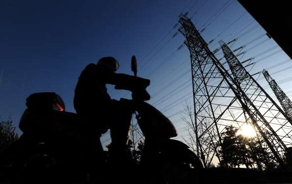

近期，就“私营经济退场、共享民企利润”等言论，引发舆论反弹。（AFP/Getty Images）

【大纪元2018年09月28日讯】（大纪元记者古清儿综合报导）就“私营经济退场、共享民企经营利润”等言论引舆论反弹。日前，中共前总书记胡耀邦的长子胡德平刊文批评，在民有经济遇到困难下，迫其走上公私合营之路，那后果是很可怕的。

在中美贸易战不断升级、民企日子艰难的时候，9月11日，大陆“资深金融人士”吴小平表示 “私营经济已完成协助公有经济发展，应逐渐离场”，舆论哗然。

近日，中共人社部副部长邱小平在召开的全国“深化民营企业民主管理，增强创新发展内生动力现场会”上，要求“私企的党组织要领导工人共同参与管理，共享企业发展成果”。此言一出，让人瞠目结舌。

9月27日，胡德平在《中国民商》杂志10月刊以“警惕打着共享的旗号搞新的公私合营”为题发文，炮轰中共党内保守派。

就吴小平的“私营经济退场论”，胡德平质疑，难道多种所有制经济的发展，只是为了公有制经济的发展吗？为“协助公有制经济发展服务”，公有制又是为谁服务？他认为吴小平似乎在“说反话”。

对于邱小平的言论，胡德平表示，某副部长说的“职工与企业机制共建，效益共创、利益共享、风险共担”，这不是打着共享、民主的旗帜搞“大锅饭、铁饭碗、刮共产风”吗？这和国有企业有什么区别？

9月26日，大陆《经济日报》刊文力挺国资进入民企。文章说，截至目前，已有40余家上市民企发布控股股东股权质押触及或跌破平仓线的公告，其中10余家公司采取紧急停牌的方式自救，部分公司则主动向国资背景股东“出让”控制权自救。

文章说，紧急停牌可以说是权宜之计，而出让控制权的做法，不但有利于补充流动资金，缓解质押平仓风险，而且这种高溢价的成功转让，往往会对股价形成利好，从根本上缓解质押平仓风险，延长企业存续期。

对此，胡德平批评，在一个非公平市场上，中共的主流媒体要正视民营企业遇到困难，“千万不要拿民营企业被迫认可的办法，当作成功的案例予以宣传。”

面对反对私营经济的声音，胡德平认为，当今“仍用一条挤压民有企业，迫其走上公私合营之路。如果形成一股潮流，无人敢提批评意见，那么后果将非常可怕。”

从今年1月以来北京人民大学马克思主义学院博士生导师周新城提出的“消灭私有制”，到吴小平、邱小平的言论，激起舆论的抨击和愤怒，更让所有民企如“待割的韭菜”。

不久前，中共社会科学院前副院长、国家金融与发展实验室理事长李扬痛斥“国进民退”现象。他表示，现在民企生存艰难，到了不并入国企活不下去的地步。

大陆知名经济学家吴敬琏批评中共的经济改革没有完全到位。“今年年初说是要消灭私有制，最近又是要退出（即私有制退场论）。这都是一种不谐和的声音。”

根据Wind的不完全统计，从今年初至今A股公司中，355家公司已经或计划发生董事长变动（同期港股102家），95家公司涉及实际控制人变动，49家公司的企业属性发生变化，企业属性变化数量超过了2017年（47家）。

梳理数据可以发现，公司属性发生变化的企业中，民企转变为国企的占比过半。今年公司属性发生变动的49家企业中，民企占比高达89%。其中民企属性转为国企的有26家，占比53%。

面对夹缝中生存的民营企业，律师陈有西曾直言：“中国的民营企业永远是会走在通往监狱的路上。”

大陆微信公众号“兽楼的江湖”的文章说，“民营企业是私人企业，私营企业凭什么要让他人插手？你国企都做不到的事，凭什么让民营企业去做？”“私企老板拼死拼活九死一生创下的企业。稍微用脑想想就知道，他们会自愿献给别人吗？我辛辛苦苦耕田自己吃，你却说要我们一起吃……”＃

责任编辑：李沐恩

<a href=#list><h6 align="right">回目錄</h6></a>
   

 
<a name=b3><h2>杭州派官员进驻阿里巴巴等百家私企</h2>
 

近日，中共杭州市政府将100名官员进驻阿里巴巴等第一批100家大型私企。有网民表示，中共开始吞并私企了。 图为在杭州的阿里巴巴总部。(WANG ZHAO/AFP/Getty Images)

【大纪元2019年09月22日讯】继中共强推国企和民企混改后，近日，中共浙江省杭州市政府将抽调100名官员，进驻阿里巴巴等第一批100家大型私企，作为“政府事务代表”。有网民认为，中共开始吞并私企了。

根据中共浙江省政府新闻门户网站“浙江在线” 报导， 9月20日，杭州市举行全面实施“新制造业”动员大会，会上发布了“新制造业计划”。中共杭州市政府将抽调100名官员，进驻阿里巴巴、吉利控股、娃哈哈等第一批100家大型私企，作为政府事务代表。

中共杭州市政府声称，此举是为了所谓的“服务重点企业”，“为企业协调解决各类政府事务”、“项目落地推进”等。

根据会上发布的“关于实施‘新制造业计划’推进高质量发展的若干意见（征求意见稿）”，未来，杭州将重点培育引进生物医药、集成电路、新能源新材料、高端装备等战略性新兴产业，改造提升机械、化纤、化工、橡胶、纺织、服装等传统制造业，保护传承丝绸、茶叶、工艺美术、中药等经典产业，全面整治“低散乱”企业和淘汰落后产能。

以上信息引发网民热议：“公私合营再上演。”“要国有化啦。”“所有领域都想进驻、占有。”

“ 成立党支部还不够？中共直接派人插手民企了。”“（民企）要完的节奏！”

“那就把《企业法》改成必须有政府派驻代表呀，一个屁就把宪法改了，改个《企业法》洒洒水啦。”

“中国法治就是笑话，人治大于法治，中共都不把宪法放在眼里了，想也知道不可能会遵守，为了利益什么都敢做。”

“养肥了都要宰的节奏，或早或晚。”

“辛辛苦苦奋斗一辈子，到头来死在了中国梦里边。”

“就只有中国特色才会这么干吧。”

“嘴上说要制造一流营商环境，做的却是背道而驰。”

“大企业开始了，小企业还能幸免么？”“细思极恐。”

“这么个搞法，马云才提前退休的。”

“以前有句话，企业做大了就不是自己的，现在看那俩马，我觉得企业做大了，命都不是自己的！两盘马肉是前菜，接下来还有郭广昌（复星集团董事长），王健林（万达集团董事长），井盖许（恒大集团创办人许家印），赵格格（赵薇），史玉柱（巨人网络董事长），碧桂园……好好排队啊，一个个来。”

上述网民说的“俩马”是指（刚卸任的）“阿里巴巴董事会主席马云”和“ 腾讯董事会主席马化腾”。

近日，马云正式从自己创建的阿里巴巴集团退休，外界普遍认为马云是情非得已。10天后，马化腾也卸任腾讯旗下“腾讯征信”法定代表人。英国《金融时报》报导说，阿里和腾讯曾拒绝交付客户贷款数据给中共官方成立的机构，疑因此马化腾被迫走人。

前财经记者刘先生对自由亚洲电台表示，官方一定会将金融掌控在自己手里，并且从马云，再到马化腾，无论是官方为掌控金融，还是内部的利益争夺，都会在大型民企内出现愈来愈多的变革。

刘先生说：“在中国的环境里，不给的话，（中共）分分钟弄死他。现在是重新回到共产党建政的时候，安邦被没收了8、900亿的资产。”

有评论人士说，目前，美中贸易战正在加速中国经济下滑，而经济危局很可能引发政治危机。 中共担心自己随时都可能垮了，在做末日挣扎。

大纪元专栏作家张翎燊表示：这个党正上演着最后的疯狂，可无论它怎样疯狂也挡不住时代的进步。终有一天，共产党会被送上历史的断头台！#

责任编辑：心鉴

<a href=#list><h6 align="right">回目錄</h6></a>
   

 
<a name=b1><h2>网文：深度揭秘中国顶级富豪逃跑计划</h2>
 

去年，大陆富豪将数百亿美元注入包含开曼岛在内的离岸信托。图为大开曼岛乔治城 (David Rogers/Getty Images)

【大纪元2019年07月28日讯】因对中共不放心，尤其是去年中共声称私有企业已经完成了历史使命，令大陆私营企业家异常忧心，这加速了大陆富豪把资金转移到海外。日前有大陆财经人士撰文揭示了大陆富豪的资金逃跑计划。

以下是《刘强东如果离婚，奶茶能分到多少钱？深度揭秘顶级富豪的逃跑计划》一文。

前段时间，刘强东明尼苏达州一案闹得很厉害，其中有一个话题很热：如果刘强东和奶茶妹离婚，奶茶妹能分到多少钱？

获得认可度较高的一个回答是：能分到2块钱和一半的婚后房产。

婚后房产这个不用多说，这个2块钱是怎么一回事呢？

原来在刘强东领证之前的五月份，京东董事会投票通过了关于刘强东的十年薪酬计划，在未来十年内，刘强东的年薪只有一块钱，奖金是零元!也就是说在结婚四年里，刘强东的工资只有4块钱，奶茶能拿走一半，即2块钱。

那刘强东的其余资产去了哪里呢？这里就不得不提到一个东西——离岸信托。

<b>离岸信托——顶级富豪的逃跑计划</b>

根据公开报道，在中国已经有10位顶级富豪将5000亿的资产转移到离岸信托中，其中就包括刘强东、马云、孙宏斌、雷军等知名企业家。

2014年，在京东赴美国纳斯达克上市，公司注册地为开曼群岛，这个地方大家想必都听说过。而也就是在上市前3天，刘强东所持的京东股权全部转变成其创立的离岸家族信托持股。截至2017年底，总值达333亿人民币。

无独有偶，马云也做了同样的事情，截至2017年，马云持有阿里巴巴167159739股权益，但其中只有0.2%在马云个人名下，另外的99.8%全部以离岸家族信托、海外慈善基金会、开曼控股公司形式控制，其中离岸信托独占其中的64.4%，当时的市值为1119亿人民币。

其他富豪，融创中国的孙宏斌转入了459亿，小米的雷军转入了560亿，拼多多的黄峥转入了882亿元，美团的王兴转入了188亿元。

<b>为什么他们纷纷选择离岸信托？</b>

离岸信托，简单来说，就是一个中国公民在中国以外，设立的一个信托机构。

富豪们把自己名下的股票、房产等转给这个信托机构之后，他们在中国就变成了没剩下多少钱的“穷人”。但仍可以通过别的方式管理这些信托资产。

之所以如此多的富豪都选择将一部分资产转入离岸信托，就是因为离岸信托有很强的保护作用，能够在个人资产和信托资产中间树立起一道屏障，不论国内发生任何情况，都不会对离岸信托中的资产造成影响。

离岸信托主要有四个作用：

1.避税。 

2.避免离婚分财产。 

3.避免财产归零。 

4.有利于后代低税继承财产。

离岸信托中股权所对应的财富，从法律上来讲都不是属于富豪个人的，在征税上也就没有划分在应征税额范围内，能够很好的避税。

另外，离岸信托中的资产，只要配偶不在家族信托受益人的名单里，那么离婚后配偶是无法分割其资产的。

而且，即使这些富豪生意上遭受什么损失，或者遇到其他的情况，变成一无所有的穷光蛋，离岸信托中的资产依然不会有损失。

最后，离岸信托可以规避企业在继承过程中因为复杂的继承程序，而出现高额的税收，这样的损失往往大的惊人。

离岸信托最开始还是从李嘉诚这流出来的，布局英国、迁址开曼、资产转移至家族信托，他为此准备了20年。

就像网上很好笑的一个段子：几位顶级富豪和李嘉诚一起比赛，大家都觉得李嘉诚老了腿脚不好，结果他跑了第一，大家都很奇怪，李嘉诚大笑道：谁让你们听见枪声才跑的···

在四年前，已经年逾古稀的李超人，慢悠悠的说了这样一番话：

“我今年87岁了，已经是古稀之年，安全比利润对我来说更重要。我从来就不是大家说的是什么超人，我可能算是一个成功的商人，但我其实更是一个普通的人，甚至是一个老人。”

“我希望我的人生能画上一个完美的句号，而不想在晚年再横生枝节。我也希望我的家人和我的商业在我故去之后，正常运转，得到良好的继承。”

也许，做一个穷人也是挺快乐的，你说是不是？

责任编辑：刘毅

<a href=#list><h6 align="right">回目錄</h6></a>
   

 
<a name=b2><h2>程晓容：9月新闻透警讯 中共动手侵吞民企</h2>
 

图为阿里巴巴标识。(AFP)

【大纪元2019年09月23日讯】“我们在很短的时间内就把资本家的全部财产拿过来，约计全省私营工商业的资金有1亿9000多万，现在被我们拿过来了，国家发了一笔洋财。1亿9000多万元相当于19多亿斤大米。广东年产大米是18亿斤，即几天时间被我们共了一大笔财产。”1956年2月3日，时任中共广东省委第一书记陶铸在资改工作座谈会上这样讲。

60多年前中共发动的“公私合营”，是对民族资本家的一次惊天大抢劫。今天，这一幕又要上演吗？

<b>9月新闻的震荡</b>

9月10日，马云正式卸任阿里巴巴集团主席。9月19日，陆媒报导，腾讯董事会主席兼CEO马化腾于近日卸任腾讯征信有限公司法定代表人及执行董事。同一天，英国《金融时报》发表文章，引述两位知情人士的消息说，阿里旗下的芝麻信用和腾讯征信曾拒绝与政府支持的百行征信有限公司合作，不愿意向其提供自己所掌握的大量客户贷款数据。

9月20日，杭州市政府宣布，将抽调100名机关干部，向阿里巴巴、吉利控股、娃哈哈等首批100家重点企业派驻“政府事务代表”。官方称，此举是为了服务重点企业，为企业协调解决各类政府事务等等。

另据美国律师、人权工作者韩连潮博士披露，在山西太原某区，当地政府已开始试点，派驻会计接管私企的财务。

此外，9月19日，电动汽车创业公司“拜腾”（Byton）创始人和前首席执行官毕福康（Carsten Breitfeld）对媒体透露，他之所以在今年4月离开公司，是因为中国第一汽车厂对“拜腾”投资后，中共政府对公司进行了非常严重的干预，“一汽”直接撤销了他的职权。

稍早，今年6月16日、7月31日，中共新上任的国资委主任郝鹏，分别会见了马云和马化腾，对两人都提及央企与互联网公司加强合作的混改模式。此举被中国内地媒体普遍解读为，官方要求“二马”带头实行公私合营。

如今，“二马”双双“被交班”，业内分析，这显示出官方开始全面接管垄断信贷资料。很明显，中共正在收紧对私有资产的控制，新一波公私合营的寒流已不是“天气预报”。

<b>惊悚的共产——公私合营</b>

从1953年起，中共对资本主义工商业进行大规模的“社会主义改造”，推行“公私合营”，即把私人拥有的产业划归共产党，美其名曰将资本家转化为“自食其力的劳动者”。当时，由于企业的生产原料、销售市场以及银行、铁路等关键部门全部被政府控制，加上中共的欺骗宣传和强大的政治压力，全国各地的私人业主无路可走，被迫对合营表示“拥护”，忍痛将世代财产拱手送上。

从1956年起，“国家”以“定息”制度，不论工业或商业，不论企业规模、盈亏，按照企业合营时核实的私股股额，每年支付资本家年息5%的股息（低于定期存款的年利息），一共发放了10年。至1966年9月，定息年限期满，公私合营企业最后转变为社会主义全民所有制。

就这样，未经任何合法手续，仅凭党的几份文件，私营股份被“没收”为国有，中共轻松地以所谓“赎买”之名“消灭”了整个民族资产阶级，并且埋葬了许多传统企业和品牌。据不完全统计，在这场“翻天覆地”的“革命”运动中，全国有几千工商业者被逼自杀。在上海，四个月里即有876名资本家跳楼身亡。

<b>党领导一切</b>

2011年，中共官方统计的数据显示，民营经济总量占GDP比重已经超过一半。2018年5月，根据中国著名经济学家林毅夫提供的数字：2017年，中国的个体、民营经济对税收贡献了50%以上，对城乡就业的贡献率达80%。

2018年6月15日，中共证券监督管理委员会公布了新修订的《上市公司治理准则》，新增一项“上市公司加强党建”，该版本再次强调，国有控股上市公司要“把党建工作有关要求写入公司章程”。此改变被说成是“中国特色公司治理的重要内容”。

2018年11月，中共发布了《中国共产党支部工作条例（试行）》（简称《条例》），要求凡是有3个党员以上的基层单位都需成立党支部，包括专业市场、商业街区、商务大楼等。

去年9月，有媒体报导称，中共国资委、地方国资委以及包括中央事业单位在内的“国资系”正在参与或已经完成了二十多家A股上市公司的控制权交易。“在国资作为受让方的股权转让中，近六成转让方式为无偿转让或行政划拨。”

以上信息说明了什么？中共全方位地加强党的领导，加强对全国民众，包括各类企业的控制，民企、私企、外企，都是它的刀下鱼肉。实力雄厚的民营企业被喻为“肥羊”，中共磨刀霍霍。

事实上，中共治下的“中国特色”，就是中共的偷、骗、抢、控等流氓招术。维持极权统治，维护和扩大利益，乃是其根本需要。为达此目的，所有人都是它利用、欺骗和侵害的对象。企业利润，技术创新，你的一切成果，甚至你的生命，党随时都可以夺走。

从公私合营到百分百中共党控，从在企业建立党支部到派驻党代表，从逼死资本家到逼退外商和本国商业大佬，中共的本质从未改变。中共的生意经里，不存在互利双赢的概念。即使你加入中共，向党表忠，一旦党国需要，宰割你的时候绝不会犹豫。

马云退场等一连串商界新闻是对所有人的警钟——中共漠视人的尊严，无视法治，践踏公平道义。与它共舞，必然在劫难逃。#

责任编辑：高义
  
  
 
<a href=#list><h6 align="right">回目錄</h6></a>
   

 
<a name=a32><h2>武警黑道合作 香港开启戒严状态  </h2>
 

中共顾忌出兵或戒严会影响台湾选情及国际制裁
 

 
  
香港反送中抗争至今，中共虽不出兵，但经由利用警察、黑帮势力作为打压工具，香港其实已经进入了戒严状态。（大纪元合成图）
 

 
【大纪元2019年09月20日讯】（大纪元记者吴雪儿香港综合报导）6月9日至今，香港反送中逾100天。在运动初期，中共因忌惮国际社会而不敢直接出军队镇压。时至今天，台湾总统大选越来越近，中共更不能直接出动军队，深恐影响台湾选情。然而，虽不出兵，但中共经由利用警察、黑帮势力作为打压工具，香港其实已经进入了戒严状态。

 
 
<a href="https://youtu.be/_k8DDb7iLIE"> https://youtu.be/_k8DDb7iLIE </a>
 

 
反送中运动中最突出的是警察的角色，大部分香港人认为香港警察已经不是他们以前所认知的警察了。香港经历了6·12警察首次开枪镇压抗争者、7·21“警黑乡恶”勾结无差别暴力殴打市民、8·31警察冲入太子站无差别暴力殴打市民等，一系列的警察滥捕、滥暴等滥权行为，令香港变成军警城市。

 
  
8月31日，香港警方在铜锣湾拘捕一名抗争者。（大纪元）
 

<b>警权无限 滥捕滥暴 扬言使用实弹枪械</b>

9月10日，警方有内部通告，为配合代号“踏浪者”行动的需要，港府购买了10,000支警棍，已于10日发放给休班警察，以备随时可以对反送中抗争者采取行动。

9月14日，有白衣人拿着疑似伸缩警棍在淘大商场制伏男子；在乐华邨巴士站亦有两名持警棍、有佩枪的便衣者，将两人制伏在地，当场巴士车长要求便衣者出示委任证，却被在场军装警员指会投诉他阻差办公。

香港警察队员佐级协会于9月16日指称抗争者有组织地以汽油弹攻击值勤警察，严重威胁警务人员及其他市民的生命安全。协会主席林志伟还称，若港警值勤时遇上突发事件感受到威胁，应当果断使用适当的武力制止，包括实弹枪械。

<b>利用黑帮挑衅民众 激起群殴混战</b>

除了利用警力进行滥捕、滥暴，选择性执法外，中共还利用黑社会力量制造混乱。7·21元朗袭击事件是一个开端。

上星期六（9月14日），香港多地出现集会。当天发生多起亲共人员围殴香港抗争者事件。亲中者举中共五星旗，唱中共国歌力撑警察。他们大多穿蓝衣，似有组织的行动。

许多网络流传的影片显示，这些扛着国旗的蓝衣男子在用拳头、脚、棍棒围攻一群试图劝阻他们行动的年轻人，让过路的人目瞪口呆。法新社记者就此查询香港警方，警方拒绝发表评论。

《苹果日报》报导，多次采访反送中运动的英籍记者理查德·斯科特福德（Richard Scotford）在Facebook贴出一张对话截图，对方引述一个“可信消息”指有逾百名香港及澳门黑社会成员当天下午3时将到淘大商场集合唱中共国歌，但实际目的是制造“7·21元朗恐袭2.0”，意指将会再发生无差别袭击市民的事件，叮嘱理查德要小心。

9月15日晚上在北角、炮台山一带发生多宗打斗及袭击记者事件，多人受伤。晚间8时左右，有十多名福建帮男子，在警方推进防线时和警方一同并肩前进，高呼“福建人加油”、“来，北角杀一场”，有路人告诉记者，这帮福建男子撑警。

之后这批人手持铁通、折凳在炮台山站外不时挑衅一般民众，爆发冲突，双方打斗在一起，变成群殴混战，有的人被打倒在地，多人被打伤。之后警方赶到，查看了部分福建帮男子的身份证后当场放行，引起现场民众对警方的不满。

被指是7·21元朗无差别打人事件的幕后推手、立法会议员何君尧将于本周末再次策划一场争议性活动：9·21“全港清洁活动”，到18区去清理连侬墙，适逢18日何君尧首次有马出赛，网民要入场“支持何老大爱驹”， 马会也因此取消了当天的赛事。

<b>用“鬼”渗透瓦解 恐怖袭击防不胜防</b>

香港警方于8月11日晚疑似假扮抗争者，于铜锣湾地区挑起冲突，并配合防暴警察逮人，多名当天在场的抗争者15日接受香港“商业电台”节目访问时证实，确实有身形魁梧、打扮与抗争者相似的黑衣人，以命令语句，而不是以互相商讨的方式，煽动他们进行破坏警车等暴力行为。

 
  
8月11日，香港北角出现大批福建帮，在街上造成干扰。（大纪元）
 

 
  
北角福建帮与香港警察关系良好，被民众批评警方对他们执法不公。（大纪元）
 

有抗争者其后接受媒体采访表示，11日晚间10时左右，他们眼见铜锣湾已经没有多少抗争者，换衣服打算离去时，突然有一群打扮状似抗争者的黑衣人上前，持伸缩警棍攻击，尝试把他们制伏，且不到1分钟后就有速龙小队现身配合。抗争者形容说，警方在当时一切大致和平时派卧底作出挑衅、煽动等行为，做法如同教唆。

8月31日，有影片拍到数个涉嫌假扮抗争者的警察（因这些“抗争者”被拍到在一处与警方汇合）在铜锣湾向街道丢汽油弹，疑似为了抹黑反送中运动及煽动暴动，扮成抗争者，他们背后或身上有红色LED灯做记号。据前线记者说，当天有很多丢汽油弹的黑衫人士，都带有这种记号。

 
  
8月31日，有影片拍到数个涉嫌假扮抗争者的警察，背后有红色LED灯记号，在铜锣湾向街道丢汽油弹。（大纪元）
 

中国时事评论员晨钟表示，目前香港的情况与戒严没什么差别。他认为，这种由警力黑帮组成的镇压民众力量比戒严更差，“戒严由军队执行，有清楚界定的行为，现在是一团糟，与恐怖袭击没有什么分别，突然身边可以冒出一个没有辨识的人说自己是警察，你相信他还是不相信他？谁在扰乱社会？黑帮治港就不是今天的事，早在梁振英时期已经有，只是现在很严峻。” 

 <b>从年轻族群到社会各界 不屈从高压威吓 </b> 

分析认为，港府一系列手段均采用中共政法委镇压民众的邪招——当社会处于越来越混乱的失序状态时，市民开始感到生活没保障，最后忍受不住会“跪求”政府出手“止暴治乱”。因此香港人在争取自由的运动中，需要清晰地认识到所面对的对手不仅仅是一个独裁政权，而是一个积累近百多年整治人邪术的共产魔鬼。 

香港人面对今天香港的局面，一次又一次地以行动向世界表明，他们不会屈从于高压威吓。

反送中运动是香港社会在2014年的雨伞运动后又一个牵动整个社会的运动，从6月9日的100多万人到6月16日的200万人到8月18日的170万人走上街头，香港人积极而清晰地表达诉求 。过程中有和理非和勇武派，“不割席”，大家各自努力，总体来说，香港人向世界展示了和平、理性、非暴力的社会公民本质。

当年推动雨伞运动时有很多年轻人参与。今年在反送中运动开始，冲在前线的大多数也是年轻人，但随着运动的发展，香港人被迫在“一夜间”发现，他们信赖的警队已经悄然变成中共维稳系统政法委的打手，而且专门针对年轻人粗暴打压，两制的香港文明已经名存实亡！如此以来，不少本来中立，或是不理解的市民看在眼里，有感不能只让年轻人承受，所以妈妈、老师、医护界、金融界等先后站出来抗争。

一位六十多岁的老爸，3个儿子在雨伞运动时都走出来，当时他不理解，觉得儿子们在搅事。这次反送中运动，28岁最小的儿子更说要做死士，辞掉了几万月薪的IT工作上街抗争。儿媳天天哭，后来下决心自己装Facebook，看了两个月相关讯息，了解情况后跟老爸说明，老爸明白后，向儿子们道歉，还给了儿子10万元以示支持。

 <b>香港抗争感动世界 看清共产极权本质 </b> 

香港人的和平抗争感动了世界，因为面对中共残暴政权，却敢以鸡蛋碰高墙。一时间香港都是“64坦克人”。

除了作为金融中心，香港也是中国与国际接轨的最前沿，中共在中国境内对中国民众的残暴不时在网上看到，但这次在全世界众目睽睽下，看着中共邪术在一个被认为是文明社会里开展，还是第一次。华为事件唤起了国际社会对中共野心的忧虑，香港的遭遇更让世界深感中共对文明社会的威胁，这也是反送中运动触动国际社会的原因：香港人用血汗和泪水，在恐惧和威胁下一次次撼动残暴政权，让世界看清共产极权的本质。

白宫前首席策略师史蒂夫·班农（Steve Bannon）接受了美国新唐人电视台的专访时说，现在世界上发生的事情，没有比香港更重要。“在世界政治中，这是焦点，未来几天和几周内会发生什么，将会对未来十年，二十、三十、四十或五十年的世界产生巨大影响。”#

 
  
<a href="https://youtu.be/_xDQs5M7lHw"> https://youtu.be/_xDQs5M7lHw </a>
 

责任编辑：连书华

<a href=#list><h6 align="right">回目錄</h6></a>
   

 
<a name=a31><h2>香港人权法案若通过 对大陆和香港有何影响   </h2>
 

 
  
美国众议院议长佩洛西与史密斯议员会见香港代表黄之锋、何韵诗、罗冠聪等人。（佩洛西直播视频截图）
 

 
 【大纪元2019年09月20日讯】（大纪元记者骆亚、张顿报导）美国国会正在着手推动通过《香港人权与民主法》。对此，专家们认为，该法案一旦通过并予以实施，香港可能会失去国际金融中心地位，而且中国经济也将会受到严重影响。

 
 9月18日，美国众议院议长佩洛西（Nancy Pelosi）协同共和党、民主党的众议员及香港众志秘书长黄之锋、常委罗冠聪，以及香港歌手何韵诗在美国国会召开记者会，支持国会通过《香港人权和民主法案》，支持港人对正义和自由的追求。

华裔专家、悉尼科技大学冯崇义教授对大纪元记者表示，美国现在正推动通过《香港人权和民主法案》的目的，就是如果中共对香港动武，用武力来改变原来港人拥有的和平示威的权利，美国认为那是一条红线，如果过了这个红线，美方就取消香港的特殊地位。

<b>香港无优惠待遇 金融中心地位将不复</b>

冯崇义说，如果美国取消香港的特殊地位．香港就像中国内地的城市一样，不再拥有优惠。例如现在美国对中国的商品加征关税，而香港出口美国的产品是不征税的，如果香港的地位被取消了，那香港出口美国的商品也要征税。

目前，美国对2,500亿美元的中国商品加征25%的关税，从10月15日以后，该关税将升至30%；对余下价值3,000亿美元的中国商品，分两批征收，税率都是15%，第一批是从9月1日起对1,200亿美元的商品，第二批是从12月15日开始对1800亿美元的商品。

冯崇义教授表示，如果美国不给香港特殊地位，对香港的一些外国公司、股市、金融机构都会有一连串的影响。香港是国际金融中心，如果它的优惠条件不复存在，一些大的跨国公司都会把总部撤出香港，不设金融机构，那么香港的地位会发生重大的变化。

目前，香港是仅次于纽约、伦敦之后，国际第三大金融中心。由于香港实施的是资本主义制度，拥有独立司法制度，因此不少跨国公司和国际大银行在香港设有总部。

<b>中国经济将遭受严重影响</b>

冯教授说，如果香港的地位不复存在，跟大陆城市一样了，对中国经济是雪上加霜，中国整体经济更加恶化。

首先是对外资进入中国的影响。近几十年来，中国从香港引进外资，一直维持在50%左右。因为中共的法律不独立，对外资的保护力度不够，所以外资都是先在香港注册一个公司，然后再进入中国大陆。

如果香港跟大陆一样了，这些外资公司就不会去香港注册，那么外资公司没有安全保护，就会干脆切断跟中国的经贸关系，中国就会失去这些外资。

中共全国人大财经委副主任黄奇帆近日披露，过去几年，中国每年引进外资1,000多亿美元，而从香港引进的外资占了54%、55%左右，而且中国从香港引进的外资比例在近几十年以来一直不变，都维持在50%以上。

其次是对中国出口的影响，因为香港是一个转口贸易，中国出口的很多东西通过香港来避免经济制裁，那么如果美国取消香港的特殊地位之后，这一块就被堵死了。对中国的进口或出口同时都会有重大的影响。

据黄奇帆披露，香港去年和中国大陆之间的贸易总额达到7,000亿美元，相当于美国与中国之间的贸易总额。

<b>法案意在威慑中共</b>

9月17日，香港众志秘书长黄之锋、艺人何韵诗等人，在美国国会听证会上呼吁，要求美方尽快通过《香港人权和民主法案》，协助香港人守护自由与家园，对抗中共的暴政入侵。

黄之锋在听证会上说，中共在消除香港的“一国两制”的同时，收获经由香港在全球经济地位而得来的利益。黄之锋说，北京不应该鱼与熊掌两者兼得。

时政评论员石实表示，港人呼吁美国国会尽快通过《香港人权和民主法案》，其目的就是要利用西方监督、制衡中共，意在维护香港的“一国两制”，确保中共履行它对港人及全球做出的承诺：“港人治港，高度自治”，香港资本主义制度50年不变。

石实表示，美国如果通过该法案，就是威慑中共，如果它继续剥夺港人的人权、民主、自由及法治，美国将剥夺香港的优惠地位，如此中国经济将受到重创。

目前美国议会推动的《香港人权和民主法案》，是美国1992年通过的《香港政策法》的配套法案。

当时，《香港政策法》赋予香港有别于中国大陆所有地区的“独立关税区”地位，使香港可以自由兑换美元，可以自由买卖许多美国的商品、技术、金融服务等优惠政策，是以中共信守对香港的“一国两制”的承诺为前提。

美方如果认定香港社会一旦失去了《香港人权及民主法案》要求的足够自治权，那么美国国会就可以投票决定中止《香港政策法》，暂停给予香港特殊关税区与其它特殊优惠地位。

《香港人权与民主法案》主要包括：美国每年都需对香港自治地位进行审核，看其是否符合继续享有美国提供的优惠待遇；如果香港以后制订与国家安全相关的法令，美国总统与国务卿要审视这些法令，看是否有抵触《中英联合声明》以及香港市民和外国居民的人权是否会受到限制；对打压香港基本人权、自由、民主的责任人进行制裁，冻结他们在美国的资产，并拒绝其入境美国等。

法广及美国之音报导称，美国两党议员致力推动的《香港人权与民主法案》，令中共如芒在背。

分析人士指出，法案一旦通过，香港独立关税区地位会由美国目前自动维持的安排变为“每年一检”，并设立机制制裁损害香港高度自治的官员及相关人士，这对香港影响极大，对北京影响也不小。谁都知道，香港自治地位保不保，根本的决定权在北京。#

责任编辑：孙芸

 
 
 
 <a href=#list><h6 align="right">回目錄</h6></a>
   

 
<a name=a30><h2>美议长力挺香港人权法案 向中共释强硬信号   </h2>
 

 

 
【新唐人亚太台 2019 年 09 月 19 日讯】周三，美国众议院议议长佩洛西，在国会欢迎香港活动人士。她表示，将在众议院快速推进《香港人权与民主法案》，保护港人应享有的民主自由，并强调不会让商业利益影响美国政策。

周三上午，美国众议院议议长佩洛西率领多位两党众议员召开记者会。

美国众议院议议长 Nancy Pelosi：“美国国会将迅速推进跨党派支持的《香港人权与民主法案》。”

议员们指出，《香港人权与民主法案》向北京发出强烈信号，也显示美国对于人权、民主与自由价值的承诺。

美国众议院外委会主席 Eliot Engel：“中共政权不会被免于追责。他们使用暴力和胁迫，践踏港人的基本自由、言论、集会和抗议自由，这些是由法律保证的。”

美国众议院外委会首席议员 Michael McCaul：“这是一场民主与专制之间的战斗，自由与暴政间的战斗，自由和压制之间的战斗。”

《香港人权与民主法案》今年6月在参众两院，分别由鲁比奥(Marco Rubio)和史密斯(Chris Smith)两位议员提出，得到两党众多议员联署。这项法案过去曾被提出，但受到商界阻挠。

美国众议院议议长 Nancy Pelosi：“如果我们由于商业利益而不发声、不支持中国人权，我们就失去了在世界任何其它地方为人权发声的道德权威。”

黄之锋等香港活动人士感谢国会议员的支持，并表示香港人民将为自由民主坚持抗争。

香港歌手 何韵诗：“这一法案非常及时。它显示出，这真的是一场全球性的抗争，而香港就在抗争的最前沿。”

记者：“接下来，这一法案将在参众两院相关委员会进行讨论，通过之后再通过两院大会进行辩论投票。

新唐人记者王凯迪美国首都华盛顿报导。” 
 
 
  
<a href=#list><h6 align="right">回目錄</h6></a>
   

 
<a name=a29><h2>香港反送中运动百日 民间诉求转向驱逐中共   </h2>
 

  
 9月8日港人挤爆遮打花园为香港民主和人权法案祈福，喊出“驱逐共党，光复香港”。（大纪元）

  
  
  【大纪元2019年09月18日讯】（大纪元记者骆亚综合报导）香港反送中运动从6月开始至今已有百日，从最初撤回送中条例、林郑下台等五大诉求，随着林郑政府瘫痪、港警的滥抓滥捕、甚至8·31太子站恐袭市民，民间的诉求已转向“驱逐共党，光复香港”。 

香港的民间反送中运动自今年6月9日百万民众上街游行以来，范围逐步扩大，遍地开花。在警方的暴力镇压下，民间走上街头的和平集会游行也开始演变成抗暴行动。

人们在游行集会时呼唤的口号也逐步转向。从开始的撤回送中条例、林郑下台的主旋律，开始越来越强调“真普选”、“五大诉求，缺一不可”，直接针对操控林郑政府背后的中共政权。

前不久港人为了《香港人权与民主法案》祈祷，再度挤爆遮打花园。现场民众除了举牌“驱逐共党光复香港”外，众人不断喊出同样内容的口号，这是民间的五大诉求之外的一个新的转向。

就反送中运动百日，民间的诉求转向，北京吴姓大学生接受大纪元采访表示这种变化很自然。

他说：“运动一开始的主要诉求是‘反送中’，但是警察的暴力镇压激化了社会矛盾，年轻人也越来越看到香港各种问题的根源在于中共专制体制一直试图控制香港，所以会喊出‘驱逐共党，光复香港’的口号。”

香港青年大卫·吴（David Ng）也认为这是必然的发展，“显示香港人已经认识到香港政府的傀儡性质，中共才是香港一切乱局的根源。”“只有直接追究，并制裁中共当局，才能解决香港的深层次乱局。”

<b>艺人公开表示不爱党 信不过党</b>

近日也有艺人、电影监制、演员何骏怡公开表示，不爱党，中共越打压港人越出来。

他向大纪元记者表示：“我爱港也爱国但不爱党。这三者是分开的，不是一体的。因为这么多年来，他们（中共）显示给全世界，他们究竟有多黑暗、究竟有多反口覆舌，怎么能信得过？！”

他强调，“现在就算有独立调查委员会也好，我们争取的东西也好，都是本来就该有的，不是需要我们去争取的。”他讥讽中共当局：“是不是过了一年半载，说广东话都要去争取啊？！”

他还警告说，“你越打人，你觉得香港人不会再出来？对不住啊，你越打香港人越会出来。除非你杀死我们6百万香港人。”

有港大的学生近期接受大纪元采访时也表示，大陆民众要想过上民主自由的生活，就要学习港人的勇敢，起来抗争推翻中共暴政。

<b>陈方安生：北京应该让香港实行真普选</b>

就香港市民的抗争中出现的一些暴力行为，香港前政务司司长陈方安生近日接受BBC采时表示，“特区政府和北京政府很容易令暴力停止，就是聆听香港人的声音。哪个政府、哪一个负责的政府会拒绝聆听两百万民众的声音？那可是香港四分之一的人口。”

她认为尽管林郑撤回修例，但是在民间连续的三个月示威之后才同意撤回，而这才满足了民间五个诉求之一，并且公众的情绪已经从《逃犯条例》转到更严重的问题，追究产生这场政治危机的根源。 

  
 

  
香港前政务司司长陈方安生接受BBC访问。（视频截图）

  
她也解释自己非常支持这场运动的深层原因，“那就是香港人在捍卫基本的公民自由，并且要求政治参与，希望在一人一票的基础上展开公平、公开的选举。而这一切都是联合声明和香港的小宪法《基本法》所赋予的。”

她建议，中国在不久的将来尽快向普世价值靠拢，尤其是对人性尊严的尊重以及基本的权利与自由，这对整个国家及世界都有好处。

她还强调，“北京应该让香港实行真普选，我们将看到自由民主在香港取得成功，到时北京官员可以利用香港模式来建立一个能够满足整个国家利益的代议制政治模式。”

她还“将军”说：“如果我们从运动中取得成功，那北京也可以把整个成功视为一国两制的成功，并且从长远来看，我希望我的国家可以学习一些普世价值。”

近日民间记者会上发言人也说，特首林郑下台也不可能挽回香港人的信心，只有落实真普选，选出由广大巿民授权的新政府，才能彻底解决问题，还大家一个有公义的香港。

<b>“只有中共下台才能让反送中运动平息”</b>

北京的吴姓大学生认为，香港的这场反送中运动应该会长期持续下去，“因为毕竟香港年轻人这次是抱着背水一战的心态争取五大诉求的全面达成，而这是中共难以容忍的，尤其是‘真双普选’，基本没可能让步，所以双方会有一个激烈的对撞。”

他还强调，“单从真双普选目标的达成来说，只有中共下台才能让运动自己平息下来，不过也不排除随着时间推移中共逐渐失去耐心进行更强武力镇压的情况，但这样香港的特殊地位将不被国际社会所承认，这确实会加剧中共所面对的经济危机，让中共死得更快。”#

责任编辑：孙芸  

  
  
  

<a href=#list><h6 align="right">回目錄</h6></a>
   

 
<a name=a28><h2>黄之锋访德：香港是抗共桥头堡.新冷战的柏林     </h2>
 

  
【新唐人亚太台 2019 年 09 月 10 日讯】柏林围墙倒塌的三十周年，世界正聚焦香港，香港众志秘书长黄之锋，访问德国，在当地时间9日晚间，与德国外交部长会面，并发表演说。黄之锋表示，香港现在是新冷战下的柏林，是自由世界抵抗中共独裁管治的桥头堡，希望争取国际上的支持。

香港众志秘书长 黄之锋：“让我明白地说：我们现在站在自由世界和中共独裁统治之间。如果我们正处于新的冷战时期，香港就是新的柏林。”

香港众志秘书长黄之锋，马不停蹄赶了36小时行程，抵达柏林后，第一个行程就是参加柏林围墙倒塌30年纪念会并发表演说，在活动中，他与德国外交部长马斯（Heiko Maas）会面，交流香港民众反送中运动，与争取民主选举的情况。

香港众志秘书长 黄之锋：“我们敦促自由世界与我们站在一起，抵制中共专制政权。我们香港人不仅仅是为我们自己打这场艰苦的战斗。 世界和我们都在一起。 在这里，我很乐意请大家和所有香港同胞站在一起，与香港站在一起。 我相信香港的胜利是自由世界的胜利。”

黄之锋表示，这场运动中没有领袖，抗争者面临被虐打、拘禁的风险，和其他抗争者相比，自己的遭遇微乎其微。而香港现在处于自由世界抵抗中共独裁管治的桥头堡，也就是新柏林。

香港众志秘书长 黄之锋：“香港就是新的柏林。香港现在处于两个截然相反意识形态的战场：自由、民主、人权与独裁的对抗，不论基本权利如何。我只希望世界能够认识到香港人应该得到民主。”

德国外交部长 马斯(2019.09.09)：“德国在这种背景下的观点是，言论自由的权利，包含在街头，是一个重要的元素，人们有资格享有这种权利。这是人们拥有的权利，不能阻碍他们行使这一权利。”

黄之锋在脸书上表示，感受到德国外长马斯非常关心香港抗争的未来形势，也对于港人争取自由予以肯定。并提到德国是在欧盟众多国家当中，积极关注香港问题的国家，希望推动德国政坛实践4项主张，包括：延迟与中国谈判、停止出售武器给香港黑警、推动德版《香港人权民主法》，以及提供港人庇护等。

黄之锋预计在德国停留三天，并前往德国联邦议院（Bundestag）与议员做进一步交流。另外，他也将在17日与歌手何韵诗出席美国国会听证会，提供香港反送中运动第一手讯息，并促使美国国会尽快通过“香港人权与民主法案”。

新唐人亚太电视 综合报导

<a href=#list><h6 align="right">回目錄</h6></a>
   

 
<a name=a25-2><h2>【十字路口】反送中十大史诗片段鼓舞人心(下)     </h2>
 
<h3 align="center"><a href="220.141.133.222/crossroad/"> 220.141.133.222/crossroad/ </a></h3>

  

（大纪元合成图）

  

【大纪元2019年09月10日讯】大家好，我是唐浩，今天都好吗？
  
香港反送中运动至今仍在持续进行，在3个月时间里，香港市民用行动写下了许多可歌可泣的故事与场景。在上一集节目中，我们带大家看了五个反送中运动里、鼓舞人心的史诗片段，今天我们再跟大家继续分享其它五个片段。

 

<b>片段六：急救员舍身救人受阻 善念感动人心</b>

8月31日夜里，警方对香港多个地铁站展开全面封锁，对民众进行无差别攻击，酿成严重的血腥事件。

而当急救员想冲入油麻地地铁站，抢救受伤民众时，却遭到警方关门封锁，被阻挡在外。急救员苦苦哀求警方，开门让他救人。

面对急救员的呼喊，警方无动于衷，急救员忍不住失声痛哭。

尽管这名急救员最后仍无法进入地铁站抢救伤者，但是，他奋力救人的善念、舍己为人的勇气，已经深深感动无数人心。而警察冷眼旁观、阻挡救人的残酷，更让这一场“善与恶”的较量对比鲜明，让人清晰看见“人性本善”与“残暴不仁”的对比差异。

<b>片段七：人性互助互爱 香港市民真情送暖</b>

反送中运动，是一场长期的抗争与消耗战。示威者当中，有许多是还在读书的年轻人，他们经济能力并不好，甚至没钱吃饭。但所幸，许多香港市民在幕后默默付出，关怀他们。

不只是水和食物，在地铁站外，也处处可以看到热心民众提供的免费衣服，让示威者在回家前可以换穿，避免因为穿着黑衣，成为黑帮分子攻击的对象。

就连地铁售票机上，都有许多民众留下的爱心零钱，让年轻的示威者，都能买票搭车回家。

不仅如此，还有许多年迈的银发族穿着“守护孩子”的衣服与装备，走上街头，他们尽力挡在警察面前，舍身保护年轻人，只希望年轻的下一代都能平安回家。

<b>片段八：紧急救援 香港敦克尔克大撤退</b>

9月1日，大批示威者在香港机场举行抗争活动，警方出动大批警力清场，并关闭地铁站，许多车站、码头都传出有大批警力进驻，准备抓捕示威者。

许多人选择走路离开机场，避免被警方抓捕攻击。但机场距离市区遥远，所幸，大批热心市民纷纷紧急出动。

大批香港市民自发开车前往机场，沿路接载徒步的示威者，把他们安全送回家里。公路上也因此出现连绵不绝的浩大车阵。

根据估计，大约有5000部私家车参与这次的接送行动，而这次香港市民主动接送示威者、保护他们平安回家的义举，也被比喻为“香港版敦克尔克大撤退”。

<b>片段九：暌违30年 民主女神重现香港</b>

相信很多人都记得，1989年“六四天安门事件”前夕，天安门广场曾经树立起民主女神像。这座雕像由八家大学院校、共20位学生，花了四天时间赶制而成，象征着学生追求民主、自由的理念，成为“六四学运”的标志性艺术品。

30年后的现在，香港民众争取自由民主、反抗中共暴政，决定发起筹款活动，制作香港版的民主女神像。整个筹款活动只花了几个小时，就迅速筹得20万港币。

由50人组成的团队，同样只花了四天时间就赶制而成。香港民主女神像以前线的示威者作为原型，戴着头盔、眼罩以及防毒面罩，手里拿着雨伞和一面写着“光复香港、时代革命”的旗帜。

香港民主女神像诞生后，成为香港反送中运动的精神象征，受到香港民众的喜爱，也鼓舞了香港市民坚守信念、捍卫家园的士气，并且与30年前天安门广场的民主女神像，遥遥相望，遥遥呼应。

高举反送中旗帜的，不只是香港民主女神。

一名香港民众前往欧洲阿尔卑斯山，登上白朗峰，身穿反送中的前线标准装备，手举“光复香港、时代革命”的旗帜，将香港人的诉求告诉欧洲。

无独有偶，也有香港人前往日本富士山，高举旗帜向日本传达香港人的诉求，也同时向香港前线的手足们致敬。

<b>片段十：香港反送中精神 校园里继续绽放</b>

尽管香港学校在九月开学，许多学生回到校园后，也不忘继续争取自由、捍卫家园。

不但有多所中学的学生牵手组成人链，声援被警方抓捕的同学；还有10所大专院校发起联合罢课行动，超过三万名学生齐聚香港中文大学校园，重申反送中五大诉求。

甚至还有学生齐聚校园，高喊口号。

而在何荫棠中学的开学典礼上，当学校开始演奏中共国歌后，学生巧妙地接唱了另一首歌。

学生们高声唱着著名音乐剧《悲惨世界》的主题曲，表达香港人民对中共暴政的不满与反抗。

而当学校的校歌演奏完毕，学生再次高呼口号。

<b>Bonus：警犬吠警察</b>

最后，再为大家送上一颗有趣的彩蛋。

当警方准备怒骂示威群众时，没想到身边的警犬一直吠叫不停。更尴尬的是，警犬是对着警察在叫，甚至还想要抢走警棍。

警犬始终不停地叫，最后，搞得警察只能一脸尴尬与无奈。

俗话说，“万物皆有灵”，也许警犬很清楚，谁才是善良，谁才是凶恶吧。

<b>小结：</b>

以上就是我们这次跟大家分享的“香港十大史诗片段”，希望你会喜欢。这场反送中运动的史诗，依然持续在香港上演着。香港民众用自己的汗水和血泪，让人们见证善与恶的较量，看见人性的善良与温暖。同时，香港人也在历史的长河里，书写着未来的传奇，铭刻着永恒的诗篇。

另外，因为这个星期五就是中秋节了，中秋节是华人社会重要的团圆节日，虽然我们无法都前往香港，与香港的朋友一起站在最前线，但是在这个特别的日子，我们想请世界各地的朋友们，欢迎在我们网站上留言，写下你对香港朋友的支持、鼓励、感佩或祝福。我们会在中秋节这一天，向香港朋友们转达世界各地朋友对他们的支持与祝福。

当然，也欢迎大家用诗词写下送给香港朋友的心声，同时也跟大家分享你的才华。

<b>⊙Ending（网络版）</b>

好，今天就先跟大家聊到这里，如果你喜欢我们的节目，请记得订阅、留言、按赞，或者跟你的亲朋好友分享。

订阅我们的频道之后，记得打开旁边的“小铃铛”图案，这样，当我们有新的视频影片出来，你才会收到通知。

我们下次再见。

—-
史诗

正气摇天笔

良知催泪滴

丹血舞神墨

青史留胜迹

大纪元《世界十字路口》制作组#

责任编辑：叶紫微

<a href=#list><h6 align="right">回目錄</h6></a>
   

 
<a name=a25-1><h2>【十字路口】反送中十大史诗片段鼓舞人心(上)     </h2>
 
<h3 align="center"><a href="220.141.133.222/crossroad/"> 220.141.133.222/crossroad/ </a></h3>

（大纪元）

  

 【大纪元2019年09月06日讯】大家好，我是唐浩，今天都好吗？
  

最近很多人跟我说，香港人的反送中运动，写下许多可歌可泣的片段，让他们看了都忍不住感动落泪。网络上也有许多人说到，他们去香港参加游行集会，或者看到香港人的和平抗争行动之后，让他们决定一辈子尊敬香港人。 
  
因此，今天我们要再来跟大家分享，最近一段时间以来，我心目中的“反送中运动十大史诗片段”，今天先来介绍前五个片段。  
  
  
<b>片段一：170万人维园流水式集会 缔造历史纪录</b>

8月18日，香港民间人权阵线在维多利亚花园举行万人集会，主题是“煞停警黑乱港、落实五大诉求”。由于场地空间有限，因此采取“流水式”的集会方式来进行。

尽管天空下着滂沱大雨，却依然有大批人潮陆续涌入维园表达诉求，累计有超过170万人参与这场集会，缔造香港历史上最大规模的集会活动纪录。

这场集会证明了尽管反送中运动已经历时两个月，但香港人反抗暴政、守护家园的意志依然没有动摇，抗争能量没有衰退。

过程中，不但民众秩序良好，没有发生任何冲突，还多次出现救护车上演“摩西过红海”的片段，民众自发地、有序地让路给救护车，再次体现香港市民的高道德素质与和平理性。

此外，就在同一天，一名小孩站在天桥下，向街上的群众高声喊着“香港人”，群众接着高喊“加油”来回应，小孩的纯真声音，与群众的雄壮口号，交织出这一幕史诗般的动人片段。

<b>片段二：21万人手牵手 人链串起“香港之路”</b>

 8月23日晚间八点，大批香港市民走上街头，他们手牵着手，拉起一道又一道的万里人链，串起了“香港之路”。这场活动共有超过21万人参加，拉起的人链长达60公里。
   

“香港之路”是效访30年前东欧三国的“波罗的海”之路活动，让民众手牵着手，共同表达守护香港的心声，同时也让反送中运动深入社区的更多角落。

人们不但在香港街头组成人链，还登上象征传统香港精神的地标狮子山，让狮子山在黑夜里绽放光明，香港年轻人用行动重新书写新一代的狮子山精神。

特别的是，有一名男士虽然失去左腿，他却依然拄着拐杖，站出来参加活动，与所有市民手牵手、心连心。

<b>片段三：舍己为人 肉身挡枪口</b>

8月25日，警方与群众发生激烈冲突，警方突然拔枪“向天开枪”，但随即出现一名大叔张开双手，跪在警察面前，要求警察别对年轻人开枪。大叔被警察一脚踢开，但仍继续试图阻挡警方的枪口。

这位挡枪大叔后来被媒体找到，大叔说，这是“义之所在”。

不仅如此，还有一位香港市民用肉身挡在警车面前，想要阻止警察镇压、殴打年轻人。这位先生说，他一点也不害怕，他挡下警车，只是为了香港的下一代。

<b>片段四：穿梭枪林弹雨 对抗催泪弹</b>

在这次反送中运动里，几乎处处可以看见全副武装的年轻人，穿梭在警方的枪林弹雨间，冲到第一线去扑灭催泪弹。虽然他们经常因此受伤，但却依然坚持守在最前线。

一位年轻人不顾自己安危，急忙追着每一颗催泪弹，捡起催泪弹、放进袋子里，灭掉浓烟，减少对示威者的威胁与伤害。不仅如此，香港市民还动用各式各样的手法来对抗催泪弹。

有人拿着羽毛球拍，熟练地捞起催泪弹，朝警方打了回去。

有人拿着网球拍，将催泪弹拍击回去；还有人拿着曲棍球杆，把催泪弹扫了回去。

香港年轻人发挥各种创意对抗催泪弹，勇敢地奔走在最前线，为的是保护身边的手足，保护手无寸铁的和理非示威者。

<b>片段五：高楼夜喊口号 居民一呼百应</b>

深夜的将军澳住宅区，响起一阵又一阵的口号。

晚间十点，有人对着窗外齐声高喊“香港人”，其它居民接着喊：“加油！”一呼百应，香港民众坚持每晚用行动，表达争取自由民主、守护家园的意志。

在其它大楼里，居民们高喊的口号是“光复香港，时代革命”。

不管喊着什么样的口号，人们心里都是一样的初衷：要守护香港这个家园，要守护未来的下一代。

<b>精彩漫画触动人心 成为反送中标志</b>

最后，再为大家送上一颗重要彩蛋。

在这次反送中运动里，民众手里经常高举一幅又一幅的漫画海报，表达抗争的心声与诉求，这些海报也成为反送中运动的标志之一。

这些漫画，其实都是出自华人漫画家“大雄”的手笔。本名郭竞雄的大雄，用他独特精致的笔法，与细腻的观察力，绘制出一幅幅的经典漫画，赢得香港市民的喜爱与认同，也成为示威者走上街头的必备良伴。

像这幅“善即正义”，纯净的小女孩手里撑着黄色雨伞，站在全副武装、手持枪械的警察面前，形成善与恶的鲜明对比，传达了无数香港市民的心声。

这幅“拒绝洗脑”，则生动地传递着香港人反对亲共的红色媒体的毒害与洗脑。

这幅“守护未来”，两名年轻人正在照护一名被催泪弹攻击的儿童，背后却有一批虎视眈眈的警察朝他们奔来。同样鲜明地呈现，和平理性的示威者与凶暴警察之间的善恶对比。

最触动人心的是这幅“天佑香港”，在抗争者的身后，有一位高大的女神在天上守护着他们，守护着香港，象征着上天必定护佑着正义与善良。

<b>小结：</b>

以上就是这次十大史诗片段的前五个片段。当然，选择这些片段，难免会挂一漏万，难免会有遗珠之憾，还请您见谅。下一集节目，我们再跟您分享其它五个史诗片段。

顺便一题的是，我们收到不少网友的留言与提问，在这里代表我们团队感谢大家的支持。不过，有些提问，我们可以很快地处理回答；但有些提问，问得很好，但是可能需要比较多的篇幅，或者需要做一集节目才能回答，所以有些提问，我们可能会在适当的时间点，做单集的节目进行探讨，比方说中国经济现况怎么样、中共如何渗透美国总统大选等等。

另外，有些朋友提了一些很有趣的问题，还有朋友写了很棒的诗词，这些我们都会在“唐浩会客室”节目里，拿出来跟大家一一分享。

同时，在这里也感谢网友的关心，有人留言问我前两天是不是有点“中气不足”，的确，前两天确实比较忙碌，比较疲惫，但是现在已经恢复了。谢谢各位朋友的关心与细心。我们也会努力做出更多好节目，来跟大家分享。

好，今天就先跟大家聊到这里，如果你喜欢我们的节目，请记得订阅、留言、按赞，或者跟你的亲朋好友分享。

订阅我们的频道之后，记得打开旁边的“小铃铛”图案，这样，当我们有新的视频影片出来，你才会收到通知。

我们下次再见。

大纪元《世界十字路口》制作组#

责任编辑：叶紫微  

  
   
<a href=#list><h6 align="right">回目錄</h6></a>
   

 
<a name=w16><h2>神秘录音流出 官员泄露中共陷统治危机   </h2>
 

图为今年3月12日中共举行全国人大会议第三次全体会议。(Andrea Verdelli/Getty Images）

【大纪元2019年09月05日讯】（大纪元记者李净报导）随中美贸易摩擦升级，贸易战对中国经济的负面影响越发明显。近日在网络上传出一段神秘录音，疑似一名高层官员透露出中美贸易战已引发中共的统治危机。该官员称，中共现在很多开放措施是配合中美贸易谈判做给美国人看的，谈判一旦成功这些措施或不被执行。

该官员还提到，目前中共高层有三股势力在斗争。未来当局可能恢复当年的计划经济体系，届时所有个体民营资产将全部被搞掉。为解决财政危机，当局可能会发行新货币，把（权贵阶层）地下资金全部洗出来。你看王健林很有钱，转眼就让你完蛋了。

以下是这名官员的录音内容。

“你提的这个出口加税的问题呀，我是这样理解的，美国一加税，我们左边加了税钱，右边增加流动性、印钞，还有退税，用各种办法还可以补回来，两边一个左手、一个右手，问题不是太大。

“但最大的问题是，美国一加税，在中国的外资企业就待不住了，他们何必要交这25%的税呢，他们要赚钱嘛，所以他们就要把企业迁走，迁到越南，迁到泰国，他们不是要将利润做到最大化吗？

“外资撤走了，我们在外资工作的员工大概有4,500万人，这些人可就失业了。国有企业安排不了这么大一块儿就业人口，再加上中国出口加工贸易企业，也会完的，所以这还有几千万人，可能有8,000多万人失业没有工作，这些人都供着房（贷款买房）呢，你想一想会给中国带来什么问题？

“就业的问题，其实背后牵扯的是金融的危机、地产的危机，这两个危机是统治阶级——统治的危机。所以经济硬着陆会带来中国巨大的变化，这个才是最关键的。

 

“原来管证监会的刘士余，现在干供销总社的社长，他在全国各省建立供销社，供销社是我们改革开放基本消失了的遗产，现在都在恢复。建立供销社最大的意图就是要搞统购统销。

“其实高层早就做好了这个准备了，用统购统销的计划经济、票证经济，来管理现在不断衰弱和硬着陆以后的中国经济，你说经济结构是不是要变？要彻底地变回到计划经济了，你那时候再搞个体创业，都没的创了。

“还有一个就是，到万不得已的时候可能要发行新的货币，要银行把原来的旧币收回，这样很多人藏在床底下的钱都得拿出来，不然就作废了。用这种办法可以把地下的很多资金全部洗出来，来解决现在钱不够的问题。这些办法都会用，所以大家早做准备吧。

“很多人都在拚命地捞钱，其实他们都没有弄明白，钱是什么？钱是政府给人民发的条子，这个东西呀，政府要认，它就能用，政府不认了，从新换另外的条子，那别的就都没用了。所以看上去你捞了很多钱，其实到时候政府一不认，换新钞票其它全都废了。

“所以，钱并不是真正的财富，你把钱变成其它的商品或者外汇、黄金，那才是财富呢。

“老百姓的财富，其实是政府的负债，政府要想消减自己的负债，它可以用蒸发股市的办法解决，也可以用蒸发楼市的办法解决。

“我给大家讲的两个概念，一个是钞票啊、人民币啊，这都是条子，不是财富；第二个是老百姓的财富是什么，是政府的负债，你不要以为你的东西都是你的，政府想拿过来分分钟，想搞定你也分分钟。所以说土财主、近视眼是看不懂的，你看王健林，转眼就让你完蛋。

“所以明白了这个道理，你才知道什么叫财富。真正的财富是掌控在自己手里，而且能够升值、保值，并且具有流动性的好东西才是财富。好多人玩儿了半天都没弄明白这一点。

“我在三年前就跟很多朋友讲了，你们要做好过苦日子的准备了，因为要走计划经济了，真的走向计划经济的时候，个体工商、民营资产全部都要搞掉了，计划经济不可能允许你乱搞计划之外的事情，共产党把所有的财路都揽去了，你们再想挣钱是不可能了。所有早一点想想该怎么活，这才是要紧的事情。

“再一个就是，能出去的就出去吧，不要到美国去，将来那里是敌国，你到那边财产都要被没收的，找一个中间的地方去，财产拿出去以后，你干脆就把户籍也消了，你还是中国户口，你的钱在外边你还得在国内要交税。所以真正的财富是不被政府所知道的东西，才是属于你的财富。

“另外，考虑财富的问题现在已经来不及了，下一步就是考虑我们的生存的问题了。

“估计到下半年人民币就要开始贬值了，用货币贬值来对付美国，这是第一个；第二个，我们从去年到今年，非洲猪瘟（蔓延）这么多省，今年下半年猪瘟会越来越厉害，加上进口（猪肉）也有困难了，猪肉会很贵，猪肉带动整个CPI（中国居民消费价格指数）的上升，大家都会感觉到通货膨胀转眼到身边了，钱不好用了，将来吃什么东西也是个问题，可能会带来很多新的认识。

“再有一个就是，我们现在所做的所有事情，都不可能改变中国现在的根本状况，因为（中共）高层还在激烈的斗争，斗争会越演越烈，将来究竟花落谁手，这么的一个摊子，谁来接都说不定。所以老百姓是顾及不过来的，看不到这个大盘的反应。

“我估计，下周连美国股市的指数也可能会跌，因为带来的变化是巨大的。美国已经开始考虑另外3,250亿美元商品25%的关税了，如果中国（中共）出台比较强硬的反制措施的话，美国就会把中国定为汇率操纵国，这样就不是25%的关税了，就要上升到40%到45%了，到那时候就彻底断交了，那我们就重新回到毛时代了。

“现在是（中共高层）三个势力在斗争，当然也有不走计划经济的力量，但是能不能成气候还不一定，现在讨论哪一路上台，这对我们很危险，所以不去议论这事。

“现在（中共当局）很多开放措施是做给美国人看的，它是配合中美贸易谈判的。其实谈判成功了，这些措施不一定照着办了，中国人什么时候有诚信啊，你还以为政府发了文件了就照着办了，没有那事情……”

<b>中美贸易战下 中共现统治危机</b>

目前还无法获知上述录音的具体情况。不过，梳理当前中美贸易战下的中国时局，上述录音所述并非危言耸听。

记者发现，上述录音谈话的时间点或在今年5月美国政府发布计划对3,250亿美元中国商品加征25%关税的公告之前。

5月5日，美国总统川普（特朗普）宣布对另外价值约2,000亿美元，合共2,500亿美元的中国输美商品征收25%的关税。在白宫发布的声明中，美国两党议员均表示，不能继续容忍中共盗窃知识产权等行为，以及中共屡次毁约、违背承诺的行为。

在贸易战影响之下，中国股市近来连续下跌。据数据显示，4月22日至5月9日期间，A股市值蒸发7.73万亿人民币。5月10日中国股市跳水下跌，随后“国家队”资金入市“维稳”。

5月13日，中共当局宣布自6月1日起对原产于美国价值600亿美元的部分进口商品提高到加征5%至25%的关税。次日，中国沪指、深成指、创业板持续下跌，其中沪指跌下2900点大关。外资净流出达109亿人民币，创下历史单日净流出次高。

8月1日，因不满中共当局对美国农产品的购买进程，川普在推特宣布将在9月1日起，对余下价值3,000亿美元的所有中国输美商品征收10%的关税。

8月5日，人民币兑美元汇率跌破7关口。同日，美国财政部宣布将中国列为汇率操纵国。

8月23日，中共宣布对750亿美元的美国商品加征报复性关税。美国总统川普美东时间下午做出回应，提高5,500亿美元中国商品的关税税率。

美国商会2019年2月针对314家在华美国企业进行的调查显示，近2/3的企业表示，中美贸易紧张局势影响他们对中国市场的投资计划，还有近1/4企业已延缓在中国的投资。此外，约1/5企业已经或正在考虑把生产线移出中国，而关税和成本高涨是最主要的两个原因。

目前，美中贸易战对中国不利的影响愈来愈明显：包括外资流入中国股市的资金速度大幅减缓；过度依赖海外市场的企业承受重压；对汇率敏感的企业，如房地产企业和航空公司也深受其苦。

海外评论人士文小刚表示，在美国关税压力之下，中共当局真的害怕了。中共担心关税会对中国的企业尤其是出口型企业造成冲击，进而工厂订单减少，最后不得不关门，再加上外资将工厂迁出中国，这些都会造成大量工人失业以及农民工因失业滞留城市。一旦这种情况出现，这些没有收入的农民工肯定会造成社会不稳甚至动荡，最后冲击中共的统治，中共就真的离垮台不远了。

此外，自去年8月初，在沈阳发现首宗非洲猪瘟疫情以来，疫情横扫整个中国大陆。持续的猪瘟疫情重创养猪业，导致生猪数量、猪肉供给大幅下降，猪肉价格暴涨。

8月21日，中共国务院常务会议，出台规定各省市分配养猪任务。这是非洲猪瘟爆发后，中共官方首次承认出现猪肉供应危机。

英国《金融时报》9月3日报导，该报获得中共内部的一份讲话，中共副总理、政治局委员胡春华在一次会议上对中共高层官员表示，增加猪肉产量是一项“重大的政治任务”。

时政评论员石实表示，中共把猪肉产量作为一项“重大的政治任务”，可能是出于“维稳”目的，防止民变，中共担心人民起来反对暴政。#

责任编辑：李穹

<a href=#list><h6 align="right">回目錄</h6></a>
   

 
<a name=w15><h2>王赫：习近平当前面临的四重困境    </h2>
 

</a>

中国国家主席习近平。 (Alexey NIKOLSKY/SPUTNIK/AFP)

    

【大纪元2019年08月30日讯】从中美贸易战和香港反送中民主运动两大事件的跌宕起伏中，人们不难发现，中共政局已越来越混乱了，习近平也越发危殆了。
  

为什么会这样？因为习没有一个清晰明白的思路，难以决断，只能“以拖待变”，这就无形中给反习势力以上下其手的空间，使形势无可避免地走向恶化。

以香港为例。8月18日170多万香港民众冒着滂沱大雨上街和平抗争，感动了全世界，也触动了中南海的部分高层。据报导，第二天早上，北京紧急向在港各机构部门负责人传达习近平的最新表态。习称：“谁惹的麻烦谁自己解决，自己去善后处理，不要再给中央添压力。”

习的这个表态其实是大有问题的。其一，只要习没有明确的、实质性的态度（例如正面回应港人五大诉求），惹麻烦的就有借口一直惹下去，越惹越大，怎么会给你善后？其二，只要习不干净、利索地处理掉这些人，这些人就会“再给中央添压力”，让习来背黑锅。

果然，习的最新表态传达后，仅仅安静了几天（警方没用催泪弹清场），从24日起又故态复发，且变本加厉了，25日警方对抗议者首开真枪并使用水炮车。就是故意制造事端、恶化事态，逼习就范。

这，习又能怨谁呢？

习处境之危险，恐怕习自己也是忧心忡忡的吧。本文对习的现况，有如下四个判断。

<b>第一，习被“假情报”包围。</b>

中共政治历来是黑箱操作，“情报因素”在其中起的作用极大。习上台以来“打虎”立威，打掉的只能是有限的台上的头面人物，而中共各种错综复杂政治势力的庞大根基，习是不可能一锅端掉的。江曾派系长期经营把持的中共情报系统，实际上习并没有收编过来，反而被反习势力所利用。

例如，根据香港《争鸣》2016年3月号披露，中共十八大以来，由于绝密情报外泄，习近平、王岐山、李克强曾多次遭到有部署、有针对性的“暴力谋害”。又如，西方媒体不时爆料习近平家族、栗战书家族腐败。由此，中共情报系统反叛的影子不难窥见。然而，包围习近平的“假情报”是全方位的，何止于此。

更严重的是，中共体制严控舆论，没有新闻自由、学术自由、言论自由，更把“假情报”的危害放大了无数倍。习在中美贸易战中出现的误判，外界评论认为是“体制性误判”。

<b>第二，中共暗斗越来越厉害，你死我活。</b>

“斗”是中共邪恶基因之一，陷入其中则不得不“斗”。但表面上还要讲面子，标榜“团结”，所以表现是暗斗。习的上台是斗出来的（胡习联手扳倒薄熙来），能把位置坐下来也是斗出来的（例如打掉周永康和两个军委副主席），现在能不能走出险境更得斗。

目前，中共陷入中美贸易战和香港民主运动两大危机；而10月1日的“七十大庆”和拖了一年多而在年内不得不开的“四中全会”，这时间压力使两大危机更显突出，中共暗斗更加激烈，习早已内外交迫。这从最近的几件事中可一窥端倪。

其一，今年“北戴河会议”甫一结束，8月19日习近平第一个亮相的地点是甘肃敦煌莫高窟，次日则来到张掖市高台县，向西路军死难者敬献花篮。外界注意到，西路军事件是中共党史中的特大冤案（毛泽东借西北回民马家军彪悍骑兵歼灭3万红军精锐以除掉心腹大患张国焘），认为习近平此举是要向外界表示，他目前也处于类似张国焘的地位，被党内其它派系“借美杀人”；奇怪的是，陪同习近平考察的中央官员是中央办公厅主任丁薛祥、副总理刘鹤、全国政协副主席何立峰，都是习近平的亲信与浙闽旧部，他们与此次考察并无关系，而其他相关的副总理为什么不陪同？照中国问题专家林保华先生的话说，难道中共内斗已经到了“官至老死不相往来”的地步？

其二，8月上旬，中共喉舌《人民日报》连续复制文革版面，粗体红字刊载习近平语录；前述习近平视察甘肃期间，《人民日报》再次欢呼“人民领袖人民爱”，欢迎人群中竟有人喊出“总书记万岁”。今年年初中共中央曾发布关于抵制任何形式的“低级红”“高级黑”的文件，那么这些是不是属于“低级红”“高级黑”？

离奇的是，就在此际，《人民日报》旗下的两个微信公众号——“人民阅读”和“人民日报出版社”同时发表了题为“邓小平废除领导职务终身制”的一篇旧文。虽然文章很快就被删除，但是矛头所向均被外界认为是习近平。外媒认为习近平同时受热捧遇冷箭，说明中共高层政局诡异。

其三，8月23日贸易战突然升级后，美国总统川普26日表示接获两通中国官员要求重启谈判的电话，川普还表示中国政局随时可能有大事发生。中共外交部则表示“没听说过”，不过却遭到川普打脸，透露中共副总理刘鹤与他的团队进行了接触。外界评论认为，习近平不太可能不知道刘鹤打了电话，外交部还这么凶狠打脸，这使中共高层的分裂演变为国际外交问题，凸显“习被鹰派挟持的程度恐怕已经相当恶化了”。（8月29日，川普说“今天安排有不同级别的（美中贸易）会谈”，已委婉证明了中共致电求谈判的真实性。）

<b>第三，习“政令也出不了中南海”。</b>

胡锦涛执政10年，被江泽民架空，政令出不了中南海。习引以为戒，一路搏杀，“打虎拍蝇”，风生水起，渐入佳境；但到关键时刻，却未一捣黄龙，反与腐败总教练、与政治敌手江、曾妥协，换取所谓“核心”地位、习“新时代思想”入党章宪法、取消国家主席限任制，使政局急转直下，致习自身于险地，“政令也出不了中南海”。

这是因为，名义上的权力不等于实际运用的权力（否则，胡锦涛也不会受制于江泽民了）。中共腐败透顶，“打虎”使习几乎与所有中共政治派系为敌，“拍蝇”使习与整个中共体制为敌。不仅上层官员对习敷衍了事，几乎整个官僚阶层都视习为异己；前者可以“秦岭别墅案”为代表，习的6次批示都无效，只能派中纪委副书记亲自上阵来“政治”解决；后者可以“雷洋案”为典型，习的初衷是严查和严惩明显违法的执法人员，但遭到中共公安系统的抵制，北京公安局4,000多名警察联名给最高层写信，称因雷洋案抓捕他们的“战友”，令他们的“士气”受到打击，“形象”遭到破坏，并 “涨了犯罪分子和敌对势力的志气”，致使此案不了了之。

这里仅讲习、江妥协对习“政令也出不了中南海”的直接影响。其一，王岐山被迫卸任常委职务，虽然随即出任国家副主席、号称“第八常委”，但实际上是被边缘化了（王自称只是个礼仪性职务）。这个后果是巨大的。在前五年，王岐山其实是习的操盘手，走了王，就没人能顶上了，大家都看到了赵乐际与王岐山完全不可同日而语。

其二，韩正出任常委，虽然排名最后，但成为了国务院第一副总理，还意外兼任了“中央港澳工作协调小组组长”（这一职务上届是由人大委员长兼任的）。这个安排现在看来是相当糟糕的。不仅目前的香港事件，韩正脱不了干系；中美贸易协议被搅局，韩与有力焉；而且韩还盯着总理的位置（有外界评论说：韩正能否当总理端看李克强还能撑多久）。韩正还只是一颗明的棋子。

其三，王沪宁出任常委，排名第五，主管中共中央书记处常务工作。作为“三朝国师”、“中共大脑”，王在政坛上的实际作用远大于中共历史上的陈伯达（曾在政治局常委中排名第三）、胡乔木（仅是政治局委员）等人。习上台后“向左转”的一系列动作和当前的贸易战、香港两大危机，与王所提供的理论框架、战略视野、政策规划、决策选择是密切相关的。外界评论，王是江派对付习的一个软刀子、一枚暗的棋子。在思维上、思路上，习被王牵着走，被牵到沟里了还摸不到北。

总之，从当前局面看，韩正、王沪宁暗有江、曾支撑，明有中共体制力量可资利用，对习的误导和掣肘甚大，相较而言，李克强、栗战书、汪洋、赵乐际就显得没有多大发言权了。就发挥作用而言，李克强比不了温家宝（胡温一体），栗战书赶不上张德江（张在大人委员长和港澳工作协调小组组长这两个职务上可是狠狠地玩了一把）。汪洋被扔在政协虚耗，不能尽其用，外界惋惜。

到了如此地步，习政令能出中南海，才是怪事。

<b>第四，中共牵了驴，让习去当拔橛子的人。</b>

中共窃国70年，坏事做绝。民间早有说道：中共“解放”是抢劫，“改革”是分赃。“中国特色社会主义”其实就是最恶劣的权贵资本主义，全国资源几乎被几百个权贵家族垄断，两极分化已达到了极限。其实，包括最高层在内，找不到一个真信中共的人，不过都只是利用中共这个体制攫取利益而已。中国这个火药桶随时可能爆炸。

国家到了这个地步，心知肚明的中共即得利益者阶层，早就有了“末日准备”。比如薄熙来就是“裸官”，巨额财富转移到了海外。而近日，中共海外发动的所谓大陆留学生“撑港警”集会上，在加拿大出现了法拉利等豪车队，这些富二代官二代还用脏话骂“穷X”。这也是“末日准备”的一个明证。

中共祸国无穷，人们奋起自救，于是逾3.3亿人次退出中共党、团、队的“三退大潮”席卷神州，中共在中国存在的根已被拔掉了，已到了一推就倒的地步。在这种情况下，中共选择了习近平来挽救其之生存，这也是为什么中共十八大后废除“九龙治水式”的“九常委制”而改为“七常委制”，习近平能成为“核心”（据说有最后决断权）和成功废除国家主席限任制的深层原因。

这样，就出现了中共历史上前所未有的一个状态，现在不是中共在维护习近平的权力，而是习近平在维护中共的权力。

在中共历史上，从陈独秀被开除出党到赵紫阳被幽禁十六年，中共绝大多数总书记都没有好下场，而“能生存下来的领导人不是能操纵党的，而是摸透了党的，顺着党的邪劲儿走，能给党加持能量，能帮助党度过危机的。难怪共产党员与天斗、与地斗、与人斗，就是不能与党斗，都是党的驯服工具，最高境界也就是互相利用”。（《九评共产党》语）

现在，习近平和中共的关系发生了历史性的逆转。外界对此也有所觉察，例如2018年3月5日，《纽约时报》中文网发表了题为“更强大的习近平，更弱小的共产党？”的评论，文章说，“中国共产党在很大程度上赞同习近平夺取权力，希望他能带领中国（中共）度过接下来的巨大挑战，但共产党这么做是在拿自己的生存冒险。”

其实，对习近平而言，中共这么做是非常卑鄙的。中共牵了驴，却让习去充当那个拔橛子的人，这是置习于万劫不复之地。

如果，习近平一定要当中共的替罪羊，那一定是被权欲冲昏了头。

如果，习近平还想自救，就须心明眼明、果断立决，把名义上的权力变为实际运用的权力，利用这个历史性的机遇，不仅救己而且救国。#

本文首发于《真相中国》周刊2019.9月号/第7期

责任编辑：张宪义

<a href=#list><h6 align="right">回目錄</h6></a>
   

 
<a name=a27><h2>北京为何注定得不到香港的真实情报     </h2>
 

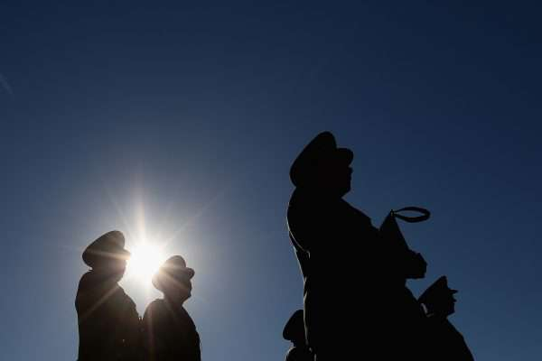
</a>

中国和香港问题专家分析认为，中共高层在香港问题上没有获得真情报。(Getty Images)

    

【大纪元2019年09月08日讯】（大纪元记者张婷综合报导）中国和香港问题专家卜约翰（John Burns）教授9月6日在“香港自由新闻”（HKFP）上发文称，北京最高层在香港问题上得不到有关香港真实情况的情报。主要是因为中共设在香港的官员上报扭曲信息，为的是迎合上头的心理。

卜教授认为，如果北京的情报收集方式不加以改革，通过多种方式获得香港的真实信息，北京将会重复同样的错误。

卜教授是香港大学政治与公共行政学系的讲座教授。他于2011年至2017年担任香港大学社会科学学院院长。他教授比较政治与行政学科，并从事有关方面的学术研究，是研究中国，包括香港问题的专家。卜教授的学术研究领域包括公营部门的人事管理，公务员架构改革，党与国家关系，及公营部门改革等。他的著作丰富，曾撰写及编辑的学术著作有八本。

卜教授在文章中表示，中国共产党在香港的关键职能之一就是抓住该城市的脉搏。该党设在香港西营盘的中联办，直接向中央委员会报告，之后报告再被传到中央最高层。包括习近平在内的中共中央政治局委员会通过这些报告对一些关键问题加以了解。

但这些设在香港的机构并没有为习近平提供港人反对修订“引渡法案”的真实程度。卜教授称，有报导指出，习近平“谴责国务院港澳事务办公室（简称国务院港澳办）的糟糕情报”。卜教授说，他应该谴责。

怎么会出现情报不真的情况呢？卜教授分析认为，首先，也是最根本的，就是该党的运作就好似在一个狭窄的回声室中一样，基于意识形态来决定什么样的看法是允许的，什么内容可以向上报。

回声室效应（Echo chamber）是指在一个相对封闭的环境中，一些意见相近的声音不断重复，并以夸张或其他扭曲形式重复，令处于相对封闭环境中的大多数人认为这些扭曲的故事就是事实的全部。

卜教授说，在香港的中共官员扭曲信息，主要上报上级想听的内容。这是一种常见的“官僚主义疾病”。

其次，中共严重依赖自己在香港的那圈子人得来的报告，包括设在香港的全国人民代表大会和政协的代表们。中共对这些人的任命是基于几个考量，包括忠诚度和可靠性。对中共来说，这些人是“可信的”，不可能颠覆中共这条大船。而从其他渠道来的信息，中共根本就不在意。对于一个与大陆不同的、在半自由和开放环境的政治体制运作下的香港来说，中共的这种做法是一个灾难。

在当前的政治危机中，在香港的那些全国人大和政协代表们大多保持沉默，当被北京当局督促时，他们便公开表达党的立场。卜教授说，当一位商界领袖响应该党的号召，谴责所有暴力行为，而不仅仅是抗议者的暴力行为时，该党公开抨击这名商界领袖。也就是说，与党中央步调一致高于一切。

卜教授认为，因为这个党强调要这些代表们正确而一致的发声，因此，他们往往都非常谨慎。他们担心，做错了对保住中共给的头衔不利。因此，在危机中，香港人不能依赖这些代表们来公平地调解纠纷。而这些跨境关系扩大了香港的官方回声室效应。北京也同样不能通过在香港部署的人员获得可靠情报。

卜教授说，预计，北京会让国务院港澳办和中联办对假情报负责。但是，如果北京不对党内收集情报的方式进行根本性改革，以允许通过更多的多样化方式弄清真实情况，那么就将会继续重复着与过去一样的错误。

中共国务院港澳办和中联办的业务上级机构都是中央港澳工作协调小组。该小组的组长是韩正。

路透社8月30日曾引述几名知情人士披露，香港港首林郑月娥在今年夏天早些时候曾向北京提交一份评估抗议者的五项主要诉求的报告，并建议撤回引渡法案的修订，但遭到中共的拒绝。

一名中共高级官员透露，这份报告被提交给了由政治局常委韩正领导的中央港澳工作协调小组。

这名官员也证实，中共拒绝屈服于任何抗议者的要求，并想让林郑采取更多主动行动。

责任编辑：林妍 

<a href=#list><h6 align="right">回目錄</h6></a>
   

 
<a name=a26><h2>多国精英联名 吁美速立香港人权法 实施制裁     </h2>
 

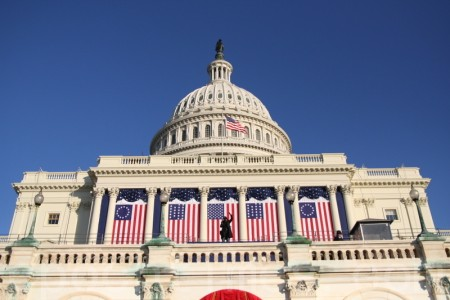
</a>

图为美国国会大厦。（李莎／大纪元）

    

【大纪元2019年09月07日讯】（大纪元记者李辰美国华盛顿DC报导）来自美国、加拿大、法国以及亚洲等地区的80多位精英人士联名，致信美国国会领袖，强烈要求快速通过《香港人权与民主法案》 。

《香港人权与民主法案》包括：要求美国国务院每年对香港的自治重新认证、授权美国制裁香港人权侵犯者等多项措施，力保香港自治和法治。美国国会将于9月10日复会，国会是美国联邦立法机构。

这封信的联名者包括多国的大学、智库、人权机构的学者和领袖，也包括政界人士，比如美前驻华大使洛德（Winston Lord）、加拿大前驻华大使马大维（David Mulroney）等。

收信人包括美国国会参众两院的领袖，比如：参议院多数党领袖麦康奈尔（Mitch McConnell ）、参议院少数党领袖舒默（Chuck Schumer）、参议院外交关系委员会主席里施 (James Risch)、众议院议长佩洛西（Nancy Pelosi）等12位国会领袖和重量级议员。

美国参议院民主党领袖舒默9月5日已表示，下周国会复会时，《香港人权与民主法案》将是民主党议员推进的首要任务之一。

美国众议院议长佩洛西也在8月13日发表声明，谴责中共对香港人民的暴力持续升级，同时表示，国会将通过两党法案，以制裁破坏香港自由的人。

联名信的发起人之一、美国圣母大学政治学系副教授许田波（ Victoria Tin-bor Hui）9月6日向大纪元记者表示，“美国国会应该通过这一法案。其它国家也应采取类似行动，从实施制裁开始。”

这封联名信译文如下：（略有删节）

作为人权和民主的支持者，我们深切关注香港，我们强烈要求通过《香港人权与民主法案》（S.1838 / HR3289）。我们敦促您的委员会提交这项法案，并立即在各自的议事厅就此重要立法投票。

《香港政策法》展现了美国对香港人权和民主的强烈承诺，并接受了中共对香港在贸易、投资、商业、移民和其它文化教育关系方面与中国其它地区区分对待的邀请。

《联合声明》本身保障香港的权利和自由，包括个人、言论、新闻、集会、结社、旅行、行动、通讯、罢工、职业选择以及学术研究和宗教信仰的权利和自由。

自1997年（香港）回归以来，特别是近几年来，北京违反了这些（《中英联合声明》）的庄严承诺，侵蚀了香港的自治和法治。

在同一时期，北京任命的香港政府已证明不能或不愿维护香港的自治权。它已成为破坏基本自由的同谋。

如果没有“基本法”所承诺的民主改革，对法治的持续冲击不会停止。

这种情况不仅对香港人，而且对香港庞大的贸易和金融（市场）造成伤害，也对美国商界造成了不利影响 ，包括在港的85,000名美国人。

我们对中共和香港政府最近对这些基本政策的违规行为令深感不安。北京2014年香港白皮书实际驳回了联合声明的持续适用性。

北京拒绝了在2014 – 2015年进行民主改革，这是原本长期承诺的。

当选的立法者被禁止在有限民主的立法委员会任职。选择反对派候选人不得竞选公职。亲民主抗议者面临严厉的判决。一个政党被禁止，香港政府驱逐了主持党会召集的外国记者。最近，拟议的引渡法将使任何生活在香港或过境香港的人容易受到中共高度政治化的刑事司法系统的侵害 。（中共司法系统）因侵犯人权和不公正而臭名昭著。

这些行为引发了最近几周多达200万人的大规模抗议。政府采取镇压措施而不是回应公众关注的议题。中共和香港政府都允许甚至鼓励警察滥用行为来平息抗议活动，这使得社区陷入混乱。对独立调查的要求被忽略了。据信，当局甚至被怀疑是一个打劫犯罪团伙对数十名抗议者和旁观者的殴打行动的共谋。

在评估或撤销香港的特殊地位之外，美国政府需要额外的工具，《香港人权与民主法案》以下列方式扩展了政策工具箱：

1）要求（美）国务卿每年对香港的自治重新认证，这为监督过程增添了有力工具和重要的政治判断力。

2）要求（美）商务部，财政部和国务院报告香港政府是否充分执行美国关于敏感的两用物品以及美国和联合国制裁的出口法律。这些制裁解决了技术转让的重要问题。

3）授权制裁那些在香港压制人权的人士。这有助于在美国的外交政策和香港的成功(案例)中强调人权和法治的核心价值。

4）对于那些因参加示威活动而被定罪的香港人，禁止拒签他们的美国签证，这确保对那些香港自治守护者的保护。

5）禁止侵犯香港人权和违反其它承诺的人士来美， 这确保对个人问责。

6）向国会报告那些因香港事件而被美国实施制裁的名单，这可以更好地为国会的决定提供信息。

我们强烈鼓励通过（该法案）。 

责任编辑：高静 

<a href=#list><h6 align="right">回目錄</h6></a>
   

 
<a name=a25><h2>美国会委员会挺港人抗争 支持五大诉求     </h2>
 

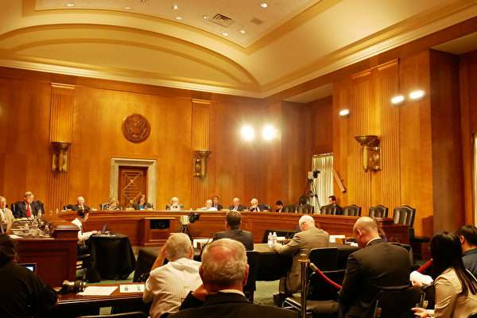
</a>

9月4日，美国国会下属的美中经济和安全审查委员会（USCC）在参议院就美中关系举行了三个不同主题的听证。图为听证会现场。（李辰／大纪元）

    
  
 【大纪元2019年09月05日讯】（大纪元记者李辰美国华盛顿DC报导）9月4日，美国国会下属的美中经济和安全审查委员会（USCC）在参议院就美中关系举行三个不同主题的听证。香港危机成为当天关注的焦点之一。 
  
  
USCC官员表示，香港人是在为美国所珍视的普世价值观而战，他们的勇气鼓舞了整个世界，美国应继续和香港人站在一起；希望港府解决港人提出的五大诉求。

参加听证的学者认为，香港的形势依然非常严峻；港人走投无路，只能继续抗争。学者呼吁，美国国会尽快就香港危机立法。

北京时间9月4日晚，香港特首林郑月娥宣布撤回修订《逃犯条例》﹐但拒绝成立“独立调查委员会”。民主派人士则坚持“五大诉求、缺一不可”。
  
<b>  USCC主席：香港抗争鼓舞世界 美国应继续和他们站在一起</b> 
   

USCC主席白嘉玲（Carolyn Bartholomew）在听证会上赞佩香港抗议者的勇气对整个世界产生积极影响。 
   
  

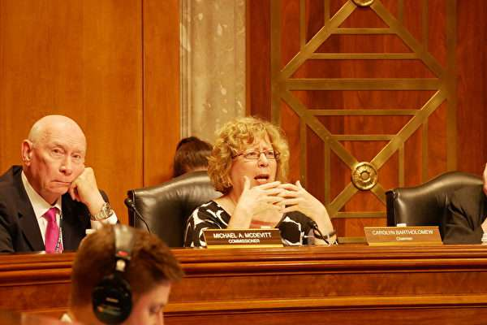
</a>

图中为USCC主席白嘉玲（Carolyn Bartholomew）。（李辰／大纪元）

    
  
她说，“香港人的勇气、那些年轻人改变战术的创造力，他们彼此之间照顾的精神，实在是非凡。”她表示，香港的抗争，“甚至对于那些没参与抗议的人，对整个世界，都是一种真实的精神鼓励。这可能是北京不喜欢的事情之一。”

“人们正在为我们在这个国家所珍视的价值观而战。我们应该继续（和他们）站在一起。”

她说，香港局势“嵌入了很多问题：经济、安全、自由”。

“香港对法治和司法独立的承诺非常重要。采取强硬手段、试图操纵这些事情都不符合大陆和香港民众的利益。”
 
<b>USCC副主席：希望港府解决五项诉求</b> 
  

USCC副主席克利夫兰（Robin Cleveland）表示，希望港府解决抗议人士提出的五项诉求。她说，“我很高兴看到她（林郑）终于宣布《引渡法案》将被撤回，应该要被撤回。”她表示，其它四项诉求也应该得到解决，包括普选和独立调查等。  
 
  
 
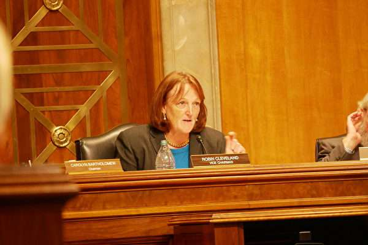
</a>

USCC副主席克利夫兰（Robin cleveland）。（李辰／大纪元）

  

她赞扬香港人的勇气以及抗暴方式令人印象深刻，认为美国政府应该公开支持香港民众的抗争，“我也同意这样的观点——美国采取非常公开的态度并支持正在（香港）发生的事情对民主至关重要。”
 
<b>USCC委员：香港人会继续抗争</b> 
 

USCC委员费德勒（Jeffery Filder）认为，香港民众会继续抗争。
 

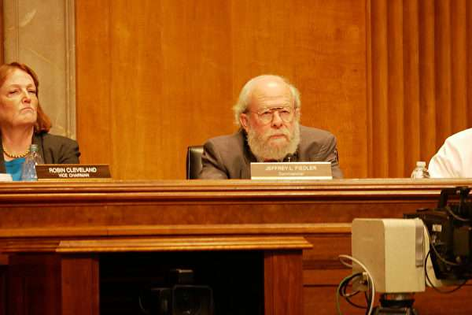
</a>

图中为USCC委员费德勒（Jeffery Filder）。（李辰／大纪元）

他说，“我认为，香港人的抗争没有结束。并且，下一个更难的议题是真普选的问题。我认为，如果没有获得普选权，香港的年轻人是不会满意的。”
<b>香港中文大学客座副教授：形势非常严峻 希望国会采取立法行动</b> 
 

香港中文大学客座副教授、美国维吉尼亚大学讲师林夏如（Syaru Shirly Lin）表示，港府已经错失了撤回条例的时机，如果港府在6月份的任何时候这么做，都不会酿成这么严重的后果。

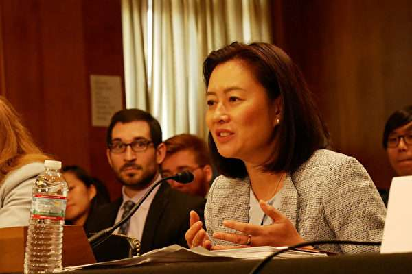
</a>

香港中文大学客座副教授、美国维吉尼亚大学讲师林夏如（Syaru Shirly Lin）。（李辰／大纪元）

她说，“我们失去了一个时机，现在香港的情绪、情势非常的严峻。这个严峻的形态，是政府导致了这个地步。”

“你能感觉到现在，这条很深的沟，要去疗伤，要去把它解决的话，我觉得比本来的成本要多很多，至少十倍。”

“所以，这是政府的错误。这些成本都是所有市民要去承担的。刚才的委员说得很好，要真普选。”

她表示，香港人会继续抗争，“他们绝对不会轻易地放弃他们的使命——这个使命，就是要民主，要普选，要真普选。”

林夏如还呼吁，美国国会就香港问题立法，“我认为，国会应该尽一切力量来确保《中英联合声明》中的自治承诺不受侵蚀。立法者可尽可能地做任何事情以遏制中共。”
 
<b>美圣母大学副教授：香港人走投无路 只能抗争</b> 
 

美国圣母大学政治学系副教授许田波（Victoria Tin-bor Hui）表示，香港人无法接受香港特首所宣布的“正式撤回修例”让步，因为“太小太迟”，她认为香港年轻人已经做好了继续抗争的准备。
 

</a>

国圣母大学政治学系副教授许田波（Victoria Tin-bor Hui）。（李辰／大纪元）

她在听证会上说，“如果你问年轻人：你会被捕、会被起诉，你可能要冒风险坐监10年；他们会说：我们知道。我们愿意牺牲自己的生命来捍卫香港的自由，来捍卫伴随我们长大的这些价值。”

许田波表示，是北京和港府将港人逼上抗争之路，“早些时候，香港人对‘一国两制’有信心。真的是因为北京的侵蚀日益增加，并且随着时间的推移，这些侵蚀真的将这些年轻人逼到了走投无路的地步。”

“这真的是最后一个办法。他们（年轻人）在为香港的未来而战。这就是他们不能放弃的原因。”

她认为，香港，对中共、对整个世界来说，都是一个“测试”。

“事实证明，‘一国两制’，是失败的。”

“林郑只是一个木偶，她（甚至）没有辞职的自主权。”

“在20世纪80年代，中共领导人在世界到处推销、广而告之：香港真的会保持其特殊的地位，但是，今天他们在抱怨外国‘干涉’（香港）。所以，这个承诺已经名存实亡了。”#

责任编辑：高静

  
<a href=#list><h6 align="right">回目錄</h6></a>
   

 
<a name=a24><h2>林郑公布：正式撤回修例 拒设独立调查     </h2>
 

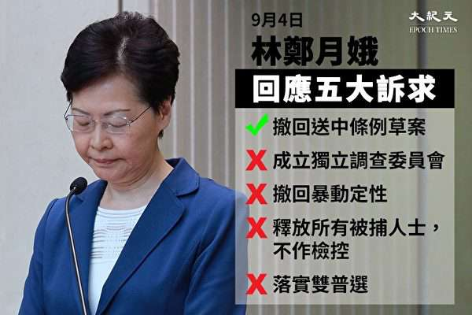
</a>

2019年9月4日晚6时，香港特首林郑月娥宣布撤回逃犯条例修订案。（宋碧龙／大纪元）

  

【大纪元2019年09月04日讯】（大纪元记者萧律生综合报导）9月4日晚6时，香港特首林郑月娥发表电视公告，称正式撤回修例，但不会成立独立调查委员会；对于民众提出的其它诉求均无实质回应。
 

林郑月娥电视公告中，除了表示会正式撤回修例外，还称委任大律师公会前主席林定国、前高官余黎青萍加入监警会；从这个月开始，她和所有司局长，会走入社区与市民对话；邀请不同界别人士作独立研究及检讨。

但是众多港人留言：“五大诉求，缺一不可”，“制止警方暴力”等。

港人要求港府回应五大诉求，即撤回修例、收回示威暴动定义、撤销反修例抗争者的控罪、成立独立调查委员会彻底追究警队滥权滥暴情况及立即实行真双普选。

林郑月娥此次回应，除了撤回修例，对于民众提出的另外四大诉求均无实质回应。

如对于“收回示威暴动定义”，林郑月娥称，法律程序上不存在“暴动定性”；律政司已清楚指出，每宗案件的刑事检控决定，都是按证据、按法律、按《检控守则》做出。意味着，林郑月娥不会收回暴动定义。

“撤销反修例抗争者的控罪”上，林郑月娥认为，这些要求是法治社会所不能接受。

对于“成立独立调查委员会”，林郑月娥明确表示，不应该另设独立调查委员会，而是应该按既定机制，交由专责的独立监警会处理。

而其委任的大律师公会前主席林定国、前高官余黎青萍被指，前者在高铁西九站“一地两检”问题上态度温和，被视为亲政府的保守派；后者是林郑月娥参选特首时的竞选办资深顾问，曾在反修例爆发时表明不适合设立独立调查委员会。两人公信力备受质疑。

至于“实行真双普选”，林郑月娥称，要实现这个目标，社会需要在法理的基础上，在平和及互信的氛围下，进行讨论，否则会令社会更加撕裂。

香港民主派会议召集人毛孟静对媒体表示，如果6月初林郑月娥提出撤回，根本不会发生过去几个月的事情。她担心，港府以退为进，先满足一项诉求，然后在此次运动上加更多标签。

民主派强调，需要五大诉求，缺一不可；对港府今日的回应，不能接受。

亲北京议员田北辰也表示，林郑月娥已经错失妥协时机， 因为社会的焦点已经不在反送中。他促请政府尽快成立独立调查委员会。
 

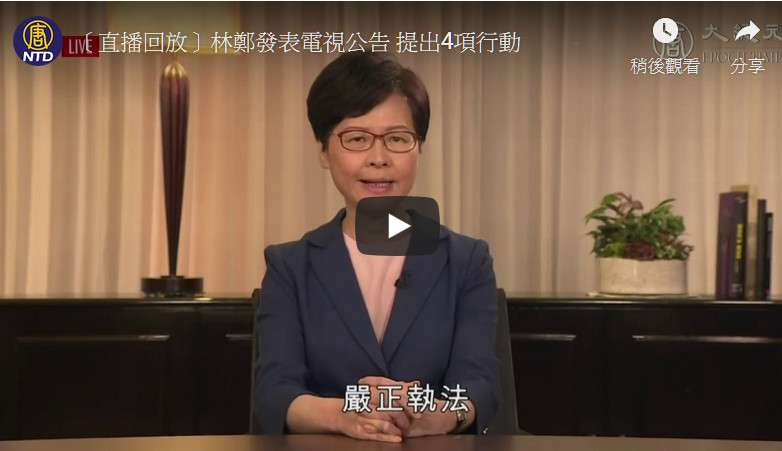
</a>
 

4日下午，亲共港媒香港01和《南华早报》发消息称，林郑月娥将于9月4日下午4时，与建制派立法会议员、港区人大代表及政协委员在礼宾府会面，林郑月娥将会宣布正式撤回修例，以缓和当前局势。

但是直到下午5时半，林郑月娥仍未向公众公开公布撤回修例。

香港电台下午近5时半的消息说，据了解，港府将于傍晚播放影片公布撤回修例的消息，今日不会举行记者会。

律政司司长郑若骅、财政司司长陈茂波、保安局局长李家超及教育局局长杨润雄，均于4时前抵达礼宾府。到场的亦有立法会主席梁君彦、建制派立法会议员梁美芬 、陆颂雄、谢伟俊、容海恩、马逢国、姚思荣及黄定光等。行政会议成员张宇人、任志刚、黄国健、林正财、叶刘淑仪及李国章亦已抵达礼宾府。

另外，港区全国人大代表黄玉山、吴亮星、雷添良，全国政协常委林建岳、李泽钜、胡定旭、陈冯富珍，全国政协委员兼信和集团主席黄志祥、全国政协委员胡汉清、基本法委员会副主任谭惠珠、基本法委员会前副主任梁爱诗以及孔教学院院长汤恩佳等亦有到场。

《苹果日报》报导，有消息说，林郑月娥在礼宾府内向建制派宣布“撤回”修例，仅晚上6时发表电视公告。

反修例运动从今年6月起持续近三个月，遍及全港18区。期间，林郑曾以“暂缓”、“完全停止”、“寿终正寝”形容刹停修例，但民众不买账，认为林郑月娥在玩文字游戏，必须按照法律上、正式的程序撤回方可。 #

责任编辑：叶梓明

<a href=#list><h6 align="right">回目錄</h6></a>
   

 
<a name=a23><h2>专访萧若元：习最后时刻叫停紧急法   </h2>
 

中共大外宣编故事造假骗习 设陷阱搞乱香港

  

</a>

香港资深传媒工作者、时事评论员萧若元。（宋碧龙/大纪元）

  

【大纪元2019年09月04日讯】（香港大纪元记者梁珍报导）中共在香港的做法越来越被香港人看穿识破。近期中共黑手继续冒充示威者或警察，趁乱挑起事端，同时大陆党媒入港，加大力度“曝光”所谓“暴力镜头”等，企图以“暴徒乱港”之名在香港实施《紧急法》，而习近平当局在压力之下，不得不在最后一分钟紧急叫停。
  

香港著名资深时事评论员、电影编剧作家、香港最多人气自媒体人萧若元表示，类似状况并非首次，中共内部习近平的反对者一直在设陷阱，以实现搞乱香港的目的。
  
<b>  习最后一分钟叫停《紧急法》</b> 
   

萧若元回顾，上周中共准备推出《紧急法》的时刻，8月31日香港“很多暴力镜头出来，叫国内全部传媒出来直播”，“塑造香港已经是火海一片的场面”，都是中共故意做给大陆人看。其中疑点太多，本报记者也提及，在现场直播湾仔大火时，火烧到四条街，烧了半小时都没有人救火，而且警察特意在起火前就撤离湾仔警察总部关起门，“突然间就起火了。”
  

“他就是要制造那个场面很混乱，就是你们（港人）暴力得很厉害，那么必要时就用《紧急法》啰。”萧若元说，“但是他（习近平）最后一分钟又叫停了，其实习近平几次都是最后一分钟叫停的。”

中美贸易战也突然升级，这次是在美国等压力下被紧急叫停，“如果不是中美有贸易谈判，香港将会遭到更加严厉的对待。”美国总统川普在上周五放话“这两、三天看看有什么事发生”，无疑是对习施加了一定压力。
  
<b>  外宣编故事骗习 设陷阱搞乱香港</b>  
  

萧若元提到，8·31当日还发生了警察释放大量催泪弹、在太子站打人等事件，但中共都是竭力掩盖整件事件真相，颠倒黑白。
  

他以港警在地铁站抓住一名外国人为例，大纪元记者拍下的真实画面是，这名外国人在地铁站一直大声抗议：“在香港住了24年，为什么这样对香港人？你这样还有一国两制吗？”十几分钟后，被警察团团围住并强行抓走。而中共对外欺骗说是抓住了CIA（美国中情局）头子，还把地点说成是“在机场”，“后来说是瑞典电台记者，他们就是因为他的口音有小小美国口音就变成CIA的。”

他表示，类似事件并非首次，中共内（习近平的反对者）一直在企图搞乱香港，设陷阱让习跳。

比如在香港6·12爆发的警察与示威者的对峙中，警方突然后退，使示威者见有空位向前移动时，这使得警方找到理由以催泪弹驱散人群，并引发后续冲突。

“每次就是香港警察做一些很错的事出来，他是想引你做些很暴乱的场面出来，等民意反弹。想不到警察做得更大，每次都是大祸。”他认为，尽管中共的一贯作风是挖坑陷害，对外掩盖真相，虚假宣传，可笑至极，但并不是习要搞乱香港，而是习的政敌在利用外宣编故事，使局面复杂化。

“其实是外宣编出来的故事，就是香港这个（反送中）完全是受外国的煽动，你知不知道是要颜色革命夺取政权，就说说连自己都信，这个很好笑。”

他表示，中共现在对付香港示威者，“就是决定拖，拖下去，拖到你散为止。因为第一你的毅力不够，第二如果你多做些错误或者生意衰些，那些生意人会怪你。”

他认为继续拖下去，损害香港的经济金融中心地位，最终会把香港的精英逼走，“那些人尤其是30多、40多岁的人，十个有九个都想着走，这个情况继续的话，带走了香港的精英阶层和香港大部分的钱。”# 

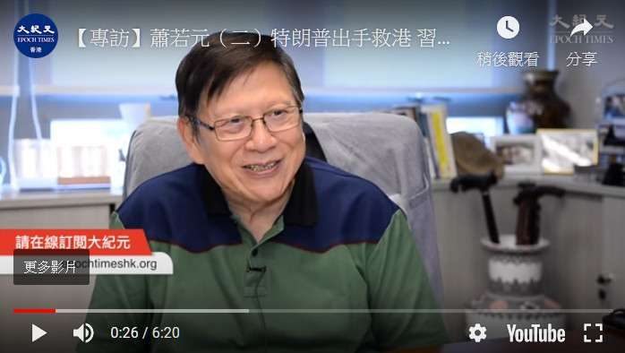
</a>

责任编辑：李佳薇

 <a href=#list><h6 align="right">回目錄</h6></a>
   

 
<a name=a22><h2>专访萧若元：林郑录音泄露可能是北京授意      </h2>
 

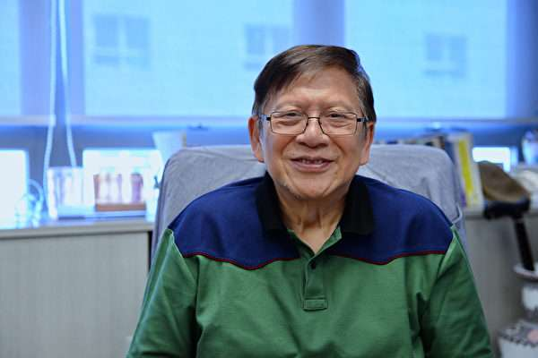
</a>

香港资深时事评论员萧若元认为，录音由习授意林郑月娥放料可能性大。（宋碧龙/大纪元）

  
  
【大纪元2019年09月04日讯】（大纪元记者梁珍香港报导）香港资深时事评论员萧若元昨日（3日）接受大纪元专访时，对林郑月娥对于闭门会议录音的解释有诸多怀疑。他分析，录音由谁泄露只有两个可能性，一个是林郑自己将录音放出去，一个是在座的人偷录。
  

但他认为后者的可能性不大，“因为她上次与那些青年人聊天，已经被人录过一次就播出来，这次更没有理由不小心的。一个星期后又犯这样的错误这是难以理解的。还有这次是与那些很高级的人谈的，她讲英文很可能是与汇丰、太古这类大班聊的，这些人怎可能会冒着得罪她和北京的风险，将录音拿出来呢？我是非常地怀疑，这些人一般都不会这样做，这些人很稳阵的。”
  

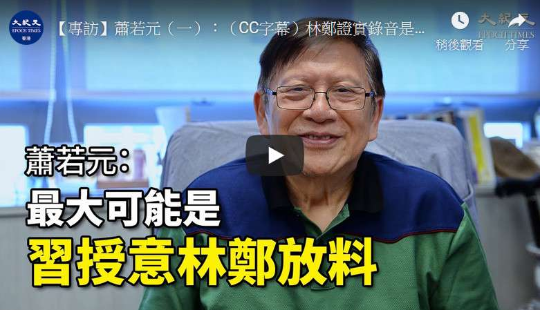
</a>

加上录音质量很好，不像是偷录的，“即使你袋里放着电话，我在这里讲，音质是不一样的，和直接出的结果是不一样的。所以我偏向就是，是林郑录后放出去的。”

如果是林郑自己公开录音的话，萧若元认为亦有两种可能性，一个是林郑自己的决定，一个是北京的意思。他分析，后者可能性较大。“如果她没有北京的批准，肯定是很大祸。这就和赵紫阳将邓小平幕后执政的机密泄露出来一样。”

萧若元认为，北京为什么不同意林郑辞职，其中部分原因就是，北京实际上操控了警方怎么去“止乱制暴”，中间有林郑月娥做缓冲。即“谁不答应五大要求，谁不这样指挥警方，是可以推给特区政府的”，“你这样做（辞职）的话，让北京没法转弯了。”

故他质疑林郑有没有这么大胆，没北京同意而讲出来，“如果她以为不是我流出去就可以推得掉的话，我觉得她真的是太天真了。如果我是北京，我一定认为是你林郑泄露出去的，很大可能认为是你泄露出去的。”

<b>不会出军队 也不会用紧急法</b>

对于林郑月娥在闭门录音中，提到北京三大底线，包括中央无意派军队介入，亦不设十一解决死线，愿意“放长线”渡过今次风波，即使损害经济、流失资金亦不怕。

萧若元分析，如果是北京授意她讲的，他认为很可能是习近平授意，当然林郑月娥也可能加入个人的内容。

但他相信，不出军队这个是北京的底牌，也不会出《紧急法》。因为美国总统川普在上上周五已经提前预告，过两三天就知道答案，接着就是中美贸易战突然升级，故他认为，林郑月娥的闭门录音为局势降温，其中一个原因也是因为美国出手。

谈到为何不出《紧急法》？萧若元指，《紧急法》是一个坏主意。“因为《紧急法》不能够凌驾《基本法》，《基本法》是有紧急状态的条文，为何有《基本法》的条文你不用，而用一个一百年前的条文呢？这是很可笑的。”

既然中共不会设十一解决底线，他认为未来抗争会转向持久战。而中共70周年十一活动将在香港低调举行，“找块神秘地方，你也不知道在哪，无法去包围它。然后屏蔽国内的消息，让国内不知道香港搞国庆要鬼鬼祟祟地搞。”

同时，中共将不准大陆游客来港。萧若元引用大陆朋友的话称，本月已申请不到来港签证，说服务器坏了，不知何时恢复。

对于最近港警发起大搜捕，萧若元表示，因为北京的统治手法就是用专制机器，就是用它熟悉的那一套，一抓了你，你就失踪了，人间蒸发了一两年才告你，它惯了这样。但香港是不行的，始终卡在香港的普通法，香港48小时就要让人保释。

<b>中共为自保不敢毁香港</b>

他强调，香港是中国的“活口”。即使毛泽东时代，中共都不敢收复香港，目的是长期打算、充分利用。

比如很多中共权贵的资产就在香港，他举例：“中国去年、今年上半年总共引入700多亿美金的直接投资，500多亿在香港；其次，香港是钱罐，把这些钱分散去世界各国之前，先集中在香港。因为他觉得香港他可以管的到，在外国给西人管，有时钱不是很放心。”

但九七后，中共对香港管的越来越多。特别是中联办无限制地扩大，那些维稳部门不断制作所谓港独问题，加上中共否决双普选，令港人无法信任中共，令大部分香港精英流失掉。@#

责任编辑：杨亦慧

 <a href=#list><h6 align="right">回目錄</h6></a>
   

 
<a name=a21><h2>美共和党领袖警告中共：香港局势 全球注视      </h2>
 

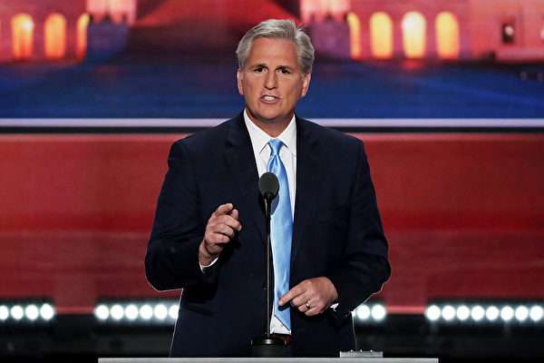
</a>

美国会众议院少数党领袖、共和党议员麦卡锡（Kevin McCarthy）9月1日表示，“世界正在密切注视香港局势，中共对此应保持清醒。” (Alex Wong/Getty Images)

  
  
【大纪元2019年09月03日讯】（大纪元记者梁砚编译报导）美国会众议院少数党领袖、共和党议员麦卡锡（Kevin McCarthy）9月1日表示，“世界正在密切注视香港局势，中共对此应保持清醒。”  

  
麦卡锡当天接受福克斯新闻采访时，就香港问题发表了看法。

他说：“首先，我和任何一位争取自由的人站在一起。我们需要密切关注香港局势。美国的历史证明，美国不仅仅是一个国家，更代表一种精神和思想。

“如果你观察香港正在发生的事就会看到，他们（香港民众）正在为保护自己的权利和信仰而抗争。这与几十年前发生在波兰的工人运动一样，那时美国与波兰人民并肩站在一起。

“目前，全球正在注视香港，中共应该清楚这一点。”麦卡锡说。

香港民众抗议修订《逃犯条例》的（反送中）活动已经持续近3个月，先后有数百万人加入系列游行和集会活动，表达诉求。

据香港大纪元报导，8月31日，民阵集会和游行申请被香港政府拒绝后，成千上万的港人还是走上街头，继续以和平方式表达诉求。9月1日，港人又推出9·2罢课集会。罢课集会由香港大专学界筹办，呼吁大专生以及港九区、新界区等中学生也一同加入。

“反送中”由香港政府拟修订《逃犯条例》的风波引发。该条例一旦通过，将允许港府将嫌犯引渡并移交给大陆政府，到时不仅仅是香港居民，任何过境香港的外国人士，也有安全之虞。外界担忧，在大陆不公正的司法体系下，此举将令香港一国两制彻底沦陷。

对于港人近3个月的反《逃犯条例》诉求，香港政府一直拒绝撤回该条例。期间，香港警察针对示威者使用了催泪弹、布袋弹、胡椒弹、橡胶子弹和警棍等。在8·25“反送中”活动中，警方首次出动水炮车和发射实弹。8月31日，面对上街的民众，警方使用了多枚汽油弹、水炮车，并首次喷洒蓝色染剂。网络视频还显示，香港警察在部分地铁站内殴打乘客。

香港持续上升的暴力执法正在不断引发国际社会的谴责。#

责任编辑：李缘  

  
  
<a href=#list><h6 align="right">回目錄</h6></a>
   

 
<a name=a20><h2>局势突然剧变 武警部队疑换防时进入香港      </h2>
 

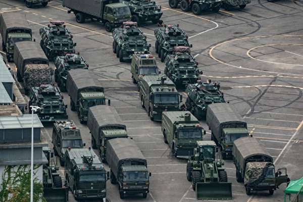
</a>

在港人反送中的关键时刻，中共军车8月29日凌晨进入香港，引发民众质疑和高度关注。图为8月16日停放在深圳湾体育中心外的中共军车。(Getty Images)

     
  
【大纪元2019年09月02日讯】（大纪元记者张顿报导）香港局势突然急剧恶化，港警在地铁无差异地袭击乘客，并大面积抓捕港人。外界质疑这种大陆式的打压方式，可能是中共武警部队利用驻港部队换防的方式已进入香港，充当港警、示威者打压港人。
 
<b>港警上演大陆式的打压</b>
  
 
8月31日晚10时40分许，大批港警闯入太子站月台的列车内，不分青红皂白，用警棍狂打乘客头部，至少致10人受伤；在港铁旺角，至少有3名市民被警察打的头破血流。

同时，港警仅在港铁旺角和太子站就拘捕了63人。

当天下午，港警在香港政府总部发射不少催泪弹，并调派一辆原镇守中联办的水炮车，首度向示威者喷射蓝色染剂。

当天下午3时，港警包围了出售口罩、头盔的“国难五金”店，拘捕7名该店职员。

当天晚上，大批警员在观塘站各出口驻守，对“黑衣人”搜身，并拘捕背包里有三把剪刀及生理盐水的男子。

<b>大陆武警疑进入香港</b>

台湾中央社报导称，港警31日无差别殴打乘客，卧底警员开枪等，这是香港反送中以来最黑暗的一天。

时政评论员石实表示，港警大搞白色恐怖、香港局势突然巨变，并用大陆的镇压式的镇压香港示威者，尤其是警察首次无差别、无理智式的闯入地铁打人，可能不是港警所为，而是大陆武警部队假扮港警所为。

不少网民也认为，港警这种大陆式的镇压示威者，中共当局应该已经把集结深圳的武警部队拉到了香港。这些武警“发过誓，要立功回广东就会受奖，再提升，所以他们是会乱抓乱打的，如上面有令的话还会开枪杀人。”

石实表示，8月初在深圳集结的武警部队，应该在8月29日所谓官方称的驻港部队“第22次换防”时，秘密进入香港。

自由亚洲电台也有类似高的观点。报导称，中共驻港部队今年换防时，官方的通报中的内容基本和往年一样，但“部队轮换后，驻军在香港特别行政区的部队员额和装备数量保持不变”这句话消失了。

报导质疑，中共可能利用这次“轮换”的机会，悄悄扩充了驻港部队的兵员数额。过去，驻港部队一般保持在在6,000人左右。

中共官媒新华社公布的开进香港的驻港部队的装甲车，也泄漏了这一秘密。

报导称，新华社公布的一张多辆轮式装甲车进入香港的照片，观察人士指，该装甲车并非驻港部队一直使用的ZSL-92B步兵战车，而是此前部署在深圳的武警部队第二机动总队的WJ-03B防暴车。

文章认为，如果这些武警部队要直接开进香港，中共全国人大必须宣布香港进入紧急状态，所以中共当局可能借驻港部队“正常轮换”的机会，安排这些“专业”武警脱下警服换军装，驾驶着表面涂改成驻港部队标志的防暴装甲车堂而皇之地开进香港军营待命。

<b>警察假扮示威者被识破</b>

在8月31日的反送中抗议中，媒体发现多起便衣警察充当“示威者”的事件。

在维园，有数名身穿“黑衣”的便衣警察不断地向马路上扔汽油弹，这些背后有LED灯在闪烁的“示威者”被发现后，遭到示威者群起而攻之，他们逃出维园时曾开枪。事后，在维园的地上捡到两枚实弹弹壳。  

  

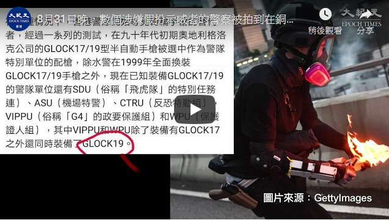
</a>
       
  
  在9月1日举行的记者会上，香港警察公共关系科高级警司余铠均证实，曾有两名警员在维园向天开枪，因为当时有数十名“暴徒”挑衅及冲击几名乔装警员，警员生命受严重威胁后才向天开枪。

在维园附近，还有多名便衣警察冒充示威者，他们身穿“黑衣”，手持警棍和疑似胡椒弹枪的枪支，制服多名示威者。

<b>中共疑嫁祸港人 为镇压找借口</b>

不少网民质疑：这些向路面、政府总部扔汽油弹的行为，可能是中共所为，这也是“中共的一惯做法，装扮别人做坏事，嫁祸于人”。

他们“在抗战时，扮国军，扮日军，挑事端。在西藏，扮僧人，扮藏人，砍人放火，为镇压造错口。八九六四扮学生市民，烧军车，砸公物，嫁祸学生。99年扮法轮功自焚，挑动仇恨”。

“现在的香港警察就是大陆的公安、国安、武警、解放军。只是穿着香港警察的服装而已。它们在大陆怎样镇压大陆人民就怎样镇压香港人民！”

“是为了止暴？还是在混乱中警方自己炮制暴乱，然后栽赃嫁祸于和平理性非暴力的抗议者，为镇压找借口？ ”

“中共官媒曾多次宣称示威者向警方投掷汽油弹，以图制造抗议者制造混乱的证据。”

赵紫阳旧部严家祺此前也刊文提醒港人：在反送中运动中，要提防中共故意制造“动乱”事端；中共早就安排人潜伏到香港，在大游行的高潮中，戴着面具，有意制造严重的暴力事件，然后就有“理由”对港人进行镇压。

严家祺说，在1976年4月5日在天安门广场上，他曾亲眼目睹有人推倒小汽车和点火烧车的全过程。他认为，该事件是当时“四人帮”一手策划的，也是当天晚中共进行清场和镇压在天安门抗议民众的最重要“理由”。

责任编辑：林诗远

  
   
<a href=#list><h6 align="right">回目錄</h6></a>
   

 
<a name=a19><h2>吴明德: 《紧急法》惨过《送中条例》十倍   </h2>
 

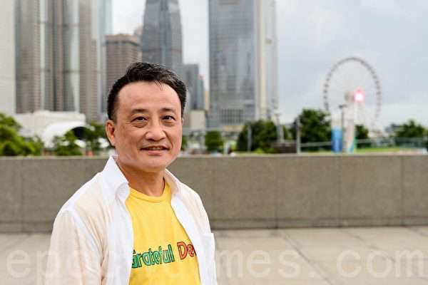
</a>

资深银行家吴明德。（宋碧龙／大纪元）

     
   
  【大纪元2019年09月01日讯】（大纪元记者梁珍香港报导）香港资深银行家、现任大学客席教授，兼任多家电台主持人吴明德接受大纪元专访，针对香港特首林郑月娥提将启动《紧急法》来因应反送中风波，他表示，这个《紧急法》惨过《送中条例》 十倍，原因在于摧毁香港的软实力。
  

近期大批解放军进入香港，包括装甲车、运兵车及拖车等，及驻港部队频繁换班，吴明德认为，目的是要配合林郑宣布《紧急法例》，他提到，“这个《紧急法例》在1967年港英时期用过，是一个恶法。”

他提到，“《送中条例》她推出的时候，我们发现修例影响我们每个香港人，但当时香港人是不知道的。经过律师们、银行家、知识分子、商界人士的解释，才有13万，接着100万、 200万人（出来游行）。为什么呢？因为最终这条例会使得所有的外资和商人都抽走资金，使我们失去工作，影响民生巨大。”

“但《紧急法例》一出，全香港700万人将会有500万人上街（游行）。”吴明德说。 
  
   

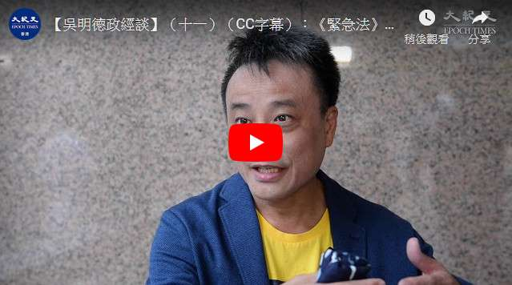
</a>    
  
   
  <b>紧急法出台 引发撤资撤侨</b>

为什么它对香港的影响性如此巨大呢？吴明德分析，“因为所有人不仅仅会抽走资金，还会撤走侨民；就连泰国这样的国家，18日前就已经有这个（撤走侨民）安排了。如果你真的通过（紧急法例）的话，第一件事就是，那8万5千个美国人，10几万的加拿大人，接着法国人，然后英国人，所有侨民都要安排飞机来接他们走。”
“如果香港的《紧急条例》一出，会把香港打入一百层地狱，没有机会翻身。”

他以1945年二次世界大战日本投下两个原子弹到广岛和长崎来说明，他说，“为什么日本翻身这么快？原因是原子弹只是炸到那些设施和23万人，没有炸到它的文化， 没有炸到日本的制度。”

日本人的制度和文化是什么呢？“是与西方的普世价值完全一致的。”

“她（林郑）搞出这个《紧急条例》，不是原子弹，是核弹扔到香港了。 炸的是我们的软实力， 炸到我们的文化， 等于你的普世价值没有了，也没有了法治、人权，自由就更不用讲了。”

<b>炸毁了软实力 香港变成僵尸</b>

他认为，“香港的法治体制，从殖民地到现在都是行之有效的。 但是到现在行之无效，在西方世界（这个特首）早应该在6月9号就下台了。因为有一百万人上街，那你就要炒人，炒掉一些主要（负责）的官员。 你没有炒（官员），正常来讲炒完人之后，如果人们2百万人上街，那你就要炒自己，但是现在这个行之无效。她（林郑）蛮横不跟你讲法治。”

“如果我们的政府真的是双普选的，这次事件应该在6月中就平息了。因为在法治制度里，政府如果做得不好的我们可以批评他，还可以用文明的方法换了他。这才是真实的双普选，这才称为‘一国两制’，高度自治50年不变。”

吴明德认为，中共正一步步露出管治香港的狰狞面目，动用《紧急法》管制机场入出境、管制传媒，“他们要像以前那样用回30年前宣布北京戒严（的方法），然后控制那个传媒，统一战线。那是用旧的方法驾驭在新时代，那一定死定的。如果香港的《紧急条例》一出，他们唯一的作用是把香港打入一百层地狱。没有机会翻身。那剩下的是什么？变成了一个完全的官僚资本主义，或者社会主义。”

“所以我要全香港人要醒醒定定的，所有的渠道你都要告诉你们的持份者听（持份者，或称为利益关系人），这套《紧急法》，不是把人送回大陆这么简单，是要更糟糕十倍，令全香港前途不是冷炒，是马上变成僵尸。”

<b>用人民的力量 争取落实真普选</b>

他呼吁林郑别低估了香港人的力量，即使用紧急条例威吓香港人士没用的，全香港700万人会有500万人上街，“你这样高压（对待）我们，（愈威胁）愈有更多人会上街的，香港人用血汗去告诉全世界的人：我们是‘和理非’的。”

港人的和平、理性、非暴力、自律守法的表现，都展现民主自由的纪律，他说，“香港人是很清晰的。民阵次次搞都是“和理非”的（游行活动），都是很有次序。过去十多个星期，如此多的六、七百万人次上街，每一个窗户都是完好的，整条街一块香蕉皮都没有、一张纸都没有，全部清清楚楚的。”

“我们要告诉全世界的持份者听，就是因为这个‘因’，因为他们不给我们真普选，所以才导致有目前的这十几个星期的‘果’。 我们是不是应该去改变这个‘因’呢？这个‘因’ 就是除了这五大诉求之外，我们还要切切实实的跟你中央说：你一定要给我们落实《中英联合声明》，‘基本法’赋予我们的五十年不变的，就算剩下28年，我都要争取。”

责任编辑：杨亦慧

     
   
<a href=#list><h6 align="right">回目錄</h6></a>
   

 
<a name=a18><h2>专访班农：美中贸易战 中共谎话连篇（下）    </h2>
 

</a>

班农接受新唐人专访，他表示， 镇压香港将使中共垮台。（新唐人）

   

【大纪元2019年08月22日讯】在香港的民主运动进行得如火如荼、美中贸易谈判处在十字路口之际，新唐人《世事关心》节目记者萧茗采访了白宫前首席战略顾问史蒂夫· 班农先生。班农谈论了香港的未来，美中贸易战的前景，各有关方面的利益所在，还有首当其冲的这场大冲突的本质，同时还赞扬了《大纪元》的巨大影响力。
 

班农认为，香港人的抗争在全世界独一无二，堪比美国开国者。而中共因恐惧自由民主在大陆蔓延，对香港恐吓、欺诈、警黑暴力等无所不用其极，让西方国家越来越看清其本质，正在形成共识，中共是个恐怖组织。他表示，如果武力镇压香港抗议者，共产党将覆灭。

对于中美贸易战，班农表示，中共谎话连篇，而川普是近几十年来第一个向中共说不的总统，中共为所欲为的日子结束了。美国一直喜欢中国人，但从香港事件再次看到中共残酷对待人民，而北京不思悔改。他认为，黑帮才害怕法治，而中共就是黑帮心态。
   

</a>
  

以下是访谈录：
接上文：专访班农：香港若重演“六四”中共将灭亡(上)

萧茗：让我们谈谈美国中国的贸易战。你知道，嗯，我的笔记。那么你对美国中国贸易战的根本想法是什么？你认为这会重新平衡两国之间的贸易关系，还是会重新调整美中关系？

<b>中共谎话连篇 川普：不会继续下去</b>

史蒂夫·班农：这是休战，中共和全球的金融界和商界精英沆瀣一气，在过去的20到25年里，一直在和工业化的民主国家打经济战。现在休战，这就是为什么原来谈了一年多的协议涵盖了七个方面，其中包括对国有企业的补贴，有关于网络入侵，强制技术转让等问题，所有这些都是很艰深的技术性议题。

这就是为什么贸易代表莱特希泽、首席经济顾问彼得.纳瓦罗与刘鹤以及其他中方谈判团队成员谈了超过一年的原因。

这个文档长度超过200页，在很多方面都做了技术上的高要求。比如要求完全透明，责任明确和完全可执行。它与过去美中之间的协议都不同，也不再是西方过去搞的那种充满谎言的对华贸易协定。让我们在这里彻底坦诚。

中共每次开口讲话就一定是谎话连篇。过去他们曾经对西方的承诺没有一个实现的。他们告诉你他会如此这般，结果是按他们自己的意愿为所欲为。川普是第一位美国总统表示我们不会这样继续下去。

莱特希泽也足够聪明。回顾过去，双方有协定。这个协定就是将中国的经济融入世界经济体，并且脱离像奴隶般使用中国劳力。中国就是这样对待他们劳工的。他们打击压制中国劳动者。
中美贸易就是在这样的基础下起步的。这就使得中共的强硬派以为，尤其是在他们开启一带一路以后，像王岐山这类政客更加认为他们成功蒙骗了美国。

<b>中共想成世界霸主 川普第一个说不</b>

史蒂夫·班农：中共觉得有一带一路，有中国2025， 还有华为。中共认为这些可以令他成为世界霸主， 在世界上处于经济领先地位。然而，（面对）世界主流，中共审定世界主流的标准很简单。

中共认为西方资本家给他们提供了资金，公司企业提供技术。世界不在乎中共如何对待法轮功。世界不在乎中共如何对待地下基督教组织。世界不在乎中共如何对待达赖喇嘛，西藏人士，佛教徒。这些西方主流很贪婪， 不是吗？中共觉得西方主流给他们想要的，然后西方主流就会让步。

中共认为，到时候中共就可以成为世界霸主，而主流国家都要让步。川普总统是第一位出来说不的人。这就是我们要从这个协议的根子上梳理源头的原因。这次的协议谈判已经超过一年了。

史蒂夫·班农：习和这些人知道整个事件的来龙去脉， 我想在这个世界上，刘鹤是个有智慧的人。他从不对其他人隐瞒什么。这是众所周知的，一直如此，但是最后，当中共终于明白了协议的内容的时候，其强硬派就讲了：“没门。我们宁愿与西方社会对抗，就是现在。”你已经看到中国经济发生了什么。

<b>中共为所欲为的日子结束了</b>

史蒂夫·班农：所以这场战争，这场经济战有三个主要方面，贸易战只是其中一个。还有科技战和货币战。就在今天早上，当我们开始采访时，川普总统原本一直在谈论要全面废掉华为。 但是美国商务部刚刚宣布将再给华为90天，另外90天延期。

然而华为只是贸易战中的技术部分。还有货币。两周前我在CNBC接受采访时说过，人民币贬值已经破七，突破了人们的一个心理防线。首先，在9月1号，假如我们不推迟这个日期，中国出口货物将100%被加关税。这在人们的心理上是个阻碍。现在我们将这个问题摆上桌面。

其次是货币，人民币对美元贬值。在人民币贬值破七之前两天我就说过，人民币会突破最后心理防线实现破七。所以我认为我们现在正处在货币战争的开启阶段。我们也在技术争端的开启阶段。我们已经身处贸易战。

我之前就对中国人说过，中共是无法在贸易战中获胜的。之所以中共能撑到现在就是因为西方的一些资本家，华尔街，伦敦，以及部分大企业主，一些精英人士，我把这些人统称为达沃斯派系（著名的达沃斯会议Davos），是他们一直在出资金扶持中共。也是他们给中共提供了西方技术。

史蒂夫·班农：这一切都结束了。在美国的这些人会看到，大限将至。人们已经开启讨论如何限制资本市场给中共注入资金，不是吗？人们也开始讨论给技术设限制。中共为所欲为的日子结束了。

萧茗：在你继续谈之前我有太多问题要问。 我会忘记我的问题。 所以当你说话时，你不必那么礼貌。

史蒂夫·班农：西方记者会问到我。好吧。

<b>中共不会改革 2020大选前达不成协议</b>

萧茗：我认为你提出了一个非常重要的问题，是贸易谈判的一方面，中共没意识到他们同意了什么，他们说“哦，这没关系”。 就像，去年年底阿根廷G20期间，习近平几乎全盘接受了美方在谈判中提出的条件，甚至谈到了细节，然后他们反悔了。 对。 所以我的问题是，你认为中共真的会做出美国所要求的结构性改变吗？

史蒂夫班农：不会。这就是为什么我说，我都说了一年多了，尤其是今年年初的采访中，我说2020大选之前，我们达不成协议。

萧茗：大选以后呢？

史蒂夫班农：如果（中共）经济形势变得足够困难，也许大选以后能达成协议。我认为他们对川普有所了解，现在舆论有利于川普，政治上的变化就是民主党有舒默，共和党有卢比奥，汤姆寇顿和泰德克鲁兹这样的人。这些人都倾向于保守……

川普总统是……首先，他是对中共最厉害的总统。 但是他周围这些人比川普更保守。 而且我认为政治权谋，就像我说的那样，是唯一一个把美国团结起来的事情，除此之外没有别的事能把美国团结起来。

这就是共产党给自己找的麻烦。因为他们就是用别人不能想像的方式表现自己。中国人记得一件重要的事。总统奥巴马和拜登刻意去迁就中共，想从中共那里得到好处，他们走到了——拜登在2013年去了北京想讨好他们，换来的的却是中共在南海的大肆军备扩张。不是吗？奥巴马想阻止中共的网络入侵和技术盗窃。他们和中共在白宫玫瑰园举行了盛大的签字仪式。奥巴马总统很得意，觉得那是他的巨大成就。习近平的国事访问……最后证明被中共骗了。

我们后来才知道在那之后不久，中共军队事实上变本加厉的搞网络入侵，这实在是，实在是……

<b>美国一直喜欢中国人 而中共残酷对待人民</b>

史蒂夫·班农：在香港问题上同样是谎话连篇，是吧？中共自己的行为把它带到现在的处境。世界上……理由是这样的。居住在美国的中国人大概有一千五百万。然后还有五百万到七百五十万左右的中国人居住在世界各地。

无论中国人走到哪里，他们都非常受欢迎。他们努力工作。他们是自主创业的企业家。他们开启新的生意，也是很好的社区成员。他们有家庭观念。

所以美国人从20世纪初就对中国人非常有好感，也愿意与中国人结交，是吧？别忘了，在二战中我们还是盟友。否则想独自打败日本还不容易。是因为与中国人民结盟才战胜了日本军。

所以说中美是盟友。美国一直都很喜欢中国人民。改变这一切的是中国共产党，尤其是那些极端的党魁，是他们把中国管理成了独裁国家， 一个人民时刻被监督的国家。这是20年前人们始料未及的。

为什么我们一直迁就中共呢？我认为是我们太傻了，做出了错误的判断所以才一直迁就中共。很多时候是出于善意以及期待中国变得更加自由开放。 （我们期待）中国有信仰自由，言论自由。现在看来（这些想法）很荒唐。管理这个国家的是独裁者。

香港就是最鲜明的例子。香港发生的事情是中共蓄谋已久的。如果你不相信中共会将那些香港年轻领导者带走……那些年轻人一直在外抗议。你不认为中共会将他们带走投入监牢吗？我们都知道中共想怎样处置他们。

史蒂夫·班农：中共会拷打折磨他们，然后杀了他们。好吧。人们能了解这些。人们明白中共准备好了用怎样的残酷手段对待他们。然而这些（香港人）还是这样选择。

我想现在西方世界明白了。我认为中共一直享受的免费午餐结束了。

<b>美政界已看清中共 北京持续误判</b>

史蒂夫·班农：我不清楚贸易谈判是否能达成一个结果。我只是在我们之前所谈论的层面上思考，这是经过近两年谈判的经济战争中的停战。那个协议，我觉得不可能在2020前达成。中共的一个错误判断是，他们期待除了川普之外的任何人当选。

中共希望是民主党人当选，比如拜登。但是我愿意在这个节目上公开讲，我之前也说过，拜登不可能赢得民主党内的初选， 因为拜登对中国让步，他的家人与中国有经济往来，而他对这些信息有所隐瞒，不愿开诚布公地讨论。

拜登儿子从中国银行贷款15亿美元。其中部分被用来投资监控公司，就是那些用于监控无辜中国百姓的公司。这令人愤怒。

看一下其他人选。你知道Kyle Bass, 当前危险委员会的重要成员，我也非常尊敬的一位人士说过，他宁可支持Elizabeth Warren。而最主要的原因就是（Bass认为）她在中国问题上比川普更强硬。

我倒不觉得（她比川普强硬）。但是关键点在于在美国政界，如何抵制中共已经是一个持续升温的问题。

我认为中共，王岐山，习近平做出了一个根本性的错误判断，认为美国还会有所妥协。我认为美国人现在正非常专注的关注此事。我觉得香港问题是引发美国深切关注的主要事件。

<b>川普坚持北京结构性改革 美经济不会受伤害</b>

萧茗： 你说你不确信贸易战谈判会有一个结果，但是我想美国人希望知道。川普总统的底线是什么，在要求中共进行结构性改革这一点上，他会放弃吗？他的立场会软化吗？

史蒂夫·班农：我认为不会。我不认为他会在要求结构性改革方面放松。也许在谈判过程中会有些许变动，在具体关税项目上。具体的我不清楚。但是我认为（在结构性改革让步）可能性非常小。但是川普的确受华尔街挟持。

我觉得经济在增长，而且增长强劲。川普在做正确的事，而且表现得很好。对他达成贸易协议的压力是巨大的。我觉得他立场坚定。我知道这是他总统施政的重要一部分。最根本的两个问题就是移民政策和中国问题，是吧。这两个是他施政的基本点。这将是他的政治遗产。

萧茗：但是经济问题，贸易战的另外一方面就是美国经济。如果经济受到伤害……

史蒂夫·班农：但是我不认为经济会受到伤害。我觉得经济……其实我觉得太杞人忧天了。数据上没有显示。数据显示的是经济还在增长。我觉得我们现在处境还可以。

那些反对川普的人，要求替换川普的人，你知道的，华尔街那些人每天都在讨论经济增长会减缓。会减缓，但是还没有减缓，只是将来会减缓。他们都是在预测而已。我觉得那不是事实。

萧茗：我上周与Steve Moore谈过，他说美国央行需要降低利率。不是等到9月1号，而是现在就需要降息。我们上周讨论的时候他说，如果不立刻降息，他认为美国经济，乃至世界经济都有进入衰退的风险。

史蒂夫·班农：Steve Moore是经济学家，而我不是。所以我们还是要考虑专家的意见。我认为央行做错了，至少他们高估了美元。不降息是错误的。我觉得经济……我们要记得有华尔街，还有实体经济。

我认为实体经济还是充满活力的。我相信央行在考虑再次降息，让我们的利率更有竞争力。我认为会有人关注这个问题的。总之，我觉得经济的基本面上很好的，而且会越来越好。

<b>没有美中贸易协定 川普也能连任</b>

萧茗：所以归根结底，没有贸易协定川普总统也能连任？

史蒂夫·班农：是的，没有贸易协定川普总统也能连任。如果美国人看到川普总统勇敢地面对中共、要求他想要的结构改革，并开始恢复供应链，将一些供应链和制造业带回美国，或者重建我们的制造基地……

这正是为什么美国人、中西部给他投票的人、工人阶层和中产阶级中给他投票的人希望看到他连任并保持强势的原因。他承诺过他会这样做。

他们都是成熟的人，他们明白要花30年的时间才能达到目标，需要25到30年才能走到这一步。这不是一夜之间能得到解决的事，但川普总统已经开始着手来解决这个问题。

人们关注的核心问题是：18个月以来，中共和美方一直在协商如何对中国经济进行根本的结构性的改革，才能让它更符合资本主义和自由市场的原则，并给人们更多自由。这就是改革的目的。当中共意识到这种后果的时候，他们就拒绝改革。

<b>把中国人当傻子 中共怕法治 是黑帮心态</b>

史蒂夫·班农：迫使中共进行改革是川普总统努力的方向。这就是为什么它如此重要。中共拒绝对经济进行结构性的改革，原因是中国共产党只能搞独裁统治。如果有人……为什么他们有防火墙？对吧？他们像对待傻子一样对待中国人。

萧茗：是的，（这是）他们唯一知道的，他们唯一知道的统治方法。

史蒂夫·班农： 他们用铁腕统治。是的。我们正处在一个信息开放的时代，一个人们能够跨越国界获取信息的时代。人们可以获得世界上所有的信息。看看香港。香港同样充满精神和活力…… 它在一个没有资源的小岛上。

香港是如此的充满活力，因为它是中国人民的精神、坚韧、家庭价值观和纯粹的勇气。是的。拥有英国普通法和法治的香港人民，你把这两者加在一起就什么都挡不住中国人民；中共明白：一旦他们允许法治，先不说民主，民主可能要晚点到来，一旦他们允许法治，他们就完蛋了。

因为他们是黑帮。这是一个黑帮…… 他们的心态和三合会（华人黑社会）一样。

萧茗：那麽你认为中国共产党能从根本上改变吗?

史蒂夫·班农：不可能，它不可能从根本上改变，这是个极权主义专政。他们可以尝试改革，那就会像苏联一样（解体）。你不可能改造一个黑帮的运作。

<b>贸易战什么目标？中国自己决定命运</b>

萧茗：这样说来，经济战争的最终目标是什么?

史蒂夫·班农：我认为经济战争的目标是有一个停战协议，停止战争，并让中国经济与世界经济、世界公认的资本主义制度接轨。

之后发生的事情要看中国人民。记住，我的这个观点是不可动摇的。中国的未来掌握在中国人民手中。我们在台湾看到了这一点。今天我们在香港也看到了。

但是中国大陆人…… 归根结底，中国会发生什么不会由华盛顿决定，不会由伦敦决定，不会由罗马、柏林、巴黎或者沙特阿拉伯决定，而是由中国人民来决定他们的未来。我恰好认为中国人民的未来最终是自由和繁荣的。

萧茗：好。我只是想确定我百分之百地理解你…… 你说的那个词是什么? 这是否意味着选择去做，我说经济战的最终目标是什么……

史蒂夫·班农：我认为经济战争是要达成一个协议, 并将中国经济带到世界经济体系中来。好。在此之后，中国人民将自己决定他们的命运和未来。如果他们对中国共产党感到满意，那是他们的决定。

如果他们像香港那样感到不满意，你也看到了中国共产党在打压这一问题上所做的，他们已经向世界展示了自己的真面目。

你在中国共产党的宣传中看不到这些…… 他们在纽约和华盛顿的富人中所有的啦啦队长，所有的领导者，所有的百人委员会的成员，你知道，所有想整我的人，他们现在都躲起来了。

他们都在躲起来，因为他们为中国共产党所做的一切宣传，以及中国共产党本身，都被揭露出是谎言。

<b>香港对中国经济至关重要 北京很清楚</b>

史蒂夫·班农：香港揭露了那是一个谎言。好。这就是为什么…… 听着，这将是一场漫长的斗争，但我认为川普总统一开始，就提出了这个真能给中国经济带来结构性变革的方案。

萧茗：我在采访史蒂夫.摩尔的时候，他提到，你知道，我想回头谈谈史蒂夫·摩尔。我们在中国谈论过美中贸易战。他提到一件事：就是中共领导人可能没有意识到中国经济是何等脆弱。他们还没有意识到他们的资产，他们中国资产是以美元计价。所以史蒂夫.摩尔说如果美国采取措施，中国经济会一落千丈。您同意吗？

史蒂夫·班农： 只有一点我不同意。我觉得中共对此非常了解。中共， 王岐山和其他人， 比方说习近平是聪明绝顶。不是他们不懂。我认为他们对此非常懂。

我认为随着时间的推移，这一点会变得越来越明显。 我认为这是中国经济下行的原因。所以我认为他们明白这一点。一切资产是按美元计价。

你知道中共需要美元。我认为这是最近几天，中共在香港问题上调门变软的原因之一。他们懂得香港是进入全球资本市场获得美元的管道。

<b>卷入货币战 中国经济可能全盘崩溃</b>

萧茗：货币战可能都包括什么？意味着什么？

史蒂夫·班农：我觉得是竞争性贬值。有些话我不想说，你了解，我们不能……那就太不幸了。我认为美国不应该卷入货币战。在这个问题上我们必须十分，十分谨慎。但你一定会看到中共的反应，不是吗？ 中共将如何？我是说，美国刚宣布中共为货币操纵国。

我知道一部分，这部分是中国大陆的观众们应该理解的。本届政府从一开始就提出要这样做。2017年1月的一个周末，我和川普总统，财政部长在白宫有过一次激烈辩论。

川普总统想在与习近平打交道时稳健行事，决定先在海湖山庄见习，并且又一次推迟了这项政策。总统迁就了中共方面，选择了与习近平合作，直到最近不得不宣布中共为货币操纵国。你知道的，几个星期以前才宣布。

但是伯尼. 桑德斯在那之前6个星期就在竞选时宣布，如果他赢得大选，在宣誓就职后的第一件事，就是宣布中共为货币操纵国。所以我们对于货币战这个情况必须非常谨慎。我认为值得人们好好研究。

中共必须明白，如果他们卷入货币战，那可能就会全盘崩溃。

<b>从国家安全方面 美国应立即关闭华为</b>

萧茗：你认为川普总统会对谷歌做些什么？ 此外，对华为的制裁推迟了90天， 你认为，推迟对美国来说是一个好的举措吗？

史蒂夫·班农：我认为这是很坏的举措。 我认为华为就是中共军队。 他们告诉西方的一切以及他们所说的一切都是谎言。 是这样。 我认为他们是世界上最危险的公司之一。从国家安全方面讲，我认为应该立即在美国关闭华为。

大概在8周前，我在南华早报上曾经说过，处理华为问题要比处理其它贸易问题重要十倍。 我认为必须要做。 我想商务部一直是，就像我一贯的批评，在处理华为方面做得很糟糕。

我想，当我昨晚听到川普总统关于华为的言论时，我希望，今天华为所有的执照都被取消。 而且我不想听到，美国公司认为制裁华为会让他们更难做生意的说法。

我理解这一点，但你必须要……资本主义顺应其变。你将不得不顺应这种情况。在谷歌方面……我是彼得·泰尔（Peter Thiel）论点的大力支持者。

彼得·泰尔，中国观众应该明白，他不是一个随便讲话的人。他是我们硅谷最精明的风险投资家之一。他是第一位支持川普总统的风险资本家，更重要的是他是贝宝的创始人之一，也是脸书的创始人之一。

我的意思是，他是做早期投资，并创造数千亿美元的财富的人。他知道他自己在说什么。

<b>与中共合作的科技公司 都将受审查</b>

史蒂夫·班农：泰尔指责谷歌和其它一些公司实际上是叛国，并与中共做交易的公司，而且他们拒绝与西方国防部门合作。我认为这一切都将会暴露。但我今天刚才听说，推特实际上在收钱刊登中共反对香港抗议者的广告。

他们在删除一些香港的抗议活动人士的帖子。 这一切都会被揭露。 人们必须理解一点，那些高科技，特别是那些帮助中共建立防火墙的技术，都将在未来受到大量审查。 免费乘车的日子或者说人们视而不见的情况已经结束。

因此，我认为华为是第一家。所有那些与中国共产党合作的科技公司，他们对维吾尔族，地下福音派，法轮功，天主教会，以及达赖喇嘛和西藏佛教徒所做的那一切，都将被揭露。

萧茗：讲的很好。还有什么补充的吗？

<b>香港事件将对世界产生巨大影响</b>

史蒂夫·班农：没有了。我认为，现在世界上发生的事情，没有比香港更重要的了。 在世界政治中，这是焦点，未来几天和几周内会发生什么，它将会对未来十年，二十年，三十年，四十年，或五十年的世界产生巨大影响 。

所以，我很自豪的是，我们现在已经在告诉人们在未来几个月，必须专注香港。过去两周，三周，全世界都已经在关注。

好。谢谢你！

谢谢！感谢光临！谢谢！

新唐人《世事关心》制作组  #

责任编辑：李昊

<a href=#list><h6 align="right">回目錄</h6></a>
   

 
<a name=a17><h2>抗议者被抓 港人：即使亮出坦克也不退缩    </h2>
 

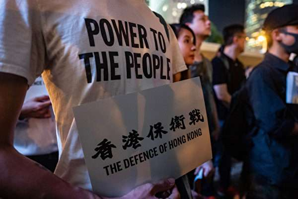
</a>

港警对反送中抗议者的抓捕行动被指在制造白色恐怖。港人表示，不会被吓倒。(Anthony Kwan/Getty Images)

 

【大纪元2019年08月30日讯】（大纪元记者张婷综合报导）香港警方开始对反送中参与者展开逮捕行动，一共有七人被捕，包括香港众志成员黄之锋、周庭等人。港人强烈回应称，即使亮出坦克也不会被吓倒，逮捕只能激起民愤，让更多人加入抗议。
 

除了黄之锋、周庭外，被抓人士还包括立法会议员郑松泰、区议员许锐宇、前港大学生会会长孙晓岚、前香港民族党召集人陈浩天等人，香港众志主席林朗彦也一同被控，但因不在香港而没有到庭。

目前黄之锋和周庭暂获准保释。

“我们将会继续战斗，我们将不会投降，”黄之锋在获得保释后说。
 

<b>任建峰：一方面喊对话一方面在抓捕 无异于挑起事端</b>

据彭博社报导，政治评论员、香港亲民主进步律师团成员任建峰（Kevin Yam）针对这次抓捕事件表示，在政府正在谈论与抗议者对话并试图降温之际，采取这样的行动（指抓捕）无异于在挑起事端。
 

“你不能一方面说，‘让我们降温，让我们对话，让我们和好，’另一方面却做出这种事情。”任建峰说。

任建峰8月30日在推特上表示，“对于今天发生的大抓捕，这个事件被视为香港到目前为止最大的事情，它撕毁了（中共对香港）‘高度自治’的承诺。”
 

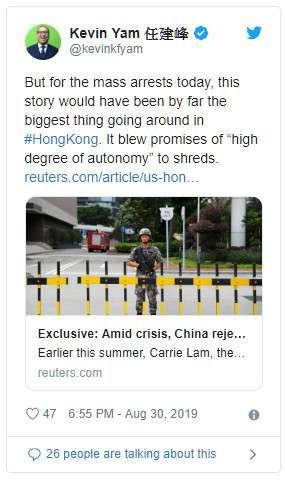
</a>
 

近日，网上传播着一条由署名“一群香港公民”所发表的言论说：“历史选中了香港，现在就是对香港人考验最严峻的时刻。尖沙咀将继续上演雷射革命；金钟水马前会继续黑影幢幢；元朗大马路永远是对抗乡黑的集结处。每晚十点的‘光复香港，时代革命’会一直一直叫下去。”“守护香港，战至最后一人。”

黄之锋此前曾表示，“即使我已经被捕入狱三次，而且我将在11月8日面临审判，但我们不会停止斗争。我们永远不会投降。我敦促国际社会向习主席发出明确信息：派兵或使用紧急法令并不是（解决问题的）出路。无论他们如何逮捕或起诉我们，我们都将继续战斗。”

<b>港民：不会被吓倒</b>

英国《卫报》称，针对港府目前发动的抓捕行动，很多人预计抓捕只能产生更大的公众愤怒。

“这不会吓倒我们。增加公众的愤怒只会推动更多人去抗议，”一名用户在一个抗议论坛上发表评论。

另一用户写到：“即使他们将坦克亮出，我仍将会在那里。”

一名推特名为“HK-妮珂”的网友8月30日在推特上说，香港人将继续下去。没有其它武器，只有信念，能够背水一战。信念终将会令当权者畏惧、颤抖、动摇、分裂。信念使我们团结，令盟友赞叹、敌人汗颜，直到撤回恶法……。”

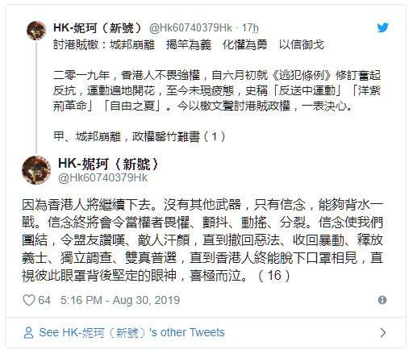
</a>
 

“昨天用黑社会对两个游行示威活动申请人暴露殴打，也对反修例者进行拘捕，一个一个的被拘捕新闻出来，香港人的反应是：明天更加要出来，如果不出来，就应由无耻独裁极权永远打压下去！香港人未惊过！”HK-妮珂8月29日在推特上写道。

自6月初香港爆发大规模抗议以来，已有800多人被捕。抗议的导火索是要求港府撤回对“引渡法案”的修订。因为该修订法案将会允许中共当局要求任何在港人士被引渡到大陆去受审。外界担忧，这会使得那些异见人士、人权维护者的处境变得尤为危险。

现在抗议持续了两个多月，港首林郑月娥曾多次发表讲话，并也宣布该法案“已死”，但却拒绝正式“撤回”法案。

8月30日，路透社引述知情人士披露了其中的内幕。林郑在今年夏天早些时候曾向北京提交了一份评估报告，并提议正式撤回“引渡法案”的修订，以缓和香港局势，但遭中共中央拒绝。

知情人士称，不仅如此，中共对抗议者的五大诉求全都说“不”，还要求林郑采取更多主动措施。

周五在黄之锋、周庭被捕后，香港众志发表声明说，“我们对警方于831前夕透过大规模搜捕示威者，营造寒蝉效应、白色恐怖感到非常愤怒。是次拘捕亦显然属政治操作，以煽惑、组织等较严苛的罪名拘捕被中共点名的‘运动领袖’，以配合中共舆论，将反送中运动描绘为有‘幕后黑手’推动，借此漠视市民提出的五大诉求。”#

责任编辑：林妍

 <a href=#list><h6 align="right">回目錄</h6></a>
   

 
<a name=a16><h2>路透：林郑提议撤送中法案 遭中共否决    </h2>
 

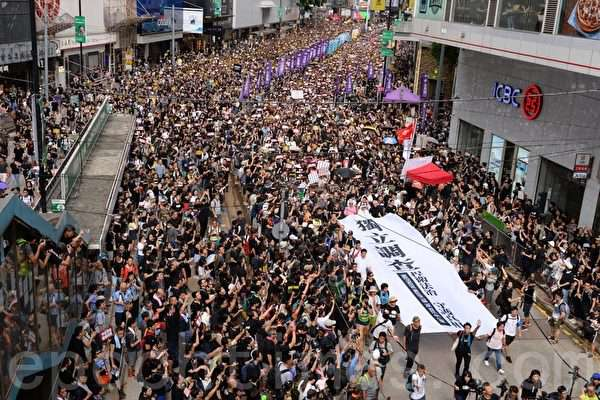
</a>

路透社8月30日引述知情人士披露，林郑月娥曾向北京提议撤回恶法，但遭中共反对。（宋碧龙／大纪元）

   
  
【大纪元2019年08月30日讯】（大纪元记者张婷综合报导）针对香港越演越烈的大规模抗议，港首林郑月娥发表多次讲话，但始终不宣布“正式撤回”修订《引渡法案》，引发民愤。路透社周五（8月30日）更披露内幕，林郑曾向北京提交评估报告，提议正式撤回，但遭中共中央拒绝。 
  
 

 此外，中共对抗议者的五大诉求都说“不”，并要求林郑采取更多主动行动。路透社的报导再次证实，中共操纵是香港乱局背后的真正原因。

中共对香港抗议者五大诉求说“不”内幕
路透社引述三名知情人士称，今年夏天早些时候，香港港首林郑月娥曾向北京提交一份评估抗议者的五项主要诉求的报告，指发现撤回有争议的《引渡法案》有助于缓解香港日益严峻的政治危机。但中共拒绝林郑的撤法提议，并指令说，她不应该屈服于抗议者的任何其它诉求。

报导称，北京在左右香港政府如何处理抗议事件中所扮演的幕后角色并不是什么秘密，已经得到外界广泛的认知。

路透社首次披露的内幕，为中共对香港政府回应抗议的控制程度提供了具体证据。

中共港澳办及中联办8月7日在深圳召开“关于香港当前局势座谈会”，而林郑的有关香港动荡的评估报告就在这次会议之前出炉。知情人士表示，报告分析了解决抗议者的一些诉求可能会让局势缓和下来。

除了撤回《引渡法案》外，报告中还分析了抗议者的其它四项诉求，包括对警民冲突进行独立调查、实行完全民主的选举、取消用“暴动”一词来定义香港抗议、撤回对目前遭拘捕人士的指控。

路透社引述香港政府一位不愿透露姓名的政府官员的话说，撤回《引渡法案》和进行独立调查被认为是政治上最可行的。他说，这一举动可以帮助安抚一些更温和的抗议者，这些人原本被林郑对抗议诉求的沉默感到愤怒。

《引渡法案》是促发香港大规模抗议活动的关键问题之一。林郑已经表示，该法案“已寿终正寝”，但拒绝明确宣布“撤回”法案。

路透社称，根据高级政府官员的消息，北京告诉林郑不要撤回该法案，也不要对香港动荡进行调查，包括警察过度使用武力。

另一位与香港高级官员有密切关系的知情人士证实，香港政府已经提交了这份报告。

“他们对五大诉求都说‘不’，”这位知情人士说，“局势比大多数人意识到的要复杂得多。”

另一位高级中共官员表示，香港政府已向政治局常委韩正领导的中央港澳工作协调小组提交了这份报告。

这位官员也证实，北京拒绝屈服于任何抗议者的要求，并想让林郑采取更多主动行动。

在回应路透社的一份声明中，林郑办公室表示，她的政府已经努力解决抗议者的担忧，但没有直接评论香港政府是否向北京提出这样的提议，或者是否接到北京的指示。

两位香港消息人士称，港府的这份报告向中共政府提交的时间在6月16日，也就是林郑宣布暂停引渡法案后的第二天，和8月7日中共港澳办及中联办在深圳就香港局势举行会议之间。

北京势力触及到香港“一国两制”治理的核心，“一国两制”原本被用来确保香港享有中国大陆不存在的高度自治和广泛的自由权。

长达两个多月的抗议活动使得香港陷入自1997年主权移交以来的最严重的危机之中。由于抗议者的诉求持续得不到回应，促使抗议到今日仍在进行。 

<b>林郑的双手被束缚</b>

亲北京人士、香港行政会议非官守成员叶国谦明确告诉路透社，“如果中央政府不允许做什么，你就不能做。”香港行政会议协助港首林郑月娥决策的最高级机构。 

一位参加了8月7日深圳论坛的商人近日与林郑会面。该商人告诉路透社，“她（林郑）的双手被束缚”，北京不会让她撤回这个法案。

中共负责香港问题的最高官员中联办主任张晓明在深圳会议期间发表电视讲话说，如果香港动荡持续，“中央政府必须干预”。

张晓明在深圳会议上拒绝了抗议者的自由选举要求，并明确说明，中国（共）政府不会考虑任何不允许北京对候选人名单进行筛选的选举制度。张晓明说，如果不进行筛选，就等于放弃对香港的控制。

自从那时起，持续有各种迹象表明，北京正在采取一个更强硬的立场。

针对路透社披露的中共拒绝批准满足抗议者五大诉求的消息，中共外交部发言人耿爽8月30日在回答记者问时没有直接对此事表态，但他说，6月15日，香港特区政府宣布暂缓修例工作的决定后，中国（共）中央政府表示支持、尊重和理解，对此没有新的补充。# 

责任编辑：刘颖 

 
  
   <a href=#list><h6 align="right">回目錄</h6></a>
   

 
<a name=a15><h2>港警抓人引发局势升级 欧盟发声力挺抗议者   </h2>
 

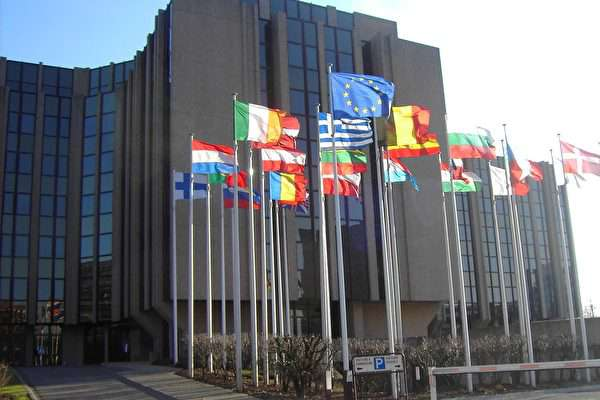
</a>

香港局势周五随着港警抓人事件而升级。欧盟表示极度担忧，并呼吁港府尊重港人权利。(Euseson/Wikimedia commons)

   
 
  【大纪元2019年08月31日讯】（大纪元记者张婷综合报导）周五（8月30日），香港局势升级，港警抓捕包括黄之锋、周庭等反送中抗议人士。欧盟当天表示，香港的发展情势令人极为担忧，并呼吁港府尊重公民权利。欧盟成员国官员也发声力挺香港抗议人士。

   
 香港警方周五拘留了支持民主的立法会议员和民间活动家，包括2014年民主抗议活动学生领袖黄之锋（Joshua Wong）和周庭（Agnes Chow）。他们被指控非法集会后获准保释。警方称已有28人被捕。

欧盟外交和安全政策高级代表莫格里妮（Federica Mogherini）当天在芬兰赫尔辛基举行的欧盟外长非正式会议记者会上表示，香港的发展，特别是过去几个小时的情势都令人极为担忧。

莫格里妮呼吁港府尊重市民集会、言论和结社的自由，以及市民和平示威的权利。

她强调，欧盟将与各成员国继续协调，关注香港情势对欧盟在港公民及欧盟的影响，努力让情势转回正轨。

欧洲议会议员、比利时前首相、欧洲议会自由民主党党团前主席居伊·伏思达（Guy Verhofstadt）周五发表推文说，“牢狱不属于那些为民主而奋斗的人：在香港抓捕三位知名活动人士是不可接受的！从俄罗斯到中国（中共），专制政权正试图压制政治反对派。但他们无法遏制人们对自由的渴望！” 

  
 
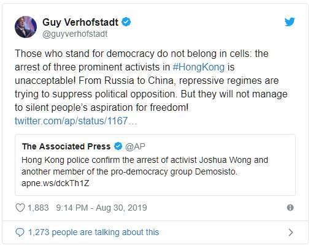
</a> 

  
英国下议院议员、外交事务专责委员会（Foreign Affairs Select Committee）主席托马斯·图根达特（Thomas Tugendhat）周五发表推文表示：“我对黄之锋和其他香港人的被捕表示非常担忧。这对自由集会和抗议的权利构成了挑战，而这种权利是一个自由社会的基础。”  

  
 
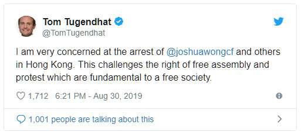
</a> 

  
丹麦首相梅特·弗雷德里克森（Mette Frederiksen）也就香港问题发声。她表示，“为获得基本权利而战是合法的。”

她还补充说，“丹麦政府不仅要尊重，还要支持这些权利”，并希望香港问题能够得到和平解决。

德国前驻华大使史丹泽（Volker Stanzel）8月29日在德媒《商报》刊文指出，香港危机已经进入紧要关头，面对中共，欧盟应该发出立场更鲜明的声音。

文章认为，随着时间的拖延，香港街头的示威者与中共在深圳待命的武警部队在10月1日发生对抗的可能性就越大。如果这一幕发生，对于中共而言，几乎就是失败。

文章最后表示，如果中共对于香港采取激进手段，影响绝不仅仅是些许不稳定，而将严重伤害欧洲利益。所以欧盟更应该利用与中方之间的经济关系，明言中共需向示威者做妥协的必要性。#

责任编辑：李缘

 <a href=#list><h6 align="right">回目錄</h6></a>
   

 
<a name=a14><h2>军队入港 三股力量围绕香港反送中激战    </h2>
 

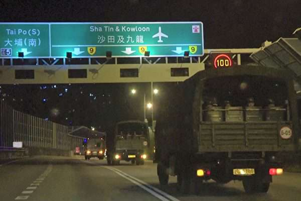
</a>

面对中共高层内部的分裂，香港民众会更强大。军队已经进来了，香港面临大决战、更多人会站出来维护香港。图为8月29日凌晨中共军队出没香港街头。(Handout / CCTV / AFP)

   
 
 【大纪元2019年08月29日讯】（香港大纪元记者王净文、余钢新闻综述）进入8月下旬以来，围绕香港正义民众的反送中抗争，全球聚焦香港，出现习近平阵营、中共江派及中共一些既得利益势力、美国川普（特朗普）为代表的全球反共势力，这三股力量交织博弈的复杂局面。
 
 
 
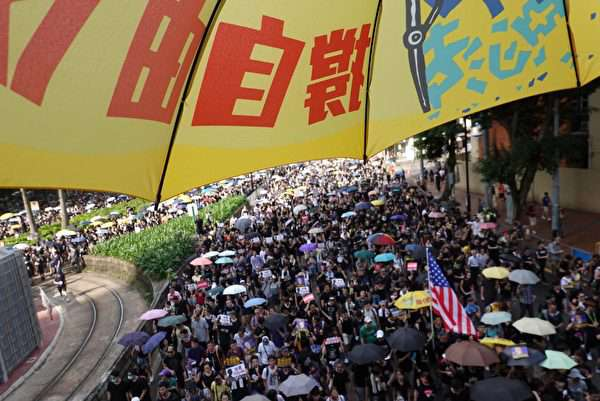
</a>

围绕在香港正义民众周围的，有三股力量，一个是习近平人马，一个是江派掌控的港澳办、中联办和港府的这套香港系统，再一个就是以美国为代表的国际社会的力量。（余钢／大纪元）

   
 
<b>反复动荡是因中共高层分崩离析</b>

体现在大陆媒体上，一会破口大骂香港人搞港独、是暴徒；一会又说香港人是朋友，香港对大陆贡献大；代表江派的《环球时报》的胡锡进一会说中央要保留出兵权力，一会又说“社会要扩大共识”，应包容自由派。体现在香港警察的暴力手段上就是，一会是几天安静的没有催泪弹暴力清场的和平游行，一会又是更加残暴的水炮、手枪镇压，见人就抓。

很多人都被这反复多变的局势搞糊涂了：为何会出现这么矛盾的做法？港府和北京到底想干什么？香港局势如何收场？三个月了，习近平是怎么想的，怎么做的？

19日习内部表态香港自己解决麻烦 港警不闹了</b>

最近香港反送中浪潮，从时间顺序看，8月18日170多万香港民众冒着滂沱大雨上街和平抗争，感动了全世界，也触动了中南海的部分高层。

据香港《大纪元》报导，据习在香港的亲信透露，当时北京一些高官观看香港近千个监视视频之后，被香港民众的勇气和智慧所震撼，他们说“不得不服”香港人了。

于是第二天早上，北京紧急向在港各机构部门负责人传达习近平最新表态。习称：“谁惹的麻烦谁自己解决，自己去善后处理，不要再给中央添压力。”

这等于表态，北京不会管香港的事，香港得自行处理，尽快平息民众怒气。否则，要追责。

很快，香港接下来几天的抗议活动，都没见警方用催泪弹清场。

<b>20日习视察甘肃 有人故意喊总书记万岁</b>

对香港问题首次公开表态后，习近平从19日到22日对甘肃考察。

首站即到敦煌，到了俗称“千佛洞”的莫高窟视察，习强调保护好文物让历史说话。不过有人猜测，今年以来中共内忧外患加剧，香港“反送中”运动持续，中美贸易战再升级，处于困境中的习近平是去敦煌求佛保佑去了。

随后习沿河西走廊自西向东，经嘉峪关、张掖、武威、乌鞘岭，来到兰州，随行人员有栗战书、刘鹤、丁薛祥等人。

20日在张掖市高台县，习近平去给西路军纪念碑和阵亡士兵公墓献花篮。这是当年中共领导人之一的张国涛，因与毛泽东闹内讧后，带领红军主力离开陕北西进，被国民党军围堵全军覆灭之地。

习到访高台县时，据官媒视频显示，有围观“群众”高呼：“总书记万岁”。这让人马上联想到毛泽东时期颂毛的口号。不过官媒通稿将口号改成了中国共产党“万岁”。有关视频随后也被官方网站移除。

按中共惯例，党魁所到之处，早就由地方官员“挑选”群众、“扮演”群众，一切早就编排预演了很多遍了，包括“群众”欢迎时使用的口号。中央早就下令不搞个人崇拜，不准搞“低级红、高级黑”，如今突然冒出一句普通话的“万岁”，显然有人故意安排。

习团队很警觉，马上删掉该视频，不过，强大的互联网传播效应，早就把“总书记万岁”传到海内外。

<b>22日官媒藉邓小平批习 习陷困局</b>

据多家媒体报导，8月22日习近平还没有回到北京，中共头号官媒《人民日报》出版社旗下的两个微信公众号“人民阅读”和“人民日报出版社”，就在当天出人意料地发布了一篇题为〈邓小平废除领导职务终身制〉的文章，一开头就说，废除中共领导干部职务终身制，建立退休制度，是邓小平成为其党核心后，提出的一个重要主张。

该文很快遭删除，不过海外很多网页做了存盘。文章引述邓小平的一段话说，由于传统习惯势力的影响，中共普遍地、长期地存在着一种“只能上不能下，只能进不能出，只能升不能降，只能留不能去，只能干不能退的倾向！因此想让某人自动废除终身制谈何容易。”

表面上看，8月22日是邓小平冥诞115周年，但《德国之声》评论说，人民日报两个公号都发布了这篇文章，明显是剑指习近平修宪废除国家领导人任期限制。

“这是中共党内对习政策不满者，借机发出的信号”。

大陆网友分析说：“这篇文章只放在很不起眼的党媒自媒体新闻中，……所以这并不是要“反了”的节奏，而是反习势力放出的暗箭。”

<b>23日中共突然加关税 美国也加关税贸战升级</b>

人们常说，世界变得像个地球村，中国的事也紧紧与美国联系在一起。

早在8月14日、15日，各界盛传中共要出兵镇压香港时，美国总统川普就多次发推文，呼吁习近平坐下来和香港抗议民众对话。

他说，“中方想要达成（贸易）协议，但是先让他们人道地解决香港问题再说！”

20几分钟后的6点59分，他又说，“我相当了解习主席，他是个很优秀的领导人，而且受他的人民尊重。他也是‘一个烂生意’里的好人。我毫不怀疑，如果习主席想要快速地、人道地解决香港问题，他能做得到。私下见面如何？”

8月15日下午，川普接受媒体访问时表示，“我很忧虑。我不想看到残暴镇压。”

“如果他（习近平）与抗议者，一群有代表性的抗议者坐下来，我敢打赌他会在15分钟内完成它（解决香港问题）。我打赌他会很快解决这个问题。我知道这不是他会做的事，但我认为这不是一个坏主意。”川普说

8月18日，170万人风雨中流水式集会，感动了全世界，更感动了川普总统，他正式把香港的抗争与贸易谈判挂钩。 
 

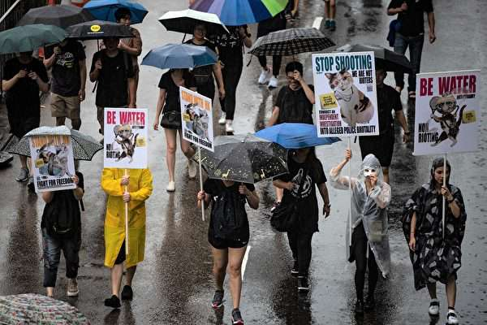
</a>

8月18日，170万人风雨中流水式集会，感动了全世界，更感动了川普总统，他正式把香港的抗争与贸易谈判挂钩。(Philip FONG / AFP)

    
 
8月22日习近平刚回到北京，23日中共突然宣布对750亿美元的美国商品加征报复性关税。有评论说，这是中共不满川普把香港问题与中美贸易战挂钩，从而做出的报复行为。也有评论说，在最近的中美谈判中，中共商务部长钟山也参加了谈判，据说钟山对美国很强硬。

面对中共的报复，23日同一天，川普在推特（Twitter）上发多条推文谴责中共，之后宣布对总计5,500亿美元的中国商品提高5%的关税，还要求美国公司立即开始寻找替代中国商品的选项。

<b>《人民日报》突然刊出“你好！我的香港朋友”</b>

显然，川普总统8月17日宣布要把香港问题与贸易战联系在一起的强硬态度出来后，中共对香港策略发生了调整。

央视新闻联播近一个月来，几乎每天都有两至三条有关香港示威新闻，环节长约10分钟，内容全是抹黑香港的抗争活动，但央视24日的新闻联播竟然没有报导香港的示威消息，连示威者冲击情况亦十没提及，内容大部分是中美贸易战。

过去两个多月来，大陆媒体一直对香港反送中运动摆出杀气腾腾姿态，但这时《人民日报》却温言地称呼：“你好，我的香港朋友”。24日当天《人民日报》上载了一段视频，指“香港的未来，在我们每个人手中。安宁还是混乱、文明还是暴力、繁荣还是萧条，此刻的香港，等待一个正确的选择。”但内容却没再大肆渲染香港示威者“暴力”情况。

甚至一向扮演政治宣传“烂头蟀”的《环球时报》总编辑胡锡进，也一改过去多日为“旗下记者”付国豪在港受辱一事炮轰香港的语调，似乎忽然“觉悟”到社会需要扩大共识。

他表示，社会要扩大共识，甚至要团结自由派人士，“人们有着不同诉求，差异是绝对的。但是有序的社会治理又符合绝大多数人的利益和愿望，这是社会围绕法治扩大共识的基础。”言下之意，似乎与林郑口吻一致，先希望香港平静，才考虑回应诉求。

而在一个月前的7月24日，胡锡进还发表了社论：〈解放军干涉香港？应留屠杀或清洗“干预牌”〉。

胡锡进称，中港的政治制度不同，在基本法中载明，“驻港解放军不应干涉香港内政”。至少在现阶段以“一国两制”让港人治港。

倘若解放军控制了香港的局势，问题是该地区缺乏协调的机制，也没有巩固局势所需的力量，激进的示威者会继续“诽谤和骚乱”，西方国家将进行口头谴责，带来更多的不确定性。

他表示，北京方面所能做的，就是提供特区政府法律上的援助，并鼓励香港警察履行职责，应对“暴力”示威者。

但接下来他话锋一转：“然而，中国应该留一张‘干预牌’在牌桌上以防万一，像是大屠杀或是对香港爱国居民的清洗。”

最后胡锡进表示，除非香港面临极端或根本性的改变，否则北京都无须采取行动。胡锡进指，解放军不是香港社会秩序的消防队。

根据《中华人民共和国香港特别行政区驻军法》第3章第14条，香港特别行政区政府根据香港特别行政区基本法的规定，在必要时可以向中央人民政府请求香港驻军协助维持社会治安和救助灾害。

<b>24日后香港警察更加暴力镇压 习政令不奏效</b>

大陆官媒的变软，估计是习近平的指示。习8月19日就下令香港的事香港自己解决。言外之意，中央不管。不过，香港警察从8月18日到23日消停了几天之后，突然在24日又开始暴力驱散抗议民众，而且手法更加恶毒。 

 
 
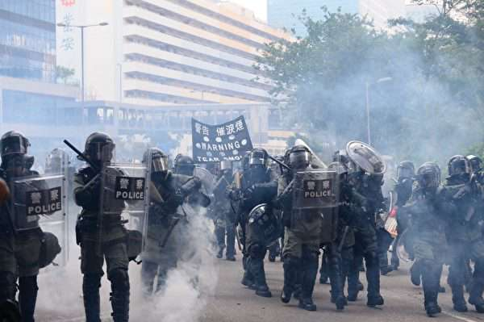
</a>

2019年8月24日，港人举办“清除杂草 观塘开花”九龙东观塘大游行。防暴警察在牛头角警署外施放催泪弹。（宋碧龙／大纪元）

 

8月24日，观塘游行后，示威者设置路障，有人转到九龙湾，警方分别在两处暴力清场，狂射催泪弹。入夜后，黄大仙、深水埗等区都出现了警察暴力清场，有民众明显受伤出血了，仍被警察在地上拖行，并用警棍狠狠殴打，很多人被抓。

香港警方的恶劣态度，其实是与习近平的指示背道而驰的。习近平要求香港政府尽快平息矛盾，但港警却在不断恶化矛盾。

<b>25日荃湾游行 警察动了真枪和水炮 </b>

 
 
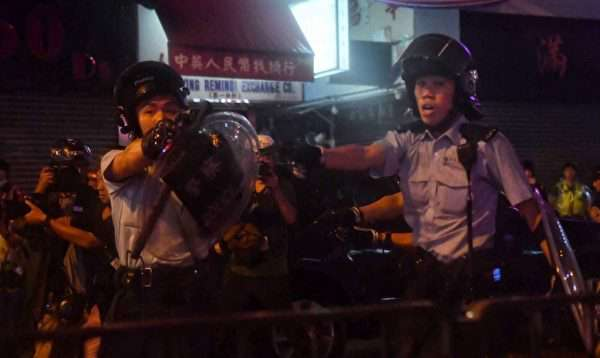
</a>

香港荃湾地区2019年8月25日爆发警民冲突的过程中，有数名警员将手枪指向抗议者。(LILLIAN SUWANRUMPHA/AFP/Getty Images)

 

 
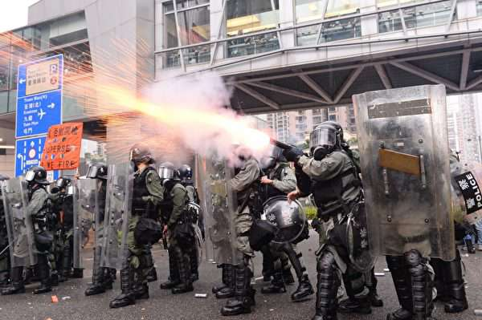
</a>

警方不停在杨屋道发射催泪弹。（宋碧龙／大纪元）

 
 
 除了大量发射催泪弹，警方还首次动用了水炮车和装甲车来驱散抗议人群。晚间8时左右，沙咀道警方被人追打，警方举起左轮手枪，首次动用真枪实弹对付示威者。

推特上有视频称，荃湾冲突中，最少有三名警察拔出手枪，现场听到了枪声。有警察把一个跪地请求不要开枪的老人家一脚踢开。

消息传开，香港人非常愤怒，更多人表示要参加8月31人的大游行，为了守护香港而最后一战。

<b>26日刘鹤连夜打两电话 外交部否认</b>

8月25日，世界上经济最强大的七个国家的首脑在法国召开了G7峰会。26日，川普总统对记者表示，前一晚收到中国的两个电话，要求“让我们回到谈判桌”。

然而，中共外交部却否认中共给美国打了电话，直到川普普说出打电话的是刘鹤之后，外交部也不承认。川普说，副总理，中方谈判负责人，“级别不低吧？”而王沪宁控制的大陆媒体依旧密集发文，批判美国。

评论说，习近平亲信刘鹤与中共江派把控的外交部及党媒不同调，这突显中共内部已分成两派，一个是强硬挑起香港冲突、阻止中美达成协议的江泽民派系，一个是习近平势力。

<b>石藏山：习被江派挟持 一再错失脱离中共机会</b>

8月26日，习近平还召开了财经委员会，陪同到会的有王沪宁、韩正、李克强。华府中国问题专家石藏山表示，显然习近平在经济大权上、宣传上都被江派挟持了。

石藏山认为，习现在陷入困境中，他政令出不了中南海，他身边没有其他人，被韩正、王沪宁左右了，栗战书被排挤在外。他做什么正事都做不成，怎么发声都没有用。

他分析，在香港问题上，习近平的表态事实证明是不起作用的。其实，习近平错过了很多非常好的机会。川普点名要习近平出来和香港民众对话，明确指出香港问题处理不好，就不可能有中美协议，美国就会与中共脱钩。假如习近平有魄力，他当时就该藉川普的话，一举拿下掌控香港的中共江派势力，从而把香港收回到自己手中。

若习的势力在军方还未完全失守的话，习近平现能控制的，只有在香港的军队，也就是驻港部队，而江派从曾庆红时代就控制香港，到现在的中央港澳协调小组的组长韩正，国务院港澳办主任张晓明，香港中联办主任王志民，再加上香港特首林郑月娥，都属中共江派势力。

8月24日，建制派议员呼吁驻港部队出来维护香港局势，但江派不想让习近平利用军队插手香港。一旦军队开始行动，习近平就能得手，然后习就有机会追究韩正、张晓明、王志民、林郑月娥的责任，并扶持自己认可的人换上来主导香港。

这段时间的新闻显示，江派就利用早就冒充香港警察的大陆武警，以及悄悄混入香港所谓便衣示威者，故意激化矛盾，不断残暴殴打抗议民众。在暴力攻击下，民众开始自我防御，官方就大肆抓人，从8月24日开始，香港到处都是战火，红色恐怖非常严重。

石藏山还分析说，23日川普收到北京报复关税，非常恼火，误认为习近平干的，川普首次提出脱离中国的底牌，还把习归为敌人。

习近平派刘鹤连夜二次电话解释，但江那边已不承认刘鹤了，外交部高调否认刘鹤的“不想升级谈判及有电话与美联络”，对美态度非常强硬，意思是刘鹤说了不算。

外交部与刘鹤的不同调，这也公开曝光习近平被中共挟持的困境，以及中共江派与习的冲突激烈程度。现在几乎所有中共海外媒体都屏蔽川普说的“接到刘鹤来电”的新闻。这说明很大的问题，刘鹤是代表习近平的，不承认刘鹤的话，其实就是不承认习近平的话。

<b>习近平被江派挟持架空</b>

目前香港这边，江派不想军队进来，企图用《紧急法》封杀港人游行集会的权利，想利用香港军阀动乱时期的恶法来变相戒严。现在香港警察非常凶狠，27日已经基本宣布，民众提出的五大诉求，一个都不可能答应。

香港人目前还没有让步迹象，现围绕在香港正义民众周围的，有三股力量，一个是习近平人马，一个是江派掌控的港澳办、中联办和港府的这套香港系统，再一个就是以美国为代表的国际社会的力量。

26日结束的G7峰会上，美国、英国、法国、加拿大、德国、意大利、日本的国家元首发表联合声明，肯定了1984年香港《中英联合声明》的存在与重要性，这是该声明所获得的前所未有国际重视，意味着若中共违反《中英联合声明》，全球最强的七国将联合对付中共。

《大纪元》评论员臧山称，如果习近平能看清局势，摆脱王沪宁这个贴身“宣传党棍”，同时有勇气与江派斗争，局势就会很快变化，因为无论是香港民众还是国际社会，都支持习近平从江派手中夺回控制权。

前中南海常委会秘书王立群认为，如果习近平还是舍不得撕破中共表面团结的假外套，没有勇气去冲破江派的阻挠，今后无论发生什么，罪责都会算到习近平头上。

他分析，面对中共高层内部的分裂，香港民众会更强大。军队已经进来了，香港面临大决战、更多人会站出来维护香港，习近平最需要做的是果断除去中共韩正、张晓明、王志民之流，抛弃中共后重启中华梦。#

责任编辑：连书华

 
 
<a href=#list><h6 align="right">回目錄</h6></a>
   

 
<a name=a13><h2>张林：香港人为什么坚持抗争？     </h2>
 

</a>

香港人绝地反击，6月26日晚到中环爱丁堡广场集会，趁G20峰会前夕，藉国际压力再向特区政府施压，要求回应五大诉求。（宋碧龙／大纪元）

     
  
  【大纪元2019年08月28日讯】持续两个半月的抗争并没有给香港人带来任何好处，抗议者自己出钱买头盔，防毒面具，牺牲工作时间和赚钱机会，几百人被捕，几千人受到港共警方催泪弹及黑帮暴力袭击伤害。
  
  
 而且香港的经济活动正在萎缩，这意味着将有许多人失业，尤其是抗议者；这还会导致香港房地产价值缩水，所有香港人都会蒙受经济损失。

而且最大的威胁，还是来自中共。遍布香港的中共情报机构，和混入示威者的中共特务，十几万地下共产党员，十几万黑帮，最终都会把抗议者的情况摸清楚，将来好进行报复。

尤其那些最近进入中国境内的抗议者，已有很多遭到中共秘密逮捕，甚至连英国驻香港总领事馆的职员都被罗织罪名关押。

而且港共政府依然强硬，看不到任何软化、认错的迹象。北京除了陈列大量军警在深圳，对港人威吓外，还在持续不断地派遣更多特务进入香港。林郑月娥政府更是一再强硬表示，绝不肯回应港人五大诉求。

然而香港人依然无视利益，坚持抵抗，究竟是为了什么？因为对中共暴政的愤怒！因为对香港前途的绝望！因为要守护自由！因为要捍卫人格尊严！

也许像我这样曾经被中共五次劳改劳教的良心犯，才能理解香港人，特别是甘愿牺牲的勇武派抗议者的心愿：由于内心深处对中共暴政的愤怒！

我在中国生活的时候，常常对中共时时处处的无理行为感到愤怒，因为他们总是那么荒谬、蛮横、残忍，而且对待批评，不是设法理解，而是恼羞成怒地打击报复。

而且每次中共政治迫害一个人，或者一群人，都是捏造各种各样荒诞不经的罪名，足以让人感受到刻骨铭心的屈辱和仇恨。

所以尽管一次又一次被抓进监狱，受到严重伤害折磨，我也非常恐惧再次入狱，但是我总是无法遏止对中共暴政的愤怒之情，总是情不自禁地抨击中共，总是奋不顾身地抵抗暴政。

那些在最前线的香港勇武派抗议者，多半也正是和我一样的心态。因为中共总是太无道了、太蛮横了、太残酷了、太猖狂了！

中共已在香港逞凶22年，一点一点地蚕食香港人的自由、人格尊严，香港人已经积累了太多的仇恨与愤怒。中共不知道适可而止，反而不断加强对香港人的压迫，导致香港人实在忍无可忍，只能进行绝地反击！

而且令人钦佩的是，香港人知道他们可能面临的危险：长期抗争，尤其是长期罢工会使香港变成死港，香港经济崩溃，港人的主要财产——世界上最贵的房地产可能一文不名。

还有更大的危险，就是面对港人越来越激烈的抵抗，中共一旦蛮横到底，有可能派出大量军警对香港戒严。然后香港就可能成为第二个新疆，百万港人可能被中共投入集中营，或者被抓到内地分散关押，实行强迫劳动改造。

甚至许多决心抗争的香港人，早已写好遗书！许多人甚至背着遗书去街头抗争！他们每次离开家门去抗争，都做好了牺牲生命的准备！

不自由，毋宁死！

责任编辑：朱颖 

  
   
<a href=#list><h6 align="right">回目錄</h6></a>
 

<h3 align=center>80多天反送中运动已取得重大成果 </h3>

 
<a name=a12><h2>七国首脑联合肯定《中英联合声明》    </h2>
 

<h3 align=center>香港抗争出路正汇入全球灭共大潮 </h3>  

<h3 align=center>王友群、晨钟</h3>  

   

</a>

七国集团峰会（G7）在法国落幕。七国领导人支持在1984年《中英联合声明》中规定的香港自治权。 (Andrew Parsons - Pool/Getty Images)

    
  
【大纪元2019年08月29日讯】已经进行了将近三个月的香港反送中运动成为了世界焦点，无论在香港或在国际社会上均取得了抗争成果。在香港，运动阻止了《逃犯条例》修订在立法会被强行通过。在国际社会方面，多个国家的政界先后发表言论支持香港人的诉求。8月18日，170万港人冒大雨，不畏中共派兵入城的威胁，进行了“流水式”的集会，除了感动世界之外，美国总统川普（特朗普）更提出了香港若出事，中美贸易就不用再谈的言论，正式把香港的抗争与贸易谈判挂钩。

最新一轮的成果就是在刚结束的G7峰会上，美国、英国、法国、加拿大、德国、意大利、日本的国家元首发表联合声明，肯定了1984年香港《中英联合声明》的存在与重要性，这是该声明所获得的前所未有国际重视，意味着若中共违反《中英联合声明》，七国将联合对付中共。

反送中运动抗争给世界展示了以道德面对强权的勇气，其出路正在汇入世界灭共的大潮中。

<b>美英法加德意日 强势力挺香港</b>

从6月9日至今，香港反送中运动已持续两个多月。在此过程中，香港人表现出的和平、理性、非暴力，赢得了全世界越来越多人的支持。8月24至26日，在法国举行的七国集团峰会上，全世界最发达的七个国家的元首，明确表达了对香港人争取自由、民主、人权、法治的支持。这是迄今为止，整个自由世界最高级别的政治领袖就香港问题发出的最强音。

尽管中共一再表示，《中英联合声明》是过时无效的历史文件，不具有任何现实意义和约束力，美国总统川普、英国首相约翰逊、法国总统马克龙、加拿大总理特鲁多、意大利总理孔特、日本首相安倍晋三，在联合声明中仍然明确表示，“七国重申1984年香港《中英联合声明》的存在与重要性，并呼吁各方避免使用暴力。”七国首脑明知中共会不高兴，甚至会提出抗议，仍坚持将《中英联合声明》搬上台面，敦促中共信守承诺，维持香港的自治，显示七国领导人都“深切关注”香港局势，支持“稳定和繁荣”的香港。

1984年12月19日，时任中共总理赵紫阳和英国首相撒切尔夫人签署的《中英联合声明》承诺，香港在1997年7月1日之后实行“一国两制，港人治港，高度自治”，50年不变。其中明确规定，“回归前香港的社会、经济制度不变；生活方式不变。各项权利、自由、私人财产、企业所有权、合法继承权以及外来投资均受法律保护。”1985年6月12日，中英两国政府把《中英联合声明》送交联合国登记备案。这个声明分别载于《联合国条约集》第1399卷和《中华人民共和国条约集》。

<b>香港问题与贸易协议挂钩</b>

七大国中的美国总统川普，最近接连不断就香港问题发表看法。8月14日，川普在推特中写道：“中国（中共）政府想要达成（贸易）协议。让他们先人道地解决香港事件！”这是川普第一次将香港问题与中美贸易协议挂钩。8月18日，川普重申，如果香港发生“天安门事件”（1989年“六四”屠杀事件），“我就很难签署（美中贸易）协议”。

8月26日，香港立法会议员叶建源接受访问时，谈到了六位香港立法会议员的美国之行。他说，现在香港的问题，联系着中美贸易战，整个美国议会对香港的关注程度史无前例。当170万香港人走上街头时，救护车在人群中穿过，美国议员非常感动，他们对香港人和平、理性、非暴力的游行感受深刻。美国民主、共和两党议员提出的《香港人权与民主法案》，如果摆上台的话，估计很快就会通过。  

  
 

</a>

8月18日，170万人参与流水式集会秩序井然，救护车通行无阻。（骆亚／大纪元）

   
  
  谈到香港问题，中共动不动就拿“不许干涉中国内政”说事。白宫前首席战略顾问班农说：“我认为这是一宗国际性事件，且我认为国际社会需要聚焦在此议题上。”“当初那份中国官方与香港人民达成共识的主权移交协议（《中英联合声明》），是大英帝国与中国之间的国际协议。为此，美国还于1992年通过了相关法律支持这一国际协议。我想，参议员马可‧鲁比奥在他个人的推特上已将此争议点诠释得淋漓尽致。”他解释说。
 
<b>国际社会空前关注香港</b>

香港反送中运动爆发以来，国际社会一直密切关注。香港发生的一切，通过互联网，迅速传遍全世界。香港特首林郑月娥顽固拒绝民众诉求，香港警察胡乱施放催泪弹，狂暴殴打手无寸铁的示威者的视频，在网上疯传。中共以及中共操控的港媒对香港示威者的抹黑、攻击、谩骂，全世界能够自由上网的人都看得一清二楚。
 

班农说：“香港这些年轻抗议群众的所作所为，是我见过最接近于1776年帮助美国独立的爱国者行为。这些抗议者拥有非凡的勇气、缜密的心思，以及严格自律的心态，他们不会被轻易打倒。他们让我联想起约翰‧亚当斯、山缪‧亚当斯、派屈克‧亨利、汤玛斯‧杰弗逊、佐治‧华盛顿、汉弥尔顿，这几位1776年坚韧不拔的爱国者，没有他们，不可能有当今独立的美国。这些香港的抗议者令我回忆起这些历史。”

8月17日，“全球支持香港联盟”北加州分会成立。之后，纽约分会、华盛顿分会、波特兰分会、西雅图分会等，一个接一个成立。

美、英、德、法、加拿大、澳洲、台湾、欧盟、联合国等政府和机构纷纷发声，关注“香港高度自治权”，支持香港人民守护自由。8月10日，英国脱欧党领袖法拉奇表示，全世界都要坚定地支持香港抗议者。
 
<b>反送中运动打开中共灭亡大门</b>

香港民众以汗水、鲜血、生命来抗争，走过了80多天，这一场抗争最终的出路在哪？香港的问题归根究底就是中共的问题。“一国两制”走到今天已经让世界看清楚，在极权政权下是不可能容得下民主的运作。共产党是威权政治，在绝对的控制下，才能确保党的管治。
 
  
  

</a>

反送中运动令香港人认清中共真面目。图为8‧18维园集会者手持“共产党=纳粹党”的标语。（叶依帆／大纪元）

   
  
 整场运动从6‧12到7‧21元朗事件，打破了香港人心中的“公义”和“安全”，香港不再是香港人认知的香港，不少香港人感到抗争步伐不能停止，因为屈从于威权，面对的将可能是更可怕的未来。
 

在8‧18维园大集会民众的发言中，他们也意识到香港的未来与中共的命运不可分割；只要中共不倒，《基本法》内保障香港人能享有的民主、自治是不可能兑现的。这是香港人在主权移交22年中，一次又一次的争取中参悟出来的真相。

不少香港人认为这次反送中运动是“最后一战”，因为一旦修例成功，香港无异于中国其它城市，“一国两制”形同虚设。所以他们尽最大的努力去抗拒强权。8‧18维园大集会上参与者的发言清楚反映他们对香港未来的认知。

一名90后的女士举着共产党是法西斯的牌子上台演讲，“香港要争取真的民主，不推翻共产党不行的。而我觉得今次香港的运动已经正式打开了共产党灭亡的大门。香港是共产党的命脉，是共产党的咽喉，如果香港‘揽炒’（玉石俱焚、两败俱伤），共产党立即完蛋。” 
 
  
  

</a>
  
 
  她以新疆集中营为例表示香港人已没有回头路了，“其实在新疆集中营里面发生什么事，大家都很清楚，因为我们不用翻墙。我们知道新疆有些女性被强行绝育、被性侵犯、消灭语言、消灭宗教、消灭民族的意识，我很肯定地跟大家说，我们这次是没有回头路了。”

“如果我们失败了，香港立即变新疆。”她说。

一名戴口罩的年轻男生上台演讲表示，他在日本参观的时候，发现日本人杀了2000万的中国人，“但是共产党掌权的时候，它杀了8000万的中国人，是日本人的4倍。面对这样残暴的中共政权，我们不得不反共，但反共就会有牺牲”。

他介绍自己有一个朋友在前线被抓了，“我听到他讲8个字‘光复香港、时代革命’，最后他的头被人打爆了，在意识开始不清楚时，他用最后一丝力量喊出‘光复香港，时代革命’。我之所以讲这个故事是希望大家珍惜为了全香港在前线的年轻人，我们应该想想怎么样保护他们。”

8‧18感动了世界，同时也将香港的抗争与中美贸易谈判挂钩。在美国，中美贸易的谈判让美国国会内变的团结，明白到中共的野心，以美国为首，世界对华为的忧虑，香港反送中运动让世界看到一个曾经文明自由的社会如何被蚕食，渐渐走向极权。如果二次世界大战是世界对纳粹，从中美贸易战到香港反送中运动就是世界对中共的决战。#

责任编辑：连书华

  
  
  
  
<a href=#list><h6 align="right">回目錄</h6></a>
 

 
<a name=w14><h2>程晓容：中共代理人海外行不义 下场可悲   </h2>
 

   

</a>

2019年7月26日，香港一批航空界职员在香港机场的接机大厅举行集会抗议。图为抗议人士以“内除傀儡林郑 外拒中共虎狼”、“还我香港”等横幅表达心声。（宋碧龙／大纪元）

  
  
  【大纪元2019年07月27日讯】近期，在中共对外渗透的多条战线上，不少红色代理人都深陷泥潭。这些负面事例带来深刻的教训，关乎道义和良知。
  
  
在香港市民“反送中”的风暴中，民心向背一目了然。特首林郑与北京站在一起，漠视港人诉求，不分良民和暴民，民众要求罢免之声不断。

亲共立法会议员何君尧因涉黑而触众怒，其办公室被毁坏且殃及家人。有网民发起“白宫联署”，要求美国政府禁止何君尧及其家人入境美国或移民，已获17万人签名。另有《香港经济日报》副社长石镜泉因反对港人示威及鼓吹暴力而深受谴责，被迫辞去副社长及公司执行董事之职。

为中共效力者，除了中共体制内各系统人员以外，还有一众外围人马，包括政客、科技工商界、文化传媒人士，以及侨团甚至黑社会等。这些人在海外积极执行中共的任务，辅助中共渗透——输出共产意识形态，宣扬中共的学说及策略，以政治献金等形式收买政要，大搞科技窃密，配合中共所需煽动仇恨、制造骚乱等等。他们的活动及破坏力引起了多国情报部门的重视，许多人已经受到或正在面临法律制裁。
  

<b>前香港高官何志平行贿罪成</b>

2019年3月25日，中共政协委员、香港前民政事务局局长何志平行贿罪成，在纽约南区联邦法院被判处3年监禁及罚款40万美元。何志平在最后陈述中表示，他没有想到在人生的最后篇章会声名尽毁。
  

何志平于2017年11月在美被捕，被控违反“海外反腐败法”、洗黑钱、串谋犯罪等多项罪，他在被拘押期间三度申请保释均被拒绝。检方指出，何志平帮助中国华信能源向利比亚、卡塔尔、南苏丹和乍得出售武器，涉嫌违反美国对伊朗的制裁，撮合武器交易和与伊朗之间的商业活动。

据媒体披露，在上个世纪80年代，何志平开始讨好中共。他经常到内地为高官诊疗眼疾，与中共高层渐渐走近。90年代，何志平获选政协委员等职，转向政界。何志平卸去官职后，更加效力中共。2007年，他推动成立“香港中华文化学院”，在海外搞统战。他还在“香港中华能源基金会”担任要职，被指充当“白手套”介入非洲石油交易。

美国法官表示，腐败是严重罪行，损害法制，导致侵犯人权，扭曲市场，并且允许有组织犯罪、恐怖主义和其它对人类安全的威胁泛滥。
  

<b>为中共作代理 前国航经理纽约认罪</b>

2019年4月17日，前中国国际航空公司经理林英（音译，Ying Lin）在纽约东区联邦法庭认罪，承认她在任职期间作为中共政府的代理人，帮助中共常驻联合国代表团的中共军方人士（国防部雇员等），将未经扫描检查的包裹，从纽约走私回中国。
  

助理总检察官德默斯（John C. Demers）表示，“这起案件是中国政府利用中国公司员工在美国从事非法活动的一个鲜明例子。隐瞒中国军方在美国土地上的竞争是犯罪行为，林英和中国军方利用商业企业逃避美国政府的合法监管。”

除了面临最高10年刑期，林英同意没收14万5千美元财产。她也被警告，如果她被发现在申请归化入籍时有所隐瞒和欺骗，政府“有可能”会取消其美国公民身份。 
   
  

</a>

前国航经理林英（音译，Ying Lin）4月17日在纽约认罪。图为林英（白外套者）。（蔡溶／大纪元）

    
  
<b>江苏国安间谍被起诉</b>

2018年9月25日，27岁的中国公民季超群在芝加哥被捕。他被控在江苏省国家安全厅一名高级情报官员的指导下，在美国境内招募工程师和科学家充当中共间谍，违反了美国“外国人代理人法案”。
  

季超群在美国获得了电气工程硕士，2016年春入伍参加美国陆军预备役。在申请参军时，季超群没有承认他与中方情报人员的联系。他在2018年5月向美国联邦调查局卧底特工承认，他在大陆上学时即被招募为间谍。

2018年4月1日，江苏省国家安全厅第六局副处长徐延军在比利时被美国联邦调查局诱捕，10月9日被引渡到美国，现已被俄亥俄州南区联邦大陪审团起诉。徐就是季超群的上线指挥官，他面对四项阴谋并试图进行经济间谍活动和窃取商业机密的指控，如果这些罪名均被判有罪，徐将面临长达25年的监禁和经济处罚。

2018年10月30日，美国联邦检方宣布了对10名中共间谍的指控，其中查荣（Zha Rong音译）、柴猛（Chai Meng音译）2人是江苏省国安厅的情报官。根据美司法部发布的起诉书，在5年多的时间里，这些中方情报员指导黑客等其他人员，多次入侵欧美私营公司的计算机系统，窃取商用喷气式客机中使用的涡轮风扇发动机机密。
  

<b>中国富商被取消澳洲永久居留权</b>

2019年2月，澳洲媒体报导，澳大利亚政府拒绝了中国富商黄向墨的入籍申请，并取消了他的永久居留权。拒绝其入籍的理由包括其品行问题，以及他在入籍面谈时回答问题的可靠性等。
  

澳大利亚《悉尼先驱晨报》说，过去5年来，黄向墨向工党和自由党捐献了大约270万美元的政治捐款。黄借此希望有关议员在南中国海问题上替中国（中共）说话。

黄向墨同中共关系密切，他是澳大利亚“大洋洲中国和平统一促进联盟”主席，此前还曾担任“澳大利亚中国和平统一促进会”会长。这两个团体都被认为是亲北京的组织。另外，黄向墨还资助了澳中关系研究所，该智库机构由澳洲前外长鲍勃·卡尔（Bob Carr）负责运营，卡尔也是亲共人士。
  

<b>澳洲亲共议员辞职退场</b>

</a>

2017年12月12日，澳洲工党参议员邓森（Sam Dastyari）宣布退出议会和辞去参议员的职务。(WILLIAM WEST/AFP/Getty Images)

    
  
  2017年12月12日，34岁的澳洲工党参议员山姆‧邓森（Sam Dastyari）宣布退出议会、辞去参议员的职务。此前，媒体曝光了邓森与中共关系密切并且影响到澳洲利益的一系列问题。邓森被指未把澳洲的利益放在首位。
    

据澳洲主流媒体“费尔法克斯”（Fairfax Media）披露，邓森可能违反了工党有关政治捐款的规定、允许中国捐赠者为他的旅行和法律诉讼买单。

2015年，邓森曾经试图阻止工党的副领袖普利波塞克（Tanya Plibersek）在香港会见民主人士郑宇硕，理由是：二人的会晤将会惹恼澳洲的华人社区。

2016年，邓森公开向中文媒体表示支持中共在南中国海政策的立场，当时中国富翁黄向墨也在场。2017年10月，邓森到黄向墨家中拜访，向他通风报信，警告黄提防手机被情报部门窃听。
    

<b>结语</b>

中共海外大举渗透，将谎言、腐败、仇恨、动乱、欺诈等丑恶输出到多个国家和地区，破坏了经济的正常运作及科技的公平竞争，损害自由法治，危害社会安定。
    

中共的本性是假、恶、暴，反天、反地、反人类。与中共交好，必然沾染邪气，走向歧途。那些跟从中共的间谍及代理人等，被眼前的名利所诱惑，为中共行不义之事，纷纷遭到了报应。他们失去了财产、事业、自由、信任。很多人身败名裂，甚至祸及家族。如果不能幡然悔过，他们将永远背负恶名，承受道义的谴责。#
    
  

</a>

2019年7月26日，香港，一群航空界职员在香港机场的接机大厅举行集会抗议。图为抗议人士表达心声。（宋碧龙／大纪元）

    

责任编辑：高义
 

 <a href=#list><h6 align="right">回目錄</h6></a>
 

 
<a name=w13><h2>中共在LinkedIn招间谍 丹麦前外交官揭秘   </h2>
 

   

</a>

美国、英国、德国和法国情报机构已对外国代理人在接触LinkedIn上数千用户的情况发出警告，官员们强调，中共间谍在LinkedIn上最活跃。(Justin Sullivan/Getty Images)

【大纪元2019年08月28日讯】（大纪元记者苏静好综合报导）西方反情报官员表示，外国特工正在利用社交媒体招募间谍，而LinkedIn则是主要目标。美国、英国、德国和法国情报机构已对外国代理人在接触LinkedIn数千用户的情况发出警告，官员们强调，中共间谍在LinkedIn上最活跃。

《纽约时报》8月27日 报导，中共代理人或机构经常通过包括LinkedIn在内的各种渠道提供优惠，以便将潜在人员带到中国，有时候是通过公司招聘的幌子提供付款，以支付他们在中国的演讲、咨询业务、协助研究。在LinkedIn等社交媒体上，代理人开始和目标发展关系。

前丹麦外交部官员乔纳斯·帕雷洛-普莱斯纳（Jonas Parello-Plesner）表示，中共希望与政界、学术界和商界精英建立联系。帕雷洛-普莱斯纳个人就有在LinkedIn被中共招募的经历。

帕雷洛-普莱斯纳和其他前官员均认为，刚离开政府的人特别容易受到（中共）关注，因为他们需要寻找新的工作。

数据显示，大约6.45亿LinkedIn用户中的许多人正在寻找就业机会。为了提高自己的优势，许多前政府雇员声明他们有安全许可。

LinkedIn也是唯一一个未在中国封锁的主要美国社交媒体平台，因为该公司同意接受中共审查。

<b>丹麦前外交官在LinkedIn被中共代理人盯上</b>

《纽时》报导说，2011年，帕雷洛-普莱斯纳被一名看似来自中国杭州猎头公司DRHR的Grace Woo女士联系上，这名女士表示知道帕雷洛-普莱斯纳将于2012年去中国，希望他能在杭州逗留并会面，还以办理旅行手续为由索要帕雷洛-普莱斯纳的护照影印件。

帕雷洛-普莱斯纳拒绝提供护照信息，但同意在北京见面。随后在北京瑞吉酒店（St. Regis Hotel），那名女士没有出现，但三名中年男子现身，表示他们可以资助这名丹麦前外交官的研究，并帮助他获得“进入中国体系的巨大机会”。

这名前外交官怀疑这些人是中共情报人员或安全官员，当他回到伦敦时向英国官员报告了这次会面。

报导说，DRHR是德国国内情报官员于2017年12月列出的作为中共代理人前线组织的三家公司之一。这些官员得出结论：中共特工利用LinkedIn试图联系10,000名德国人；随后LinkedIn关闭了一些账户，包括DRHR和Grace Woo的账号。

<b>中共代理人在LinkedIn上活动十分活跃</b>

国家反情报和安全中心（National Counterintelligence and Security Center）主任威廉·埃瓦尼纳（William R. Evanina）告诉纽时：“我们已经看到中国（中共）的情报部门正在大规模实现这一目标，不是派遣间谍到美国招募单一目标，而是坐在中国的计算机后面，使用假配置文件向数千个目标发送朋友邀请，这更有效率。”

美国官员表示，微软拥有的LinkedIn既是潜在虚假信息的载体，更重要的是，这是一个理想的间谍招募平台。

除了丹麦前外交官的例子外，《纽时》还报导，奥巴马政府一名前高级外交政策官员收到LinkedIn上某人提供的信息，为他提供前往中国获得“高薪”机会。

另一名前奥巴马时期白宫官员和职业外交官在LinkedIn上与一名声称自己是加州理工学院研究员的人成为朋友，这个自称研究员的个人资料页面显示其与白宫助手和大使们有联系。但事实上没有这样的人存在。

在去年8月31日路透社的一篇报导中，埃瓦尼纳表示，中共间谍正利用全球规模最大的专业人士社交网站LinkedIn上的造假账号，试图招募可取得政府及商业机密，包括超级电脑、半导体、绿能以及农业方面机密的美国专业人士。他表示，中共的行动包括一次联系数千名LinkedIn会员。

“私营部门和学术界人士也是目标，” 埃瓦尼纳本月表示，“外国情报机构正在寻找能够接触他们感兴趣的情报的任何人，无论是机密信息还是非机密信息，包括公司商业秘密、知识产权和其它研究资料等。”

LinkedIn发言人尼科尔·莱弗里奇（Nicole Leverich）对《纽时》表示，公司主动发现虚假账户并删除，并且有一个团队负责处理各种来源的信息，包括政府机构。

<b>来自法国和德国的报告和警告</b>

据法国《费加罗报》去年10月23日报导，数千名法国公务员、科学家、高级私营部门经理，以及其他有影响力的人士，正在成为中共间谍活动的目标。中共通过LinkedIn联系他们。

10月19日，法国情报机构向政府发送一份报告，其中点名中共的谍报网络。报告透露，有数百名法国人被引诱进入“相当高阶的妥协过程”。中共此举使得法国国家利益受到前所未有的威胁。

报告补充说，大约4,000个法国目标中，有1,700个是来自全国性机构。中共间谍在网上使用虚假身份进行在线操作，被中共间谍盯上的人很多是在人力资源、咨询或智囊团领域工作。中共试图通过利诱手段，如安排全额付费的中国旅行来招募这些目标人士当中共间谍。

根据《费加洛报》取得的消息，相关行动由中共国家安全部领导，国安部有将近20万名工作人员，而法国对外安全总局和国内情报总局分别仅有约6000人和4000人。

报导引用欧洲情报部门资料表示，中共特务机构在LinkedIn网站至少管理着500个类似假用户。

德国《回声报》2017年4月17日报导，黑森州内政部发出警告信指，中共间谍在LinkedIn和脸书（Facebook）等社交网站上活动很猖獗，他们常伪装成科学家、政府雇员、咨询公司或人力公司的经理，以德国政府官员、军官、外交官、科学家和大学生等“对中共有用的人”为选择目标。#

责任编辑：叶紫微

<a href=#list><h6 align="right">回目錄</h6></a>
 

<a name=a11><h2>专家：反送中200万港人觉醒 中共恐惧</a>  </h2>
 

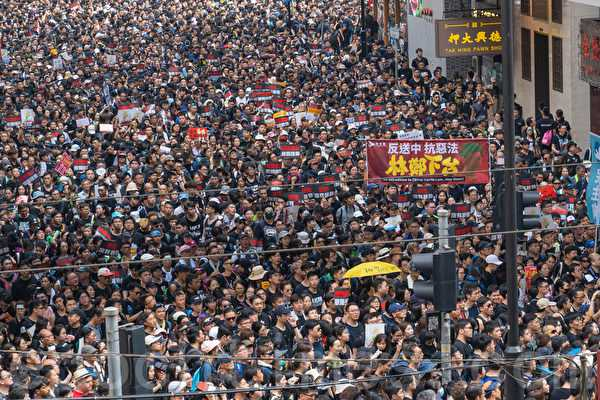
</a>

香港民间人权阵线6月16日再次举行反送中大游行，再次刷新纪录，有高达200万人上街，要求撤回修订草案及特首林郑月娥下台。（李逸／大纪元）

【大纪元2019年08月27日讯】（大纪元记者钟元台北报导）香港反送中运动持续升温并遍地开花，曾创下香港史无前例近200万人上街。香港人权律师桑普表示，香港反送中抗议是公义行动，有200万香港人完全觉醒走上街头，破了30年前六四事件150万人的纪录，中共吓怕了。

国际知名时事评论员桑普日前访台，参加二二八国家纪念馆主办的“谈明日香港”座谈会。桑普说，很多人说港人看重经济，自私自利、冷漠无情，是一种对港人刻板印象，“但港人只是爱赚钱、发大财吗？”桑普说，香港反送中以来，他认识很多从来不问政治的港人，因为儿子、女儿参与了活动，他们每天睡不着觉，然后每天看新闻，开始觉得香港为什么变成这样，他们完全觉醒了要走出来。

桑普表示，香港特首林郑月娥提出“送中条例”修法，把港人免于（中共）恐惧的自由都扼杀掉了。6月9日香港民间人权阵线（民阵）发起反送中大游行，高达103万人走上街，因为是关乎港人切身的利益。

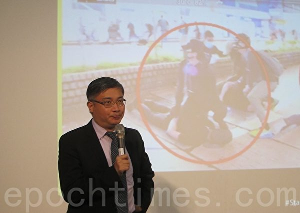
</a>

香港人权律师桑普。（钟元／大纪元）

<b>桑普列举港共残忍对付香港反送中民众实例</b>

他表示，港府不是反送中才开始对人民施放催泪弹，2014年9月28日港府就曾施放87枚催泪弹，掀起香港的雨伞运动。6月12日很多香港年轻人走上街头，因为“送中条例”没有被撤回及暂缓的迹象，警察在香港立法会一带开始出动，使用布袋弹、橡胶子弹及催泪弹，这次连放了150颗的催泪弹，超过了雨伞运动的纪录，过程中港警还瞄准抗议人士头部来射橡胶子弹。

“6月12日香港年轻人推着三角形的铁马绑着绳索让警察难拆。”桑普说，他们用这个方式与专制政权来搏斗，这是港警的暴力第一次升级，警方的暴力也备受国际批评。当时美国总统川普（特朗普）说：“这是一百万人，这是我见过的最大型抗议。我了解游行抗议的目的何在，我希望他们（香港）能与中方一起处理好。”

桑普表示，那时候川普说话了，中共就怕了，开始暂缓“送中条例”。

桑普强调，林郑月娥暂缓“送中条例”，把法案冻在那边说不会再推动，“但香港是法治的社会，是恶法要驳掉说没有，如果你还悬在那边就还没结束。港府没有做（撤销）就是没有做，我们不能视而不见，当时林郑月娥这样的做法，我们商量后不愿意接受。”他说，6月15日晚上有一位身穿黄色雨衣的男子，在金钟的太古广场三楼平台上跳下来，他为了反送中用生命向港府表达最沉痛的抗议。

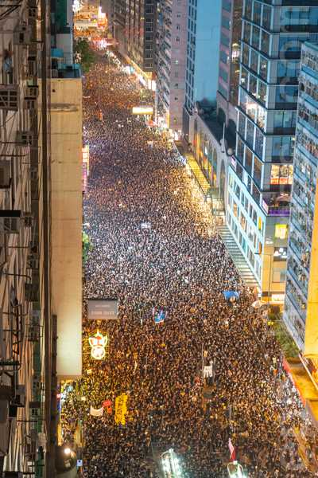
</a>

香港民间人权阵线6月16日再次举行反送中大游行，再次刷新纪录，有高达200万人上街，要求撤回修订草案及特首林郑月娥下台。（李逸／大纪元）

港府暂缓“送中条例”，香港民阵痛批林郑月娥没有丝毫歉意。民阵重申6月16日的游行照旧举行，并呼吁市民着黑衫参加游行，谴责警方镇压，要求撤回恶法、香港特首林郑月娥下台。面对中共文攻武吓，6月16日民阵发起反送中大游行有近200万人上街。桑普说，当港共侵蚀到港人基本人权跟自由时，他们会反弹的；当港共害到他们家里面的人，港人会反弹的，这就是200万港人走出来的原因。

<b>200万港人走出来反抗港共 桑普：若在民主国家政权早就倒了</b>

香港人口有700万人。桑普说，200万港人走出来，代表7个人中有2个参加反送中，“你可以想像台湾如果有2/7的人走出来，会是什么状况，在民主国家台湾执政的政权早就倒了。但香港政府却不倒，因为中共有共军、有枪、而且林郑月娥不是港人直选出来的。”他表示，200万港人走出来是很悲壮的，完全出乎共产党的意料，200万港人觉醒中共吓怕了，当时它们的做法就开始文攻武吓。

桑普表示，7月21日元朗西铁站有数百名白衣人持械“无差别”攻击市民，这起恐怖袭击事件是警察跟黑社会勾结的打人事件。8月5日港人发起三罢（罢工、罢市及罢课）行动，并要求港府回应五大诉求，包括：撤回逃犯条例；取消暴动定性；永不追究示威者；独立调查警方滥权滥暴；全面落实双真普选。

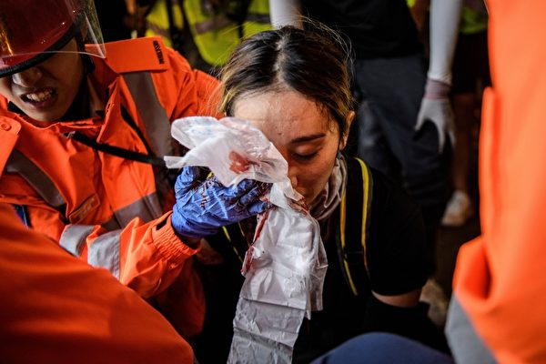
</a>

2019年8月11日晚，香港尖沙咀，一名女性眼睛中弹，救护人员紧急为她包扎。(ANTHONY WALLACE/AFP/Getty Images)

他说，8月11日一名女救护人员站在尖沙咀警署警察局派出所外面，当时约有10个人站在公车站旁的广告牌边，警察举着布袋弹瞄准头的位置水平射击，“这个年轻女生从广告牌探出头来，警察一定看到这个人，这是谋杀，她的右眼失明满地都是鲜血。”他表示，当晚在太古地铁站，警方再度向地铁站内击发多枚催泪弹，并有众多防暴警察冲入站内，攻击追打民众还推挤这些人下电梯。

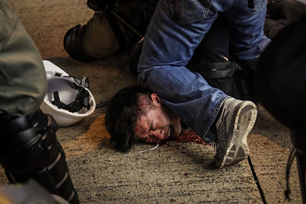
</a>

香港“反送中”8月11日游行，遭警方空前强势镇压。（中央社）

“港警还乔装示威者”，桑普说，这些港警穿黑衣戴黑色帽带着一根棍子，他们冲到示威者现场就打示威者。他表示，防暴警在葵芳港铁站疯狂发射不准在室内施放的催泪弹，导致烟雾在密闭的车站内弥漫，令地铁站内的普通乘客也深受其害。警方违法罔顾民众安全，地铁站的抽风系统，基本上8成空气都在里面去抽，第二天早上会有很多人要上班，是非常可恶的行为，这些都是8月11日的剪影。

8月18日民阵反送中游行在维园举行集会，重申反送中五大诉求，民阵召集人岑子杰称在维园、铜锣湾和天后一带集会有超过170万人，连同湾仔、中环等未能进入维园的市民人数近200万，港人再次展现和平理性抗共抗暴的坚强意志，震撼国际社会。

桑普表示，中共用国安、公安、武警、共军，装成港警来镇压港人，警察也会伪装成示威者来做不同的挑衅，还有像中共党媒《环球时报》的记者付国豪就是特务，“有人问我共军会不会出动，其实已经出动在香港的警察里面了，这种人会加强香港的暴力，因为它们把港人当成蟑螂来看待，它们下了狠手是疯狂、暴力。”

<b>香港反送中持续升温 中共怕全球联合起来对抗中共</b>

香港反送中持续升温，港警25日首次出动水炮车，并且真枪实弹威吓示威者。林郑月娥27日在记者会上谴责示威者暴力，并驳回“成立独立调查委员会”的诉求。民阵将发起（人大）“8‧31”（方案）5周年游行，全港大专院校学生及中学生9月起将爆发大罢课。

桑普说，香港反送中将继续做下去，因为中共不会妥协，只会加强镇压，它们想拖不回应五大诉求，但拖对港人有利，很多年轻人有必死的决心，他们有这个觉悟；拖对中共不利，因为国际局势的变化，主动权在别人手上，不在中共手上。桑普在受访时分析，中国经济下行后，中共恐惧将面临全球联合起来以贸易战、货币战、金融战、人权战的共同对抗。

“香港反送中持续升温让中共很恐惧”。桑普指出，中共怕香港人、怕台湾会受到影响，也怕美国、怕其它国家。对于香港来讲，中共要香港变成死港吗？要让七成以上香港资本市场完全垮掉，它们走不了资吗？它们的党官、贪官污吏想把香港掐断吗，这对它们有什么好处？

他强调：“香港人回不到过去，现在只能用这个方式来对峙，我们要捍卫自己的权利。”

桑普表示，对于台湾来讲，中共领导人希望亲共的人在明年选举上台，怕蔡英文利用香港反送中事件来助选。桑普说，香港的例子告诉大家，你没有真正的国格、没有真正的国防、没有真正的民主，一切的自由都可以随时化为泡影。他“希望跟台湾站在一起，明年不要选错人（总统）这个最重要”。#

责任编辑：林妍

<a href=#list><h6 align="right">回目錄</h6></a>
 

<a name=a10><h2>专访班农：香港若重演六四 中共将灭亡(上)</a>  </h2>
 

</a>

新唐人《世事关心》节目记者萧茗采访了白宫前首席战略顾问史蒂夫‧班农先生。（新唐人）

【大纪元2019年08月21日讯】在香港的民主运动进行得如火如荼、美中贸易谈判处在十字路口之际，新唐人《世事关心》节目记者萧茗采访了白宫前首席战略顾问史蒂夫‧班农先生。班农谈论了香港的未来，美中贸易战的前景，各有关方面的利益所在，还有首当其冲的这场大冲突的本质，同时还赞扬了《大纪元时报》的巨大影响力。

班农认为，香港人的抗争在全世界独一无二，堪比美国开国者。而中共因恐惧自由民主在大陆蔓延，对香港恐吓、欺诈、警黑暴力等无所不用其极，让西方国家越来越看清其本质。各国正在形成共识，中共是个恐怖组织。他表示，如果武力镇压（香港）抗议者，共产党将覆灭。

以下是访谈录：

<b>萧茗：</b>您好，班农先生，十分感谢今天您接受我们采访。

<b>史蒂夫·班农：</b>现在是8月，中午还很炎热，您来到布莱特巴特新闻办事处，做您在这里的第一次采访，所以谢谢您。

<b>香港事件让西方国家看清中共 言辞日益强硬</b>

<b>萧茗：</b>谢谢。 让我们来谈谈香港。 上周末（18日）有170万人走上香港街头。 中共驻港部队又一次保持沉默。 与此同时，中共在香港的一名代理人向全世界保证，香港不会宣布戒严令，抗议者涂抹国徽只是一个小事件，不是什么大不了的事。 很明显，与前几天相比，中共的强硬调门缓和了下来。 这是怎么回事？

<b>史蒂夫·班农：</b>我认为西方国家的言辞越来越强硬。 上周，我们在华盛顿特区，我一直在告诉华盛顿特区的政治精英们，正如我在整个过程中所说的那样——这件事把一个分歧甚大的国家拉到一起。因为我们美国在很多问题上分歧甚大，香港人的抗争把每个人团结到一起。 实际上这个国家的每个人都站到了一起， 既有政治精英又有民众。 与中共有利益关系的那些人没有站到一起， 但是其他人都在一起。

南希‧佩洛西、查克‧舒默、凯文‧麦卡锡（众议院少数党领袖）、马可‧卢比奥、总统……他们团结一致地告诉中共，这种局面是不可接受的，特别是上周（11日）警察的暴行，尤其是用橡皮子弹将那个年轻姑娘的一只眼睛打失明的事件。

每个人都团结一致，站到了一起，比如说英国首相鲍里斯‧约翰逊。 如果从他当政开始看他的话，（他一度表示得）相当糟糕，（他曾说）“我们要与中共达成协议”、“我要去中国”……

可现在他真的站起来说，嘿，1984年的《中英联合声明》必须完全落实，就像我们在1997年交还香港时那样。所有条款都得落实。

你看到了世界舆论的转变，这是因为警察的野蛮行为以及中国共产党的嚣张气焰，屯兵边境，让特首林郑月娥说抗争者“将香港推向粉身碎骨的深渊”。香港局势使世人的团结提升到这样一个高度，中共就该退缩了。

<b>习近平进退维谷 中共恐惧自由在大陆蔓延</b>

<b>史蒂夫·班农：</b>我认为习近平主席没有一个——他们（中共高层）没有一个深思熟虑的计划。 他们显然希望介入，对香港残酷镇压，他们不希望香港局势传染蔓延到中国大陆。

<b>萧茗：</b>这是您的估计：中共肯定希望介入，血腥镇压香港？

<b>史蒂夫‧班农：</b>我认为这是一些方面的考虑，不是全部。 我认为中共有不同派系。这很清楚：就像在89年的天安门一样，有不同的派系。 我认为习近平进退维谷。 我觉得习近平进退维谷。 我想他更倾向于镇压，这是王岐山以及一些强硬派的想法，他们想要进入香港展现完全支配地位。你记得，这些人是“送中条例”的后台。

这就是为什么CC，为什么香港的孩子们如此聪明。 收走你（香港人）所有权利，送中条约就是最后一步。 （送中条约）能够送你到中国，实际上就是被投入监狱， 根本没有法治。 因此，推动送中条例的强硬派和那些我认为想要进入香港镇压，向世界展示他们掌权的强硬派是一伙人。

尤其，中国大陆也卷入了这个事件。在整个事件中，有一点非常发人深省，通常情况下，中共应该让中国大陆民众发起抗议活动，以示支持。结果，他们现在在欧洲搞抗议，在澳大利亚、加拿大搞抗议，就是不允许在中国大陆举行抗议。

原因是，我认为他们害怕自由甚至会在中国大陆蔓延起来。所以我认为肯定存在一个强硬派。我不认为习有一个深思熟虑的策略。

我想川普总统会继续干预这事。川普说，“嘿，我们开个私人会议吧”，我们都知道的。然后有一天晚上，应该周六晚上吧，川普说，“你为什么不去香港和抗议者对话，你15分钟就能解决问题。”确实是这样。

而且，大家知道，所有这些类似的言论、刺激习采取行动结束这个事件。所以我认为西方在这方面做得很聪明。

我认为昨天（18日）的抗议活动，170万人走上街头，并且以和平的方式抗议，这很了不起。因为那些人星期天在街上说，我们不会在这个问题上让步。我们不能允许更多的暴力，但这件事将继续下去，我们希望这五大诉求都能得到满足。

<b>赞扬《大纪元时报》的巨大影响力</b>

<b>萧茗：</b>杨洁篪是在香港大游行的前几天，会见美国国务卿蓬佩奥。您认为他们在会议上讨论了哪些内容？这次会晤可能会对当前局势带来什么影响？

<b>史蒂夫‧班农：</b>这就是《大纪元时报》的巨大影响力了，我想这就是为什么你们是美国、是世界上最有影响力的声音之一的原因了。你可能也注意到了，美国主流媒体并没有报导此事——而此次会议又是如此重要。这也是我同意接受《大纪元》采访的原因之一。

我认为你们的报导越来越注重真实，真正地报导事件的真相，主流媒体都在追赶你们，我觉得《大纪元》比主流媒体做得好得多。

</a>

新唐人《世事关心》节目记者萧茗采访了白宫前首席战略顾问史蒂夫‧班农先生。（新唐人）

<b>杨洁篪奉中共高层指示 为何去纽约</b>

还有一个细节令我无比惊讶，杨洁篪的出访是八月中旬，当时所有中共领导人都在北戴河度假，闭门开会的时候，他却中途飞往纽约，花了一天时间与蓬佩奥会晤了。

<b>萧茗：</b>应该是北戴河会议结束后他才去的。

<b>史蒂夫·班农：</b>是的，北戴河会议已经结束了，但显然杨洁篪是奉中共高层指示去的，去纽约见蓬佩奥而不是华盛顿，很明显……

<b>萧茗：</b>去纽约而不是去华盛顿，意义何在？

<b>史蒂夫‧班农：</b>我认为他们——本来这次访问可以更正式一些，实际上，别忘了美国认为他是中国一位高级外交官。这个人我见过，而且多次见过。我认为去华盛顿会显得太过官方。所以这次是非官方的。这就是为什么它（这次会面地点）处于一个中性的，像纽约这样的中性地区，一个世界金融之都。

但我认为那次会议非常重要，而且很清楚，是传递一个信息的。这条信息就是，如果你们（美方）介入支持抗议者，我想如果你们支持抗议，情况只会变得更糟。我认为，至少从会议报导中看，国务卿蓬佩奥采取了一个非常强硬的立场，因为此事涉及到自由和民主。

<b>香港不仅是中国内部事务 也是国际性事件</b>

<b>史蒂夫‧班农：</b>最大的争议点，且我认为这个应该被搬上台面讨论的争议点，就是这到底是中国的内部事务，还是不仅仅是内部事务？我坚持认为是后者。

原因如下。当初那份中国官方与香港人民达成共识的回归协议（《中英联合声明》），是大英帝国与中国之间的国际协议。为此，美国还于1992年通过了相关法律支持这一国际协议。我想，参议员马可‧卢比奥在他个人的推特上已将此争议点诠释得淋漓尽致。

他详细说明了为何这是一个国际问题，而非单纯中国内部事务。我认为此议题是两国对话问题的核心。共产党想要将此问题仅仅视作中国内部的主权问题。我认为它（事件）超出了这一范围。

我认为这是一起国际性事件，且我认为国际社会需要聚焦在此议题上。香港这些年轻抗议群众的所作所为是我见过最接近于当年1776年帮助美国独立的爱国者行为。这些抗议者拥有非凡的勇气、缜密的心思以及严格自律的心态，他们不会被轻易打倒。

这让我想起了约翰‧亚当、山姆‧亚当、派崔克‧亨利、汤玛斯‧杰弗森、乔治‧华盛顿、汉弥尔顿，这几位1776年坚韧不拔的爱国者，没有他们，不可能有当今独立的美国。这些香港的抗议者令我回忆起这些历史。

<b>中共为控制香港局势 无所不用其极</b>

<b>萧茗：</b>香港人还有大陆人都在关注一件事：美国在多大程度上可以阻止中共对香港抗议者采取大规模的暴力行为，以及美国这样做的意愿有多大？

<b>史蒂夫‧班农：</b>中共很阴险，因此他们为了控制当今香港的情势，可以无所不用其极。他们已经派遣卧底警察、告密者，他们已经尝试混入抗议群众内部，你可以从某些“抗议者”身上看出他们其实是中共派来的卧底。这些中共派来的卧底在抗议群众中搧风点火、企图制造警民暴力冲突与意外。

中共会使用各种不同的方式。他们在推特，你知道的，在推特散播假消息，在全世界制造假抗议。中共可能使出许多让人担心的手段。我相信西方国家目前的因应方法增大了中共行恶的代价。

我认为这就是为什么你会看到目前这些，并且当我说中共让步时，我并不是说他们在各方面都让步了，他们目前做的所有事情都只是为达到最终目的的一种中间过渡手段。中共是让了几步，他们暂时修饰了他们所用的字眼，与此同时，抗议者则显示了他们不屈不挠且永不放弃的决心。

但目前，还没有出现类似之前在地铁站、机场等由警方挑起的意外事件。但我认为中共明白他们自己已经受到来自包括日本及其它西方国家的警告——这些国家不会接受天安门事件再次上演。天安门事件约在30年前发生。

我想大部分西方社会的人都同意至今我们回顾天安门事件，我们都不知道当年在天安门广场究竟有多少人遇害。中共至今为止也尚未讨论，尚未对此事件有过任何检讨，这在中国是禁忌话题。

<b>中共底线被触动 香港人不会退缩</b>

<b>史蒂夫‧班农：</b>每次与中共官方的对谈中，有两件事情中共绝不愿意讨论，一是文革，二是天安门事件，没错吧？这是禁忌话题，在中国严禁讨论。法轮功议题在中国也是被禁止讨论的。

法轮功、基督教，任何宗教相关的话题在中国都是被打压的。

但我们现在讨论的是两件在中国内部被禁止讨论的历史事件，文革与天安门。我相信这两个议题已经被大众所关注。美国总统大约在3～4周前的谈话中还用了“暴乱者”一词，但是今天他将当今的香港抗议事件拿来与天安门事件做比较。

这位总统，你知道的。现在他说当年的天安门事件可能会在香港重演。我也相信共产党明白香港是东方之珠，且人们也会没忘记香港是东方之珠。

我曾有幸走访世界许多国家，我相信香港是这世界上最棒的城市，香港人民是最好的。这也为中国人民展现了英国在香港施行的普通法是势不可挡的。

藉由香港普通法的法治精神下，香港市民凭着他们的决心、他们的努力能达成许多目标。他们很精明，他们很有智慧，他们绝不屈服，他们将香港视为自己的家园……他们能做的事情很多很多。

我认为这（香港）是进入中国的大门，无论中共多努力使上海成为国际资本市场，香港是世界第三大资本市场，仅次于纽约和伦敦市。也是中共获得美元的途径，中共沉迷于美元，它需要美元。所以我认为他们在冒着断送下金蛋的鹅的风险，所以这是……但我认为到目前为止，我认为这就是抗议的原因……

记住这个抗议活动是今天《金融时报》的头版，是Drudge的头版，它是世界上每家报纸的头版。昨天（8月18日）的抗议活动引起全世界的关注，香港人……香港人是不会退缩的。

<b>如果武力镇压抗议者 共产党将覆灭</b>

<b>萧铭：</b>您能说更具体一点吗？如果中共以武力镇压抗议者，美国会怎么做？

<b>史蒂夫‧班农：</b>我不太想去推测，因为这要看总统的决定，但我认为，当全世界都对此事密切关注的时候，中共会明白，如果他们以武力镇压，将是灾难性的。

如果他们像天安门事件那样使用大规模武力，自由运动就会在中国大陆蔓延开来，将最终导致共产党的覆灭……

如果中共对热爱自由、正派、勤劳、无辜的香港人民使用大规模武力，那将是非常可怕的事情。如果中共重蹈覆辙，中共就活到头了。

我认为中国共产党最终会解体。他们将失去统治中国的任何权力、将在全世界被遗弃、资本市场会对他们关闭、他们的银行系统将会被关闭。西方将会采取相应的举动促成这一点，中共十分清楚自身的处境。

这就是为什么我认为中共的势力在削弱，他们言辞上都收敛了许多。现在，没什么人拥护共产党了，因为这是当今世界上最邪恶的独裁政权。

中共对法轮功所做的一切，对藏传佛教、维吾尔人、地下天主教会、地下基督徒以及任何不相信唯物主义但有精神信仰的人士所做的一切，都证明了这一点。在打压方面中共绝对是惨无人道。

<b>“送中条例”对香港人性命攸关</b>

<b>史蒂夫‧班农：</b>所以我们知道中共能干出什么来。这就是为什么送中条例对香港华人来说性命攸关。尤其是许多香港华人，他们都老于世故。他们明白，法治要是完了，在中共的法庭，他们平白无故就会被投入监狱。他们明白这意味着什么。所以我相信中共明白此事赌注极高。

如果他们打算来天安门那一套，那就会……他们会，这是个非常难的……西方会非常坚定地站出来。事实上，比如马可‧鲁比奥，比如其他人……西方这些人发出推文并且已提出了……他把一项法案放到参议院面前，已经开始讨论。

我所在的“当前危险委员会”，今天我们传阅一封给总统的信，要求制裁个人，对香港政府的数位高层人士实施个人制裁。

<b>萧茗：</b>这不是《香港人权和民主法案》的一部分吗？

<b>史蒂夫‧班农：</b>对。马可‧卢比奥是推动此法案的领导人之一。我的看法是，现在西方反对力量大量集结，而且越来越多关注投向香港。还记得12周以前，没人谈这个，对吧？三四周以前，很少人谈此事；而今天，这是报纸头条，世界所有报纸的头条。

<b>萧茗：</b>我想谈谈《香港人权与民主法案》。 有些部分根本没有争议。 比如你谈到的实施个人制裁那部分。 有一部分要求撤销香港的特殊（贸易）地位。此特殊贸易地位，由国务院（撤销）。 对，法案那一部分。 如果香港政策法案被撤销，香港特殊地位被撤销了……您认为这是以牺牲香港人为代价来惩罚中共吗？

<b>史蒂夫‧班农：</b>我认为这直接影响中共。 中共需要一个充满活力的……中共绝对需要一个充满活力的香港。 他们需要香港，充满活力的资本市场。 他们需要香港作为交易（场所）……记住它是最大的……

这就是为什么机场关闭如此重要。 机场关闭，完全断了香港的货运能力。中共离不开香港，特别是在经济方面，贸易方面，中美贸易协议方面。 所以我觉得，对，这事大了。

在审查自由贸易协定时，这就是我们所说的核爆选择。自由贸易提案。 如果这个提案谈不成，对中共来说这是灾难。 我不知道中共还如何继续执政，因为我认为中国经济会进入……基本上会陷入死亡漩涡。

对。我不知道中共如何处理这个问题。但是……记住这些办法是引而不发的手段，作为潜在的讨价还价的筹码，来保证香港示威和五大诉求最终得到满足。

<b>中共是恐怖组织 恐吓中国人民</b>

<b>萧茗：</b>您认为这会诱发中共的倒台吗？

<b>史蒂夫‧班农：</b>我相信中国共产党……中共是一个恐怖组织。我认为它恐吓中国人民。我认为这是它掌权的唯一原因，是因为它能……基本上是完全彻底的……一个监控国家。这是一个极权主义的监管国家，每天都在恶化。对吧？而且每天都更狂妄。它控制中国人民就是因为这个。证明他们合法性的一件事是经济。

若中共的经济开始崩溃，这是中共咎由自取，并不是其他人的什么动作导致中共经济崩溃。我想这（经济崩溃）会使中共丧失他们执政的合法性。

我认为唯一能够摆脱中共控制人民的只有中国人自己，这我已经提过很多次了。这是中国人民必须自己去处理的问题。这也是为何我认为香港议题会如此地重要，因为这是你第一次看到类似于当年天安门事件的示威行动发生。

这种与当年天安门事件有一致性的活动，在中共日渐极权的眼皮底下发生。这就是为何我认为这能对全世界有个启发，这提醒了全世界去关注中共的极权问题。

我相信中共极权政府任何作为带来的任何成就，都会给他们自己带来反作用力，你知道的，譬如他们强健的经济，最终都会反过来伤害到中共自己。但这……也是为何……这也是有争议的部分。

<b>川普劝习去倾听抗议者声音 香港问题有解</b>

<b>史蒂夫‧班农：</b>这也是总统目前不曾谈及、且不曾拿来利用的原因之一。我是说，川普总统在这事上的拿捏已经非常稳重。

若你知道中共如何使用暴力且派遣镇暴警察、明显不是香港警察的人，换上镇暴警察的制服去威胁，如何在体育馆滋事，若你知道有大量的私人运载车与相关装备在香港边境集结，若你去观察中共如何利用这些来对抗川普，你就会知道川普至今来说已经非常理性了。

考虑到川普过往的行事方式，我想他事实上已经非常包容，这么说吧，你知道的，对我来说香港事件根本没有幕后黑手，美国并没有介入。

川普已经触碰到问题的核心，他说，我的朋友习主席、习可以在15分钟内就解决香港的问题。他只需要去倾听那些抗议者的声音。

或“将有个私人会面”，我想川普已经非常…..基本上他已释出信号，他会前往中国或香港与习主席会面。

<b>萧茗：</b>您认为这是一个好的方式吗？

<b>史蒂夫‧班农：</b>不论用什么方式来解决问题，只要是对香港人民有好处的就是好方法。

<b>港人不喜欢政治 为何坚持“五大诉求”</b>

<b>史蒂夫‧班农：</b>我认为需要达到五项诉求。我们必须回到1997年香港回归时的状态，且回到1984年所签属的协议内容。

当初西方国家透过英国与香港人民进行协商所达成的协议是大家都认可的，也就是50年之内都是一国两制。但这几年下来，共产党非常狡猾地、偷梁换柱地收回香港人民的自由。我认为这就是导致……正是这个引渡条例引发了香港原先非激进民众的不满。

就是这个（引渡条例）导致了这后续的一连串事件。对我来说最令我震惊的就是香港的中产阶级。你知道的，他们在香港拥有自己的事业、生活了这么长的时间，很了解香港。

你在全世界都找不到比香港人更不喜欢搞政治的人了，香港不是那种能搞政治的地方。人们在香港的生活就是以工作、商业、家庭为导向。你就知道香港人民的焦点并不是在政治。

中共将整体事件发生的原因导向为政治因素，且说支持这项抗议活动的大多是香港的中产阶级。昨天有170万人（上街集会）……这个比例在美国相当于有5000～6000万人上街抗议。这么高比例的民众上街抗议是超乎寻常的。

就百分比而言，这是一个巨大的，我的意思是在一个拥有700万人口的岛屿上有170万人，非常……人们可能忘了，去看录像吧，像是季风型暴雨。我的意思是整个游行期间天气都不好，让人很不舒服。天在下着大雨。所以如果天气好，去的人会更多。

<b>萧茗：</b>好像他们每次大游行期间都遇到雨季。

<b>史蒂夫‧班农：</b>嗯，它展示了香港人的坚定意志，以及为什么诉求如此重要。 所以我认为……习会这样做吗？ 习会解决此事吗？ 我不知道。 但我知道的是这个， 我认为香港人提出的五大诉求并不过分。

我认为他们提出了一个非常直截了当的计划，这是我们必须做的事情，以达成目标。 香港人比任何人都更想要和平稳定。 他们只想回去工作。 他们希望香港和以前一样。 我不认为那是，我不认为是一个了不得的要求。

<b>美国会取消香港特别贸易地位？</b>

<b>萧茗：</b>让我们回过头来，继续谈《香港关系法》。美国取消香港特别贸易地位， 我想知道香港人如何看？在何种情形下美国会采取此举动？

<b>史蒂夫‧班农：</b>在何种情况下美国会这样做……嗯，显然它会对香港产生巨大的经济影响。我认为事到了那一步才能那么干。所以，我不想推测哪种情况会导致美国这样做，但是此事已经摆到桌面上，摆到马可·鲁比奥这样的人面前。

你要知道，有的参议员关注于国内政策，有的参议员关注于国际政策。马可·鲁比奥是知名的关注于国际事务的参议员之一。两年前他可没这么关注中国。他可能是花时间关注中国的主要声音。

但我要告诉香港人，无论是舒默的民主党，还是卢比奥，大家都在关注这一点。所以取消香港特殊的贸易地位，真的有这种可能，我认为这对中共来说是一个巨大的警告。

如果美国这样做，其它国家也会这样做。是的，这不会只是单个国家孤立的行动。其它国家会跟进，但我认为这样下去……

<b>萧茗：</b>这样下去，香港就完了。从本质上讲，香港人为自由而战，他们付出了很多，而他们所拥有的所有这些特殊待遇都将失去。所以我不知道香港人对此有何真实感受。

<b>史蒂夫‧班农：</b>哦，我认为……这不是针对香港人的，是针对中共的。

<b>萧茗：</b>但香港人不得不去承受，你知道你只是大局中的一分子。只有中共——当中共消亡时，他们才能拥有真正的未来……

<b>只是警告中共 西方希望香港生机勃勃</b>

<b>史蒂夫‧班农：</b>哦，但我认为一切都因时而异。这种状态不会长此下去，将视中共的行动而动。

别忘了，西方希望香港生机勃勃。在西方，如果你问任何一个领导人，任何一个商人，资本市场上的任何一个交易员，无论是债券市场还是股票市场，他们都会一致地告诉你：我们只是希望香港回归原来的样子，对吧？

香港……这决不是要破坏香港的现状，降低它的活力。鉴于香港在亚洲所处的中心地位，世界需要一个充满活力的香港。对大公司而言，香港所拥有的区域总部的数量，强大的资本市场，以及居住在那里的人们的创业精神，亚洲的增长……在很大程度上受益于一个自由的香港的推动。

因此，这不是要把它拿走，比如，“哦，我们就是想把它大卸八块，分到其它地方去。”这只是就这个法案而言。只是那些人警告中共时才那么讲，决不是在警告香港人。

所以这只是……就像是一个核选项一样告诉中共，你不能如何如何……如果人们明白这一点，除非有一个自由而强大的香港，否则中共不会在大陆再现以往的那种增长，他们将无法进入资本市场，无法获得美元。

我相信中共内部的领导人清楚这一点。这是过去几天（中共对香港事件）降温降调的原因之一。他们明白，如果一周前势态就这样持续下去，可能就会发生灾难性的结局。就像我说的，他们最终会杀死一只会下金蛋的鹅。

<b>港人抗争 全世界独一无二 堪比美国开国者</b>

<b>萧茗：</b>您能谈谈相比台湾，美国在香港的利益是什么？我是说，除了在意识形态之外，美国还关心香港什么？您知道，这个问题……

<b>史蒂夫‧班农：</b>我认为首先是商业利益。这里有两个问题。首先这事关意识形态，更是人权问题。最令人振奋的事情之一，就是现在全世界人都看到了，也是我同意接受采访的原因，这个事我一直在讲。

就是香港人的抗争在全世界独一无二。完全是独一份。参加的主力是年轻人，特别是跨世纪的一代人。到处都有人讲跨世纪的一代是垮掉的一代。他们什么都不关心。

<b>萧茗：</b>您有一部电影——“零的一代” 是讲……

<b>史蒂夫‧班农：</b>“零的一代” ，我实际是站在千禧一代这边说话，我们留给他们的只有难题。其实我对“零的一代”充满信心，我这里有一张照片，我的女儿，她也是千禧一代，她去了西点军校，她在伊拉克服役，是101空降师上尉。

我认为千禧一代很可能会成为最伟大的一代人。我们只需要看看他们如何担负责任，应该对他们有信心。

香港的千禧一代充分证明了这一点。我不是随随便便说的，（除了他们）我从未将任何人与我们美国1776年那些爱国者相提并论。他们真的是无人可及。林肯总统和内战中的伟大领袖，与1776年那些伟大爱国者相比，仍难以望其项背。

我确实认为两者可以相提并论。香港的年轻人成熟，有道德，有原则性，他们的行动激励着所有热爱自由的人们。

首先，他们的壮举让英国人坐不住了。欧洲也动起来了。上周六我在印度裔共和党人大会上发表演讲。许多印裔美国人，信印度教的美国人为港人的抗争而感到振奋。

看到这些年轻人站出来反对强权政府，实在了不起。而且在过程中表现得文明。他们在被打、被施放催泪弹和橡皮子弹的情况下，坚持文明抗争，不破坏城市的整洁。看昨天，一百七十万人参加的抗议集会，公园里一尘不染。 #

（未完待续）

新唐人《世事关心》制作组

责任编辑：李昊

<a href=#list><h6 align="right">回目錄</h6></a>
 

<a name=a9><h2>中共封锁反送中讯息 专家：恐惧全球反共潮</a>  </h2>
 

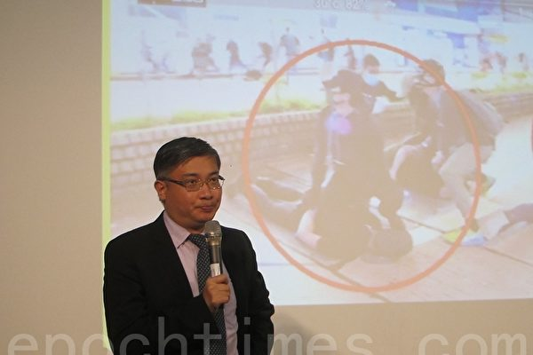
</a>

香港人权律师桑普。（钟元／大纪元）

【大纪元2019年08月21日讯】（大纪元记者钟元台北报导）香港反送中运动延烧逾11周，有3次超过百万人大型集会游行，并创下香港史无前例近200万人上街。香港人权律师桑普在台受访表示，反送中抗议是公义行动，却遭中共造谣污蔑。他分析，中国经济下行后，中共恐惧将面临全球联合起来以贸易战、货币战、金融战、人权战的共同对抗。

香港民间人权阵线（民阵）6月9日发起反送中大游行，高达103万人走上街后，6月16日有近200万人上街。8月18日民阵反送中游行在维园举行集会，重申反送中五大诉求，民阵召集人岑子杰称在维园、铜锣湾和天后一带集会有超过170万人，连同湾仔、中环等未能进入维园的市民人数近200万，港人再次展现和平理性抗共抗暴的坚强意志，震撼国际社会，但却始终得不到中共控制的港府正面回应。

<b>桑普曝光中共造谣污蔑招数 并予以分析破解</b>

桑普和香港反送中青年、作家兼音乐人“阿域”日前受邀访台，参加二二八国家纪念馆主办的“谈明日香港”座谈会。桑普受访时表示，香港反送中最重要是捍卫自己的权利，香港人起码竭尽棉力做一件公义的事情，却遭到中共党报、党媒等的造谣污蔑：他们继续讲香港人都是暴徒，港澳办竟指反送中出现“恐怖主义”苗头，甚至《环球时报》总编辑胡锡进还讲香港反送中民众可以当场击毙。

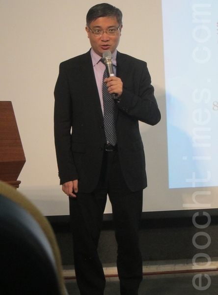
</a>

香港人权律师桑普。（钟元／大纪元）

“中共造谣污蔑香港反送中民众”，香港人权律师、国际知名时事评论员桑普指出，基本上如何去识别它们的造谣污蔑，要基于事实来了解。首先，香港反送中这么久以来，到底受伤的是警察多，还是反送中示威民众多，据了解示威者占受伤数字9成以上，“请问什么样的示威者暴力，可以导致示威者受伤人数，竟然比警察还要多这么多倍呢？”

他举例，港共把示威者抹黑成为暴徒，大家都知道女医护被枪击打瞎了眼睛，引发港人在香港机场展开“警察还眼”集会，究竟是警察还是民众使用暴力？竟然中共党媒说是反送中猪队友造成的，还污蔑是示威者自己打示威者的，“请问我们有布袋弹吗？而且布袋弹就卡在女医护的眼球中间，这已经事证俱在。”

他再举例，元朗西铁站7月21日晚间，爆发白衣暴徒横扫地铁车厢里面所有乘客，无差别攻击乘客事件，导致有香港团体发起7月27日“光复元朗”游行。“请问，示威者有做过无差别攻击吗？很多事情都是黑社会主动打人，都有事证但警察竟然不执法。”

桑普指出，其次，如果像中共所讲的示威者这么暴力，“请问示威点附近邻居的商店有被炸烂吗？并没有。”而且一直以来，示威者所抗争的是港共专政的爪牙，也就是警察、黑社会和他们的警车，以及立法会的图腾，甚至（中共）国徽、国旗这些事情，是对于专制者的图腾予以羞辱。香港人近来持续的抗争，“反送中、反警暴、反专制”这是重点。

桑普说，第三、香港示威者的抗争，真的有引起香港民生大的波动吗？“他们想把所有责任怪罪我们是不对的，因为中共停了很多旅游团和自由行来香港，再加上很多事情根本是香港经济下行的问题，而不应完全怪罪于示威者。”

香港泛民主派发起反送中运动，并提出5大诉求，包括完全撤回逃犯条例草案、设立独立委员会调查警方是否滥权、不起诉示威者、撤回对示威冲突的“暴力”定性以及实行“双普选”，但香港特首林郑月娥至今未回应任何一个诉求。

<b>中共封锁香港反送中讯息 桑普盼大陆人问自己两问题明真相</b>

桑普强调，香港反送中运动一直以来，都是针对警察、黑社会的暴力所做的正当防卫而已，但香港TVB或一些特定的中共党媒，他们只报导一个非常窄的片段，去说示威者的坏话，但问题是并没有完全把整个全局做分析。他希望中国大陆的朋友们，真的好好去了解全面的事实，可以问自己两个问题：

“第一、为什么香港人会有党媒所讲的这批‘暴徒’出来，难道他们发疯了吗？他们突然之间精神失常了吗？他们一定有原因，你们了解吗？第二要问为什么在乌坎、武汉等国内任何城市，很快所谓的暴动就被平息掉，但香港反送中已经11周了，为什么香港人还继续抗争，为什么还没有被镇压下来？”

桑普说，大陆人问一问自己这两个理由，“要知道香港人要展开一场持久战，去捍卫香港自由与守护我们的将来”，如果你不知道反送中运动的前因后果，而只看TVB、党媒所写的东西，只摘取一个片段来看，那都有悖于事实。他强调，新闻传媒报导要重视真实，有真相才有办法讲“对与错”的问题，如果造成真相都搞不清楚的话，这不是传媒应该做的事情。

中共防火长城网路封锁，让大陆民众没有知情权。桑普强调，这么多年中共都在封锁真相，他们也不要香港反送中讯息传到内地，而且现在已经从封锁变成报导假新闻。大家看到央视、“抖音”平台里面，都一直去抹黑香港所有的示威者，中国人接受这些假消息的洗脑，就都被共产党骗了。

<b>香港反送中持续升温 中共怕全球联合起来对抗中共</b>

“香港反送中持续升温让中共很恐惧”。桑普指出，中共怕香港人、怕台湾会受到影响，也怕美国、怕其它国家。对于香港来讲，中共要香港变成死港吗？要让七成以上香港资本市场完全垮掉，它们走不了资吗？它们的党官、贪官污吏想把香港掐断吗，这对它们有什么好处？他强调：“香港人回不到过去，现在只能用这个方式来对峙，我们要捍卫自己的权利。”

桑普表示，对于台湾来讲，中共领导人希望亲共的人在明年选举上台，怕蔡英文利用香港反送中事件来助选。桑普说，香港的例子告诉大家，你没有真正的国格、没有真正的国防、没有真正的民主，一切的自由都可以随时化为泡影。他强调，中国的经济下行，它们怕香港的真相公布之后，全世界联合起来以贸易战、货币战、金融战、人权战共同对抗中共。

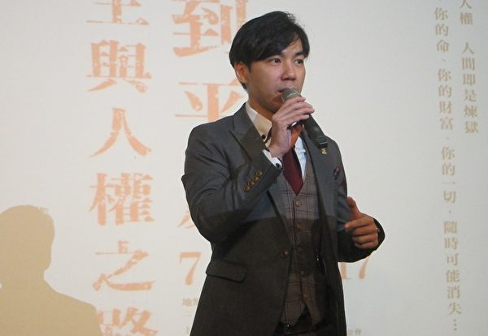
</a>

香港新生代作家兼音乐人阿域。（钟元／大纪元）

与桑普一同赴台受访的香港新生代作家兼音乐人阿域说，自己“不是出来抗争的人才，但被迫不得不走上街头”。他也提醒，“台湾跟香港是命运共同体，香港倒下的话，下一个就会是台湾。”阿域强调，台湾人争取民主流了很多血，也牺牲了很多人，希望台湾人守护民主自由，不要因为台湾的经济不太好，而轻信“发大财”的话。他以香港反送中港人所受的暴力对待，奉劝台湾人要以香港为借镜，不要听信中共“一国两制”的谎言。#

责任编辑：林妍

<a href=#list><h6 align="right">回目錄</h6></a>
 

<a name=a8><h2>170万港人和平抗暴 流水式集会再创历史</a>  </h2>
 

谴责官警黑暴乱 坚持五大诉求 全球见证和理非精神 

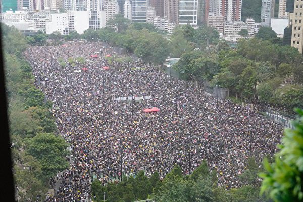
</a>

8月18日，风雨中，170万人流水式逼爆维多利亚公园和铜锣湾、天后一带，和平理性地重申“反送中”五大诉求。（孙青天/大纪元）

【大纪元2019年08月19日讯】（大纪元香港记者站报导）尽管暴雨倾泻，但港人和平抗暴志向不倒！民间人权阵线昨日8.18在维多利亚公园再举行集会，反对官警黑暴力乱港，重申反对修订《逃犯条例》等五大诉求。警方打压并禁止游行下，成就一场历史性的“流水式集会”。

在滂沱大雨下，一批又一批的人潮鱼贯“疏散”，逼爆从炮台山到中环的港岛各大干道，持续至夜晚方休。民阵晚上10时宣布，单是维园、铜锣湾和天后一带有170万人集会，连同湾仔、中环等未能进入维园的市民，人数与6.16的200万人相若，再次展现香港人和平理性抗共抗暴的坚强意志。

民阵集会下午2时开始前，维园三个足球场已被市民站满，半小时后更已迫爆六个足球场，要开放中央草坪容纳集会市民。当时有大批市民由湾仔轩尼诗道、沿东角道、怡和街入维园，占据全部行车线。

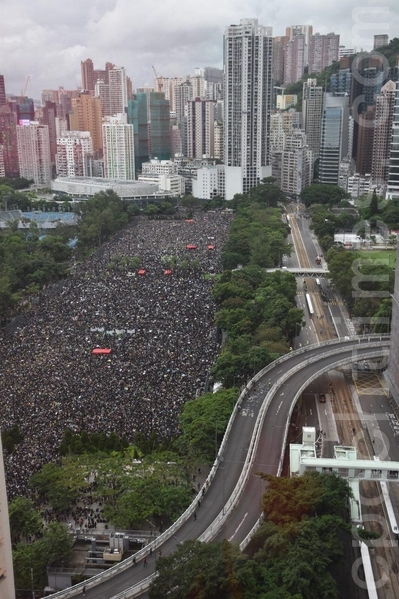
</a>

2019年8月18日下午，由高空所见，接近下午3时，在维园已逼满参加集会的市民。（李晓彤／大纪元）

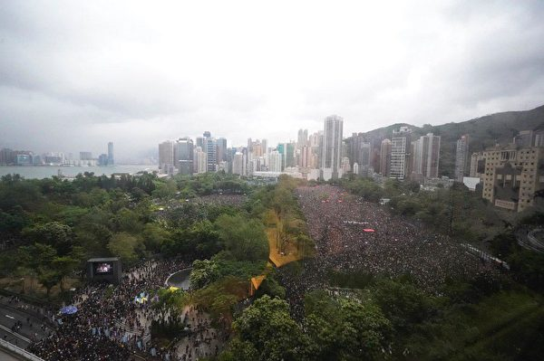
</a>

“民间人权阵线”18日在维多利亚公园发起“流水式集会”，要求香港政府撤回《逃犯条例》修订。风雨中，170万人流水式逼爆维多利亚公园和铜锣湾、天后一带，和平理性地重申“反送中”五大诉求。（孙青天/大纪元）

下午约3时10分，民阵召集人岑子杰宣读宣言，指中国（共）式镇压民众的手段已经活现在香港警察身上。指不论前线抗争者或街坊，两个月来历尽催泪弹、布袋弹和橡胶子弹清场和围捕的暴力，甚至是黑社会无差别袭击市民。他批评警方变成管治机器，在高处施放催泪弹、近距离射击抗争者，超出人性可以接受范围，超出国际人权标准；强调不是针对警察，而是针对警察违法暴力、黑社会以及警黑勾结。

他又说6月12日至今警方失误，高层责无旁贷，需要从根本改变警队，要求保安局局长李家超、警务处处长卢伟聪、副处长邓炳强和刘业成问责下台。

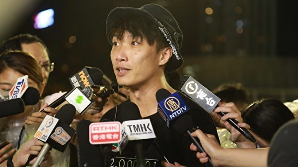
</a>

民阵召集人岑子杰晚上10时宣布集会人数，同时宣布已申请8月31日由遮打花园游行至中联办。（廖小怡/大纪元）

<b>流水式集会逼爆港岛</b>

民阵随即宣布启动流水式集会。在现任和前任立法会议员梁耀忠、李卓人、何俊仁等手持大型白色直幡带领下，集会人士从高士威道离开维园，沿铜锣湾方向前进。其时天下起大雨，市民纷纷撑起一片伞海，缓缓前进。

与此同时，大量市民响应民阵呼吁，坚持进入维园参加接力集会，轩尼诗道有大批市民由湾仔方向前往，逼满东角道、怡和街一带，与出发的人潮形成一进一出的对流。铜锣湾、天后、炮台山等车站都逼满了准备参加游行的黑衣市民，港铁列车一度不停铜锣湾站、天后站及炮台山站。

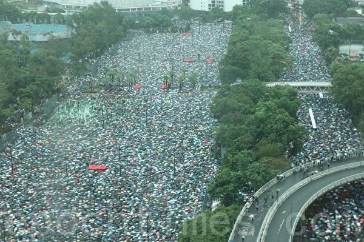
</a>

2019年8月18日下午，高空所见，“流水式集会”已超过45分钟，在维园内，和附近的街道都迫满市民。（黄晓翔／大纪元）

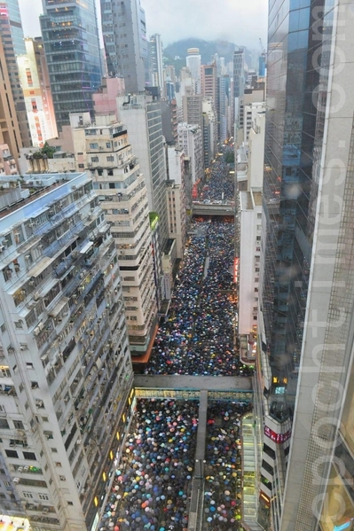
</a>

2019年8月18日，民阵发起的维园集会游行人潮塞爆。图为在铜锣湾sogo百货附近空拍图。（宋碧龙／大纪元）

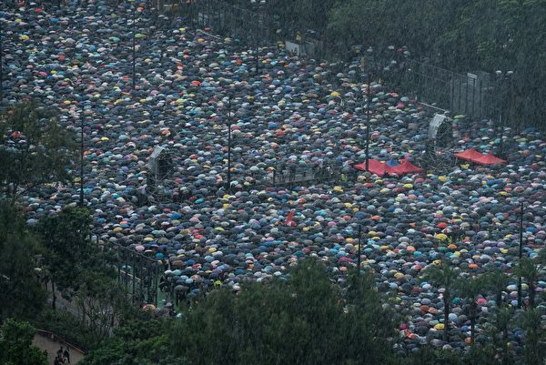
</a>

2019年8月18日，民阵发起维园集会，参与民众不断涌入维园，现场人潮塞爆。(PHILIP FONG/AFP/Getty Images)

流水式集会队头下午约4时半抵达中环终审法院。不过，等候进入维园的人潮，已倒灌至铜锣湾、天后乃至炮台山和北角，英皇道都被游行的市民占满。离开维园的人潮，则走出铜锣湾告士打道西行线，形成另一条游行路线，堵塞红隧港岛出口，九巴宣布所有经红隧的过海巴士路线暂停服务。在金钟，则有市民走上夏悫道往中环的行车天桥前往中环。

经历过去两个月警方以过千枚催泪弹、橡胶子弹、布袋弹的血腥镇压，还有黑社会的无差别袭击。香港人仍选择穿上黑衣、一家大小地参与这场以“煞停警黑乱港 落实五大诉求”为主题的“和理非”集会。

<b>和理非再集结 大雨显决心</b>

集会过程中一路下着大雨，不过市民毫不退缩，撑着雨伞耐心等候进入维园。有市民表示，香港人中过子弹催泪弹都不怕，“下雨反而凸显香港人的决心。”

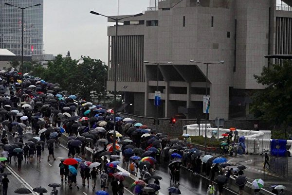
</a>

中共驻军总部外，有市民站在天桥喊“后果自负”口号，回应中共军队对香港的恐吓之词。（余钢／大纪元）

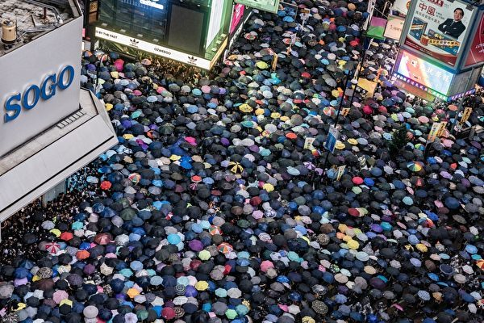
</a>

2019年8月18日，民阵发起的维园集会游行人潮塞爆。图为在铜锣湾sogo百货附近空拍图。(Anthony Kwan/Getty Images)

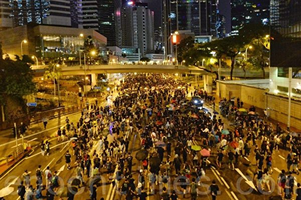
</a>

2019年8月18日晚上，民阵发起的维园集会游行在金钟轩尼诗道。不少市民坚持等候进入维园集会，其后游行到金钟时已夜深。（宋碧龙／大纪元）

市民李生与亲友带着五个小朋友前来，他们手持“五大诉求 坚持到底”、“彻查警黑 追究警暴”、“我们不是箭靶”等标语。李先生表示，特首迟迟不听民意，因此要带下一代走出来，“感受一下现在香港到底发生了什么事⋯⋯警察的滥捕，过分的武力。我们在家里，就算没亲身在现场感受，都觉得很愤怒。”

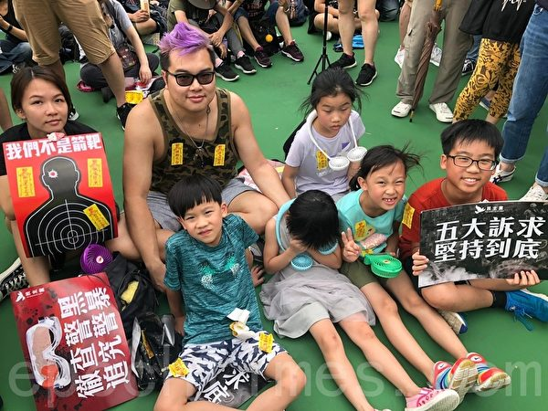
</a>

2019年8月18日下午，李先生（后排左二）和太太（后排左一）和女儿（前排中）、12岁的表哥儿子林同学（前排右一）和妹妹（前排右二）。（梁珍／大纪元）

记者问其中一位12岁的林同学，出来游行会否害怕？“怕啊，但都是要出来游行，因为我也是香港的一分子。”他接着说：“因为我不想长大后，因为如果讲了一句话，就马上被人抓走。同时是为了自己和其他小朋友的将来。我不明白这些警察现在要和黑社会合作，这样打我们。以前老师对我说，警察是负责守护秩序的，但是现在我不可以说他们是否在守护秩序。”

一群医护人员在右眼蒙上纱布上街。一位代表表示，医护界关心每一个市民，愿意陪港人一起走过最黑暗的时期，同时也要告诉遭布袋弹打伤眼睛的少女，“我们能够感受到她的恐惧和痛苦。”同时，也是为谴责政府和警察执法“睁一只眼闭一只眼的做法”，“我们医护人员是不论背景一视同仁，分秒必争，坚守岗位的。”

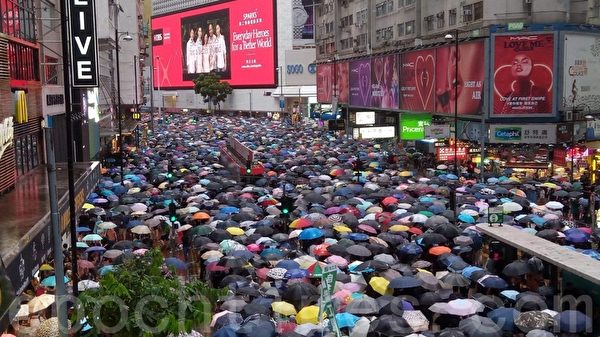
</a>

2019年8月18日下午，集会人士已迫满崇光百货对出的轩尼诗道行车线。（勤智／大纪元）

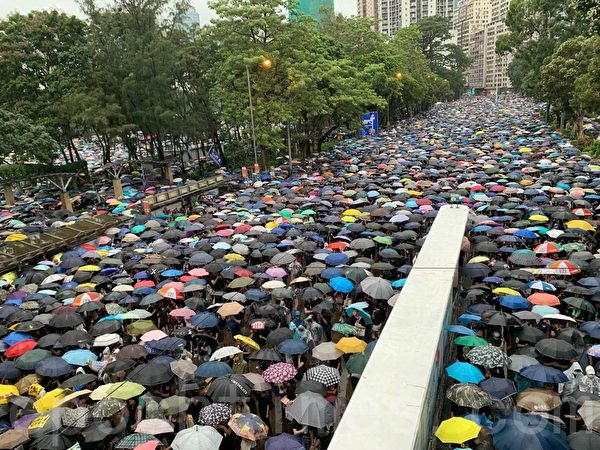
</a>

2019年8月18日，下午5时，大量市民继续沿大小道路缓慢前往维园，同一时间继续由维园离开。（骆亚／大纪元）

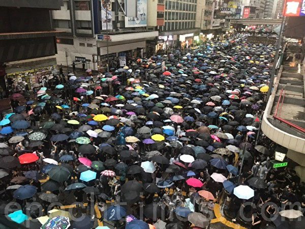
</a>

2019年8月18日下午，在轩尼诗道迫满“流水式集会”的市民。（勤智／大纪元）

<b>警沦为中共港府滥权工具</b>

市民
欧先生参加过多场反送中游行，目睹昨日人潮逼爆铜锣湾，有感香港人的坚持，“做到今日已经两个半月了，还是有这么多人出来，已经是一个想像不到的事。”

他不满港府在游行仍未开始，已经发声明谴责今次集会的口号针对警察，“这个政府究竟为市民服务还是为警察服务呢？”他质疑警察的权力不受制衡，“有国家、有政府全部的支撑，根本整个制度就是使他们不需要为自己做过的事负责，使到他们滥权，成为一个政权管治的工具。”

对于港府和中共对反送中市民的种种抹黑，欧先生直言荒谬：少女被布袋弹打伤，警察居然可以不承认，中共央视更公然造假，“向十四亿人说谎。”

党媒《环球时报》批评香港的示威者侵犯新闻自由，更让人觉得可笑，“你看内地有多少记者已经被灭声，所有的新闻其实也不是新闻，只是宣传的工具，而他还在说新闻自由⋯⋯我希望这么扭曲的世界、这么扭曲的事，不会在香港出现。”

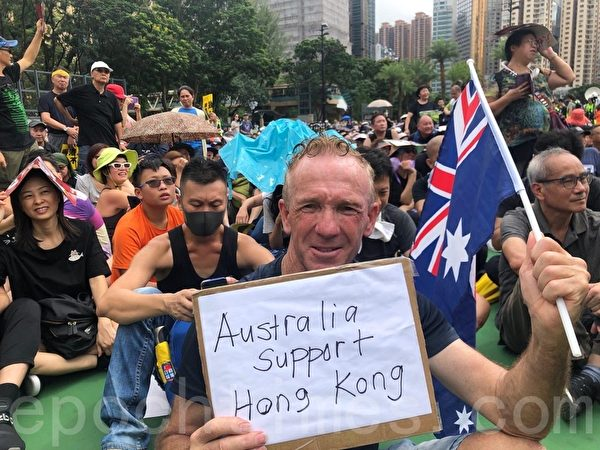
</a>

2019年8月18日下午，有澳洲人参加集会。来自澳洲的消防员Tom特地来支持香港人，他手持写有“澳洲支持香港”的纸牌，和澳洲国旗。（梁珍／大纪元）

集会当中也有一位外国游客的身影，来自南澳洲阿德莱德的消防员Tom以手写纸牌表达对港人的支持，“我想代表我的国家说，澳洲听到了，澳洲正在倾听，澳洲支持香港人⋯⋯这些年轻人让人激动，这么多年轻人愿意为自己的公民权利站出来，令我觉得很温暖。”

<b>维园周围170万人集会 警方几乎失踪</b>

参与流动集会的市民，从日逼到夜，不少市民至晚上才成功进入维园，至晚上8点半仍有不少人方才从维园出发。有大学生表示，已经等了六个多小时，现在才出发。虽然累，但为了守护香港，一定要走出来。民阵在9时宣布集会解散。

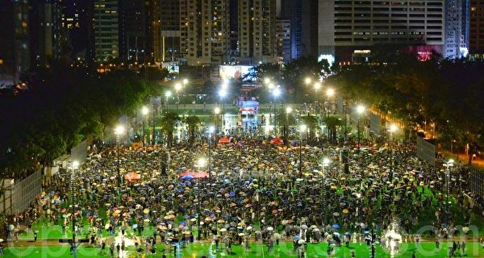
</a>

2019年8月18日晚上，参加集会游行的人士进维园。（宋碧龙／大纪元）

民阵召集人岑子杰晚上10时宣布，昨日流动集会的规模跟6月16日（200万人上街）相若，单单在维园、铜锣湾、天后一带，已点算出170万人参与。还有更多市民在湾仔、金钟等地点聚集，根本无法进入维园，整日人数远超170万人。

民阵指，昨日警方几乎失踪之下，流水式集会得以和平进行，更显维持秩序的是香港人本身，而非连日来滥用暴力的警察。警方无理由再砌辞反对未来各式游行申请，打压香港人和平表达的权利。

8月31日，是中共人大落闸、否决香港人真普选的五周年。岑子杰指，民阵已入纸申请8月31日由遮打花园游行至中联办，望警方尊重港人示威集会的自由。

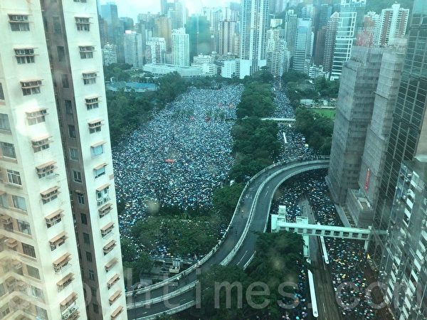
</a>

2019年8月18日下午，民阵带领市民沿轩尼诗道“流水式集会”，维园内、中央图书馆外的高士威道，以及轩尼诗道都逼满集会市民。（黄晓翔／大纪元）

<b>政要名人上街 “局势虽凶险 港人越战越勇”</b>

参与集会的前立法会议员、大律师吴霭仪表示，目睹港府完全漠视民意，警察在街头的暴力每天升级：“（警察）违反一切法律的约束，强硬地用超过限制的武力去对付香港的市民。这个才是对法治最大的威胁和损害。”

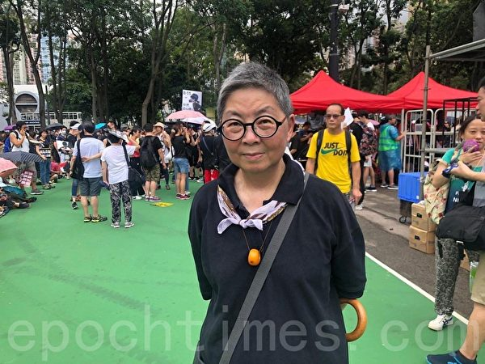
</a>

2019年8月18日，立法会前议员、资深大律师吴霭仪参加维多利亚公园集会活动支持反送中。（梁珍／大纪元）

她形容香港现在的情况“非常之凶险”，但同时感到很有信心，“2个月的抗争中，香港人是越战越勇，无论是和理非（和平理性非暴力），或者是勇武，无论是前线，还是后援的人，一样是对保卫香港的价值很有信心⋯⋯世界也越来越明白，香港人为什么要为自己的自由民主奋斗。”

对于目前商界纷纷被迫表态归边，吴霭仪指送中恶法对商界的损害将非常巨大，“阻挡了这个恶法，才使香港可以继续作为国际的金融中心和贸易中心。”她奉劝商界应该站在香港人的一边告诉政府，“损害香港经济的是政府自己，不是示威者。”

<b>李柱铭斥中共军警介入违法</b>

民主派元老李柱铭也有参加集会。对于中共对反送中运动的恫吓，甚至扬言出动中共驻军也不违反一国两制，李柱铭指，根据基本法14条，应由香港特区政府决定需否邀请解放军帮助维持治安，而目前情况特区政府完全有能力控制。

“前线的勇武抗争者没有枪也没有什么东西，像昨天只是掷蕉和鸡蛋，当然有些人用砖头，但是我们已经知道警察是有渗进（抗争者）中，所以我们不知道扔砖头的是不是警察。”

</a>

8月18日，资深大律师、“香港民主之父”李柱铭（左二）和壹传媒创办人黎智英（右二），前立法会议员、民主党前主席、律师何俊仁（右一），资深银行家吴明德（左一）一行参加维多利亚公园大集会。（梁珍／大纪元）

至于传出中共将动用武警镇压香港示威，以及大陆公安渗透香港警队，他直斥是完全违反一国两制，“《基本法》是完全没有写武警可以来执法⋯⋯没有说武警可以加入香港的警察， 这就不是港人治港了。维持香港治安是特区政府的责任。”

目前国际关注香港局势，李柱铭表示，美国和各国政府当年受邀支持《中英联合声明》下的“一国两制”，“所以他对香港人有一种道德上的责任。当中共政府不遵守自己的联合声明，那美国政府是有责任跟他讲清楚。”

</a>

2019年8月18日，香港著名歌星黄耀明参加维多利亚公园集会活动支持反送中。（梁珍／大纪元）

参与集会的歌手黄耀明，对警方针对黑衣示威者与白衣、红衣人的“选择性执法”令人担忧。目前对这场运动的打压已经逐步升级，香港处在非常紧急的情况，“今天一个很‘和理非’的集会很重要。我们再次聚集市民大众的力量，一起去告诉这个政权我们的态度。”他同时希望世界各地的人们继续关注、守护香港，“不要让香港人孤单。”◇

责任编辑：杨亦慧

<a href=#list><h6 align="right">回目錄</h6></a>
 

<a name=a6><h2>欧盟加拿大联合声明 支持香港自由及自治</a>  </h2>
 

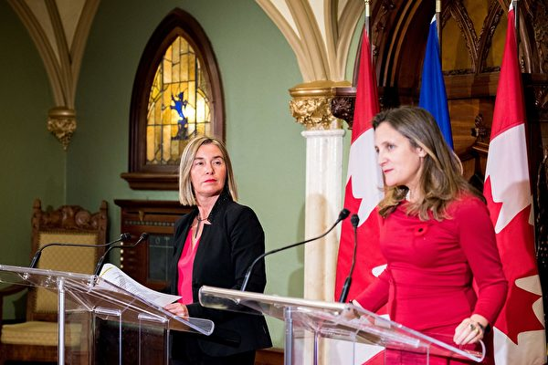
</a>

周六（8月17日），欧盟外交和安全政策高级代表费德丽卡•莫盖里尼（左）和加拿大外长方慧兰（右）发表联合声明，支持维护香港的自由和自治。(MARTIN OUELLET-DIOTTE/AFP/Getty Images)

【大纪元2019年08月18日讯】（大纪元记者苏静好综合报导）继美国支持港人寻求民主自治后，周六（8月17日），欧盟外交和安全政策高级代表费德丽卡•莫盖里尼（Federica Mogherini）和加拿大外长方慧兰（Chrystia Freeland）发表联合声明，支持维护香港的自由和自治。

针对香港“反送中”议题，最早是香港政府拟修改《逃犯条例》，导致香港市民大反弹，连续爆发百万人示威抗争。因港府迟迟不回应港人的五大诉求，面对中共政权还在香港边境集结军队，港澳办对香港抗议者进行威胁，港人坚持走上街头抗争，已经持续2个多月，引发全球各国和媒体、民众的密切关注。

欧盟和加拿大的联合声明表示，欧盟和加拿大在“一国两制”原则下回顾了与香港的密切关系，以及欧盟加拿大在持续香港稳定和繁荣中的重要影响力。

“在过去两个月中，大量香港居民一直在行使其基本的集会权利。 然而，最近出现了越来越多令人无法接受的暴力事件，并有进一步暴力和不稳定的风险。”声明说。

联合声明呼吁克制、拒绝暴力，并采取紧急措施缓和局势。同时强调各方展开广泛和包容性对话至关重要。

“（港人）包括和平集会权在内的基本自由，以及香港在‘一国两制’原则下的高度自治，都载于《基本法》和国际协定内，必须继续得到维护。”声明说。

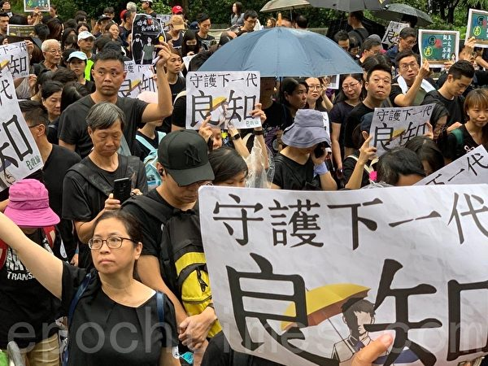
</a>

2019年8月17日，香港教育界举行“守护下一 代 为良知发声”的集会游行，港民举着标语表达诉求。（骆亚／大纪元）

美国总统川普（特朗普）8月15日表示，他不希望看到中国（中共）在香港暴力镇压抗议者，中国国家主席习近平如果亲自会见抗议领导人，可以迅速解决问题。

周三晚间，川普在推特上表示，中方当然想和美国达贸易协定，但中方需要先以人道方式和香港合作解决问题。

美国国务院发言人周三对中共武警车队在深圳集结表示深切关注，并警告说，香港自治权的持续恶化不利于其在国际社会的特殊地位。

“我们谴责暴力并敦促各方保持克制，但是坚持对香港言论自由和和平集会自由的支持”，美国国务院发言人说。

美国国会两院两党领袖均发表声明，支持港人对自由自治的诉求。

英国首相鲍里斯•约翰逊（Boris Johnson）周一表示，英国曾治理香港，对香港最近的事件表示关注，并希望各方保持冷静。

英国外交事务委员会的主席汤姆‧图根哈特（Tom Tugendhat）8月13日表示，英国应该给予持有英国国民（海外）护照的香港公民英国国籍，作为给目前与北京对峙的港人的保障。

他说，这是英国向香港人民做出保证，让他们免于面对中共的威胁。他说，如果这些持有海外护照的人仍然是中国人，“我不认为在中共治下，他们能享有不同于其他中国人的待遇。”

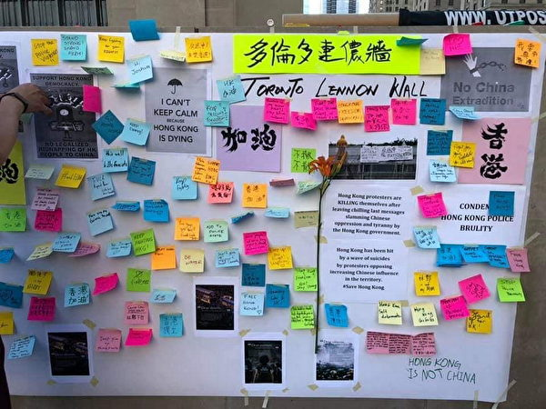
</a>

世界各地都出现了支持香港民众的“连侬墙”，图为多伦多的连侬墙。（Philip Lau／大纪元）

加拿大总理杜鲁多（Justin Trudeau）上周也表示非常关注香港的情况，呼吁和平、有秩序及展开对话，又敦促中共政府在如何回应港人的合理关注时，要十分小心和维持尊重。

对于中共港澳办前日形容香港出现恐怖主义苗头，澳洲总理莫里森（Scott Morrison）不认同，他期望香港特首林郑月娥细心聆听市民诉求，寻求方法为事情降温，以和平方式解决现时的严峻局面。#

责任编辑：林诗远

<a href=#list><h6 align="right">回目錄</h6></a>
 

<a name=a5><h2>美专家：若中共武力干预香港 美应立即制裁</a>  </h2>
 

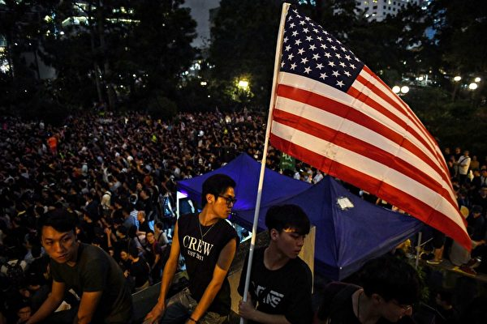
</a>

香港反送中抗议者于2019年8月16日在香港遮打大厦花园聚会时举着美国国旗。(LILLIAN SUWANRUMPHA/AFP/Getty Images)

【大纪元2019年08月17日讯】（大纪元记者林南编译报导）中共武装部队一旦进行直接干预香港示威活动，美国将如何回应？专家建议美国应立即制裁中共。

随着香港紧张局势持续加剧之际，华盛顿智库“传统基金会”（The Heritage Foundation）的四位亚洲问题专家8月16日联合发表文章，对中共是否派武装部队进行直接干预进行评估。而中共一旦一意孤行，他们建议美国政府与国会应立即制裁中共。

这四位专家分别是传统基金会的研究员成斌（Dean Cheng）、亚洲安全政策分析员奥利维亚·伊诺斯（Olivia Enos）、高级研究员麦克∙冈萨雷斯（Mike Gonzalez）和亚洲研究中心主任瓦尔特·洛曼（Walter Lohman）。他们认为，中共武装干涉香港将结束“一国两制”，并坚定地将中国（中共）置于与世界关系不可逆转的地步。如果发生这种情况，川普（特朗普）政府和美国国会应该准备代表香港人进行积极回应。

文章说，随着香港紧张局势持续加剧，重要的是看中国（中共）是否用武装部队直接干预。毋庸置疑，任何干预——即使在技术上符合“基本法”——不仅会对香港本身，而且对全球金融市场和地区政治造成不稳定。

虽然中国（中共）不倾向于公开讨论内部安全事务，但多年来有迹象表明，中国社会存在各种严重的国内紧张局势和压力。这些因素源于一系列因素，包括对种族的不满（例如新疆的维吾尔族），对宗教自由的限制，劳工骚乱，消费品安全和环境问题。在这方面，中国（中共）可能把香港的抗议活动当作为其内部安全和稳定的一系列国内挑战的一部分。

文章分析说，中共对香港示威活动的反应很可能类似于他们对其它内部情况的回应。尽管香港有其独特性，包括法律自治，有着大批驻港的外国媒体等。

文章特别强调，香港并不像其它情况那样。根据《中英联合声明》，除外交和国防外，该地区享有50年的高度自治权。这在国际法中体现了“一国两制”的概念。反过来，这又在香港的小宪法——基本法中明确编纂。该领土将拥有自己的政治结构、司法和内部安全部队。公民社会的关键支柱，如新闻自由和信仰自由，不应受到侵犯。

香港是世界上连通性最强的信息环境之一。任何中国（中共）行动都将在全球范围内直播，不仅通过传统新闻媒体，还包括社交媒体。在北京关注影响全球舆论的情况下，中共在香港干预的后果将是毁灭性的。

文章说，如果北京军事介入的最坏情况发生了，建议美国采取以下措施进行回应：

• 制裁责任人。根据“全球马格尼茨基法案”，美国财政部应该制裁任何来自北京的负责授权、计划或执行武装干预的人，包括实施处罚。除了金融制裁外，美国还应考虑对直接参与严重侵犯人权或腐败行为的任何官员（或其直系亲属）实施旅行限制。

许多美国盟友和合作伙伴都拥有可以快速利用的类似部门。应该鼓励他们这样做。

• 宣布香港公民有资格获得P-2难民身份。中共军队进入城市的那一刻，香港人将因政治信仰而受到迫害。根据美国难民法，难民是指由于“种族，宗教，国籍，特定社会群体或政治见解的成员”而经历或有充分理由担心未来遭受迫害的个人。

政府可向任何能够离开香港或前往美国或友好的领事馆的香港市民提供难民身份。在整个群体遭受迫害的情况下，美国有一个“优先权2”（P-2）措施，允许完全基于该群体的成员资格声称受到迫害，尽管其余的审查程序仍然不变。通过将香港公民确定为特殊人道主义关注的P-2群体，美国可以更容易地保护这些热爱自由的人民。

• 组建国际联盟接受香港难民。在大陆占领香港的情况下，美国祇是能够而且应该帮助香港公民的众多国家之一。应该与七国集团的所有成员和其他志同道合的国家，包括澳大利亚和新西兰，协调对待香港政治难民的问题。香港人应该知道，如果他们能够到达美国领事馆或美国的合作伙伴领事馆，他们将是安全的。

• 取消所有贸易谈判。在正常的商业过程中，中国的政治发展不应成为贸易谈判的一部分，但面对北京领导的香港镇压行动，（美中之间）不会出现常规商业活动。与中国的所有贸易谈判应该停止，没有恢复谈判的计划。

• 终止香港独立的法律地位并实施新的出口管制。根据1992年“香港政策法”的规定，美国应立即撤销与中国分开的香港法律待遇。

此类行动应包括出口管制 ——包括防暴设备 ——以及香港作为世界贸易组织独立成员的待遇。国会应该迅速提供任何必要的额外权限。所有这些都应该与伙伴国和盟友协调。

• 使香港成为外交优先事项。北京的行为应该成为美国在与中国的外交互动中的首要优先事项，并且在与盟友和伙伴接触时，香港问题应处于外交优先考量的首位。

责任编辑：叶紫微

<a href=#list><h6 align="right">回目錄</h6></a>
 

<a name=a4><h2>王友群：香港反送中必将激励全民反中共</a>  </h2>
 

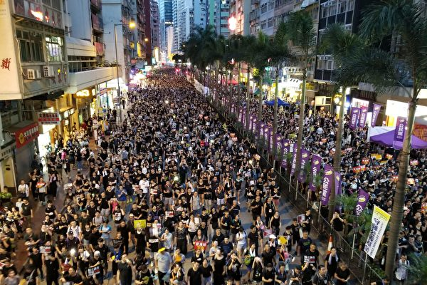
</a>

2019年7月1日，香港七一大游行，民众打开手机灯光鼓舞士气。（宋碧龙／大纪元）

【大纪元2019年08月15日讯】今天看到脸书上一个朋友留言：“香港人是坏人？恩将仇报。2008年汶川8.0级地震。短短2分钟，亡7万，伤4万，失踪2万，全国有4624万人卷入这场灾难，直接经济损失8451亿元！”

“香港赈灾捐款超过230亿！230+亿港币，相当于平均每个香港人拿出3000+港币，从来没有见过哪个国家、哪个地区，对自己的同胞如此慷慨，可是，香港人做到了！”

1959至1962年，中国大陆3年大饥荒期间，从大陆逃到香港的人达到高潮。仅1962年5月5日至25日，约30万大陆饥民逃港。由于逃港人数太多，香港政府一度决定放弃“安置难民”，开始“即捕即遣”，约3万逃港者集结在香港上水华山。

这时，金庸旗下的《明报》发表社评：“最宝贵的是人的生命！最大的仁政，是救人的生命！”由新闻媒体等发起“援助有困难的人民”行动，前后共有十几万人次，送衣、送食、送水到华山。一段影片纪录了当时的情景，今天看来，仍然让人感动落泪！

6月15日，华裔经济学者冷山在推特上贴出香港历年对中国大陆投资的数据。他写道：“香港投资占外商总投资的70%，没有香港金融中心的地位打底，外资不会放心投资大陆！所以，香港的地位，北（京）上（海）深（圳）这类城市再过50年也无法替代！”

但是，现在，香港人正在遭难：

8月11日晚，被香港人称为“民愤最强烈的一夜”。大量视频在全世界社交媒体上广传：一名参与反送中的少女，被警方近距离开枪打中右眼，导致“永久性失明”。防暴警察在地铁站内乱扔催泪弹；在地铁站内的手扶梯上，用警棍狂殴示威者；多名示威者被警察按在地上打得头破血流！还有警察假冒抗议者混入示威人群行凶作恶……

截至8月12日上午11时，45人受伤送医院，最小的8岁，2人伤势严重。

由警察或黑社会在香港制造的暴乱使香港人屈服了吗？没有！

自8月12日下午1点起，港人发起“百万人塞爆机场”抗议活动；香港大学等11所大专院校学生会宣布无限期罢课；香港东区医院医护人员宣布“无限期罢工”；香港民间人权阵线宣布将在8月18日发起“止黑暴，制警乱”大游行。

然而，中共却一直在抹黑香港人：

将绝大多数香港人和平、理性、非暴力的反送中运动，说成“暴”和“乱”；将警察和黑社会制造的白色恐怖，说成示威者搞“颜色革命”；将香港人维护他们1997年前就已经获得的自由、法治、人权，说成破坏“一国两制”；声称：香港当前最急迫和压倒一切的任务，就是止暴制乱。

然而，香港“暴”和“乱”的根源，不是香港民众，而是港府和中共。

如果中共不支持港府强推“送中条例”，如果香港人的正当诉求得到积极回应，就不会有今天香港的乱局。

6月9日以来，香港人举行了近30次场反送中活动，一位吴姓司机场场都参加了。他说：“这个暑假，每天气温都几十度，走出来可不是为了好玩。你看看我，全身是汗，为了过瘾吗？”“尤其那帮建制派，说游行有钱收。我都想问，在哪里拿钱？没有谁给过我钱，我只有捐钱出来。反而他们那些警察，人家拍到他们，一车车旅游巴士送来的，还有钱收。我们呢，你看看这些人，浑身是汗，你问他们是不是自己出钱搭车的？”

林郑“完全不听我们的诉求，一出来就是谴责，谴责什么呢？”“林郑还说，你们就算有200万人出来游行，那还有500万人反对。如果你这么说，你不如说全民投票，全香港人每人一票，决定是通过还是不通过。但你又不敢，是不是？”吴先生还对林郑将市民定性为“暴徒”表示不满，“怎么是暴徒呢？人家和平理性去表达。”“你说人家行动升级，是你们这帮警察行动升级了，是不是？”“就像中信大厦那一次，几千学生坐那里，那个是示威区，为什么你把催泪弹射进去？你不怕人踩人、踩死人吗？”

7月21日晚，一大批身穿白衫的人，手持长棍、竹条，在元朗地铁站疯狂袭击参加游行返回的示威者。现场血迹遍地，包括议员和记者都被打得头破血流。有市民报警求助，警察迟迟不派人到场执法。后来有媒体证实，这是“警黑勾结”。

有网民在白宫“我们人民”官网上发起请愿活动。鉴于港警在过去2个月内不断滥用暴力，严重危害港人的生命安全，呼吁美国政府将香港警务处认定为恐怖组织。仅一周时间，已有12万人签名。

香港人为什么反送中？

关键原因是越来越多香港人认识到：中共的“一国两制”50年不变的承诺是假的，中共根本没有想真正实施“一国两制”，而是企图通过各种方式，将“两制”掏空，变成“一国一制”。这次中共在香港强推“送中条例”，就是要在香港镇压一切持不同政见者。一旦条例通过，在香港，凡是中共看不顺眼的人，都可能被中共以“莫须有”的罪名，抓到中国大陆去。

在中国大陆，只有党治，没有法治。党管公安局，党管检察院，党管法院，党管监狱，一切都是党说了算。中共建政70年，干了多少无法无天的事？过去，已经，制造了数不清的冤假错案；现在，每天，仍在制造大量的冤假错案。被失踪，被认罪，被酷刑，被活摘器官，被自杀，层出不穷！

香港人为什么反送中？请看一看高智晟的经历：

中国人权律师高智晟，被誉为“中国的良心”。2014年8月7日，高智晟3年冤狱期满出狱。之后，被软禁在陕北老家近3年。2017年8月13日，高智晟被中共当局失踪，至2019年8月13日，整整两年。高智晟的哥哥经常到陕西省佳县公安局去打听他的下落。警方有时回答说：“他在北京”；有时回答说：“我们去给你申请看看”；有时说，人在榆林市。至今为止，他的家人都不知道他究竟在哪里，是死是活！

高智晟的妻子耿和、美国对华援助协会会长傅希秋、基督徒公义团契等许多团体、组织或个人，都在寻找高智晟的下落，都没有结果。傅希秋说：“美国国务院高级官员跟我多次会面中，提及他们也一直在向中国（中共）政府询问高律师的下落，到目前为止，没有任何美国的官方渠道被告知高律师被关在哪里，他到底犯了什么法律条文，甚至是死是活，中国（中共）政府也拒绝交代。”

高智晟律师在中国大陆被迫害，被酷刑折磨，被判刑坐牢，出狱后被监控，现在又“被失踪”两年，并不是因为他犯了什么罪，最关键的原因是，他本着一个律师的良知和职业道德，为法轮功学员说了公道话。2004年12月26日，高律师代理并着手调查石家庄法轮功学员黄伟案，使他得以了解到中共迫害法轮功的残酷与野蛮。2005年10至12月，高智晟3次上书时任中共国家主席胡锦涛，中共国务院总理温家宝，第3封信的标题是“必须立即停止灭绝我们民族良知和道德的野蛮行径”。

为法轮功学员说公道话的人权律师的遭遇尚且如此，1999年7月20日中共独裁者江泽民发动迫害法轮功20年来，中国上亿法轮功学员的遭遇又会怎么样？

中共在香港的暴行，正受到国际社会的强烈谴责。

8月12日晚，美国参议员卢比奥发推文说，在香港问题上，中共政权正在向世界展示它们的真面目：它们是邪恶的专制主义者。

同日，美国参议院共和党领袖麦康奈尔在推特中写道：“香港人民勇敢地起身对抗中共，因为北京试图蚕食他们的自治权和自由。任何暴力镇压都是完全无法接受的。就如同我在参议院所说：全世界都在看。”

8月13日，美国总统川普在推特上写道：“我们的情报告诉我们，中国（中共）政府正在向香港边境调动军队。每个人都应该冷静和（保持）安全！”川普在新泽西对记者说：“我希望，能够和平解决。我希望没有人受伤。我希望没有人丧生。”

同日，联合国人权事务高级专员巴切莱特在一份声明中说：“（从视频中）可以看到，警员们多次将催泪瓦斯罐射入拥挤的、封闭的区域，并直接向个别抗议者发射，造成相当大的死亡或严重伤害的风险。”

8月9日，英国外交大臣蓝韬文（Dominic Raab）致电香港特首林郑月娥，表达他对香港局势的关注。他强调，英国和香港关系深厚；基于《中英联合声明》的承诺，英国支持香港的高度自治。港人和平抗议的权利应得到尊重。各方应通过政治对话寻求解决之道。

6月27日，德国联邦议会人权委员会主席严森（Gyde Jensen）等9名议员发表共同声明称，“我们站在那些为自由、民主和法治参加示威的香港人一边。”对示威者暴动的指控，不能接受，必须立即取消。声明还谴责警察对抗议者和记者过度使用橡皮子弹、催泪弹等武力，提出必须由一个独立机构对警察暴力进行全面公开的调查。

8月11日晚，法国国民议会议员赛沙里尼（Jean-François Césarini）发布一份二十多位议员联署的给北京领导人的公开信。信中写道，“在此刻香港发生的事件之前，我们无法保持沉默。所有盲目镇压都不曾促使社会进步，只会削弱采取镇压手段的一方。”

在香港民众反送中的艰难时刻，8月1日，鉴于中共一再不守承诺，川普总统宣布将对3,000亿美元的中国商品加征10%的关税。此前，美国已对2500亿美元的中国商品征收25%的关税。美中贸易战再升级。8月5日，美国财政部将中共列为货币操纵国，贸易战升级为货币战。同日，美国副总统彭斯会见了几个在大陆被迫害的主要信仰团体的代表。人权战在升级。8月7日，美国禁止联邦购买华为、中兴、海康威视、大华、海能达的电信设备。科技战再升级。

进入2019年，中共已经走入穷途末路。

民间流传“逢九必乱”之说。2019年，是中共颠覆中华民国70年，六四屠杀30周年，迫害法轮功20年。70年来，中共发动了50多场血腥残暴的政治运动，杀害了8000万中国人。

6月17日，英国伦敦的“独立人民法庭”宣判：中共反人类罪成立，其活摘良心犯器官已大规模存在多年，并仍在进行，法轮功学员是器官供应的最主要来源。这场持续20年的大屠杀，被称为“这个星球上前所未有的罪恶”！

中共杀人之多，手段之邪恶，超过了中国历史上所有的暴君，超过了侵华日军、希特勒和斯大林！

中共在香港的暴行，就是把在中国大陆搞的国家恐怖主义搬到香港。

中共让“东方之珠”蒙尘；香港人却点亮中国人心中的希望。

香港人在反送中运动中表现出的智慧、勇气，必将极大地鼓舞中国大陆民众，加入到反中共暴政的行列中来。

8月3日以来，香港连登讨论区接连出现大陆网民留言：“感谢香港同胞，过去几十年为我们做的事情，现在换我们撑你们了。我是大陆人，我支持香港！”“你们的坚持令人感动！加油！每一分努力都是未来的曙光！”“坚持五大诉求！没有暴动，只有暴政！”“支持反送中，致所有为自由民主奋斗的香港同胞！”

海外中文媒体上，也有不少大陆网民留言：“中共不怕墙外冒烟，最怕墙内起火。香港的觉醒令中共恐慌，大陆的觉醒令中共命亡。”“向有良知有勇气的香港人致敬！”“中共就是只纸老虎，活不过明年的，去大陆看看中国的大萧条就明白了！”“伟大的香港市民，你们用自己的苦难承受，将共产党的丑恶嘴脸，推上国际舞台实境秀！全世界都在目睹中共裸奔！”

一名大陆留学生致香港同胞的一封信中写道：“6月16日，200万人上街和平游行，震撼了全世界，也震撼了我。从那一刻起，我就知道我应该勇敢地站出来，因为这场抗争，本该是属于我们大陆人的责任。该站起来的，也应当是我们大陆人。”这“是关乎全体大陆、香港、甚至台湾人民的一场命运之战。”暴政“永远摧毁不了我们的反抗意志，也永远不可能夺走我们的自由之魂！”

绝大多数香港人在反送中运动，都秉持“和理非”的理念，即和平、理性、非暴力，必将得到全世界一切热爱自由、民主、法治、人权的人的支持。

香港人经过世代努力，将东方人的智慧和西方的文明有机融合在一起，打造了一座魅力四射的“东方之珠”。谁毁掉她，谁将是千古罪人！#

责任编辑：高义

 

<a href=#list><h6 align="right">回目錄</h6></a>
 

<a name=a3><h2>不理解反送中？大陆青年：因他们不懂共产党</a>  </h2>
 

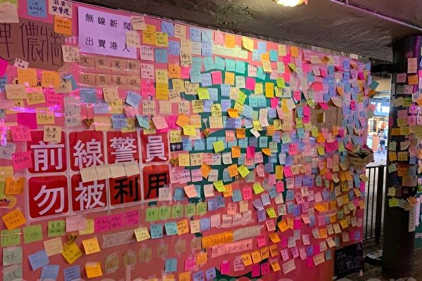
</a>

香港反送中运动中，出现许多民众表达心声的连侬墙。（宋碧龙／大纪元）

【大纪元2019年08月10日讯】（大纪元记者江禹婵台北报导）香港“反送中运动”让港台年轻人比以往更加深连结，台青感叹，若不相互支援打气，台湾的命运也将是如此。但有港台老人不能理解港人为何而战，年轻人认为，老人的想法，其实是源自于资讯来源错误，以及误信中共的宣传所致。

<b>台湾大学校门外的“连侬墙”</b>

位于台北的台湾大学校门外的一条地下通道里，近日出现如香港一般的“连侬墙”，涌现无数鹅黄布条与五彩便利贴，上面写满声援香港“反送中”运动与罢工抗议的字句。每日都有来自两岸三地的青年在此驻足，关心香港最新情况，甚至彼此有机会对话与交流。

此地俨然成为一个新兴社会运动的聚集地，有台北市议员申请将地下道命名为“连侬墙”，以纪念早年东欧民运和中国改革初期的“民主墙”，以及香港“雨伞革命”时期的“连侬墙”，向香港表达台湾人对民主与自由的声援。

香港的连侬墙最早出现于2014年的“雨伞革命”期间，其实就是抗议者粘贴标语讯息的民主墙。香港“反送中”活动，连侬墙再度出现。

“连侬墙”（Lennon Wall）一词可溯源到1980年代的捷克民运。当时捷克青年在英国摇滚巨星约翰·连侬（又译：列侬）遇刺后，开始在布拉格某处墙上张贴主张民主与自由的文宣，因而得名。连侬生前高调反对强权，被年轻人视为追求民主与自由的偶像。

大学刚毕业的陈怡妘也站在连侬墙前，希望能让香港人知道，“台湾有人在支持他们”。除了留言，她也响应为香港青年募捐，希望帮助需要的香港人。

<b>港台学运启蒙 看透中共斗争本质</b>

BBC中文网报导，港台一些老人亲中，与年轻一辈代沟深化。香港侨生陆天赐提到，香港有很多老一辈只锁定一个电视台来看，只有一维视角，两代人更无法沟通。这与台湾近来爆发的所谓反“红媒”争议也有类似之处。

一对来自中国大陆的年轻情侣也慕名来到连侬墙下。女孩提到，原本只是来台大附近书店找书，正好知道有连侬墙，就顺道过来看看。大学时就很想来台湾，这次总算存够了钱，终于一偿宿愿。

她谈到，自己出身普通家庭，父母都是中共党员。但从初中起，看到学校里老师、学生都互相举报，那种人与人之间的信任匮乏让她很不舒服，开始独立思考。

等到自己进入大学、来到大陆大城市后，正逢2014台湾“太阳花学运”和香港“雨伞运动”。她说：“那时翻墙还算容易，我们有看到些新闻，就很激动。”后来有些学生看得太多，一度被公安找到，抓去审讯好几个小时。

“在台湾碰到很多人，都愿意很真诚地倾心聊天，那种人与人之间的单纯与信任让我感觉特别美好。”她开心地说道。

女孩的未婚夫也加入讨论说：“在大陆时都说，台湾是宝岛，但宝在哪里？我们逛了一圈后，发现真的都是宝。”

<b>不理解反送中？大陆青年：对中共无认识</b>

最让这对大陆青年感慨的是，他们在台东旅游时，曾住在当地俗称的“外省第二代”开办的民宿。与房主聊天时惊讶发现很多台湾老一辈竟然反对香港的抗议运动。这位大陆女青年说：“台湾老一辈的观点是，（香港）都已经主权移交，一国两制了，还想怎么样？还说香港要争普选，真奇怪什么的。”

她坦言，“老一辈有种莫名的家国情怀，但他们对大陆，其实就是不够了解，甚至觉得台湾太自由。”台湾老一辈的情怀还让她不禁联想起小时候，她父亲听着收音机中政府保卫钓鱼岛的宣传时那种激动流泪的样子。这样的代沟状态在大陆、台湾和香港都存在。

不过对于年轻一代，香港发生的抗议，大陆青年却有新的反思。她告诉BBC中文说，在大陆看电视，只会觉得很扑朔迷离，不晓得为什么香港年轻人会突然变成暴徒，搞不懂前因后果。甚至来台湾时，家人也一度紧张，要她注意，认为“香港在暴乱”。

大陆青年感叹，中港台因为政治因素而分裂，导致误解与仇恨。他们说，自己相对通融想法在大陆是很边缘的，而多数人认为“（大陆）都很厉害。日子过很好，很潇洒，懂得吃，出国度假等等”，但是谈到政治，大家就都住口了。

这次前来张贴“香港加油”的台湾青年苏萱晏说，这次“反送中”居然激出这么多外冷内热的香港人，甚至变成内热的怒吼。她这次来连侬墙留言，就是想跟香港人一起经历这个历史性的过程。

<b>绝非港独 抗争者：是对抗极权政府</b>

有香港抗争者近日在网上发表“致内地同胞书”，作者在这封信中向“内地同胞”，以及属于同一世代的人，解释香港事件的真相，香港抗争与八九六四的历史传承，并表示他们绝非“港独”，他们对抗的从来不是中国，不是内地同胞，而是共同的敌人——极权政府。

这篇文章发表于网路平台“品葱”，作者署名为“一名微不足道的香港抗争者”，作者称，大陆的人现在在新闻、微信和内地的所有资讯传递平台看到的却是“一群黑衣暴徒在破坏”的画面。

他们不会看到警察滥用暴力，示威者遭黑社会毒打，特首对死谏的年轻生命的冷漠，以及中联办官员在聚会中煽动乡绅黑社会攻击平民的一幕。这一切是这场抗争运动的规模，愈发不可收拾的真正原因。

作者说他所说的这一切也许多数内地同胞并不相信，他们会认为在香港发生的一切都是外国势力策划的反中活动，但他相信，他的同胞们有一天会回心转意，“总会有一夜你也许会回想起二零一九年这一场在香港的风暴，这一场由香港青年人发起的抗争”。

作者恳请内地同胞谨记，“香港的抗争者，从来不是你们的敌人。”作者表示：“对于在极权统治下不敢发声的同胞，我们也绝对理解你们的艰难处境，有你们的明白和心意，香港抗争者绝不孤冷。”

作者认为，香港人这个夏天的抗争会为历史留下一个印记，这个印记若为14亿中国人民的自由带来一点点正面的影响，“对我们这群身在香港的抗争者来说，就已经心满意足”。#

责任编辑：杨亦慧

<a href=#list><h6 align="right">回目錄</h6></a>
 

<a name=a2><h2>英政治家：西方要挺香港 决定如何对付中共</a>  </h2>
 

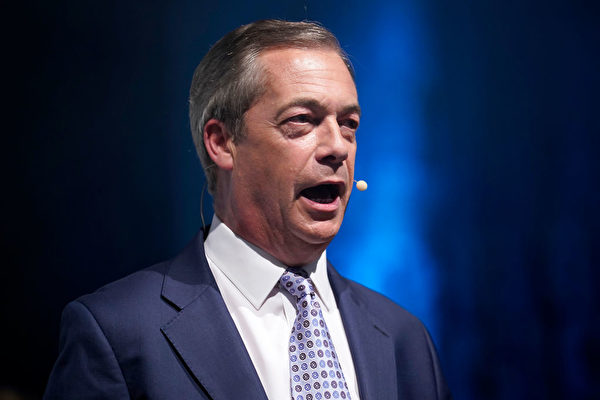
</a>

英国脱欧党领袖奈杰尔·法拉奇（Nigel Farage）表示，北京对香港和平抗议活动的镇压，使得西方社会必须决定要如何对付中共政权，这已经成为一个“非常现实的问题”。 (Christopher Furlong/Getty Images)

【大纪元2019年08月11日讯】（大纪元记者徐简编译报导）在澳大利亚保守党政治行动会议（CPAC）的第二天（8月10日），英国脱欧党领袖奈杰尔·法拉奇（Nigel Farage）表示，北京对香港和平抗议活动的镇压，使得西方社会必须决定要如何对付中共政权，这已经成为一个“非常现实的问题”。

 法拉奇是英格兰政治家及前商品经纪商，现任脱欧党党魁，他还是欧洲自由民主党的共同领导者。

在CPAC上，法拉奇告诉悉尼《大纪元时报》分社的记者，中共在考虑“是否想要制造另一个天安门广场事件。”他认为，全世界都要坚定的支持香港抗议者。

香港人民反对“逃犯条例”（又称“送中条例”）的修订，如果港府通过这项法案，意味着涉嫌犯罪的港人被移交给中国大陆，在其不透明的法律制度中接受审判。

两个多月以来，数百万香港人走上街头抗议这项法案，这项法案被视为中共政权用来侵蚀香港自治和自由的工具。

根据1997年英国和中共签署的有效期为50年的《中英联合声明》，北京保证香港保留其广泛的自由和政治制度，包括其独立的司法制度和自由新闻。

法拉奇说，中共并没有遵守“国际规则”，“这是明确的协议（中英联合声明），直到2047年之前（香港的社会体制）不应该改变，中共显然是非常、非常公开地违反了这一点，他补充说，“我认为我们需要团结全世界其他地区的人，更加强烈地支香港公民的权利。目前，我认为这个世界（对香港的支持）太弱了。”

法拉奇还说，美国总统川普（特朗普）勇敢地指出中共的问题，堪称全球第一位这样做的领袖，“我认为川普在这些方面确实有所作为……许多其他人也对中共有担忧，川普说出了他们没有足够勇气说出来的话。”法拉奇说。

法拉吉说，言论自由在西方世界受到左派的攻击。“在政治中、在媒体中，甚至在大学里我们都看到了，有人要求‘自由空间’，让那些可能扰乱他人思维过程的发言者被禁止进入大学。”他说，“这是新的反民主的左派的一部分，他们不是倾听不同的观点，不同意不同的观点，挑战不同的观点，而是实际上想要禁止不同的观点。”

法拉奇说，左派对其它观念的排斥，可能会破坏一个民主国家的运行。“这实际上把我们带入了非常危险的领域，因为要使文明民主发挥作用，你必须有一个被称为‘失败者同意’的概念。失败者必须接受他们已经失去选举，或者承认辩论失败，“他说现在那些失败者不承认失败，而是要禁止其他人发言，“他们实际上想要禁止言论自由。实际上是想要禁止有不同意见的人。”

不过，他说，这种左派行为不太可能在更广泛的社会中获得支持，“我是一个乐观主义者，”“我认为最终善的力量必然取胜。”

责任编辑：李玲

<a href=#list><h6 align="right">回目錄</h6></a>
 

<a name=a1><h2>美国会拟通过两党法案 制裁破坏香港自由者</a>  </h2>
 

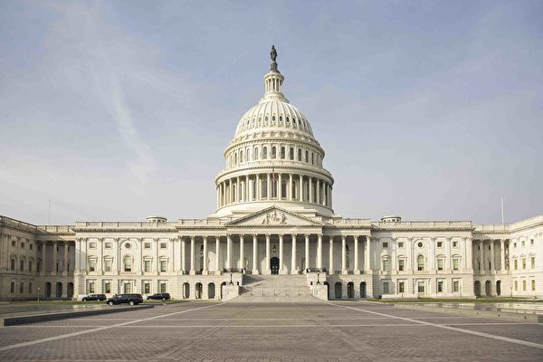
</a>

佩洛西在声明中说，在美国国会，民主党和共和党继续跟香港人民团结一致，要求香港有充满希望的、自由和民主的未来，而这也是香港人民的权利。(Samira Bouaou/The Epoch Times)

【大纪元2019年08月15日讯】（大纪元记者苏静好综合报导）两个多月以来，香港民众为维护自由和自治权，和港府及中共政权抗争，遭到中共不断加剧的打压。周二（8月13日），美国国会众议院议长、民主党领袖南希•佩洛西（Nancy Pelosi）发表声明，谴责中共对香港人民的暴力持续升级，同时表示，国会将通过一项两党法案，以制裁破坏香港自由的人。

佩洛西在声明中说，在美国国会，民主党和共和党继续跟香港人民团结一致，要求香港有充满希望的、自由和民主的未来，而这也是香港人民的权利。“今后几周里，我们将推动通过国会两院和两党的《香港人权和民主法》，重申美国面对北京的镇压致力于民主、人权和法治，关注禁止向香港警方销售弹药和人群控制装备。”

在帮助维护香港自由、民主和自治权上，美国国会两党态度一致。参议院多数党领袖、共和党人米奇·麦康奈尔（Mitch McConnell）周一警告中共，任何对香港抗议活动的暴力镇压都将是“完全不可接受的”。

周三，麦康奈尔表示，数以百万计的香港人在对抗中共的侵犯。

<b>两党支持《香港人权与民主法案》</b>

美国国会两党议员在今年6月13日重新颁布《香港人权与民主法案》，重申在香港的自由和自治遭到中国（中共）政府和共产党侵蚀时，美国对民主、人权和法治的承诺。

《香港人权与民主法案》，在众议院将由共和党议员克里斯‧史密斯（Chris Smith）和美国国会暨行政当局中国委员会主席、众议员吉姆‧麦戈文（Jim McGovern）等多名议员共同提出，参议院方面则由共和党参议员马克‧卢比奥（Marco Rubio）和民主党参议员本‧卡丹（Ben Cardin）等数名议员提出。法案将提升判定香港是否足够自治的标准，也将决定香港是否能获得现在所享有的特殊的经济和贸易优惠。

麦戈文议员当时说：“这项立法明确指出，美国国会支持香港人努力维护香港的人权和法治。”

“我们今天提出这项法案是因为民主和自由在香港受到攻击，国会重申美国对香港自治的承诺，保障香港市民的人权，以及和平抗议中国（中共）政府对香港日益粗暴的监管。”史密斯说。

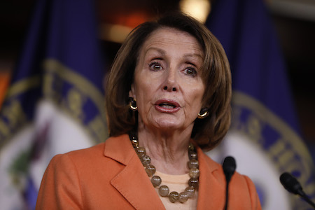
</a>

周二（8月13日），美国国会众议院议长南希•佩洛西（Nancy Pelosi）发表声明，谴责中共对香港人民的暴力持续升级。图为佩洛西。(Aaron P.Bernstein/Getty Images)

<b>法案将制裁那些破坏香港自由及人权的个人</b>

这项两党法案要求美国国务卿每年发布香港自治证书，以确保在1992年《美国-香港政策法》（US-Hong Kong Policy Act）前提下，香港获得特殊待遇地位的合理性。

法案还要求美国总统确定那些应对绑架几名香港书商负责的人，以及将行使国家法允许权利的人拘捕并送回中国大陆的人，并对这些破坏香港自由的人进行制裁，包括冻结他们在美国的资产，拒绝他们入境美国等。

法案还要求总统发布一项战略，以保护美国公民和企业免受修订后的引渡法的影响；以及美国商务部需要发布年度报告，评估香港是否充分执行美国和联合国的制裁，特别是与伊朗和朝鲜有关的制裁。

此外，该法案还明确规定，如果香港公民参与当地抗议活动而被捕或拘留，则不应拒绝给予他们美国签证。

<b>参院NDAA包括对侵犯香港自由人权者制裁内容</b>

参议院对“2020财政年度国防授权法”（NDAA）修订案第二节也写道：“根据美国和国际法，美国应对所有侵犯香港人民基本人权和自由的个人或实体实施经济制裁、签证禁令和其它惩罚性经济措施。”外界预计修订案会在今年秋季进行表决。

在过去的几周里，美国众议院和参议院已经分别通过了各自对2020财年国防授权法案的若干修正案。接下来，国会两院将协商讨论共同版本，待国会表决通过后，送交由美国总统川普签字后生效。

此外，资深共和党籍参议员泰德‧克鲁兹（Ted Cruz）周一晚在推特上表示，“美国与香港的关系是以中方（承诺的）自治为前提，如果共产党拒绝确保（香港）自治，那么美国应该而且会重新评估这种关系。”

克鲁兹接着写道：“我将继续推行‘香港政策再评估法’，该法案将启动这一程序，并将由我的同事们通过，直至（中共）当局撤销引渡法案，并采取措施确保香港的特殊地位得到保障。”

责任编辑：李缘

<a href=#list><h6 align="right">回目錄</h6></a>
 

<a name=a><h2>一文看懂 香港反送中条例的来龙去脉</a>  </h2>
 

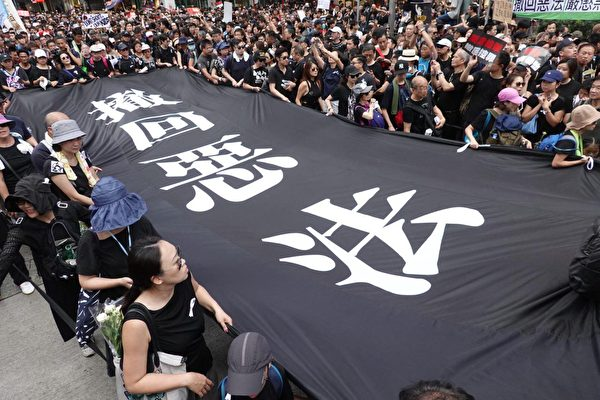
</a>

香港144万人在16日再度上街游行，要求撤销“送中恶法、咎责警察开枪、林郑下台”。图为主横幅“撤回恶法”经过湾仔轩尼诗道和庄士敦道交界。 (余钢)

【大纪元2019年06月17日讯】（大纪元记者萧律生综合报导）历经两次百万人的大游行后，香港民众撤回《逃犯条例》修订案抗议活动（也称“反送中”）仍在持续，港府依旧没有完全撤回。

本文从《逃犯条例》修订案背景、修订案关键点、“反送中”游行、各界反应4个方面梳理此事件。

<b>《逃犯条例》修订案背景</b>

根据英国外交部解密档案，1992年英国为香港制订引渡协议及现行《逃犯条例》时，强调“只与司法制度、刑罚制度、人权状况达标的政府建立引渡关系”，即使香港主权移交至中共，此等必要人权标准仍然适用。所以，中国大陆及澳门、台湾不在《逃犯条例》内。

2019年2月12日，香港保安局向立法会提交修改《逃犯条例》和《刑事互助条例》建议，删除原有条文中关于引渡法例不适用于中国大陆、澳门和台湾的限制。理由是需要引渡谋杀案嫌疑人——港人陈同佳。

陈同佳案是指，2018年2月陈同佳与女友潘晓颖（港人）去台湾游玩时，疑似谋杀女友。陈同佳随即返港被捕，并承认杀死女友。2018年12月13日，台北地检署通缉陈同佳。今年4月，陈同佳仅因4项洗钱罪在香港被判刑29个月。由于谋杀案发生在台湾，按照香港法律，陈同佳必须在台湾接受与谋杀有关的指控，才能以谋杀罪论处，但港府因法律限制无法向台湾移交疑犯。

2019年2月21日，台湾陆委会提出反对意见，即不同意港府以“一个中国”为前提修改引渡法例，并以此与台方交涉。3月4日，香港大律师公会发表声明，批评政府违背承诺——“不会在没有询问公众”跟大陆商讨引渡协议。

<b>《逃犯条例》修订案关键点</b>

《逃犯条例》修订案有两个关键点。第一是《逃犯条例》（第503章）、《刑事事宜相互法律协助条例》（第525章），建议移除该条例中的地理限制。

即香港以外的司法管辖区（延伸至中国大陆、澳门、台湾）可以要求香港机构提供协助，以搜查及检取的方式搜集证据；让香港可以利用“一次性”或“专案”或“特设”的协议把疑犯移交到中国大陆、澳门、台湾，以及到其它与香港设有相互移交疑犯安排的地区。

香港已先后跟18个国家签订引渡协议，包括澳洲、加拿大、新西兰、英国、美国、菲律宾、印度、荷兰、新加坡、印度尼西亚和马来西亚、斯里兰卡、葡萄牙、韩国、爱尔兰、德国、南非和芬兰。

第二个关键点是剔除立法会的个案审批，可以直接由特首裁定，即特首有最大的裁量权。

一旦该修订案通过，所有在港人士，世界上很多国家人士无论过境香港或来此旅游、求学、工作，都有可能被中共藉由《逃犯条例》移送中国大陆审判。而中国大陆是一个被中共专制独裁统治、没有民主法制的国度。

而对于港人而言，该修订案的通过，将触发移民潮。卑诗省移民律师Will Tao（简称陶律师）6月12日在《多伦多星报》撰文表示，他预计未来会有很多香港人来温哥华。

大约30年前开始的香港移民潮，是因为港人担心中共接管香港后带来不稳定而移民他国。最近，陶律师看到咨询移民信息的人越来越多。他说，很多客户曾住在加拿大，但在过去的20年回流香港了。现在他们想回来加拿大。

<b>“反送中”游行</b>

3月31日，民间人权阵线（简称“民阵”）举办首次反修例游行，1.2万人参加。4月3日，香港立法会为修例进行首读，并成立法案委员会详细审议。

4月28日，民阵举行第2次反修例游行，13万人参加。5月20日，港府要求立法会绕过法案委员会，在6月12日直上大会审议条例。

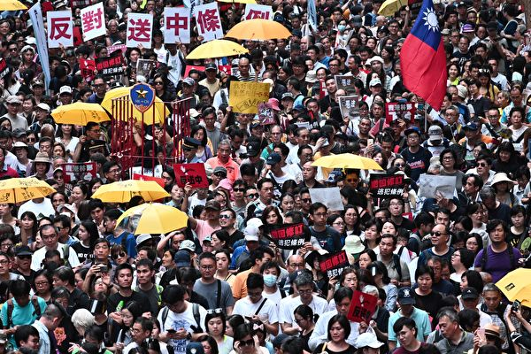
</a>

香港“民间人权阵线”28日发起“反送中”游行，有大量民众赴立法会外进行集会，要求撤回修订《逃犯条例》。(Anthony WALLACE/AFP)

6月9日，民阵举办第3次反修例游行。游行队伍原定下午3时于维园出发，随后应警方要求、游行队伍提早于下午2时20分出发，并于当晚10时结束。民阵宣布游行有103万人参加，警方则宣称高峰时有24万人。

当晚11点，香港政府发出新闻稿，宣布《条例草案》将如期12日在立法会恢复二读辩论。其后，有示威者与警方在立法会综合大楼、龙和道、告士打道一带发生冲突。

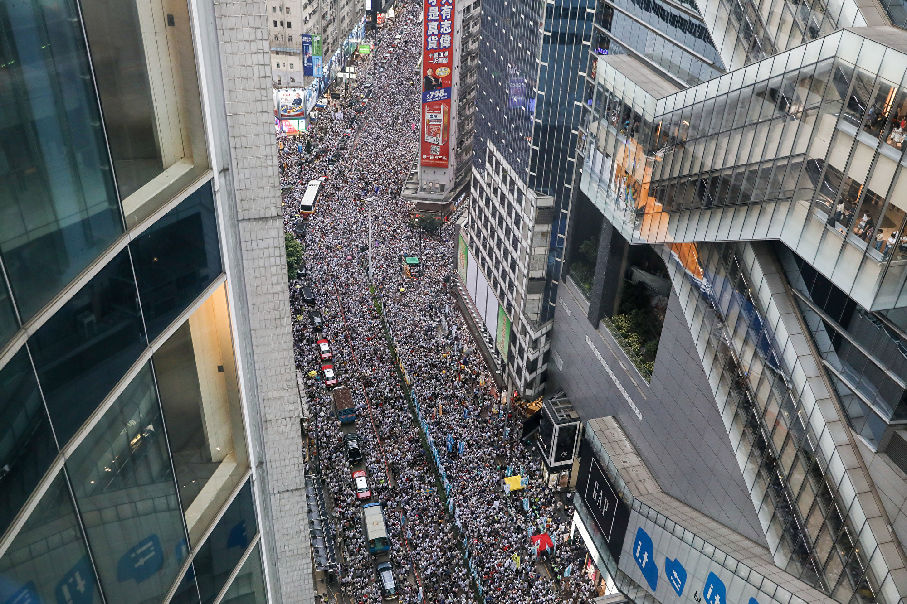
</a>

6月9日，香港百万人上街大游行“反送中”，即反对港府欲对“引渡条例”立法。(DALE DE LA REY/AFP/Getty Images)

</a>

6月9日，香港百万人上街大游行“反送中”，即反对港府欲对“引渡条例”立法。(Anthony Kwan/Getty Images)

6月12日，民阵及民主派发动包围立法会行动。香港民众当日以罢工、罢市及罢课的方式走上街头，聚集在立法会、政府大楼及附近街道抗议。随着万名港人包围立法会大楼，迫使原定举行二读押后。

下午3时许，警方用催泪弹、橡胶子弹、布袋弹或胡椒喷雾等清场，无防备的多名示威者头部中枪。而示威者大部分是20多岁的年轻人。截止当晚10时，72人受伤。这是香港警方自97年以来首次将子弹对准抗议民众。

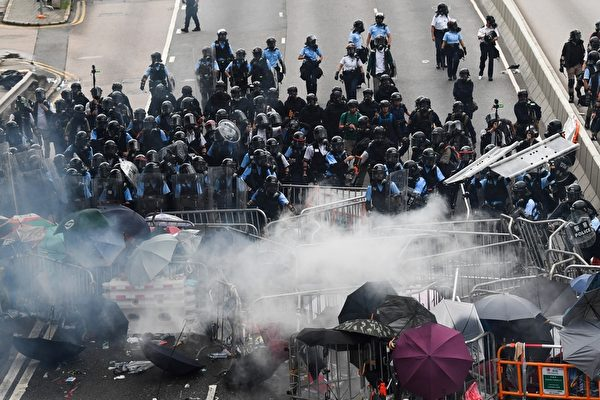
</a>

2019年6月12日，香港警方在立法会旁对示威者施放至少10枚催泪瓦斯和多次射击橡胶弹，造成多人受伤。(ANTHONY WALLACE/AFP/Getty Images)

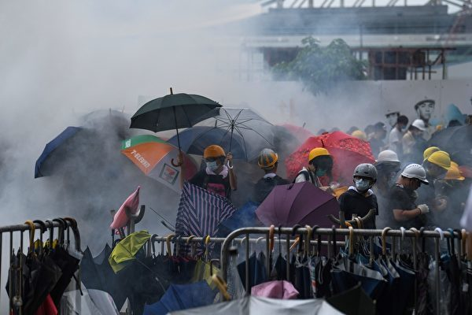
</a>

2019年6月12日，示威者戴上眼罩和口罩，防御警察施放的催泪瓦斯与橡胶子弹。(ANTHONY WALLACE/AFP/Getty Images)

可是当晚，香港特首林郑月娥、警务处处长卢伟聪定性当日的抗议为“暴动”。林郑月娥更以妈妈无法纵容儿子吵闹的任性行为比喻抗议活动。她的“母亲论”引起社会反弹，一群香港母亲发起联署。

6月13日，民阵宣布于16日再举办大游行，要求香港政府撤回修订《逃犯条例》，释放所有示威者。

6月14日，香港妈妈们在中环遮打花园举行“香港妈妈反送中集气大会”。6月15日下午3时许，林郑月娥宣布暂缓修订《逃犯条例》。晚上9时，一位35岁名为梁凌杰的示威男子，在金钟太古广场外墙的高空平台挂横幅反对《逃犯条例》，疑因情绪激动发生意外坠下死亡。

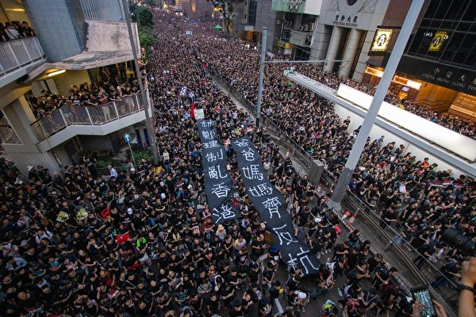
</a>

6月16日，近200万市民再次上街反恶法，要求特首林郑月娥下台，游行人数创香港史上最多纪录。（蔡雯文／大纪元）

</a>

6月16日，近200万市民再次上街反恶法，要求特首林郑月娥下台，游行人数创香港史上最多。(HECTOR RETAMAL/AFP)

6月16日下午2时30分，香港再现“反送中”大游行，并提出四项要求：要求撤回修例、收回“暴动”定义、停止拘捕及检控和释放被捕示威者、要求林郑月娥下台。

主办方民阵估计，有200万+1人参与其中。当晚8时29分，香港政府发出新闻稿，称将停止修订《逃犯条例》，特首林郑月娥也表示道歉。但是香港民众不接受道歉，坚持不离去，依旧抗议，同时聚在一起悼念梁凌杰。

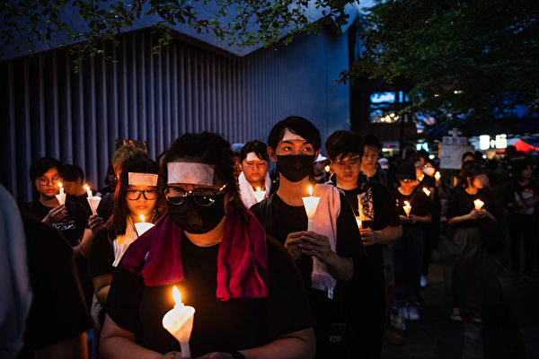
</a>

香港民众聚在一起悼念6月15日在金钟太古广场、疑因情绪激动发生意外坠下的男子。(Billy H.C. Kwok/Getty Images)

6月17日上午，香港众志秘书长黄之锋出狱。他表示，会与港人并肩作战，批评林郑月娥死撑，不肯下台，“当她流的是眼泪，香港市民在金钟流的是血”。

当日，抗议民众仍留在立法会前聚集未散。下午3时30分左右，在香港立法会民主派议员区诺轩、朱凯迪等人带领下，抗议民众从立法会前往特首办，并高喊“对话”、“撤回条例”、“林郑月娥下台”的口号。

<b>各界反应</b>

<b>媒体</b>

6月9日、6月16日，香港两次百万人的大游行得到全世界的关注，全球各大媒体纷纷进行报导。包括《华尔街日报》、《华盛顿邮报》、《纽约时报》、美国福克斯新闻等美国媒体；路透社、BBC、法新社、德国之声等欧洲媒体；澳洲人、加拿大广播公司等澳、加媒体；日本产经新闻、朝日新闻、韩国中央日报、朝鲜日报网等日、韩媒体；雅加达邮报、印度新德里电视台等东南亚媒体。

台湾三立新闻、香港苹果日报、香港大纪元时报等港台媒体做了现场直播。可是大陆媒体普遍只字不提，仅剩的喉舌媒体通报及喉舌媒体海外版却歪曲事实。网民指责说：“望着青天白日撒谎，鬼都不见踪影，你不要脸也到家了！”

《中国数字时代》报导，中共宣传部16日已下达命令，要求大陆各网站查删香港“反送中”相关游行视频，查删《海阔天空》、《真的爱你》、《皇后大道东》等香港歌曲下面的相关评论。

<b>政界</b>

6月17日，台湾立法院长苏嘉全召开临时会进行朝野协商，并在发出的共同声明中呼吁，港府应谦卑面对群众诉求，把冲突降至最低，撤回《逃犯条例》修订案，而台湾政府也应依法给予受政治迫害的港澳居民必要的协助。

美国国务卿蓬佩奥16日接受福克斯新闻节目“Fox News Sunday”采访时表示，他确信川普总统和习近平在月底的20国集团（G20）峰会上会面时，会提到香港人权问题。

16日，中华民国总统蔡英文再次回应香港“反送中”事件表示，一国两制绝对不可行，她强调守护民众的民主自由是任何一位领导人的责任。

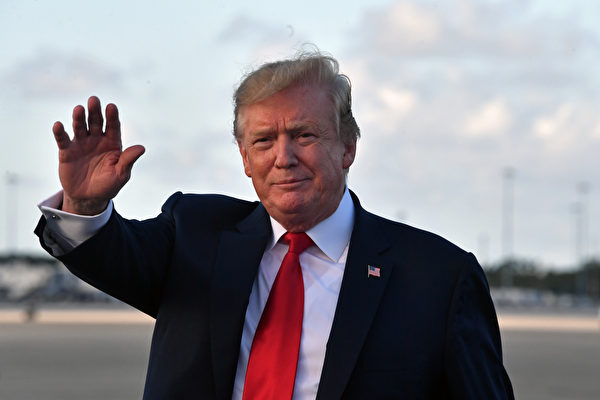
</a>

图为川普总统。(Nicholas Kamm/AFP)

6月12日，美国总统川普表示：“有大规模的示威。我今天看了，真的是一百万人……这是我见到过的最大的示威。所以我希望，中港最终能够解决这个问题。”

12日，英国首相特雷莎‧梅在议会说，该修订方案必须尊重1984年《中英联合声明》所规定的权利和自由。

6月11日，美国众议院议长佩洛西发表声明说，香港《逃犯条例》修正，显示中共明目张胆地践踏香港法治的企图，藉以箝制异议并扼杀香港人的自由。

<b>在他国的民众</b>

6月16日，逾万台湾人集会跨海挺香港；新西兰、大纽约地区、加州圣地亚哥均进行集会游行，声援香港200万人游行；澳洲七个城市同步举办集会、征签活动，敦促香港政府撤回“送中”修例。

6月9日，103万港人游行时，全球12个国家，29个城市均举行反送中集会，以声援香港的行动。包括美国纽约、旧金山、洛杉矶、华盛顿、芝加哥、加拿大温哥华、多伦多、渥太华、英国伦敦、澳洲坎培拉、墨尔本、雪梨、德国柏林、日本东京、台湾台北、法国巴黎、丹麦哥本哈根等。其中在澳洲雪梨有多达2,000人参加集会声援。

<b>港星</b>

香港影帝杜汶泽、黄秋生在社交媒体上发表了力挺“反送中”的贴子。港星何韵诗、黄耀明、王宗尧、王喜直接参与游行。梁家辉与张艾嘉保守回应媒体。佘诗曼因在Instagram上按赞某张“反送中”而遭大陆网民围攻。

郑秀文、容祖儿、阿Sa接连含蓄发文，被网民视为是声援“反送中”。唐诗咏和黄翠如疑似用隐喻方法，发贴文力挺“反送中”。

目前仅传出港星成龙的态度令人咋舌。6月12日在台举行新专辑“我还是成龙”时，被问及“反送中”相关议题，成龙表示“我都不知道是什么事情”。

<b>大陆民众</b>

《中央社》报导称，9日晚间起，微信群组开始流传“反送中”大游行影片，部分中国网民也将相关照片上传至微信朋友圈。不久，大陆当局开始封锁消息，“反送中”、“加油香港”、“支持香港”、“撑香港”等字词通通成为敏感词。

但有不少大陆网民翻墙留言，纷纷表示支持香港民众反送中。

“感动！我心与百万香港人民在一起，支持你们反恶法、反暴政！”“平和而坚决，正常自由社会高素质民众的典范！”“身为大陆的年轻人，真是为自己的无能为力感到痛苦，并不是大陆人懦弱麻木，而是我们所处的环境不允许我们呐喊，今天香港人都是好样的！你们加油！一定不能放弃。”

自由亚洲电台报导，甘肃某大学教授黄女士以“百万雄狮”比喻游行的规模，并说中共非常的害怕，“如果大陆人一旦也像香港人一样，那就不好收拾了”。长沙网民潘凤华赞扬香港人的抗争精神：“我心情很激动。作为内地民主人士，他们的行为给了我们很大的鼓舞，也让我们以后在内地抗争，提供很多我们可以效仿的经验”。#

责任编辑：高静

<a href=#list><h6 align="right">回目錄</h6></a>
 

<a name=w12><h2>法轮功学员将恶人名单递交美国国务院</a>  </h2>
 

要求对其拒发签证
 

【明慧网二零一九年七月二十一日】在反迫害二十周年之际，法轮功学员近日将一批恶人名单递交美国国务院，要求根据相关法律将其列入特殊名单，对其拒发美国签证、禁止其入境。

国务院官员告知，名单收悉，会审核所有提交之个人，依法处理。还告知，近年在中国有多人因迫害人权被拒发签证，且皆因迫害法轮功学员。国务院官员肯定明慧网是可信赖、可引用的信息来源，称赞法轮功学员递交的材料详细、清晰，是各国受迫害信仰团体中做的最好的，欢迎提交更多迫害人的名单。

国务院官员还说明，人权迫害者的配偶、子女亦在惩罚之列。还强调，他们不看重迫害案例的数量，而看重具体事实，只要某恶人有一个案例具备足够的具体事实描述，就可将其放入特殊名单。

国务院官员还透露新近的一个调整，即，对于严重侵犯人权的恶行（如酷刑、殴打），一个官员只要是恶行实施单位的负责人，即可列入惩罚之列，而不需象以往那样证明此官员对某次具体恶行下达了命令或进行了指挥。

国务院官员称，相关办公室的人员已扩充一倍，以便加大力度审核、限制各国人权迫害者的签证申请。而且，目前有28个国家已经制定或准备制定类似于美国的“马格尼茨基法”，对人权迫害者拒发签证、冻结海外资产。

今年早些时候美国国务院官员告诉一些宗教及信仰团体，他们意在更加严格的审核签证申请、对人权及宗教迫害者拒发签证，包括移民签证和非移民签证（如旅游、探亲、商务等），已发签证者（包括“绿卡”持有者）也可能被拒绝入境。国务院官员还告知美国法轮功学员，可以向他们提交迫害者名单。

在过去二十年的迫害里，中国全国各地、各类、各级人员犯下严重迫害恶行的人为数很多，法轮功学员会不断的、分批递交迫害者名单。每批当中，会挑出有代表性的恶人，罗列其迫害恶行。

在最近递交的名单中，有中共宣传部门负责人，有各级政法委、610负责人，有涉嫌活摘法轮功学员器官的医生，有监狱系统负责人，有法官，有劳教所恶警。既有直接实施迫害者，也有制定政策者及下达命令者。见附录。

希望大陆所有相关人员引以为戒，对迫害政策不予配合、执行，不要堵死自己和家人前往美国及其它西方国家定居、学习、旅游、经商之路。

关于美国有关禁止入境的主要法律及总统公告，请见：
<a href="http://www.minghui.org/mh/articles/2019/5/30/%E7%BE%8E%E5%9B%BD%E5%9B%BD%E5%8A%A1%E9%99%A2%E5%B0%86%E5%AF%B9%E8%BF%AB%E5%AE%B3%E6%B3%95%E8%BD%AE%E5%8A%9F%E8%80%85%E4%B8%A5%E6%A0%BC%E5%AE%A1%E6%A0%B8%E7%AD%BE%E8%AF%81-388036.html">美国国务院将对迫害法轮功者严格审核签证</a></b>

<b>附：递交的部份名单</b>

以下20个仅为所交名单上的部份恶人，在此选出刊载，只为说明递交之名单会涵盖各个地区、各个行业及各个级别的恶人。

<b>（1）　刘云山</b>

男，1947年7月生，祖籍山西省忻州市，出生于内蒙古自治区土默特右旗，原中共中央政治局常委。

1993-1997：中共中央宣传部副部长
1997-2002：中宣部副部长，中央精神文明建设指导委员会办公室主任
2002-2012：中共中央政治局委员，中央书记处书记，中宣部部长
2012-2017：中央政治局常委，中央书记处书记，中宣部部长，中共中央精神文明建设指导委员会主任。

自1999年7月，中共及江泽民集团开始对法轮功实施群体灭绝性迫害以来，刘云山利用其掌控的宣传机器，不断用各种谎言诋毁诬蔑法轮功，煽动民众对法轮功的仇恨，配合中共的镇压，达到从名誉上搞臭法轮功的目的。

从1999年6月起，刘云山就在江泽民一手操纵成立的中共中央处理法轮功问题领导小组（610办公室即为该小组执行机构）分管反法轮功宣传。由于刘云山积极执行中共及江泽民集团对法轮功的镇压政策，于 2002年被提升为中宣部部长。这期间正是中共迫害法轮功的高峰期，全国有无数法轮功学员被绑架、关押、劳教和判刑迫害，众多法轮功学员因遭受酷刑而被致伤、致残、致死，更有大量法轮功学员被以活体摘取器官的方式屠杀。这与刘云山主持的反法轮功舆论宣传有直接关系。2012年，刘云山晋升为主管意识形态的中共中央政治局常委，仍继续兼任中宣部部长，并继续在全国范围内推行对法轮功的诬蔑宣传。

以下是刘云山在中宣部和中央文明办任职期间发表的有关诬蔑和攻击法轮功的讲话、文章和报告等的部份例证。（略）

<b>（2）赵飞</b>

男，1964年1月生，湖北沙洋人。
1999.05 ——2002.04 湖北省荆门市公安局党委副书记、副局长（正县级）
2002.04 ——2003.03 湖北省荆门市检察院检察长
2003.03 ——2005.01 湖北省黄石市检察院检察长、党组书记
2005.01 ——2011.08 湖北省公安厅党委委员、副厅长
2011.09 ——2014.07 湖北省武汉市委常委、政法委副书记，市公安局党委书记、局长
2014.07 ——2017.04 天津市政法委副书记（主持工作），市公安局党委书记、局长
2017.04 ——2017.07 天津市政法委书记，市公安局党委书记、局长
2017.07—，天津市委常委、政法委书记

赵飞在2011和2014年指挥武汉市政法委、“610”、公、检、法迫害体系，3次大规模的非法抓捕当地法轮功学员，致使张苏、张伟杰、熊炜明、崔海、沈学武、王学明（云萧）等多名法轮功学员被非法抓捕，抄家、关押，遭受酷刑，据不完全统计，在赵飞任职武汉市公安局局长期间，超过30名法轮功学员被非法判刑，10余人被迫害致死，多人被酷刑致残或精神失常。

（具体案例说明略）

<b>（3）冯征</b>

男，1969年12月出生，天津市人。
1998年4月任山西省监狱管理局党委委员、副局长兼政治部（警务处）主任（处长）、局直机关党委书记；
2003年6月任省政法委委员，省监狱管理局党委书记、局长；
2008年3月任省政法委委员、司法厅党委委员、副厅长，省监狱管理局党委书记、局长
2011年5月任中共晋城市委常委、常务副市长；
2013年4月任山西省委副秘书长、省防范办主任；（山西省防范办，即610办公室）（2013.4-2018.1）
2018年1月任山西省食品药品监督管理局党组书记、局长

2003年6月至2011年5月，在冯征任山西省监狱管理局局长的8年间，山西监狱系统暴力推行对法轮功学员的强迫“转化”（强迫放弃信仰），法轮功学员刘志斌、康治国、栾福生、郭菊庭等4人被晋中监狱迫害致死，法轮功学员曹双梅被山西省女子监狱迫害致死。
（具体案例说明略）

<b>（4）刘宏</b>

男，1965年12月出生。
原任辽宁省维护社会稳定工作（辽宁省防范和处理邪教问题）办公室副主任（副厅级），2011年任中共辽宁省委政法委副书记，辽宁省维护社会稳定工作（辽宁省防范和处理邪教问题）办公室主任（兼）。（辽宁省维稳办即防范办，即610办公室。）
辽宁省610办公室是中共辽宁省委迫害法轮功的指挥和执行机构。作为省610办公室的主任，需对在任期间（2011年至2017年）在辽宁省范围内发生的对法轮功学员的迫害、酷刑、致死、致残等严重罪行负主要责任。以下收集的是这个期间的严重迫害案例。
（具体案例略。）

<b>（5）单成繁</b>

男，1956年6月出生。
2012.02 - 2016.01 辽宁省司法厅副厅长、党组副书记，辽宁省监狱管理局局长、党委书记（正厅级）。

辽宁省是迫害法轮功最惨烈的省份之一，迫害致死人数，非法抓捕、判刑人数，在全国都“名列前茅”，在监狱、劳教所里，更是发生了多起震惊世界的酷刑迫害案例。辽宁省各地的多所监狱、劳教所沦为中共迫害法轮功的黑窝，如臭名昭著的“马三家女子劳教所”，沈阳监狱城（包括辽宁省女子监狱，沈阳第一监狱等多所监狱），盘锦监狱，大连南关岭监狱，本溪溪湖监狱、沈阳东陵监狱等。每个监狱对法轮功学员的迫害手段都如出一辙，都毫无人性。

截至2015年末，辽宁法轮功学员遭非法判刑后，在监狱里因为坚持信仰，拒不转化，而被迫害致死的有90多人，其中在非法关押期间被直接迫害致死的52人，保外或释放后死亡的47人，且有114名辽宁法轮功学员在迫害致死前遭受过监狱系统的酷刑折磨。

“沈阳监狱城”里的辽宁省女子监狱是中共迫害法轮功以来最残暴、最狂虐、最血腥的“黑暗集中营”。在那里，只有权力，没有法律；只有凶残，没有人性；为了逼迫法轮功学员放弃对神的信仰，监狱对法轮功学员扇耳光、上大挂、挂小号、电棍电、背铐吊床、冷水泼、热水烫、熬鹰、高强度奴役……

在单成繁2012年2月上任以来，辽宁省被非法关押的法轮功学员近20人被迫害致死、多名法轮功学员被迫害致残、致疯。
（具体案例略。）

<b>（6）黄洁夫</b>

性别：男
出生日期：1946年3月
出生地：江西吉安。
职务：中国器官捐献与移植委员会主任、中央保健委员会副主任、中共前卫生部副部长 、中国人体器官移植技术临床应用委员会（OTC）主任（2006年7月） 、中国人体器官捐献委员会（CODC）主任委员（2008年） 、中山大学附属第一医院器官移植科名誉主任，北京协和医院肝脏外科主任 。

提要：黄洁夫是中共卫生系统活摘法轮功学员器官的重要组织者，他任职的医院移植量巨大，多名医生承认用了法轮功学员的器官。他个人直接参与器官移植，数量很大。如自述2012年一年就做肝移植500多例。2005年9月28日黄洁夫一台肝移植手术，涉嫌用三个活人做备用肝供体。是中共大量活摘法轮功学员器官的涉案主犯之一。

（一）黄洁夫是中共卫生系统活摘法轮功学员器官的重要组织者

黄洁夫在2001年10月至2013年初的近12年间，是中共卫生部/卫计委分管器官移植的主要负责人，这期间也正是江泽民集团活摘法轮功学员器官发展的高峰。他推动大批医院成立了器官移植中心，连不具备条件的市级中医院、乡镇医院、基层军队医院都开展了大量器官移植手术。最多的时候，据中共OPO器官获取联盟主席叶启发称有1000多家移植医院 。这些医院中，被追查国际查获立案的器官移植的医院就有891家。其中，实施肾移植的医院由2001年的106家增加到2006年的368家。这些医院2001至2006年公开的肾移植数量至少有三万多例次，相当于1999年前40年的总和，移植器官数量暴增无法用死囚和捐献器官解释。

（二）黄洁夫本人涉嫌直接参与活摘法轮功学员器官

（A）2005年9月28日黄洁夫一台肝移植手术，用三个活人做备用肝供体

据中共官方媒体新华网转载《新疆新闻在线》、新浪网转载《乌鲁木齐晚报》、和《当代护士》 杂志及《凤凰周刊》报导，2005年9月28日下午，中共卫生部副部长黄洁夫在随同中共政法委书记罗干参加新疆自治区成立五十周年活动时，顺便在新疆医科大学第一附属医院演示了一场自体肝移植手术。为了以防手术不测，他让广州中山大学、重庆的第三军医大学的附属医院和新疆分别准备了一个备用肝。

这次手术暴露如下三个问题：

1）三个备用肝供体是活人
（细述略）

2）有一个游离于司法体系之外的特殊在押活人供体器官库存在
（细述略）

3）活人供体器官库涉嫌遍布全国各地，且库存数量庞大。
（细述略）

（B）黄洁夫2012年一人就做了500多例肝移植手术，其中仅有一例是捐献器官

黄洁夫作为肝移植医生，2013年3月亲口对《广州日报》记者说，他2012年一个人就做了500多例肝移植手术，其中只有一例是捐献的 。

（C）黄洁夫任名誉主任的广州中山大学附属第一医院，有多名医生承认使用法轮功学员供体。
（细述略）

（D）中山大学附属第一医院有“脑死亡中心”
（细述略）

<b>（7）郑树森</b>

性别：男
出生日期：1950年1月
出生地：浙江省衢州市龙游县

职务：杭州树兰医院院长，曾任浙江大学医学院附属第一医院院长，现任该院移植中心主任，中国器官移植大会前主席、中国器官获取组织联盟（OPO）主席 。 2007年至2017年，郑树森曾任中共迫害法轮功的重要机构——浙江省反邪教协会的前副理事长、理事长 。

提要：根据郑树森被《国际肝移植》撤下的论文和另一篇论文存在的问题，以及对浙大医学院附一院多个医生的调查录音等证据，显示郑树森所在的医院是涉嫌活摘法轮功学员器官的重要基地，其本人还是中共大规模活摘法轮功学员器官的重要组织者和迫害法轮功学员的执行者。此外，有证据表明，郑树森任执行主席的OPO的成员单位和个人也涉嫌活摘法轮功学员器官。

（A）郑树森是中共迫害法轮功的省级区域负责人之一

郑树森是专为迫害法轮功而成立的浙江省反邪教协会的前任理事长（2007 – 2017年）。“中国反邪教协会”是由具有宗教或者科技身份的中共党政高级官员成立的组织。该协会的所有活动，都是通过中共党政机构及其媒体的参与，用其成员的宗教或者科技身份，向国内和国际社会发布和解释中共当局镇压法轮功的理由，向中国当局建议镇压法轮功的措施，制造反法轮功的理论，并直接参与包括转化法轮功修炼者在内的各种迫害活动 。

浙江省反邪教协会2002年成立，受成立于2000年11月的中国反邪教协会领导，主要工作就是迫害法轮功 ，对外声称是自发的民间公益组织，但是机构开支均由中国政府列支。官方网站http://www.cnqjc.com.从官方网站以及中国反邪教协会对浙江省的报道看，其完成的工作包括：贯彻中共反法轮功的方针政策，执行浙江省委省政府，包括中共专为迫害法轮功建立的指挥链中心610办公室的相关任务；出版反对法轮功的理论书籍；用研讨会、讲座、网络、社交媒体等方式宣传敌视法轮功的言论；用举办骨干培训班、组织高校活动、辅导下属县市协会工作等方式，建立和加强反法轮功的相关组织；协助610办公室，对法轮功修炼者实施转化洗脑（强迫放弃信仰），如走访劳教、监狱等单位，积极参与教育转化工作和“回归社会工程”，等等。绝大多数被迫害致死、致残、被酷刑的法轮功学员都是因为拒绝所谓“教育转化”的结果。 中国反邪教协会不仅为中共镇压法轮功提供理论支持，还向政法系统提供系统的镇压方案。

郑树森本人亲自组织或参与的迫害法轮功的活动有：

1）参加各种反法轮功会议，并发表讲话，会上同时有迫害法轮功的610办公室负责人出席并讲话。

2007年11月，以浙江省反邪教协会副理事长的身份参加在杭州举行的全国反邪教协会年会。

2009年12月，以浙江省反邪教协会理事长身份在浙江省反邪教协会基层组织现场会开幕式上讲话。

2010年以浙江省反邪教协会理事长身份，出席浙江省高校反邪教协会学生干部培训班暨表彰先进大会开幕式并在开幕式上致词。 该培训的目的是培养迫害法轮功的骨干。

2012年以浙江省反邪教协会理事长身份，出席浙江省反邪教协会秘书长联席会议并在会议上做主要讲话。

2）主持反法轮功的研究出版工作

郑树森任编委会主任的《新时期邪教防治研究——学术论文精选》2009年由中国科学技术出版社出版。

3）为镇压法轮功提供报告或建议

浙江反邪教协会的工作内容包括所谓的“密切注意社会上邪教活动情况及动态，向政府有关部门提出报告或建议”。

（B）郑树森关于急诊移植的论文暴露其活摘证据

郑树森2005年发表的一篇论文 ，显示他所在的医院从2000年1月至2004年12月做了46例急诊肝移植。这篇论文虽然从器官移植数量上看似较小，但从医学角度分析，恰恰是郑树森所在医院涉嫌参与活摘法轮功学员器官的重要证据，原因如下：
（细述略）

（C）郑树森实际急诊移植规模比他的论文报告的数量更大
（细述略）

（D）郑树森所在医院的更多活摘法轮功学员器官的证据
（细述略）

<b>（8）沈中阳</b>

性别：男
出生日期：1962年11月
出生地：辽宁省沈阳市

职务：天津市第一中心医院器官移植中心主任，天津市器官移植研究所所长，武警总医院器官移植研究所所长，天津市第一中心医院院长 。

提要：截至2014年12月10日，官方报道沈中阳带领团队已完成肝移植近万例” 。据追查国际调查结果显示，2006年后每年手术超过5，000例，高峰期达每年8000例。2015年1月，《今晚传媒集团》称：“在沈中阳的指导下，昔日的小大夫各自独立完成肝移植手术均近千例” 。

（A）1999年后天津第一中心医院年度移植量爆长几百至上千倍
（细述略）

（B）天津第一中心医院一天之内做过24台肝脏和肾脏移植手术
（细述略）

（C）沈中阳任职医院2015年后依旧有大量移植手术
（细述略）

（D）沈中阳任职单位多名医生承认使用法轮功学员供体
（细述略）

<b>（9）陈新国</b>

男，1964年出生。主任医师（肝移植），硕士研究生导师。北京武警总医院（解放军总医院第三研究中心）肝移植研究所移植外科副主任，北京市医学会器官移植专业委员会常委，北京医师协会器官移植专家委员会委员，中国研究型医院学会器官移植专业委员会常委，中国研究型医院学会心肺复苏专业委员会委员。

陈新国2002年2月师从沈中阳做肝脏移植临床，在近6年时间里参加了800多例肝脏移植手术，其中亲体肝脏移植30余例。独立完成了300多例供体切取，300多例肝脏移植手术。参与了国内首例多米诺肝移植，肝肾联合移植、三次肝移植、中期孕妇肝移植、年龄最大肝移植、零输血亲体肝移植等高难度手术 。陈新国2002年从事肝脏移植临床工作以来，还协助京内外10余家单位开展肝脏移植手术。

另据《武警总医院远程网站》2005年9月5日报道，武警总医院肝移植中心自2003年5月成立以来，短短的两年多时间内，创造了年度手术总例数、手术成功率、患者年龄最大、最小等多项全军和全国之最 。

陈新国任职单位移植量大，多名医生承认使用法轮功学员供体，调查案例如下：
（略）

<b>（10）彭志海</b>

性别：男
出生日期：1958年8月
出生地：山东

职务：中国医师协会器官移植医师分会副会长、中国医师协会器官移植医师分会第一届移植管理专业委员会主任委员、原上海市第一人民医院副院长，现任厦门大学医学与生命科学学部副主任、厦门大学附属翔安医院普外科主任医师、博士生导师 。

2017年4月，厦门174医院肝胆外科医生李文岗说，彭志海已经做了5000多例肝移植，前几年每年能做400多。

彭志海涉嫌活摘法轮功学员器官，调查录音如下：
（略）

<b>（11）刘学普</b>

男，1957年10月生，重庆石柱人。
2008--2008 重庆市政府副市长、党组成员，市委政法委副书记（兼），重庆市渝中区委书记
2008--2011 重庆市政府副市长、党组成员，市委政法委副书记（兼）
2011--2012 重庆市政府副市长、党组成员
2012.06 - 2012.08 重庆市政法委书记，市政府副市长、党组成员
2012.08 - 2017.01 重庆市政法委书记，2015.04兼市法学会会长
2017.01 - 2017.05 重庆市政法委书记，市法学会会长（兼）
2017.05 - 至今 重庆市人大常委会副主任、党组副书记

二零一二年，据明慧资料不完全统计，重庆地区法轮功学员被迫害的案例有161起，有何发纯等5人被迫害致死；有郭锡珍夫妇等136人被绑架、抄家、强制洗脑；有王荣等5人被庭审判刑；有程仲中等15人失踪。

二零一三年，据明慧资料不完全统计，重庆地区法轮功学员被迫害的案例有183起，被非法抓捕、强迫洗脑的法轮功学员有124人；遭非法判刑和庭审的有28人；被迫害致死的有3人；被“610”抄家骚扰的有17人；被离家或失踪的有11人。

二零一四年，据明慧资料不完全统计，重庆地区法轮功学员被迫害的案例有299起。其中，有5人被迫害致死；有141人被绑架、非法抄家；有68人被强迫洗脑；有46人被骚扰；有27人被非法庭审、判刑；有10人被迫流离失所与失踪；有2人被强行灌毒药及超期羁押。

二零一五年，据明慧资料不完全统计，重庆地区法轮功学员被迫害的案例有577起。其中，有335人被绑架、非法抄家、强迫洗脑，有8人被迫害致死，有50人被非法庭审、判刑，有130人被多次骚扰，有19人被迫流离失所与失踪，有12人乘火车遭受中共利用身份证搞的迫害，还有法轮功学员的家属受株连迫害的案例23起。

二零一六年一月至二零一七年七月，从明慧网资料不完全统计汇总后，写了《重庆市法轮功学员2016年1月至2017年7月被迫害综述》，这一年多时间遭迫害的案例有994起，其中被迫害致死的有6人，另有最新统计的36人；被非法判刑的有29人；被非法批捕、庭审的有41人；被非法拘留、长期关押迫害的有193人；453人遭骚扰；154人被非法强制洗脑；被经济迫害的案例有31起，被勒索的资金上百万元；搞身份证迫害的案例有11起；流离失所的有37人；失踪4人。

迫害致死案例略。

<b>（12）滕晓光</b>

男，1956年3月出生，辽宁凤城人。
2010年6月起任黑龙江省司法厅副厅长、党委委员，省监狱管理局党委书记、局长；
2015年2月起任黑龙江省司法厅副厅长、党委委员，省监狱管理局党委副书记、局长；
2015年7月至2016年4月，任司法厅党委委员、副厅长。

滕晓光在任黑龙江省监狱管理局长、省司法厅副厅长期间，黑龙江省监狱系统发生数起针对法轮功学员的命案，秦月明、于云刚、刘传江、李洪奎、白霜 、慈海 、李雅茹等十多名法轮功学员被迫害致死，滕晓光对此负有全部的责任。

具体案例略。

<b>（13）蒋春</b>

女，1974年4月5日生，湖南祁阳人
1999 -2015.11湖北省武汉女子监狱党委委员、副政委
2015.12 –现任 湖北省汉口监狱政委、党委副书记。

由于其迫害法轮功，尤其是对法轮功学员的洗脑转化，蒋春多次获中共全国和省级奖励：如“全国五一劳动奖章”、“全国同‘法轮功’邪教组织斗争先进个人”、“司法行政系统二级英模”、“全国监狱系统个别教育能手”、“湖北省十大青年岗位能手”、第四届“湖北省杰出青年卫士”等。

自2000年3月非法关押第一位法轮功学员张珂起，武汉女子监狱成为中共迫害法轮功的重要据点。其中蒋春是迫害法轮功学员的急先锋。她强制转化40多名法轮功学员，写出10余万字相关的经验交流，在省级报刊杂志上发表论文10多篇。获“中国十大杰出青年卫士”等称号，并以全国司法系统唯一女性身份出现在2008年北京奥运闭幕式观看代表团中。
具体案例略。

<b>（14）屈申</b>

男，1958年生，湖北省武汉市人，湖北省武汉市江汉区防范和处理邪教问题办公室（“610办公室”）主任科员、副主任，江汉区“洗脑班”负责人。

屈申原是武汉市江汉区检察院的一个警察。1999年7月中共迫害法轮功后，他被抽调到江汉区“610办公室”，专门负责在江汉区 “洗脑班”内给法轮功学员 “洗脑”，强迫法轮功学员放弃对“真、善、忍”的信仰。

屈申因极端仇视法轮功，且不遗余力地迫害法轮功学员而被中共官方美化成“教育转化能手”，并树为“先进”典型。2015年，屈申被评为“武汉市劳动模范”，2016年又被评为“全国防范处理邪教系统先进工作者”，其所谓“先进”事迹，还在媒体上被连篇累牍地大肆报导 ……

主要罪行：

根据明慧网2014年3月《洗脑班虐杀法轮功学员调查报告》 ，湖北省武汉市江汉区“洗脑班”迫害法轮功学员致死人数在全国排名第4。据不完全统计，自1999年底至今，先后在江汉区“洗脑班”被非法关押过的法轮功学员至少有上千人次。其中，被江汉区“洗脑班”和屈申直接或间接迫害致死的法轮功学员至少有17人；被迫害致疯的至少有5人；致伤、致残难以计数 。据中共官方媒体报导，经屈申之手被强迫转化的法轮功学员达300余人。

屈申作为“洗脑班”的头目，不仅是台前迫害法轮功的打手，也是幕后的策划人、操纵人。与中共对屈申的美化宣传正好相反，屈申实际上是一个阴险狡诈和残忍狠毒之徒。人前装得一本正经，背地里却是满口污言秽语，下作不堪，而且用尽残酷手段迫害坚持信仰的法轮功学员。“洗脑班”迫害法轮功学员的手段有：侮辱谩骂、暴力殴打、剥夺睡眠、烈日暴晒、强制洗脑、长期面壁罚站、吊铐、野蛮灌食、不给吃饱饭、强行打毒针、在食物中添加有毒药物等。

（具体案例略。）

<b>（15）贾福军</b>

男，年龄不详。

辽宁女子监狱现任监狱长。2014年1月任职。原是辽宁省监狱管理局办公室主任。

主要罪行：

辽宁省女子监狱是自1999年中共迫害法轮功以来最残暴、最狂虐、最血腥的“黑暗集中营”。2003年，辽宁省女子监狱被中共授予“国家部级监狱”。如同沈阳马三家劳教所一样，是中共专门树立的对女性法轮功学员实施残酷迫害的邪恶黑窝。该监狱分10个监区，共关押3000人，仅2006年就非法关押了近640名来自辽宁各市区的法轮功学员。

据明慧报道，到2015年为止，辽宁女子监狱已迫害致死36名法轮功学员，居全国监狱之首，多人被逼疯，致残。在贾福军任职期间至少有16名法轮功学员被迫害致死，贾福军应负全部责任。

（迫害致死案例略。）

<b>（16）李超</b>

男，1960年4月出生。
1997.11 - 2005.03辽宁省盘锦市公安局
2005.03 - 2009.04辽宁省大洼县副县长、大洼公安局党委书记、局长
2009.04 - 2010.11辽宁省盘锦市政法委副书记
2010.11 - 2013.02辽宁省盘锦市公安局副书记、副局长
2013.02 - 2013.05 辽宁省盘锦市公安局党委书记、副局长
2013.05 - 2016.07 辽宁省朝阳市政府副市长、市公安局局长、党委书记
2016.07 - 2018年12月末 鞍山市副市长，市公安局局长、党委书记

主要罪行：
2013年李超任朝阳市公安局长初期
案例一：对法轮功学员孙宝英的迫害（细节略）
案例二：对法轮功学员张玉琢的迫害（细节略）
案例三：对法轮功学员赵洪利的迫害（细节略）

2015年迫害依法起诉江泽民的法轮功学员
案例一：对法轮功学员姜伟的迫害（细节略）
案例二：对法轮功学员刘殿元的迫害（细节略）

<b>（17）孙永波</b>

男，1956年10月生，浙江省诸暨市人。
2008.06--2008.07 任黑龙江省委政法委副书记，省公安厅党委书记，省委防范和处理邪教问题　领导小组副组长
2008.07--2012.08 黑龙江省政府副省长，省公安厅厅长、党委书记，省委政法委副书记，省委防范和处理邪教问题领导小组副组长
2012.08--2016.05黑龙江省政府副省长，省公安厅厅长、党委书记，省委政法委副书记，省委防范和处理邪教问题领导小组副组长
2016.05--2016.12 黑龙江省政府副省长、党组成员，省委政法委副书记，省委防范和处理邪教问题领导小组副组长
2017.01—至今 黑龙江省人大常委会副主任，省政府党组成员，省委政法委副书记，省委防范和处理邪教问题领导小组副组长

孙永波调任黑龙江省以后，长期担任省委政法委副书记、省公安厅厅长和省委防范和处理邪教问题领导小组副组长等职务，专门负责迫害法轮功。在他担任上述职务期间，黑龙江省对法轮功的迫害严酷程度位居全国前列，使得该省大量法轮功学员被非法抓捕、劳教和判刑迫害，至少有67人被迫害致死。
具体案例略。

<b>（18）张国钧</b>

男，1952年3月出生，河北元氏县人。
1999年6月- 2005年7月任中共河北省委副秘书长、政法委副书记、省委610办公室主任。
2005年起至今任省政府法制办公室主任、党组书记。省政协常委，省纪委委员。
现已退休。

张国钧作为中共河北省委610办公室主任，省委政法委副书记，和赵世居一起出席河北省组织“十万青年”反法轮功的“誓师大会” ；在河北省社科院宗教与反邪教研究中心成立大会上就河北省反“法轮功”的形势做主题报告 ；在河北省人大会议上发言强调特别要加强同法轮功的斗争和进一步做好教育转化工作 ；直接参与对法轮功学员的“转化”。2003年6月12日，张出席河北省“反邪教协会”成立会并发表讲话支持。2004年6月23日，以省委政法委副书记、省610办主任的身份出席涿州市反邪教协会成立会，发表长篇讲话诬蔑诽谤并部署进一步镇压法轮功 。在2004年11月25日举行的全省反邪教协会建设经验交流会上再次讲话攻击法轮功 。

张国钧作为省委610办公室主任，对任职期间河北全省范围对法轮功学员的迫害负有直接责任。

河北省是全国迫害法轮功最严重的省份之一。截至2005年11月17日，据明慧网公布的资料，被证实迫害致死的法轮功学员达379名，居全国第一。

其中的一个典型案例，一家六口全部修炼法轮功，其中五人被迫害致死，只有大女儿幸存，其中大弟陈爱忠、小妹陈洪平和二弟陈爱立都被迫害致死于张国钧任期。

<b>（19）姜铁良</b>

男，1962年2月出生，北京市人。

曾任东城区法院审判庭书记员、助理审判员、审判员、副庭长、庭长、审判委员会委员，2008年至今任北京市东城区司法局党组成员、副局长。

主要罪行：

自1999年7月 江泽民集团开始镇压法轮功以来，中共检察院和法院竭力追随江泽民，对法轮功修炼群体实施非法抓捕，无罪判刑，执法犯法，制定相关法律“决定”等。 20年来，众多无辜的法轮功学员被非法劳教、判刑，甚至被迫害致死。作为法官执法犯法，需要对自己的所为负全部责任。

2001年8月17日。北京市东城区法院非法审判2000年12月31日在天安门打99米写有法轮大法好和18首《洪吟》诗的横幅的25名法轮功学员。审判长是东城区法院法官姜铁良，罪名是“利用邪教组织破坏法律实施罪”。被非法判刑的法轮功学员有：

邵强10年（山东青岛人，在济南的山东省监狱非法关押期间，头部被毒打致突发性精神病）
邱秀欣10年（山东青岛人，被关押在山东省女子监狱）
索振江8年
修海峰8年（山东聊城人）
王健7年（山东高密人）
卜繁伟8年（黑龙江塔河县人，被非法关押在哈尔滨监狱）
李晓勇7年（新疆维吾尔族自治区昌吉市人）
王焕平3年6个月（山西省沁源县人）
彭立忠4年（辽宁省抚顺市人，被非法关押在辽宁省凌源第一监狱）
李贵友3年6个月（辽宁省抚顺市人，辽宁省凌源第一监狱）
赵鸿铭3年6个月（吉林省敦化市人，辽宁省凌源第一监狱）
梁德仁3年6个月（辽宁省北宁市人，辽宁省凌源第一监狱）
隋英华3年6个月（辽宁省抚顺市人，辽宁省凌源第一监狱）
张述良1年6个月（湖北省武汉市人）
张大奎3年（湖北省武汉市人）
于澜涛3年（湖北省武汉市人）
周波4年（辽宁省抚顺市人，辽宁省凌源第一监狱）
王英里3年6个月（辽宁省抚顺市人，辽宁省凌源第一监狱）
马福月3年（辽宁省盘锦市人）
周绍堂4年（辽宁省盘锦市人，辽宁省凌源第一监狱）
刘子巍3年（吉林省白山市人，已于2004年12月13日在长春朝阳沟劳教所被迫害致死）
汪溥4年（辽宁省抚顺市人，辽宁省凌源第一监狱）
郎新华3年（辽宁省抚顺市人，辽宁省凌源第一监狱）
李德相4年（辽宁省抚顺市人，辽宁省凌源第一监狱）
梁锦春4年（广东省茂名市人）。

<b>（20）杨波</b>

男，1962年生，黑龙江省人。
1999年8月-2000年10月：黑龙江省绥化劳教所出入所教育大队警察
2000年11月-2003年11月：绥化劳教所二大队（法轮功专管大队）教导员
2003年12月-2004年8月：调往黑龙江省劳教局专管迫害法轮功，职务由副科级被特批转为正科级
2004年9月-至今：黑龙江省国保总队国保副处长，继续专管迫害法轮功。

主要罪行：

1.2000年11月～2003年10月

2000年11月，绥化劳教所成立了专门迫害法轮功的二大队，杨波被调往该大队任指导员。在此期间，杨波残酷迫害劳教所内被非法关押的法轮功学员，以下为部份迫害案例：

2002年11月，在强制法轮功学员放弃信仰而发起的所谓“攻坚战”中，杨波伙同警察高中海、范晓东、曾令军、季健等人，对法轮功学员潘英坤、李树文、任忠良等20人实施长达10天的毒打、电击、上吊铐、坐老虎椅等酷刑迫害。

2003年3、4月间，在实施由中共劳教系统发起的针对法轮功学员的“集中转化行动”，即“春雷行动”中，杨波等人动用各种酷刑迫害法轮功。如采用打镇静药、电棍电、坐“老虎凳”、拔牙（用钳子把好牙硬性拔掉）、强行灌粪便等残忍手段迫害法轮功学员，他还指使劳教所犯人王荣、马春利等6人，对法轮功学员郑树忠轮番不停地毒打，将他打成重伤。

法轮功学员郭怀龄，男，60岁，黑龙江省集贤县丰乐镇太源村村民。于2002年3月在家中被丰乐镇警察绑架，2002年6-7月间被非法关押到黑龙江绥化劳教所劳教，在劳教所二大队二中队期间，被二大队警察毒打。2002年底被送到二大队三中队严管迫害，于2003年7月18日在被酷刑迫害致死。

七台河市法轮功学员刘在祥，男，于2003年10月份在绥化劳教所二大队遭受迫害后死亡。

杨波在迫害法轮功学员时，还有恃无恐地公开说，“如果不转化、不揭批法轮功，只有死路一条。” 、“上级有令，可以采取任何方式达到转化目的，打死了法轮功学员算自杀。”

据中共CCTV的报道，“绥化劳教所教育转化大队指导员杨波，从事转化工作以来，利用业余时间自学心理学、教育学、宗教学等，写下十几万字的读书笔记，并用之于实践。三年来，仅他转化的法轮功痴迷者达百余人。”　对法轮功的迫害是对信仰的迫害，转化就是迫害的核心。所有受酷刑、被迫害致残致死的法轮功学员都是因为拒绝被转化。

2.2004年9月至今：黑龙江省公安厅国保总队国保处副处长

杨波因迫害法轮功得力，2004年9月被调往黑龙江省公安厅，担任国保总队副处长，负责全省范围内对法轮功学员的迫害。此后黑龙江省发生的多起针对法轮功的大规模抓捕和迫害事件几乎都有杨波的参与。以下为杨波参与迫害的部份案例：

2011年11月13日，黑龙江省公安厅和哈尔滨市公安局出动100多名特警，闯到双城市一位法轮功学员家中，将参加修炼心得交流会的56名法轮功学员非法抓捕，导致其中36名法轮功学员被非法劳教，7人被非法判刑。其中：康昌江、岳宝庆、姜晓燕、田晓萍分别被非法判刑14年，洛艳杰被非法判刑13年，葛欣被非法判刑11年。

2013年 3月29日晚，杨波参与了由黑龙江省公安厅、哈尔滨市及依兰县、方正县、通河县联合发起的针对法轮功学员的非法大抓捕行动，导致60多名法轮功学员被非法抓捕，其中14人被非法判刑，64岁的费淑芹被非法判刑13年，莫志奎、张惠娟被非法判刑12年。

2015年2月2日，黑龙江省东宁县7位法轮功学员被非法抓捕、关押，杨波是本案主要的责任人。

2015年10月28日，曾在建三江青龙山“洗脑班”遭受迫害的法轮功学员联名控告“青龙山洗脑班”及其负责人，并联名控告迫害法轮功的元凶江泽民。黑龙江省政法委“610”、省公安厅为此成立了所谓的“10.28专案组”，并发出密令，要对参与控告的法轮功学员立案追查，严厉打击。杨波等人以“专案组专家”的身份，对因此事被绑架的法轮功学员进行非法审讯和精神折磨。

2015年7月16日，黑龙江省绥棱县孙传通、修忠臣、申庆云、孟昭华等12名法轮功学员被非法抓捕，杨波负责督办此案。

2016年1月21日，黑龙江省佳木斯市法轮功学员陈静被非法抓捕。在杨波的唆使下，陈静被30多次提审，并遭酷刑逼供。杨波还在陈静家人中煽动仇恨、挑拨离间等等。后来，陈静被佳木斯郊区法院非法判刑5年。

2017年3月21日，黑龙江省齐齐哈尔市法轮功学员李顺江、高福平、张福海、田勇等15人被非法抓捕，其中11人被非法判刑。杨波曾两次到庭审现场外围坐镇指挥。

2017年3月22日，在杨波等人的指使下，黑龙江省大庆市公安局乘风分局非法抓捕了法轮功学员郝明媚。杨波等人多次非法提审郝明媚，并唆使法院将郝明媚非法判刑4年。

2018年11月9日，在杨波等人的策划、指挥下，黑龙江省哈尔滨市各区县及大庆市有100多名法轮功学员被非法抓捕，目前已知有20多人被非法庭审。

English Version: http://en.minghui.org/html/articles/2019/7/23/178555.html

<a href=#list><h6 align="right">回目錄</h6></a>
 

<a name=w11><h2>迫害法轮功者 美拒发签证 新制裁震慑中共</a>  </h2>
 

</a>

法轮功学员将迫害者名单递交美国务院，国务院官员透露，已有多人因迫害法轮功被拒发签证。 (ALASTAIR PIKE/AFP/Getty Images)

【大纪元2019年07月23日讯】（大纪元特约记者林澜、方净采访报导）法轮功学员近日将一批恶人名单递交美国国务院，要求根据相关法律对其拒发美国签证，将其列入限制入境特殊名单。国务院官员告知学员，名单收悉，会依法处理。国务院官员并透露，已有多人因迫害法轮功，被拒发美国签证。

资深中国问题专家横河接受新唐人采访时表示，这对于那些继续还在参与迫害法轮功和其他侵犯人权行为的中共官员，会有极大的震慑。同时也鼓励更多的受害者站出来揭露中共的罪行。

今年5月，据海外“明慧网”消息，美国国务院官员曾告知一些宗教和信仰团体，美国政府将严格地审核签证申请，对人权及宗教迫害者拒发移民和非移民签证（如旅游、探亲、商务等），已发签证者（包括绿卡持有者）也可能被拒绝入境。

美国国务院官员并告知美国法轮功学员，可以提交迫害者名单。

7月21日“明慧网”报导，法轮功学员近日已向国务院递交了一批迫害者名单。美国国务院官员告知，已收到名单，会进行审核并依法处理。

国务院官员并透露，不只是人权迫害者本人，连他们的配偶、子女，都在惩罚之列。美国国务院还透露，近年来中国已经有多人因为迫害法轮功学员被拒签了。

横河表示，美国国务院这次透露的信息量很大，意义也很重大。美国政府透露美国拒签的不是从法轮功学员这次提交的名单里面得到的，说明美国政府关注这件事情已经不是一天两天了。“一般情况下，美国政府不会披露拒绝签证的理由，这次是美国国务院主动告知，所以它的意义是非同小可的，就说明美国政府这次是认真的。”

国务院官员还明确提出，不看重迫害者涉及的案例数量，而看重具体事实。只要有一个案例事实充分，就可以把迫害者列入特殊名单。国务院官员还肯定，明慧网是可信赖、可引用的资讯来源。

横河对此表示，明慧网迫害案例，大多数都是受害者或者是目击者的亲身经历，经过明慧网核实的，“现在美国政府、美国国务院进一步地公开确认明慧网的信息来源，所以对于那些曾经在明慧网曝光过的迫害凶手，有极大的震慑力。”

对于国务院官员将人权迫害者的配偶、子女亦在惩罚之列。横河说，这对于迫害者的惩罚标准上也有了明确的变化。“我记得以前美国众议员、‘美国国会和行政当局中国委员会’前共同主席Chris Smith他就说过：怎么能够让一个严重迫害人权凶手的子女，到美国来留学？美国不应该是他们的安全天堂。那这次美国国务院的政策，正好反映了这个说法，把这个政策明确下来了。”

国务院官员还透露新近的一个调整，亦即对于严重侵犯人权的恶行（如酷刑、殴打），一个官员只要是恶行实施单位的负责人，即可列入惩罚之列，而不需像以往那样证明此官员对某次具体恶行下达了命令或进行了指挥。还强调，他们不看重迫害案例的数量，而看重具体事实，只要某恶人有一个案例具备足够的具体事实描述，就可将其放入特殊名单。

国务院官员称，相关办公室的人员已扩充一倍，以便加大力度审核、限制各国人权迫害者的签证申请。而且，目前有28个国家已经制定或准备制定类似于美国的“马格尼茨基法”，对人权迫害者拒发签证、冻结海外资产。

横河表示，“整个这些消息充分说明，这一届美国政府不是把人权作为一个筹码，或者是作为作秀的手段。而是把它看作美国政府必须承担的道义责任。这是建立在美国的立国原则和价值观的基础上。”他说，未来很多国家会跟进，对于那些继续参与迫害法轮功的中共官员会有极大的震慑。

<b>张而平：每个人都应觉悟 选择正义</b>

根据明慧网信息，在法轮功本次递交的迫害者名单中，有中共宣传部门负责人，有各级政法委、610负责人，有涉嫌活摘法轮功学员器官的医生，有监狱系统负责人，有法官，有劳教所恶警。既有直接实施迫害者，也有制定政策者及下达命令者。涵盖各个地区、各个行业及各个级别的恶人。包括中共宣传机构负责人刘云山、涉嫌活摘法轮功学员器官的医生黄洁夫等人。

法轮大法信息中心发言人张而平表示，“这个名单不仅仅是涉及到参与者本人，而是包括他的家属，包括他们家人前往美国要定居、要学习、旅游啊、经商啊，这些路全部都堵死了。所以这是一个很综合性的一个措举。”

“这个可能涉及的很广。因为中国大陆那些参与迫害法轮功的人，很多人他的家属是有绿卡，或甚至在海外有财产或者是在海外有各种身份啊、旅游签证啊等等，那么所有这些人如果核实的话，全部都会牵连的。”

张而平强调，中共迫害法轮功已经持续了20年，每个人都应该觉悟，选择站在正义的历史这边，对迫害政策不予配合、执行，一起把这个暴政结束。“人心在转变，整个社会都在转变，就是它迫害这个事情它维持不下去了。将来必定有一天，这些人将不仅仅受到道德法庭的谴责，也会受到人间法庭的审判。这一天不会远的。”

<b>民主人士：打开惩治中共邪恶官员的一扇窗</b>

中国民主党美国委员会美东负责人张健认为，美国国务院对中共迫害法轮功的官员依法惩治，“对中共来说是一个非常大的打击。这也是中国人民走向民主自由，对自己的信仰有一个安全保障的最好的消息。”

张健表示，“在这20多年当中，法轮功学员为了自己的信仰，遭受了史无前例的中共有组织的大屠杀。我一直在问自己，为什么中共要迫害这么好的一个人群呢？就是因为信仰，你不信仰邪的，你去信仰正的，追求真理的时候，就会遭受到迫害。”

张健强调，他非常尊敬法轮功学员，“法轮功展示给大家真、善、忍的行为，让各国人都对法轮大法有了更深刻的了解，深深的感动了这些政府，在他们身上，我看到了很多我们曾经失去的，和我们追求的一种人性的光辉。”

他同时表示，美国国务院对法轮功这封回信非常的重要，“因为这里面就是打开了惩治中共邪恶官员的一扇窗。所有的中国人，可能都会因为法轮功学员在美国得到了这样的一个高度的关注，美国政府强力出手打击迫害法轮功学员这些官员，通过这样一个政策，所有的中国人都会获益。”#

责任编辑：林诗远

<a href=#list><h6 align="right">回目錄</h6></a>
 

<a name=w10><h2> 接见宗教受迫害者 川普询问法轮功学员情况</a>  </h2>
 

美国总统川普（特朗普）7月17日下午在白宫与来自中国、土耳其、朝鲜、伊朗和缅甸在内的17个国家的宗教迫害幸存者会面，其中包括法轮功学员张玉华（左一）。（白宫视频截图）

【大纪元2019年07月18日讯】（大纪元记者亦平白宫报导）周三（7月17日）下午4点半，美国总统川普在白宫椭圆形办公室会见来自17个国家的27位宗教迫害幸存者，其中包括来自中国的法轮功学员张玉华女士。这是川普总统第一次在白宫正式与遭受中共迫害的法轮功学员会见。

川普总统对到访白宫的宗教迫害幸存者说：“你们每个人都因信仰遭受了巨大的痛苦，你们受到骚扰，威胁，审判，监禁，酷刑。”“你们每个人现在都见证了在全世界推动宗教自由的重要性。”

“在美国，我们始终明白我们的权利来自上帝（神），而不是来自政府。”他说。

<b>张玉华请求总统帮助制止中共迫害 川普：我明白</b> 

  张玉华女士先向川普总统问好，并自我介绍说：“我是法轮功学员，我丈夫还在监狱里，他也是法轮功学员。”

川普总统问张玉华：“在哪个监狱？”

张玉华回答说：“江苏省苏州监狱。我很担心我丈夫，因为在这个监狱有一名法轮功学员坐牢三年，回家的第二天吐了很多血后就死了。”
  
  
 

张玉华女士向川普总统讲述法轮功学员遭受中共迫害的经历。（白宫视频截图）

 
  
  她说，就像美国营救被朝鲜关押的那个年轻人一样，他（指被朝鲜关押的美国大学生）回到美国几天后就死了。
 

她告诉川普总统，活摘法轮功学员器官仍在发生着，她请求川普总统帮助制止中共政权发动的这场迫害。

川普总统对张玉华女士连声说：“我明白。”

张玉华是原南京师范大学外国语学院俄语系系主任，南京市第12届人大代表及法制委员会委员。但是，因为信仰法轮功，她被绑架四次，其中三次劳教、一次判刑，共失去自由长达七年七个月，期间遭受过被剥夺睡眠和烈日下曝晒等多种酷刑。
  
  

7月17日，在中国遭受迫害的法轮功学员张玉华在美国国务院举行的、推动宗教自由的部长级会议上发言。(Samira Bouaou/The Epoch Times)

   
  
  她的先生马振宇是原中国电子科技集团第14研究所雷达设计工程师，曾主持过很多大型项目，设计完成过重大军工电子产品。马振宇因为坚持修炼法轮功而被中共当局长期迫害，已经多次被中共当局绑架、监禁和遭受酷刑折磨，累计坐牢七年多。2017年9月18日，马振宇第五次被中共非法绑架，只是因为给中共领导人写信讲述中共迫害法轮功的真相，他被非法判刑三年，罚款三万元人民币。
  

以下是白宫发布的川普会见宗教迫害幸存者的视频，在7分36秒开始，张玉华和川普总统开始对话。
  
  

   

<b>“我将永远与你们并肩站在一起”</b> 
川普总统在谈到捍卫宗教自由时表示，任何一位总统都不像他这样认真对待信仰自由问题。“在我看来，宗教信仰自由至关重要，真的很重要。”
   

川普对到访白宫的27位因坚持信仰遭受迫害的人士说：“你们所承受的痛苦是大多数人无法承受的，我要向你们祝贺，我很荣幸能跟你们在一起，我将永远与你们并肩站在一起。”

美国国际宗教自由大使布朗巴克（Sam Brownback）与宗教受迫害幸存者一起参与和总统的会面。参与会面的宗教迫害幸存者感谢川普总统在宗教自由方面所做的努力。

布朗巴克表示，美国政府将在18日宣布有关宗教自由努力的“额外措施”，国务卿蓬佩奥和副总统彭斯将就此发表讲话。

川普说：“世界是一个艰难的地方，我们正在取得良好进展。”

白宫提供的27名和川普会面者的名单中，包括四名中国人，除法轮功学员张玉华外，另外三名是：维吾尔族穆斯林伊尔哈姆（Jewher Ilham），藏传佛教徒尼玛拉姆（Nyima Lhamo），以及一名基督徒欧阳曼萍（Manping Ouyang）。
   

周三（7月17日）下午，美国总统川普在白宫与来自中国、土耳其、朝鲜、伊朗和缅甸在内的17个国家的宗教迫害幸存者会面。(Brendan Smialowski/AFP)

  

  在白宫的会面中，布朗巴克介绍了几名遭受宗教迫害的人士，包括一名怀孕时被关在苏丹监狱的妇女，一名遭遇新西兰基督城清真寺枪击事件的男子，以及被伊斯兰国（ISIS）扣为人质的一名妇女。
  

今年7月20日是法轮功学员和平反中共迫害20周年。法轮功学员将于7月18日在华府举行反迫害集会和大游行。前中共党魁江泽民出于妒忌和恐惧法轮功修炼人数太多，在1999年下令迫害，大陆至少四千多位法轮功学员确认被迫害致死。这场迫害持续20年至今。#
  

责任编辑：李寰宇
  
  
  

<a href=#list><h6 align="right">回目錄</h6></a>
 

<a name=a9-1><h2> 史无前例两百万人反送中 你需了解五件事</a>  </h2>
 

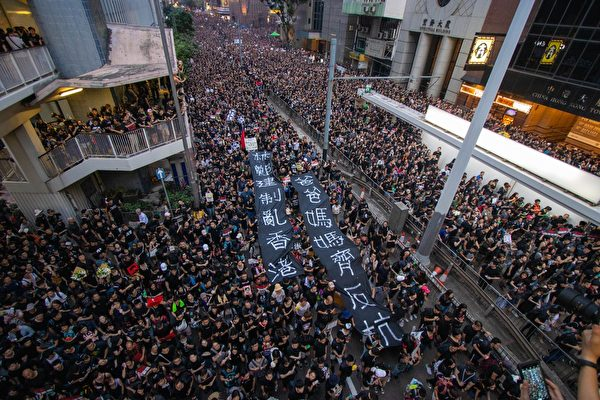

6月16日，近200万市民再次上街反恶法，要求特首林郑月娥下台，游行人数创香港史上最多纪录。（蔡雯文／大纪元）

【大纪元2019年06月17日讯】（大纪元记者苏静好综合报导）6月16日周日，香港爆发第二次反送中恶法大游行，据主办方估计，大约有近200万人走上街头，表示不接受香港特首的道歉，提出包括撤销恶法等五大诉求。

6月9日，大约有103万香港人参加大规模示威，抗议香港政府强行推进《逃犯条例》（又称引渡条例、送中条例），港民和世界各界认为，该法修订损害香港一国两制和香港法治及自治，引发各界对将中共异议人士、其他民主人士遣返大陆的担忧。

本周日，再有大批香港民众走上街头继续抗议恶法，一直持续到深夜，据抗议活动的组织者民间人权阵线（CHRF）估计，周日有近200万人在香港街头游行抗议。根据CHRF的说法，这个数字是史无前例的。

警方估计有338,000人抗议。上周日，警方也只估计24万人参加抗议。

周日，示威者认为行政长官林郑月娥没有“撤回”送中条例修订，也没有收回以“暴动”形容上周三（12日）的警民冲突，所以不接受她的道歉。

以下是关于《逃犯条例》和周日200万人大游行，需要了解的几件事。

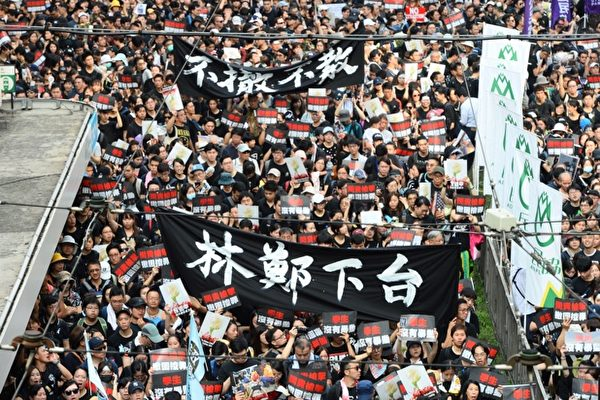

市民高举“林郑下台”“不撤不散”的横幅。（宋碧龙／大纪元）

<b>近200万人大游行 史无前例</b> 
周日近200万人参加的大规模游行是八天内第三次香港民众的示威活动，也是对林郑月娥回应的拒绝。林郑在周六（15日）无限期暂停了修例工作，但没有废除《逃犯条例》。抗议者要求废除该法案，高呼林郑下台。

在周日游行七个小时后，林郑月娥因处理不当而向香港人道歉。在一份声明中，她承诺以“诚意和谦卑接受批评”，并重申没有时间表来讨论有争议的法案重启。但她并没有说会撤回法案或下台。

林郑的道歉和声明并未平息香港人民的愤怒，参加抗议的民众共提五大诉求，要求特区政府：一、不检控示威者；二、取消定性暴动；三、追究开枪责任；四、撤回送中条例；五、林郑月娥下台！

到晚上10点35分，香港政府总部外的主要道路被数千名抗议者占领。

“抗议的规模令人惊叹。这是历史性的。”律师和一本异议书籍的作者安东尼‧达皮兰（Antony Dapiran）说，“这是香港人和平地集体走出来，以回应林郑昨天所说的话。他们（香港人）说：不。”

周日抗议活动范围很广，参加人群包括学生、推儿童推车的家庭，以及坐轮椅老人。他们在警方上周三对游行采取激进反应、部署橡皮子弹和催泪瓦斯清场后仍无所畏惧地走上街头。

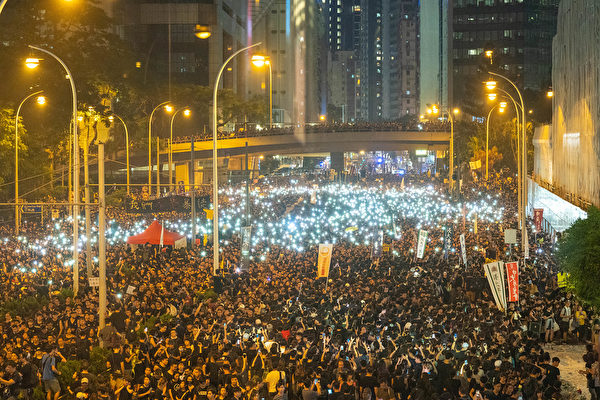

入夜后，市民以手机亮灯，犹如燃起点点烛光。（李逸／大纪元）

抗议者周日在街上高喊：“撤回（恶法）！”“（林郑）下台！”在他们游行时响了几个小时，在附近摩天大楼和住宅楼里可听到民众的怒吼。参加者穿着黑色衣服，堵塞主要街道超过一英里。

组织者说，周日的抗议者穿着黑色T恤，表达对警方周三镇压以及林郑反应的愤怒。许多人带着白花沿着游行路线悼念，因为那里曾有一名抗议者不慎坠楼身亡。

周日的游行路线比一周前的游行多，覆盖了两条主要道路。抗议人群如此之浩大，以至于游行者分成三部分。

<b>“香港还活着”</b> 
抗议人士高呼，“没有骚乱。只有暴政。”人们举着标语说：“学生没有暴力”，“不要杀我们”。

周日游行现场，“释放被捕学生”、“反送中”、“子弹射头”等标语随处可见，反映对于警方执法表现的舆论观感。这一切港人都认为林郑月娥应该负责，因为她在周六的记者会上说，警方执法是正确的。

CNBC报导，16岁的Nicholas Yan说：“我认为香港还活着”，他并补充说，因为香港人民仍然“有机会”将其从危险中拯救出来。

Kelly Wong认为香港完全处于中国（中共）的控制之下，她表示，自己对林郑很“生气”，因为林郑说更多倾听市民意见，但目的仍然是最终通过这项法案。

“所以我认为我们应该出来表达我们的声音。”在抗议活动前，Wong在纪念馆附近说道。

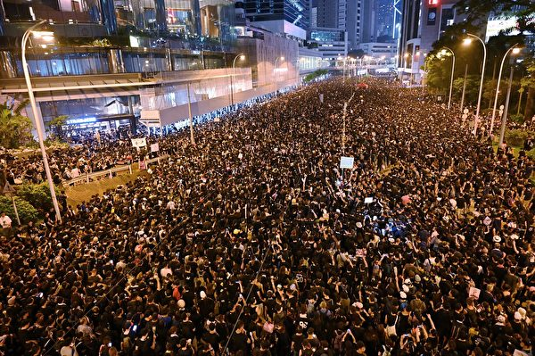

深夜，抗议人群不仅未散去，而且依然大声疾呼撤回恶法、要求香港特首林郑月娥下台。(HECTOR RETAMAL/AFP/Getty Images)

<b>为何《逃犯条例》修订会在全球范围引发争议</b> 
今年二月份，香港政府提出修改引渡法。该法案将允许身在香港的人有可能被引渡到和香港没有引渡条约的国家，包括中国大陆。

各界认为，该法修订将为中共异议人士和因政治宗教原因从中国逃亡的人，以及其他行使国际法允许权利的人，被送往中国大陆铺平道路。许多法律专家认为，鉴于共产党对法院的控制权，嫌疑人在大陆不会受到公平审判。

路透社报导，包括主要律师和权利团体在内的批评者都指出，中共司法制度是由共产党控制的，并说它的特点是酷刑和逼供，任意拘留，以及和律师接触不畅。

拟议的立法引起泛民主政党、商业团体、法律专家、宗教组织和普通公民的强烈反对。他们认为，该法修订将损害香港作为一个由独立司法系统保护金融中心的声誉，而这种法治是中国大陆所缺乏的。

包括美国在内的外国企业集团和西方政府强调，人们担心任何对香港法律制度的侵蚀，都可能使香港成为银行和公司经营不具吸引力的地方。

参加周日示威活动的Man-lok Ng表示，香港人民面临着中共法律制度的风险，因而存在危险。“因此，如果这项法案获得通过，我们任何人都可能面临风险。”他告诉CNBC。

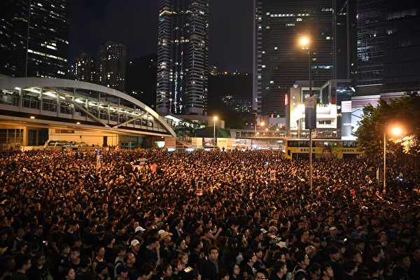

深夜，抗议人群不仅未散去，而且依然大声疾呼撤回恶法、要求香港特首林郑月娥下台。(ANTHONY WALLACE/AFP/Getty Images)

<b>香港抗议冲击中共中央政府</b> 
《华尔街日报》报导，香港持续抗议活动令特区政府治理陷入危机，并有可能蔓延到中共政府。对《逃犯条例》修订的恐惧和反抗已成为对香港身份和法律自治的大规模辩护，而这种自治为香港保留了中国大陆不可能获得的文化、自由和法制。

路透社也报导，抗议活动使香港陷入政治危机，向林郑政府和她在北京的官方支持者施加压力。香港史学者曾锐生表示，香港事件让习近平在G20可能和川普会面时面临尴尬局面。

上周，美国立法者提出立法，要求美国政府每年对中国的自治权进行认证，以便继续根据1992年“美国-香港政策法”对该市实施特殊待遇。

路透社报导，香港有影响力的投资者大卫‧韦伯（David Webb）在周日的时事通讯中表示，如果林郑是一只股票，他会建议卖空，目标价为零。

“她（林郑）不可避免地失去了公众的信任。”韦伯说，“她的监护人在北京。”

另一个表明北京可能出现态度转变的迹象是，2014年香港的民主“占中”活动的主要人士之一似乎将被释放。

黄之锋（Joshua Wong）所属的众志（Demosisto）运动（pro-democracy Demosisto movement）表示，他将在周一获释。

中共审查机构一直在努力消除或阻止最新一系列抗议活动的消息，中共害怕任何大型公众集会都可能激发大陆示威活动。

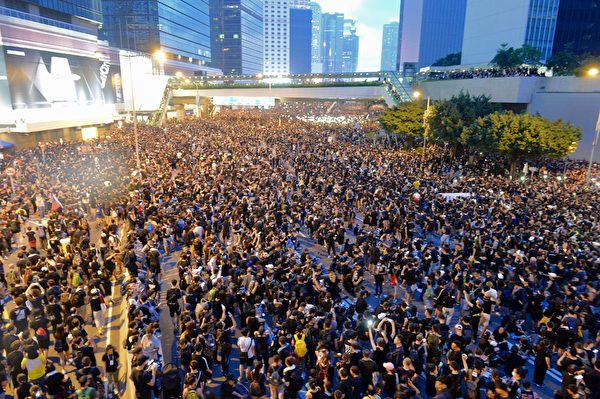

香港特首林郑月娥15日宣布暂缓修订《逃犯条例》后，民主派议员表明不接受，16日再发起游行，共200万人参与，人数空前。（宋碧龙／大纪元）

<b>未来会怎样？</b> 
批评人士说，计划中的引渡法可能会威胁到香港的法治及其作为亚洲金融中心的国际声誉。一些香港大亨已经开始将个人财富转移到海外。

民阵发表声明表示，示威活动将继续，直到港府撤回法案修订，以及满足民众诉求。

香港议会泛民议员毛孟静表示，港府不撤《逃犯条例》修法，他们就继续发动抗争，直到达到目的为止。

美国国务卿迈克‧蓬佩奥（Mike Pompeo）周日表示，美国川普总统本月将在日本举行的G20峰会上与习近平主席举行会谈，提出香港人权问题。

“我们正在关注香港人谈论他们重视的事情，我们将会看到林郑在未来几天和几周内的决定。”蓬佩奥说。

香港有影响力的投资者韦伯在其网站报导中表示，香港议会立法委员会目前四年任期将于2020年7月结束，任何未结法案都将到期。“任何一名行政长官如果试图从现在开始再次对引渡法案进行二读，这将是政治上的自杀，因此我们可以相信该法案将于2020年7月失效。”

上周，美国两党国会议员提出立法，要求美国政府每年对香港自治权进行认证，以便判定是否继续根据1992年“美国-香港政策法”对其实施特殊待遇。

许多人指责北京广泛干预香港，包括阻挠民主改革等。#

责任编辑：华子明

<a href=#list><h6 align="right">回目錄</h6></a>
 

<a name=w8><h2> 大陆汽车经销巨头“庞大集团”宣布破产</a>  </h2>
 

近日，大陆首家登陆 A 股的汽车经销商“庞大集团”正式提交了“破产重组”申请。图为庞大集团在2017大连国际汽车展上。（大纪元资料室）

【大纪元2019年06月14日讯】（大纪元记者周心鉴综合报导）在不断的传出关店、裁员、降薪的消息后，近日，大陆首家登陆 A 股的汽车经销商“庞大集团”正式提交了“破产重组”申请。

大陆汽车行业持续不景气，乘用车销售5月份下跌16.4%，创史上单月最大跌幅，这已经是连续第12个月下跌。与汽车企业相比，汽车经销商所受冲击更大。

<b>1700 万压倒庞大集团</b> 
“每日经济新闻”等媒体报导，5月13日庞大集团发布公告显示，北京冀东丰汽车销售服务有限公司（简称冀东丰公司）向河北省唐山市中级人民法院提出对庞大集团进行重整的申请。

据了解，2017年5月4日，庞大集团为补充流动资金用于进货，向冀东丰借款1,700万元（人民币，下同），借款期限为期一年。但借款期到后庞大集团因资金紧张，未能偿清债务。

1,700万元借款竟然压倒了大陆最大汽车经销商——中国500强企业“庞大集团”。

<b>首季亏损4.98 亿元</b> 
最新财报显示，庞大集团销量业绩加速下滑，2019 年第一季度亏损高达4.98亿元，同比下滑近25倍。

而在2018年，庞大集团的危机就已“引爆”，其全年营业收入420.34亿元，同比下降40.37%；全年公司亏损高达61.55亿元，同比2017年暴跌近30倍，堪称断崖式下跌。

其总资产也近乎拦腰，2018年末庞大集团的总资产同比减少48.26%至328.71亿元，公司总负债为263.90亿元，资产负债率为80.28%。

业务持续低迷，再加上权益变动披露不实、隐瞒关联交易、隐瞒公司涉嫌犯罪被司法调查，庞大股价一路暴跌，最高跌幅超八成。

<b>卖店求生</b> 
而为缓解资金压力，庞大集团先后在2018年5月和8月两次大规模出售旗下4S店：5家奔驰 4S店以12.53亿元出售给广汇集团，9家4S店以10.93亿元出售给大连中升。

与此同时，庞大旗下的多家4S店也频频被曝出现问题，部分出现员工欠薪的情况，还有直接关停的。截至2018年末，庞大集团全国经营网点806家，较2017年末减少229家。

另一方面，庞大集团还转让股份。2018年8月8日，庞大集团与天津五八汽车服务有限公司达成协议，以5.95亿元的价格转让公司5.5%的股份。

为了解决资金问题，庞大集团使用了各路招数，但等来的还是法院传票。仅2018年，庞大集团就收到青岛、上海、济南、合肥、唐山、天津、西安、北京、深圳等地法院送达的起诉状、应诉通知书、举证通知书等涉案资料，这些诉讼多为买卖、融资、借款合同纠纷，涉及金额达8亿元。

<b>“债转股”救命有戏吗?</b> 
近日，庞大集团及实控人、董事长庞庆华在接受媒体采访时称，公司已经于5月17日提交了破产重组的申请，目前正等待审批，具体方案是“债转股”。“这并不意味着不还银行的债，而是通过共同打造上市公司，将庞大的业绩搞上去，将利息变成利润。这样，企业的负债率就会大大降低，慢慢甩掉负担。”庞庆华说。

不过大陆数家汽车经销商投资人对此并不看好，据一位销售额在全国福特门店居前的销售人员向《华夏时报》介绍，2018年单是福特的汽车销量就急速下滑50%，2019年我们仍看不到行业的拐点。

同时，据中国汽车流通协会数据，2018年全国将近40%的经销商亏损，2019年新车销售毛利普遍为负，经销商亏损面进一步加大。

<b>5月乘用车销量创史上单月最大跌幅</b> 
6月11日中国乘用车市场讯息联席会（CPCA）发布的数据显示，中国5月广义乘用车销售量仅161万辆，与去年同期相比减少12.5%，为连续第12个月下降。

《证券日报》的消息显示，今年前5个月，汽车市场产销数据持续疲软，包括MPV、轿车、SUV等领域依然呈两位数跌幅，许多企业出现了销量和利润双降。

5月份，经销商的库存预警指数为54%，仍位于警戒线之上；全行业库存高达300多万辆，相当于2个月的销量，流通环节库存占压的资金额高达5,000亿元。

乘用车市场出现负增长反应车市销售格局正发生前所未有的深刻变化。业内人士纷纷调低预期，分析认为未来三年将会出现汽车经销商倒闭潮，乐观估计将减少6,000家以上！

庞大集团宣布申请破产重组，业内纷纷感叹汽车经销商真正的苦日子来了，大陆汽车经销商将迎三十年来最大倒闭潮，庞大集团破产仅仅只是开始，不是第一家更不会是最后一家。#

责任编辑：林诗远

<a href=#list><h6 align="right">回目錄</h6></a>
 

<a name=1-1><h2> 人权律师揭610操控司法 枉判法轮功学员</a>  </h2>
 

2019年4月20日在纽约法拉盛举行4‧25和平上访20周年纪念活动。图为李明律师于集会上发表演讲。（大纪元）

【大纪元2019年06月11日讯】（大纪元记者林澜、章洪报导）“对法轮功案不讲法律！”“我们做不了主儿，我们得听‘610’的。” “你跟我讲法律干什么，我跟你讲政治。”…… 办理法轮功案件的法官曾公开这么说。

1999年，“610”由中共前党魁江泽民下令成立，其唯一的职责就是在中国全面推动迫害法轮功。成立19年后的2018年3月，中央“610办公室”被撤，“610”并入中共政法委。不过2018年至今，中共对法轮功的迫害依然持续，并未减弱。

时政评论员横河表示：“作为过去20年中共迫害法轮功的核心机构和代表符号，‘610’组织的名称从公众面前消失，本身就说明这场迫害难以为继，并且彻底失败了。另一方面，尽管对外撤销了，但是‘610’的功能甚至编制，都可能还单独存在于政法委里面。”

<b>政法委对法轮功案的操控</b> 
维权律师李明于去年逃离中国。他在6月10日接受采访时提到“610”和政法委体系对法轮功案的操控。

李明说：“在每一个法轮功学员被构陷绑架之后，政法委和‘610’办公室，他们会针对每一个个案，召开一个所谓的协调会议和联席会议。你比如说我曾经参与的案子，就是（610办）把公、检、法、司法局，律师管理科的科长、审判长、公诉科长，召集到一块。针对每一个个案，他们确定一个审判的方略，确定一个大体的刑期。针对这个案子，这就是不能更改的一道命令，任何人不能逾越。这就是典型的未审先判。明明都是些冤假错案，但是他们就是强行进行有罪判决。”

李明透露，“610”还会派人旁听、监控整个庭审过程。法官和检察官出于恐惧，只能按照中共的意志办案。

他举例说，比如非法开庭时，“‘610’和政法委体系布置公检法的负责人员去旁听，去监督法院和检察机关的程序和实际问题处理，在现场进行监听和监控，对工作人员形成巨大的声势压力和心理压力。即使这些人认为法轮功学员坚持自己的信仰是无罪的，但他们在那种高压的工作环境下、被监督的环境下，也不敢自由表达的。”
但仍有一些律师不向中共屈服，依法为法轮功学员做无罪辩护，610就展开非法打压，断绝敢言律师的生路。

李明表示：“我是因为为法轮功学员无罪辩护，就受到610系统、国保国安系统的迫害和打压。当时他们（找我）谈的内容就是说，你不能在上海执业，你也不能在上海找另外的律师事务所。不允许你过（律师）年检。另外，你上监控黑名单，24小时监控监听，对你的手机24小时GPS定位系统和行动路线进行监控。被逼无奈，我们离开上海，到其他省份找工作期间，这种恶魔般的威胁，如影随形。”

20年来，上千例走入司法程序的法轮功信仰案件，都是被枉法诬判的冤案。

<b>政法委操控下的诬判</b> 
横河说：“如果法治的话，谁违了法，就由法律来处理，为什么要成立一个‘610’这样中共中央的组织？”

2018年以来，“610”在政法委内部，继续在幕后操纵对法轮功学员的诬判。

例如，2018年6月，四川法轮功学员莫善益被判三年半之案。莫善益当庭指控公诉人，庭上出示的证据80%是假的，法庭包庇公安侦查人员作伪证。公诉人为了摆脱干系，当庭说出实情，庭审结果是经“610”认定的。

据明慧网2019年3月14日报导，在四川省政法委直接指令下，巴中市巴州区法院近日对九位法轮功学员进行诬判，包括2位八旬老人、4位七旬老人。

2018年11月，法庭在非法庭审后，因迟迟没有宣判，四川省政法委来人指责审判法官妥协，要包括公检法等机关磋商怎么处理。最后四川省政法委的人发话称，这些人至少判三年以上。

之前，对该案，区检察院一再退侦补充侦查，家属一再要求无罪释放，但是办案检察官说：“我们说了不算。”

这些老人被判刑的所谓罪状，包括2015年他们依照中国宪法赋予公民的合法权利控告江泽民。

从2015年5月开始至今，20多万中国民众向中共最高法院和检察院递诉状控告江泽民，在他们的诉状中都提到江泽民的反人类罪及“610”的罪恶。

<b>“610”机构调整 迫害法轮功的职能继续存在</b> 
“610”在成立的第十九个年头，在习近平的国家主席第二任期起开始推行的中共“机构改革”中被裁并。

横河表示：“根据2018年中共机构改革的方案，中共‘610’和它的上级领导小组，是把它的职责划归中共中央政法委和公安部的。

现在知道的是2018年底，省一级的机构调整已经完成了。就是省的“610办公室”，整体划到省委政法委里面。这说明，尽管对外是撤销了，但是“610”的功能甚至编制，都可能还单独存在在省委政法委里面。

也就是说，它的迫害法轮功的职能还继续存在，尽管名字可能也许不存在了。这个也和中共现在对法轮功的迫害的严重程度并没有减弱相符。

据在明慧网上曝光的部分案例，仅在2019年4月25日前后，中共至少绑架688名法轮功学员，骚扰434人，4人失联。312人被非法抄家，强制关押在洗脑班55人，非法批捕31人，非法判刑38人，非法庭审73人。

中共在2018年底展开覆盖中国大陆的“扫黑除恶”行动。2018年11月底，海外曝光一份中共“610办公室”下发的机密文件，下达给辽宁各地的“610办公室”、法院、检察院、公安局、司法局，目标任务就是“严厉打击打压法轮功”。文件提到“敲门行动”，要求法院、检察院提前介入协助定罪、批捕、起诉、审判，打击维权律师等很多具体的措施。

<b>“中共迫害法轮功是场政治迫害运动”</b> 
“你跟我讲法律干什么，我跟你讲政治。” 苏州市中级法院庭长顾迎庆曾对给几位法轮功学员做无罪辩护的律师这样说。

作为中共体制内的官员，顾迎庆也直白地表明中共对法轮功迫害的实质，是政治需要。

横河表示：“中共迫害法轮功没有任何法律依据，就是一场政治迫害运动。”

横河分析说：“既然是政治运动，那么它就需要成立一个特定的机构，来指挥和执行这个政治运动，这就是610办公室。它的职能就是专门为迫害法轮功的，当然后来也扩展到了对其他宗教信仰。”

横河表示：“说它是非法组织，是因为它成立没有经过任何立法和行政当局的授权。虽然它归属于中共系统，但是成立的时候，甚至都没有经过中共这个系统的授权程序。”

“‘610’是1999年6月7日在政治局会议上，由时任党魁江泽民‘宣布’的，而不是由政治局会议讨论决定成立的。没有注册、没有被授权的机构，即使按照中共自己的宪法和法律，也是非法的。”

<b>“610”的政治迫害手段</b> 
“610”机构从被“宣布”开始，从成立、组织结构、隶属关系、运作和经费的各个方面都打破了中共政府的现有构架，任意使用人、财、物等各种资源，使用政治、经济、舆论的各种手段、国家级地迫害法轮功，包括：利用舆论、文化、教育散布谎言制造仇恨；推动文革式群众运动与邪恶的“株连”、“连坐”；执行经济掠夺灭绝政策；在全中国大陆推广酷刑杀人等。

在江泽民“不查尸源，直接火化”，“对法轮功不讲法律”等指示下，“610办公室”在执行领导小组的决策时大多不受中国司法和法律的最基本约束，超越司法权限任意虐杀法轮功学员，导致中共司法彻底溃败，公检法司草菅人命，甚至活摘器官牟取暴利。

由“610”全权管辖操控的超越国家法律程序之外的对法轮功学员的“洗脑班”（所谓的“法制教育学习班”），从中央到地方，全国上下各行各业无所不有。绑架谁、关多久、怎么摧残、用什么酷刑虐杀，完全不受法律约束。

“610”利用舆论、文化、教育散布谎言制造仇恨。在全国“610”机构的操控下，中国2,000多种报纸、9,000多种期刊杂志、1,960余家广播电台、电视台、广播电视台跟进铺天盖地地宣传这些污蔑谎言。这些仇恨宣传也被中共在互联网广泛转载。

江泽民指令“610”系统操作全国，下大力气组织全国媒体和文化界、科技界、教育界、宗教界搞反法轮功的所谓战略研究，甚至编写毒害中小学生的教材。

“610”办公室还规定了“株连家庭、单位基层连坐、社会联保制”等，把迫害法轮功“业绩”与法轮功学员所在地区、单位、街道官员、同事的升迁、奖、惩等个人利益挂钩。

“610”、政法委操控全国劳教所、监狱、司法界、医学界、贸易界、黑社会、军队联手，形成境内外活摘法轮功学员器官——“活体人”出口的杀人网。#

责任编辑：高静

<a href=#list><h6 align="right">回目錄</h6></a>
 

<a name=w5-1><h2> 独家调查：劳教所秘拍视频揭中共奴工黑幕</a>  </h2>
 

 

2008年奥运会期间，法轮功学员在马三家劳教所加工二极管。（于溟提供的视频截图）

 
【大纪元2019年06月10日讯】（大纪元记者Jennifer Zeng报导/张北编译）一声不吭，囚犯们在工作台上紧张地埋头苦干。他们从左手边成堆的二极管（一种电子元件）中取出一个，放到面前的橡胶垫上，把它搓直，堆放到右边，然后再从左边拿一个二极管，快速地重复着之前的动作——这是在中国臭名昭著的马三家劳教所里偷拍到的视频画面。

这些囚犯被迫一天工作15小时，没有报酬，或只得到一点微不足道的补贴。他们的食物也少得可怜，只够勉强维生。这个隐秘视频显示，一大碗清汤里漂着几根孤零零的白菜叶子，囚犯们把这汤叫“白菜游泳”。

由于长时间高强度的工作，有些人精疲力尽，在工作的桌子底下睡过去。如果有人抗议劳教所这种虐待行为，就会换来一顿毒打。一个视频记录了一名男子被打致瘫，躺着仍被脚镣拴在床上。

这些令人震惊的视频画面是一位当时被关押在马三家劳教所的法轮功学员于溟在今年年初被迫逃离中国、来到美国后，提供给大纪元的。

他曾经是一位成功的商人，因为信仰法轮功（也称法轮大法）被关押在马三家劳教所。于溟成功地偷拍了视频，并在2008年北京奥运会期间顺利将视频送出劳教所。然而，他自己却没能像计划得那样顺利走脱。被劳教所发现试图“越狱”后，他几乎被酷刑折磨致死。

转眼十多年过去了，可是于溟所提供的视频内容在当今中国仍然普遍存在：逼迫被关押者加工二极管，然后组装在各种产品里销往全世界。中共仍在经营这项残酷而暴利的生意。

<b>长达20年的迫害</b> 
和于溟一样，视频里许多被强制做奴工产品的人，都因为信仰法轮功而被非法劳教。

法轮功有五套舒缓祥和的功法，并以“真、善、忍”指导人修炼，了悟人生的真正意义，返本归真。1999年，因为惧怕法轮功学员的人数多于当时的中共党员人数，当时的党魁江泽民一意孤行，发动了镇压运动。据估计，二十年来有几十万到上百万法轮功学员被中共关押。

<b>台资公司勾结马三家 奴役法轮功学员</b> 
于溟说，所有被关押在马三家劳教所的人都知道，他们是为台湾唯圣电子有限公司（GW Semiconductor）加工二极管。唯圣在沈阳的分公司——沈阳固得沃克电子有限公司距离马三家约40分钟车程。固得沃克的员工经常去劳教所教他们如何加工，如何处理废料等等，还经常送去原材料，并取走加工好的成品。

于溟还提供了一张在马三家拍摄到的标题为“GW生产流程卡”的表格。表格上盖有“马三家一大队”的章，还写有“一分队”字样。这表示，这批产品是马三家劳教所第一大队第一分队加工完成的。

早在2007年12月29日年，法轮大法明慧网就报导了名为“曝光‘沈阳固得沃克’电子有限公司”的消息。消息指该公司将MP二极管大批量送到辽宁省马三家女子劳教所和大北监狱加工生产，组装后投放到国际市场，违反了《国际贸易法》和《劳教法》，并呼吁国际社会关注。

2008年1月11日，明慧网再次收到投稿，曝光固得沃克电子有限公司将大量GW二极管送到马三家第一劳动教养管理所和沈阳第二监狱进行加工，违反了《国际贸易法》和《不正当竞争法》。

同年1月24日，另一篇来稿，说沈阳固得沃克电子有限公司勾结中共劳教所和监狱，奴役被关押者。该公司将GW二极管送到辽宁马三家教养院第一劳动教养所和沈阳第二监狱进行加工。

 

<b>劳工产品销往美国市场</b> 
在台湾唯圣电子有限公司官方网站“公司简介”一栏里，沈阳固得沃克电子有限公司被标为该企业的“工厂”，公司资本七百万美元，每月产能为三亿两千万支二极管。

在SP国际（SP International）网站，点进“产品”—“制造商”，有一个专门页面介绍唯圣电子有限公司：“唯圣电子有限公司成立于1989年7月，专门从事整流二极管制造和出口。公司在中国沈阳设有324,600平方英尺的厂区，每月产量3.6亿个，是整流二极管的领先制造商之一。”

固得沃克中文网站在介绍企业时写道：“产品主要销往欧洲、日本、美国、韩国、东南亚、香港、台湾等国家和地区，是Panasonic, Matsushita, Sanyo, Hitachi, Kaga, Diamond, Nidec, Pantene, Compel, Dongyang, MicroStar, Jean, Three Sona, Linear, Nokia等跨国公司二极管供应厂家。”

一名SP国际客服人员确认，唯圣电子有限公司的产品已销往美国多年，并且根据顾客需求运往美国各地。

目前，大纪元无法联系到台湾唯圣公司就此事做出回应。

<b>法轮功学员沦为奴工 现象汎滥</b> 
在明慧网上搜索“二极管”，会出来84篇相关文章。据统计，至少有13个劳教所、拘留所和监狱迫使被关押者加工二极管。

最早的报导刊登于2001年9月1日，消息指“严管班现非法关押13人，白天室内由队长、四防人员看管。早6点至晚8点干活（搓二极管），每日有工作计划，平均每天130公斤。”

最新相关报导刊登于2016年5月11日，报导说法轮功学员被关押在辽宁省本溪市威宁营劳教所，警察强迫他们做对人体有害的“工作”，比如做人造花，加工二极管等。

<b>‘搓二极管比赛’</b> 
2014年10月22日，明慧网刊登了一篇文章，文中旅居德国的法轮功学员，电气工程师郭居峰回忆了自己在中国被迫害的经历。“我曾经在中国被关押在三个劳教所，被绑架四次，一共454天。我曾经被二十几种酷刑迫害过……被迫去加工二极管……每天要工作16个小时以上。”

在2015年9月18日刊登的另一篇文章里，郭居峰回忆道：“每天要重复上万遍一样的动作就是，左手从箱子里抓一把二极管洒在桌子的胶皮上，右手拿着一个硬胶皮在桌子上搓，直到把弯曲的二极管搓直，放到身体右面的箱子里。除了准时吃饭和六小时的睡眠是为了我们可以继续工作外，我们都在工作，我们一分钱都得不到。如果不能及时完成任务或者拒绝劳动，牢头就会责骂，警察就会对我们酷刑折磨，那种酷刑折磨是歇斯底里的。”

一篇2014年5月3日的报导题为“江苏常州看守所的‘搓二极管比赛’”。文章写道：“所有监室早上六点十分起床，整理好被褥后，一天的奴工就开始了，要连续搓九到十一小时的二极体，除了早饭、午饭各占了五分钟，其它时间都是在搓二极体，上厕所、喝水的时间都没有。”

“常州看守所常年和佳讯、星海电子有限公司签订合同，加工各种规格的二极体，要把每根二极体搓直、搓平。要是品质搓的不好，退货了，民警就会对被关押人员进行严管。严管的日子真是度日如年，早上七点吃过早饭后，双腿盘着坐在铺板上，一直坐到晚上九点半，看守所称这种坐姿叫“耗乌龟”，在板上坐了几个小时，腿就不会走路了，有时我们会被“耗乌龟”一个星期、甚至一个月，也不让我们洗漱，真是被折磨得生不如死。”

“每天每个人大约要搓十公斤二极体，许多人搓得手指出血、手关节肿胀、指甲脱落、脱皮，但是还要不断的搓，手不能停下来，要不然就完成不了这天的奴工劳动。”

“看守所采取非常邪恶的手段：每天要进行搓二极体比赛，最后两名的人就要罚值两个班，晚上只能睡三、四个小时，其它时间就是站着值班。所以白天拚命的搓，为的是晚上不要值班，每个在押人员耗尽自己所有的体能为看守所搓二极体。可是再怎么努力，总有最后两名。”

<b>人工成本几乎为零</b> 
根据明慧网一篇奴工劳动调查报告，很多劳教所和监狱不付奴工任何工资。马三家劳教所给在押人员每月10元人民币，相当于每天0.0048美元酬劳。

唯圣电子有限公司零件编号“SR560”的二极管，在SP国际上报价123.64美元/千个，也就是每个0.12364美元。如果每天每个在押人员加工10公斤（22磅）二极管，每1200个二极管重1.3磅，那麽按照SP国际的报价，每人每天所加工产品的价值高达2510美元。也就是说，通过奴役劳教所和监狱的在押人员，价值2510美元的二极管只需要花费0.0048美元的人工成本，或者不需要任何人工成本。

根据美国国际贸易委员会提供的数据，2010年到2018年期间，美国每年从台湾进口的二极管价值从3.344亿（2017年）到9.9234亿美元（2014年）不等。

<b>美中贸易谈判中的奴工问题</b> 
自从美中开打贸易战以来，有人呼吁将人权和贸易重新关联起来。但到目前为止，美方尚未采取行动。分析认为，仅仅是偷窃知识产权、强制性技术转让、政府补贴这些问题，已经够具挑战性了，更不用说人权问题了。

传统基金会亚洲研究中心的政策分析师奥利维亚·伊诺斯（Olivia Enos）告诉大纪元，实际上，美国可以用几种现有的机制来解决中国的奴工问题。

“第一，（美方）可以考虑启动全球马格尼茨基人权问责法，”伊诺斯说，“海关、边境巡逻队、商务部可以协助财政部调查进入美国的货物中是否有奴工产品。但除此之外，他们可以利用第二个机制——美国敌对国家制裁法案——来阻止这些货物的进入。”

伊诺斯说，这项法案非常重要，因为它可以禁止从使用奴工的公司，甚至国家进口物品。她说美国还可以使用外交渠道阻止其它国家与使用奴工的国家合作。

https://www.epochtimes.com/gb/19/6/9/n11310954.htm

责任编辑：张洁

<a href=#list><h6 align="right">回目錄</h6></a>
 

<a name=w5-2><h2> 冒死拍摄中共迫害罪行 于溟：挽救更多生命</a>  </h2>
 

法轮功学员于溟冒死拍摄中共监狱内迫害法轮功学员的罪行。他到福克斯洛杉矶11台接受采访期间表示，希望借此帮助制止中共对法轮功长达20年的迫害。（姜琳达／大纪元）

【大纪元2019年05月24日讯】（大纪元记者姜琳达洛杉矶报导）5月20日，福克斯洛杉矶11台播出了法轮功学员受中共迫害的深度报导，引发美国社会的广泛关注。而影片中首次曝光的中国监狱劳教所内一些怵目惊心的画面，正是法轮功学员于溟冒死秘密拍摄的。他在接受采访时表示：“迫害已经进行了20年，要把这件事情原原本本地揭露出来了。”

来自大陆辽宁沈阳的于溟，曾是一名成功的商人，但自从1999年中共开始迫害法轮功后，他被关押在监狱、劳教所近12年，遭受了非人的折磨。直到抵达美国重获自由后，才得以将中共迫害法轮功学员狱内的独家影片，在国际社会发布。

2月28日，于溟到洛杉矶接受福克斯洛杉矶11台采访时，曾对大纪元记者说：“世界上，由于中共一直是很狡猾的隐瞒，包括向世界说一些谎言，很多人也不相信，是真的会发生这么严酷、严重的迫害吗？所以我们有责任、有义务和使命，把这些东西都说出来，告诉世人，立即停止这场迫害，会挽救很多人的生命。”

而美国主流媒体能够在这个时机为法轮功报导发声，让他感到十分难得。“包括川普总统，他们现在对共产主义的一些认识，包括国会里边的议员，很多议员，他们已经对社会主义、共产主义有个非常清晰的认识，这也是一个非常好的起点。”他希望借此帮助制止中共对法轮功长达20年的迫害。

而在被非法关押期间，于溟亲身经历过种种酷刑折磨。他说：“包括不让睡觉、长期不让睡觉；包括在椅子上一坐好几个月，在椅子上光坐就坐了3个月；包括吊在门上，吊了1个月吧！那个也是非常痛苦的；包括电棍电刑的电击，可能都是普通人难以承受的；包括我身边的一些人，被迫害死了。”

“比如说，我在本溪监狱，有个叫胡国舰的，脑袋被打成脑瘀血，头盖骨被摘除，植物人状态做完手术，然后又在监狱待了2年，2年之后又在监狱去世了，像这种情况。包括我在北京团河劳教所的时候，也是一个法轮功学员，（中共）为了转化他，要他放弃信仰，最后把他腰脊及椎骨打折，那都很残忍的。就是这些都历历在目，一想起来，触目惊心。”

当被问到在12年的冤狱中，是否有一丝想要放弃？于溟坚定地说“不”，他说，“有些时候可能妥协了就会好过一点，但一想到很多人为此付出生命，多少人流离失所，多少人家败业衰，从心底升起的使命和责任感……我必须要为他们发声。”

因此他说自己也从未后悔冒着生命危险，秘密拍摄中共的罪行。他说：“这些年承受的太多了，包括在监狱、劳教所，生生死死地走过了多少次了，在我身边发生的这些迫害，我身边认识的人，可能到目前有十多人失去生命了。所以说我今天不是一个人来，我背后站着很多离去的这些生命的灵魂在帮助我，我真的有义务、责任和使命，把真相向世人讲述出来。”◇#

责任编辑：方平

<a href=#list><h6 align="right">回目錄</h6></a>
 

<a name=a7><h2> 促撤送中条例 103万港人大游行创历史</a>  </h2>
 

中共末日疯狂激起空前民愤 游行人数超03年反23条

 

6月9日反对政府修订引渡条的反恶法大游行，民阵指有历史性的103万港人上街，对中共侵蚀香港发出怒哮。（蔡雯文／大纪元）

 
 【大纪元2019年06月10日讯】（大纪元香港记者林怡报导）中共及港府无视本港民意及国际强烈关注，一意孤行将《逃犯条例》修订草案直上本周三（6月12日）立法会大会审议，激起香港全城群情汹涌，6月9日全城上街反恶法。

 
 从维园到立法会，从日走到夜，身穿白衣为主的游行人潮逼爆港岛区8小时，再一次以脚步与汗水表达反恶法、反抗中共侵蚀的强烈民意。主办游行的香港民间人权阵线晚上宣布，昨日有103万人上街，是2003年7.1反廿三条游行的两倍，港人再次创造历史。

昨日（9日），炎热的天气下，港人不分界别、年龄、职业，携老扶幼，为反恶法走上街头，挤爆港岛区主要街道。

这是民阵在两个半月内第三次发起反恶法游行，连日来民间不同界别遍地开花地发起联署和动员游行，也有不少商家预告周日停业上街。游行原定下午3时由铜锣湾维园草坪出发，游行到金钟立法会。但下午一时多，维园草坪已挤满身穿白衣的市民，民阵召集人岑子杰宣读大会宣言后，游行提早40分钟在2时20分起步。

 

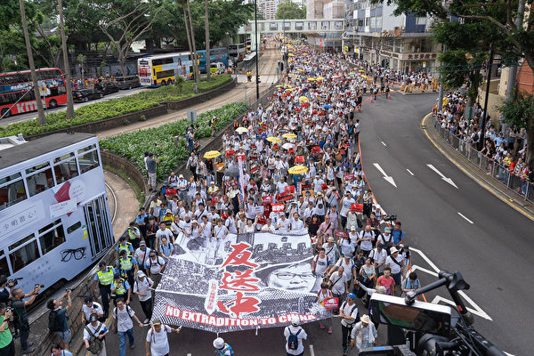

下午从铜锣湾高空所见，游行人士逼满轩尼斯道全部行车线。（李逸／大纪元）

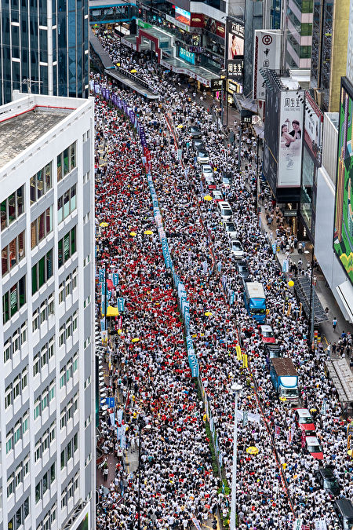

由于参与人数太多，游行提早40分钟从维园起步。（李逸／大纪元）

民主派元老李柱铭、前法律界立法会议员吴霭仪、多位现任立法会议员及歌手何韵诗等人手持巨型“反送中”横额领头，沿途高喊“反送中、撤恶法、林郑（月娥）下台”等口号。沿途也不断的有市民加入，游行人士鼓掌欢迎。

<b>市民涌上街 港铁多站瘫痪</b> 

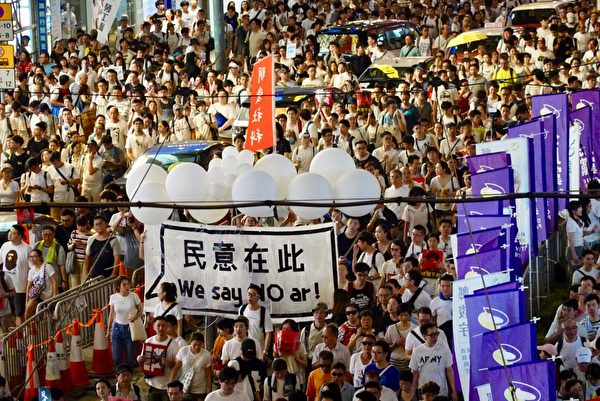

特色道具表诉求。（余钢／大纪元）

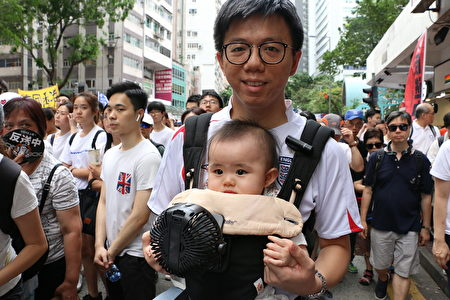

市民带BB上街。（宋碧龙／大纪元）

由于铜锣湾崇光百货附近，警方执意不开放另一边的行车线，并以铁马封锁崇光对出过路处，导致大批在附近等候加入的市民挤满附近行人道及小巷，致使游行队伍停滞不前。游行人士不停高喊“开路”，并跟警方发生零星冲突。中央图书馆对出也有游行人士要求开放电车路，警方一度举起红旗。鹅颈桥位置多次发生冲突，警方举红旗警告，吁市民保持冷静，勿试图冲击警防线。

由于参加的市民非常多，游行沿线多个港铁站接近瘫痪，天后站闸机一度停用以作分流，列车一度“飞站”；很多游行人士要在炮台山或湾仔站下车，步行前往维园。连九龙区的旺角、尖沙咀站都因人太多而要不定时封站。尖沙咀天星码头和红磡过海巴士站，都排起长长的白衣人龙，等待乘车船到港岛游行。

<b>历时8小时 逼爆港岛</b> 
游行龙头在下午约4时抵达立法会外，近五时已挤满添美道回旋处；同一时间，仍有大批市民刚从天后、铜锣湾和炮台山出站参加游行，看不到龙尾。游行人士在湾仔已经冲破警方防线，轩尼诗道六条行车线及电车路皆挤满示威者。

龙头从下午2时许起步，龙尾直到晚上10时许才抵达终点立法会。从铜锣湾到金钟，连绵数公里的人潮连续8小时从未间断。

民阵晚上9时许公布游行人数高达103万人，打破2003年的七一50万人游行的人数，港人再缔造历史。

民阵召集人岑子杰呼吁议员在立法会二读条例草案时投反对票，又促请行政长官林郑月娥尽快回应，悬崖勒马：“希望林郑月娥尽快回应我们香港市民的诉求，亦希望建制派议员，你是民选出来的，亦希望你们回应民意，因为我们103万市民而悬崖勒马”。他表示，会视乎政府对游行的回应，再考虑下一波行动。

<b>前高官名人促撤恶法</b> 

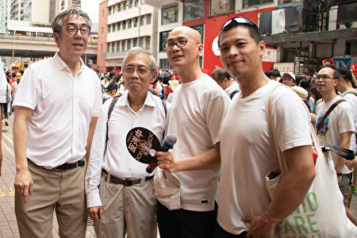

多位名人参加游行，左起为才子陶杰、前高官王永平、次文化堂社长彭志铭和浸大新闻系高级讲师吕秉权。（蔡雯文／大纪元）

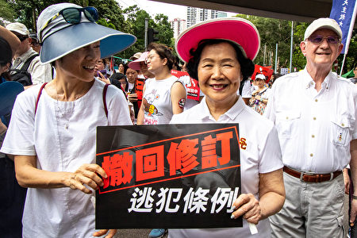

前政务司司长陈方安生上街游行。（蔡雯文／大纪元）

多位前高官、政要、名人上街促彻修例，包括前政务司司长陈方安生、前公务员事务局局长王永平、前投资推广署署长卢维思等人。

与市民同行的陈方安生表示，港人烈日当空也上街，是因为无法袖手旁观，“我相信有很多市民从来都没上过街，今次为何要上街呢？就是我们不能够袖手旁观，看到我们这个家被这样的恶法摧残，所以特别是年青人觉得我今日也要挺身而出，向特区政府说不，向这个‘送中’条例说不。”

她重申，《逃犯条例》修订一旦通过，是会践踏我们基本的人权自由，并摧毁香港作为国际金融中心的地位，希望行政长官林郑月娥不要一意孤行，应以谦卑态度聆听市民意见，重新启动咨询。

王永平表示，今次这么多市民上街，显示港人要求撤回修订的强烈民意，“今次的规模，全港人不分阶级不分贫富，甚至不分政治立场，比03年更紧要。也反映出绝大多数的市民都反对这个条例。”

<b>青年学子首次上街抗恶法</b> 
今次恶法促使一群年轻人首次加入游行队伍。中六生梁同学与同班同学第一次上街，他说：“因为我觉得这个是我们香港人的责任，这条引渡条例实在不合理，不利于我们下一代或香港发展。况且它对台湾的案件也没有什么帮助。”吴同学也表示恶法影响深远，“影响整个香港，并不只关系某部分人、某部分阶层，其实是每一个人甚至下一代也会受这条条例影响。”

也有不少父母带子女游行，有父亲表示，全香港人都不信共产党，“如果香港自由社会再被共产党剥削，小朋友还剩下什么？

也有母亲带未足半岁女儿上街，盼守护她自幼成长的空间，“我希望宝宝成长的地方是一个有自由和有民主的地方。香港是我们的家。”

<b>各界上街抗中共侵蚀</b> 

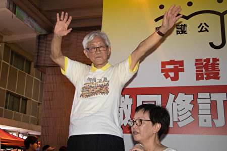

陈日君枢机沿途打气。（蔡雯文／大纪元）

多个宗教团体在游行前于中央图书馆外举行“守护我城祈祷会”，天主教教区荣休主教陈日君枢机在祈祷会主持祝福、祷告，冀游行一切顺利。

香港圣公会的教友也怀着追求公义的心参与游行，林先生认为，中共在国内打压基督教等信仰，《逃犯条例》修订和“23条”很有关系，势将冲击宗教自由：“明知道这个是一个恶法，我们有责任走出来。

传媒界也大量动员，香港记者协会、独立评论员协会也动员了会员上街。香港资深传媒人、时事评论员程翔直言，中共强推恶法是为了其党的执政安全，而非真正的国家安全，“所以我们看到的其实是中共想收窄香港的自由。”

政府发言人深夜发表回应称，参加游行人数虽然很多，《条例草案》将如期于周三在立法会恢复二读辩论。

<b>全球29城市声援 国际传媒聚焦香港</b> 
另外，国际社会也非常关注香港反送中游行。全球29个城市纷纷发起集会游行，声援港人反恶法。全球媒体包括美国《华尔街日报》、英国《卫报》、法国《世界报》、日本NHK以至半岛电视台等都报导了港人涌上街头反恶法的消息。

台湾陆委会表示，由衷敬佩大批香港民众参加游行，要求港府撤回《逃犯条例》修订草案，又呼吁台湾民众，以香港为鉴，高度警惕中共政权的欺诈本质，明辨“一国两制台湾方案”的骗术。总统蔡英文也在社交网站回应游行，指一国两制令香港骄傲的法制逐步崩毁，应让台湾人“深深警醒、深深关切”。◇

责任编辑：杨亦慧

<a href=#list><h6 align="right">回目錄</h6></a>
 

<a name=w6><h2> 美中谈判纳入人权议题 江家资产面临清算</a>  </h2>
 
 

【新唐人北京时间2019年06月09日讯】在六四大屠杀30周年前一天，美驻华大使馆官方微博发布了对《全球马格尼茨基人权问责法》的介绍，此举被认为是美国政府借六四事件对中共迫害人权发声。美国国会众议院议长佩洛西也透露，川普已经把人权议题纳入美中贸易谈判。

6月3号，美驻华大使馆官方微博发布《全球马格尼茨基人权问责法》的介绍。这是针对严重侵害人权，或有贪腐行为的外国官员，美国国会授权总统及行政部门对这些官员实施制裁，比如限制他们的签证以及冻结在美资产等。

例如，前北京公安局朝阳分局局长高岩任职期间，人权活动人士曹顺利被拘禁在北京市公安局朝阳分局。2014年3月，曹顺利陷入昏迷，死于器官衰竭。高岩因此在2017年12月被川普政府列入制裁名单。

刘青：“这个既可以在经济上头对他们实行制裁，实际上这些贪腐官员，也对他们的精神造成非常大的压力。一旦他们逃往自由世界，民主社会的这种通道也存在危险，那么他们内心的恐惧和压力就是非常大。”

美国国会众议院议长佩洛西（Nancy Pelosi）6月4号接受采访时表示，她此前向川普（特朗普）总统提出，将人权和民主议题纳入美中贸易谈判，而川普回答说，已经在这样做了。

美国国务院日前也表态，希望更加严格地审核签证申请、对人权及宗教迫害者拒发签证。美国法轮功学员还被告知，可以向美国政府提交迫害者名单。

种种迹象显示，川普政府对中共的打击，已经进入人权领域。

6月5号，“追查迫害法轮功国际组织”发布公告，全面收集中共迫害法轮功的犯罪者名单。

公告呼吁，全世界所有正义人士举报、收集海内外参与迫害法轮功的凶手，特别是政法委“610”系统名单和犯罪证据，并举报这些人出国访问的信息和他们在海外的亲属，以及财产逃匿和隐藏的情况，以用于将来进行经济制裁、包括资金冻结等全面清算的措施。

六四学生领袖周锋锁：“现在最重要的， 对于中国来讲，就需要多放一些名字上去（制裁名单），这个共产党红色家族都放上去。这个影响对中共来讲，有可能是致命的。因为它不是一个一般的政权，它的利益、结构是很重要的。这些当权者都是非法的富贵。如果把这方面给它堵住，对于触动这个体系崩溃会很有意义 。”

6月6号，《大纪元》网站也刊发特稿，题为《欢迎举报江泽民等人权恶棍的美国资产》。

文章说，“江泽民于1999年7月发动了残酷的迫害法轮功运动，以升官发财为诱饵，收买和胁迫大批官员参与迫害。这些贪官构成了‘血债帮’利益集团。”

“曝光以江泽民为首的中共迫害人权高官及其家族的美国资产，将有助于美国政府排查人权迫害者。”

早在今年4月，在美国的大陆富豪郭文贵就爆料，江泽民的长孙江志成至少拥有5000亿美元资产；江泽民家族在海外控制的财富至少1万亿美元。

而江绵恒利用父亲江泽民的势力，掌控中共政、商、军界，成为名副其实“官商一体”的最高代表，建立了令人咋舌的贪腐王国，被称为“中国第一贪”。

旅美时事评论员蓝述表示，美国政府对中共官员将赃款转移到海外洗钱的调查，江泽民家族应该首当其冲。

旅美时事评论员蓝述：“他们的钱到了海外，用不正当的渠道去投资，很多东西也都是不合法的，只要一查，就很容易把这个问题查清楚，他就成为美国联邦调查局的目标。抓中共在海外的贪官，总得从大头开始，江泽民家族肯定就是最大了，所以江泽民家族就首当其冲。”

有专家表示，相信会有更多国家在中共迫害人权问题上，追随美国的脚步。那些迫害人权和信仰，窃取国家财富的人，将会无路可逃。

撰稿：嫣华

剪辑：吴慧真

 
 
 

<a href=#list><h6 align="right">回目錄</h6></a>
 

<a name=w5><h2> 美国严审签证 魏京生：亲共者需要考虑了</a>  </h2>
 
 
 

 
在美国驻华大使馆排队等待提交材料的签证申请者。 (MARK RALSTON/AFP/GettyImages) 
 

 
 【大纪元2019年06月02日讯】（大纪元记者林乐予美国华盛顿DC报导）根据美国法律规定，曾经侵犯人权和信仰自由的迫害者不能获得美国签证。据明慧网报导，美国国务院的官员对法轮功学员表示，可以向国务院提交迫害者名单，以便更严格地审核签证申请，已获得签证及绿卡的迫害者也可能被拒绝入境。

 
 中国民主运动海外联席会议主席魏京生先生认为，这对北京是一个“很大的威胁”，他相信美国政府手中已经有这样的名单，之所以现在公开提出，就是给共产党以震慑。

 
 

 
图为中国著名异见人士、中国民主运动海外联席会议主席魏京生。（李莎／大纪元）
 
 
 
 魏京生表示，很多共产党官员的老婆、孩子、钱财都在美国，正如一些大五毛形容的——“反美是工作，赴美是生活”，其实这些人也不傻，嘴上说的和心里想的并不一样，只是为了应付共产党、骗共产党的钱。
 

根据魏京生的了解，美国联邦调查局（FBI）一直在关注部分留学生和华人的亲共行为，摇着小红旗、欢迎领导人的举动其实令美国人很反感，因为无论哪个党派都不喜欢共产党。现在大的气候改变了，亲共的人也开始小心了，在重新考虑如何选择。

中国民主运动海外联席会议秘书长黄慈萍女士说，“川普行政当局能做到这一步，是前面几个美国总统没有做到的。”她认为应该充分利用时机，阻止中共的红色渗透和扩张，同时也警示跟着中共走的人不要想着脚踩两条船，一边在中国国内贪污腐败，一边计划享受美国的民主自由，这是不可能的。

中国民主党主席王军涛先生表示，西方过去一直期冀通过中国经济发展促进民主自由，但中共却试图用自己的规则来改变世界，这令西方国家警觉了。
 
 
 

 
中国民主党主席王军涛先生。（林乐予/大纪元）
 
 
 
 “很多人在做这些坏事，并不是心甘情愿，因为这个社会规则如此。”王军涛说，善恶在人的一念之间，很多人盲从恶劣的社会环境，但中国人心中都是有善念的，即使是身不由己或者已经做了坏事，也还有悔改的机会。他说：“比如说，如果别人让你抓法轮功学员，那你把绳子松一松、不要勒那么紧，尽量减少他们的痛苦，必要的时候给他们一口水——这也都是在做善事。”
 

责任编辑：李玲
 
 

<a href=#list><h6 align="right">回目錄</h6></a>
 

<a name=w8-a><h2> 警察及社区人员　你违法了</a>  </h2>
 

【明慧网二零一九年五月三日】二零一七年年初到中共“十九大”召开前后，全国各地出现的大面积的针对法轮功学员的所谓“敲门行动”是违宪违法的。所有参与的警察及社区人员不仅严重侵犯了公民的众多权利，而且在程序上也存在众多的违法之处，对此我们也都一一作了阐述。

明白真相者，已弃恶从善，选择了美好未来；不听不看真相、尚未明白真相者，仍在参与对法轮功学员的迫害。

二零一九年进入三、四月份以来，在全国各地又出现了比“敲门行动”还过分的违法行动——对法轮功学员进行骚扰、绑架、抄家；提出对在他们黑名单上、失去跟踪（不在其所谓的监控范围内）的法轮功学员进行调查；要求：通过监控法轮功学员和家人及亲属的电话；或在乘坐交通工具出行使用身份证；以及各公共场所的人脸识别等监控手段，找到不在他们监控范围内的所谓“失联”者，等等。这里我们再一次指出：你们的“这次行动”违法。

为了完成所谓的上级命令、下达指标，各地区派出所警察或者社区工作人员入户调查、监控法轮功学员，并要填写表格、录像或照相。表格内容涉及提供个人敏感信息，如电话号码、微信号、登录社区通、生活照等个人隐私。在警察看来，这是正常工作，是在执行上面命令，但事实恰恰相反，其行为已经违法。

法轮功学员作为一名中国公民，依法享有法律所赋予的一系列公民权利，如“公民的住宅不受侵犯”、“公民的人格尊严不受侵犯”、“公民的合法的私有财产不受侵犯”、“公民有宗教信仰自由”、“自然人的个人信息受法律保护”等权利。这些公民权利不是哪个人恩赐的，更不准许任何人随意侵犯，尤其是掌握公权力的警察等人员。“这次行动”中，警察及所有参与的人员严重侵犯了公民的众多权利，而且在程序上也存在众多的违法行为：

首先，公安人员执法要出示工作证件及必要的法律文书。警察执法要有两人，并且首先出示警察证。如果要搜查住所，必须出示搜查证，而且该搜查证上要有“搜查原因”、“被搜查人姓名”、“搜查范围”、“发出搜查证的机关及负责人签字或盖章”等内容。搜查情况应当写成笔录，由搜查人和被搜查人签名或盖章。

在“这次行动”中，请问警察，你出示证件了吗？你们随意进入法轮功学员住宅乱翻、乱搜，你们有符合法律要求的搜查证吗？即使你有符合法律形式的搜查证，你也无权搜查法轮功学员的住所，因为搜查是针对已经立案的刑事案件在侦查期间所采取的措施，法轮功学员不是犯罪嫌疑人，也没有隐藏罪犯，你们依据什么事实和法律在“这次行动”中搜查法轮功学员的住所？你们无权搜查，当然更无权拿走（“扣押”）法轮功学员的个人财产。

其次，执法人员执法，要表明执法的事实依据。警察执法除了首先要出示证件外，还要有事实依据。比如说有人打架了，违章了，抢劫、偷盗了，警察可以针对其违法行为执法。法轮功学员都是守法公民，每天正常地工作、生活，没有任何违法行为，警察没有权力索要法轮功学员的个人信息或登门盘问。因为法律针对行为，而不能针对思想。

再次，警察执法，除了事实依据外，更重要的是要有法律依据。“法无授权即禁止”，这是“行政合法性原则”的基本要求。没有法律依据，不仅违法，而且侵权，应当承担侵权责任或国家赔偿责任。在“这次行动”中，警察称自己是执行上级的命令。但是这个上级命令是与宪法和法律相冲突的违法性命令，不仅不能作为执法的合法依据，反而是侵犯公民权利的罪证，因此，警察拿不出这个违法文件，即使有这个非法文件，警察也不敢出示。

在警察的任何执法过程中，都需要出示证件、说明执法的事实依据、提供执法的法律依据，没有事实和法律依据，警察随意传唤公民去派出所问话、随意登门采集个人信息、索要身份证明、驱逐公民在警察所辖地区居住等等行为全部为违法行为，被侵权人可以控告警察的违法行为。

“这次行动”不仅侵犯了众多法轮功学员的宪法权利及民事权利，严重违反了行政法中“依法行政”的基本要求，而且涉嫌刑法中的“非法搜查罪”、“非法侵入住宅罪”、“滥用职权罪”、“抢劫罪”、“非法剥夺公民宗教信仰自由罪”、“非法拘禁罪”等众多罪名。

<b>法轮功教人向善，修炼法轮功合法</b> 

二十年来，全国各地公检法机关在处理法轮功案件时，几乎不加思考地以涉嫌《刑法》第300条“利用邪教组织破坏法律实施”对法轮功学员非法刑事拘留、逮捕、起诉和审判，但事实上这个条文却与法轮功学员毫无关系，中国目前没有任何法律规定法轮功违法。

法轮功教人向善，是能够彻底改变人心的高德大法，与邪教根本不沾边。相反，法轮功教导修炼者以“真、善、忍”为准则，于民族、国家、社会有百利而无一害。正因如此，法轮大法至今弘传世界一百多个国家和地区（包括港澳台地区），法轮功及其创始人获得的各种褒奖、支持议案与支持信函超过3500项。

更重要的是，到目前为止，法轮功在中国是合法的，合乎宪法和法律，迫害法轮功是出于前党魁江氏的旨意，不能代替法律，中共本身迫害佛法和佛法修炼人，才是真正的邪教。

1999年10月30日全国人大常委会通过了《关于取缔邪教组织、防范和惩治邪教活动的决定》，只字未提法轮功，而且，这个立法解释与《宪法》第36条“宗教信仰自由”原则和精神相抵触，因而属于违宪解释、无效解释，不能作为处理法轮功案件的合法依据。

1999年10月30日和2001年6月4日，最高法院、最高检察院两次出台了“关于办理组织和利用邪教组织犯罪案件具体应用法律若干问题的解释”（简称“两高司法解释”），也没有提到法轮功，谁生拉硬套在法轮功学员身上，谁要承担责任。两高司法解释于2017年2月翻新，再次拿出。“两高”对所谓邪教问题的解释，扩大了刑法的范围，涉及到了对公民政治权利的剥夺和人身自由的限制，以司法解释之名，行立法或立法解释之实，明显越权，违反《立法法》的相关规定。同时违反了《宪法》中“公民有宗教信仰自由”的规定，属于违宪、违法、越权的无效解释。

退一步讲，中共“摆在台面”上的规章，如2000年、2005年公安部认定的14种邪教组织，2014年中央办公厅、国务院办公厅及公安部重新认定的14种邪教组织，根本没有法轮功。你们执行的迫害法轮功的“内部规定”，过去见不得光，现在将成为你们犯罪的证据。

最早将法轮功与“×教”扯在一起的是迫害元凶江泽民。1999年10月25日江泽民在接受法国《费加罗时报》记者采访时，第一次提出这个说法。第二天，《人民日报》便发表了同样标题的社论。需要说明的是江泽民的讲话和《人民日报》的社论不是法律，不具有任何法律效力，反而是一种违法行为。

法轮功学员是修炼真、善、忍的好人，法轮功学员也没有破坏法律实施。破坏法律实施的是江泽民及全国各级公检法机关及其工作人员。二十年来，公检法机关不加思考的对法轮功学员随意拘留、逮捕、起诉、判刑。可笑的是，即使警察、检察官和法官也说不出来法轮功学员到底破坏了哪部法律了，破坏其中的哪一条规定了，破坏到什么程度了？

事实上，法轮功学员根本没有破坏法律实施，他们也没有能力破坏法律实施。真正破坏法律实施的是江泽民。他裹挟全国各级公检法机关及其工作人员，共同破坏了《宪法》中“宗教信仰自由”、“言论自由”的实施，滥用《刑法》第300条非法拘留、逮捕、起诉和审判法轮功学员，破坏了《刑法》的实施。

<b>法轮功学员持有法轮功书籍和资料合法</b> 

长期以来，全国各地公检法机关将法轮功学员拥有的法轮功书籍和法轮功资料当作犯罪证据对法轮功学员非法拘留、逮捕和判刑。但事实恰恰相反，按照宪法35条规定，中华人民共和国公民有言论、出版、集会、结社、游行、示威的自由。法轮功学员拥有法轮功书籍及资料完全合法。法轮功书籍是教人向善的经典书籍，拥有法轮功出版物没有任何违法之处；法轮功资料是告诉人们如何在灾难中保平安的福音，散发这样的资料于社会及民众有百利而无一害。

<b>有一条规章不知道您是否注意到</b> 

2010年12月29日，国务院新闻出版总署第2次署务会议通过了第50号文件，该文件于2011年3月1日签发，自公布之日起生效。该文件废止了161个规范性文件，其中第99个废止的文件是1999年7月22日下达的《关于重申有关法轮功出版物处理意见的通知》；第100个废止的文件是1999年8月5日下达的《关于查禁印刷法轮功类非法出版物，进一步加强出版物印刷管理的通知》。这个50号文件在百度上查找“新闻出版署50号令”就可以查阅。

50号文件说明，按照现行的法律规定，拥有法轮功书籍及资料完全合法，拥有、复制、传播法轮功书籍，不能作为给法轮功学员定罪的依据。但是，实践中，仍有许多公检法机关的工作人员将这些合法的书籍和资料当作迫害法轮功的证据，这才是真正的执法犯法。

<b>警察违法意味着什么</b> 

警察作为公务员，既受《警察法》又受《公务员法》的约束。在这两部法律里，都明确规定了警察或公务员的义务和纪律以及奖惩和任免。法律规定公务员年年考核，连续两次不合格就辞退。在当今“有案必立，不立违法”的严管下，迫害法轮功案件的一系列违法环节，都能被控告起诉。一旦立案，永远写进档案，年度考核无法合格，只有下岗。

况且《公务员法》第54条规定：“公务员执行明显违法的决定或者命令的，应当承担相应的责任。”这已经堵死了公务员执行违法决定或命令而逃脱法律责任的退路。《公务员法》与“依法治国”、“依宪治国”、“错案终身追究制”、“责任倒查制”等新的规定，共同斩断了执行违法决定或违法命令而想逃避法律制裁的所有公务人员的任何希望。历史巨变在即，法律必将回归正义。明智的警察，请不要再做江泽民迫害法轮功的替罪羊，坚守自己的良知善念，清醒智慧地作出自己正确的选择。

<a href=#list><h6 align="right">回目錄</h6></a>
 

<a name=w7><h2> 加拿大国会全体通过制止强摘器官法案（图）</a>  </h2>
 

【明慧网二零一九年五月二日】（明慧记者英梓渥太华报道）二零一九年四月三十日晚，旨在打击强制摘取、非法贩运人体器官的《S-240法案》获得加拿大国会所有党派的支持。经过第三次审阅，国会全体通过了该法案。在正式成为法律之前，该法案将被提交到参议院进行最后审阅。

之前，该法案已在参议院（第一轮）、国会外交委员会得到全体通过。四月三十日，在各个党派议员的共同努力下，《S-240法案》最终在国会通过。

源于加拿大参议院的《S-240法案》涉及两方面法律：一个是刑法，将在海外移植未经许可的器官视为刑事犯罪；二是涉及移民及难民保护法，即不接受参与过非法器官交易者以移民或难民身份进入加拿大。

<b>司法部长国会秘书：《S-240法案》将人体器官商品化定为刑事犯罪</b> 

加拿大司法部长和总检察长以及民主制度部长的国会秘书、自由党国会议员Arif Virani在当晚的发言中表示，《S-240法案》在国会的第三次审阅是国会十多年来打击贩运器官重要工作的高潮。

他说：“这表明，打击器官贩运和保护被强摘器官的弱势民众是我们大家共同关心的问题。”

他表示，该法案向加拿大人发出了重要提醒，不要利用国外器官捐献的漏洞解决移植器官短缺的问题。《S-240法案》将加强加拿大对器官贩运的反应，制定四项与这一行为有关的新《刑法》罪行，扩大对这些新罪行的域外管辖权，并修订《移民和难民保护法》，增加此类罪犯不得进入加拿大的新理由。

他更具体地说明，《S-240法案》提出将所有参与强摘器官进行移植的人定为刑事犯罪。器官贩运涉及各种行为实施者，包括联系潜在器官接受者与潜在器官捐献者的经纪人、非法摘取器官进行移植的医疗专业人员、以及为自己或他人购买器官的人。

Virani说，该法案还提出通过实施新的金融交易犯罪，更具体地将人体器官商品化定为刑事犯罪。在明知或不顾及捐献者是否同意摘取器官的情况下，这一判罚将禁止参与此类器官移植或为其提供方便。

他说，该法案还将扩大域外适用范围，这意味着出国购买器官以便移植（也称为 “移植旅游”）或在国外犯下任何新罪行的加拿大公民或永久居民，之后可能会在加拿大被起诉。根据该法案的目标，这些新规定将有助于阻止加拿大人和永久居民通过移植旅游刺激需求，以助长器官贩运。

他表示，由于非法器官贩运是一个国际问题，犯罪的域外适用将有助于保护国外的弱势群体。《S-240法案》的规定将使加拿大在打击器官贩运和保护国际人权方面发挥领导作用。

<b>议员：中共强摘器官工业化加拿大人决不能成为同谋</b> 

国会议员Borys Wrzesnewskyj说：“中国军队通过其军事医院建立了一个工业规模的巨资企业生意——摘取被（非法）关押在中国庞大司法网络中的良心犯的人体器官，以便（被）订购。”

Wrzesnewskyj议员于二零零八年二月二日提出的最初立法草案《C-500》已经成为波兰和比利时类似立法的模板。但该法案，以及后期在第四十届议会提出的《C-381法案》，还有前任司法部长Irwin Cotler在第四十一届议会推出的《C-561法案》都没有走完立法过程。他说：“现在是加拿大采取行动的时候了。加拿大人决不能卷入这个堕落、邪恶的产业。”

“在我首次提出处理贩运人体器官问题的立法十一年之后，我感到鼓舞的是，打击这种恐怖、这种现代式（人类）自相残杀的立法将最终在第四十二届议会颁布。”

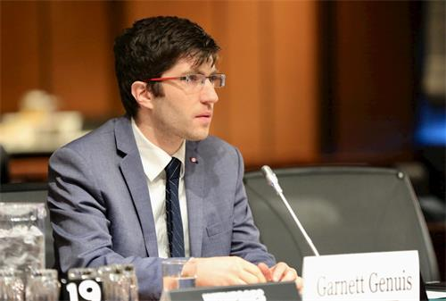

 
图1：Garnett Genuis议员在接受采访时谈到提出类似法案的初衷时说，加拿大可以建立自己的法律，零容忍加拿大人在强摘器官方面成为同犯。让加拿大站在正义的一边。 
 

Garnett Genuis议员在接受采访时谈到提出类似法案的初衷时说：我认识到的现状是，在全球一些国家，尤其是在中国发生着工业化的强摘器官。许多人因强摘器官被杀害，有些人在还活着的情况下，就被摘取器官用于移植，这是令人极端痛苦的恶行。我们无法控制在领土以外发生的悲剧，但是我们可以建立自己的法律，零容忍加拿大人在强摘器官方面成为同犯。让加拿大站在正义的一边。

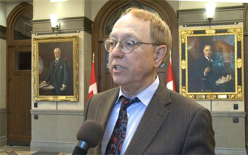

 
图2：新民主党国会议员、司法部长反对党批评家Murray Rankin在国会第二次审阅中，附议（second）该法案。他在接受采访时说，加拿大不能成为这种“可怕罪行”（horrendous crime）的同谋。 
 

新民主党国会议员、司法部长反对党批评家Murray Rankin在国会第二次审阅中，附议（second）该法案。他在接受采访时说，当初的推动力之一就是大量中国法轮功学员被强摘器官的事实。“这种恶行在哪里都是错的。”加拿大不能成为这种“可怕罪行”（horrendous crime）的同谋。

<b>跨党派合作　共同制止强摘和贩卖器官</b> 

Genuis在发言中首先感谢和表彰参众两院所有参与这一（立法）进程的议员，“长时间里，进行了令人难以置信的坚定工作”。他敦促所有人与参议员进行对话，使该法案在参议院获得通过，以确保该法案的最后版本在本届议会成为法律。

他希望本届议会能使该法案成为法律，“我们能够为世界上最脆弱的国家做一些不可思议的事情，而其他议会迄今未能做到这一点。”

Rankin在发言中说：“新民主党全心全意支持《S-240法案》。“他希望该法案在本届议会通过。“我毫无保留地支持该法案，以便其进入下一个立法程序。”

法案通过后，来自不同政党的议员从座位上走到会议厅中央相互握手、拥抱，互相祝贺。

<a href=#list><h6 align="right">回目錄</h6></a>
 

<a name=w6-a><h2> 美国际宗教自由委员会年度报告：中共仍在大规模强摘器官（图）</a>  </h2>
 

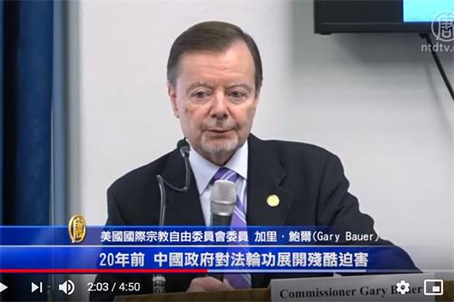

 
图：美国国际宗教自由委员会委员加里·鲍尔（Gary Bauer）表示，委员会建议美国政府“必须迅速、果断地制裁犯下或纵容严重侵害宗教自由行为的中共官员和机构。（大纪元合成图） 
   

报告说，由于中共系统性、持续性地严重违反宗教自由，中国在二零一九年再次被美国国际宗教自由委员会列为侵犯宗教自由的“特别关注国”。这是中国连续第二十年被列为“特别关注国”。报告以大量篇幅记录中共在二零一八年系统性地、持续地、严重地侵害宗教自由。

报告说，江泽民于一九九九年发动对法轮功的迫害，并且创建了臭名昭著的“610”办公室，这是一个凌驾在法律之上旨在消灭法轮功的机构。

报告说，作为法轮功学员，最终可能会被拘留，被电棍攻击，被迫成为医学和心理学实验对象。

二零一八年，中共当局骚扰、拘留并且恐吓法轮功学员，只因为法轮功学员坚持信仰。 有报道说，很多被拘留的法轮功学员遭到殴打，受到精神虐待、性侵，强制服用不名药物，并被剥夺睡眠。

根据法轮功学员提供的消息，二零一八年，中共至少关押了931名法轮功学员。去年夏天，几名法轮功学员通过社交媒体发送支持法轮功的信息，以及在市场上派发真相资料被抓捕。

虽然中共声称，截至二零一五年一月一日，它已经结束了从囚犯身上摘取器官的做法（许多被关押的人被认为是法轮功学员），二零一八年，人权倡导者、医疗专业人员和调查记者提供了更多的证据，表明中共仍在继续大规模强摘器官。

去年十一月，湖南长沙司法局暂停了两名为法轮功学员辩护的律师执照六个月，因为他们在法庭上说，法轮功不是邪教。

去年十一月，在联合国对中国的定期审议期间，美国在事先提交的书面问题中质询法轮功被迫害问题和基督教会被关闭的情况。

美国国际宗教自由委员会委员加里·鲍尔（Gary Bauer）在当天的新闻发布会上说，中国的形势还在不断恶化。为此，委员会向行政当局提出一系列建议，包括在美国和中国的所有双边谈判，特别是正在进行的贸易谈判中，将宗教自由和人权问题摆在台面上。

委员会还建议美国政府“必须迅速、果断地制裁犯下或纵容严重侵害宗教自由行为的中共官员和机构，包括新疆自治区党委书记陈全国”，并敦促美国和其它政府向中共政权施压，要求他们立即无条件释放高智晟等良心犯。

<a href=#list><h6 align="right">回目錄</h6></a>
 

<a name=w5-a><h2> 海风：暴力阻挡不了信仰的光芒</a>  </h2>
 

 
2018年6月20日，来自世界各地的部分法轮功学员在华盛顿DC的国会山集会，要求解体中共、停止迫害、法办江泽民。（李莎／大纪元）
  

【大纪元2019年04月27日讯】宗教信仰到底是什么？我认为，它是人性之恶的净化器；它是高尚人格助推器；它是人类文明进程的指南针。

遗憾的是，我与大多数国人一样至今还没有宗教信仰。我人生第一次接触宗教组织还是20年前，那时我还在中央某新闻机构当记者，单位派我到南方去采访打击法轮功“X教”组织的成果。我记得很清楚，当年为了彻底铲除法轮功，中央几乎开动了所有的国家机器，如：全国人大专门立法(法律机器)；中央专门成立了一个特殊机构叫“610办公室”（暴力机器）；中宣部专门给各新闻单位下文，对法轮功宣传定调；中央办公厅和国务院办公厅还下发通知，要求党政军各单位不得录用法轮功学员及其直系亲属，各级公安机关也不得给法轮功学员办理护照。为了落实中央指示精神，各地党政机关都是层层把关，并以责任状的形式布置工作任务。

当时各地政府都要求法轮功学员做两件事：一是要求法轮功学员主动揭露法轮功的“X教”“本质及其危害性”；二是要求法轮功学员与法轮功“X教”组织“彻底划清界线”，每个学员必须要写一份悔过书。如果某党政官员有亲属是法轮功学员，这个官员还得向党组织签订《责任状》。当时是全国总动员，简直就是一场没有硝烟的战争，而且是谁沾法轮功，谁就会惹上大麻烦。

我当时在各地跟踪采访长达3个月之久，这期间，我接触了不少法轮功学员。在他们当中有离退休干部，有农村老人，有工厂退休工人，也有些体弱多病的行政事业单位的干部。当时他们给我的印象是无辜与可怜。我采访了几百名法轮功学员，几乎没有一个做过什么危害他人、危害社会的事。给他们惟一的罪名就是“教唆他人有病不去找医生，搞封建迷信”。

另外还有一条就法轮功组织卖书谋利。我结束采访回到单位后，单位领导单独找我听取汇报，我也把自己的所见所闻如实向领导作了汇报。当时我对中央兴师动众表示很不理解，我就问领导：“中央对一个民间气功组织如此大动干戈有这个必要吗？”领导带着批评的口气对我说：“亏你还是中央新闻单位的记者，可你政治上很不成熟，你把法轮功看得太简单了，如果中央任由法轮功发展下去，可能不出10年，学员就要达到2亿以上，到那时，他还会仅仅是一个民间气功组织吗？”此时我才幌然大悟，原来中共是担心法轮功队伍壮大后会有“政治图谋”。

多年后，我就中共为什么要彻底打击法轮功组织一事向一位得道高僧讨教，这位高僧对我说：“自古以来，无论是宗教信仰还是政治信仰，都有正信与邪信之分，邪信的克星就是正信。你说，中共能不害怕像法轮功这样的信仰团体吗？”尽管当时高僧没有点破谁是邪信，谁是正信，但我心里完全明白高僧所指。直到这时我才真正理解法轮功是一个信仰团体。

这些年我在美国生活，经常会接触到法轮功学员，我记忆最深的是2012年在联合国门口。当时我和两个朋友从联合国大厦参观出来，有一位大约60多岁的妇女跑过来，她问我们是不是党员，我和两位朋友都说不是，可这位妇女又问我们是不是团员？是不是少先队员？因为有事，我们就顾不上理她，只能告诉她都不是。不料，这位妇女居然追着我们走了4条街。我看到她紧追不舍，就掏出100美元塞给她，希望她不要再纠缠了。可令我想不到的是，这个一直面带微笑的妇女顿时很生气，她对我说：“我不是乞丐，我追你又不是为了要钱。”我一听就很纳闷地问她：“你这么大年纪，既然不是为了钱，你又为什么总缠着我们退党呢？我们退不退党又关你什么事呢？”这位妇女说：“我要你们退党、退团都是为了你们自己好，为了你们的后代好。”

这么多年来，我经常会想起她的这句话。但始终不能理解，这究竟是莫名其妙的江湖说词，还是法轮功对中国政治的预见？

由于法轮功“反共”，这对于体制内的人来说，大家只能敬而远之，更不可能有兴趣去了解法轮功。可朋友们对法轮功神韵演出的评价改变了我对法轮功的看法。前几年，有位华人朋友问我去不去看法轮功的神韵艺术演出，他还反复强调买票不容易。可我几乎不加思索就回绝了朋友，还对朋友说：“你怎么会去看这种演出呢？”前年一次偶然的机会，一位中共高官（副部级）对我说到神韵在北美的演出情况，他说：“我们花钱请明星去北美演出，免费送门票都没人愿意看，可法轮功的神韵演出1张票卖几百元，还一票难求，5000人的场馆居然是场场爆满，一演就是十几场，而且美国许多政要都自费买票前去观看，这不得不令人深思呀!”后来我向美国朋友打听神韵的情况，有位美国朋友对我说：“神韵是东方文化的杰作，也揭示了中共暴政的邪恶本质，很值得一看。”这番评价让我很是惊讶，一直被中共视为X教组织的法轮功，其精神魅力为何会有如此之大？

前几天，我因为工作上的事，又近距离接触了几位法轮功朋友，他们都很友善、很自信，并不是我以前在国内看到的老弱病残，他们都是社会精英。我们在交流过程中，我向他们讨教法轮功“真、善、忍”的来历及其内函。他们的解释让我感到了自己的渺小；也让我看到了信仰的力量；同时也让我领悟到，人类文明的起源为什么是从文字和宗教信仰发端。更让我明白一个道理，那就是法轮功在这20多年来，虽然经历了中共无数次血腥镇压，可为什么还能生生不息且不断发扬光大？因为任何暴力都阻挡不了信仰的光芒。

责任编辑：高义

<a href=#list><h6 align="right">回目錄</h6></a>
 

<a name=w4><h2> 港府无理遣返法轮功学员　“一国两制”名存实亡</a>  </h2>
 

【明慧网二零一九年四月二十九日】二零一九年四月二十六、二十七日，台湾法轮功学员搭机前往香港参加“四二五和平上访二十周年纪念游行”活动，遭港府无理由拒绝入境，近七十名持合法证件的学员遭遣返。

类此“黑名单”事件，再次证明“香港一国两制”名存实亡。四月中旬，无国界记者组织发布《二零一九新闻自由指数》，香港受中共干预，新闻自由持续倒退，在180个国家中排73名，香港逐渐沦为自由受限地区，于今又添一证。

无端遣返并非首例，港府多次涉嫌根据中共提供的黑名单有计划、大面积的拒绝法轮功学员入境并非法遣返他们。二零零一五月，香港移民局官员扣押并驱逐了一百多名到香港参加活动的海外法轮功学员。二零零七年六月二十四日至七月一日，至少有五百多名法轮功学员遭港府拒绝入境，这些来自台湾、澳门、菲律宾和澳洲等地持有合法签证的法轮功学员被香港当局采取暴力手段强制遣返，另遭拒绝登机及不发签证者近三百人，总计超过八百名台湾学员被非法禁止入境，成为香港历史上最大规模的遣返案。

如众所知，举世各国入境海关都有侦测名单，一般都是通缉中的刑事罪犯或危及社会的恐怖份子，绝无私自设限、拒绝善良民众入境之理。法轮功学员多次赴香港遭受无理遣返，港府侵犯信仰自由、侵犯人权的乖张举措，印证了“一国两制”只是空洞不实的口号，所谓“港人高度自治”，犹如镜花水月般虚幻。港府屈从于中共黑手，屡次助纣为虐，可谓东方明珠蒙尘、自毁形象。

人权与自由乃普世价值，自诩为民主社会的香港也不例外。二零零四年十一月《九评共产党》问世引发了退党大潮，迄今已有三亿三千万人在网站公开发表声明退出中共（党、团、队组织），越来越多的海内外华人在认清中共的邪恶本质后，纷纷表态退党，标志着中共的解体崩析在即。港府若昧于态势、与历史的洪流抗衡，将成邪党沦亡的陪葬品。

善恶有报是天理。古往今来，顺应民心者，才能昌盛繁荣；为虎作伥之徒，都逃不过历史的审判。港府十余年迎合中共，迫害修炼真、善、忍的法轮功学员，已留下不光彩的一页历史。如果当局一味讨好中共而继续与邪恶为伍，等于把自己送上审判台，终将难逃正义的声讨与世人的唾弃。明珠能否脱尘除垢，再现璀璨光芒，就在当权者一念之间。

法轮功学员希望港府理智、清醒，遵守法治、尊重信仰与言论自由，及时悬崖勒马，不再被中共红色势力箝制，做出对历史、对生命真正负责和正确的决定，否则终将遭国际社会谴责与不信任，危及自身生存与信誉。

<a href=#list><h6 align="right">回目錄</h6></a>
 

<a name=w3><h2> 委内瑞拉危机 中共数百亿债务或打水漂</a>  </h2>
 
 

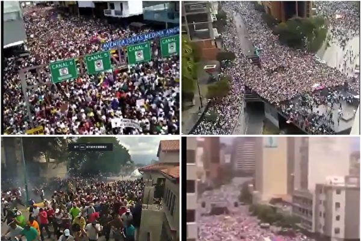

 
委内瑞拉的政治危机不仅牵动中共的神经，也引发中国民众的极大关注。老百姓担心的是，中共借给委国的数百亿美元的贷款是否会最终随着马杜罗的下台而大缩水或打水漂。（大纪元合成图） 
   

【大纪元2019年02月11日讯】（大纪元记者张婷综合报导）委内瑞拉的政治危机不仅牵动中共的神经，也引发中国民众的极大关注。中共借给委国的数百亿美元贷款是否会最终随着马杜罗的下台而大缩水或打水漂，是中国民众关心的问题。

美国《国家利益》杂志网络版2月10日发表文章说，中共对委内瑞拉以石油为支持的贷款，恐怕要随着委内瑞拉政局的更替而大缩水。

报导说，从理论上讲，委内瑞拉巨大的石油资源给中国（共）自2007年以来向委国提供的至少数百亿美元贷款提供了充足支持。然而，委内瑞拉的石油并不是这些贷款的正式抵押，而是一种“生产”现金再偿还贷款的手段。对那些受委内瑞拉政局影响的中共贷款方来说，石油显示出是一种日益虚幻的贷款担保形式。

<b>委内瑞拉现状对中共一带一路产生影响</b>

报导还说，这一形势正在成为“出了差错的地缘经济学”经典例子，并凸显出这样一个现实，那就是，在混乱的地方即便是撒出很多钱，也往往不能买到持久的战略影响力。相反，这种影响力充其量只是暂时“租用”，一旦发生贷款方难以控制的事件，即使这种影响力最终不会完全毁灭，也会迅速锐减。此外，这一教训也可能对北京庞大的“一带一路倡议”具有深刻影响。

委内瑞拉长期的石油产量下降对外部贷款的影响，因多种宏观力量而加剧。当全球石油价格普遍较低且波动较大时，这或者迫使委内瑞拉承诺提供比预期更多的石油来为贷款服务，或者迫使贷款人给借款人提供一些宽容期，而通常贷款人是要为此付出成本的。

石油业已经陷入混乱的委内瑞拉现在又发生了严重政治危机。反对派领袖胡安·瓜伊多（Juan Guaido）的临时总统职位得到了美国和多个委内瑞拉附近邻国的支持和承认，与马杜罗政权抗衡。

现如今，中共发现自己处于一个和十年前十分不同的位置。十年前，石油支持的贷款似乎是确保中国急需的石油供应的合理和有效途径，同时与委内瑞拉建立关系也可以让中共悄悄地在美国后院建立一个立足点。

报导称，委内瑞拉现在欠中国的债务约为200亿美元，这对中国来说还不是一个金融挑战。但如果马杜罗下台，新的委内瑞拉政府要是对这些债务进行重组或打折扣，这种打击对中共来说，将是一个痛苦的提醒，那就是，对不稳定的、缺乏法治的主权提供贷款所带来的风险。

<b>中共在委内瑞拉的债务困境</b>

《国家利益》认为，如果马杜罗放弃权利，委内瑞拉的主要债权人，尤其是中共和俄罗斯的债务可能要被缩减。2月4日，委内瑞拉驻美大使卡洛斯‧维奇奥（Carlos Vecchio）对彭博社说，新任政府将履行“合法”的债务，但是否会履行这种“石油换贷”的协议，目前尚不知。

都灵资本（Torino Capital）表示，委内瑞拉负债累累，其在2018年底欠外国债权人的债务估计为1570亿美元，约占其GDP的150%。

中共是委内瑞拉最大的外国债权方之一，并且发现自己处于未来债务重组的十字线。委内瑞拉新政府可能将前政府与中共达成的石油支持贷款，视为是中共对该国石油的大量剥削。

因此，中共不希望委内瑞拉更换政府。到目前为止，其仍公开大力支持马杜罗。

“它们担心反对派掌权后，一定想要履行（过去的）合同，或者从中找漏洞。”投资银行加拉加斯资本市场（Caracas Capital Markets）的执行合伙人拉斯‧达伦（Russ Dallen）表示。

不过，达伦指出，北京对马杜罗的支持可能不会持久。“中方（中共）不知道该怎么办。它们没有得到马杜罗的回报，然后情况还在不断恶化。”他说。#

责任编辑：林妍

<a href=#list><h6 align="right">回目錄</h6></a>
 

<a name=w2><h2> 【新闻看点】委内瑞拉为何几年就从富到穷？</a>  </h2>
 
 

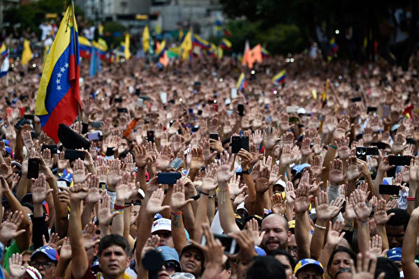

 
图为委内瑞拉民众上街，举手反对马杜罗。(FEDERICO PARRA/AFP/Getty Images) 
   
【大纪元2019年02月05日讯】大家好，欢迎大家关注新闻看点，我是李沐阳。

今天（2月5日）是中国传统新年己亥年的大年初一。代表新闻看点的全体工作人员，向各位新老朋友拜年。老人常说“平安是福”，所以把一份平安的祝福送给大家，祝福大家有一个平平静静、有条不紊的工作和生活。

其实这在西方自由国家里并不是奢望，但在社会主义国家里，想有平静稳定的工作、生活还真不容易。委内瑞拉就是眼前的例子。

为了找回曾经自由富裕的生活，这个国家正在经历一场变革，前天民众再次举行了游行集会，敦促独裁的马杜罗（Nicolás Maduro）下台。

为了声援那里的民众、向马杜罗施压，二十多个欧洲国家昨天声明，承认反对派领导人瓜伊多（Juan Guaido）的临时总统身份。英国外交大臣亨特（Hunter）表示，委内瑞拉人民蒙受的磨难已经够了，“必须终结窃取统治权的马杜罗非法政权的压迫。”

<b>短短几年 从富到穷</b>

众所周知，委内瑞拉近年陷入了经济和政治乱局。从一个石油储量全球排名第一、曾经的中等富裕国家，短短几年当中，变成了现在的穷国，民不聊生。

2014年，他们的人均GDP还有1.3万多美元。但是现在，有十分之一的人口已经逃离了。自由亚洲报导说，那里粮食和药品严重短缺，商店中的货架上空空如也，甚至连加油站也因为缺油不得不关门停业。

华侨梁伟东曾在委内瑞拉的首都卡拉卡斯（Caracas）开了几家商店，他说每次货品一到，就有很多人排队。最初还好一点，但情况越来越糟糕，很多人根本买不到自己需要的东西。

已经移民美国的梁先生介绍，大概从2010年开始，那里的经济情况就日益恶化。而查韦斯（Hugo Chávez）政府限制价格的作法，让大部分商家无法维持运作，只能停业关门。

通货膨胀更是严重到让人无法忍受，“乘公交车开始是2块钱，后来涨到100、500、2000，最后到200万。”

物价涨了100万倍，可是百姓挣的钱却少得可怜。就算有一份工作，每月最低工资也只有1.8万玻利瓦尔（约合6.74美元）。

可想而知，就算有商品可以买，又能买到什么？所以几百万人多年营养不良。药物紧缺，致使已经消失十几年的疟疾、肺结核等病又出现了。从2011年起，儿童死亡率几乎增加了一倍。

官方资料显示，2014年经济衰退了4%，2015年衰退了7%，可是后来就不公布数据了。国际货币基金组织（IMF）估算，2016年和2017年，委内瑞拉经济萎缩了16%，去年萎缩了18%，通货膨胀率达到了百分之一百万，今年将达到百分之一千万。

由于长期物资匮乏、犯罪率高、恶性通货膨胀和政府打压等原因，大量民众开始逃离。国际移民组织（IOM）估计，从2014年开始，已经有300万人移居国外。

<b>查韦斯学中共 大搞社会主义</b>

是什么原因造成委内瑞拉从区域内最富裕的国家，走到现在的困境呢？众所周知，1998年发动军事政变失败入狱的社会主义者查韦斯，被特赦后当上了总统。

他进行了大量的社会改革，将石油、电力和电信等大型公司国有化，使得大批外国资本陆续撤离，私企倒闭。查韦斯还大幅度增加社会福利，并改组最高法院，任命了多名支持他的人出任法官。他修改宪法，增加他和行政当局的权力，限制国家立法机关的权力。

2013年查韦斯死后，接任的马杜罗仍然推行社会主义政策。当年国家石油价格剧烈下跌，让完全依靠石油出口的委内瑞拉陷入了困境。德国之声指出，这就是政府过度干预的结果。

马杜罗为了维持政府和国家经济运作，大量借债并滥发货币。所欠外债超过了1200亿美元，仅欠中国的就超过600亿美元。

<b>社会问题百出 马杜罗镇压民众</b>

马杜罗还从中共那里引进所谓“社会信用体系”的资金，用来掌握民众的一切信息。不仅是一般经济信息，也搜集民众的政治观点。然后根据这些，决定是不是发放社会福利给民众。

民众愤怒越来越大，2014年，抗议浪潮覆盖全国。尽管当局全力镇压，但局面已经失控。

去年5月，马杜罗操控大选，自称获胜连任，反对派控制的国民议会拒绝承认这个结果。但马杜罗解散了国民议会，并在今年初宣誓就任，引发更大的抗议。1月23日，几十万人举行抗议集会，瓜伊多自任临时总统，建立过渡政府，组织大选。

梁先生认为，委内瑞拉经济崩溃的原因很简单：“贪腐非常严重。”他说，“这方面和中国是一样的，甚至比中国（中共）那些高官还要厉害。”

川普在去年联大演讲中说得很清楚，社会主义对权力的渴望导致了扩张、入侵和压迫，造成了苦难、腐败和衰变。

福布斯杂志分析指出，社会主义在委内瑞拉的失败，可能预示著社会主义在美洲要退潮了。

时事评论员唐靖远指出，委内瑞拉就是中共统治的缩影，它从中共那里学来的极左政策，导致了其走向失败。这也在预示，不久的将来，中国也会发生排除中共的变革，社会主义将彻底破产。

好的，感谢您关注新闻看点，再会。

大纪元《新闻看点》制作组

责任编辑：李昊

<a href=#list><h6 align="right">回目錄</h6></a>
 

<a name=w4-a><h2> 【九评13周年】中共给中国带来了什么 </a>  </h2>
 

《九评》十三周年 反思共产主义灾难（三）

作者：程晓容

 

 
中共68年的统治，给中国和中国人民带来了巨大的灾难。图为2016年12月15日，令人窒息的雾霾笼罩下的紫禁城。(WANG ZHAO/AFP/Getty Images) 
   
【大纪元2017年11月19日讯】华夏神州，曾经山灵水秀、美丽富饶。那里曾是人们世代栖息的美好故乡。然而，这个承传五千年辉煌文化的国度，却饱受蹂躏。统治六十八年之久的中共，究竟给中国和中国人民，带来了什么？

一本旷世奇书，揭示谜底。2004年11月，大纪元发表了系列社论《九评共产党》，结合历史与现实、深刻地揭露了共产党及中共的邪恶本质。《九评》这样论述：“纵观八十多年的中国共产党历史，其所到之处永远伴随着谎言、战乱、饥荒、独裁、屠杀和恐惧；传统的信仰和价值观被共产党强力破坏；原有的伦理观念和社会体系被强制解体；人与人之间的关爱与和谐被扭曲成斗争与仇恨；对天地自然的敬畏与珍惜变成妄自尊大的‘战天斗地’，由此带来的社会道德体系和生态体系的全面崩溃，将中华民族乃至整个人类拖向深重的危机。而这一切灾难都在共产党精密的策划、组织和控制下发生著。”

审视今日大陆，就会发现，《九评》的论断极为精准。山河满目疮痍，社会乱象丛生；官场贪腐，人心不古，危机四伏。中共体制内几乎无人相信共产主义，各界民众抛弃中共的民意汹涌沸腾。但是，中共还在拚命支撑著共产残局，继续鼓吹其96年的道路，标榜“伟光正”。同时，也有一些人对中共心存幻想，抱有改良的期望，或是因利益驱使而摇红旗助威。在这种情况下，我们需要冷静地思考：中共的本性和手法，改变了吗？

<b>一、相似的悲剧 不变的邪恶</b>

<b>1. 漠视生命 嗜杀成性</b>

1970年4月18日，大陆历史学界的奇才沈元，被以“反革命叛国罪”执行枪决，时年32岁。这位1955年的高考文科状元，曾被划为“极右分子”，文革时和妻子被红卫兵扫地出门。在走投无路之下，沈元铤而走险，闯入某外国驻华使馆欲求庇护，最后不幸惨遭杀害。

1980年，沈元的家人接获一张平反通知书。沈母痛哭：“我要人，我不要纸，不要纸啊！我送走的是一个活生生的人，一个聪明绝顶、才华横溢的儿子，为什么现在还给我一张纸？”

1995年，河北青年聂树斌被冤判死刑。2016年12月2日，大陆最高法院对聂树斌案再审宣判，推翻原审判决，改判聂树斌无罪。据媒体报导，在法庭的宣判时刻，聂树斌的母亲张焕枝起立听审，坐下后情绪崩溃、三次大喊：“我那孩子回不来了！”

沈元回不来了，聂树斌也回不来了，数以百万计、千万计被中共杀害的中国人再也回不来了。漠视生命、残害良善，是中共的暴力本性所致。为了维护其专制政权，中共在六十八年里不断地发起政治运动，打击异己，制造恐怖，以“阶级斗争”或“维稳”的名义，将一批批无辜的国民残酷地消灭。从杀AB团、土改杀地主、镇反和文革杀“反革命”、到“六四”杀手无寸铁的学生和市民，再到1999年开始镇压法轮功，中共的统治史就是一部血淋淋的杀人历史。

<b>2. 迫害信仰 因言治罪</b>

从成立之日起，中共就生存在恐惧中，恐惧失去权力，恐惧受到清算。中共宣扬无神论，以党性泯灭人性。因此它自建政后就开始有系统、有计划地消灭宗教，迫害信仰。中共压制人民的自由意志，愚民洗脑，企图把所有人都驯服为它的工具。从整风、反右，到文革、“六四”，再到镇压法轮功，迫害维权律师，中共对正义人士以言治罪，“反革命”、“攻击党的领导人”、“叛国投敌”、“煽动颠覆国家政权”、“泄露国家机密”、“反华”等罪名多变，迫害本质如一。

中共严控网络和媒体，封锁真相。近来，陆续发生了敢言的大学教授被处分、停职或解聘的事件。大陆网民的微博、微信被封号、遭删帖更是司空见惯。有人用“万马齐喑”形容舆论界的肃杀氛围。

北京一位大学教师王女士在受访时说：“只要你不听从，就让你连饭也吃不上。他们过去也是这样做。1957年打右派，一人是右派，全家受株连，不能上学，不能就职。学者现在更是这样。”

2016年底，新浪微博知名博主“华夏正道”、广东法轮功学员郑景贤在看守所写下辩护词。他说：“当一个人说真话而变成罪犯的时候，这不是我的耻辱，而是整个文明社会的耻辱。因言获罪，文字狱，侵害信仰自由是违反人类普世价值与中华人民共和国宪法，此案完全不成立……”

2015年的“709”大抓捕，震惊海外。据新唐人电视台报导，“中国维权律师关注组”统计显示，截至2015年7月6日下午6点，至少有320名律师、律所人员、人权捍卫者和家属被约谈、传唤、限制出境、软禁、监视居住、逮捕。两年来，当局对律师界的打压还在持续。多位律师被失踪、被认罪、被非法关押。当事人及其亲属的遭遇和抗争充分暴露了中共司法界的黑暗。

江天勇律师说过：“不过它越打压，也就让我们越认识到，这一套机制只要在，它就是一个惩善扬恶的世道，大家就没办法正常做人，这一切必须改变，必须结束！”

陈光诚律师曾就江天勇事件表态说：“只要你对中共抱有希望，就是错误的开始，并受到中共的愚弄。”“只要中共这个集团存在，中国就不会有法律和公平正义。”

2017年7月4日，高智晟律师发表《写在709事件两周年之际》。他在文中表示：“共产党绝不会依法治国。”

<b>3. 欺骗与谎言</b>

《九评》指出：“欺骗和谎言，是共产党的另一遗传基因。”“中国共产党承诺给农民土地、承诺给工人工厂、承诺给知识分子自由和民主、承诺和平，如今无一兑现。一代被骗的中国人死去了，另一代中国人继续对中共谎言着迷……”

为了维持和巩固政权，中共不断变化其立场和原则，暴力与欺骗并行。二者搭配的规律，体现在历次无情的政治运动中，其中著名的一例骗术是“反右阳谋”。1957年，中共号召知识分子给党提意见。《九评》里写道：“当时有几句鼓励人们鸣放的说词，叫做‘不揪辫子、不打棍子、不戴帽子、决不秋后算账’。结果一场反右斗争划定了55万名‘右派分子’，27万人失去公职，23万被定为‘中右分子’和‘反党、反社会主义分子’。”

为了将欺骗进行得彻底，中共喉舌媒体炮制了大量的谎言、歪曲历史。大纪元特稿《共产主义不是出路而是绝路》对此有如下小结：“之后中共开始系统地篡改历史，将‘万里大流窜’的败退逃跑，宣传为‘北上抗日’的长征；将躲在陕北坐视国民党抗日的共产党美化成‘抗日战争的中流砥柱’；将中国人自相残杀的内战改写为‘解放战争’；将饿死三千万人的人祸‘大饥荒’扭曲成‘三年自然灾害’；将十年文革的责任全部推到‘四人帮’的头上；将‘六四大屠杀’包装为‘平息反革命暴乱’；妖魔化修炼‘真、善、忍’的法轮功学员；将数十万甚至或达数百万人被劳教、被酷刑甚至被‘活摘器官’的人权灾难描绘成‘中国人权最好的时期’，并大言不惭地宣称‘中国是个法制国家’。”

<b>二、摧毁道德 颠覆传统</b>

中华民族五千年的文明长河中，闪耀着许多精深的内涵：“天人合一”、“善恶有报”、“忠孝节义”、“仁义礼智信”，这些观念和标准规范着人的道德基础，保障了家庭的稳定与社会的和谐。令人悲哀的是，中共自夺权后便开始摧毁传统文化：三教齐灭、毁坏文物，诋毁古代圣贤与传统价值观。同时，中共向百姓强制灌输“假、恶、斗”的无神论党文化，从精神上斩断了几代人的传统文化的根。

《九评共产党》论述：“中共除了要在物质层面毁灭宗教和文化之外，还尽其所能地在精神上摧毁人们对于信仰和文化的认同。”“历史上从来没有一个皇帝除了用暴力之外，还像中共一样用诋毁和谩骂的形式，从人心中根除人们认为最神圣和最美好的东西。意识形态上的消灭，有时候比单纯的物质消灭更加有效、更加持久。”

经过几十年的斗争扫荡，现在的中国人被迫面对与承担着道德覆灭后的严重后果：暴戾取代了仁爱，颓废取代了圣洁。人们普遍不再敬畏神明，而是放纵私欲，为所欲为。自毛时代起，以毛泽东为首的众多官员，便是骄奢荒淫之徒。到了江泽民时期，其推行的腐败治国更令贪官如鱼得水，将腐败推向极致。结果是：少数人暴富，而底层工人和农民却依旧贫苦不堪。

道德堕落的冲击波，延伸到社会生活的各个层面、无人可以幸免：有毒食品遍地，造假习以为常，暴力血案频发，诚信流失，爱情婚姻的庄严不再。教育界、医疗界同样是一片乱象，甚至出现了教师强奸学童、盗卖人体器官、活摘人体器官的人伦恶行。

魏则西、雷洋、李传星、有毒疫苗、上海虐童、江西南昌“圈养活人”卖肾案、日本留学生江歌遇害……接连不断的惨案、悲剧都指向“道德”二字。一个蔑视传统、摧毁道德、仇视“真、善、忍”的政党，将把国家带向何处？

有评论人士坦言：中共的统治导致了诸多人性问题的无解。

<b>三、破坏生态 污染环境</b>

《九评》指出：共产党是反宇宙的力量。中共“违背自然，其祸无穷”。中共“与天斗”、“与地斗”，以牺牲自然环境为代价、盲目地追求经济发展指标，造成环境重度污染，资源消耗殆尽。许多中国人被逼得逃离家园或是想逃也无处去，子孙后代的生存条件堪忧。

2005年8月15日，在北京举办的“财富”全球论坛上，时任中国国家环保总局副局长的潘岳表示：“中国的环境问题不是一个专业问题，而是一个政治问题，根源是我们扭曲的发展观。”他明确指出：“经济危机经过几年的宏观调控可以恢复，社会危机付出政治成本也可以平息，而环境危机一旦产生，就不可逆转，会成为民族灾难。”

潘岳在发言中披露说：“在过去的50年中，中国的人口增加了一倍，生存空间却减少了一半。1/3的国土被酸雨侵蚀，七大江河水系中劣五类水质占41%，沿海赤潮的年发生次数比20年前增加了3倍，1/4人口饮用不合格的水，1/3的城市人口呼吸著严重污染的空气，城市垃圾无害化处理不足20%，工业危险废物处置率仅为32%，全球污染最严重的10个城市中，中国占5个。”

“在人口远远超过土地承载力，资源极度短缺、环境容量极度狭小的情况下，中国经济不可救药地采取了一种高消耗、高污染的方式：单位产值的排污量是世界平均水平的十几倍，劳动效率仅为发达国家的几十分之一，经济不稳定的系数为世界平均值的4倍以上。与此同时，能源浪费消耗极大，1万美元消耗矿产资源是日本的7.1倍、美国的5.7倍，甚至是印度的2.8倍。这种增长方式必然导致生态环境的严重破坏。”

中国摄影师卢广曾经表示，中国污染问题主要是地方政府的利益驱使所致：“地方政府想发展经济，想扩大自己的实力，想要政绩，它就设法招商引资，欺上瞒下，不让上级知道要建设的真实项目。”

美国之音2013年5月22日报导，中国90%以上的地下水受到污染，其中64%受到严重污染，生命之源正成为绝命之源。

2014年，中共当局承认的“癌症村”有259个，而公益人士统计的“癌症村”多达459个。作家郑义长期研究调查大陆的环境污染问题。他说：“原先中国有良知的学者在统计癌症村，后来慢慢发现不是癌症村的问题了，是癌症河的问题了，大面积扩散，再统计已经没有意义了。”

大陆环境污染的源头在哪里？是中共的无神论，是中共藐视天地自然的斗争哲学，是中共牺牲百姓子孙利益的暴政思维。郑义说：“人类历史上从来没有这样一个邪恶政权，它不仅可以把当代，也可以把子孙万代的资源都给掠夺了，把中华民族赖以生存的根基都毁掉，把整个民族毁掉。”

 

 
图为2016年5月3日，黑龙江省甘南县一家奶牛场向附近的田地排放污水。(NICOLAS ASFOURI/AFP/Getty Images) 
   

 

 
图为2016年12月19日处在阴霾下的中国大连。(VCG/VCG via Getty Images) 
   
<b>四、朝鲜与中共</b>

今年6月19日，被朝鲜关押17个月的美国大学生奥托．瓦姆比尔获释返美，不到一周后死亡。瓦姆比尔在去年1月2日被朝鲜当局以涉嫌“从事反朝敌对活动”逮捕，3月被判处15年苦役，随后很快陷入昏迷，在美国政府的营救下才被释放。这一事件令举世哗然，充分暴露金氏政权的邪恶。川普总统谴责朝鲜是“野蛮的政权”。

小巫见大巫。中共的冷血、野蛮不但与朝鲜相似，实际上是有过之而无不及。屠杀、酷刑、囚禁、监控、株连、骚扰……各种迫害手段已经夺走了八千万中国人的生命，而且令数不清的受害者生不如死、如坠人间地狱。中共对法律的践踏、对人权的侵犯随处可见，公然而无耻。

众所周知，朝鲜人民被共产体制所奴役，在物质和精神的贫瘠中挣扎。不过有些中国人认为，中共的道路比朝鲜模式要来得成功。如今，中国已成为世界第二大经济体，有一些中国人致富生财，这些人的物质生活水准并不逊于西方发达国家。其实，几十年来的经济成就是中国人民的成果，并非中共的功绩。中国的人力资源、广大人民的勤劳和智慧，是创造物质与精神财富的主力，在几千年的历史中扮演着重要的角色。

中共不计一切后果地发展经济，在国内搭建了数个华丽的展示橱窗。然而，必须注意：在光鲜的背后，污染了水源、空气、土壤、河流，毁掉了子孙万代赖以生存的各类资源。即使是以如此惨痛代价换来的经济增长，也只是供极少数人先富起来。中国还有至少7000万的贫困人口，还有上亿人老无所养、病无所医，在为了温饱拼死拼活。

再看思想钳制。金正恩当局欺骗朝鲜民众，说99%的美国人都很穷困。朝鲜的网络只是区域网，和外界隔绝。而在大陆，十几亿中国人也被巨大的防火墙阻挡，不能自由地浏览信息、不能自由地表达观点；政治“红线”和“雷区”处处皆是，五毛大军24小时严防紧盯；谷歌、脸书和推特都被屏蔽。

至于洗脑，中共从未放松：从幼儿园、小学、中学一直到博士，马列毛思想的政治课程是重中之重。近些年，中共竟然开设了两百多所“红军小学”，赤裸裸地逼迫学生颂扬红军的“恩情”，令人啼笑皆非而又不寒而栗。

事实上，共产小兄弟、金家王朝是中共的学徒，拜中共所赐，才得以维系邪恶统治。谴责朝鲜，不应该忽视中共的更大罪恶。朝鲜的现状，就是中国的昨天和今天的镜像。

<b>五、结语</b>

今日中国，道德、法治、环境、自由，太多的问题令人沉痛、叹息。希望何在？

11年前，评论家胡平撰文谈到：“就在共产主义受难者的纪念碑即将在美国的华盛顿建立之时，那个有史以来杀害中国人最多的暴君毛泽东的遗体还安放在北京的天安门广场，还在继续接受千千万万中国人的朝拜瞻仰。对于我们中国人，这是何等的讽刺，何等的悲哀，何等的耻辱。”

胡平认为，结束共产专制在中国的统治是我们中国人不可推卸的责任和使命，也是中国人应该为人类做出的贡献。

对于未来的道路，《九评》提供了明确的方向：“从生命中清除中共灌输的一切邪说，看清中共十恶俱全的本质，复苏我们的人性和良知，是平顺过渡到非共产党社会的必经之路，也是必要的第一步。”

“这条道路是否能够走得平稳、和平，取决于每一个中国人发自内心的改变。虽然中共表面上拥有国家一切资源和暴力机器，但是如果我们每个人能够相信真理的力量，坚守我们的道德，中共邪灵将失去存身之处，一切资源都将有可能瞬间回到正义的手中，那也就是我们民族重生的时刻。”（《九评之九──评中国共产党的流氓本性》）#

责任编辑：高义

<a href=#list><h6 align="right">回目錄</h6></a>
 

<a name=d><h2> 三亿人三退 退役军人真名退党吁更多人站出来</a>  </h2>
 
 

 
7月30日，假疫苗受害儿童家长到北京集体抗议，要求就接种疫苗立法，追究法律和刑事责任，为假疫苗受害者讨公道。（推特图片） 
   
【大纪元2018年04月22日讯】（大纪元记者骆亚澳大利亚悉尼报导）4月21日悉尼著名景点海德公园内，全球退党服务中心悉尼分部举行了庆祝三亿人退出中共党团队获新生的活动。大陆退役军官胡伟在大纪元网站真名三退，并在退党集会上发言。

他表示，三退大潮是一个伟大的救赎运动，摆脱中共的控制，回归心灵的自由。他呼吁更多的大陆民众站出来告别中共，秉持正义良知。

胡伟很高兴参加这次三亿人三退集会活动。“这是非常有意义的一个伟大的救赎运动，是对人的心灵和思想的一次救赎，三亿人摆脱了中共邪灵的控制，获得心灵自由。”

他表示大家都知道共产主义理论是一个荒谬的、反人性的、反文明乌托邦理论，这个错误理论建立的社会主义制度在一个世纪以来释放了人性最丑恶、最黑暗的一面，压制了人性中光明的一面。

他强调，目前仍有很多的中国人在大陆环境下心灵被束博，做着身不由己的事情。并举例在2016年，大陆媒体上刊登一对夫妇在新婚之夜抄党章，以表达他们的感谢之情。“当时这个事情引起了我们很多人的嘲讽，把这个作为笑话听。”

他感叹：“因为中共这个邪恶政党，胁迫人们干坏事，并且是谎言加暴力，泯灭人性、摧残人的正义良知，导致大陆很多人没有完整的人性，甚至是半兽人。三退让我们摆脱了中共的控制和恐惧，能够回归一个自由人的心灵，这对大陆同胞是非常不容易的。”

他强调：“退出中共的党团队可以得到灵魂的安慰，心灵的平静，最重要的是实现了我们做人天赋人权──自由，包括言论自由、思想自由、信仰自由。”

他还表示，为何中共要迫害法轮功信仰团体？“就因为法轮功遵从真善忍，而中共是假恶暴，两者完全是对立不相容的。”

他强调，退党大潮下，已经有三亿人要求退出中共体系，“说明中共邪党已经走到了历史尽头，即将奔溃坍塌。在这历史的关键时刻，我呼吁所有的中国人都能站出来保持你的良知，保持你的尊严，追求人性的自由。”

在当天三退集会时，他也在大纪元网站上公开声明退出中共的党团队一切组织，之前举手“为共产主义奋斗终生的誓言”作废，决不做中共的陪葬品。

胡伟曾任银川市团委常委，1985年底入伍，在1987年考上西安陆军学院，1988年加入中共。曾当过排长、连长、陆军参谋处参谋等。

4月8日，悉尼大纪元报社举办共产主义终极目暨三亿人三退大潮研讨会上，胡伟也跟大家分享了从一名共产党员到与体制决裂并要求退党的心路历程。

“六四”中共开枪镇压是他第一次开始怀疑这个组织，并有点启蒙觉醒，而99年中共镇压法轮功是他第二次觉醒，他认为仅仅因为信仰不应当遭到如此迫害，对他的震撼很大。

他高中的一位英文老师，就是一名法轮功学员，先是被学校开除，后来再被抓了。“多年后，我询问同学，到处托人打听不见音讯。至今活不见人死不见尸，如果她健在今年应该有70岁了。”

他在国内也认识一些法轮功学员，“我非常佩服他们，他们非常了不起，非常勇敢。国内一元纸币上印有退党信息，经常打开门就看到门把上挂着法轮功资料。”

他早在2007年就看过国内法轮功学员散发的《九评共产党》的小册子和光盘，并受到很大影响。“我觉得九评是本全方位对中共邪党本质进行揭露的最早的一部作品、从各个层面、各方位总结了邪党的本质，写的非常好。九评对启蒙国内大众起到了至关重要的作用。”

他还提到自己了解到的情况，地方公安部门把抓捕法轮功学员当成一种生意来做，通过缴纳罚金将人释放。只要公安需要的时候，就再将人抓进去。他也因此了解不少国内法轮功学员遭受到的迫害。

他在军队有一段时间是搞军事历史研究，给部队当官的写军事论文，在过程中他发现很多的历史都被中共篡改了，中共完全根据它的统治需求去篡改历史，很难找出什么是真的。

后来转业到国企，2015年大陆发生了震惊中外的“709维权律师案”，被抓的律师中有他的朋友和同学，他觉得无法再容忍下去，然后坚决辞职和退党，跟这个体制划清界线，从此开始从事民主运动。

目前，胡伟是中国民阵悉尼分部主席，他表示，这个国家一定要有所改变，整个世界潮流都是追求自由、民主、法治的时代。中国人也有资格享受普世价值，不能让中共再祸害下去。这是他余生努力的方向。#

责任编辑：刘毅

<a href=#list><h6 align="right">回目錄</h6></a>
 

<a name=c><h2> 程晓容：中共体制催生毒药 退党自救乃上策 </a>  </h2>
 
 

 
7月30日，假疫苗受害儿童家长到北京集体抗议，要求就接种疫苗立法，追究法律和刑事责任，为假疫苗受害者讨公道。（推特图片） 
   
【大纪元2018年07月31日讯】疫苗乱象惊人。一位受害者家长的控诉，告诉人们，为何要退出中共、抛弃中共。

陕西病童的母亲雷霄说：“眼看着自己活泼可爱的孩子，被一针毒疫苗残害成了植物人，遭受这样的灭顶之灾，却连说真相的权利都没有，这就是我们所生存的这片土地！”

我们无法躲避，被迫面对着悲剧：一个个幼小的婴儿，被假疫苗夺去了生命、落下终生残疾，他们的父母哭天抢地，却投诉无门。还有数十万支、百万支、上亿支“问题”疫苗，已经或将要被注入人体；造假的流水线，还在生产，一如那个害人的巨型机器，仍在运转，在投射更多的毒液。

这个政党，在过去的69年里，滋生了多少毒药？它毒害了多少中国人？

历史的风沙，掩不住右派劳改营的尸骨、文革的疯狂、六四的枪声；新的罪恶，在“煽动颠覆”、“寻衅滋事”、“扰乱社会秩序”的大棒背后，一刻不停。

在反天、反地、反人的无神论号令下，传统被踩在脚下，人性的恶被放纵。“党性”基因被灌进亿万人的头脑，自由的意志被扼杀，山河变色，满目是哀。

伴随着谎言、暴力、镇压，伴随着金钱至上、物欲横流，不知不觉中，各种毒物此起彼伏，在世代共享的大地上滋生、肆虐。

于是，中国人陷入了有毒的世界——空气、土壤、水源全部严重污染，道德沦丧的利益链锁住了食物链、生物链、安全链——毒油、毒米、毒面、毒豆芽、毒奶粉、毒胶囊、毒疫苗，易毒而食，处处是毒。

与此同时，诈骗、凶杀、见死不救、投毒害命，冷漠、残忍、猖狂，构成了一张人心之毒的恐怖网。若要说真话、传真相，伸张正义，就会被绑架、关押，被强制喂药，甚至被注射毒针。

有形的毒，无形的毒，烈性和慢性的毒，把我们包围，侵蚀肉体和灵魂。这个“毒”，实实在在，渗透在社会的各个层面，真真地让你无处可逃！

“我们应该如何生存？”生态环境被毁，自然资源被毁，8000万人非正常死亡，癌症将爆发井喷，未来幼苗被注射问题疫苗，大批好人被当作罪犯，被侮辱和摧残。贪官恶官当道，欺压百姓，操控媒体和舆论。受迫害的人有苦不许说，有冤无处诉，活着真难。

一个催生贪腐、官商勾结、坐视国民被残害而无动于衷的政党，不配统治国家。一个剥夺人民所有权利的体制，不应继续存在。

越来越多的人已经彻悟，中共就是毒源。中共不除，毒害不止。这个毒罐子，要它做甚？

如何破解毒药？退出中共，退党、退团、退队，不听它的邪恶指令，不信它的欺骗宣传，不为它助长声势，不做它的同路人，把向它奉献生命的毒誓收回来。退党，就是拒绝毒药，就是拯救自己的生命，拯救今天、明天和永远。

美国资深国会议员罗拉巴克先生说过：“退党大潮是当今世界上推动和平的最伟大力量之一，退党大潮的成功，会让我自己的孩子也生活在一个更安全的世界。”

目前，已有超过三亿中国民众公开声明，退出曾经加入过的中共党、团、队组织。“三退”大潮，复苏良知，让心灵觉醒，正义的力量在汇聚，正在冲破邪恶的红墙。

中国人民有权利得到有效的疫苗，有权利查找真相、索赔问责，有权利表达心声、诉说冤屈。中国人民有权利享有健康、尊严、安全和自由。种种危机在堆积，在吞噬着生机和希望。形势日益严峻，为了自己和孩子，为了结束悲剧，我们需要展开自救，就在当下。

责任编辑：高义

<a href=#list><h6 align="right">回目錄</h6></a>
 

<a name=b><h2>净真：收回曾在无知下发过的毒誓吧！ </a>  </h2>
 
 

  
  
人在一生中要做很多的事情，其中有重要的，有不重要的。而当我们在繁杂的工作生活中，平静下来时，回首经历过的那些往事时，有很多是历历在目的，而有很多却随着时光流逝了。有句话叫往事不堪回首，所以还有一些是我们不想回忆的而却忘不掉的事，却总浮现在脑海里，一直在纠缠着你，时不时的会激起一阵阵心灵上的痛苦和苦涩的回忆。

也许你还记得第一天上学，第一次失恋，第一天坐在大学课堂里，第一天上班，升职、结婚、生子等等。我们有很多的第一次是会记忆由心的。那么在我们的生命中，什么事情对于人生来说是最最重要的呢？我们要拼尽一切去实现它，去完成它，去达到这个目标呢？可能有的人会说是〝理想〞。每天街上忙忙碌碌的人们，不都是为自己的理想在奔波吗。有的为上学学好习，有的为多挣钱养好家，有的为扩大企业的规模，还有的为给自己或老人治病而赚钱，都在为自己想做的事情而忙碌着。

理想是每个人都在追求的，都在为理想而奋斗着，其实在人的一生中还有一样东西也很重要，它要比人的理想还要重要，那就是我们发过的誓言。

我们可以想一下，人们在发誓的时候都是在人生最最重大的事情上才会发誓的。如有信仰的人他会向他信仰的主、他信仰的神发誓，他要按照神的教诲做一个好人；在结婚的时候要发誓，要忠于婚姻、忠于自己的爱人，不离不弃，相守一生；上法庭的时候要发誓，在法庭上说的话句句属实，每句话都具有法律效应；当然还有要报杀父之仇的也会发誓，誓为自己的亲人而讨公道。

人们发的誓言都是很神圣的、很严肃的。因为发过的誓言，就要去兑现，就要去实现，甚至不惜生命而为之。如果发过的誓言不去兑现，或者拿着誓言当儿戏，可以随便发，那这个人将来就会失信于所有人。一个连拿誓言都不当回事的人在他的生命里就不会再有能让他当回事的人了，他可以拿着誓言去欺骗任何人，承诺做任何事，而他却是在欺骗人，久而久之，周围的人就不会再相信他了，就会远离他，他将失去人们对他的信任，他在生活中将寸步难行。

现在我们回过头来，看看我们在一生中都发过什么样的誓约呢？我们是否实现了我们的誓约呢？我们当初发过的誓约有哪些是在意识清楚下发的，有哪些是随大流发的呢？说到这里，可能有的人问了，既然誓言那么重要，谁会随大流发誓呢？誓言有随大流发的吗？你这不前后矛盾吗？

我们在上小学时，你是否加入过少先队？我们在上中学时，你是否加入过共青团？我们在上大学或工作时，你是否加入过共产党？你在加入这些组织时，都是要宣誓的，那么这些誓言是不是你发自内心发的，还是随大流发的，走走形式而已。

不管是怎么发的，反正是当年入过的时候都发过誓。那么发过的誓言就会成为一种契约，它就会把你和它牢牢拴住，不管是真心的还是随和的，只要你发过誓，你动过嘴，它就会生效。在冥冥之中就会有一种无形的力量牵制着你，看管着你。如果你发誓的对象是好的，是对神、对佛、对道发誓，那么神会保护你，庇护你；相反如果你是对不好的对象发誓，对邪恶的组织或团体发誓，那么恶运将会永远纠缠着你，围绕着你，给你带来痛苦和难灾，直到有一天，它被消灭时，曾对它发过誓要追随它的人，就会成为它的陪葬！这样的事情在历史上也都发生过，第二次世界大战结束至今已有几十年的历史了，已经是上个世纪的事了，可是人们对二战战犯的缉拿到现在还没有终断过，还在进行着，因为当年纳粹犯下的是〝群体灭绝罪〞，屠杀了六百多万犹太人，所以当年参与过的人就成为了过后要清算的对象。因为对邪恶，对灭绝人性者的审判，是不会随着时光的推移而淡化的，这也印证了自然界的一个关键的法则，也是真理，就是善恶到头终会报的！

中国五千年的传统文化是神传文化，是信奉儒家、佛家、道家的。其文化的内含博大精深，其影响力源远流长，对世界的文化起到了很大的奠基和促进作用，是人类文明必不可少的，是人类生生不息的保障。然而在中国的近代史里，在中原的大地上，出现了一个否定神佛，推崇暴力，战天斗地，摧毁人类文明的邪恶组织团体，它就是现今在中国都万人唾弃的中国共产党。

让我们看看老一辈人，听听老一辈人当时不寒而栗的经历。在那个红色可怕的年代，极左的恐怖时期，有多少人被打倒、批斗、入狱、迫害致死。一个〝反革命〞的帽子就会让千千万万的中国同胞人头落地。在那个时期，人们为了生存，为了保住性命，背判了父母、子女，背判了人性、信仰，人们善良的思想被颠覆着，被扭曲着，使人们完全失去了理性、失去了人性，人们最基本的道德、事非观念也在共产党的洗脑与迫害中被摧毁掉了。一个个为了党的利益可以不顾善恶、不顾是非，无视生命的存在，无视道德与良知的约束，成为了中国历史上最悲惨的一页，中国人沦丧成了邪恶的奴隶，作恶者的工具。

再来看看今天，逢官必贪、物价高涨、假毒货遍地、政匪一家，欺压百姓，两性关系泛滥，吸毒等等。社会上各种败坏的现象层出不穷。人们能够维持人与人之间的自然关系，是因为过去的人们都去遵守道德的规范，都以人性为根本，以善恶来分辨是非，人们千百年来都接受着传统的良好教育，都相信善有善报，恶有恶报，人们也都会遵循大自然的规律，敬天敬地。所以人与人之间，人与自然之间是一个和谐、自然的相处关系。而被中共摧毁了人性的今天，人们失去了对道德的维系，失去了善恶的准则，失去了人与神、与天地、与自然万物的信仰与依赖，转而以党的利益大于一切，斩断了中国人最根本的维系于大自然的根源，致使现在失去道德约束的中国人什么坏事都敢做，什么恶事都敢干，道德是人能够做人的规范，人类遵守道德才会繁荣幸福，才会生生不息，所以任何一个国家的首领都会以道德教化万民为第一位的。相反人们如果不重德就会在自私与欲望中自相残杀，最后走向毁灭。然而党性正是斩断人类与道德的维系，从而让人们转向自私的权力与欲望的奢求，在对自私与欲望的追求中沦丧为中共的奴隶，从而犯下更大的罪恶。

在中国有一群信仰真善忍的法轮功群体，这些人平时都用真善忍的标准要求自己，善待他人，做一个无私无我、先他后我的好人。而这些人在当今的十五年里却遭受着有史以来最残酷的镇压与迫害。全国每天都有大量的法轮功学员因为信仰真善忍而被绑架、抄家、非法关押、非法判刑。在被非法关押期间又有大量的法轮功学员被酷刑虐待、强行洗脑、强迫把好人变成坏人。在中国大陆的监狱、劳教所、看守所、洗脑班等地迫害致死的法轮功学员有上百万之多，还有大量的法轮功学员被中共秘密活体摘取器官，牟取暴利。这就是被中共的党性取代人性后的人，被中共的谎言灌输洗脑的人，被权力、金钱、欲望所诱惑下成为邪恶奴隶的人所犯下的滔天罪恶。此事现已在世界各国引起震惊，许多国家也都在通过政府决议，颁布法案要求中共立即停止活体摘取法轮功学员器官的反人类罪行。

这一切可怕的行为难道不是共产社会下的产物吗？这共产邪党做了这么多的坏事，犯下了这么多的罪恶还不是一个大邪教吗？上面列举的只是冰山的一角而已，还有那些看不到的罪恶是更让人无法想象的。然而不管怎样，不管共产邪党怎样不可一世，不管它有多大的势力和权力，它也生活在大自然中，它也受制于大自然的规律，它也得听命于大自然的游戏法律，在大自然的善恶有报的法则中就要注定作恶者会自取灭亡，所以共产党也不例外，它也要在不久的将来毁灭掉，所以现今这个时期就是天灭中共的时期！

天意使然，必昭示于人。在中国的贵州省平墉县掌布乡的山上有一块巨石，巨石上面天然行成六个大字——中国共产党亡。这六个大字是经过中国权威的地质学家、考古学家们三次鉴定后的结果，认定是自然生成的，不是人为刻上去的。那么这六个大字也就告诉我们当今人类现在的天意了。

看了上面的内容，相信在读者的心里会有一些触动，半个多世纪的中国被这么大的一个大邪教所附体着，导置中国八千多万的人口非正常死亡，这个数字超过两次世界大战死亡人数的总和（两次世界大战共死亡六千多万人），而这八千多万人多数都是在非战争时期死亡的，多数在中共例次搞的各种运动中被迫害死的，事后又以各种谎言来掩盖其罪恶，或找一个替罪羊把罪则都推给他，然后再以平反，自我改进等方式向百姓炫耀其〝英明〞等无耻的做法来愚弄百姓。

我们现在回过头来，看看我们自己，我们曾经在无知下发毒誓加入中共的邪恶组织——党、团、队，对于我们来说是不是很可怕呢！中共犯下的滔天大罪在被清算时，由于你当时加入过党、团、队，而且还发过毒誓，那么你就是它的一份子，在销毁中共时那不可能不清算到你的头上，因为你加入过它，它犯下的罪恶就有你的一份，不管你干没干过，因为你发毒誓加入过它，它就会连带着你，纠缠着你，让你无法摆脱。

所以作为一名炎黄子孙的我们，作为华夏儿女的我们，作为一个真正的中国人，我们应该认清善恶是非，收回我们当初在无知下发过的毒誓，在《大纪元》网站声明退出曾经加入过的党、团、队等邪恶组织，摆脱中共的邪灵附件。放下本不该属于我们承担的罪恶的包袱，去拥有一个属于真正自己的幸福未来！

作者：净真

2014年11月23日

<a href=#list><h6 align="right">回目錄</h6></a>
 

<a name=w3-2><h2> 陆媒罕见大尺度刊文：一场重大变革正席卷中国 </a>  </h2>
 
 

  

图：有大陆微信公号说，最近舆情一个接一个，风暴愈演愈烈，敏感事件越来越多，一场重大变革似乎正在席卷中国。( OLLI GEIBEL/AFP/Getty Images)  
  
  
【新唐人北京时间2018年08月08日讯】2018年被许多人认为是可能出现巨大变革的年份。值得关注的是，一直充当中共喉舌的陆媒，近日刊文披露大陆近期发生的敏感事件，尺度之大前所未见。文章说，最近舆情一个接一个，风暴愈演愈烈，敏感事件越来越多。失望、愤怒、焦虑、不安，一次次包围着中国，一场重大变革似乎正在席卷中国。

2018年是中国传统纪年黄历的戊戌年，被许多人认为可能出现巨大变革的年份，有预言称，中国2018将有大变动，且不论有关预言的准确性。大家知道，当某一事物发展到极点，就会发生质的变化，当国家到了内外交困，各种社会矛盾激化，政治经济体制病入膏肓、积重难返之时，就需要大的变革来疏通。

尤其最近一段时间以来，中共政权风雨飘摇、内外交困的危局之下，7月31日，中共高层不得不在政治局会议上提出〝六稳〞，先设法稳住自家阵脚，免得引发社会动荡，而导致中共政权崩溃。

同一天，大陆微信公号〝牛弹琴〞刊文说，中国大陆的舆论热点，最近在快速切换中。最让人气愤的，毫无疑问是假疫苗事件，全国的幼儿父母都焦虑得在翻找防疫本，中共领导人紧急发出指示和批示，以平息人们心头的恐惧和愤怒。

最让人吃惊的是米兔（Me too）事件，一个个前辈老师、教练被曝光出性侵女学生丑闻，甚至引发了网上骂战，让人震惊的是多位学术界、宗教界、文艺界名人也陆续爆出诱奸丑闻。

还有最让人惊诧的是江西推行的殡葬改革，在经历了长达一个半月的强制砸棺，甚至是挖坟抢尸之后，引发海内外舆论的高度关注，被认为〝丧尽天良〞，因为中国传统讲〝入土为安〞，挖人祖坟、抛棺焚尸，可以说是天下最恶毒的事情。

更让人忧心的是近期频传P2P网路融资平台〝爆煲〞，当中不乏规模大、有国企背景或形象不错的平台。数以万计血本无归的〝金融难民〞聚集北京，追讨损失，大批公安则在金融街一带布防，阻止示威者前往银监会维权。

最让人心凉则是北京南站，生生地沦落成了〝北京难站〞，本是北京门面的高大上高铁车站的凉水河边，狭窄的下水管道塞不进一张单人床，却能容下一个80多岁的上访老人度过了寒冷的冬天……

内忧一个接一个的爆发之际，本已硝烟弥漫的中美贸易战，也不断升温中，而这种决斗，还漫漫看不到尽头，双方都在排兵布阵。

更严重的问题还在后面，北京本指望拉拢同样遭美国加征钢铝税的欧盟，一道反击美国，但与美国有着同样价值观的欧美消解了贸易冲突，与美国重新变成合作伙伴，组成了一个新的〝经济北约〞……

〝牛弹琴〞称，舆情一个接一个，风暴愈演愈烈，敏感事件越来越多。失望、愤怒、焦虑、不安，一次次包围着中国，一场静悄悄的重大变革，似乎也正在席卷中国。

而这场变革，有着特殊的时代背景和紧迫性。最后牛弹琴总结了几点看法：

一，中国存在太多的积弊和问题。很多问题及时处理，不过小事一桩；但拖着拖着，都拖成了敏感事件。例如药品。

文章嘲讽：印度人把〝假药〞做成了真葯，中国人把真葯做成了假药，卖印度真葯的被抓了，卖中国假药的却发财了……

二，必须对不作为动真格了。假疫苗问题、北京南站问题、河北道路审批的问题、海南旅游的乱象，不是同一类的事情，但共同点都是不作为，一直要拖到舆情爆炸的时候才引起有关方面关注。

再有江西省粗暴地砸棺材，当地高层声称，殡葬改革是破千年旧俗等，但这既触犯法律也有违道德，伤害的是人心，人心散了，队伍就真不好带了。

三，改善营商环境已到了刻不容缓的地步。

中美贸易战开打导致中国经济增长进一步放缓，人民币急贬，股市暴跌，有专家说，中共当前面临的经济风险，不仅是中美贸易冲突，还有比贸易战更深的风险。

中国〝国家金融与发展研究所〞也在一份报告中警告，由于债券违约、人民币贬值、流动性紧张、美联储加息及中美贸易冲突等因素，中国经济极有可能进入金融恐慌。

北京当局试图以扩大内需，抵销外部压力，但美中贸易战，让中国已经危殆的经济，更加恶化，也正成为北京当局不得不面对的重大挑战。

针对中国目前面临的种种困境，〝牛弹琴〞表示，必须建立一套有效的制度，进一步深化改革，不改革，就是死路一条。

文章说，我们更知道改革的艰难，触动利益比触及灵魂还难，改革者往往都是悲壮的结局，但在中美贸易战大背景下，在一些领域道德溃烂的事实面前，再不改革，必然是新的危机。我们都是在一条船上。

（记者文馨报导/责任编辑：戴明）

发表时间: 2018-08-09 10:05 AM

本文网址: http://www.ntdtv.com/xtr/gb/2018/08/09/a1386665.html

<a href=#list><h6 align="right">回目錄</h6></a>
 

<a name=w1-a><h2> 【特稿】感恩——亿万法轮功学员的心声 </a>  </h2>
 
 

  

图：大陆民众向李洪志大师恭贺中秋。（明慧网） 
  
  
【大纪元2017年11月23日讯】感恩的心，谱写最美的歌。每当温馨的节日来临，在互联网上，总会涌现一道奇观──成千上万的贺信、贺卡、诗歌、绘画、视频，来自亚洲、欧洲、北美、南美、大洋洲，来自都市、乡村、岛屿，向法轮功创始人李洪志大师表达感激、敬意、祝贺和问候。人们异口同声：叩谢师恩！李大师您辛苦了！

为什么，李洪志先生赢得了亿万名各族裔民众的尊敬和感恩？

 

  

图：2012年4月29日，七千四百名法轮功学员在台北自由广场，排出李洪志师父法像图形，宏伟壮观。（明慧网） 
  
  
<b>人间神话</b>

1992年5月13日，一扇通向美好的大门，向亿万苍生敞开了。在吉林省长春市第五中学的阶梯教室里，李洪志先生举办了首期法轮功学习班，公开传授上乘佛家修炼大法──法轮大法（也称法轮功）。法轮功一经传出，便展现了数不清的神奇：祛病健身、提升道德。人们奔走相告：这是神功、正法、大道，千载难逢啊。国内的报纸、电视、电台、杂志都报导过法轮功的超常奇效及广大群众的修炼热潮。

 

  

图：李洪志大师在1993年东方健康博览会上做报告。（明慧网） 
  
  
<b>1. 中原神功</b>

在长春的第四期学习班期间，李洪志大师为几个学员清理身体。有一个人的肚子里有个大肿瘤，经师父清理后，当时连脓带血顺着裤子往下淌，肿瘤消失了，肚子平复了，裤子一下子系不住了。

1994年4月29日至5月8日，长春市第七期法轮功传授班在吉林大学礼堂鸣放宫举办。就在这第七期班上，有两位脑血栓患者扔掉了拐杖。其中一位是退休高级工程师李凤鸣。

 

  

图：在长春第七期班上，脑血栓患者、退休高级工程师李凤鸣扔掉了拐杖。（明慧网） 
  
  
学员回忆说：“5月6日白班课结束后，在中午时，南湖炼功点学员来到礼堂门前等候与师父合影。其中有一位六十七岁的高级工程师，患脑血栓四年了，拄著拐杖坐在椅子上。师父来了，对他说：‘把拐杖扔掉，椅子撤下去。’老人听了，慢慢站起来，撤下椅子，扔掉拐杖。他试着迈出左脚，又迈出右腿，然后在礼堂门前走了几圈。他高兴地笑，又激动地哭。在场的人群目睹这神奇的一幕，无不惊叹：‘神了！’老人自己上台阶走进礼堂听课，从此不用拐杖，能自己走路了。他老伴当晚给师父写感谢信，代表全家感谢师父，决心炼好法轮功，报答师父的恩德。”

  

图：李凤鸣家属写来感谢信。（明慧网） 
  
  
为了支持国家的气功事业，李洪志先生带领弟子参加了1992年12月和1993年12月在北京举办的东方健康博览会。李大师当场为群众义诊，妙手回春，在首都引起轰动。法轮功被誉为“明星功派”，人们在法轮功的展位前排起三行长长的队列，等候李大师诊病、签名。

一位参加了1993年“东方健康博览会”的石家庄学员写道：“来找李洪志师父治病的大多是全国各地的疑难杂症，有轮椅推著的，有担架抬着的，还有一对农村来的夫妇用铁架子抬着孩子去的。不时从法轮功摊位拥挤的人群中传出‘法轮功能治病’、‘法轮功治病快’的惊叹声。不时地听到法轮功摊位的鼓掌声、喝采声、感激道谢声、哭声，‘（病）好了！（病）好了！’‘真神奇啊！’还看到了下跪的、磕头的喊‘恩人啊！恩人啊！’带着哭音喊：‘救命恩人啊！’这是我看到的一幕幕真实的情景。”

一位台湾学员也在这次博览会上目睹了奇迹的发生：“师父几乎是挥手之间就让一位70多岁、瘫痪了近20年、腿上的肌肉都萎缩了的老太太站了起来。当她重新迈出了渴望多年的那一步，她的儿女们都给师父跪下了，老奶奶也哭倒在师父的脚下。这一幕让我震惊了，站在医学角度上，这是不可思议的事情！我真的不敢相信自己的眼睛，可是它却真真实实展现在眼前。我感到这位李洪志师父是一位超人，这个功法是一个超常的功法。自那以后，我走上了修炼之路，也改变了我的人生。”

1994年3月，在天津第二期学习班期间，一位学员描述了这个片段：“给我印象最深的是那天师父正步入礼堂，忽然从人群里冲出来一个人，他一下子扑倒在师父的脚边连连磕头，眼泪顺着他的脸流淌。后来才知道他是一个癌症患者，因为在广播里听到师父宣传大法的节目，就试着跟师父通话，在短短几分钟的谈话中，他的病痛减轻了很多，激动之余竟找到讲课的地方，跪地叩头来表达自己对师父的感激之情。”

1994年3月27日，大连第一期法轮功学习班开班。这是一位大连科技工作者终生难忘的日子。当时她正受到手术后遗症的煎熬，行走困难。丈夫把她背进礼堂。她躺在第一排前自带的躺椅上，一看就是个重病人。李洪志大师走到她跟前，她就站了起来，李大师叫她坐下，并立即在她脖子上拍了两掌，又在头顶上拍了两下，接下来为她清理双肩和手臂，然后叫她站起来走。她在台前走了两圈，在场的很多学员都站起来鼓掌。

她回忆说：“当日课结束后，先生要背我。我站起来一走，两条腿轻快了，我就自己一直走出礼堂，乘汽车回家。到家门口，先生又要背我上楼，我说：‘不用，我自己走。’结果，我真的走上了三楼。当时我自己都不敢相信，眼前发生的这一切太神奇了，师尊神了！现代医学束手无策，连想都不敢想的事情，师尊瞬间就解决了，真是神迹！简直不可思议！”

1994年4月5日，锦州的法轮功面授班开课。据弟子记述，有一天，李老师在讲法之前，让一位驼背90度的瘦小老人上讲台。老人慢慢地走上讲台，来到师父面前。师父用一只手往上摆，让老人抬起腰，师父不断地往上摆，老人的腰就渐渐地往起抬。就这样，这位老人竟然慢慢地直起腰来了，高高兴兴地走下讲台。

<b>2. 第二次生命</b>

2016年7月1日，明慧网发表了一位湖南教师的投稿《我和孩子经历的神话》。2005年，作者8岁的儿子患上了儿童类风湿和严重的败血症，被医学专家宣判为“无法医治”。孩子每天高烧爆表，全身所有骨骼彻底变形，全身肌肉完全萎缩，体重只剩下20来斤，后来连嘴巴都打不开了，被院方强行要求出院。

2006年5月1日，有人向作者介绍法轮功。她当即决定要带孩子炼炼试试。于是，母子二人开始诚心地、不停地念“法轮大法好，真善忍好”。当天奇迹就出现了，孩子没有出现高烧，全身的疼痛也减轻了许多。“以后再未出现过高热症状了。这法轮大法也真是太神奇了！我由衷地感激！”

她继续争分夺秒地给孩子读《转法轮》，这样学法还不到一个星期，有一天上午，作者在似睡非睡中听到一个声音说“给孩子消业来了”，然后，“我清楚地看见一只大手握起孩子的右手，突然冒出一股像打火机发出的火焰，从孩子的手指尖一直烧到肩膀。火灭了，我一惊，醒了。我这一惊又把孩子弄得好疼。他醒来又要撒尿，并很自然地自己把裤头往下拉。我们母子俩都突然意识到，孩子的整个右手从手指到手臂到肩膀，全恢复了功能。他能够自己拉裤子提裤子大、小便了，能够自己喝水吃东西了。”

在孩子右手恢复功能的第二天下午，他感觉到他的右脚踝关节被一只温暖的大手抚摸了一下，这时“我们立刻看到那肿大变形的踝关节恢复正常了，形状功能都恢复正常了”。就这样，孩子一天天恢复健康，没有再吃过一粒药。他能跳能跑，乐观开朗，考入了理想的重点大学。

这位教师写道：“纵有蓝天大海般广阔深厚的母爱，在病魔和死神的疯狂肆虐中，是多么脆弱、多么渺小和多么苍白无力！是法轮大法，为我孩子创造了这个伟大的奇迹，撰写出了这个真实而美丽的神话！是法轮大法，给了孩子、给了我、给了我们全家第二次生命！”

马阿姨是《佛光普照无肺人》的主角。她的事例同样很“神”。她年轻时患上肺结核，后来发展到双侧肺叶烂掉，身体非常虚弱。1995年，修炼法轮功让马阿姨很快变得身轻体健。她说：“法轮大法把我从死神的身边拉回来了，十七年来我享有了梦寐以求的正常生活，自己骑自行车来回几十里地都不是问题，还可以出去打工改善家里生活质量。周围的亲戚、朋友、熟人看到我修炼法轮功前后的变化都说：“法轮功真好，你一分钱没花，又没见过你师父的面，就把病炼好了，还炼的这么年轻，你师父真是个神。”

2010年4月3日，《自由网路 让人找到希望》介绍了台湾女子廖佩茹的故事。2004年的新年刚过，正在美国普度大学读博士的廖佩茹患上了类风湿性关节炎。她的病情发展迅速，很快双脚渐渐不能行走，连筷子也拿不稳。她拚命地在网上寻找治疗办法，却没有收获。年仅25岁的廖佩茹不愿意拖累家人，她写下遗书，打算飞往大峡谷，从那里一跃而下。

就在她最后一次上网浏览时，忽然从明慧网上发现了“类风湿性关节炎奇迹似的痊愈”的病例。原来那是大陆法轮功学员炼功后的见证。廖佩茹下载了法轮功五套功法的教学录像，又通读了一遍《转法轮》。炼功后的第二天晚上，她感到全身发热。隔天，她不仅睡得着，还有了食欲。2004年4月13日晚，廖佩茹坐着轮椅回到台湾，这时她已经无法行走。第二天，廖佩茹对父母说：“我要炼法轮功！”佩茹开始认真地修炼法轮功，把专家开的药放在一边。半个月后，廖佩茹就可以迈开大步正常走路了，她绝处逢生的奇迹带动了很多亲朋好友修炼法轮功。

  

图：2017年，大陆民众向李洪志大师恭贺中秋。（明慧网）
  
  

<b>真正的礼物</b>

得遇大法的感动，永驻心间。师父的超凡气宇、无量慈悲，溶化了台下的听众。大法法理深邃博大、理白言明，通透心底。

一位参加过法轮功面授班的学员回忆说：“我记得师父对他所遇到的每一个人，都展现出极大的包容及谦逊。每当回忆起和师父相处的时光，就像一家人一样。沐浴在师父洪大的慈悲中，一切的愁苦都烟消云散，感到非常幸运、幸福！”

一位重庆法轮功学员说：“慈悲的李洪志师父将伟大的法轮佛法传给了我们，使我茅塞顿开，明白了做人的真谛、做人的道理、做人的目地，是伟大的佛法解开了我封尘已久的迷雾，化解了我心中的痼疾。是伟大的师父将我从地狱捞起、洗净……给了我崭新美好的人生，我从此再没有悲和苦、怨和恨。”

  

图：1995年4月在哥德堡举办讲法班期间，李洪志先生亲自教功。（明慧网）
  
  
1995年4月14日，李洪志先生在瑞典哥德堡举办了法轮功学习班。女护士琵丽尤‧斯文森回忆说：“我一看到师父就很高兴，就感觉到了一种希望。师父就是非常、非常的和蔼，让人能感觉到他的慈悲。他给我的感觉非常的温暖祥和。他本身就散射着他教导的‘真、善、忍’。”“我永远不会忘记师父传给我们大法时的那份仁慈和耐心。从那时起，大法的教诲指引着我人生的路。我的内心感到欣喜，只因找到了作为人的生命的真意。大法挽救了也更新了我的生命。”

前奥运游泳名将黄晓敏也是一名法轮功学员。她在学炼法轮功一周后，原来的心脏偷停等职业病症随即好转，从此身体逐渐恢复了正常。黄晓敏并且按照“真、善、忍”为人处事，从原来的自私自利转为更多地为他人着想。黄晓敏说，《转法轮》解开了自己多年的疑惑，即人为什么而活，能得到法轮大法真是太幸运了。

2017年10月25日，明慧网发表了文章《修大法 成为品学兼优的好青年》。作者一修说：“师父不仅给了我一个健康的好身体，也教给我修炼的真理，使我明白真相，从本质上升华上来，成为一个真真正正的好孩子，这是千金难求的，我怎能不颂师恩、谢师恩？谢谢师父！”

在比利时，贝纳斯父子三人共同修炼法轮大法。（《父子三位西方人的修炼故事》）最先得法的约翰曾经误入歧途，他接触毒品、喝酒、放纵自己，令家人失望。在十八九岁时，他甚至想结束生命。约翰说：“那时我经常用另外一双眼睛看我自己，看到的是一个失败并且没有希望的生命。”

后来经同事介绍，约翰开始阅读《转法轮》。他写道：“我清楚地记得我第一次读了《转法轮》时，刚读了50页，我就清楚地意识到这就是我长久等待的事情；那些深奥的法理能够如此简单地表述出来，非常简单明了。”约翰立刻按照法理的要求改变自己。“我剪去我的长发，我一次性地停止了吸烟、吸毒以及喝酒。我的外表、我的思想、我的行为，所有的一切。思想、言语、行为……一切都在短时间中改变着。”

约翰的变化令家人震惊，逐渐地，“他们意识到这对我以及我周围的每个人都是具有真正意义的事情。每个人都以一种积极的方式体验着法轮功的‘真、善、忍’，我的全家、我的朋友。”

约翰的兄弟尼克说：“我一直以来总是在寻找一种方式去理解我是谁？我在这里做什么？我在法轮大法中找到了答案。当我读完第一遍《转法轮》时，我对自己说：‘我想现在再读一遍，因为他对我来说就像一个导航器。’一开始我就知道，他将是我今后人生的指南。”

在《这是一份真正的礼物》里，一位德国学员讲述了她的修炼心路。她曾经被丈夫抛弃，每晚借助酒精麻醉自己。她期盼著脱离纷繁的人世迷乱，去寻找真正的自我。1998年，她第一次阅读了李洪志先生的著作《转法轮》，感到十分激动。她说：“我深信，这就是我一生中一直等待的。‘真、善、忍’──对我来说没有比这更了不起的了。如果我们所有的人都能如此生活的话，那么将会是另外一个世界。这该多好啊！”“我悟到，生活中要找到真正的自己，回归真正的自我，按照宇宙‘真、善、忍’的特性返本归真。”

这位德国学员还说：“我深信，每个修炼法轮大法的学员都知道，这是一份真正的礼物。我衷心地感谢师父的大恩，感谢我能得到法轮大法。”

  

图：2017年大陆佳木斯法轮功学员向李洪志大师恭贺新年。（明慧网）
  
  
<b>苦海明灯 赐予希望</b>

李洪志先生说过：“我这一生就是来传这部大法的。”当年李大师为了传法传功，不辞劳苦，奔波于大江南北。面对学员们的簇拥、爱戴、叩谢，李洪志先生总是保持着超然的淡泊与祥和。李大师生活俭朴，不求名、不求利，曾经多次将气功科学报告会的收入捐赠给中华见义勇为基金会。在法轮大法网站上，李洪志先生的著作、讲法音像资料和炼功音乐全部可以免费下载。师父的言传身教、觉者风范，深深地印在每一个弟子的心中。

红尘乱世。当天灾示警、人祸频传，当恐怖威胁和平、邪恶危及安宁时，人们越来越深刻地意识到：世界需要“真、善、忍”。

苦海迷离，法光照四方。李洪志大师带领弟子在受难中传真相、送福音，解救众生。冲破万千险阻，顶住邪恶谎言，坚守真理，风雨不动。

今年中秋节前，一位北京大法弟子的家属恭祝李洪志大师节日快乐。贺卡中写道：“大法师父您好！您辛苦了！

“谢谢您教出大法弟子这样一个让世人尊敬又羡慕的特殊群体，在中共长达十八年的迫害中，他们不顾自己的生命安危，义无反顾地向世人讲清真相，救度著众生，了不起。您才是众生的希望与依托。”

2009年“法轮大法日”之际，上海民主人士李国涛赞颂说：“我在这里以无比崇敬、无比谦卑的心情，向传授高德大法的李洪志大师表示恭贺和感恩。李大师和法轮大法给人类、给中国带来了无比美好、无比光明的前程。在道德下滑、腐臭丛中的当今社会，法轮大法使人身心受益，是真正解救人类的希望和福音所在。”

贵州学者陈西也表示，李先生将中华民族乃至全人类奇缺的、珍贵的、美好的信仰，传授给人，并且将其力量在人间展现，这是史无前例的贡献。

安徽省检察院原检察官沈良庆衷心祝贺李先生生日快乐！他说，李先生的慈悲与智慧，造福社会，造福人类，为中国人、为世界上的人，带来了无限美好的、不可估量的财富和精神。

2011年中国新年前夕，大陆海军某研究所部分技术人员致上感恩：“李大师辛苦了！在这滚滚红尘中，只有法轮大法这里是一片净土，中共邪党给世人灌输了一套邪恶的无神论，妄图把中国人拉入地狱作为它的陪葬，是慈悲的李大师给了世人一次选择自己未来的机会，只要接受法轮大法的福音，就可起死回生，免去灾难，这真是神佛对生命最大的慈悲！谢谢慈悲伟大的李大师！”

2016年5月13日，在纽约曼哈顿，近万名法轮功学员举行了盛大游行。来自大陆的徐先生为壮观的队伍所震撼，他说：“我感到，当人类败坏到如此地步的时候，只有法轮大法能够净化人类的心灵、拯救人类，法轮大法是人类的希望啊！”

大陆律师任全牛赞扬法轮功说：“法轮功信仰者是中国社会人的信仰方面最后的希望群体，是中国人的希望！”“这个群体挽救了中华民族的信仰没有陷于覆灭！拯救了许多的灵魂，社会需要信仰者，人类需要信仰！”

英国外交家福昂西斯爵士（Lord Francis）说过：“法轮功不仅是属于中国的，这是一项全球性的新文明精神运动，她代表了人类的未来，法轮功的精神力量和道德勇气，很快会传播给整个人类，并诞生出新的文明。”

在过去的二十五年里，世界见证了法轮功的辉煌：健康的奇迹、心灵的奇迹、信仰的奇迹。李洪志大师慈悲开示，力挽狂澜──道出了生命的真谛，破解了宇宙的迷题，恢复了人的尊严高贵，复兴中华民族的道德文化，赐予人类一条希望的路。

崭新的文明正在开创，光明正在荡涤尘埃。感恩的赞美诗，将永世传扬。

  

图：2016年5月13日，纽约近万名法轮功学员庆祝“法轮大法日”，向李洪志师父表达感恩。（马有志／大纪元）
  
  
参考资料：

1. 2012年6月11日，《说不尽师尊的慈悲，道不尽修炼的殊胜(1)》，法轮大法明慧网，美国。

2. 2012年6月11日，《说不尽师尊的慈悲，道不尽修炼的殊胜(2)》，法轮大法明慧网，美国。#

责任编辑：高义
http://cn.epochtimes.com/gb/17/11/22/n9880260.htm

<a href=#list><h6 align="right">回目錄</h6></a>
 

<a name=aa><h2> 四川医生对天发誓退党 华人出国“三退”热 </a>  </h2>
 
 

  

图：法轮功学员在埃菲尔铁塔下向各国游客讲述真相。（明慧网）
  
  
【大纪元2018年08月30日讯】2018年7月20日，加拿大多伦多，市中心高楼林立。来自四川重庆的主治医生王先生放慢了脚步，他看到了一支以华人面孔为主的长长的游行队伍，他的目光紧紧追随着这群人——他们表情庄重祥和，安静地行进，手持横幅或展板，其中一面横幅上写着：“三亿人退出党团队 迎接新纪元”。

一位法轮功学员走上前，跟他说话，他回应说：“共产党的邪恶，我比你还清楚。”但是，他拒绝退党。那位学员继续耐心解释，也许是学员的真诚打动了他，当他明白了“三退”真的是关系到他未来的生死存亡时，他感动了。最后他抬起头，冲着天，用英文说了一段话，然后再用中文说了一遍：  
“我现在对天发誓，从现在开始，我跟共产党一刀两断，把当年加入这个邪党组织时发的誓言都废除！”

加拿大多伦多市中心发生的这一幕，是大陆客出国、纷纷退出中共党、团、队组织的一个缩影。截至8月29日，超过3.13亿华人在大纪元网站上登记“三退”（退出中共、党、团、队），汇入退党大潮。

<b>多伦多大游行 华人明真相“三退”</b>

2018年7月20日，加拿大部分法轮功学员在市中心举行反迫害19周年大游行。

中午十二点，游行队伍从市政府广场出发。正值午餐时间，街道上有很多上班族和过往行人，他们纷纷拿出手机拍照和录像。有观众流着泪说：我不知道法轮功学员是怎么样面对如此残酷的迫害，我真想帮他们；也有观众说，感谢游行给他们带来真相信息；不少华人当天“三退”，并表示感谢法轮功。

来自北京的吴先生是位基督徒，很认真地听完法轮功学员给他讲法轮功真相和“三退”的意义后，同意“三退”。他还把头上的帽子脱下，放在胸前，对着法轮功学员作了一个九十度的鞠躬，并说：“请代我向所有法轮功学员致敬！”

中共建政60多年来，系统地破坏人类传统文化，掀起各种运动，坏事做绝，夺走了八千万中国同胞的生命。

2004年11月19日，《九评》编辑部发表《九评共产党》。《九评共产党》历数中共自起家到建政后对中国及中国人民犯下的种种罪恶，从历史、文化及道德层面促使读者反思，从而引发中国民众“三退”大潮。

在多伦多大学就读博士的李先生，听完法轮功学员讲“三退”的意义后，说：“我之前都听说过法轮功的真相，我也一直没做‘三退’，今天就退了吧。非常感谢法轮功。”

大陆移民张先生一直兴高采烈地跟着法轮功游行队伍走，并不停地给队伍照相。

当了解到法轮功学员今天的活动是为了纪念反迫害19周年、曝光法轮功在中国大陆受迫害的真相后，他用真名退出了共青团和少先队组织。

<b>中共厅长、特务在美国退党</b>

美国芝加哥。法轮功学员张先生自2015年以来一直坚持在本地的中国城讲真相。他近日在美国中部的法轮功修炼心得交流会上，分享了这段经历。

一次在华埠广场遇见两个人，他笑着迎上去送他们真相材料，边走边给二人讲真相。

其中一人说：我是党支部书记，他是厅长，你给他讲。

张先生：现在中共上下昏庸无道，小官大贪，大官巨贪，无官不贪，司法腐败，吃了原告吃被告，处处以钱为标准办事。你是厅长，你知道的比我多，是不是这样？

张先生：法轮功是一种佛家信仰，以真善忍为宗旨做好人，可是那中共也不能容忍。中共制造“天安门自焚伪案”来陷害法轮功，让人们仇恨法轮功。天安门自焚录像经过联合国教科文组织鉴定是伪火，中共公然在世界人民面前造假，丢尽了面子。

张先生继续说，中共这些年还大规模活摘法轮功学员器官，用于移植，以牟取暴利。美国国会通过了343号决议案，反对中共强摘法轮功学员器官。中共就是魔鬼，做出了比纳粹还坏的坏事。

天安门自焚案，是指2001年1月23日（除夕）下午，天安门广场“突发”五人自焚事件。央视喉舌新华社报导此案称自焚者是法轮功学员。但是漏洞百出。十几年来，国际社会公认，此案是中共制造的一场世纪骗局。

法轮功是上乘佛家修炼大法，明确禁止杀生和自杀。真正的法轮功学员不会自焚。法轮功主要著作《转法轮》〈第七讲〉中专门有“杀生问题”一节，其中写道：“杀生这个问题很敏感，对炼功人来说，我们要求也比较严格，炼功人不能杀生。”

1996年法轮功创始人李洪志先生在《悉尼法会讲法》时，弟子问，“杀生是一种很大的罪业，一个人他自杀算不算罪呢？”李洪志先生回答：“算罪……所以自杀是有罪的。”

2018年6月2日，海外明慧网一篇中国投稿文章透露，天安门“自焚”案的前几天，大陆县以上的公安局长都被召集进京开会，并在“自焚”案发生的当天，收到紧急通知前往天安门；他们亲眼目睹了“自焚”这场戏。

听到张先生的有关讲解后，这位厅长感慨地说：共产党不行了，我退党。

张先生在中国城讲真相还碰到过一个特务。他给对方讲到中共活摘法轮功学员器官的真相。

对方说：我的国内朋友说，现在不敢活摘了。

张先生：现在还在干，他们没有把关押的法轮功学员放回来。中共坏事干绝。

张先生又继续讲了他家在文化大革命运动中的经历，以及他所知道的人遭受迫害的经历，劝他退出中共的党团队组织。

对方乐呵呵地同意退出。临走时，他自我介绍说：我就是特务。

张先生平静地说：不管你是什么职业，要行善才能走向未来。

<b>德国边陲城市信息日 大陆人欣然三退</b>

德国西南边陲Lörrach市。2018年7月7日，部分法轮功学员在商业步行街设立法轮功信息台，向中西方人士讲述真相。这里是通往总火车站的必经之路，人来人往，川流不息。

一位中年男访问学者对法轮功学员说：在国内见不到法轮功，出来到处可见。我发现你们的展台都设在城市中心最显眼最繁华的地方。

当听到中共活摘器官的暴行后，他皱着眉头说，“这真的是太出格了！没法让人接受啊。”

他表示，怪不得中共拚命封网，大概是怕中国人知道这类不利于共产党的坏消息。随后，他欣然同意退出中共组织。

这位男士还仔细询问了到哪里做“三退”，怎么退？他说回去帮家人、亲朋好友也“三退”保平安。

临走前，他接过一叠厚厚的真相资料，向法轮功学员微微躬身说：“谢谢您！也请您保重！”

一位出国30多年的北京人，指著真相点横幅上“真、善、忍”三个字说：“我就纳闷了，哪错了？都照着做，还有坏人吗？共产党打压你们，说明他们是坏人！”

她说，自己出身下中农，按照当时划分的成分，应该是中共依靠的对象，但是文革中，也未能幸免，只因为自幼能歌善舞，就被批判，视为有小资产阶级情调的坏学生，不准去建设兵团，怕投敌叛国，只能去农村插队。

她说，父亲被划为“下中农”成分，也极为可笑。老爷爷曾被召进皇宫做教书先生。因为学问好，受赏千亩良田。爷爷这辈人开始败家。到父亲这辈，还是不下地耕作，坐吃山空。共产党来了，因为家徒四壁，被划为下中农，摇身一变成了共产党的红人。农村的贫下中农都是怎么来的？我家几代人家史能告诉你这段历史真相。中共那套阶级论、阶级斗争学说有多荒谬！

她说，出国30年不能回家，当然有“乡愁”，可谓梦魂牵绕，那毕竟是祖国啊！但是，一想到可恶的共产党，想到它干的种种坏事，那宁可不回去！在不受中共管制的国家生活是幸福的，中国人对此最有感受。

她还表示，以前有人劝她“三退”，但是觉得出国多年，应该和中共没关系了，所以没当回事。现在听明白了，必须郑重声明作废发过的毒誓，才能保平安有未来。最后她欣然做了“三退”。

<b>法国“人权广场” 中国游客当即退出中共</b>

法国巴黎。2018年8月19日，当地部分法轮功学员和往常一样，来到埃菲尔铁塔西侧的“人权广场”，向游客展示法轮功五套功法、讲真相、征集反迫害签名。

一位从中国来的生物老师，很认真地看了展板，并和法轮功学员鑫女士交谈。

她说：“我一直相信法轮功是一个好的功法，所以才有这么多人坚持在炼。”但是她仍有一些疑问，比如天安门自焚案，“四二五”逾万名法轮功学员和平上访，对这些还不是很清楚。

所谓“四二五”，是指1999年4月25日，约一万名法轮功学员前往中南海信访办，要求释放被天津警察无故殴打的学员事件，被外界誉为开创中国历史上和平上访维权的先河。此事由时任总理朱镕基出面解决，和平落幕。

在听完鑫女士有关真相讲述后，这位老师表示，回去会上网去看“伪火”“四二五”等真相资料，并当即退出了共产党和共青团组织。

一位从大陆到德国留学的男学生，在展板前表现出又想看、又有些害怕的样子。

他告诉法轮功学员：以前听到的都是负面的东西，今天在铁塔这么重要的景点看到了法轮功，很受震动。他认同共产党不好，并说自己虽然早入过少先队，可是早就应该不是了。

法轮功学员孙女士和他解释：入队时发的誓也是要为邪党献身的，自己主动退出来才能保平安，用假名也行，因为神看的是你的心。

小伙子听后高兴地说，那就退吧。一开始怯生生的脸最终露出了喜悦的笑容。

一位从中国出来的留学生在展板前看了很久，并和法轮功学员鑫女士交谈，询问了为何共产主义不好呀等问题，鑫女士告诉他说，共产党自己的宣言里开篇就称它是一个西方幽灵，这位年轻人马上恍然大悟，说：“那我就明白了。”

<b>退党保平安</b>

共产党源自欧洲。《共产党宣言》在开篇中说：“一个幽灵，共产主义的幽灵，在欧洲游荡。”

“历史已经证明，共产主义不是出路，而是绝路。”大纪元特稿表示，“中共欠下累累血债，其罪行必将被清算。”

“只有从思想上认清邪恶，退出中共的相关组织，消除邪恶的符号，才能自我拯救，才能恢复做人的尊严，找回道德良知。”

（资料来源：明慧网、大纪元）#

文字整理：叶枫，责任编辑：高静

http://cn.epochtimes.com/gb/18/8/30/n10679097.htm

<a href=#list><h6 align="right">回目錄</h6></a>
 

<a name=w1><h2> 1949年后中国丢失多少国土？真实数据超想像 </a>  </h2>
 
 

  

图：中国历代君王守疆卫国，而中共政权却大肆出卖国土，真相令人震惊！图为中国万里长城。（pixabay.com）
  
  

【新唐人北京时间2018年08月30日讯】中国历代君王守疆卫国，但自中共49年篡权后，其丧权辱国，出卖国家领土的罪恶，超出普通人的想像。

  

中华民国时期的地图。（网络图片）
  
  

  

中共49年篡权之后的地图。（网络图片）
  
  

中共常在官方教科书对民众洗脑说，中共废除了清朝以来中国政府与西方列强签订的不平等条约，取消了西方列强在华的一切特权等等。事实上，废除这些不平等条约的是中华民国政府，与中共没有任何关系。

对中国历史稍有了解的人们都知道，将49年之后的中国地图与清朝末年及民国时的地图相比，不难看出，民国时期中国的疆域变化不大，而当今的国土面积却是大幅缩水。

自1949年以来，中共主动放弃的领土多达数百万平方公里，除了毛泽东卖国外，堪比毛卖国行径的是中共另一任党魁江泽民。

<b>中共出卖国土</b>

据凤凰博刊载署名王培尧的博文〝1949年后中国丢失多少国土？〞对此列出了相关背景和数据。

1、缅甸：划走中国18万平方公里的江心坡、南坎。江心坡，相当于安徽省的面积。1956年中缅边界条约，做到了英国没能做到的事情：沿着麦克马洪线和1941年英军声称〝抗日〞而越界的占据线，把在清代属于云南省的18万平方公里的土地让给了缅甸，占缅甸现有国土面积67万平方公里的四分之一强。

2、越南：部分西沙群岛，28个岛礁，老山。1965年，为了支援越南的抗美战争，周恩来和越南总理范文同签署协议，将中国北部湾里的白龙尾岛（越南称夜莺岛），出借给越南政府。越南至今没有归还这个岛屿。

最近北部湾划界，白龙尾岛已经划到了越南海域内。1999年12月30日，江泽民签《中越陆地边界条约》，将当年对越战争时死了无数人才攻下的云南老山，和广西法卡山划归越南。

3、蒙古及周围：一直到到1949年，外蒙古都在中华民国的地图里。1947年行宪，国民党明确规定蒙古是中国的一部分。

1949年10月16日，毛泽东宣布与蒙古建立大使级的外交关系。当时只有苏联、中共和蒙古建交。1949年到1950年，毛和苏联签署新的友好协议。斯大林和毛共同宣称废除国民党的〝不平等条约〞。

毛告诉斯大林，他对于蒙古独立没有任何意见，但却又在国内欺骗中国人民，不把蒙古独立的文件写在中苏友好协议的条文中。之后在莫斯科发表了〝中苏蒙三国关于蒙古独立的联合公告〞，在此公告中毛宣称中华人民共和国无条件承认蒙古独立。

1950年10月，毛派周恩来去蒙古主持主权移交仪式。同年中共与蒙古交换地图，勘定边界。从1949年10月1日开始，中共就把外蒙古从中国的版图中去掉。

1950年，中共还多次公开发行邮票庆贺〝蒙古人民共和国成立〞(即独立)。1950年毛接见蒙古大使时公然声称，清政府对蒙古拥有主权是一种侵略，把国民党宣称对蒙古拥有主权，说成是〝大汉族霸权主义〞。

4、朝鲜：部分长白山和天池的一半。1962年，金日成以长白山是自己在曰本殖民时代打游击的地方，希望中国能尊重朝鲜人民感情，将长白山划给朝鲜。当时毛泽东反苏，在共产国际里很孤立，为争取朝鲜成为反苏盟友，居然同意把长白山的一角（有说是1/2，另个说法是53%）和8个山峰中的3个，划给了朝鲜。这是1962年中朝边界协议的来源。

5、尼泊尔：清康熙五十六年（1717年），清代三名官员绘制西藏地图时，把珠穆朗玛峰载入铜版《皇舆全览图》。据清代舆图，远在边界线之南的干城章嘉峰，也是中国的领土。

1962年，中尼谈判边界时，毛泽东说，珠峰举世闻名，中国和尼泊尔单独拥有都不好，一家一半，让它成为边界之峰。

巴基斯坦和中共谈判边界时，援引中尼珠穆朗玛峰谈判先例，把喀喇昆仑山主峰乔戈里峰（即西方登山界所称的K2，海拔8611米，世界第二高峰）割走了一半。中共让出200平方公里以上的地段有7块，最大的超过2000平方公里。

6、印度：大家都知道中印之战的结局。由于麦克马洪线，印度大概占领中国10多万平方公里的领土。

7、巴基斯坦：1955年，周恩来访问克什米尔，主动提出把新疆坎巨提地区让给巴基斯坦。

8、俄罗斯、哈萨克、塔吉克、吉尔吉斯斯坦：根据《中俄瑷珲条约》、《中俄北京条约》，俄国侵占中国150万平方公里，包括外兴安岭以南、黑龙江以北〝外兴地区〞60多万平方公里；乌苏里江以东即〝乌东地区〞40万平方公里；还有一块就是库页岛。

这些领土虽然被俄国侵占，但历届中国政府都没有放弃索回权利。然而1991年5月16日，时任中共党魁江泽民，主动放弃上述三大块领土，签订《五．一六协定》《中苏国界东段协定》。

<b>南沙群岛被瓜分</b>

著名的南沙群岛，它是中国南海诸岛四大群岛中位置最南、岛礁最多、散布最广的群岛。共由50几个大小岛屿组成，主要岛屿有太平岛、南威岛、中业岛、郑和群礁、万安滩等。

曾母暗沙是中国领土最南点，虽然曾被法国和日本侵占，但国民政府于1946年派员接收了南沙群岛，并立碑纪念和派兵驻守。

但中共篡权后，中国南沙群岛绝大多数岛礁被周边国家抢占，其中被越南侵占了29个，被菲律宾侵占了9个，被马来西亚侵占了9个，被印尼侵占了2个，被汶莱侵占了1个。

（责任编辑：唐颖）

本文网址: http://www.ntdtv.com/xtr/gb/2018/08/30/a1389512.html

<a href=#list><h6 align="right">回目錄</h6></a>
 

<a name=w0><h2> 中共悄悄送给越南的岛 比钓鱼岛还大！ </a>  </h2>
 
 

  

图：在现在中国地图上，北部湾中心的那个小岛被标注为〝白龙尾岛〞，属于越南版图。不仅夜莺岛，中共送给朝鲜的中国领土也不少，有统计说有数千平方公里。1950年代之前，中朝边境都是以鸭绿江、图们江为界，但整个水面都是中国的，长白山天池也是中国的。如今的爱国愤青们动辄骂人〝卖国贼〞，殊不知〝卖国贼〞这三个字是不能随便骂的。〝卖国〞是需要资格、需要权力的。草民们连自己住的房子的土地产权，都不是自己的，只有七十年的使用权，有什么条件去〝卖国〞？（网络图片）
  
  
【新唐人北京时间2018年09月06日讯】在海南岛与越南海防市之间，有个比钓鱼岛还大的〝夜莺岛〞，自古以来就是属于中国的，岛上不仅有淡水，还有中国人的村庄、寺庙。但是，在1957年，夜莺岛却被中共秘密送给了越南，更名为〝白龙尾岛〞。而这一卖国事件，被中共掩盖多年，很少引起中国人关注。

夜莺岛位于北部湾西部，在红河口与琼州海峡的同纬度间，北纬20度08分，东经107度43分，又称浮水州岛，面积3.045平方公里。与其它南海诸岛不同的是，其他岛屿都是珊瑚岛，而夜莺岛是大陆岛，上面有山川河流，茂密的森林！相对于西沙，夜莺岛更适合人居住。

夜莺岛位于中国海南岛与越南海岸的中间，距海南岛120公里，距越南海防市也是120公里。该岛战略地位极其重要，海域渔业资源也非常丰富。

历史上，广东、海南的渔民一直把夜莺岛作为鲍鱼生产基地，一百多年前就有中国人在岛上定居。1887年（清光绪十三年），清朝与法国签订边界条约，划分中国与法属印度支那边界。

法国提出以北仑河河口所在的东经108度03分向南延伸，作为海上岛屿及北部湾的划分界线。根据这一划法，白龙尾岛将归法国所有，但这一分界方法没有被中国接受。在中华民国时期的中国及外国地图上（Goode's World Atlas,Rand McNally,1933），白龙尾岛仍在中国一侧。

据李德潮《白龙尾正名》一文记载：〝1955年，(岛上)有居民64户，249人(男127人，女122人)。居民全部是中国汉族人，讲澹州(海南澹县)话。岛上有庙宇一座，奉祀天妃娘娘和伏波将军(马援)。〞

〝岛上有两个村庄，大村名〝浮水洲村〞，小村名〝公司村〞。1955年，夜莺岛在行政上隶属广东省海南行政区儋县，设立区级行政单位——儋县政府浮水洲办事处。〞

然而，现在的中国地图上，北部湾中心的那个小岛被标注为〝白龙尾岛〞，属于越南版图。那么，夜莺岛是怎么变成白龙尾岛的呢？

1957年3月，中共领导人为中越两国〝同志加兄弟〞的革命友谊和反美共同目标，将位于海南岛以西北部湾中心的中国〝夜莺岛〞，作为礼物秘密送给了越共主席胡志明。

曹保健的《叩醒中国海》一书记载：越共中央委员会主席胡志明来到中国，通过周恩来向毛泽东请求，让中共把位于北部湾海域的夜莺岛，〝借〞给越南〝用〞一下，建一个前沿雷达站，用以监视美国飞机的行踪。几乎没费什么周折，胡志明的请求就得到了中共应允。

胡志明没想到中共如此大方，竟然将夜莺岛作为礼物送给越南，越南随即将中国夜莺岛改名为越南白龙尾岛。中共真可谓〝量中华之国土，结与国之欢心〞。

周恩来是〝借岛协议〞的签署者，而毛泽东则是〝借岛〞的拍板者。就这样，中国的夜莺岛，悄没声息地就变成了越南的白龙尾岛。

马白山将军是原海南军分区副司令，当时作为中方代表，前往夜莺岛与越南代表履行了〝移交〞手续。马白山说：〝1957年3月，上级指派我为代表，把浮水洲岛移交给越南，越南来的代表，也是一个军分区的副司令。当时有文件，说委任马白山作为移交浮水洲岛的全权代表，同去的还有当时的海南区党委的一位副书记。......移交时，部队撤，老百姓不动。〞

〝有的老百姓不高兴，说我们是中国人，为什么要变成越南人？其他设施，如商店等都移交。移交前，我去过这个岛，岛上渔民主要是捕捞近海的鲍鱼。他们捕来的鱼，卖给大陆，也贩运到越南去卖。......移交仪式在岛上举行，文件都准备好，履行签字手续就成。〞（事据马大正《海角寻古今》）

不要以为当时只是送掉了一个小岛，由于夜莺岛位于北部湾海域中心，越南既而以〝白龙尾岛〞是越南领土为由，〝对北部湾大面积海域和大陆架，提出主权要求，抓扣中国渔民，破坏中国数十万渔民的生计。〞(事据李德潮《白龙尾正名》)

有学者称，中共之所以毫不吝惜地把夜莺岛送给越南，是由于毛泽东当时正与赫鲁晓夫争当世界共产革命的领袖，而胡志明领导的北越又是共产国际中的一员，为争取越南的支持，中共把夜莺岛秘密送给了越南，而中国民众则被蒙在鼓里。

不仅夜莺岛，中共送给朝鲜的中国领土也不少，有统计说有数千平方公里。1950年代之前，中朝边境都是以鸭绿江、图们江为界，但整个水面都是中国的，长白山天池也是中国的。

为了巩固与朝鲜的〝友谊〞，50年代后，中朝边境以江中间为界，并将江中的岛屿全都白送给了朝鲜。金日成得陇望蜀，又派人到北京，说长白山天池是金太阳〝革命事业的发源地〞，希望中共能把天池的一角划给朝鲜，以便于朝鲜在那里搞个革命教育纪念基地。

毛大手一挥：什么一角？干脆一家一半嘛！于是就把天池的一半划给了朝鲜。这一划不要紧，连长白山的三座山峰也跟着一道送了出去，包括著名的白头峰。朝方接收后的第二天，便把白头峰改名〝将军峰〞。

如今的爱国愤青们动辄骂人〝卖国贼〞，殊不知〝卖国贼〞这三个字是不能随便骂的。〝卖国〞是需要资格、需要权力的。草民们连自己住的房子的土地产权，都不是自己的，只有七十年的使用权，有什么条件去〝卖国〞？

（责任编辑：唐颖）

http://cn.ntdtv.com/xtr/b5/2018/09/06/a1390424_p.html

<a href=#list><h6 align="right">回目錄</h6></a>
 

<a name=11-2><h2>【新闻看点】遭全方位挤压 明星私企被“宰” </a>  </h2>
 
 

  

范冰冰日前被重罚，让明星艺人各个形同惊弓之鸟，担心自己在哪一天被“割韭菜”。资料照（山水国际娱乐提供）
  
  
【大纪元2018年10月05日讯】大家好，欢迎大家订阅关注《新闻看点》，我是李沐阳。

中国收入最高的女演员范冰冰，从公众视线中消失了几个月后，再次成为人们关注的焦点。因为逃税被罚款，需要按时缴纳8.8亿人民币。如果在限期内不能交上罚款，说不准可能会成为阶下囚。

而曾说“跟政府可以恋爱但不要结婚”的阿里巴巴董事局主席马云，前不久宣布了退休计划，明年有可能去教书。这位在中国私营企业界有着相当影响力的人物，不仅要退下掌舵人的位置，还要交出阿里巴巴的股权。

<b>“第二次革命了”？</b>

这两个人的动态，引起了无数人的各种猜想。但最多的说法可能就是中共要搞“第二次社会主义革命”了。

香港《苹果日报》评论认为，从她的声明来看，范冰冰可能跟中共官方已经有了默契，只要交钱，演艺事业还有望恢复。

但问题是，被称为“范爷”的范冰冰已经被税务局和公检法盯上了，还会有人在这种“多事之秋”惹事、借钱给她吗？ 估计不太容易，大概只能动用自己的“老本儿”来凑数了。

文章特别指出，中共高调打击范冰冰逃税，并不是单一事件。名导演冯小刚也突然不知去向，像是在影视圈“蒸发”了一样。是不是也被中共找了个地方“特别照顾”，让他也体会一下范冰冰那种“从未有过的痛苦和煎熬”的滋味呢？

范冰冰被“祭旗”的事件已经让影视娱乐圈产生了“寒蝉效应”，“你缴税了吗”已经成了私下里的见面问候，中共在范冰冰身上“薅羊毛”，成功的起到了震摄作用，可以坐等明星艺人自己“割韭菜”送上门。

但影视娱乐圈或相关企业并不孤单，大陆所有重要私营企业恐怕也都在所难免。时评人士指出，北京正在大力开展“以党代私、集中权力行动”，重要企业不管国营私营，都得姓“党”。

阿里巴巴董事局主席马云在交出掌舵人的位置后，还得交出集团的股权利益。马云的退休，可谓是名副其实的“裸退”，足见这股姓“党”风暴的威力。

<b>“私有经济退场论”掀波</b>

前不久，网友有一个段子，问“2018年是什么年？”有的说是狗年，按照中国传统的天干地支的说法，今年是“戌狗”年。但网友开了个玩笑，给出的标准答案竟然是“小平年”。

网友解释说，今年是中共已故领导人邓小平力推的所谓改革开放40周年， 但并不是为了纪念邓小平。而是有另外两个“小平”公然渲染悖逆邓小平的言论，一个是“知名财经人士”吴小平提出“私有经济退场论”，另一个是中共人力资源和社保部副部长邱小平“民企利益共享论”。

这两个“小平”谈不上位高权重，但是他们的这番言论却激起了轩然大波，以至于习近平和李克强不得不出面发声。不过外界认为，北京派发的“定心丸”效果有限。香港《苹果日报》评论指出，对改革开放历史、成就的评价和未来方向的选择的困扰，不少问题都和北京有关。

文中表示，蛇口改革开放博物馆前厅原本展出邓小平视察深圳的群雕，8月变成了展出习近平语录；油画“早春”把习仲勋画成指点改革开放的决策者，邓小平、胡耀邦等只是仰望，这被指在撑吴小平和邱小平。

不仅导致“小平年”极左思潮泛滥成灾，而且让大陆当红影星范冰冰认罚钜款蒙上被“祭旗”，也让阿里巴巴董事局主席马云宣布退休计划蒙上被逼退的阴影。

<b>中共不忘初心“消灭私有制”？</b>

众所周知，中共所谓的改革开放尽管搞了40年，但它的核心依然是“权力金钱复合体”。时评人士指出，在中共的体制内，权力就是最重要的“资本”，“各种关系”是最有用的“货币”。

 

  

阿里巴巴创办人马云9月10日宣布1年后退休。阿里巴巴被视为大陆标志性民营企业。图为资料照。 (AFP)
  
  
无论是规模多大的私营企业，还是多有名气的明星大腕，都不可能跟党这个“权钱复合体”切割。只要在中共的体制当中，难免跟中共内部某高层、某派系有千丝万缕的关系。甚至有的成为派系当中的一员，成为它们调动大量金钱和洗钱的工具。

中共无官不贪已是人尽皆知的事，那些中共高官贪腐的钱以十亿计、百亿计。但把钱囤储在家里的人少之又少，多数是找各种渠道，把见不得光的黑钱变成正当的资金，也就是把钱洗白。

所以一些有规模的私营企业、科技企业、影视制作、房地产投资等等，就成了最好的洗钱渠道。可以轻易的把几十亿、几百亿、上千亿来路不明的钱，名正言顺转为了正当的资金，再回流到党官集团。

为什么那么多党官集团纷纷冲进影视圈和私营企业？因为上下都可以借此分一杯羹。利益分配没有太大争议时，明星、名导演、大企业家都能风光无限，洗钱渠道也顺畅。

但是现在中共没钱了，需要大把的“割韭菜”填充国库。所以明星艺人各个形同惊弓之鸟，担心自己在哪一天被“割韭菜”；而民营企业家则担心什么时候被中共“私企国有化”。

尤其是北京一系列向左转和经济思潮的回流，人们意识到“第二次社会主义革命”可能不远了，中共要再一次“打土豪”了。其实这种言论在大陆民间早已经成了共识，因为中共一直没忘初心“消灭私有制”。

感谢您关注《新闻看点》，再会。

<a href=#list><h6 align="right">回目錄</h6></a>
 

<a name=w3-1><h2>中共严密封锁的信息：死亡职位（下） </a>  </h2>
 
 

  

中共“610” 职位是死亡职位。(Getty Images)
  
  
【大纪元2018年06月15日讯】2018年6月8日，吉林省政法系统官员、省“610”办公室主任孙恒山，被下属持刀杀死。孙恒山的下场再次应验中共“610” 职位是死亡职位。

“610”办公室是中共专门迫害法轮功的非法机构。1999年6月7日，江泽民宣布成立“中共中央处理法轮功问题领导小组”，下设“中央处理法轮功问题领导小组办公室”，该办公室又因成立时间是6月10日，而叫做“610办公室”。这一机构凌驾于一切法律之上。

19年来，大陆各地各级迫害法轮功的“610”办公室头目大量非正常死亡。尽管中共严密封锁，不少消息还是突破封锁，传到海外。法轮功是以“真、善、忍”为原则的身心修炼功法，包括五套功法动作。大陆修炼人数一度达到1亿人。

以下是明慧网报导的中共“610”人员离奇死亡、患癌、成植物人的部分案例：

（接上文）

2006年初，北京市公安局石景山分局“610”警察伏田有（音），死在工作岗位──石景山区鲁谷派出所。据说，死得很奇怪，坐那儿“好好的”就死了。

2005年12月25日，山东聊城市东昌府区“610”办公室副主任咸庆平，在家睡觉时死在床上，年仅47岁。一位老人听说后表示，这人早该死了，尽不干人事。

2005年8月末，榆树市育民乡“610”负责人邵奇，暴死家中。他曾经将法轮功学员姜玉兰强行绑架到长春洗脑班；在洗脑班不收的情况下，他托人强行往里送。

2005年8月下旬，安徽省合肥市“610”办公室主任鲍建高，患胃癌死亡。

2005年8月22日，吉林省洮南市“610”头目刘金伟，患淋巴癌死亡。至少有30多名法轮功学员被其劳教、判刑。

2005年7月25日，辽宁省营口市“610”主任李闻启，口喷鲜血死亡，时年52岁。

2005年7月15日，黑龙江省大庆市中共市委副书记、纪委书记、前“610”办公室主任司家祥，因车祸身亡。司家祥当天（前往）大庆市红岗区参加会议，途中车胎爆裂，车门甩开，将他甩出车外，车子倒向一边，正好砸在他身上。

2005年清明节的前三天，原湖北黄冈市第二任“610”办公室主任王克武，患肝癌死亡。

2005年2月13日，原湖北黄冈市委副秘书长兼第一任“610”办公室主任张石明，突发心肌梗塞死亡，时年48岁。

2005年2月8日，西安电力电容器厂社区“610”头子郭满利，患癌症死亡。

2004年11月底，内蒙古赤峰市元宝山区元宝山镇“610”头目张玉霞，栽到自己家的小三号水缸里淹死，死时51岁。当时水缸水深仅一尺多。

2004年11月8日，吉林省梅河口市“610”主任王福年和“610”成员周某、刘鹏等去抓捕法轮功学员。途中车翻入桥下，王福年、刘、周三人当场死亡。

2004年9月，天津中医学院“610”头目、原组织部长崔树平，突发脑溢血死亡，年仅47岁。 他生前不遗余力地迫害法轮功，致数位修炼法轮功的大学生、研究生被迫转学、休学、失去工作；数人被绑架到洗脑班、劳教所迫害。

2004年3月初，湖南怀化市会同县公安局副局长、“610”头目粟祚金，坐车途中猝死。

2004年1月21日，陕西省宝鸡市渭滨区“610”主任刘迪华，因一氧化碳中毒死亡。据称，他当时与情妇双双裸死在卫生间。中共渭滨区委、区政府掩盖丑闻，草草处理后事。由于他死得不光彩，葬礼那天，他儿子都不愿参加。

2004年初，山东省蒙阴县“610”办公室人员张继文，被车撞死，年仅23岁。张继文当天被当场撞死后，车主随即逃离现场。张继文暴尸街头，无人问津。

2004年，广西田阳县原“610”办公室负责人江朝强，患癌症死亡。其任职期间指挥抓捕了十多位法轮功学员。

2003年12月，湖北省武汉市江夏区法泗镇“610”专案组头目喻水斌，确诊患严重肝癌。

2003年8月24日，新疆阜康市“610”办公室主任张新国，患重疾死亡。生前，常半夜闯进法轮功学员家搜捕。

2003年6月22日，云南省红河州石屏县“610”办公室主任龙清福和副主任一起到州“610”参加部署迫害法轮功的会议，返回途中遇车祸，龙清福当场死亡，“610”副主任受重伤。

2003年6月，黑龙江省宝清县原党校副校长、“610”人员刘少国，患重疾死亡。

2003年5月，甘肃省山丹县“610”成员王新明，横遭车祸，死状凄惨，面目皆非。

2003年1月8日，甘肃省庆阳县“610”主任门懿镜和白维权，外出强制“转化”法轮功学员，途中翻车，双双身亡。

2002年9月10日，湖南省常德市草坪乡政法委书记、“610”办公室主任周艾军，车祸死亡。9月9日，周艾军坐大卡车亲自去抓捕法轮功学员。途中，车轮压到一块石头，石头反弹进车内，正好砸到周艾军的头，送医不治，9月10日身亡。

2002年5月初，黑龙江省大庆市“610”办公室组织迫害法轮功的骨干分子近30人，由林甸县政法委副书记隋某带队，到四川成都学习迫害“手段”。途中，在没有车辆拥挤的情况下，该车突然自行立起，完全失控，翻到几十米深的山涧中。带队主要负责人隋某当场死亡。

2002年4月12日凌晨，四川省“610”办副主任江朝林，因车祸惨死，而同车的司机只受轻伤。

2002年，长春市一汽“610”头目张林山，死于肝癌，时年40多岁。1999年中共迫害法轮功之初，他不听劝阻，常常污蔑法轮大法创始人。

2001年12月，湖北省蕲春县政法委书记、“610”总头目何立三，暴病身亡。

2001年9月18日，湖北省武汉市黄陂区公安局内保科“610”办胡礼贵（副科长）、李荣、吴志军、张富忠及冯长城等五人，奉命查抄该镇一村民鞭炮作坊，引发爆炸而身亡。一次事故，五人死亡，全国罕见。

2001年，河南淇县高村镇“610”头目张立新， 在一次迫害法轮功的会议上，张突感不适，口吐鲜血，栽倒在地，抢救无效死亡。

2000年10月17日，黑龙江省大庆市电泵公司纪检副书记、“610”办公室副主任袁炳军，被火车撞死。袁炳军当时开车路过火车道，汽车自动熄火，车上两人下来推车，但推不动。这时火车过来，他们闪到旁边。火车刮到汽车，汽车把袁炳军卷起来，又摔在火车上，再弹起又摔到地上。袁炳军当场死亡。

2000年，黑龙江省穆棱市下城子政法委书记、“610”头目孟庆林，绑架法轮功学员时破口大骂，并说，“不信遭报”；4天后，得脑血栓住院，成植物人。

2000年，重庆长安公司一厂公安分局“610”科长邓昌龙，死于肺癌。

<b>“希望所有人明辨善恶 看清方向”</b>

大纪元特稿评论说，“历史和现实已经给人类留下了很多深刻的教训：曾经强大的罗马帝国因为迫害基督徒长达三百年而遭受四次大瘟疫，最后灭国。北魏太武帝、北周武帝、唐武宗、后周世宗之‘三武一宗’的灭佛事件，令百姓受难，灭佛的皇帝都遭到恶报：或被宦官所杀，或遍体糜烂而死，或中毒身亡。史实表明，对修炼人的迫害会招致最严厉的天谴。”

“那些还在跟随中共迫害善良修炼者、尚未意识到严重后果的人，需要赶快警醒，反思发生在身边的恶报实例，并且以实际行动弥补以前犯下的错误。天理在衡定着世间的一切。希望所有的人都能够明辨善恶，看清方向，在这场前所未有的正邪较量中，做出正确的选择。”#

<a href=#list><h6 align="right">回目錄</h6></a>
 

<a name=w2-1><h2>中共严密封锁的信息：死亡职位（上） </a>  </h2>
 
 

  

中共“610” 职位是死亡职位。(Getty Images)
  
  
【大纪元2018年06月15日讯】2018年6月8日，吉林省政法系统官员、省“610”办公室主任孙恒山，被下属持刀杀死。孙恒山的下场再次应验中共“610” 职位是死亡职位。

“610”办公室是中共专门迫害法轮功的非法机构。1999年6月7日，江泽民宣布成立“中共中央处理法轮功问题领导小组”，下设“中央处理法轮功问题领导小组办公室”，该办公室又因成立时间是6月10日，而叫做“610办公室”。这一机构凌驾于一切法律之上。

19年来，大陆各地各级迫害法轮功的“610”办公室头目大量非正常死亡。尽管中共严密封锁，不少消息还是突破封锁，传到海外。法轮功是以“真、善、忍”为原则的身心修炼功法，包括五套功法动作。大陆修炼人数一度达到1亿人。

以下是明慧网报导的中共“610”人员离奇死亡、患癌、成植物人的部分案例：

刘京，中共“610”办公室的第二任主任、前公安部副部长，多年前被确诊罹患喉癌，成了活死人。

2018年6月8日，吉林省政法系统官员、省“610”办公室主任孙恒山，被下属持刀杀死。

2018年3、4月，广东梅县政法委副书记兼“610”办头目钟其森，患肠癌。

2018年2月15日（皇历新年除夕），原河北省平山县“610”主任王根庭死亡。

2017年8月20日，黑龙江省密山市原“610”主任于晓峰，突发脑溢血死亡。

2016年5月22日，河北省唐山市曹妃甸区公安局副局长、“610”头目李福国，被入土埋葬。他从白血病发作到死亡，仅两个月左右时间。时年47岁。此前，海内外法轮功学员多次给他讲真相，他不但不听，还说，“你们说善恶有报，我这不是好好的？”

2015年10月23日，陕西西安市“610”处长李胜利，从市委办公院跳楼身亡。

2014年3月，内蒙古赤峰市“610”办公室主任杨春悦，死于癌症。其子杨志慧是“610”办公室司机，于2005年8月遇车祸惨死。当时，杨志慧开车钻入停放在前方的大货车底下，头盖骨被掀开，当场暴毙。杨春悦的妻子哭了一个多月，说：“我们缺了什么德啊，出了这样的惨事！”

2014年3月18日，浙江省金华市原“610”办主任吴建星，暴病身亡。

2013年11月初，原保定市博野县高中教师、“610”协警王庆发，猝死家中。

2013年6月25日，湖北省天门市皂市镇政法委“610”主任刘霞，双癌（卵巢癌和肝癌）死亡。

2013年3月23日，陕西省汉中市“610”主任、市委办公室副秘书长芦鹤鸣，因车祸死亡。当天他带上女儿、女婿、小外孙和秘书一行六人，乘三菱越野车外出，被两辆大货车夹撞，瞬间车被挤撞变形，车上四人惨死。芦鹤鸣坐在前排，一头撞击玻璃，头伸出窗外，玻璃割断脖动脉毙命；秘书被从腰部撞断死亡；女儿和司机被当场撞死；女婿撞断了四根肋骨；只有怀里抱的二岁小外孙发生车祸时，被放到了脚下，幸免于难。

2012年7月7日，黑龙江省齐齐哈尔市“610”主任李佳明，突发心梗死亡。时年49岁。

2012年6月17日，湖北省政法委书记、省首任“610”组长、省委副书记、省政协主席杨永良，因癌症死亡。时年68岁。

2012年2月，山东省栖霞市“610”副主任刘维东，因结肠癌扩散，痛苦死去，时年50岁左右。

2011年12月30日，内蒙古自治区“610”办公室主任白志明，被判死缓，缓期二年执行。

2011年12月23日，甘肃省宁县“610”办公室主任孟兆庆，车祸死亡。当天上午11时，孟兆庆乘坐宁县法院一辆警车，警车行驶时钻入一拖车前底部，油箱顿时起火。大火瞬间吞噬两辆车，孟当场死亡。

    
2011年10月4日，黑龙江省大庆油田井下作业分公司“610”办公室主任刘杰，因车祸死亡。当天，刘杰骑摩托车和朋友在路上兜风，客车拉着他们的家人，在后面跟着。刘杰骑着摩托车撞上一辆路边的大车。刘杰当时戴着防护帽，穿着防护衣，都是带气囊的现代化防护工具，但其脖子被某物件扎入，刘当场死亡。

2011年4月，山东莱阳“610”头目于跃进，内退不久即突发脑溢血死亡，年仅54岁。

2010年11月21日，山东省蒙阴县垛庄镇“610”办公室人员马龙臣，因车祸死亡。当天晚上，马龙臣被一辆疾驶的汽车撞倒，肇事车辆随即逃离，马龙臣又被后边的汽车碾轧，无人发现。知情人说，一夜不知有多少车辆从他身上碾过，第二天早晨有人发现时，马龙臣的尸体早成肉饼。

2010年8月25日，河南省洛阳市老城区“610”办公室主任杨宏伟，患怪病死亡。他因身体不适住进医院，出院后，他不思悔过，继续迫害法轮功学员。直到死，医院也没查出他得了什么病。

2010年6月10日，广东省广州市公安局“610”办副主任、市公安局国保支队副支队长王广平，倒地猝死，恰巧死在“6月10日”。中共媒体新华网称，王心脏病突发猝死。

2010年6月2日，吉林省长春市双阳区政法委副书记、“610”头目王舒涵（寒），因车祸身亡。此前，他曾叫嚣说：我送走（非法判刑）那么多法轮功学员，我应该第一个遭报啊。

2010年5月30日，河北沧州市盐山县“610”主任孙保元，因车祸死亡，时年44岁。

2010年5月14日，黑龙江省桦南县曙光农场“610”主任、政法委副书记宋晓文，与他人同乘一辆小车到桦南县城北共和水库游玩，返回途中与一大货车相撞，宋晓文当场死亡。

2010年，云南临沧市“610办公室”主任赵勇，因脑瘤死亡。

2009年4月30日，河北省高碑店市白沟镇副书记、“610”组长王彦斌，因车祸死亡。他当时的座车，追尾撞上一辆打井车，被三根铁管子分别插在嘴、喉咙、胸部，王彦斌当场死亡。

大概2007年底2008年初，云南省“610”主要成员杨兴源，暴病身亡。时年55岁。

2008年10月5日，黑龙江省双城市单城镇政法委书记、“610”头目姜文超，因车祸暴死。

2008年9月11日，黑龙江省建三江分局前进农场“610”主任王维伦，在山东老家去上坟的路上遇车祸暴死。他曾称：“我不怕遭报应，我就不信有报应。”而且他曾向一位对他讲真相的法轮功学员说：“我跟共产党跟定了。”

2008年元旦期间，吉林省梨树县“610”人员徐大勇，在车中与人通奸时死亡。当时当地爆出丑闻，影响很大。他用电棍电击、殴打法轮功学员，对梨树县法轮功学员蹲坑、跟踪，致使多人被捕、流离失所。

2008年10月23日，吉林蛟河市松江镇“610”办公室主任李德昌，因肺癌死亡。其在任期间，多名法轮功学员被拘留、关进洗脑班、劳教和非法判刑。

2008年3月11日，吉林公主岭市“610”办公室副主任栾华，跳楼身亡，时年45岁。他至少迫害致死8名法轮功学员，参与非法拘留、劳教、判刑、洗脑迫害法轮功学员达数百人次。

2007年7月29日，吉林省磐石市第一任“610”办公室主任李相库，被一小车撞死。目击者称，当时小车速度极快，直冲向李相库。撞车时，发出巨大响声，六楼都听得非常清楚，李相库被撞起3米多高，落地时七窍流血，当场死亡。

2007年7月25日，黑龙江友谊县“610”办公室主任吴相营，被车撞死。当晚7时左右，吴相营骑摩托车和一人外出钓鱼。回家路上，被后面一辆疾驶的车撞上，连人带车撞出十多米远。事出两个多小时，过往车辆无一人过问。等120救护车送到医院已不治。

2007年6月5日，天津政法委书记、“610”头目、公安局长、政协主席宋平顺，在办公楼内突然身亡。中共称其死因是“涉嫌受贿资金上亿元”。

2006年中国新年前，安徽省淮北市“610”头目贾守田舌癌死亡，死时脸部扭曲，人相皆无。

2006年11月，重庆市奉节县副县长兼政法委书记、“610”头目杨大才，突发脑溢血死亡。

2006年8月，原甘肃省庆阳市政法委书记、“610”主任刘五庆，癌症死亡。

2006年7月31日，云南建水县“610”主任彭中发，得癌症死亡。

2006年6月，黑龙江省大兴安岭市呼中区“610”主任梁兴，患喉癌身亡。他不听法轮功学员的善意忠告，曾高嚷：“我就狂，我就狂。”

2006年3月19日凌晨，四川省乐山市分管“610”办公室的公安局副局长杨晓江，因车祸死亡。他与眉山市国安局局长陈宏私驾公车在峨眉山市游玩，与一辆大卡车相撞，杨晓江当场死亡，头颅飞出车窗外。

<b>“希望所有人明辨善恶 看清方向”</b>

大纪元特稿评论说，“历史和现实已经给人类留下了很多深刻的教训：曾经强大的罗马帝国因为迫害基督徒长达三百年而遭受四次大瘟疫，最后灭国。北魏太武帝、北周武帝、唐武宗、后周世宗之‘三武一宗’的灭佛事件，令百姓受难，灭佛的皇帝都遭到恶报：或被宦官所杀，或遍体糜烂而死，或中毒身亡。史实表明，对修炼人的迫害会招致最严厉的天谴。”

“那些还在跟随中共迫害善良修炼者、尚未意识到严重后果的人，需要赶快警醒，反思发生在身边的恶报实例，并且以实际行动弥补以前犯下的错误。天理在衡定着世间的一切。希望所有的人都能够明辨善恶，看清方向，在这场前所未有的正邪较量中，做出正确的选择。”

<a href=#list><h6 align="right">回目錄</h6></a>
 

<a name=w0-a><h2>中共哈尔滨政法委“610”官员厄运缠身 </a>  </h2>
 
 

  

哈尔滨多位参与迫害法轮功的政法委和“610”系统官员遭到厄运。(Getty Images)
  
  
【大纪元2018年10月06日讯】2018年9月30日，明慧网发布黑龙江哈尔滨迫害法轮功而遭厄运者的真实案例，至少524人厄运缠身，其中包括多位政法委和“610”系统官员。

他们或车祸横死，或癌症死亡，或离奇暴死，或殃及家人……

“610”办公室是中共专门迫害法轮功的非法机构。1999年6月7日，江泽民宣布成立“中共中央处理法轮功问题领导小组”，下设“中央处理法轮功问题领导小组办公室”，该办公室又因成立时间是6月10日，而叫做“610办公室”。

“610”办公室常设于中共政法委系统之内。中共政法委掌控公安、检察、法院、司法、安全等系统，全面实施江泽民迫害法轮功的政策。政法委和“610”一样，凌驾于一切法律之上。

以下为哈尔滨政法委和“610”系统官员遭厄运的部分案例：

<b>哈尔滨松北区政法委书记贾岩被车撞死</b>

贾岩，哈尔滨市松北区区委常委、政法委书记，2015年8月，被轿车撞死，时年55岁。

知情人透露，区委领导的轿车当时突然失灵，撞到了站在台阶上的贾岩。更为蹊跷的是，事后对肇事车检查显示，车辆一切正常。

贾岩参与迫害法轮功。1999年7月至2002年7月，贾岩任靖宇街工委书记，参与了对辖区法轮功学员的摸底、登记和强迫转化工作；任松北区教育局局长期间，积极组织反×教签名等活动，毒害不明真相的学生及家长；任松北区政法委书记期间，在区政法委网站上开辟专栏毒害大众。

贾岩死亡前1个月，2015年7月20日，松北区委政法委“610”办公室，还把松北公安分局、松北镇、松浦镇、万宝镇、青山镇、乐业镇主管领导、各辖区派出所所长纠集到一起，召开专题会议、迫害法轮功。

<b>哈尔滨道里区榆树镇政法委书记赵国家车祸横死</b>

赵国家，哈尔滨市道里区榆树镇政法委书记，残酷迫害进京上访的法轮功学员，并把罚款据为己有。法轮功学员多次向他讲真相，但其不听劝告。

2003年9月24日，赵国家开车去甘南县途中遭遇车祸；赵多处骨折。

2004年9月7日，赵国家又开车去甘南县，在距上次肇事地点不到150米处，和一辆货车相撞；车祸致3死2伤，赵本人死亡。

<b>哈尔滨尚志市原政法副书记梁士彦肾坏死</b>

梁士彦，尚志市原政法副书记，1999年7月去哈尔滨非法抓捕法轮功学员；回尚志后，即发病。梁去哈尔滨看病，被确诊患脑病和一个肾坏。梁从此没能上班，直到退休。

<b>哈尔滨五常市原政法委副书记兼“610”办公室主任朱宪福肺癌死亡</b>

朱宪福，五常市原政法委副书记兼“610”办公室主任，2017年12月20日，患肺癌病亡，时年67岁。

朱宪福在任期间，命令、指使、部署迫害法轮功学员，致多人被迫害致死。其中，兴盛乡法轮功学员高秀凤、拉林镇西黄旗村法轮功学员张延超；五常运管站职工魏亚霞被逼坠楼身亡；另外，多人被非法判刑、劳教、敲诈勒索、流离失所。

<b>哈尔滨清河林业局政法委书记王军胰腺癌死亡</b>

王军，清河林业局邪党副书记、政法委书记，指使对法轮功学员实施抄家、绑架、判刑、决罚款等迫害，导致4名学员被迫流离失所，法轮功学员张春波被非法密判5年。2006年12月，王军患胰腺癌死亡。

<b>哈尔滨阿城市巨源镇政法委书记遭厄运</b>

曹云，巨源镇政法委书记，迫害法轮功。2001年1月，曹云前往各村法轮功学员家非法抄家途中，遭遇车祸，其座车与三轮车相撞。2002年，曹云得了一场大病，经抢救才生还。

<b>哈尔滨双城市单城政法委书记“610”头目姜文超车祸暴亡</b>

姜文超，双城市单城镇政法委书记、“610”头目，残酷迫害法轮功。2008年10月5日，姜文超等5人驾车去哈尔滨，与一大货车相撞，造成三死二重伤。

其中，单城镇中共领导班子“二把手”高志武（38岁）、“三把手”姜文超（32岁）、“四把手”副镇长薄建夫（34岁）当场暴亡；“一把手”关文良（48岁）失去一只眼睛、一条腿，一只胳膊被撞断；“五把手”副镇长陈超武（36岁）被撞成腿部粉碎性骨折。事后，二个残疾人被踢出领导班子。

关文良、高志武、姜文超、薄建夫、陈超武等人多次迫害法轮功。北京奥运前，关文良指使不明真相的村民和干部监视本镇法轮功学员。法轮功学员董连太被非法拘留、劳教，最后被迫害致死。就在董连太离世半个月后的10月5日，发生了这起重大车祸，车祸当时轰动黑龙江省。

<b>哈尔滨依兰县宏克力镇政法委书记付丽君遭厄运</b>

付丽君，哈尔滨依兰县宏克力镇政法委书记，迫害法轮功。

2003年正月的一天，付丽君，带领政法干事小杜去依兰县专门迫害法轮功“610”办公室开会。途中，遭遇车祸，其乘坐的轿车连翻数次翻到路下，四轮朝天。付丽君肋骨折断，脊柱挤压变形。治疗期间，付丽君自腰往下完全失去知觉，大小便失禁。

<b>哈尔滨宾县经建乡政法委书记蒋兆宾暴毙</b>

蒋兆宾，宾县经建乡政法委书记，公开诽谤法轮功，强迫其辖区法轮功学员放弃修炼。

2000年端午节那天，蒋兆宾骑摩托车去二龙山游玩；返回途中，撞到宾州城内的一座桥上，当场暴毙。

<b>哈尔滨双城市“610”头目作恶 殃及家人</b>

姜宏伟，哈尔滨市双城市610头目，指使绑架法轮功学员，并对学员实施酷刑、强制转化等迫害。

姜宏伟作恶，殃及家人，其妻遭遇车祸住院。

<b>哈尔滨依兰县“610”头目遭遇车祸</b>

杨晓清，依兰县“610”办公室主任，卖力迫害法轮功：利用洗脑班强迫法轮功学员放弃修炼；召开会议、部署迫害法轮功行动；张贴诽谤法轮功的标语和宣传画；组织群众观看诽谤法轮功的录像；指使他人撕毁法轮功真相标语。

2004年2月7日，杨晓清召开迫害法轮功的“610”会议后乘车外出。途中突然翻车，杨晓清断了两根肋骨。

<b>哈尔滨市轴承厂“610”头目车祸死亡</b>

王兆勋，哈尔滨市轴承厂“610”头目、公安处书记兼处长；张平，哈尔滨市轴承厂纪检委书记，两人均卖力迫害法轮功。

2007年9月15日，王兆勋和张平外出游玩；返回途中，其乘坐的金杯面包车钻进一辆大货车的尾部。王兆勋当场死亡；张平脑出血，瞎了一只眼睛。

<b>中煤龙化矿业公司“610”主任作恶 殃及妻子</b>

卢国成，原中煤龙化矿业公司“610”主任，积极迫害法轮功。中煤龙化矿业公司的法轮功学员遭其不同程度的迫害：或被非法劳教，或被拘留，或被罚款，或被开除等。

法轮功学员向卢国成讲真相，但其不听劝告，一意孤行。卢国成恶行殃及妻子，妻子后患癌症。

以上哈尔滨政法委和“610”官员们的遭遇只是一个缩影。江泽民迫害法轮功19年来，参与迫害的各级政法委和610高官厄运缠身。

<b>中共各级政法委和“610”高官厄运缠身</b>

周永康，中共政法委原书记，2015年6月11日，被判无期徒刑。

张越，原河北省政法委书记，2016年被“双开”。

杨焕宁，原黑龙江省政法委书记，2017年7月31日被立案审查。

丁世发，原辽宁省政法委书记，脑出血多年，目前呈植物人状态。

吴天君，前中共河南省委常委、政法委书记，2017年1月被双开。

朱明国，原广东省政法委书记，2016年11月11日被判死刑，缓刑2年，并处没收个人全部财产。

……

各级“610”系统高官亦恶运连连：

2016年1月12日，中央“610”办公室主任李东生，获刑15年。

2018年6月8日，吉林省省“610”办公室主任孙恒山，被下属持刀杀死。

2017年8月20日，黑龙江省密山市原“610”主任于晓峰，突发脑溢血死亡。

2015年10月23日，陕西西安市“610”处长李胜利，从市委办公院跳楼身亡。

以上案例只是冰山一角。明慧网收集到数以万计因迫害法轮功而遭到厄运的事例。

针对法轮功学员实施的抄家、绑架、判刑、洗脑、酷刑、不明药物迫害、强迫停职、巨额罚款…… 均指向中共政法委和“610”办公室。19年来，至少4,258位法轮功学员被迫害致死。

<b>“希望所有人明辨善恶 看清方向”</b>

“史实表明，对修炼人的迫害会招致最严厉的天谴。”大纪元特稿评论说，“历史和现实已经给人类留下了很多深刻的教训：曾经强大的罗马帝国因为迫害基督徒长达三百年而遭受四次大瘟疫，最后灭国。北魏太武帝、北周武帝、唐武宗、后周世宗之‘三武一宗’的灭佛事件，令百姓受难，灭佛的皇帝都遭到恶报：或被宦官所杀，或遍体糜烂而死，或中毒身亡。”

“那些还在跟随中共迫害善良修炼者、尚未意识到严重后果的人，需要赶快警醒，反思发生在身边的恶报实例，并且以实际行动弥补以前犯下的错误。”

“希望所有的人都能够明辨善恶，看清方向，在这场前所未有的正邪较量中，做出正确的选择。”

<a href=#list><h6 align="right">回目錄</h6></a>
 

<a name=31><h2>山东数百老兵木棍灭火器对抗千警 双方激战 </a>  </h2>
 
 

  
  
【大纪元2018年10月07日讯】10月6日，山东平度市警方武力镇压维权老兵，双方激战，老兵使用木棍、灭火器与警察对打，9名老兵受伤，其中2人重伤。

10月4日，山东平度市老兵进京旅游遭暴力截访，引发全国老兵聚集平度讨说法，10月6日，事件升级，当地警方出动上千名警力（其中包括全副武装的防暴警察）进行镇压。

老兵沈先生向大纪元记者透露，冲突事件发生在6日下午3时许，现场老兵季班长去迎接过来声援的老兵时，被外围的警察殴打，从而引发双方激烈冲突。

“季班长是第一个被打的，结果是手臂骨折。”沈先生说。

另一位被打伤的现场老兵张先生说：“我们听到在东侧的马路上有战友被打，去现场营救，发生冲突，场面非常混乱，我们当时跟警察交结在一起，分不出你我，焦灼的状态，一下午都在打，警察也有受伤。”

老兵们利用手中的木棍与头戴钢盔、手持盾牌的防暴警察对打，过程中有老兵被抓到大巴士上，老兵们将两辆大巴士逼停，用灭火器营救战友。

“那个烟雾是老兵放的，他们抓走老兵，我们把车逼停下来，喷了灭火粉之后，双方都不能打了，我们老兵也在救警察，把他们从车里拉出来。”张先生说。

 

  
 
10月6日，山东平度市警方武力镇压维权老兵，双方激战，老兵使用木棍、灭火器与警察对打，9名老兵受伤，其中2人重伤。（视频截图）
  
 
据老兵透露，冲突导致9名老兵受伤，其中2人重伤，全部都在平度市人民医院治疗。目前被抓走的老兵人数不详。

冲突发生之后，大部分老兵被冲散，沈先生说：“现场只剩下一百多人，与警察相差太悬殊，我们只能先撤离，警察也撤离了。”

据悉，冲突之后，老兵与平度市市长谈判，官方承诺受伤老兵政府负责救治，若有什么困难尽管提，一周后给出处理结果，对殴打老兵的人员进行处分。

沈先生表示，老兵对于官方的目前处理结果并不是完全满意，只是暂时撤离，老兵们是否彻底离开平度还要等后续声援的老兵到达之后再做决定。

<b>各地老兵持续前往平度声援</b>

大陆各地的老兵仍然在持续前往平度声援，当地警方如临大敌，6日，平度市周边许多高速处于临时关闭状态，许多老兵在途中被警察拦截。

张先生表示，老兵此次维权获得当地百姓的大力支持，百姓们也见证了警方的暴力“执法”，许多百姓为老兵们助威呐喊，表示对政府不满。

一位老兵王先生看到冲突的视频后感叹：“中共明目张胆地殴打老兵，已是无法无天了，离亡国亡党的时间越来越近了。”#

<a href=#list><h6 align="right">回目錄</h6></a>
 

<a name=w0-b><h2>川人：中秋节话感恩，挡不住的良知回归潮 </a>  </h2>
 
 

  
 
海内外的各界人士，在中秋佳节之际向法轮大法创始人李洪志师父表达感恩，这是一股挡不住的良知回归潮。（明慧网）
  
 

【大纪元2018年09月22日讯】据《明慧网》9月21日报道，中秋节来临，中国大陆各地民众纷纷向大洋彼岸的法轮大法（简称法轮功）创始人李洪志师父发来贺信，恭祝李洪志师父中秋节快乐！在这些祝贺的人中，不仅有坚守“真善忍”的法轮功学员，还有因支持大法及大法弟子，而得福报的普通百姓；还有在大法弟子的感化下明道义的村民；还有被医生认定医治无望，却在诚念“法轮大法好”后重获新生的老者；还有很多认同“真善忍”价值观的中国人。一位哈尔滨市市民在贺信中表示：“感谢大法师父给我们家带来幸福和美好！我也要按照‘真善忍’做个好人”。

法轮功，一个发源于中国长春的古老佛家气功，因其坚守“真善忍”价值观与炼功后祛病的奇效，受到了几千万人中国人的喜爱，同时也遭到了中共的妒嫉与迫害。1999年7月20日，中共下令镇压“真善忍”的法轮功，并对法轮功学员进行了惨绝人寰的迫害：抄家、绑架、酷刑折磨、非法判刑、群体灭绝，甚至是大规模活摘法轮功学员的器官。十九年过去了，中共对法轮功的迫害并没有停止或减弱，但很多法轮功学员毅然将个人生死置之度外，坚持把“真善忍”的美好传播到中国的每一个角落，希望救中国人于道德崩溃之中。与此同时，他们并没有忘记一直鼓励他们按照“真善忍”准则做好人的师父，于是贺信千里寄感恩就成了一道挡不住的风景。而这风景背后是一股挡不住的良知回归大潮。

在过去的十九年中，法轮功及其坚守的“真善忍”以极快的速度传遍了世界70多个国家和地区。鉴于法轮大法在个人祛病健身和道德升华上的巨大正面效果，全世界各级政府均纷纷致函、致信感谢褒奖法轮大法对人类文明所作出的独特贡献。2016年6月13日，美国国会众议院以“呼声表决”的方式一致通过了343号决议案，要求中共立即停止针对法轮功学员等良心犯的“强摘器官”行为。同年7月27日，超过半数以上的欧洲议会议员签署了《制止中共活摘器官的48号书面声明》。2018年7月24日，美国国务院主办的首届“促进宗教自由”部长级会议在华盛顿开幕，三位法轮功学员代表也应邀出席。可见中共丧心病狂的迫害时刻坚守“真善忍”信仰的法轮功学员的邪恶行径，正遭到巨大的外部压力，挡不住的良知回归潮正在席卷全球。

在法轮功及其坚守的“真善忍”极速的洪传全世界的同时，也引来了全世界各国政府及其情报机构的高度关注，很多国家纷纷派出秘密警察，去主动调查法轮功到底是不是如中共所言的X教。然而很多秘密警察却因调查法轮功而走上了一条坚信“真善忍”的光明大道。1999年，台北警察张永祥，奉台北市警察局指令秘密调查法轮功后，毅然决定修炼法轮功。2000年，台湾资深警官吴世泽也加入到法轮功修炼的行列。即使在中国大陆高压的环境，也有不少警察修炼法轮功。佳木斯市劳教所警察崔会芳，因劳教原因接触到大量法轮功学员，亲眼见证到法轮大法的超常，而修炼法轮功。四川攀枝花警察徐浪舟，因坚持修炼法轮功而被中共迫害致死。

2004年，秘鲁廉政公署的百名警官学炼法轮功。2009年4月，印度德里警察训练大学上千学生现场学炼法轮功。2011年中国新年，美国特种部队里炼法轮功的一批西方人给明慧网写贺信，他们在贺信中说：“我们当中有些是因为特种部队工作需要，是在接触到法轮功学员后，震惊于中共邪恶镇压，并见证了大法的神奇后，决定修炼的！”2013年7月7日，印度海得拉巴市300名特警学炼法轮功。2013年6月，加拿大警官马克·提克纳学炼法轮功。2014年10月，荷兰阿姆斯特丹执勤警察学炼法轮功。2017年8月，莫雷洛斯州联邦警察的宪兵团指挥官朱安·卡洛斯·雷伊斯现场学炼了法轮功，他表示：法轮功在中国遭到迫害，我们全部都站在法轮功一方，我们还会邀请法轮功学员到其它城市介绍法轮功……可见，世界各国警察纷纷学炼法轮功，这本身就是一股挡不住的良知回归潮！

从开始奉命调查法轮功，到后来毅然决定学炼法轮功，世界各国的警察言行充分说明了法轮大法是正法，法轮大法所信仰的“真善忍”准则正得到各国各国警察的支持，中共诬蔑法轮大法的各种谎言正被世界各国所一一揭穿，中共对付坚守“真善忍”群体的邪恶与残暴正被世界各国人所知晓，世界的正气正在回升，世界各国民众的良知也正在回归。

其实，对法轮功稍有了解的人都知道，法轮功没有任何政治上的诉求，法轮功多年反迫害所要求的只是一个不受骚扰、信仰自由的环境。并且法轮功以“真善忍”为准则，向内修炼，提高心性的要求，决定了这个团体不会对任何事物造成负面影响，而且法轮功要求每个学员到达“个人利益，淡然处之”、“无私无我，先他后我”的崇高境界，这本身对人类来说都是受益无穷的处世之道。

现在海内外的各界人士，在中秋佳节之际向法轮大法创始人李洪志师父表达感恩，这是一股挡不住的良知回归潮。如果每个人、每个团体、每个国家与民族，都能以“真善忍”为准则，在矛盾中多思考自己的错误，在利益面前退一步，放一放，很多矛盾都会得到圆满解决。“真善忍”真能给世界带来平和、稳定与希望，能带给每个人真正的幸福。我们坚信，随着“真善忍”的广泛传播，人类将出现一股挡不住的良知回归潮，届时人人都会感恩法轮大法及其“真善忍”对自己生命与良知的救赎。

责任编辑：高义

<a href=#list><h6 align="right">回目錄</h6></a>
 

<a name=30><h2>这些医生为何起诉江泽民？（2） </a>  </h2>
 

 

  
 
2015年7月18、19日，香港法轮功学员及支持团体举行反对迫害、声援起诉江泽民游行。（新唐人）
  
 
【大纪元2018年06月18日讯】她22岁时得了类风湿性关节炎，在床上瘫痪五年。关节肿大变形、僵直，疼痛难忍。年年住院，服用的药可用车拉，不幸又带来药物性肝炎：肝、脾肿大、胃炎等等。她每天都在病痛中煎熬，几次想自杀，看着熟睡的孩子又放弃了。

她是哈尔滨医生苏佳瑛，毕业于哈尔滨医科大学，深知此病在全世界都不能治愈，只能服用各种缓解疼痛的药、保肝药、中药、胃药……吃药比吃饭还多。

刘麦梅，武汉医生，患一身病：贫血、咽喉炎、心律失常、胃炎、胃溃疡、胆囊炎、结肠炎、非炎性双膝关节炎、子宫肌瘤等。上班时她为病人解除痛苦，回家后自己就卧倒在床。身心被疾病摧残著，给家人带来极大的精神压力和烦恼。

乌鲁木齐女医生王永光曾患肝硬化、进行性的腿肌肉萎缩和严重的痔疮等，常年服药无效，还要伺候一个在上学时就得了精神忧郁的儿子。生活对她来说太痛苦，让她有过轻生的念头。

这三位女医生都跌入过人生最低谷，在生死关头她们都有幸接触到法轮功并开始修炼，从此她们的人生发生巨变。然而在中共对法轮功的迫害中，她们的命运又发生了怎样的变化呢？

<b> 病都不翼而飞</b>

1996年末，经邻居介绍，苏佳瑛请了一本法轮功的主要著作《转法轮》。她把书从头到尾看完了一遍，觉得这本书太好了，是在告诉人怎样做个好人、做个更好的人，从此她走上了修炼法轮功之路。

修炼后，她按着法轮功师父教的如何做好人的道理去做人，她变得更加善良、宽容、诚实，看到别人丢掉的钱不捡，买东西多找的钱如数奉还，在家里干在前、吃在后。

不知不觉中她所有的病都不翼而飞了，夏天她再也不用穿厚衣、厚袜、棉拖鞋了，从此再也没过吃一片药。

<b> 让亲朋好友感叹 </b>

1995年9月，刘麦梅开始修炼法轮功，炼功不长时间，她的疾病就不药而愈，子宫肌瘤等全消失了。

神奇的效果让身边的人与认识她的病人都觉得不可思议，更让家人与亲朋感叹。真是：病愈体健心情舒畅，工作生活事半功倍。

她按法轮功“真、善、忍”的标准要求自己，处处与人为善，宽容、理解、帮助别人，与周围人和睦相处。

她的病人都很信任她，病人带病人或介绍亲朋邻里前来找她求医，都说炼法轮功的医师让人放心。

在中共迫害法轮功后，一次当公安局警察到单位来骚扰她、企图绑架她时，在场的多名患者斥责警察：“法轮功不犯法、不违法，你们凭什么？

<b> 心生善念 </b>

1994年年底，王永光有三天坐卧不安，不由自主地去了远方侄儿家。一进房，侄儿惊喜地说：“明天市里法轮功教功班要开班，二姑今夜来了，太巧了、太好了！”接着递给她一本法轮功的书。

她一口气看完了书，法轮功师父讲的句句话透露出真诚，让人信服。她高兴地说：“我学法轮功。”她把以前买的各种佛、道教的书全放下了，现在终于找到了明师。

修炼后不久，一个个疾病都远离了她。她按修炼人的标准要求自己，道德水准提高了，淡泊了名利情，了悟人生的真谛。

修炼前，在人与人利益冲突当中，她总要争个你对我错；修炼后，她修去了私心，萌生了善念，能宽容、善待他人。

她曾两次乘公交车下车时被摔成重伤，事故是司机的失误造成的，她考虑到对方的经济压力，拒绝了对方赔偿，而且没吃药，通过修炼身体恢复健康，让周围人惊叹不已。

当她拒绝公教车队长的赔款并说自己炼法轮功时，队长激动地大声说：“我谢谢了，谢谢了，我代表我全车队的职工谢谢了，谢谢了！”

<b> 再次被推向痛苦的深渊 </b>

1999年7月江泽民发动迫害法轮功以来，这三位女医生因不放弃修炼而惨遭迫害。

苏佳瑛四次被绑架，被非法劳教、被非法判刑各一次。家人多次被骚扰、跟踪，孩子被迫辍学。

刘麦梅被非法抄家多次、行政拘留三次、刑事拘留一次、劳教一次（一年）、洗脑两次；劳教期间，被停发全部工资，不让上班，累积被抢走11,000余元。

王永光被非法抄家、关押、强制洗脑，大儿子被非法劳教、判刑。

<b> 控告江泽民 </b>

1999年7月，前中共党魁江泽民滥用职权发起了对法轮功的血腥迫害。

2015年5月1日，中共最高法院宣布“有案必立，有诉必理”。明慧网消息，截至2015年年底，已有20万法轮功学员及其家属控告江泽民。

苏佳瑛医生于2015年6月向最高检察院和最高法院控告了江泽民。

同年6月28日，当时65岁的刘麦梅控告了江泽民。

同年8月17日，76岁的王永光控告了江泽民。

她们要求最高检察院追究江泽民迫害法轮功学员的刑事责任，还法轮功清白。在控告书中她们揭露了中共对她们的惨无人道的迫害。

<b> 冰天雪地里挨冻 </b>

2003年2月末的一天，苏佳瑛第四次被绑架，那时东北的小兴安岭正是冰天雪地，一片白雪皑皑。

约下午四点，她被带进伊春市美溪区美溪公安局。警察用扫帚疯狂地抽打她，以致他们中有的人看不下去了，从椅子上站起来喊“别打了”。

他们的领导来了，她说警察打人，领导说“谁看见打你了？”继而警察变本加厉地打她，用毛巾左右开弓抽脸，用打火机烧眉毛，用木板打背部、臀部。

警察往她脖子里一次又一次地灌凉水，水从衣服里流下来。她们再将她戴着手铐拉到室外挨冻，不许穿棉衣。警察都穿着厚棉大衣，披着棉被。

她要上厕所，不让，要上就在众目睽睽下小便。

  
 
中共酷刑示意图：浇凉水。（明慧网）
  
 
不知冻了多久，警察让她回屋，将窗户和门都敞开，把她铐在铁椅子上，戴着手铐继续挨冻。水从身上滴落到地上⋯⋯

  
 
中共酷刑演示：铁椅子。（明慧网）
  
 
大约半夜12点，国保大队长对她继续刑讯逼供，说：“你招了吧？”，见她没吱声，上来就狠狠地给她一个耳光，脸的左侧及眼睛立刻变青、瘀肿。

他们用绳子将她的两个胳膊绑住，再向背部提拉，致使两只手挨到头发，然后又往她两个腋下塞两个啤酒瓶子。两个人在左右分别压她的胳膊，累得直喘气。

最后绳子崩断，她才被放下来，被铐在铁椅子上。她刚一闭眼，一杯水就泼在她脸上，反复多次。

天快亮时，他们又找来绳子，准备再次对她动刑。一个警察说：“再不能了，再整，人就碎了。”对她说：“快说了吧！再不说，下一班的人比我们还狠。”交班后，她被送到美溪看守所。

在看守所里的板铺上，她和著湿透的衣服，直到用体温焐干。当天下午4点，她又被非法提审，直到第二天早上警察交班。

那年的7月份，她女儿去看她，女儿走后，国保大队一行五人围殴她，用拳头击打她的前胸、后背，用铁器和钢笔翘她的嘴。她满嘴都是血，右腮掉一块肉，牙齿被撬掉一块，前胸后背被打得青紫、淤血，疼痛难忍。

  
 
中共酷刑示意图：殴打。（明慧网）
  
 
最后，她被冤判四年，那时她已无法正常行走，两次被送往女子监狱，都被拒收，才被监外执行。

在她流离失所和被关押期间，家人担惊受怕，孩子无人照顾，中途被迫辍学，好端端的一个家支离破碎。

以上只是苏佳瑛遭受迫害的几个片段。

<b>被殴打 昏迷七八天</b>

2002年9月16日，刘麦梅因贴法轮功真相标语被便衣绑架到武汉市后湖派出所。一警察用拐杖指着她的鼻子骂：“老子枪毙了你！看你还信法轮功？”

深夜一点多钟，她被转送到武汉市第一看守所。一到看守所，她就被强迫脱光衣服、抱头面壁，被搜身，后被拍照、关进监号。

第二天早上，她要求无条件释放，被警察叫去，因不喊“报告”，警察和两个犯人狠命地打她的头部。对面一男警大喊：“是法轮功吗？往死里打！”她被殴打致晕厥，被抬回监号，昏迷七八天，不省人事。

20多天后，她被转到别的监号，她因在放风场上炼功被警察上“反背高位”（双手反铐在背后，被吊挂）一天一夜，致心慌而休克。

  
 
中共酷刑示意图：吊背铐。（明慧网）
  
 
几天后，因她不背监规，警察再度两次给她上“反背高位”，铐到三天二夜时，黄陂区公安分局来提审她，见她走路摇晃，才给她开铐。

在看守所被迫害80多天后，她又被送到何湾劳教所非法劳教。

在非法劳教期间，她的工资被单位扣除，工作职位被取消。

以上所述是刘麦梅身心遭受摧残的一部分。

<b>转化迫害</b>

中共迫害法轮功后，王永光的家也未能幸免。2001年7月，她大儿子（法轮功学员）王修被绑架，被非法判处两年劳教。2009年，大儿子再次被绑架，被冤判两年。

2002年3月，王永光在家属院发法轮功真相资料，被不明真相的人构陷，被非法关押在公安局一天一夜。第二天夜间，她被骗说送她回家，结果被劫持到了水磨沟看守所，被非法关押了10天。

同年4月、5月间，她被劫持到洗脑班遭受迫害45天。期间，几个人强行对她进行洗脑转化（放弃修炼）。在高压和欺骗下，在极其痛苦中，她违心地写了不修炼几个字。

之后，她嚎啕大哭，由于痛苦，头裂开般疼痛，心慌气短，夜间不能入睡。经检查，她患了高血压和冠心病。这是她从未得过的病。在洗脑班里，病痛折磨得她度日如年。

从洗脑班出来后，她继续修炼法轮功，还打电话给洗脑班，告诉那里她回来炼法轮功后，高血压和冠心病不治而愈。

后来，她常被当地办事处的干部骚扰，他们逼迫她放弃修炼，威胁她，一次还带来一帮人闯到她家，气势汹汹地要把她再度抓到洗脑班进行转化。她义正严辞地告诉他们：“我绝对不转化，无论你们怎么做⋯⋯”那帮人没达到目的，走了。#

资料来源：明慧网

文字整理：李洁思，责任编辑：高静

<a href=#list><h6 align="right">回目錄</h6></a>
 

<a name=29><h2>这些医生为何起诉江泽民？（1） </a>  </h2>
 

 

  
 
2015年7月18日，香港举行反迫害大游行，声援全球控告江泽民。从2015年五月底到同年年底，明慧网收到逾20万法轮功学员及家属递交给中国最高检察院、法院的实名诉讼状副本。（明慧网）
  
 
【大纪元2018年06月12日讯】为了治好他的眼睛，他在几年内跑遍了全国各大医院的中西医专家。诊断结果为：世界疑难病症，无药可治，终将会双目失明。他的脾气越来越大，母亲常常以泪洗面。

他是湖北武汉市的医生王家兴，1987年他的眼睛被人射伤。

陈天键，陕西省礼泉县医生，因创办股份医院失败，欠了巨债。讨债者每天登门，这还咋活？那是1997年，他正准备自杀。

河南省郑州市医生李妍慧，跑遍北京及省城多家医院她的女儿被诊断为“大脑发育迟缓”，单为这个孩子，她已身心交瘁，自己还患了多种疾病：乙肝、心动过速、血管硬化等，丈夫对她常发脾气。在她脑中生了一念“死”。

正当这三位医生处在生死关头之时，他们有幸接触了法轮功，从此他们的生活发生了巨变。然而在中共对法轮功发动的迫害中，他们的命运又如何呢？

<b>创造了奇迹</b>

以前王家兴一看书眼疼、头痛，看一会书就疼得看不下去了。

上大学前，专家医生给他建议：不要上大学，能维持现状已属奇迹，课业会加重眼睛的负担，身体会吃不消。

针对王家兴的病例，当时医生还对身边的研究生们说：“这是你们一生中难碰到的案例，快看看！”

1995年，王家兴与母亲相继走上修炼法轮功之路，结果他顺利地从繁重学业中走过来，成为一名医生。

<b>世界上最幸福的人</b>

正当陈天键欲自杀时，姐姐给他送来了一本书《转法轮》（法轮功的主要著作）。

他被李洪志先生的教导深深折服，其世界观发生了巨大的变化，明白了做好人的道理。书中讲的按“真、善、忍”要求自己道德回升，做事为别人着想，让他心里豁然开朗。

生性要强的他，以前有着太多的不如意，而今他觉得自己是世界上最幸福的人。

活了半辈子，终于明白了，从而他放弃了轻生的念头，勇于面对现实，承担起责任。

在金钱至上的今天还有人教人们做一个好人、做个无私的人，一个吃了亏还无怨无恨的人。他被法轮功师父的这种境界感动了，愿意做一个这样的人。

不知不觉中他的身体也发生了巨大的变化，困扰他多年的头疼病、胃病、神经衰弱、高血压和脑梗不治而愈，从此他再未进过医院。

<b> 给家庭带来生机 </b>

1997年7月，李妍慧开始修炼法轮功。

炼功后，她一身的病：乙肝、心动过速、血管硬化，还有左侧腿三度肌无力，左侧手感觉麻木异常，全不翼而飞。

她按照“真、善、忍”的标准要求自己，利益上不争不斗，无论什么事情首先考虑别人，工作兢兢业业。她的心胸开阔了，身体健康了。

法轮功给她的家庭也带来了生机。

<b> 疯狂的迫害</b>

1999年7月，中共江泽民集团对法轮功发动了前所未有的迫害，他们三位无一幸免地遭受劫难。

王家兴多次被绑架，四次被劫持到洗脑班。警察还搞株连迫害，致使他哥哥经营的餐厅倒闭，他母亲也在长期迫害中去世。

陈天键被非法拘禁三次、刑事拘留两次、劳教两年。

李妍慧被非法关押五次、非法劳教两年、非法判刑四年，遭酷刑折磨，被抄家、勒索钱财一万余元。

<b>起诉江泽民</b>

2015年5月1日，中共最高法院宣布“有案必立，有诉必理”。

同年7月27日，当年42岁的王家兴向最高检察院和最高法院邮寄控吿江泽民的“刑事控告书”。

同年8月5日，陈天键向最高检察院邮寄了诉江的诉状。

当年50岁的李妍慧于同年6月16日向最高检察院起诉了江泽民。

他们都控告江泽民发动对法轮功的迫害，导致他们及家人遭受牵连。他们要求最高检察院和最高法院追究江泽民的刑事罪责，将其绳之以法。

据明慧网消息，截至2015年年底，已有20万法轮功学员及其家属控告江泽民。

<b>母亲离世</b>

王家兴于2000年5月为法轮功鸣冤进京上访，被抓到北京天安门派出所。

几个警察围上来，将他双手上下背铐，狠命地将双臂往内挤压。双手一会儿就肿得很粗，痛得他冷汗直流。警察还故意将手铐往手腕中缩紧，使之嵌入肉中，手腕便肿起来。那之后的一个月里他双手无知觉，手不能拿东西。

第二天，一名警察用书拚命抽打他的脸，打得他的头、脸变形；还不解气，另一警察又冲过来，用拳头猛击他的心窝，将他打得气闭倒地，好半天才缓过气来。

他被劫持回武汉，被关进硚口区洗脑班继续受迫害。警察还闯到他哥哥开的餐厅里骚扰，没人敢来吃饭，导致经济损失巨大。

王家兴先后四次遭绑架，警察逼迫他放弃修炼。在洗脑班他被打得起不了床，血压降至四十多毫米汞柱。他绝食抗议，被放回家时已骨瘦如柴。

“610”（专门迫害法轮功的非法机构）人员威胁他不得将洗脑班里发生事情公布于世，回家后他被监控，他被迫离家。

家人仍不断被骚扰、恐吓。72岁的母亲身体每况愈下，一度送医抢救，于2007年底含冤离世。

<b>全家人遭受打击</b>

为了维持生活，陈天键借钱开了小诊所，警察三天两头突然闯入，孩子被吓得直哭，家人整天提心吊胆，病人大多不敢来看病，亲朋好友也避而远之。

2000年12月的一天，他在诊所正给病人看病，县卫生局副局长带人闯入，绑架了他，拘禁他近两个月，在那儿度过元旦和新年。家人年三十晚上以泪洗面。

一天下午，他正给一位患者挂吊针，警察又强拉他去洗脑班，给病人连第二瓶吊针都不让换。老伴见状惊恐万分，哭求他们：“你们把他带走，我咋活呢？”警察恶狠狠地说：“谁叫他炼法轮功？”

他被强拉上车，老伴抓住他不放，被警察一下摔倒在地，昏了过去。

他一走，诊所停了，果园荒了，老伴又病了，家无隔宿之粮。

老伴拖着病体来看他，他几乎认不出她了，骨瘦如柴，不像人样。她一来就昏倒在地。因他被强行带回洗脑班，老伴只有留给九旬岳母照顾。

当时他女儿在师范大学要毕业了，因交不起最后一年的学费而拿不到毕业证。每次给他打电话时，女儿泣不成声。

2002年过年不久，又传来要抓他的消息，他只好放弃诊所，抛家，流离失所。

2003年3月，他正在长安县一家诊所打工，再度被绑架。派出所还事先绑架了他的儿子和女儿。

女儿当时在“西安翻译学院”任教，正在上课，被京哈当着众学生教师的面强行抛上警车，造成不良影响，之后女儿被学校辞退。

2003年，他被关在一个宾馆，三天三夜不让睡觉，刑讯逼供。警察累了，就把他铐在暖气片上，随后他被劳教两年。

在陕西省枣子河劳教所的第一天，他被关进教育队的三楼的小号里。警察派了三个吸毒、盗窃人员来毒打、折磨他，逼他蹲兵马俑姿。

他一次最多蹲不到十分钟，他一动，三人就打他。前面一个人手里拿着个四棱棍猛击他的髁和双膝，后面两个人猛踢他的腰。

他只好又忍痛蹲著，不长时间倒下，又遭一阵猛打，遭次折磨整整四个小时。

他给他们讲法轮功真相，遭来的是谩骂：“不信你不转化。你转化了，我们就可减刑早出去；你不转化，我们打死你，把你的器官一卖，把你一火化。”

2008年6月30日晚，乡政府及派出所十多人闯进家又绑架了他。为了“奥运”，把他关押在县戒毒所。

<b>惨遭折磨</b>

2001年6月17日，李妍慧被非法劳教了两年，被送到郑州十八里河劳教所。

她绝食抗议迫害。警察李某值班，让四个犯人把她抬到饭厅去。在半路上，她们把她摔在水泥地上。

当时她头剧痛，捧著头在地上打滚。警察李某却说她是装的。后来她才知道头颅可能有骨折，直到现在她右侧头靠头顶的地方还凸出一块。

在绝食中她还被逼迫参加军训，因跟不上队，队长命令保安给她上绳（用绳子捆绑上刑）。

有一次给她上绳的时间很长，她的左侧肩关节被扭伤。5个小时后，她的左上臂、前臂青紫，血液循环受阻，他们这才住手。随后，她整个左胳膊、左手青紫、冰凉，水肿。如再长一点时间，胳膊可能就会坏死、锯掉。

  

 中共酷刑迫害示意图：“上绳”。（明慧网） 
 

2003年，她回家后，她丈夫由于听信了中共诬蔑法轮功的谎言，再加上孩子有病，造成他精神上的痛苦和名誉上的损失，经常对她拳脚相加，恶劣程度甚至超过劳教所的警察。

2008年8月21日，她又被绑架并被抄家。当时家里只有年迈的母亲和不能自理的女儿。母亲就吓得晕倒过去。她弟媳回到家看到此景说了警察几句，便被他们拉到政保大队非法关押了一天，弟媳手里当时还抱着刚满一岁的孩子。

她在周口市看守所绝食了11天。警察铐着她的双手到市医院，让给她下胃管灌食。急诊室的医护人员在警察的指使下下胃管时不往里下，故意捣她的鼻子，捣得鼻孔鲜血直流。

  

 绘画：中共的酷刑折磨——野蛮灌食。 
 

2009年3月15日，她被绑架到新乡市女子监狱。几天后，她丈夫强迫她离婚。丈夫把分给她的一套房子卖了，不给她钱。

2012年8月20日，出狱后她无家可归，只好流离失所。她和不能自理的女儿一起生活，靠打工为生。

有次她的儿子对她说：“妈，我都不想活了。”在电话里她苦苦地劝导孩子一个小时。她母亲对她说：“看见人家闺女逢年过节的去看娘，我就哭。”#

资料来源：明慧网

文字整理：李洁思，责任编辑：高静

 <a href=#list><h6 align="right">回目錄</h6></a>
 

<a name=28><h2>这些前中共纪检委官员为何控告江泽民（3） </a>  </h2>
 

 

  
 
包括原中共各级纪检官员在内的法轮功学员，在控告江泽民的诉状中，通过亲身遭遇将迫害的真实情况呈现在世人的面前。（大纪元）
  
   
【大纪元2018年09月13日讯】（大纪元记者章洪综合报导）由江泽民与共产党互相利用发动的对法轮功的迫害已经持续19年，包括原中共各级纪检官员在内的法轮功学员，在控告江泽民的诉状中，通过亲身遭遇将迫害的真实情况呈现在世人的面前。

法轮功学员在中国大陆控告江泽民，早在2000年8月已经出现。随后在国际上，海外法轮功学员逢江泽民出访，在其到访的国家或地区对他进行起诉。从2015年开始至今，更有逾20万法轮功学员在中国大陆再掀诉江大潮。

2018年5月29日，美国国务院发布年度《国际宗教自由报告》，其间也赫然出现“法办江泽民”相关信息。江泽民是首个在台上就被中国民众告上法庭的中共国家元首。

<b>遭游街和被输不明药物  原河北一纪检官员控告江泽民</b>

原河北省平山县纪检官员刘书元，2015年6月25日向最高检察院控告迫害法轮功的元凶江泽民。

在控告书中，刘书元简述了他一家遭受迫害的故事：

刘书元的妻子刘婷婷，1976年被逼做结扎手术后出现严重的后遗症，从此成了“药篓子”，在病痛折磨中耗日子。1997年5月，为了给妻子治病，刘书元陪同妻子参加了九天法轮大法录像传授班。奇迹出现了，刘婷婷一下子从一个病秧子成了一个无病一身轻的健康人，完全像变了一个人一样。此事当时轰动了她家所在的地区，几十人因此走入大法修炼。

见证奇迹的刘书元，也被法轮功的法理所吸引、折服，一直寻觅真理的他也加入修炼的行列，并义务当起了当地的法轮功辅导员。

<b>用妻儿威逼</b>

1999年7月20日，江泽民下令镇压法轮功。随着迫害法轮功的不断升级，刚刚调来的新县委书记赵新朝急于搞“政绩”，刘书元成了他的目标。刘书元数次被绑架、毒打、非法拘押、遭游街侮辱、非法判刑，公职被开除、房子被霸占。

2000年11月30日，刘书元被非法关押在县公安局。刘书元家、刘书元在县纪委的办公室、刘书元老家先后遭非法抄查。

在非法审问中，刘书元质问道：“我一生清廉，没有做过任何违法的事，让我说什么？”政保股的陈文进手里掂著电棍恐吓说：“你是不是想尝尝电棒的滋味？”

 

  
 
熬鹰酷刑。（明慧网）
  
  
刘书元说：“连续几天的审讯无果，他们就开始用熬夜手段对我进行迫害，连续三天三夜不让我睡觉，发现打盹，就用凉水往我头上浇。”

政保股股长封庆芳等人审讯无果后，把刘书元投入县看守所非法关押。

2000年12月8日，刘书元被叫到提审室，封庆芳带他的妻子进来，封说：“姓刘的，今天只问你一句话，你是按我们的要求把那天的笔录再重新做一个，还是把你老婆也塞进来，然后再判她几年劳教！”

在这样的胁迫之下，刘书元违心地答应了封庆芳。后来才知道，封庆芳实施株连，把妻子和儿子都抓到公安局，对他妻子威逼、恐吓，对儿子毒打逼供、又勒索二千元钱（无收据）。

<b>被当典型 游街示众</b>

时隔一周，在县城俱乐部广场召开的所谓的公捕大会。数九寒天，刘书元被剃了光头戴着手铐，两个警察抓押著，在大卡车上，从县城桥西到桥东，约三公里的长街挂牌游街示众、侮辱人格。

<b>证据造假 仍遭非法判刑</b>

后来，刘书元被实施非法审判，可是被当作证据的真相传单都是假的。

刘书元说：“验证在我家搜查出的物品时，法院拿出了一张法轮功真相传单让我辨认，我说‘这不是我的，大家看看，这传单背面还有浆糊和墙上的泥渣，难道我还把贴在外边墙上的传单揭下来放回自己家中吗？’引得哄堂大笑。审判长赶紧说‘弄错了，弄错了’。”

最后，刘书元仍被非法判刑五年，他绝食抗议并上诉。

石家庄中级法院来人核实，改判三年半。中院法警私下说道：这案子本不该判刑，是县里硬顶着，抓典型，不判不行。

<b>被输不明药物 身体严重受到伤害</b>

在河北省第一监狱（保定），刘书元曾被强行穿着单衣弄到寒风中冻，以致被冻得拉肚子，一直拉了七天。

过了一段时间，突然狱医来检查身体，说刘书元有病，派了两个人把刘书元送进监狱医院，强行输液。

输液后的第一天刘书元就感到浑身发冷，第二天就像得了感冒一样，第三天开始咳嗽、吐痰，第四天又拉脓便血，也不想吃饭了，而且还出虚汗。
 

  
 
不明药物酷刑。（明慧网）
  
  
他说：“我在潜意识中感觉到一种暗藏的杀机正悄然袭来，这些不正常的‘症状’是否注射了不明药物？”

回到原驻地后，同监室的人们看他的样子，大吃一惊：怎么好端端的人到医院“治疗”成了这个样子？

从医院出来后，刘书元留下了咳嗽、吐痰、出虚汗等后遗症。每晚要吐半方便面袋子的痰；出虚汗把被褥湿透，第二年春天晒被褥时，褥子和床板黏在了一起。由于身体虚弱，他曾经摔倒好几次。

<b>房被强占 被开除公职</b>

2001年从石家庄市调来的县纪委书记田振堂紧随江泽民迫害政策，强占了刘书元在纪委的集资房，并于2004年9月（出狱后三个月）宣布开除刘书元的公职。

刘书元曾经找到田振堂的办公室当面质问：“按纪委当时的规定，我完全符合各项条件，而且还按规定交了钱，为什么取消我的建房资格？”田说：“就是因为你炼法轮功。”

刘书元问：“有政策依据和具体规定吗？”田答：“没有，你炼了法轮功就应该这样。”

<b>遭追踪迫害 女儿女婿被骚扰</b>

刘书元在监狱期间，妻子经常受到平山县城关派出所杜新中等人的骚扰，有时直接进家，有时电话查问，几乎没有安稳日子。在所谓的“敏感日”，儿子多次被绑架到公安局，限制人身自由，甚至遭受毒打。

刘书元出狱后，由于生活所迫到石家庄市打工（两个女儿均在石家庄市居住）。平山县“六一零”（中共专职迫害法轮功的非法组织，现改称“防范办”）多次找他儿子和儿子的单位查问他的住址，封庆芳又去石市查找他的下落，在他女婿工作单位门前蹲坑，又骚扰他女婿单位的领导无果。

封庆芳还通过市“610”和派出所给刘书元的单位施加压力，让单位给他女婿施压，几乎天天上门或电话骚扰，搞得一家不得安宁。

临近2008年奥运，派出所又打电话，刘书元女儿在电话中质问他们：“都十年了，你们还是这么折腾，还让老百姓过日子吗？！”

2008年11月上旬，石家庄市公安局国保大队的邓方，通过西里派出所、居委会探听到了刘书元的住处，将他绑架到西里派出所非法审问，并非法送到石家庄市行政拘留所。

<b>纪检委副主任被迫害死 妻子控告江泽民</b>

今年76岁的河南省南阳市赵文秀女士于2015年7月1日向最高检察院邮寄控告状，控告迫害法轮功的元凶江泽民。赵文秀的丈夫、原南阳市卧龙区委机关党委副书记、纪检委副主任张全德被江泽民集团迫害致死。赵文秀本人被多次非法关押。

赵文秀在控告状中讲述了他家的遭遇。

<b>纪检委副主任修炼法轮功 没有医药费可报</b>

赵文秀体弱多病，1996年8月经人介绍开始修炼法轮功，炼功后她全身的疾病全部消失。1998年的一天，张全德突然得了脑血栓，全身不会动，赵文秀就给他播放法轮功创始人的讲法录音听，张全德一个星期就能下床活动了，因此他也开始学炼法轮功，很快恢复了健康，身心受益。

  
 
1999年4月初，大陆晨炼法轮功一景。（明慧网）
  
  
退休后，区委机关经常打电话，通知张全德去报销医药费，张全德表示没有医药费可报，他说：“我炼法轮功后，就没吃过药，我现在没有病了。”

1999年7月，江泽民发动对法轮功的疯狂迫害，张全德一家人平静美好的生活被彻底破坏了。

<b>因警察一次次的抓捕 被夺去了生命</b>

曾当过机关党委副书记、纪检委副主任的张全德成为打击对象之一。南阳卧龙公安分局、车站路派出所警察几乎天天来张全德家骚扰，全家昼夜不得安宁。

2001年腊月十五日晚上，张全德被南阳市车站派出所警察带走，随后被送到方成县看守所非法关押了一个月，后又被转送到南阳市第一看守所。子女们到处托关系找人活动，共花了一万多元钱，张全德被非法关押了两个多月才被放回。

  
 
警察骚扰。（明慧网）
  
  

张全德回家时，身上长了一身的癞癣，已经不能行走了，但车站派出所警察经常来家里骚扰。

2003年1月15日中午，张全德又被卧龙分局的警察带走，仍旧逼迫他放弃修炼法轮功，让他骂法轮大法，骂法轮功师父。张全德说：“我炼法轮功，有了一个好身体，师父让我们打不还手，骂不还口，处处事事考虑别人，哪错了？什么好，什么坏我自己清楚，法轮大法就是好！”

由于南阳卧龙公安分局的多次骚扰与非法关押迫害，张全德于2003年皇历四月初，突然昏迷倒地。张全德于16日含冤离世，终年67岁。

赵文秀说：“警察一次次的抓捕，夺去了我丈夫的健康身体，夺去了我丈夫的生命。”

<b>经常遭警方骚扰 被迫流失所</b>

赵文秀在控告状中说，在去北京上访回家后，警察经常到家中扰乱，无奈只好和丈夫流离失所。2001年刚回到家，张全德就被抓走了。

2014年，赵文秀在大街上向人们讲述法轮大法的美好和自己身心受益的情况，被警察非法抓捕。南阳市光武路派出所一个警察凶恶地威胁道：“这么大年纪不在家待着，出来干啥？共产党就得枪毙你们。”

<b>原山东边防总队纪检办主任告江</b>

原山东省边防总队纪检办主任周冬东女士在江氏集团对法轮功发起和维持的迫害中，多次遭非法关押、强制洗脑、并遭不明药物迫害。

周冬东2000年10月5日到北京上访，希望为法轮功说句公道话，在天安门被警察非法抓捕。随后周冬东被单位派来的人非法劫回济南，继续关押在总队的后勤基地，并派八九个人看管，逼迫周冬东放弃修炼，十五天后放回。此后，周冬东被迫搬到大办公室上班，让本处人员监视看着。

2001年1月临近过年，总队要求周冬东写保证不去北京上访，遭周冬东拒绝。腊月二十六日，周冬东被总队关押在综合楼五楼，窗户现钉的防盗网，布置通讯女兵看守，周冬东绝食绝水抗议七天后才被放回。当时担心在班上随时被押送到洗脑班，周冬东只好回家，无法上班。

2001年12月总队受公安部边防局，省公安厅等上级部门施压，打算把周冬东劫持到王村女子劳教所，对她进行强制转化，被周冬东拒绝。总队又把周的丈夫叫去，威胁其丈夫，扬言周冬东必须强制转化。12月26日，总队用依维柯并派出十余人，把周冬东押送到浆水泉女子劳教所，进行强制转化，次年3月20日放回。

在这之后，周冬东多次遭到绑架。2009年10月10日，周冬东在一位法轮功学员家时，遭历下区六一零、姚家派出所绑架，后被非法关押在济南看守所。

在此期间周冬东抵制迫害，绝食绝水三十天。周冬东说：“劳教所则每天对她进行两次暴力灌食，每次插管由四五个嫌疑犯强按著，那残酷场景让杀人犯都流泪。”

周冬东还被注射不明药物，身体受到及大摧残，很多器官已衰竭。

2011年2月28日，周冬东因张贴不干胶，来了三十多位警察非法抄家，但是周冬东没有被绑架走。

2014年2月，周冬东送人神韵光盘，被诬陷而非法拘留15天。2015年1月13日，张贴不干胶，遭人构陷被非法拘留十天。

<b>四川前县纪委副书记控告江泽民</b>

2015年6月16日，中共最高检察院和最高法院确认签收原四川省巴中县纪委副书记彭克敬控告前中共党魁江泽民的诉状。他是为其女儿彭桦英和其他法轮功学员控告江泽民设立迫害法轮功的非法组织“六一零”办公室，破坏法律，制造冤狱。

彭克敬的女儿彭桦英因工作拖垮身体而瘫痪，于2008年夏开始修炼法轮功。

1992年，四川巴中撤县建地区，彭桦英负责地、县两级统计局的财务会计事务，并代管地局的印鉴等工作。由于经常在高度紧张中工作，通宵达旦加班，彭桦英在2002年拖垮了身体。至2004年，彭桦英患颈椎变形、腰椎突出、腰管囊肿等疾病，此时她已经基本瘫痪、生活不能自理。

2008年夏，彭桦英经人介绍知道法轮功祛病健身的神奇效果后，开始躺在床上（因身体不便）阅读法轮功书籍《转法轮》和听录音。逐渐的，彭桦英能坐和下床行走了；一月后，彭桦英所有疾病痊愈，并能骑自行车上班。

2010年2月，当地一些机关干部和街道居民听说彭桦英一个基本瘫痪的人炼法轮功炼好了，前来问她，彭桦英如实告知对方真相。不想，彭桦英“因此”遭江北公安分局绑架、抄家、夺走现金两万元，被非法判劳教一年半（所外）。

  
 
非法抓捕。（明慧网）
  
  

当局还胁迫彭桦英所在单位对其降职、降级、降薪、开除公职、开除党籍，到退休年龄不予以退休，甚至停发每月仅仅700元生活费。彭桦英后来只能依靠父亲彭克敬微薄的养老金凄苦度日。

2012年5月，彭桦英在北门菜市场给了熟人一些法轮功遭受迫害真相资料，遭巴州区公安分局绑架、抄家，巴州区法院以所谓“组织利用邪教破坏法律实施”罪，非法判刑彭桦英三年，缓刑四年执行。

2014年9月，彭桦英向中共中央赴四川巡视组检举了江氏集团周永康在巴中政法系统里的代理人的劣迹。其中被检举人之一的巴州区法院刑庭庭长蒲申元与市、区政法系统相关领导和责任人相互串通，徇私枉法。以所谓不服从管教，将彭桦英抓到四川成都龙泉驿女子监狱服刑。

彭克敬在诉状里说：“法轮功使我那已经瘫痪的女儿彭桦英站起来了，重获新生，使我们一家解除了护理彭桦英的经济负担、人力负担和思想压力。法轮功创始人李洪志大师对彭桦英及我一家恩重如山，感恩之心无以言表。”

彭克敬说：女儿彭桦英重获新生后，严格按照法轮功“真、善、忍”的标准做好人，真诚处事，善心待人，遇到矛盾找自己的原因，做事不伤害他人。他在控告书中质问：法轮功哪一点不好？！“真、善、忍”又哪一点不好？！“真、善、忍”教导人做好人、说真话、做真事、做一个诚实守信的人，哪一点不好？！

他要求：清除江泽民挟持国家、政府的名义对法轮功所作出的一切不公正的定论、规定、禁令、限制和影响；立即释放所有被非法关押、被拘、被判刑的法轮功学员；依法恢复被害人名誉和赔偿一切经济损失等。

<b>人权律师：中共当局以国家名义在犯罪</b>

1999年7月，江泽民扬言“三个月消灭法轮功”，发动对法轮功的疯狂迫害，从开始就是一场政治迫害，没有法律依据。三个月后，消灭法轮功的目的没有达到，1999年10月8日最高检察院和最高法院才匆匆出台《关于办理组织和利用邪教组织犯罪案件具体应用法律若干问题的解释》，因这两个部门是执法机关，作出这样的解释是违反宪法的，立法权及其解释权只有全国人大；在“两高”的“解释”过去22天后，人大匆忙补充了《关于取缔邪教组织、防范和惩治邪教活动的决定》，但从头到尾都没有出现“法轮功”的字样。

人权律师彭永和表示，在当前法律体系下，“利用X教组织破坏法律实施罪给你定义，任何国家机关都无权界定的，包括最高院和最高检。但是现实中国就是这么一种状况，从第一个法轮功案到现在还没有结束，基本上都用这去定罪。”

他表示，“我们认为，没有任何法律依据的也定罪，是以国家的名义在犯罪。”#

责任编辑：高静

 <a href=#list><h6 align="right">回目錄</h6></a>
 

<a name=27><h2>这些前中共纪检委官员为何控告江泽民（2） </a>  </h2>
 

 

  
 
至今，海外明慧网已收到超过20万海内外法轮功学员及家人控告江泽民的诉讼状副本。（大纪元）
  
   

【大纪元2018年09月04日讯】（大纪元记者章洪综合报导）湖北武穴市农业局前纪委书记、法轮功学员廖元华遭受了近三十种酷刑折磨；原纪委主任、法轮功学员刘新年被20万伏的高压电棍电击生殖器官、酷刑折磨致死……一份份真名实姓控告江泽民的诉讼状中，讲述着他们十几年来的遭遇。

至今，海外明慧网已收到超过20万海内外法轮功学员及家人控告江泽民的诉讼状副本。

<b>遭受近三十种酷刑的前纪委书记</b>

湖北武穴市农业局纪委前书记、法轮功学员廖元华是2015年6月28日递交的控告江泽民的诉讼状。

在此之前的当年5月1日中共开始实行“有案必立，有诉必理”的立案登记制，而中国宪法第四十一条也规定，公民有控告国家公务员、国家工作人员的权利。

廖元华在诉状中讲述了他因向政府反映法轮功真实情况被非法关押、遭受近三十种酷刑的苦难经历，以及在央视上“被认错”更是带给他无以言表的精神痛苦。

廖元华1998年开始修炼法轮功，修炼法轮功后，按“真、善、忍”标准要求自己，严于律己，宽厚待人，不贪不占，廉洁奉公，在单位被评为先进工作者，在家庭中、在社会上是公认的孝子和好人。他的身心得到净化，久治不愈的神经衰弱也不翼而飞。

江泽民1999年发动对法轮功的迫害后，他因向政府反映法轮功的真实情况，遭到非法关押。

<b>遭火砖炮烙 昏死窑洞中</b>

  
 
高温窑洞折磨模拟。（明慧网）
  
   
2001年6月1日他被劫持到湖北沙洋范家台监狱，遭受近三十种残忍的酷刑折磨：火砖炮烙、架飞机、拖把棍戳、铁衣架打头、四肢吊铐推“荡秋千”、鞋底打面部抽耳光、辣椒糊涂眼睛、将头撞墙、往鼻子和嘴里灌医用酒精、关禁闭、用针状棕条猛砸烧伤的脚掌、注射不明药物、将药瓶塞进肛门踩出来、用蚊香贴近熏烤面部等。

在诉状中，他详细描述了他在高温的窑洞里被烫得昏死过去的经历。

2001年8月3日，廖元华被带到八队（砖瓦厂）劳动现场，被强迫将砖一块块捡下来码好。砖非常烫，根本不能沾手，任何人做这种事，手上必须戴皮垫子，否则手必然要烫伤，警察却不给廖元华皮垫子。这时廖元华刚好要上厕所，警察竟不由分说地将手铐甩过来，叫犯人把廖元华反铐起来推进了窑洞。

在高温的窑洞里，人穿着鞋都烫脚，打手们强行脱去廖元华的胶鞋，要求他光着脚站着。廖元华两只脚被烫得一上一下直跳，打手踩着他的双脚不让他动弹，五个犯人，每两人一班轮流这样折磨廖元华。廖元华双脚被烫得站不稳了，打手们用烧红的砖往廖元华的臀部垫。

当他支持不住的时候就把他拖出去，在外面负责指挥的队长史华平问他：“怎么样？答不答应转化（不修炼法轮功）？”他回答：“不可能！”他转向在场的犯人讲：“你们作为见证人，看看我是怎么样被迫害致死的！”史华平叫嚣：“不准他讲话，推进去！”就这样地推进去、拉出来不知多少次，直到他昏死在窑洞里。

廖元华在窑洞里昏死过去后，被送往监狱医院继续遭受非人折磨。打手野蛮地踩住廖元华的脚镣，用竹签使劲地在廖元华烫伤的脚面上刮。

夜晚，打手把烫伤不能行走的廖元华抬到走廊，让他坐着，不让他睡觉。廖元华烧伤的臀部被吊在后面，戴着脚镣的双脚悬空，烫伤的脚掌流着脓血，第二天脚都吊肿了。

2001年11月，打手又将廖元华送回入监大队，继续用罚站、不准睡觉、限制上厕所等办法折磨他。

一次廖元华要求上厕所，他们不同意，廖元华大声质问他们：“法轮功修炼者有什么罪，你们为什么要迫害我们？”这时五六个包夹犯人围上来将廖元华按倒在地，一阵疯狂的拳打脚踢，犯人潘光付拿起小板凳往廖元华背上砸，凳子都被砸破了。

热天，将小板凳绑在廖元华颈上，然后点上蚊香，烤廖元华面部。冷天，不让廖元华睡觉，一打瞌睡就往他身上浇冷水。

“我如果被折磨死了，请你们用良心作证，告诉我的家人和世人我是怎么死的；如果我能活着出去，我要做的第一件事，就是再次向世界曝光，法轮功学员是怎样被迫害的，让世人看看到底谁是正的？谁是邪的？”
<b>曝光迫害 遭报复陷害</b>

廖元华出狱后，于2004年9月把自己遭受的酷刑与演示图投稿到明慧网发表，令中共公安部高层震怒 。

为了掩盖犯罪事实，栽赃法轮功，从上到下各级“610”和公检法，对廖元华及配合他拍酷刑模拟照片的法轮功学员，进行了系列的报复陷害。廖元华再次遭非法抓捕，被强制洗脑，被欺骗“对外收回影响，对内实事求是”，以所谓维护国家形象为由要求他掩盖自己所遭受的酷刑折磨事实。

“廖元华案”也就这样在“作假、造谣”中出台了，由时任中共公安部长亲自督办，被命名为“930”案。

为防止造假消息外露，从2004年12月27日央视谎闻播出至今，廖元华一直遭到监禁。湖北省洗脑班转化科科长龚健告诉他：“你说的那些话，你对中央电视台说的那些话，再收回来，那影响就大了……就是后来你带得走，也只能带到土里去。”

廖元华表示，被央视利用带给他的精神痛苦，无以言表。

明慧发表评论表示，江氏集团和中共最有兴趣的，就是让当事人自己出来承认所谓的错误。镇压法轮功以来，形形色色弄出了很多人在媒体上声称他们是如何如何“要自焚”“要杀人”“要造谣”，借此攻击法轮功。

<b>石油管道公司前纪委书记</b>

石油管道公司前纪委书记兼处长胡忠杰，也控告迫害法轮功的元凶江泽民，向最高检察院申请对江泽民立案侦查并向最高法院提起公诉，要求追究其刑事责任、经济和精神赔偿责任。

胡忠杰在诉状中说：我退休时患有胆结石、美尼尔氏综合症、高血压、神经性耳鸣、脂肪肝、腰痛等多种疾病，一直治不好。1996年6月开始，炼法轮功时间不长，身上的疾病全好了。

他说：“我是炼法轮功的受益者，千千万万的法轮功修炼者都是受益者。我炼法轮功，只是想有一个好的身体，只是想做个好人，同时也想让别人知道‘法轮功好’，只因有这个想法，只因坚持了‘真、善、忍’的信仰，却遭到了迫害。”

胡忠杰曾经被殴打、剃光头、体罚洗脑、强制劳动等。他在诉状中说：“一关到监号，同监的犯人全部打你一遍。我当时被打得蹲不下站不起，臀部肿得穿不上裤子。”

  
 
中共酷刑示意图：殴打（明慧网）
  
   
揭火纸：就是剃光头，用手动推子推头发，推一下揭一下，推一下揭一下，直到把头发推光，头皮都揭破了，疼得很厉害。

强制劳动，一天干很长时间，每天糊火柴盒，完不成数量不让吃饭。

2002年3月26日，被送到“洗脑班”强制洗脑，强制在转化（不炼法轮功）证明书上签字、画押。自此以后长期遭监视、监听，警察常到家中骚扰。

胡忠杰去找单位要回被强扣的养老金，单位党委书记李松柏称：“你炼法轮功，给单位造成很大影响，也没怎么处理你，扣了就扣了吧！

<b>哈尔滨前纪检部门局级官员</b>

哈尔滨市前局级官员张志远，已将控告江泽民的刑事控告书邮寄给北京最高检察院。

退休前，张志远是哈尔滨市纪检部门公认的局级廉政干部，年年被评为廉政模范，按“真、善、忍”标准严格要求自己，每天都带饭盒上班，不吃请、不收礼、不受贿，公正搞项目咨询论证，对市长提出的项目也敢否定，避免了7.3亿元投资失误（新华社给予报导，1996年），是单位公认的好人。由于修炼后身体健康，病例上原有的心脏病、肝炎都没了，每年为单位节约上万元医疗费。

但从1999年“7·20”后，张志远因两次进京上访为法轮功说句公道话，遭到非法抓捕、关押、监禁、劳教以及经济勒索。

在1999年10月25日～2000年6月8日非法关押期间，道里公安分局、道里检察院还对张志远施行非法转化、拘留、批捕、审讯。由于精神和肉体折磨，张志远全身长疥疮、流黄水，长达四个多月。

期间，道里公安分局向张志远的工作单位勒索5000元，办案人孙振春勒索家属5000元。

黑龙江电视台、哈尔滨新晚报在1999年12月25日搞所谓的新闻报导，用漫画丑化张志远；当时在任的黑龙江省省长宋法棠在全省干部大会上对张志远点名诽谤。

由于张志远坚持修炼法轮功、拒绝强行转化，哈市纪检委于1999年12月给予张志远撤销副局级职务的处分。

2000年12月10日，张志远去北京上访，到天安门广场打横幅，被北京天安门分局非法抓捕，送顺义县看守所迫害。在摄氏零下5～6度的冬天，张志远被顺义公安一派出所警察扒光身子、光着脚到露天冷冻折磨长达一个多小时（当时60周岁）。

公安部门长达十年（2001～2010）没有给张志远落户口，不给办居民身份证，还搞株连打压，不给他大儿子（没有炼功）办理出国护照，哈尔滨工商行也取消他三儿子（没炼功）的后备干部资格，不予提拔。

<b>人保分公司前纪检主任被酷刑折磨致死 妻告江</b>

中国人民保险公司保定分公司纪检委前办公室主任、营职转业军官刘新年因修炼法轮功，多次被非法拘留、酷刑折磨，并被残忍地电击生殖器官。于2009年4月20日含冤离世，年仅57岁。

2015年7月4日，刘新年的妻子刘彦稳女士向中共最高检察院邮寄诉状，控告迫害法轮功的元凶江泽民。

刘彦稳在诉状中说：“刘新年1997年开始修炼法轮功，不到一年，严重的高原心脏病、胃下垂、十二指溃疡等病全都好了，真正体会到了‘无病一身轻’的美好。工作上，他自觉抵制贪腐之风，工作兢兢业业，连年受奖，从不以权谋私，和同事们的关系也非常好。”

<b>冬天被浇十几桶冷水</b>

2001年元旦，刘新年去北京上访，被非法关押在崇文区看守所，在警察指使下，遭犯人毒打、搧耳光。当时正是寒冬腊月，刘新年被扒光衣服，推进厕所，浇了十几桶冰冷的水，冻得他全身发抖，身体受到极大的伤害。半个月的时间，整个人一下就瘦下来，身体一天比一天弱。

转回保定后，刘新年又被关进涿州洗脑班，每天被强制洗脑、干体力活，吃不饱饭。三个半月的折磨后人脱了相。

  
 
中共酷刑示意图：浇冰水（明慧网）
  
  
<b>20万伏电击生殖器</b>

2003年6月，保定市清苑县公安局国保大队闯入家中绑架了刘新年，并抄走摩托车、复印机、电脑等价值数万元的私人物品，至今未还。公安局还派人在小区门口日夜蹲守，欲将其妻刘彦稳一起抓走，刘彦稳被迫在外流离失所一个多月。

刘新年被非法关押在清苑县看守所，屡遭殴打、刑讯逼供，被打得身上青一块紫一块的。身体状况迅速恶化，半个多月后被转入河北省保定劳教所。

在劳教所里，由于刘新年不放弃修炼，在队长李大勇、指导员刘越胜的指使下，开始对他动刑，膀大腰圆的警察张谦厉声吼著，“靠墙边站好喽！”并抄起桌子上最高伏数的电棍，二话不说，按下电棍的开关，20万伏的高压电棍顿时冒出蓝光的电火花，带着啪啪啪的放电声……任凭刘新年怎样的痛苦挣扎、呻吟、抽搐，张谦依然娴熟地挥舞著电棍，不停地电著。生殖器对疼痛的感受最敏感，成为被重点电击的部位……

    
这次电刑之后，刘新年全身疼痛、麻木，身体处于极度虚弱的状态，走路摇摇晃晃，尤其被长时间电击生殖器后，走路姿势都变了，弯著腰、叉开着腿走路，并完全丧失了性功能。但仍然被逼着值班、干活，许多人经常看到他捏腿、捶胸以减轻痛苦。

2004年从劳教所回来，刘新年身体虚弱到了极点，体重由炼功时的160斤，降到了100斤左右，成了一个废人。

因为进京上访以及不放弃修炼，所在单位强迫刘新年买断工龄（变相开除），并强行扣下3万元买断工龄的钱。刘新年没有了收入，尤其是从保定劳教所出来后，身体一直没能恢复，直至2009年4月20日含冤离世。

刘彦稳说，“江泽民不仅害死我丈夫，还给我和孩子在精神上造成了极大的伤害、在生活上造成了极大的困难。”

<b>江泽民所犯罪行多达几十种</b>

江泽民所犯的罪行，按照中共的法律衡量，就有几十种之多。如：故意杀人、故意伤害、非法拘禁、侮辱、诽谤、破坏法律实施、剥夺公民的宗教信仰自由、滥用职权、徇私枉法等等，按照国际法就是酷刑罪、反人类罪、群体灭绝罪等。

“《中华人民共和国宪法》第四十一条规定，公民有控告国家公务员、国家工作人员的权利，可以控告。”知名律师、东南大学法学教授张赞宁在为因控告江泽民而被抓的法轮学员做无罪辩护时说道。

美国纽约华府人权律师叶宁也认为，按照中共最高法院宣布的“有案必立”，凡是公民控告都要给予立案。但万人控告江泽民这件事，最高法院和检察院没有做出回应，可能是其不敢回答这个问题。因为一旦江泽民迫害法轮功的罪恶被公开，整个共产党的罪恶都会呈现在全人类面前。

在中国历史上从未有人被万人控告，江泽民是绝无仅有的特例。#

 <a href=#list><h6 align="right">回目錄</h6></a>
 

 
     
<a name=26><h2>这些前中共纪检委官员为何控告江泽民（1） </a>  </h2>
  
 

     
【大纪元2018年08月29日讯】（大纪元记者章洪综合报导）中共的最高党魁在中国大陆遭到逾20万人提起刑事控告，是前所未有的，这波诉江潮也反映了由江泽民发动的持续十九年对法轮功的残酷迫害的惨烈程度。控告的人群中有很多曾经是大陆各级纪检官员。

“像原胜军这样的（好）干部现在太少见了”，原胜军曾任河南景弘集团公司总经理助理、纪检书记、三分厂厂长、书记、济源市物资局局长，因修炼法轮功，被警察活活打死，时年42岁。其母为儿申冤，寄出了控告江泽民的诉状。

原中共中纪委监察部官员王友群于2015年6月26日向中共最高检察院寄出控告信，强烈要求逮捕江泽民，“它打压的是普世价值——‘真、善、忍’，镇压的是于国于民有百利而无一害的宇宙大法。”

原江苏教育学院纪委书记朱鹤飞在其控告江泽民的诉状中表示，“现在也该到了把江泽民押上审判台的时候了。”

<b>前中共中纪委监察部官员控告江泽民</b>

前中共中纪委监察部官员、中共中纪委书记尉健行的撰稿人之一王友群。（大纪元）
    
王友群说：“作为中纪委监察部的官员，我有很多机会捞钱，一个电话，10万、20万就可轻易到手，也有很多机会搞权色交易。但在修炼法轮功之后，我的世界观发生了根本转变，发自内心地做到了不贪一分钱的财、不好半分的色，学习勤奋，工作认真。”

王友群回忆说，一次，一个地方纪委的官员到王友群办公室给他送礼，他反复推辞说：“我是中纪委监察部的干部，真的不能收。”但对方执意让他收下。最后，王友群直说：“我是修炼法轮功的，这个礼品确实不能收。”这名官员才不再坚持。

王友群1999年就职于中纪委法规室，是时任中共中央政治局常委、中纪委书记尉健行的撰稿人之一，当时王友群已修炼法轮功四年。

1999年7月20日，江泽民发动了对法轮功的迫害，王友群被送到北京市大兴区的中纪委监察部培训中心进行“隔离审查”，随后，北京市公安局查抄了王友群的家和他在中纪委大院内的办公室。

王友群被“隔离审查”四个多月后，除了他在法轮功问题上表达了跟江泽民相反的意见外，并没有查出王友群的任何违纪违法问题。最后，王友群被开除中共党籍，并被辞退回家。

从此，王友群成了“公安部重点监控对象”，有专人天天蹲在他家门口对他进行监控，致使他无法正常工作，家庭矛盾不断被激化，王友群濒临妻离子散、家破人亡的危境。

2008年7月1日，王友群公开发表《江泽民是“分裂中国”的千古罪人——致中国国民党荣誉主席连战的一封公开信》，10天后，王友群被抓捕。2009年10月7日，王友群被非法判刑5年，2009年12月17日，王友群被押解到北京市监狱管理局清河分局前进监狱。

在被关押在看守所、监狱期间，王友群不断地写检举信、控告信，揭露公、检、法、司的违法犯罪行为，抗议中共当局对他的迫害。

王友群来到了美国后，于2015年6月26日向大陆最高检察院检察长曹建明寄出对江泽民的控告信，从邮局系统查询，该控告状已寄达。

<b>集团公司纪检书记被活活打死 老母控告江泽民</b>

河南省济源市法轮功学员原胜军，于2005年10月7日被当地法院非法判刑6年，然而仅仅两周左右（大约10月25日），原胜军就被“610”警察活活打死，身上遍体鳞伤，到处是瘀血，惨不忍睹。 

2015年7月7日，已76岁的张玉平老人为儿子的惨死，向最高检察院邮寄诉状，控告迫害法轮功的元凶江泽民。

  

原胜军曾任河南景弘集团公司总经理助理、纪检书记、三分厂厂长、书记、济源市物资局局长。（明慧网）
   
原胜军因患心脏病、高血压，1997年开始修炼法轮大法，很快困扰他多年的疾病痊愈。原胜军自修炼法轮功以后，严格用“真、善、忍”的法理要求自己，在任何单位工作都清正廉洁，不受贿赂，这些事迹在他工作过的地方有口皆碑。原胜军曾任河南景弘集团公司总经理助理、纪检书记、三分厂厂长、书记、济源市物资局局长。

人们评价原胜军：“一不喝酒，二不吸烟，三不跳舞，四不玩女人，五不打麻将”，“对人有礼貌，像原胜军这样的（好）干部现在太少见了。”

1999年7月，中共江泽民集团开始造谣迫害法轮功。2000年11月份，原胜军给江泽民写了一封公开信，讲述法轮功的真实情况。原胜军因此被非法拘捕， 诬判3年，先后被关押在济源看守所、郑州监狱（新密）。

期间，原胜军遭受毒打、电击、洗脑等酷刑折磨，并被单位开除公职。妻子王东玲也被监视居住。

2005年3月30日中午11点半，中共济源市国保支队队长王明丽、政委王国友伙同“610”（中共专门迫害法轮功的非法组织）人员，闯入原胜军家里强行抄家、抓人。

在济源市看守所，原胜军绝食抵制迫害。第八天，原胜军被劫持到第一人民医院野蛮灌食。

非法关押半年后，2005年9月22日，中共济源当局非法对原胜军秘密庭审。10月7日，原胜军被诬判6年。王东玲和原胜军母亲提出上诉。期间，原胜军因绝食抗议迫害被劫持到天坛医院。

2005年10月25日下午5点半，原胜军从天坛医院走脱，跑到济源市承留镇南桃村一村民家。之后原胜军被警察团团围住，警察强迫南桃村大小队干部，在原胜军还未死亡的情况下，签字证明原胜军已死亡。

警察当场将原胜军拉往火葬场。在路上，原胜军被警察活活打死。警察把原胜军冷冻在殡仪馆，写的名字是“无名氏”。

<b>原胜军遗体遍体鳞伤</b>

  

原胜军被毒打致死。（明慧网）
   
原胜军被毒打致死后，警方并未通知家人到现场，放在（火葬场）冰箱中冻了一夜，第二天9点多才通知妻子王冬玲去认领原胜军遗体。

当见到遗体时，王冬玲发现原胜军遗体遍体鳞伤，到处瘀血，两眼间最低处有很深的伤痕（呈条状），两眼皮都有伤，背上有多处黑紫色伤块，手指甲都是黑的。

张玉平老人说：“我儿原胜军是在这些恶人手中被活活折磨致死的，原胜军只是因为信仰‘真、善、忍’，被残忍虐杀，年仅42岁。其状惨不忍睹。”

之后，警察又在张玉平老人家周围布置大量便衣特务，给吊唁原胜军的亲友照相，企图威胁和迫害。

张玉平老人介绍：“儿子死后，每天有专车四个人监控我，整整看了我一个月，我去找他们讨说法，为驱赶我离开，把我的手都弄得鲜血淋漓。”

十多年间，张玉平老人一家遭监听、监视、跟踪、蹲坑，从未间断。

<b>原东风汽车公司纪委书记遭冤狱迫害 家人控告江泽民</b>

原东风汽车公司基层纪委书记张守凤女士（67岁），坚持修炼法轮大法“真、善、忍”，为官清正，在江泽民团伙迫害法轮大法后，不断遭受迫害，被非法关押、强制洗脑转化，于2003年11月中旬在浙江温州被非法判5年重刑，在浙江女子监狱遭受迫害。

张守凤女士的家人控告发起迫害的元凶江泽民。他们在诉状中列举了张守凤受到的酷刑折磨，包括毒打、剥夺睡眠持续若干天、强制洗脑、强制体罚、强制劳动等。

2000年12月中旬，十堰公安局驻京办事处沙姓科长，对依法进京上访的张守凤进行刑讯逼供。用大号警棍毒打，穿着皮鞋用脚猛踢，将张守凤与另一名法轮大法修炼者两人各铐一只手，合铐一只活手铐后强迫他们跑步500米，最后两人的手都被活铐铐到肉里面去了，致使张守凤手腕受伤，腰部以下到大腿全部青紫、变色，肿胀疼痛，坐下都难。

2000年12月21日～2001年1月21日，十堰市第一看守所，张守凤被辱骂、罚站、罚跪、身体伤害等。

2001年1月21日～2001年6月13日，十堰市公安局东岳分局非法办的洗脑班，张守凤遭受了强制跑步、强制罚站、强制走正步、铐地环一天一夜等虐待。

2001年11月5日～11月10日，十堰市公安东岳分局第五治安大队，由国安科裴姓科长和第五治安大队队长坐镇，三班倒的警察对张守凤进行24小时不间断地剥夺睡眠的酷刑方式，刑讯逼供，整整长达六日五夜，完全不让张守凤合眼，致使张守凤精神迷糊、头脑不清醒，走路要倒。

2003年8月31日晚8时左右，浙江省温州市龙湾区瑶溪派出所，7名警察对张守凤进行了长时间24小时不间断地剥夺睡眠的酷刑方式，刑讯逼供，整整长达两天三夜，完全不让合眼。期间非法强迫采集张守凤的两手指纹，非法强迫照相。

2003年9月3日～2004年4月7日，温州市第一看守所，张守凤遭受强制做奴工（生产发卡）的虐待。

2004年4月7日～2008年9月2日，浙江省女子监狱，张守凤遭受强制做奴工（生产指套）等的虐待。

仅因为张守凤合法修炼法轮功的行为，被那些抓捕她、将她送到洗脑班、看守所、劳教所和监狱的人员当作“罪犯”对待。在这些地方，她遭到了酷刑折磨以及其它身体上的痛苦与伤害、各类侮辱与羞辱人格的对待以及其它虐待。

2000年3月～2001年8月，张守凤被强行提前退休，共17个月不给发工资，只发给每月不到300元的基本生活费。当时单位领导实行的是拿年薪工资，17个月的工资额为8万元左右，此部分工资均被非法没收。

2001年1月21日～2001年6月13日，十堰市公安局东岳分局非法办的洗脑班，强迫张守凤丈夫支付1500元。

<b>江苏一纪委书记控告江泽民</b>

原江苏教育学院纪委书记朱鹤飞因为修炼法轮功而屡遭迫害。2015年5月16日，她向北京最高法院、最高检察院递交了刑事控告书，起诉制造和维持这场迫害的元凶江泽民。

朱鹤飞1996年开始修炼法轮功后，多种疾病不治而愈。1999年7月江泽民全面展开迫害法轮功的政治运动。江苏省要求各单位领导班子召开所谓的“民主生活会”，就法轮功问题人人“表态过关”。朱鹤飞以纯善之心，坦陈法轮功真相，指出对法轮功打压将会带来严重后果。为此她遭到单位及上级层层“帮教”，很快被省委免职。

此后她一次次无辜被非法抄家、绑架、非法关押、几天几夜不让睡觉、“车轮战”的洗脑迫害。并被劫持到南京精神病院遭受药物摧残。

2013年7月，年逾60的朱鹤飞女士再次被绑架。公安从抄走的电脑中窃取密码，发现了她写的长篇修炼体会，其中有对江泽民、周永康等的揭露。她被再次刑事拘留，非法关押在南京看守所。

其丈夫被逼迫交了5000元担保金，但看守所仍不放人，又将朱鹤飞非法关押在南京市鼓楼区的“洗脑班”里迫害。“洗脑班”人员声称，不写“三书”，就不放她出来。

她在控告书中写道：“其实从省、市到基层，他们也都承受着来自高层的压力，明知法轮功学员都是善良的好人，为了职务、为了饭碗、为了自保，昧著良心犯罪。”

朱鹤飞表示，“现在也该到了把江泽民押上审判台的时候了。”

2015年5月1日中共开始实行“有案必立，有诉必理”的立案登记制，给法轮功学员起诉迫害元凶江泽民提供了法律基础。

<b>诉江潮发生的必然性</b>

彭永峰律师谈到诉江大潮发展及影响时表示，中共及江氏集团倾全力利用其全球影响和控制力，对法轮功这个以出世为目的的修炼群体灭绝性的残酷迫害，使其非法性表现和对法律秩序及整个社会秩序的破坏达到了顶峰；法轮功的讲真相活动及后来的三退运动，纯粹应这场迫害而生，这三者就决定了诉江潮发生的必然性及发展方向。

他说，法轮功学员的讲真相活动，实际上是还给了国人法律知情权；三退运动，是在帮助国人实现法律选择权；而如今的诉江运动，则是在实际操作层面，给国人指出了一条实现法治国家的光明大道。#

 <a href=#list><h6 align="right">回目錄</h6></a>
 

 
     
<a name=25><h2>“上级命令”是一把杀人不见血的刀 </a>  </h2>
  
 【明慧网二零一八年九月七日】自一九九九年七.二零，江氏流氓集团迫害法轮功以来，中国大陆的各级人员在参与与实施迫害法轮功学员的违法犯罪行为时，都打着一个冠冕堂皇的旗号——执行“上级命令”。

今年八月以来，河北省廊坊市永清县的各级公安人员还是打着“上级命令”的旗号骚扰与绑架善良守法的法轮功学员。所有打着执行“上级命令”旗号，以工作的名义违法骚扰与绑架法轮功学员的各级公安人员，你们是否认真的思考过这“上级命令”是什么？到底来自哪里？对你们意味着什么？

依据《宪法》第三十六条中华人民共和国公民有宗教信仰自由。任何国家机关、社会团体和个人不得强制公民信仰宗教或者不信仰宗教，不得歧视信仰宗教的公民和不信仰宗教的公民。

依据《宪法》第五条第三款“一切法律、行政法规和地方性法规都不得同宪法相抵触。”第四款“一切国家机关和武装力量、各政党和各社会团体、各企业事业组织都必须遵守宪法和法律。一切违反宪法和法律的行为，必须予以追究。”第五款“任何组织或者个人都不得有超越宪法和法律的特权。”

依据《立法法》第八十七条宪法具有最高的法律效力，一切法律、行政法规、地方性法规、自治条例和单行条例、规章都不得同宪法相抵触。而且到今天为止，中国政府制定的一系列的有法律效应的法律与法规及文件都没有提及法轮功，这说明在中国大陆修炼法轮功在政府的法律条文下一直是合法的。那些对法轮功学员迫害的层层“上级命令”是胁迫下级违法犯罪的违法犯罪行为。

正因为如此，这种“上级命令”不是以文件形势下达，都是以电话或口头传达，害怕留下证据将来被清算。其实这是天真幼稚的想法。中共培养出来的官员素来都是为了保全自己不惜拿下级作为自己“替罪羊”，层层都是如此。而且新修订的《公务员法》又堵死了求得上级庇护的通道。执行违法的“上级命令”要自己承担法律责任的。希望那些曾经参与或还在参与迫害法轮功学员的各级执法人员，不要等到将来你受到法律追究时才明白这一点，那就太晚了，恐怕你哭都来不及了！

二零一一年三月一日，由柳斌杰签署的中华人民共和国新闻出版总署令第五十号文件，废止了一九九九年的两条有关法轮功书籍的禁令，明确地表明：在中国印刷、拥有法轮功相关书籍资料是合法的。

二零一三年十二月二十八日第十二届全国人民代表大会常务委员会第六次会议通过决议，废止一九五九年八月一日《国务院关于劳动教养问题的决定》和一九七九年十一月二十九日《国务院关于劳动教养的补充规定》，并明确规定了废止前作出的劳动教养决定有效，废止后对正在被执行劳动教养的人员，解除劳动教养剩余期限不再执行。这项举措，使大批法轮功学员获得了人身自由。

二零一五年五月一日，司法新政开始实行，北京最高法院发布了通告：有案必立，有诉必理。这一司法举措将为控告江泽民提供法律保护与支撑。到目前为止已有二十多万名法轮功修炼者和家人把控告元凶江泽民的刑事控告状邮寄到中国最高检察院、最高法院，要求最高检察院向最高法院对江泽民提起公诉。

从以上的分析我们可以看出，这种与现政府的政策与方针对着干的这种继续迫害法轮功的所谓“上级命令”绝不是现政府的指令。那么它来自哪里？毫无疑问这种迫害法轮功的“上级指令”来自政府高层中残存的几个江氏政治流氓集团的余孽。今天中共迫害法轮功与法轮功学员的真相已经大白天下，特别是“活摘法轮功学员器官”的惊天罪恶已经在全球曝光。震惊了国际社会。国际社会以及中国大陆要求现政府清算江氏流氓集团的呼声与正义大潮已经势不可挡。

我们再换一角度说，法轮功不是一般的气功，是佛家大法在世上的叫法。这样看来，今天的人对法轮功与法轮功学员的迫害都不是常人意义上的工作的概念，是在对佛法犯罪，是在阻挡佛法拯救世人（其中也包括你自己）。罪恶之大，地狱都装不下啊！这些年在中国大陆因为参与迫害法轮功遭恶报的人员数目是非常惊人的！你们想想，你们执行的所谓“上级命令”是不是一把杀害你们而看不见血的刀啊。看看你们身边那些忠实执行“上级命令”的同事或朋友得到的是什么？

<b>1.河北省永清县公安局长杨志远被免职</b>

杨志远，二零零八年任永清县公安局长。二零一六年一月任霸州市公安局长、副市长。他在任职期间，积极追随江氏流氓集团迫害法轮功学员，遭报应，于二零一六年八月被免职。

<b>2.河北省永清县610主任石焕瑾迫害法轮功 遭恶报殃及家人</b>

一九九九年七二零以前，石焕瑾在养马庄乡工作，江氏流氓集团自一九九九年七二零开始全面迫害法轮功后，他就开始参与迫害本乡法轮功学员。由于石焕瑾迫害好人，被提拔到县委办公室任610办公室（现在叫防范办）副主任，为迫害好人出谋划策。

法轮功学员多次和石焕瑾讲真相，都听不进去，后来，他自己腿痛得不能上班。好心的法轮功学员到家里和他讲真相。在病痛中，石焕瑾明白了大法好，慢慢腿痛好了。上班后，石焕瑾仍参与迫害法轮功学员，不断有法轮功学员被骚扰、绑架、抄家、送洗脑班、劳教、判刑、巨额罚款。如：石焕瑾曾使法轮功学员韩振巨被唐山劳教所折磨致死，法轮功学员邢伯峰多次被拘、被抄家、送洗脑班，并被判刑五年，儿子邢运生被送洗脑班，邢伯峰妻子王秀花两次被非法劳教，多次被抓，被罚款，送洗脑班。

石焕瑾又伙同不法人员在永清县汽车站旅馆二楼租用房间，开办洗脑班迫害法轮功学员。因此种种恶行，石焕瑾遭恶报，殃及其妻子患脑瘤，经手术等治疗，花去数万元医疗费，于二零一二年二月六日死亡。

<b>3.永清县公安局一科副科长张振清患脑瘤开颅</b>

永清县公安局一科（现改名为国保大队）副科长张振清，在九九年江氏流氓集团与中共邪党开始迫害法轮功时，积极执行所谓的“上级命令”，迫害法轮功学员。抄家，殴打法轮功学员。犯下罪恶。患上脑瘤，已开颅手术。

<b>4.永清县看守所长梁成山被吊灯砸死</b>

梁成山，永清县人，时年五十岁。一九九九年至二零零二年五月任后奕乡派出所所长。在他任职期间，绑架、关押、殴打法轮功学员并借机勒索钱财。据不完全统计，后奕乡被非法关押的法轮功学员有一百多人次，非法勒索法轮功学员钱财拾万多元。二零零二年五月下旬，梁成山调任永清县看守所所长，继续迫害法轮功学员。永清县看守所成了非法关押、强制转化法轮功学员的黑窝。梁成山对法轮功学员酷刑折磨野蛮灌食、拳打脚踢。他对法轮功学员犯下的罪恶真是罄竹难书。

二零零四年九月十七日，梁成山去舞厅胡闹时，被突然落下的吊灯砸死。当局为了掩盖真相，编造了其死亡在岗位上的谎言欺骗民众与下属。

<b>5.永清县看守所长韩秀文突然患心肌梗塞死亡</b>

韩文秀自二零零五年任看守所所长，他没有从梁成山的恶报中汲取教训。一意孤行继续迫害法轮功学员。在他任职的九年期间，永清县看守所成了非法关押迫害法轮功学员的黑窝。韩文秀多次被上级机关评为先进个人，受到表彰奖励。

中共的奖励成了韩文秀的“催命符”。二零一七年六月十三日十五时许，韩文秀在单位查岗时突感身体不适。十五时三十四分，韩文秀被紧急送往县医院抢救，确诊为急性心梗，当天下午转至廊坊市人民医院。六月十四日七时许抢救无效死亡。

<b>6.城关派出所教导员张海骄玩手机时猝死</b>

永清县城关派出所教导员张海骄执行所谓“上级命令”，参与迫害法轮功。在二零一五年，法轮功学员依据政府的司法新政“有案必立，有诉必理”，依法起诉迫害法轮功元凶江泽民。可是所谓上级部门违法的把法轮功学员的诉江状送到永清县公安局。在“上级命令”的驱使下，张海骄积极配合执行“上级命令”，全面骚扰法轮功学员。非法拘押法轮功学员刘宝良十五天。犯下罪恶。

不到一年后，他在北京学习、培训期间，几个人开车出去的时候，坐在后排座的张海骄在玩手机时突然死亡。

<b>7.曹家务派出所所长王文斌车祸离世</b>

王文斌在江氏流氓集团与中共开始迫害法轮功时，积极参与迫害法轮功学员。对法轮功学员蹲坑监视、抄家、殴打。因为表现积极，被提升为曹家务派出所所长。可是“好景”不长，报应如影随形，他在一次车祸中死亡。

<b>8.相信谎言，害了自己　刘街乡派出所所长张福泽病亡</b>

永清县刘街乡派出所所长张福泽，在江氏流氓集团迫害法轮功初期，被邪党的谎言欺骗，被动的执行江氏流氓集团的“上级命令”（迫害政策）。最终被江氏流氓集团推上了绝路，年仅50岁左右病亡离世。

<b>9 被邪党谎言欺骗，北辛六派出所所长李广安车祸离世</b>

永清县北辛六派出所所长李广安，被江氏流氓集团与邪党谎言欺骗，执行了邪恶的“上级命令”。一天晚上，他从韩村岳父家回家，路上被汽车撞死。肇事车辆当场逃逸，无法找到。

<b>10.养马庄派出所所长郑成方独子遇车祸</b>

原河北省永清县养马庄派出所所长郑成方，自1999年以来疯狂迫害本乡大法弟子，多次非法关押罚款，逼迫大法学员骂大法师父，踩师父像，更有甚者2001年为抓捕流落在外大法弟子，把其妻儿当人质扣留。在扣押人质期间，郑成方的独子被车撞伤。

<b>11.街道办宣委张殿军在打印邪党资料时猝死</b>

永清县街道办宣传委员张殿军，积极配合江氏流氓集团与中共邪党，执行“上级命令”，大肆造谣诽谤丑化法轮功，犯下了罪恶。在一次正在打印邪党资料时猝死。

<b>12.街道办邪党副书记刘希茂猝死</b>

永清县街道办邪党副书记刘希茂积极配合江氏流氓集团与中共邪党，参与迫害法轮功。每次有上级部门来检查，他都提前涂抹毁坏法轮功学员为了叫世人明真相粘贴的法轮功真相不干胶，造下罪恶。因他属于副科级，五十岁内退。他自内退后不到一年，在家中猝死。

<b>13.街道办书记付克新身体多处做支架</b>

永清县街道办书记付克新主管街道办期间，执行江氏流氓集团与中共邪党的迫害政策。命令他的手下人员对法轮功学员的住宅进行排查、登记，骚扰法轮功学员，造下罪业。疾病缠身，身体多处做支架，艰难度日。

<b>14.“610”充当打手侯景森</b>

侯景森，男，永清县人。自一九九九年江氏流氓集团对法轮功学员迫害以来，此人积极追随邪党参与迫害，被“610办公室”从永清县第一小学借调到“610”充当打手。为了贪小利，他让自己的妻子、表妹等亲属到洗脑班当陪教挣工资，也帮着迫害法轮功学员，只要“610”有迫害法轮功学员的活，他就雇妹妹一家来干，让女儿的丈夫（现已明白真相，不干了）撕大法真相挣钱。

二零一三年四月十六日，被车撞身亡。

<b>15.养马庄乡书记诸玉静遭报不能走路</b>

河北省永清县养马庄乡书记诸玉静，男，40多岁，自2000年开始迫害大法弟子，对大法弟子关押、敲诈、罚款、送转化班迫害，并恶言恶语谩骂大法与弟子。2003年遭报，脚不能走路，已动手术，很长时间卧床。

<b>16.养马庄乡校长郝卓云搬起石头砸了自己的脚</b>

原河北省永清县养马庄乡校长郝卓云，男，50多岁。在职期间紧紧追随江泽民迫害大法。1999年在全乡教师大会上咬牙切齿大骂法轮功。在2000年又在全乡教师会上命令每位教师用锥子扎大法师父的像，并记录在册。多次迫害大法弟子。2001年冬因泡小姐被抓，查出贪污问题，被撤职，经多方打点才保住党籍工职，自己骑电车撞在树上险些丧命，现在停止工作在家。知情的群众都说他搬起石头砸了自己的脚，迫害法轮功遭恶报了。

<b>17.拒绝真相，诬告法轮功学员村邪党书记王孝患食道癌离世</b>

永清县养马庄乡西义合后店村邪党书记王孝，相信邪党谎言，被邪党谎言欺骗。法轮功学员为了挽救他，亲自给他讲法轮功真相，他当时嘴上说的挺好的，可是心里并没有接受。法轮功学员一走，他就给派出所打电话诬告。结果讲真相的法轮功学员被绑架。

不长时间，王孝受到天惩，患了食道癌离世。

<b>18.苦口婆心不醒悟，原养马庄乡国太营村长周克清食道癌离世</b>

永清县养马庄乡国太营村村长周克清，被江氏流氓集团的谎言欺骗，诬告法轮功学员张振广。导致张振广在地里正在干活时被绑架，又被劫持到唐山劳教所迫害。周克清因为迫害法轮功学员受到天惩，患上食道癌，不能说话，不能进食。

一年半后，张振广从劳教所回来后，无怨无恨，抱着善心想再次给周克清讲真相，挽救这个生命。张振广去了周克清家，又一次苦口婆心告诉他法轮功真相，希望他不要相信江氏流氓集团的谎言，毁了自己。当时周克清明白了真相，他的病情开始好转，可以说话了，也能进食了。

可是，周克清中毒太深，后来他又迫害法轮功，最终失去被挽救的机会。在极度痛苦中，食道癌离世。

<b>19.养马庄乡东羊八庄村支书金树先遇劫匪儿子几乎丧命</b>

河北省永清县养马庄乡东羊八庄村支书金树先，几年来一直参与迫害大法弟子，2003年买了一辆面包车出租，在天津遭遇抢劫，车被抢走，其子被扎两刀几乎丧命。

<b>20.养马庄派出所联防队员马超被炉火烧伤被气罐把脸炸伤</b>

河北省永清县原养马庄派出所联防队员马超，2000年左右受养马庄乡副书记郭永利唆使，对中国新年期间被非法拘禁在乡财政所的大法弟子谩骂殴打，并扬言不怕雷劈遭恶报。第二天早晨在烧锅炉时，被喷出的炉火烧伤舌头，眉毛。睫毛、毛衣均被烧焦。同年又被爆炸的气罐把脸炸伤留下很大的疤痕。

<b>21.相信邪党 监视法轮功学员财尽病亡</b>

永清县王佃庄村张××在县公安局当协警期间，听信邪党谎言，执行“上级命令”非法监视法轮功学员。法轮功学员给他讲真相他也不听，他还经常喊“毛××万岁，共产邪党万岁。”

不久，他患上疾病，到各大医院去治疗，花掉了100多万也没有治好，最终在疾病的痛苦中离世，年仅30多岁。

<b>22.公开诋毁法轮功 养马庄乡国太营村三村民遭恶报</b>

河北省永清县养马庄乡国太营村村民程春如、张维新、张维会在县电视台进行造谣采访时，公开诋毁法轮功，给大法弟子造谣。2001年均遭恶报，程春如妻得癌症死亡，张维新妻也得病身亡，张维会则大病一场花去医药费一万余元，住院多日差点丧命。

<b>23.养马庄乡韩城村民李凯军家破人亡</b>

河北省永清县养马庄乡韩城村农民李凯军，40多岁，平时为人不善。2000年他一家人伙同乡政法书记石焕瑾等恶人迫害大法和大法弟子。他十多岁的儿子李伟突然得了白血病，在2001年8月死亡。他妻子得了一种怪病，满身到处窜着疼，不能走路。其母走路摔坏腿，其父李克敏得了脑出血，花了几万元医药费，差一点没了命。乡亲都说对大法行不善，现世现报，弄的家破人亡。

<b>24.养马庄乡女教师陈某家中从未太平过</b>

河北省永清县养马庄乡女教师陈某，30岁左右。为了完成上级交给的任务，违心的写了污蔑大法的演讲稿，让学生在乡演讲会上演讲。事后走亲戚，骑车在回来的路上有一小坑颠了一下。第二天觉身体不好受，到医院一查，发现胎盘已颠裂，使胎儿难以保住，只好堕胎。还祸及家人，身体健康的公、婆多次住院，花了很多钱。其丈夫撞车，从那时起家中从未太平过，总有灾难降临，她现有些醒悟，人们都说“怎这么多难，说不定是诽谤大法，遭恶报了。”

因为各级中共政府的隐瞒与刻意篡改，我们所得到的恶报案例只是实际中的一部份。那么中共为什么隐瞒与篡改恶报事实呢？如果是正常死亡与伤残，显然不用这样刻意封锁。就是那些“上级”们心里非常明白这些“下级”是因为参与迫害法轮功才遭到报应。如果“下级”知道这个参与迫害法轮功遭到恶报的真相，那谁还会去迫害法轮功！谁还会执行“上级命令”呢！这不是隐瞒，这是在把“下级”推向死亡的深渊啊！其实那些“上级”不明白，当他们胁迫“下级”迫害法轮功学员，把这些“下级”推入死亡的深渊的同时自己也被江氏余孽推进了深渊！

法轮功学员为什么要冒着中共与江氏流氓集团的残酷迫害去苦口婆心给你们讲法轮功真相，就是我们不愿看到你们走向那一步。其实中共的真实面目是个流氓帮派加邪教，它就是要把人推向深渊。它的手段就是诱骗人无知的对佛法犯下无法弥补的罪过，最终毁掉的这个生命不仅是肉体而是灵魂。也许你们被中共无神论邪教洗脑后认识不到这些，也不在乎，但是我们法轮功学员在呼唤你们！因为我们知道你们的生命有多珍贵！我们比你们自己更珍惜你们的可贵的生命！

真心希望那些曾经参与或还在参与迫害法轮功学员的广大公安警察能明白真相，真心希望你们都有一个美好未来！
 
<a href=#list><h6 align="right">回目錄</h6></a>
 

   
   
  
     
<a name=24><h2>近三个月吉林省政法系统六人落马　610头目惨死</a>  </h2>
 

【明慧网二零一八年九月十日】（明慧网通讯员吉林报道）自二零一八年六月以来，吉林省政法系统官员纷纷落马，其中法院院长四人，副院长一人，政法委书记一人，省610主任惨死，这些人无一例外都是迫害法轮功的直接责任人。

所谓的“610办公室”是人权恶棍江泽民于一九九九年六月十日纠集的非法组织，专门迫害法轮功，类似纳粹盖世太保。

1、二零一八年六月上旬，吉林省政法委610头目孙恒山在办公室遭下属狂砍数十刀，医治无效死亡。

孙恒山，男，一九六一年六月出生，五十八岁。曾任吉林省纪委驻高法纪检组长，自二零一五年十一月致死亡前任吉林省610办公室主任。

其在职期间，一直执行江氏犯罪集团和中共的迫害政策。在吉林省政法委610操纵下，根据明慧网记载，二零一六年吉林省法轮功学员至少有840人受到精神和肉体上的摧残，其中有8名法轮功学员在迫害中离世；66人被非法判刑；31人被非法庭审；22人被非法起诉；24人被非法批捕；8人取保候审；293名法轮功学员被非法抓捕、强制洗脑及超期关押；286人被非法行政拘留及刑事拘留；102人被骚扰及绑架未遂。被迫害的840名法轮功学员中，至少有140人被非法抄家，被抢走及勒索现金460308元。

二零一七年吉林省共有2446名法轮功学员遭到中共公检法司部门不同程度的迫害。其中：遭受各种经济迫害的法轮功学员72人次，迫害致死16人，失踪1人，非法判刑100人次，非法庭审17人次，非法起诉15人次，非法批捕22人次，绑架712人次，骚扰1441人次，强制洗脑39人 次，流离失所11人次。

2、二零一八年六月二十一日，长春市中级法院原中共党委书记兼院长张德友严重违纪被双开，七月二十日涉嫌受贿被起诉。

此前，张德友曾枉判法轮功学员孙景和。孙景和被非法判刑后，上诉到长春市中级法院刑事二庭，张德友亲自做了本案的审判长，在法律与正义面前做了邪恶选择，维持对孙景和的非法判决。孙景和修炼法轮功后，身体疾病不翼而飞，做人的陋习全部改正。此事在当地有口皆碑。四百多村民签名按手印支持释放好人孙景和。

3、二零一八年八月三十日：长春高新技术产业开发区法院院长张凤军涉嫌严重职务违法被调查。张凤军在法院任职期间，追随江泽民流氓集团迫害法轮功，二零一六年十一月十日，长春市高新区法院对法轮功学员王永青非法开庭。开庭前，法院违法拒绝辩护律师出庭。王永青被诬判五年，现已被劫持到吉林监狱。

4、二零一八年八月三十日，德惠市法院院长袁中山涉嫌严重职务违法被调查。袁中山从二零零二年三月至二零一八年，先后在长春市宽城区法院、长春市中级法院、长春经济技术开发区法院、长春市中级法院、德惠市法院任职。

任期积极追随江泽民流氓集团迫害法轮功，尤其在任德惠市法院党组书记、代理院长、审判委员会委员时更是肆无忌惮，早已在明慧网的恶人榜上被曝光。

二零一七年三月二十四日，吉林省长春市德惠市法院对被非法关押半年之久的法轮功学员崔涛、王成顺、郝杰、马宝舫、张凤秋、胡波、李瑞凤、李绍珍、杨金玉、杨金凤进行非法庭审，不让他们自己请辩护律师，都必须由法院自行指派律师。

构陷所谓的“证据”竟然是由国保大队制作的光盘，大约十盘左右，里面都是一些模糊不清的截图。开庭过程中公、检、法相关人员沆瀣一气，制造冤假错案。

法院通知每位当事人只允许两位家属出庭，但必须得是非法轮功学员。进庭前还必须得到国保的允许，崔涛的老伴被德惠国保大队娄兴岩当场强行推出门外，杨金玉的母亲被国保大队的指导员魏永生等人拖走不允许进入法庭。

5、二零一八年七月吉林市丰满区法院院长王君先被纪律审查和监察调查。王君先在法院任职期间追随中共江氏一伙竭力迫害法轮功，致使数十位法轮功学员被非法判刑。

王君先，男，一九六四年三月生，吉林桦甸人，二零零二年七月任吉林市桦甸市法院纪检组长，二零零三年十二月任副院长，二零零八年八月任副院长、邪党组副书记，二零一一年八月调蛟河市任院长、邪党组书记，二零一六年八月调任吉林市丰满区法院院长。

王君先在桦甸市法院任职期间，从二零零二年到二零一一年八月，桦甸法院至少对十五位以上法轮功学员非法判刑，刑期从三年到十二年不等。他们被劫持到监狱，均受到强制洗脑和酷刑迫害，有的被迫害致死。王君先作为桦甸市法院中共邪党组织的纪检组长、副书记、副院长，是邪党法院迫害法轮功的领导核心组成人员，对法院参与迫害法轮功学员所犯的罪恶负有责任。

王君先任吉林市丰满区法院院长职务期间，对吉林市部队转业军官法轮功学员白鹤，年轻的优秀女教师刘圣操、法轮功学员雷秀香、邢春荣（女）、邢春燕（女）等诬判负有罪责。

6、二零一八年七月二十五日，吉林省四平市中共邪党政法委书记孙艳军因严重违纪违法问题被开除公职，并以涉嫌犯罪问题及所涉款物被移送检察机关。

孙艳军从一个小小的梨树县委副书记，在几年之内官位升至四平市委常委、政法委书记，所有“政绩”只有一个，那就是追随中共江泽民残酷迫害法轮功。

四平地区是吉林省迫害法轮功学员较严重的地区，当地的610人员、公安局国保大队多次督促、胁迫、协同各市县迫害全地区的法轮功学员，迫害法轮功学员的石岭子监狱、公主岭监狱也在四平地区。四平市政法委书记孙艳军负有不可推卸的罪责。

7、二零一八年八月十五日，吉林省松原市乾安县法院副院长田博秋违纪被查。一个月前，该院已有四人被查：审委会委员、执行局长姚永德，执行监督庭庭长徐玖春，民一庭庭长张永民，审判员王清江。

田博秋，男，一九五八年八月生人，一九九七年十一月，从乾安县人大法制办主任（正科）职位上调入乾安县法院任副院长、审委会委员，一直到落马。从公开的消息看，他分管过立案、刑事审判、执行、法警等工作。

自江泽民邪恶犯罪集团迫害法轮功以来，田博秋就一直在追随江氏集团参与对法轮功学员的迫害。法院与公安、检察院及610邪恶组织（江泽民为迫害法轮功专门成立的非法机构）互相勾结，对多名法轮功学员非法判刑，加重迫害。其中，有两名法轮功学员遭非法判刑后，被迫害致死。

这些徇私枉法、草菅人命的案件在中国大陆时时都在发生，而中共邪党是始作俑者，可被卸磨杀驴的都是被邪党利用过的中共官员。奉劝那些还没认清中共卸磨杀驴的本性的官员，若还不金盆洗手，天要清算时，后悔晚矣。天理昭彰，善恶有报。

恶报，并不是法轮功学员希望看到的。希望仍在参与迫害者能够警醒，引以为戒，古人云；君子不立危墙之下，正视自己的危险处境，做出正确选择。  
  
<a href=#list><h6 align="right">回目錄</h6></a>
 

   

 
     
<a name=23><h2>新疆司法厅副厅长任杰灵遭恶报 </a>  </h2>
 

【明慧网二零一八年九月十四日】任杰灵，新疆维吾尔自治区司法厅原党委委员、副厅长，曾任自治区劳动教养管理局（戒毒管理局）、教育矫治管理局（戒毒管理局）局长，2017年9月被开除公职，涉嫌违法犯罪问题移送司法机关处理。据悉，任杰灵忏悔说，“我今天堕落成一名令人憎恨、令人唾弃、人人喊打的腐败分子，完全是咎由自取……”

任杰灵，男，汉族，河北南和人，1998年3月—2014年10月，历任中共新疆维吾尔自治区劳教局副局长；昌吉劳教所党委书记、政委；乌鲁木齐劳教所党委书记、政委；自治区劳动教养管理局党委委员、副局长、政委、中共党委书记、局长；2014年7月—2017年6月，自治区司法厅中共党委委员、自治区教育矫治局（戒毒管理局）党委书记、局长；自治区司法厅副厅长。

从1999年7月中共江泽民政治流氓集团发动对真善忍群体的迫害那天起，任杰灵就在新疆不同的劳教所、劳动教养管理局任局党委委员、副局长、中共党委书记、政委、局长等职务，在迫害法轮功的路上，一路狂奔至新疆维吾尔自治区司法厅党委委员、副厅长的位置上，手上沾满了法轮功学员的鲜血。

新疆玛纳斯县电厂法轮功学员樊大成，坚持修炼大法、说明真相，屡次遭受迫害，被非法劳教三年，在昌吉劳教所遭受了各种非人迫害，2004年6月下旬被折磨的奄奄一息后，不法人员这才让家人抬回家，樊大成于2004年9月13日含冤离开人世。

法轮功学员麻巨军，原系昌吉市法轮大法义务辅导站副站长，1999年10月被非法劳教两年，在昌吉劳教所遭到恶警张炎及顾建海、宁涛等人多次电击，因绝食抗议迫害、炼功，被铐在床上四个月，后被非法延期八个月。2002年5月回家后，又两次被绑架进洗脑班迫害。2004年3月4日被当地六一零绑架到乌鲁木齐市南山板房沟乡自治区洗脑班迫害，后劫持至乌鲁木齐市第四医院（精神病医院）遭受非人的折磨，于2004年9月27日被迫害致死，年仅41岁。

新疆青年法轮功学员葛利军，新疆大学中文系毕业，三次被绑架、非法劳教共六年，都在新疆昌吉劳教所，遭到各种残酷迫害，最后被打毒针，于2009年6月30日含冤离世，年仅33岁。

乌鲁木齐市有色冶金设计研究院退休高级工程师曹洪奇，新疆法轮大法义务辅导站副站长，遭非法判刑、劳教等迫害，在新疆第五监狱、昌吉劳教所受到非人的精神和肉体折磨。2008年9月再次被绑架，被非法判刑10年，于2012年11月在新疆第五监狱被迫害致死，终年76岁。

乌鲁木齐市69岁的法轮功学员孔秋阁，原来是石河子八一棉纺织厂医院儿科医生，2014年6月27日被闯入家中的警察绑架，不到两个月人已经瘦得皮包骨头，完全脱相，大小便失禁，双目几乎失明，无法下地行走，10月22日被迫害离世。孔秋阁在公安医院期间一直戴着沉重的脚镣，其女儿质问警察：“我妈连地都下不了，为何还戴着脚镣？”

1999年7月后，新疆各地法轮功学员被大量绑架至新疆各个劳教所、监狱。新疆劳教所和监狱与国际知名企业──新疆天山毛纺织股份有限公司、新疆昌吉特种变压器厂相互勾结，共同对法轮功学员进行了血腥的奴役和迫害。2000年8月，新疆被非法劳教的男法轮功学员被集中到昌吉劳教所六大队，六大队成为昌吉劳教所迫害法轮功学员的专业大队，也是新疆天山毛纺公司产品的主要生产、加工大队。新疆昌吉劳教所一大队很多人通常十天半月见不到自己的枕头，每天工作在二十个小时以上，干了一天一夜，在天亮的时候才能在毛衣案子上趴一会，拉机子时一站就是一天一夜，被奴役者天天双腿浮肿。干织毛衣活时睡着了警察就用电棍电，令车间大组长（由劳教人员担任）用砖头、木棍毒打，毛衣交工时，被奴役者没有完成任务，就被警察用手铐铐在暖气管上，扒光衣服，在脖子、腋下、小腹、下身、口腔及耳部猛烈电击，同时还被延期处罚。

桩桩件件的迫害事实，令人发指、罄竹难书，作为新疆劳教所主要负责人的任杰灵难辞其责、难逃其罪，忏悔只能向神忏悔，向上天忏悔，中共邪党是害你的根源。中共自建政以来，血雨腥风，运动不断，杀地主、杀资本家、杀中共自己队伍中还有良知的人、杀知识分子、杀学生，杀的都是精英，中国有三分之二以上的家庭遭受过中共迫害。

常言道：“宁搅千江水，不扰道人心。”迫害修炼者的罪行不仅仅是局限在人间法律的制裁，更有天理报应的严惩。古今中外，迫害正信的强权暴政从来没有一个成功过的，所有残害良善的元凶、爪牙没有一个善终的。
    
  <a href=#list><h6 align="right">回目錄</h6></a>
 

   

 
     
<a name=22><h2>乌克兰媒体报道法轮功　曝光中共迫害（图） </a>  </h2>
 
【明慧网二零一八年九月十四日】每年九月的第二个星期六，是乌克兰日托米尔市城市建立纪念日。二零一八年的纪念日庆祝期间，乌克兰基辅市法轮功（又称法轮大法）学员利用周末休息日，前往日托米尔市传递大法福音。该市信息港以题为《城市纪念日日托米尔市人结识真善忍》的文章报导了法轮功。

 

     
 

 

图1～2：法轮功学员在乌克兰日托米尔市向人们介绍功法 
  
文章中说：“据活动参与者安娜介绍，尽管法轮功起源于中国，但他和全世界的人民息息相关，不分种族、宗教信仰和社会地位。（这一功法）不仅对人的身体健康产生正面的影响，还包括对人的精神层面也产生积极影响。”

“按照法轮大法的基本原则真、善、忍（修炼）能够改善人的不良性格。在日常生活中，遵循真善忍原则的人，他能分析自身的行为，并纠正自己的思想。”

“今天，心理学家说，很多的疾病都是来自于神经。因此，当人们能够去除负面的思想，就能帮助人们改善身体健康。法轮大法功法携带的能量能够有效的清理身体，同时补充正面能量。”

这篇报导还讲到法轮大法弘传世界和中共迫害法轮功的情况。文中说：“法轮大法（也称法轮功）于一九九二年开始在中国广泛传播。现在世界上很多国家都有人修炼这一功法，其中包括乌克兰。”

“由于这一功法对祛病健身有着奇效，因此获得了许多奖项以及医疗研究组织的正面肯定。功法创始人李洪志先生为此曾获诺贝尔奖提名。他还获得萨哈罗夫奖自由奖项和其它许多的褒奖。”

许多日托米尔市居民对法轮功表现出很大的兴趣。一名有氧运动教练说，她想在自己的课堂中，用（法轮功）这一精力充沛的功法加强身体训练。她补充说，从内在改变自己是很重要的，因为大脑的冲击波能够带动全身。

也有不少市民表示，尽管以前练习过其它的气功和瑜伽，但是观看法轮功学员演示的功法后，他们也很想炼法轮功。

文章中说：“还有一则好消息，每一个爱好者都可以学炼（法轮功），可以登录大法网站falundafa.org，观看教功录像和这门功法的主要著作《转法轮》。书中讲到修炼的基本原理，疾病和人行为的相互关系，更重要的是，（通过炼功）还可以成为更好的人。”

“尽管世界（对法轮功）的支持很大，但是中共还是发起了对法轮功的残酷迫害。一九九九年，当时的中共总书记（江泽民）一意孤行宣布镇压法轮功。”

“因害怕失去对大众的意识形态控制权，他（江泽民）宣布：（对法轮功）名誉上搞臭，经济上截断，肉体上消灭。因这场迫害，许多无辜无罪的人被关进监狱，遭到酷刑折磨，导致许多人死亡，许多家庭被摧毁。对法轮功学员的屠杀和迫害引起世界各国政府的谴责。”

法轮大法，也称法轮功，由李洪志先生于一九九二年在中国传出，受到各界广泛欢迎。由于中共及其恶首害怕修炼法轮功的好人太多，于是出于妒嫉，一意孤行禁止人们修炼法轮功。

在中共残酷迫害法轮功期间，法轮功带给世界真善忍信仰的美好，反而传向了全球一百多个国家和地区，受到各族裔、各阶层民众的欢迎。法轮功创始人李洪志先生的主要著作《转法轮》从一九九四年十二月开始以中文出版发行至今，二十多年来，已被翻译成近四十种语言，而且教功录像和学功的书籍都可以在大法网站上免费下载。

  <a href=#list><h6 align="right">回目錄</h6></a>
 

    
  
 
     
<a name=21><h2>军队与维权老兵有紧密联系 中共恐惧 </a>  </h2>
 
  

     
  【大纪元2018年09月07日讯】近年来大陆退役军人维权运动风起云涌，几乎遍及全国各省。北戴河会议前后，老兵维权运动越演越烈，并呈现新趋势；一方面遍地开花，在地方省市级政府或民政厅前同步维权，或彼此声援，另一方面，不时地集中进京维权。

  
 另外，老兵维权组织性越来越强、规模越来越大，装备也在不断升级。比如，自从6月份爆发镇江暴力清场事件后，山西老兵维权都会头戴钢盔、手拿铁马扎子上场，加强防御性与抗争性。

  

  
 
 周三（29日），全国各地老兵为堵截中央督察组，分别在当地督察组所下榻的豪华宾馆外蹲守。（影片撷图） 
     
 老兵维权运动不仅获得地方百姓的支持与相助，更为敏感的是，退役老兵与现役军人有着紧密联系。有分析指，比如现在的一个老兵连长，他的上级老营长、团长还在部队里，而他的下级排长、士兵可能已经复员了，也就是说体制内和体制外，军营内军营外有一个常人所不能理解的紧密连系。老兵的维权对中共军队是巨大的心理上的冲击。

  

  
 
 老兵维权运动不仅获得地方百姓的支持与相助，更为敏感的是，退役老兵与现役军人有着紧密联系。(Getty Image)
      
 由于中共军队的现役军人对退役军人报有深切的同情状态，相互之间又有微妙的联系，中共不敢用军队直接去镇压这些退役老兵的维权。老兵维权的不断升级，对现役军人产生的影响也将不断加大，这将是军队哗变的可能诱因之一。#

撰文：卫晟 剪辑：朱迪 责任编辑：源直
 
  
  <a href=#list><h6 align="right">回目錄</h6></a>
     
   

  
     
   

     
<a name=20><h2>致青春——一位中国80后女生的故事（下） </a>  </h2>

 

  
      
【大纪元2018年08月18日讯】编者按：一段花样年华，被迫在黑牢和流离失所中度过。美国一位华裔专业人士回忆自己在中国大陆就读大学期间被中共非法关押的人生经历，以及来到美国后所遇到的挑战。以下是本文作者宇微的自述，分为上、中、下篇连载。

（接中篇）

<b>身陷名、利、情</b>

我的本科专业本来是有关工程的，在来美国之前，我根本没有听说过“精算师”这几个字。来到美国后，偶然一次，一位师姐提起来说精算师这个职业相当不错。之后，不知道哪里来的神秘力量推动我，我一头扎进精算师考试当中，当时甚至连一本参考书都没有。第一门精算考试是关于概率的，因为准备太不充分，我竟然第三次才考过。

后来知道每一门考试，都有一本专门针对这门考试的教材后，后面的考试就顺利多了。等我考完第三门的时候，在一家世界一百强的公司找到了一份初级精算师的工作。

之后的每一年，我都会考过一两门精算考试，每一年都会被公司提升，等我考完所有的精算考试，正式成为一名注册精算师的时候，已经升职到公司中层领导的职位。

这个时候我已经完全陷入名、利当中了，工作中努力的表现，和同事开始小的勾心斗角。下班后，努力与不同的同事保持良好的关系。同时开始关注名牌包包，嗜好逛街。活得不亦乐乎，很受领导赏识，觉得前途无量。

后来我的先生博士学位毕业后，在另外一个州找到了一份工作，因为这是他的第一份工作，找得相当不容易。而我已经有好几年的工作经验，相对来说换工作容易得多，所以我们决定由我从现在的公司辞职，换工作到他所在的州。

很快，我就被当地一家最大的保险公司录用了，而且这家公司给的薪水和我原来公司相差无几，我抱着对这家公司的美好期望就职了。

到了新公司之后，我才发现寿险根本不是这家公司的主要业务，银行和车险、房险才是它的核心业务。新公司所在的部门还没有我原来公司的百分之一大，完全没有任何“前途”可言，再加上地域文化的不同，我觉得备受排挤。

开始的一两个月，我每天下班，都是一边哭一边开着车回家，并埋怨先生，为什么因为他我要到这个鬼地方来。那时候觉得度日如年，在这个公司一分钟也待不下去了。

<b>法轮功再次把我洗净</b>

虽然我是那么的想尽快离开这家公司，可是，现实根本不允许。首先，先生和我都需要重新找工作，再其次，如果你的简历上在一家公司只干了几个月，看起来非常不好看。

我只好忍下来，同时开始再次认真地读法轮功的书籍，因为读这些书籍的时候，我的心会平静下来。

这就是法轮功著作和其它任何书籍不同的地方，也是其神奇所在。一些人为了鞭策自己，会记一些名人语录，可是那些名人语录并不能在真正困难的时候安抚人的心灵。但是，如果你静下来真正读法轮功著作的时候，你真的觉得你的心在升华，而那些纷纷扰扰都会离你而去。记得年幼的时候，因为一些事情，爷爷无法入睡的时候，就盘腿读佛经，我现在忽然明白他的感受。

通过不断的学习法轮功的著作，我对名、利的追求逐渐淡了下来，从当初的度日如年，到现在已经在这家公司工作了将近四年。

刚来公司的时候，我通过更有效的预测保单持有人弃保的概率，曾经给公司账面上创造了好几百万美金的收益，但是我并没有因此而得到应有的奖励，为此愤愤不平好久。直到现在，由我负责的项目，我都尽量给其他同事表现的机会，让他们去汇报结果，心里已经不再起一丝波澜。在遇到不公平的对待时，已经能够非常平静地对待。这巨大的变化，全部得益于认真地学习法轮功著作，我的心、我最本质的东西被净化，升华了。与此同时，我和同事之间的关系也更加融洽了。

如果您真的可以静下心来，去认认真真地读一下法轮功的著作，我相信您也会体会到我所说的那种心灵的升华所带来的安宁与平静。

<b>神、佛不是迷信</b>

文化大革命的时候，让本来很多相信神佛的人们不敢信佛。经过一代代无神论教育，现在中国的年轻人大多不信神、佛了。甚至谁说起来自己信佛信神，都会被看不起，甚至被排斥。

这种不加思考，不加判断，对神、佛油然而生的排斥，在中国绝大多数年轻人身上实在见怪不怪。可是，大家是否发现，在东方，无论泰国、印度、中国、韩国、日本，到处都是寺庙，而在西方，到处可见教堂。在交通不那么发达的古代，人们交换信息没有那么方便，但是不约而同的是，在世界各地艺术作品中的佛像、以及西方神的形象，看起来很多都大同小异，这本身就是很神奇的一件事情。

而在西方，基督教经过三百年迫害后，现在已经变成了全民宗教一样，没有人会因为信上帝而受到歧视，包括总统也在公开场合宣布自己的信仰。

我们生活在这个世界上，总是用自己现在的观念去衡量所见所想的一切事情。譬如有人做了坏事，但是还活得好好的，那么人们可能就会说“善有善报、恶有恶报”也不灵验啊。但是天法自然有其自己运行的道理，岂是由人的观念所决定的。下面这段历史故事很有意思，只是篇幅有些长。

清朝末年，在京东卢龙境内，有个老员外叫赵德芳，日子很好过，人旺财旺，富足丰食，老两口子有三个儿子，而且都娶了媳妇。

老员外六十大寿的时候，把三个儿子叫到跟前，说:“儿呀，你们都听着，当初我以坑人出身，昧心利己，白手起家，挣下了这份家业。我成家立业，就是凭一杆空心秤。秤杆里灌了水银，买人家的，能买二十两算一斤；(古代十六两为一斤)卖给人家，十四两算一斤。二十年前，我买了几千斤棉花，每一斤就多得四两，卖棉花的客人赔了老本，被气出病来，得伤寒病含恨而死了。对这事我心中一直抱愧难安。还有一个卖药材的，也被我算计坑害死了。还有……如今我不但有了这份家业，而且儿孙满堂。但我每想到被我坑害死的商人，就觉得如坐针毡、寝食难安。为了心灵的安宁，我决定从今以后要弃恶从善。现在我当着你们的面儿，把这杆空心害人秤砸了，再也不做坑害别人的坏事了!”

三个儿子听了都说:“爹爹早该如此，我们都支持你。”当下，老员外就三下五除二的把空心秤砸碎了。从此以后他说到做到，改恶行善，乐善好施，做了很多善事。

但似乎是天有不测风云，没想到赵员外自从砸了空心秤，乐行善事之后，家里却连遭不幸。不到一个月，大儿子得暴病死了，大儿媳妇改嫁他人；赵员外刚料理完大儿子的丧事，突然二儿子又得暴病死了，二儿媳也改嫁了；老员外刚把二儿子的丧事料理完，三儿子又得暴病死了，三儿媳妇因有孕在身，没能改嫁。

家里连遭丧事，使赵德芳很难过，他对人说:“我大秤进小秤出吃黑钱时反倒儿孙满堂发财致富，如今我积德行善，反倒丧门星进门，如此看来，这因果报应纯粹是子虚乌有的事。”邻居们听了，都说老天不开眼，办事不公平。

这一日，赵员外的三儿媳妇要生育临盆了，没想到连续三天三夜孩子也没能生下来。请了不少接生婆都束手无策。有的说保孩子不保大人，有的说保大人不保孩子。赵员外想到家中连遭不幸，心中烦躁得不知如何是好。

正在这时，一个游方的和尚到门前化缘。房门里出来一位管事的，说：“大师父，你要化缘到别处去吧，我家三少奶奶临盆三天三夜也生不下孩子，我家员外心里正烦着呢，没心思接待你，僧道无缘，一概不施舍了。”和尚说：“这不要紧，你回禀你家员外，就说和尚我有催生的良药，吃下去保管立时生下。”

管事的听了不敢怠慢，立即回禀。赵员外正在着急，听了管事的话，赶紧吩咐把和尚请进来。于是，将和尚让进书房请到上座，员外问大师父宝刹在何处？和尚说：“我乃云游之人，无有宝处，哪里有缘即到哪里。”当下，和尚取出药，赵员外赶紧让人送至产房，继续同和尚说话。正说着话，有家人来报，说三少奶奶吃了和尚的药就生下一个男孩。赵德芳听说自己得了孙子，大喜，对和尚说：“圣僧真是神仙。”言罢，立即吩咐手下的人花厅摆宴。说话的功夫，宴席摆好，赵员外请和尚入席。

席间，老员外说：“圣僧，我有一事不明，想向圣僧请教。”见和尚点头默许，又长叹一声说：“唉！说来惭愧，我以前是凭著一杆空心秤黑心害人起家的。年前，我把秤砸了，决心改恶从善，谁想不到半年，我的三个儿子都相继死了，两个儿媳改了嫁，我这三儿媳给我生了个孙子，总算使我没断根儿。我不明白，我作恶时发家致富、阖家团圆，我行善时为什么反遭恶报呢？善恶之报的说法令我费解。请圣僧赐教！”

和尚听后哈哈一笑，说：“你不必乱想，善恶因果的报应确实是如影随形、毫厘不差的。我明确地告诉你，你大儿子就是那个被你害死的卖药材的商人，你把他算计死了，他投生你家做你的大儿子来找你要账；你二儿子是那个被你坑害死的卖棉花的商人，转生到你家给你败家报仇来了；你三儿子也是你欠下的业债造成的孽缘，他要给你闯下塌天大祸，到你年老时准得让你病痛穷极饿死。你真要是做恶不改，断定就是这个下场。皆因你改恶行善改变了自己的命运，上天慈悲于你，先后把你三个败家儿子统统收去，你这才能逢凶化吉、遇难呈祥。”

赵德芳听了，如梦方醒，说：“多蒙圣僧指教，使我茅塞顿开，也更加明确了善恶果报的天理。现在我得了一个孙子，可能成立成人否？我真担心他步父辈的后尘，也是来向我讨债的。”和尚说：“不必担心，你的业报已经还完了。你这个孙子，将来能给你光宗耀祖，改换门庭。这是你行善积德得来的福报。”赵德芳听了甚为高兴，行善积德的信念也更加坚定。

<b>做一名真正的炎黄子孙</b>

中国有五千年的文明，而我们民族文化的灵魂一直都是儒、释、道。中共建政用马克思主义、共产主义洗脑中国人到现在还不过几十年，在这几十年中，在中共“与天斗、与地斗、与人斗”的斗争哲学下，历次的运动中不知道整死了多少人，文化大革命期间有多少文化、艺术、科技界精英被当做“臭老九”、“资本主义走狗”被残害。放眼世界，与中共为伍的共产主义国家还有几个？

清醒的中国人要有勇气、有清醒的头脑脱离共产主义，这不等于不爱国，这恰恰是最大的爱国，因为真的是时候摆脱这个“共产主义”─马克思自己都称为“西方的幽灵”的异物了。而在这过程中，你并不孤独，因为已经有将近3亿1千多万的中国人公开自愿脱离了中共的党、团、队组织。因为网络封锁，人们可能看不到这些消息。

而这也不是“搞政治”。首先，“搞政治”作为社会中的一员，本来就是正常的。在民主国家，就是全民政治，每个人都可以有自己的选择，自己的诉求，选举自己认为可以为民服务的好官，每个人到了一定年龄甚至都可以竞选总统。其次，这实在谈不上什么“搞政治”，你甚至不用告诉任何人，心里自己决定退出“中共党、团、队”，就已经算数了，因为三尺头上真的有神灵。

中共、以及其它国家的共产主义，有一天一定都会土崩瓦解，因为这个“幽灵”、异物，给人类带来了无数的灾难，看看现在北朝鲜的状况，足以让人心痛。那么当初对着血旗宣誓的人说“要为共产主义奋斗终生”的人，如果不和共产主义决裂，就会为这个誓言付出代价。当然现在的人，是不把誓言当回事了，出了什么事情，认为是偶然的。可是你不当回事，不等于老天不当回事。这里有一个历史上关于誓言的小故事：

隋朝末年的一天上午，表弟罗成正陪表兄秦琼在后花园练武，表兄弟二人便互相传授武艺。罗成笑着对表兄说：“表哥，您可要把秦家锏法好好传给我，我也要把罗家枪法毫不保留地都传授给您。如违此誓，必乱箭穿身而死。”秦琼听了很受感动，也随口接着说:“表弟放心，我会把秦家锏法如数传授给你，如违此约甘愿吐血而亡。”

但人心真是复杂的。罗成教秦琼前71路罗家枪法的时候，教得都很实在，剩下了一路绝招他犹豫了，最后经过思想斗争，把这个招数改动后才教给表哥，这个绝招叫“回马枪”。后来在战场上罗成使用这一招时被秦琼看到了，才明白自己当初学的这一招是假的。可他也没有什么可抱怨的，因为他当初教罗成时也留了一手绝招——杀手锏，也叫撒手锏。一次在战场上，罗成见秦琼同敌将交战时，趁敌将不备把一只锏撒开，然后用另一支锏在撒手的锏尾上一磕，被磕飞的锏便飞速的刺中敌将，敌将应声落马而死，罗成也高声称赞：“表哥好杀手锏！”二人又都不禁开怀大笑，丝毫没有责备对方违约行为的意思。人虽然没有抱怨，但天报却是如期而至。

罗成在和苏定方的一次交战中，中了苏定方的奸计，单人独骑陷在淤泥河内被乱箭活活射死。可叹百战百胜的常胜将军在23岁时就这样应誓死于非命！秦琼的应誓兑现来得晚一些，他在青、中年时都历任唐太宗李世民的兵马大元帅，可以说是大唐朝的开基立业元勋。但尽管这样，也没能逃脱自己誓言的兑现果报。他在晚年的时候，同尉迟恭比武夺帅印，在举千斤鼎时累得吐血而死。

表面看起来是因为年老力衰，用力过度吐血而死，实际上这只是个结果，前因就是他立誓言却又违背誓言的行为造成的。也就是说他即使不这样吐血而死也要那样吐血而死，因为吐血而死是他的誓言选择，也是上天鉴察、兑现的结果，这是天理，任何人也不能逾越。”

<b>结语</b>

我们几乎每时每刻都在做选择，人相信什么，不相信什么，也是由人自己决定。只是现在中国网络封锁严重，在信息严重失衡的情况下，人们也许因此被舆论宣传蒙蔽，从而做出错误的判断。那是很让人痛心的一件事。

我们都是彼此拥有黑头发、黄皮肤的兄弟姐妹、父老乡亲，骨子里都是很善良的人，真心希望我们都有个美好的未来。待共产主义从中华大地驱逐出去之后，道德标准回归之后，我们可以拾回那些父慈子孝、路不拾遗、夜不闭户的美好。#

（全文完）

责任编辑：李缘

   
   
   <a href=#list><h6 align="right">回目錄</h6></a>
     
   

  
     
   

     
<a name=19><h2>致青春——一位中国80后女生的故事（中） </a>  </h2>

 文／宇微

 

  
        

【大纪元2018年08月16日讯】编者按：一段花样年华，被迫在黑牢和流离失所中度过。美国一位华裔专业人士回忆自己在中国大陆就读大学期间被中共非法关押的人生经历，以及来到美国后所遇到的挑战。以下是本文作者宇微的自述，分为上、中、下篇连载。
 （接上篇）终究，他们没有带我去活埋。

后来他们看我在武警医院清醒了，就把我送回了看守所。

<b>走出看守所</b>

我被关押的地方是看守所，和​​监狱、劳教所不同，里面的人不用去劳动，每天就是坐在同时用来睡觉的一个木板上。在这里，我们每天放风一个小时，在这一个小时里，仅仅可以看到一平方米的天空。

在这里，对于我而言，最苦的不是没有好吃的，而是失去了自由。

回到看守所后，不知道怎么的，无论如何我都不愿意再说一句话，后来看守所觉得留着我在那里实在无用，又怕承担责任，便决定把我给放了。

在被释放的前一天晚上，不知道哪个刑事犯找到了一些热水，要给我洗个头。估计，这是对所有将要走出这个地方的人所举行的一个“仪式”吧，当然是否真的如此，我无从得知。

给我洗头的是一个比我还要小的刑事犯，因为协同一个男同学强奸了另外一个女同学，而被送到了这里。她说我来给你“干洗”一个头。所谓“干洗”，就是把头发弄潮湿一些，然后抹上洗发水一直搓一直搓，最后再用干净水把洗发水泡沫冲掉。不记得多久没有洗过头，洗完后，果真轻松不少。

第二天早晨，看守所的负责人叫了一辆出租车，对那个出租车司机说，“这是个炼法轮功的，精神有问题，你随便把她丢在火车站附近的地方吧。”等出租车司机把我丢下后，我终于又自由了！看着头顶上大片大片的蓝天，我觉得恍若隔世，而且我觉得自己的双腿已经不适应走路了。

在我临出看守所前，那个可以看到金色卍字符的刑事犯，塞到我衣服一张纸条，说可以找她的妹妹。我拨打了那个纸条上的电话号码，果然她的妹妹接待了我，吃上了监狱之外的第一餐饭。

那个时候，我根本不敢回家，因为回到家之后，学校、老师、派出所，都会找上我，会面临各种逼迫和威胁，来让我放弃法轮功修炼。

我决定去找被抓之前认识的另外一个阿姨，我打了电话后，她怕招惹麻烦告诉我不要进她家，而且派她上小学的女儿下楼告诉我，因为我被抓过，所以以后就不要联系她了。可见，当时环境下的恐怖气氛，真的让人不寒而栗。

后来我又打电话给在看守所认识的一位奶奶，她的女儿在北京开一家公司，因为她修炼法轮功之后身体和脾气都变好很多，所以她女儿非常支持她。几通电话之后，她女儿派来她家的保姆接到了我，从此我有了一个暂时的落脚之处。

虽然暂时有了睡觉的地方，但是白吃白喝人家始终不是长久之计，所以我开始出去找家教，那个时候哪家要找家教，就在一些公共信息栏贴个纸条，上面有电话号码和其它联系方式。这样，我还真的找到了愿意雇我的家长。

上了高中之后，堂兄弟姐妹再问我初中的题目，我很少有不会的，上了大学之后，再回头看高中的题目也变得很简单，再说，我本来在高中的时候全年级800多学生，每次考试都是数一数二的。因为我教的还不错，有时候家长们会把我推荐给他们的朋友，这样我可以同时做两三份家教，生活和房租都可以解决了。

可是，不知道其他人有没有过那种感觉，就是觉得自己不属于某个地方。站在街头，没有人认识你，你不在任何人的世界里，“孤独”、“孤单”之类的词都不足以形容那种空荡荡的感觉。

而且，我真的好想回去上大学，尤其看到背著书包走过我身边的学生，我都觉得我应该是她们中的一个。可是如果要回去上大学，我知道要面临的种种困难和压力，我尽量压制自己的念头。

终于有一天，我实在忍不住了，决定还是回家去上学。

<b>回家复学</b>

当我出现在家人面前的时候，我爷爷揉着眼睛说这不是做梦吧，我的奶奶抱着我大哭，说早知道应该把我绑起来的，这样子我就不会出事了。

过了几天，我的爸爸把我送到大学，一大堆带党委名号的人，开始和我谈话。我就跟他们讲我经历了怎样的遭遇，但是我现在想回来上学。他们说，“觉得你还会修炼法轮功，所以学校不会再收你。”

冥冥之中，在每个危机时刻，我都会遇到一个贵人。我重新回到学校，成了一件大事。我认识的一位阿姨也知道了，她的丈夫在我们学校是一名中高层领导干部，她让她的丈夫去帮我找学校领导，她的丈夫不想影响自己的前途拒绝了。

后来她直接去找了她认识的校领导，那个领导说，要想让我回去上学，必须写一篇揭批法轮功的文章才可以。阿姨满怀希望地回家，开始盯着我写揭批文章，可是写来写去，她发现我都没有写法轮功不好，她气得哭了起来，大声说:“你这样是没法回去上学的！要写狠点儿。”

实在没法，她盯着我的脸说“你看起来不像是个没福的人，我带你去找xxx吧。”xxx是当时学校党委副书记的名字，阿姨觉得只有他可以让我复学了。

于是阿姨通过关系，打听好这个书记什么时间在哪个楼开会，就领着我在楼下等著截住他，要他帮助我。后来我们还真的找到了这个书记，从此事情有了转机。

人与人之间真的是一种缘分，匆匆见过一面后，这个党委书记就决定帮我复学了。他带着我找到学校的党委宣传部长，说我写得够深刻了，不用写揭批了，可以回去上学了。因为他的职位更高，宣传部长也不好再坚持，这件事就过去了。

当时我和爸爸住在校园内部的招待所里，一天大概一百块钱，这个党委书记还用自己的钱帮我交了招待所的住宿费，并安排学院领导把我转回到学生宿舍去。

回到学校后，因为课程落下太多，已经不能回去原来班级了，插班到了低班级。这期间，我原来的老师、同学、朋友，没有一个因为我修炼法轮功，被关过看守所，而对我另眼相待，反而给我非常多的关心和帮助。世界上真的好人更多。

原来班级的同学还对我新班级的同学说“请照顾她一些。”在学校超市门口，同学买饮料出来，遇见我，一定要塞给我几瓶。一些同学会记着在我过生日的时候，买礼物给我。最后他们即将毕业了，大家聚在一起吃最后一顿饭，也把我一起请过去。还有我的一个老乡，原来寒假一起搭车回家，知道我又重新回来上学，开心的不得了。

<b>毕业找工作受挫 准备出国</b>

我当时所学的专业是非常热门的，毕业后根本不愁找工作，华为和中兴之类的大公司每年都从我们专业招很多人。

大四的时候，中兴来校园面试并和学生直接签工作合同。我也去面试了，面试进行的很顺利，再加上我的成绩也不错，我以为肯定没问题的，可后来复试的时候没有通知我。后来听说，因为其他同学面试的时候，透露给面试官我是个法轮功，所以公司压根就不会考虑我，不管多优秀。

因为那位党委副书记经常关心我的学习和生活，所以我和他的秘书已经很熟悉了，就对他的秘书讲了这件事。

秘书把这件事情汇报给党委书记后，书记亲自请中兴负责招聘的人吃了一顿饭，中兴的人答应的好好的，可是终究还是没有给我机会。

那时，我觉得，这么大的一个中国，竟然容不下小小的一个我。所以决定出国留学，着手准备GRE和托福。

在毕业前，万分忐忑的去办了护照，因为我的经历，如果公安局有记录，估计不会发我护照，但是好像学校并没有把我的记录提交给公安局，结果我顺利的拿到了护照。

<b>申请出国 初遇先生</b>

GRE和托福考完后，开始申请大学，最后拿到一所新加坡大学、一所香港大学、两所美国大学的全额奖学金。

其中在邮寄一个学校的申请表格的时候，偶遇了现在的先生。当时为了省邮费，学生们都在校园论坛上发帖子，说我要邮寄哪所大学的申请材料，有没有一起的，这样一个包裹寄到学校的研究生院，分摊邮费，可以省不少钱。当时我的先生、他的同学和我，约在大学校园一起把材料寄出去，就这样偶然相遇了。

说实话，当日先生并没有给我留下什么印象，但是先生觉得我就是他要找的那个人。之后便是寒假了，我们也偶尔通个短信，说自己又拿到了哪所大学的通知。

寒假过后，我们都确定了再过半年就要来美国读书，先生想尽办法来追求我，我们一起准备去美国大使馆办签证，两个人都顺利的拿到美国签证，并订了同一班飞机飞美国。

<b>初到美国 告知先生我修炼法轮功</b>

来到美国后，人生地不熟，自然有很多困难，有了彼此的照应还是好很多，我们很快就决定结婚了。

我决定告诉他我修炼法轮功，他自然很吃惊，但是因为彼此都已经很了解了，我们还是结婚了。

记得我来美国后第一次参加当地的法轮功游行，我的先生一定要跟着我，因为要“保护”我。到了游行地点，他看到了很多其他修炼法轮功的人，觉得大家人都很好，他主动要求给这次游行拍照，大家很开心他愿意帮忙。结果，出于安全考虑，他故意每一张照片都没有拍到我。

这次活动之后，虽然他对法轮功的看法没有大的改观，但是他确实觉得修炼法轮功的人真的都太好了，每一个都和和善善，没有一个像是坏人。

<b>法拉盛事件 先生决定退党并开始修炼法轮功</b>

法拉盛事件对先生的震撼，远远的大于我，可能因为我在中国的时候已经见过更残酷的场面了吧。

当时，面相和善的法轮功学员，和中共大使馆雇佣来的满面狰狞、眼神歹毒的帮凶打手，形成鲜明的对比，孰正孰邪，一目了然，连三岁孩童都可以看得出来。时至今日，谈起来当时的正邪对比，先生仍然认为那是他认识法轮功的转折点。他在那一天认定法轮功一定是正的。

2008年5月12日，四川汶川发生8.2级地震，而5月17日是法轮功在法拉盛游行的日子，这时，中共驻纽约领馆花钱雇来的一些不明真相的围观民众不断搅乱集会，他们打着红旗，喊著“统一”的口号，甚至在法轮功学员提议为四川死难民众默哀时，高声谩骂，有意冲撞、殴打法轮功学员。中国在海外的媒体那天也来了不少人，在现场发“消息”说法轮功学员“幸灾乐祸”。

可是在美国，游行是要提前很久申请的，只有被批准了才能举行的。也就是说5月17日的游行，是早在汶川地震发生前就申请好了的，和汶川地震毫无瓜葛。

当时攻击法轮功的人远远的超过了来参加法拉盛游行的法轮功学员，不知道哪里忽然冒出来这么多攻击法轮功的人，气氛恐怖而压抑，站在那里的时候，感觉下一个被打的就是自己。

有了这次“凶险”的经历，看到了正、邪的鲜明对比，先生决定研究一下法轮功，并因此也走入了法轮功修炼者的行列，并退出了他在大学时稀里糊涂加入的共产党组织 。#

责任编辑：李缘  
 
   
 <a href=#list><h6 align="right">回目錄</h6></a>
     
   

  
    
 
 
     
<a name=18><h2>致青春——一位中国80后女生的故事（上） </a>  </h2>

 文／宇微

 

  
     
  【大纪元2018年08月11日讯】编者按：一段花样年华，被迫在黑牢和流离失所中度过。美国一位华裔专业人士回忆自己在中国大陆就读大学期间被中共非法关押的人生经历，以及来到美国后所遇到的挑战。以下是本文作者宇微的自述，分为上、中、下篇连载。
   
  我是一名80后，在中国一所著名的大学毕业后，来美国读研究生，现在是一名北美注册精算师，先后任职于世界一百强、两百强的大型保险公司，年薪近20万美金。与此同时，我还有一个身份，那就是，我是一名法轮功修炼者。

<b>修炼之初</b>

我的修炼缘起于家人，在我还在上中学的时候，当时法轮功传遍中国的大江南北、街头巷尾，我在大学读书的叔叔，在一年的寒假，背回来一包法轮功的书籍，家里人由此走入了法轮功的修炼行列，虽然我那个时候，还很懵懂，只是跟着家人炼功而已。

我的爷爷是一名老中医，15岁开始行医看病，《本草纲目》烂熟于胸。在90年代，气功盛行时候，他老人家曾经接触过很多气功，其中包括“元极功”等。在更早时候，他还自己研究《奇门遁甲》、《易经》等，可谓“见多识广”。但是自从接触法轮功后，认定这才是真正的正法真道，将之前所学全部扔掉，专门修炼法轮功。

我的奶奶是最典型的那种传统的贤妻良母，好吃的总是留给家人，自己宁愿吃剩菜剩饭。多年来她饱受肝病折磨。奶奶的母亲因为乙肝肝癌去世，但是这种病通过血液遗传，不仅我的奶奶有乙肝，我的父辈无一例外最轻的也是乙肝病毒携带者，这种乙肝的遗传甚至延续到了我这一代，我自己也是乙肝病毒携带者，还有我的一个弟弟也同样是乙肝病毒携带者。

记忆中，我的奶奶经常躺在床上，痛苦不堪，我的爷爷虽然是远近闻名的中医，可是也没有办法终止奶奶的病痛，所幸我的爷爷有自己的诊所，看病吃药到是方便。

爷爷奶奶子女很多，在那个艰苦的年代，咬紧牙关让几个儿子都上了大学，但是独独没有让小姑姑上学，也许是重男轻女的原因吧。所以小姑姑一直靠在菜市场早市卖猪肉为生。但是在早市卖肉，每年都要体检，拿到健康证才可以卖，为了生存，小姑姑每年都要找人替她去体检，因为她本人也有乙肝。

修炼法轮功后，不知道几年之后，奇迹出现了，一次偶然的体检，我的乙肝病毒携带不见了，乙肝五项变得像正常人一样，而且产生了抗体。将信将疑地，去了市里大医院复检，发现我的乙肝五项的确正常了！同样的事情发生在了我的姑姑和我奶奶身上，我的奶奶再没吃过一粒药，鹤发童颜。

乙肝病毒携带是血液上的病毒，中国现在还有几亿人是乙肝病毒携带，目前根本没有药物可以根治，而且就业和升学都要因此受到歧视。可是，我奶奶、小姑姑和我的乙肝竟然这样不翼而飞了，这绝对是医学史上的奇迹！而从此小姑姑每年的体检，不再需要找人替她了。

其实法轮功可以祛病健身并没有什么难以理解的，当一个人可以静下心来，完全静下来，所有身体的器官都得以最充分的休息和修养，时间久了，自然可以强身健体。但是，怎么样静下心来，就是大学问了，很多信徒嘴里一遍一遍地念著阿弥陀佛，但是脑子里什么都想，甚至什么坏事都想，肯定不行。而法轮功要求所有的修炼者——修心，直指人心，做一个好人、更好的人，渐渐地打坐的时候心就变得空了，静下来了。

有的时候我上学考试压力很大，回去后就和爷爷奶奶炼炼法轮功，心理和身体的压力少了很多。修炼法轮功，全家因此而笼罩在一片祥和之中，记得当时一个10岁出头的堂弟在一个晚上和我们一起读了《转法轮》后，第二天跟大家说：昨天晚上，姑姑想看一个电视节目，而他想看另外一个，他本来想抢遥控器，但是他想到《转法轮》中说要“真、善、忍”，所以他忍住了，没有像平时那样去抢遥控器看自己喜欢的节目，大家都夸他做得好。

日子就这样一天一天平静地过去了，或者说，本来日子可以这样一天天平静地过下去。可是在1999年7月，天突然间变了，法轮功变成了万人之敌，电视、报纸、广播全部都在说法轮功的坏话。爷爷变得非常紧张，把关于法轮功的书籍都藏了起来。因为爷爷在文化大革命期间险些丧命，他觉得这次运动又要开始了。

1999年7月22日下午，记忆中那是个非常炎热的下午，我拿着我的小收音机，独自一个人在房间里听着广播，我问自己相不相信法轮功是坏的，相不相信师父是坏的？收音机继续在身边开着，可是我发现广播里的内容和我平时在法轮功书籍里学到的完全不符，而且感觉翻来覆去都在说那几句什么法轮功不让人看病、法轮功师父敛财之类的。读过法轮功书籍的人都知道，法轮功根本没有要求人不去看病，包括你炼不炼法轮功本身都是自由的，今天你想炼你就炼，明天你不想炼了，你就走，没人强迫你做任何事情。至于敛财之说，反正我们全家没人交过一分钱。

在那个下午，辨别真伪后，我决定要继续修炼法轮功，那一年我还是一个十几岁的少年。为了这个决定，在之后的日子里，我经历了很多困难，其中包括身陷囹圄、失学、复学、毕业找工作被公司拒绝等等，但这些从未动摇过我的本心。

至于后来央视播出的“天安门自焚”，更是只能蒙蔽不了解法轮功的人，而真正了解法轮功的人一眼就看穿那就是导演出来的，演员还没找好。王进东自焚时候喊的口号、盘腿的方式、双手结印的方式，完全和法轮功一点儿边都不沾。但是这种公然的、大张旗鼓地对法轮功栽赃陷害，就像当年文化大革命的斗争手段一样，显然要不置人于死地，不罢休。

虽然整个青春期——人生最美好的阶段，因为修炼法轮功，我经历了种种困难，却是仍然如此地庆幸自己是一名法轮功修炼者。在这个充满竞争的世界里，我也很多次为了名、利、情而苦而忧，可是每次我的信仰，都把我的心从歧途中拉回来，使其归于平静、宠辱不惊，让我变得更加智慧，这是千金、万金都买不来的。

<b>进京说句公道话</b>

法轮功被污蔑，法轮功的师父被谩骂，还有一些法轮功修炼者被关押、判刑。更有一些勇敢的人，到北京信访办去为法轮功说句公道话，后来信访办这条路行不通了，一到那里人就被抓起来，人们无奈之下就去天安门喊出自己的心声，虽然一声“法轮大法好”会让人身陷囹圄，但是一批又一批的法轮功修炼者无畏无惧地出现在那里。

我决定也要去北京为法轮功说句公道话，理由也很简单。譬如你有一个好朋友，你一直受惠于他，但是他有难了，你不但不去帮他，反而心安理得地继续享受他带给你的恩惠。我们全家包括我自己都受益于修炼法轮功，如果我们继续修炼下去，会接着受益，但是当法轮功蒙受不白之冤的时候，很多人都在说出公道话，但是我们还坐在家里心安理得的，至少我自己不想那样。

我自然知道此行的危险，在我的成长中我奶奶起到了很重要的作用，我想在出发前去看看她，报答她这些年对我的付出，并准备把自己平时攒下的一点儿钱孝顺她。可在坐车回去看奶奶的路上，我装钱的小包不知道是掉了还是被人偷了，反正钱是丢了，我只好用仅剩的一点儿零钱买了两袋苹果给她，便头也不回地走了。

到了北京两眼一抹黑，但是很巧的是我遇见了一位正在看《转法轮》的阿姨，我告诉她我来北京为法轮功说句公道话，她看我还那么小，就把我带到了另一位法轮功修炼者的家里，后来又辗转了一个地方，我们开始晚上出去在北京的大街小巷挂“法轮大法好”的条幅，并印刷一些关于法轮功真相的小册子，告诉人们法轮功并非媒体所宣传的那样。

后来，在一天的半夜，有人敲门，我们问是谁，门外的人说“修水管”，我们打开门后，看到一个走廊都是警察。警察把我们全部带走了，其中一个警察给了我一记耳光、我人生中的第一记耳光。

我们住在一起的所有人在那个寒风刺骨的夜晚，都被带到了北京市朝阳区看守所。

<b>在狱中</b>

进牢房的第一件事情，就是扒光衣服搜身，这其实是很屈辱的一件事情。我进去的时候，那个牢房已经关押了很多来北京为法轮功说公道话的法轮功修炼者。看我那么小，被关了进来，很多人就围着我，当时法轮功师父刚刚写了一篇文章，我就背给她们听，一边背一边哭。

谁知因为我背文章这件事，导致牢头极其不满，又或者是管教很不满，总之我为此吃了很多苦头。当夜，就让我两手背在背后，面墙蹲在地上，不让睡觉，蹲了不知道有多久，反正腿又痛又麻，我不知道哪来的勇气，站起来说：你们再继续让我蹲在这里，我就把头撞墙上，后来牢头怕承担责任，就没再继续让我站了。

可是折磨又换了一个方式，她们不让我上厕所，时至今日，我已经忘记后来怎么样我已经可以上厕所了。总之一个小小的我，感觉像个大人物一样，吃饭都有人看着。

大概两三天后的一个深夜里，牢房里除了我之外的所有其他法轮功学员都被要求收拾行李，要把她们全部运走。最后，整个牢房里只剩下了我一个法轮功修炼者，其他的都是刑事犯，说实话，我心里有些孤单。

后来又进来一位年轻的姐姐，她和她的婆婆带着很小的女儿来北京为法轮功说句公道话，警察把她的婆婆和女儿放了，她被抓了。我们俩决定开始绝食反迫害，大概绝食了两三天的样子，犯人把我们举报给了管教，我们两个就被分开了，我被转移到了另外一间牢房里。

这间牢房的刑事犯的态度好很多，在这里又遇到了一些其他的法轮功修炼者。为了不给工作单位、家人带来麻烦，同时抵制非法的迫害，法轮功学员们被抓后一般拒绝说出名字，所以为了方便，看守所就给每个人编了号，来代替名字，我当时的代号是“3749”，牢房里的法轮功学员叫我“小9儿”或者“9儿”。当时来北京的法轮功学员真的很多，看守所装满了人，晚上睡觉的时候有人需要睡在地下，睡在板上的也要一个人抱着另外一个人的脚睡。

在这个牢房里，法轮功学员之间可以互相讲话，也可以背《转法轮》，甚至一些刑事犯也觉得我们是很难得的好人，开始和我们一起学《转法轮》。其实一些刑事犯一时糊涂，做了错事，真的不一定是坏人。在那里的时候，我忽然想起了语文课上学的一篇文章：欧·亨利的《警察与赞美诗》，当时学习这篇课文的时候，我一定是不懂作者的真正用意的，在这里我忽然明白了。

当人们做了错事、坏事，被关到监狱系统里之后，在这个没有尊重、充满谩骂和弱肉强食的环境里，充其量起到了一些震慑的作用，根本改变不了人心。可是，只有人心变好，才会真正变成一个好人。

其中一个刑事犯女孩，和我们学了法轮功后，就可以看到金色的卍字符，她本来非常地沮丧，逐渐变得开朗起来。还有一个刑事犯，本来是个记者，因为盗窃被关了进来。她的家人给她送进来一本《新概念英语》，自由活动的时候，她便让我教她英语，并把她的衣服送给我穿，分东西给我吃。

在那里，每天吃玉米面的窝窝头，还有非常清的白菜汤，有些家人给存了钱的，就可以买几包方便面，就是那种超市里卖的最便宜的那种。有人过生日的时候，大家会做一个“蛋糕”。什么样的蛋糕呢？就是把方便面捏碎，把玉米窝窝头也捏碎，然后把碎的方便面、窝窝头还有白糖拌在一起，然后在一个饭盒里压实。说实话，那真是我在看守所里吃到的最美味的东西。

在那一年过年的时候，终于得以吃上了一顿肉，印象中有肉、粉条、蔬菜都炖在一起，那天打了饭菜之后，我只吃了一半或者三分之一，不知道为什么就被管教提了出去。

<b>被提审</b>

我被拷上手铐，带入车里，拉到了一个派出所，我至今也不知道是哪个派出所。年关到，据说哪个派出所能够问出法轮功学员的姓名地址，哪个派出所就能够拿到一笔奖金。那为什么挑了我呢？估计觉得我小一些更容易对付吧。

到了派出所，那些人首先说，你快说名字地址吧，这样我们好回家过年。我说，你们关押我本身就是违法的，我也没有做什么坏事呀，你们不如把我们放了。这样几个回合过后，他们终于变得不耐烦了。

开始用筷子夹我的手指，用打火机烧我的眉毛，还有用什么重物把我打昏了，后来觉得身上一凉，醒了过来，原来他们泼了凉水在我身上。就这样来来回回不知道多久，我又昏过去了，他们害怕了，急急忙忙把我送回了看守所。

经过这些折磨后，派出所的人把我送回到监室，大家发现一个活蹦乱跳的小姑娘变成了这样，包括刑事犯都觉得太可惜了，大家赶紧给我洗澡换衣服。她们又把我带到狱医那里检查，狱医确定我真的被打坏了。

中间过程我不甚清楚，但是看守所显然怕承担责任又把我送回到了派出所，后来派出所的人拉我到一个武警医院，给我挂了记不清几天的吊瓶，即便挂吊瓶的时候，也是把我的双手拷到床架上的。期间为了避免麻烦，那几天没有给我吃过一口饭，同时还插了导尿管。

在开去武警医院的路上还有一个细节，那就是，其中一个警察说：“她也没姓没名，我们把她拉到一个地方活埋了算了。”车里一阵沉默。#

责任编辑：李缘 
   
  <a href=#list><h6 align="right">回目錄</h6></a>
     
   

  
    
  

     
<a name=17><h2>曹长青：法轮功学员被摘器官是真的吗？ </a>  </h2>
    
   
   

  

      
  【大纪元2018年09月04日讯】（大纪元记者张小清综合报导）“流了很多血。他还活着。”在讲述亲身经历，指证中国医院和公安系统协作，从政治犯身上强摘器官牟利时，维族前外科医生安华托帝（Enver Tohti）如是说。

  
 <b> 专家小组力促政府禁“器官旅游”</b>

2017年7月6日，爱尔兰“外交事务、贸易和国防联合委员会”举行听证会，托帝作为器官移植专家小组成员提供了证词。加拿大人权律师大卫·麦塔斯（David Matas）和美国记者、中国问题专家伊森·葛特曼（Ethan Gutmann）也在会上发言，他们两人都因对中共强摘器官的调查而获诺贝尔和平奖提名。
  
  

  
 
2017年7月6日，爱尔兰议会举行“中共活摘器官”介绍会。（视频截图） 
 
   
  
  该专家小组向委员会提出了一系列建议，包括敦促政府禁止“器官旅游”——公民通过办理去中国旅游，支付费用在当地接受器官移植手术，已发展成利润巨大的产业。

作为器官供体的主要是修炼真、善、忍的法轮功学员。中共针对法轮功的残酷迫害自1999年延续至今，这个庞大的群体一旦进入监狱劳教所体系，就很容易进入器官供体数据库，成为按需杀人的对象。

葛特曼表示，2008年以色列立法禁止公民前往中国进行器官移植，之后西班牙、台湾、意大利也颁布相关法律。这些国家这样做是出于“清正廉洁”，以及从历史中借鉴到的智慧。
  
  他接着说，在这个极其关键的历史时期，当下是个极其关键的时刻，“是时候采取行动了”。

<b>一个中国医生的忏悔</b>

安华托帝医生说，他在20世纪90年代任职乌鲁木齐铁路局中心医院肿瘤外科门诊部时，进行过一次活摘器官的手术，当时他认为自己正在履行“消灭国家敌人”的职责。

“每次我追述这件事，都像是一次忏悔。”他的发言这样开头。

  

那是1995年，两位首席外科医生将他叫进办公室，让他立即组团队，准备做一台“最大的手术”。第二天早上，托帝带着护士和麻醉师，从医院被送到西山刑场，受命等待枪响。

“听到枪响后，我们冲进了刑场。”他说，“一名武警将我们带向右边远处的角落，我可以看到一名穿着便衣的男子躺在那儿，右胸中了一颗子弹。”

之后，两名首席外科医生下令并督导他摘取了肝脏和两个肾脏。他在缝合伤口时注意到，男子的血管在搏动，那是心跳的迹象。“那个男人还活着”，他说，伤者试图挣扎，但全无抵抗之力。

部署这次野外“作业”的上司随后叮嘱：“记住，什么事也没发生。”

  
 
托帝回忆，摘取的器官被装进了一个模样怪怪的盒子。(AFP) 
 
   

<b>独一无二的国家器官生意</b>

托帝接着说，在共产主义统治的中国，人会成为充满自豪感的奴隶，一个“完全程式化的社会成员，准备好不提问题而完成任务”。

在多数国家，一旦患者在器官移植名单上登记，可能要等上数月或数年，时间长短取决于移植哪个器官。研究者却发现，前往中国的患者可在几周、几天、甚至几小时内买到器官。

对器官的高需求，正是推动“器官旅游”生意高速发展的因素之一。

托帝引用了中国器官移植网站的宣传语“无限量供应”“包退包换”和“预约你的心脏移植手术”等，来说明器官产业的毫无人性。“在器官移植领域看到‘买一赠一’的购物模式，这是让人不能接受的。”他说。

<b>维族全民体检的真相</b>

他还提到，他看到很多报导，中共从2016年6月开始，以“提高维族人生活品质”为名，在新疆地区推行免费“全民健康体检工程”，只针对维族人抽血。维族人口约1500万至2000万，据葛特曼去年的调查，已有99.7%的维族人完成抽血。

“我们怀疑中共正在为国家器官贸易建立数据库。”托帝说，作为穆斯林少数民族的维族，也是中共迫害的目标和器官摘取的目标。

  
 
新疆当局疯狂迫害维族人和法轮功学员，街头警察林立。(Kevin Frayer/Getty Images) 
 
   
据他了解，中共以管束极端主义分子的名义，将四分之一维族人口送到所谓“学习班”，但被送去的人“很多都没回来”。在新疆某机场，还出现为特殊旅客、人体器官运输专门开辟的快速通道。

  
 
新疆某机场，出现为特殊旅客、人体器官运输专门开辟的快速通道。（安华托帝提供）
 
     
  中共为掩盖罪证，把抽血计划改名为DNA检测，托帝指出，做检测只要用棉棒擦过口腔即可。他认为中共就是在做器官移植的血液匹配。

2016年6月，葛特曼、麦塔斯和加拿大前亚太司司长大卫·乔高曾联合发表一份近700页的报告，指中国每年约进行“6万到10万例器官移植手术”。

今年8月10日，联合国消除种族歧视委员会指控中共在新疆秘密囚禁百万维族人。这只是中共集中营的冰山一角，多年以前，外媒报导中共集中营囚禁人数超过550万。
 
 

  
 
2015年9月2日，在伦敦的“真善忍”美展开幕式上，安华托帝（左）观看画作《活摘器官的罪恶》。（明慧网）
 
     
 
 安华托帝医生1999年流亡英国，找到了一份新工作——公交车司机，而那次手术的经历，他却始终无法忘记。多年之后，当说出埋在心底的忏悔，他的心灵也获得了自由。他是迄今唯一一位出面指证活摘器官的中国主刀医生。

责任编辑：高静
  
 <a href=#list><h6 align="right">回目錄</h6></a>
     
   

  
    
  
 
     
<a name=16><h2>曹长青：法轮功学员被摘器官是真的吗？ </a>  </h2>
    
   
   

  
 
中共不仅长期纵容非法摘取器官，更使中国人的道德沦丧登峰造极，只有结束专制，把中共这个毒瘤摘掉，中国才可能走向健康。（大纪元） 
 
    
   【大纪元2018年09月05日讯】美国人权作家葛特曼（Ethan Gutmann）调查法轮功学员在中国被摘器官的《屠杀》一书最近在台湾出了中文版，再次引起人们对中国器官移植黑幕的关注。
   
 对于法轮功学员器官被活摘的问题，西方一直有专家学者进行调查，那么从常识和事实这两个角度来看，这种事情是否有可能？

首先，从常识角度来看。中国自愿捐献器官的人很少，因中国文化有保留全尸、不愿身体被破坏的传统，所以很多人不愿捐器官。中国曾有统计，愿意捐献器官者只有一千万分之六，等于14亿人中只有一千多器官捐献者。而美国，每年有一万多人捐献器官，30%以上的美国人签了死后捐赠器官的同意书，等于美国三亿人，有一亿人签署了。中国那么少人捐献，哪来那么多可移植的器官呢？中国器官移植学会主任陈实2005年底说，中国无偿捐出的器官总共63个，可那一年中国器官移植有四千多例。中共当局自己的解释主要是来自死刑犯。

中国政府1984年通过法律，可以摘取死刑犯器官，由此把医院的器官移植，变成医院和司法部门联合进行的事情。虽说要经过死刑犯同意，可在中国那种没有法治的情形下，死刑犯的真实意愿如何，没人知道。而且有把犯人直接拉到医院，甚至活摘器官的做法。对这一点，今年7月15日中国官方电视台《央视》播出的《面对面》节目对中国前卫生部副部长、器官移植专家黄洁夫的采访也可证实。黄洁夫说，当年医院和监狱有个协定，我要器官移植，你那边就准备。他说，器官移植，要求很严格，枪毙犯人的法场环境不行；意思是，要把犯人拉到医院，和器官移植手术同时进行。

这个卫生部高官清清楚楚知道，中共当局政策，等于默许这种残忍摘取器官；而且他本人就有这种经验：2005年，黄洁夫副部长陪同当时的中共政法委书记罗干到乌鲁木齐参加新疆自治区成立50周年活动时，他想炫耀一下本事，因他是中国第一个做肝脏器官移植成功的专家，就在新疆医科大学附属医院做了一个肝癌病人的手术，打开一看，是个理想的可以进行肝脏移植的器官，所以他把肝脏摘出来，体外把癌细胞全部切除，再把那个肝脏放回去。但为了保险，不在罗干这种高官面前丢面子，他要求广州和重庆的两所大型医院送来两个肝脏作为备用。他的手术（从《乌鲁木齐在线》和《新浪网》都可查到报导）进行了15个小时，术后观察24个小时，总共39小时后宣布手术成功。那两个送来的肝脏就不需要了。由于肝脏在缺血15小时后就坏掉了，那就浪费了两个肝脏，太可惜了。可是，送来的不是肝脏，是两个大活人！在黄洁夫要求重庆和广州送来两个肝脏后，那两个城市就各自宣布一个犯人执行死刑，到新疆执行。如果黄洁夫的手术失败，那就得把犯人当场摘器官了。

这位中共卫生部高官黄洁夫之前说过，他去过一次那种摘取器官的场所，用他的话说，是“供体”方面，去了一次，就再也不去了。也许是那种现场的残忍，让他看不下去、不能忍受了。

这位黄洁夫副部长，2014年到了台湾，想建立所谓两岸器官移植合作中心，由中国方面提供器官。但遭到台湾医界的反对，认为中国的器官移植有问题，国际有广泛报导和批评，最后这个合作没有进行。

另外，从事实角度来看。那么中国那些器官移植中，有多少是来自法轮功学员的？多年前，加拿大人权律师大卫‧麦塔斯，前加拿大联邦部长大卫‧乔高，这次在台湾出版中文版的揭露中国器官黑幕的人权记者葛特曼，他们三人曾合写300页的调查报告：《血腥的器官摘取——大屠杀》，提出很多证据和质疑：

第一，时间点。中国大量器官移植，发生在中共领导人江泽民1999年下令镇压法轮功之后。在2000年之前的九年期间，中国肝脏移植手术全国不到200例。但在镇压法轮功之后，中国的器官移植就一路飙升，2005年一年超过4000例，后来移植手术冲到每年6万到10万例。他们认为，这些器官来源很多是法轮功学员。

第二，做出这种判断的一个根据是，据美国人权机构数字，中国强制关押了200万人，其中一半是法轮功学员。无论是前面讲的死刑犯，还有所谓无人认领尸体就可摘取器官等，都给中共当局摘取法轮功学员器官提供了便利，因为这个行业利润巨大，所以中共军方医院，武警医院，甚至监狱医院等，都纷纷做器官移植，他们“近水楼台”，摧残法轮功学员，然后用什么意外并病死等说法，进行器官移植。像山西一家医院，光是肾移植，年度获利就是二亿六千万元！

第三，上述几位西方律师记者等，以寻求器官的名义给中国57家医院等打电话，其中提到法轮功的人的器官是不是健康，医院回答说，他们练功，非常健康，质量好。这些录音记录证实，中国医院的器官来源有法轮功学员。

第四，据逃出中国的法轮功学员说，他（她）们被酷刑，但狱方却定期为他们检查身体和验血等。后来明白，这可能是为了活摘器官时保证指标正常。

第五，被强制关押的法轮功学员，很多宁死不屈，不提供自己的名字和家人朋友等。中共当局就用无人认领方式处理，摘取器官（当时中共法律允许）。在过去这些年，在中国失踪的法轮功人员很多，令人质疑这些人可能因器官移植需要而被害。

第六，不要说法轮功学员，就是一般人，也可能因医生要发财（一个肝脏价格18万美元）合作害人，摘取器官。近年就看到中国有两起杀人事件，都和医生有关。一起是杀人后，把器官卖给医院，三名医生参与牟利；一起是五个医生把一个流浪汉杀害，摘取了器官。

2015年，在国际舆论谴责和压力下，中国政府终于宣布，不再从死刑犯身上摘取器官。但是，中国没有法治，监狱和医院等都有黑幕，所以器官移植领域的非法活动仍然存在。

中共不仅长期纵容非法摘取器官，其更大罪恶是，统治近七十年，摘掉了太多中国人的良心，中国的道德沦丧登峰造极。只有结束专制，把中共这个毒瘤摘掉，中国才可能走向健康。#

（据2018年9月4日《政经看民视》节目上的谈话整理:

——原载台湾《读报》

  <a href=#list><h6 align="right">回目錄</h6></a>
     
   

  
   
    

     
<a name=15><h2>孙茜面临非法庭审　法轮功学员呼吁释放 </a>  </h2>
 
 
 <b>【明慧网二零一八年九月十一日】（明慧记者英梓、章韵报道）</b>

 据加拿大公民、法轮功学员孙茜家人透露，孙茜将于二零一八年九月二十日上午九点，在北京被非法庭审。消息传出后，加拿大各地法轮功学员聚集在当地使领馆前和平抗议，要求立即释放孙茜。

二零一八年九月十日，渥太华部份法轮功学员在中使馆前呼吁立即释放加拿大公民孙茜。同一天，九月十日下午一点半多伦多法轮功学员在中领馆前召开新闻发布会，抗议中共迫害法轮功，要求无条件立即释放孙茜。
 

  
 
图1：九月十日，渥太华部份法轮功学员在中使馆前呼吁立即释放加拿大公民孙茜 
 
   
 
 

  
 
 

  
 
图2～3：多伦多法轮功学员在中领馆前召开新闻发布会 
 
   
 
 加拿大前司法部长欧文·考特勒（Irwin Cotler）、大赦国际加拿大主席阿历克斯·尼夫（Alex Neve）纷纷声明谴责中共对加拿大人的信仰迫害和人权践踏。前亚太司司长大卫·乔高加入到渥太华中使馆前法轮功学员抗议集会中，要求立即释放孙茜。

<b>前司法部长：监禁孙茜是将无辜判有罪</b>

加拿大前司法部长、著名国际人权律师欧文·考特勒先生作为孙茜女士的法律顾问，九月十日发表声明称，对孙茜的监禁是将无辜定有罪，要求立刻释放孙茜。

他列举了中共对孙茜人权践踏的十各方面，包括：对良心和信仰基本自由进行刑事定罪；违反孙茜的言论、集会、结社自由的基本权利；任意和非法逮捕；长期和非法拘留；拘留期间的酷刑威胁其身心健康；撤销无罪推定；剥夺律师的权利；超过十一名试图接手其案件的律师等。
 

  
 
图4：加拿大前司法部长、著名国际人权律师欧文·考特勒先生的声明 
 
   

<b>前亚太司司长揭中共“庭审”实质</b>

前亚太司司长乔高在集会上说：“《环球邮报》详尽报道了，为了让其放弃法轮功信仰，中共司法系统对孙茜进行了虐待、酷刑和集中洗脑；为她辩护的律师受到压力而放弃。”

乔高援引加拿大资深人权律师、曾在上海从业十四年的克来夫·安世立（Clive Ansley）称：“在中国任何地方都没有法治，在其‘法院’中没有任何陈述都不会对判决或处罚产生任何影响。一组中共资深的‘法官’事先决定了如何定罪和量刑。”

  
 
图5：九月十日，前亚太司司长大卫·乔高加入到渥太华中使馆前法轮功学员抗议集会中，要求立即释放孙茜。 
 
  

对于十一名律师迫于压力，放弃为孙茜辩护，乔高说：“因为法轮功辩护的律师通常受到迫害。例如，因为法轮功辩护，北京律师高智晟被关在没有光的牢房里，长达三年，在狱中被拷打了七年。”乔高强调，孙茜遭遇的迫害违反了所有法治国家的原则。他呼吁立刻无条件释放孙茜，并呼吁加拿大政府尽最大努力营救孙茜。

<b>大赦国际加拿大主席：迫害规模巨大　也给加拿大人带来苦难</b>

大赦国际加拿大主席阿历克斯·尼夫在声明中说：“法轮功修炼者遭受的人权侵犯也对加拿大人造成了痛苦和影响。许多加拿大公民和永久居民非常担心仅仅因为遵循法轮功信仰被（非法）囚禁的亲人。“

他说：“在中共拒绝承认和尊重加拿大公民身份的情况下，加拿大公民自己也被（非法）关押和受到虐待。”

他表示，十九年来，对法轮功学员的残酷打压，在中国各地造成了无数的痛苦和广泛的侵犯人权行为。“包括任意逮捕、非法监禁、严重不公正审判、酷刑和虐待、恶劣的监狱条件和无数囚犯的死亡等问题引起广发关注。这些侵犯人权的行为规模巨大。大赦国际一再呼吁中国政府结束这场侵犯人权的运动，我们今天重复这一呼吁。”

他表示，对孙茜的“庭审”这将不可避免地、远远达不到国际法保证的公正审判的要求。“我们呼吁中国无条件释放被非法关押的孙茜和所有其他法轮功学员。现在是正义占上风的时候了。”

  
 
图6：大赦国际加拿大主席阿历克斯·尼夫的声明 
 
  

<b>法轮大法学会主席：迫害让加拿大更看清中共本质</b>

据法轮大法学会主席李迅介绍，抗议活动是全加拿大范围的，不只在渥太华，还包括温哥华，多伦多，卡尔加里，爱德蒙顿等城市，这次去的抗议活动，谴责中共，要求立即无条件释放加拿大公民法轮功学员孙茜。

他表示，中共迫害法轮功学员的做法是搬起石头砸自己的脚。他说：“对法轮功的迫害，特别是抓捕、拘留、酷刑、洗脑加拿大公民孙茜，多迫害一天，就会使加拿大民众多一天了解中共的本质。实际上，迫害使加拿大政府在过去几年里，进一步认清了中共的本质，他们在和中共打交道的过程中，也更加清醒了。我们已经看到了这些变化。”

“现在除了孙茜以外，还有九名加拿大人亲属也在被非法关押。所以我们在呼吁无条件释放孙茜的同时，释放所有加拿大的亲属，同时停止对法轮功的迫害，将江、罗、刘、曾绳之以法。”

多伦多法轮大法学会发言人爱丽丝（Alice），在新闻发布会上宣读了加拿大法轮大法学会的声明，她说：“今天我们在这里要求立即、无条件释放孙茜，因为修炼法轮功完全合法。孙茜告诉人们‘法轮功信仰真善忍，法轮功修炼者是真正的好人，法轮功正被中共残酷迫害’这些事实，绝非犯罪。’

声明中最后说：“中共对法轮功的迫害，不但违反了国际法，也违反了中共自己签署加入的《公民权利和政治权利国际公约》，同时也违反了中共自己的法律。我们要求停止对孙茜的权利和基本自由的非法剥夺，释放孙茜。”

<b>背景：</b>

现年五十二岁的加拿大公民孙茜是中国上市公司利德曼的创始人兼副总裁，二零一四年开始修炼法轮功。修炼法轮功后身体很快恢复健康。二零一七年二月十九日，数十名北京公安破门而入，将孙茜非法抓捕。她的家人找了几个星期才发现她被关押在北京第一看守所。

在被非法关押期间，孙茜名下资产被丈夫侵夺，家属陆续聘请了十三名律师，其中十一名因中共司法部门的施压，被迫先后退出代理。目前新聘任的两名律师也陆续受到压力。

过去一年多来，孙茜的遭遇引起加拿大民众、政要、媒体以及国际社会的广泛关注。孙茜的妹妹曾透露，二零一七年五月，加拿大驻中共大使馆派人到北京市第一看守所会见了孙茜，发现她有被施以酷刑。孙茜曾被四名男警察按在地上用辣椒水喷脸、坐铁椅子、二十四小时戴手铐脚镣、睡觉时每三十分钟被唤醒一次、六十天不能换衣服等非人道待遇。看守所连续十三天对孙茜上了“工字铐”（即两手固定在一起，没有链的刑具），无论吃饭、睡觉、走路、上厕所都戴着刑具。

<a href=#list><h6 align="right">回目錄</h6></a>
     
   

  
  

     
<a name=14><h2>一位大陆学生的思考 </a>  </h2>
  
【明慧网二零一八年九月十一日】也是惭愧，我作为一个长春人，这么久以来对法轮大法的了解却一直都是片面的。中共当局的各种宣传，以及从小到大所看到的政治教科书上，无不采用了同一种不容置疑的说法。那时候还小，也就没有深思地全盘接受了当局的宣传灌输。现在想来，或许从那时开始，思想就被无形枷锁束缚了。

就这样，某些从小就被潜移默化中养成的观念一直持续了很久，直到有一天和一个学法轮功的朋友交谈，才算真正意义上听到了不一样的声音。

在得知他是修炼人的时候，我的第一想法是恐惧，然后想要逃避。不过呢，朋友是那种三观很正的人，他平时的所作所为我都看在眼里，他是很好很好的一个人，我对他也一直存在一种敬仰。我那时候只是抱着一个想法，如他这般的人，断然不是邪恶。大概是这样的信念，才让我强行按捺住心中的不安，静静的听完了他的讲述。可能因为经常读历史的缘故，我倒也不认为政治立场的不同会导致朋友之间的反目。所以我们心平气和的探讨和沟通，他也拿出了大量的证据。然后我才发现，也许，有些事，我从一开始就想错了。

各种深植脑海的观念从来都不是一朝一夕间铸就而成的，所以说，突然一天被告知之前所信奉的一切全都是假相，世界观、人生观、价值观在一朝之间全部崩塌，那种绝望，那种无助，真的可以让一个人沉寂很长一段时间，甚至可能对一切都失去了信心的。

最开始的那段日子很黑暗。我用朋友给的途径开始浏览大量书籍，包括《九评共产党》和《马克思的成魔之路》等。然后又翻阅了其中各种引用段落的全文，包括《圣经·启示录》等。那时的我对一切都开始充满怀疑，泡图书馆，查资料，无论是海外还是国内的论述，企图通过逻辑思维来找出点谬论以安慰自己充满质疑的心。

最后，我叹息着承认，现如今世风日下人心不古，日益浮躁的现实无处不展现着这个时代确实是缺少了一种正念。法轮功当真如当局所说是所谓的反华势力吗，却不知，究竟何为华夏？千百年来，中华民族经历了朝代迭起，风云变幻，一个传承了千百年的民族灵魂岂是由某一个政权所控制的。我想，我忠于这个国家，忠于这个民族，但我，真的做不到盲目忠于某一个执政党。

然后我在朋友的劝说下开始阅读明慧网上的文章了，可是，就如同二维生物无法理解三维空间的存在一样，我的已有认知完全不能接受那些与修炼有关的信息，无论怎样，心里都拒绝相信。后来试图用网络上的修仙小说思想来代入，更是南辕北辙。朋友倒是很理解，无论我问出多么不经过大脑的愚蠢问题，朋友都耐心为我一一解答，并不时安慰我，给我指点前路。

当时也不是很在意那些的，只想着或许还是缘份不到吧，就这样怀揣着将信将疑的态度，算是勉强同意了三退。不过呢，当时并没有多少真心，还是抱着两不得罪的心态，想着反正是化名，也不怕什么。

后来有一天睡不着，夜里爬起来读了一会儿《转法轮》，然后又上了明慧网，不小心看到了李洪志先生的照片。他的眼睛似乎蕴藏了星辰大海，如同坐在对面看着我一样，不知为何心里一惊，竟不敢直视。偷眼瞄了好久，我突然醒悟过来，仅仅是靠朋友给我做所谓的三退是没有用的，只有我自己内心深处真正意识到了什么是正确的，什么是错误的，我才能算是真正从中逃离。

想着朋友以前一直跟我强调缘份的重要性，总是跟我交流沟通，费劲心力地想要救我出来，我却总是抱着无所谓的态度，难怪心性总是难以提高了。

我既然有幸得以窥到真相，就一定会珍惜这一切，才不辜负朋友的苦心，也不辜负李洪志先生的暗中关照。纵然人在迷中，也要上下求索，才能悟出宇宙间最朴素的道理。

 <a href=#list><h6 align="right">回目錄</h6></a>
     
   

  
  

     
<a name=13><h2>绝处逢生的台湾保险业务菁英 </a>  </h2>
  

  
 
图1：雅娟参加二零一七年MDRT百万圆桌年会。 
 
   

<b>【明慧网二零一八年九月十一日】（明慧记者沈容采访报道）</b>

连续四年站上寿险最高殿堂MDRT百万圆桌（Million Dollar Round Table）的舞台，杨雅娟想和大家分享的不只是出色专业的客户服务，更是绝处逢生的亲身经历，而这真实的生命故事要从十一年前开始讲起……

二零零七年，雅娟和先生步上红毯，幸福可期。然而，人生没有预警，当眼前一片晴空万里，你不会知道下一秒是否会风云变色。婚后半年，雅娟为尽快怀孕，到医院接受检查，却意外得知自己罹患了卵巢癌。手术一年后病情再度复发，这回妇产权科医师严肃地告诉她，癌细胞已扩散到肠子，卵巢子宫都须全部切除。

回忆当时情景，雅娟心有余悸，“我从内诊台下来后双脚无力，觉得天都要塌了！这么短的时间癌症从一期跑到三期，可是我才刚结婚，却被宣告不能有小孩。而且自己没有兄弟姊妹，如果死了，谁来照顾我的父母？！”无言问苍天的锥心之痛，让雅娟泣下如雨。

历经十几个小时的漫长手术，虚弱的生命象暴风雨中的破船，摇摇欲坠又无能为力。雅娟为自己请来看护，却没想到这名看护是一名法轮功学员，在悉心照顾她十几天后，和她讲述法轮大法带给人们的奇迹和美好。

雅娟摇头拒绝，她说：“我家就有一本《转法轮》，是第一次手术时表嫂寄给我的，我不相信一本书能有什么神奇效果。”看护知道雅娟尚存疑虑与成见，于是换个方式告诉她：“修炼没有那么困难，至少我们可以做一个好人。”

病痛折磨如乌云罩顶，死亡恐惧如影随形，然而“好人”这两个字，却触动了雅娟内心深处如金子般善良的心。“我永远记得是二零一零年五月十八日那一天，我出院回家了，那时没有去想病情，而是在抉择要不要修炼。就在此时，送书后从未和我联络的表嫂竟打电话给我，她在电话那头一边哭，一边问我要不要修？”雅娟说：“住院期间我听了讲法录音，觉得师父讲得很有道理，然后我就决心修炼了！”

“佛性一出，震动十方世界。”[1]当天晚上，雅娟做了一个清晰而深刻的梦。“我梦到原本像黑炭一样的右腿，在决心修炼后变得如琥珀般晶莹清透，金光闪闪。我知道师父管我了。”第一次化疗后，雅娟戴着整顶假发、装着人工造口上了九天班。此后，她成为了一名幸福的法轮功修炼者。雅娟自觉的用修炼人的心性标准要求自己，面对发生在身边的一切。

<b>生命被洗净捞起　焕然一新</b>

也就两个月的时间，一心向善的生命已在地狱中被洗净捞起，焕然一新。当雅娟再度回到医院时，熟稔的护士惊讶地说：“为什么你的面相整个不一样了，慈眉善目，和以前差好多啊！”连朝夕相处的先生也惊讶于妻子的个性变得和煦柔软、开朗乐观。

雅娟说：“化疗做完后，我就下定决心不要再来医院了。没想到当我把心一放到底，和医生如实说明原因后，他竟认同我的决定。医生告诉我：‘那你就好好炼功吧。你知道吗？我爸爸有四个儿子，都是不同科别的医生，我们都受过高等的医学教育，但我爸爸有很严重的糖尿病，怎么样吃药治疗都没有办法。可是，只要我爸爸出去炼法轮功，他的血糖就控制得很好，这是我们学科学的人无法理解的。’”

医生的回答出乎她的意料，也让雅娟恍然明白，修炼后的每一次选择、每一步思考，都在考验着人心，也都在前进与后退的道路中摆放着自己。

化疗结束后，对雅娟的考验并没有停止。她回忆道：“记得有两次，我的胃很不舒服，痛到简直想把手伸进去将胃抓出来。我躺在床上不停翻滚。但只要想到师父说：‘佛为度你们曾经在常人中要饭，我今天又开大门传大法度你们，我没有因为遭了无数的罪而觉的苦，而你们还有什么放不下的呢？’[2]我还记得师父说：‘你觉着“病”的怎么难过，希望你都坚持来，法难得。你越难受的时候说明物极必反，你整个身体要净化了，必须全部净化了。病根已经摘掉了，就剩这点黑气让它自己往出冒，让你承受那么一点难，遭一点罪，你一点不承受这是不行的。’[1]”

“我就想自己这点痛算得了什么呢？”就这样，疼痛中她不停想着师父的法，告诉自己绝不做不合格的弟子。没想到就这样一个念头，剧痛很快消失了。她说：“到现在为止，年轻时代的胃痛宿疾从未再犯过，真的完全好了。”

  
 
图2：修炼后的雅娟，身心有了天翻地覆的转变。 
 
   
<b>MDRT百万圆桌认证荣耀</b>

二零一四年，雅娟在休息两年后再度投入职场，选择的还是极具挑战性的南山人寿保险业务员。然而，让大家跌破眼镜的是，雅娟才入保险业四年，若包含今年，就已四度荣获MDRT的荣誉，成为国际公认的寿险顶尖菁英。

MDRT是国际性独立协会，包含来自七十九个国家、四百八十一家人寿保险公司的三万五千多位会员，均为世界一流的人寿保险和理财服务专业人士，而能获得此项殊荣的只占全球从业员人数的百分之一。很多人不解，没有背景财力的她究竟是如何办到的？

“其实当初选择保险业的初衷很简单，就是觉得可以和人见面聊天，告诉他们我的亲身经历，让他们知道法轮大法好。那既然我入行不是为了赚钱，所以一定是站在客户立场，介绍佣金很低、却给他们很好的产品。可能就是因为我一心为他的心态，客户会一直再转介绍客源给我。”

事实上，业务工作挑战性极高，抱着雄心壮志入行，却落得铩羽而归的例子比比皆是，而她自然也有遇到瓶颈的时候。“当我发现一个客户谈不来、两个客户拒绝你时，我就知道一定是自己的心态有问题。这时我会回想当初進来保险业的初衷，不是为名不是为利，而是为了在与社会连结的过程中，让有缘人了解真、善、忍的美好。”

“很神奇的是，每当我向内找后，就会有人主动打电话向我请教保险的事情。同事也会问我，为什么客户会自己来找你？为什么你总是谈一两次就可以成功。我想是因为自己没有想把对方钱财拿来的心态，我会依据对方的需求去设想，让他感受到法轮功学员的真诚与善良。”

不把客户当财源，不把成交当业绩，雅娟所做的只是很简单的“为他人着想，对每一个人好”。她说：“客户有任何困难，我一定亲自到现场帮忙解决，把他们的事当作自己的事。现在客户不只是保险会找我，很多其他问题都会找我。例如有些年长者不会使用手机，他不问小孩而是问我，我好像变成他的家人，让他不管什么事会第一个想到我。”

<b>因为修炼才能做到最好</b>

每年一度的百万圆桌年会是MDRT的巅峰会议，雅娟入行初始便因保险销售额达到美国百万圆桌对台湾会员的要求，得以至北美参加。相较于同事的艳羡，雅娟心中想的却是怎么样让其他会员得闻大法真相。

“在法中我理解到，无论在哪里，都是我修炼的环境，所遇到的每一个人，也是我应救度的有缘人！所以我参加的原因，就是想让大家知道我是因为修炼法轮大法，才能做到最好、最优秀。于是二零一六年我带着两套大法学员衣服、不同语言的简介、五十几朵水晶莲花和几百张真相书签前往温哥华参加年会。”

雅娟兴奋的说：“你知道吗？就在我还在思考要在什么地方发放资料时，竟然看到温哥华同修前来摆摊，那个兴奋激动的心情，简直难以言喻。原来师父一切都安排铺垫好了，就等着我们去做。我利用中午休息时间在摊位旁边炼功，当时世界各地的会员在身边川流不息、听闻真相，还有几位中国人在我发正念时，不断研究挂在我胸前的MDRT会员证。”

雅娟表示：“那几天在公司安排的洛矶山观光火车上，我很荣幸拿着麦克风对着全车寿险菁英讲述真相，我告诉他们：我本来是被医院判了死刑的人，但现在能白白胖胖、身体健康地站在这里，完全是因为法轮大法的缘故。”雅娟说完，全车响起热烈的掌声。

结语：境随心转，在生命之舟被疾风暴雨肆虐之际，雅娟却因珍贵的修炼之心，峰回路转驶进霞光瑞彩的新世界。从自私自我到无私无我，雅娟正以太阳般慈善温暖的实际言行，告诉身边的每一个人：“法轮大法好、真善忍好！”

注：

[1] 李洪志师父著作：《转法轮》

[2] 李洪志师父著作：《精進要旨》〈真修〉

 <a href=#list><h6 align="right">回目錄</h6></a>
     
   

  
    
   

     
<a name=12><h2>打压宗教自由再升级 中共祭出新招近变态 </a>  </h2>
  

  
 
中共正在焚烧一座教堂顶端的十字架 
 
       
 
 <b>【希望之声2018年9月11日】（本台记者杨正综合报导）</b>  
   中共政府法制信息网昨日（10日）发布中共国家宗教事务局关于《互联网宗教信息服务管理办法（征求意见稿）》公开征求意见的通知，显示中共再度加强对宗教的严控。
  管理办法规定，境外组织或个人及其在境内成立的组织不得在境内从事互联网宗教信息服务。

取得《互联网宗教信息服务许可证》的宗教团体、宗教院校和宗教活动场所，可以且仅限于在其自建的网络平台上由宗教教职人员讲经讲道，讲经讲道实行实名制管理，其他任何组织或者个人不得在互联网上讲经讲道或者转发、链接相关内容。

任何组织或者个人不得在互联网上以文字、图片、音视频等方式直播或者录播拜佛、烧香、受戒、诵经、礼拜、弥撒、受洗等宗教活动等等。

今年以来，中共已采取多项措施加强对宗教的打压限制。

2月1日实施的新修订的《宗教事务条例》规定“宗教场所之外不得进行宗教活动”。

8月印发的《中国共产党纪律处分条例》，新增加了对信仰宗教的党员，“经党组织帮助教育仍没有转变的，应当劝其退党；劝而不退的，予以除名”的规定。

全国多地还发生取缔家庭教会、拆除十字架等事件，在河南、安徽等地还传出，中共强迫村民签署“不再信仰基督教，坚决听党的话，跟党走”的承诺书，并要求当事人亲友作证监督。

而新疆更被爆出超过百万人被关押在所谓“再教育营”，他们被强迫放弃信仰，不准读可兰经，强迫吃猪肉等。

对此多名美国国会议员上月联署呼吁川普政府，对参与迫害的官员及公司实施制裁。一旦实施，因贸易战和朝鲜问题而日趋紧张的中美关系将雪上加霜。

责任编辑：林莉
  
  <a href=#list><h6 align="right">回目錄</h6></a>
     
   

  
    
 
  
     
<a name=11-1><h2>2020中共全面监控农村 分析：监控不了民心</a>  </h2>
  

  
 
中共中央政法委开会讨论用于农村的监视器“雪亮工程”进度，积极推动在2020年全面监控农村地区。但分析认为，中共监控的范围越来越广；但监控不了人民的内心世界。(Getty Images)
 
       
 【大纪元2018年06月23日讯】（大纪元记者梁欣采访报导）近日，中共中央政法委开会讨论用于农村的监视器“雪亮工程”进度，积极推动2020年在农村实现“全域覆盖、全网共享、全时可用、全程可控”目标。分析认为，中共监控的范围越来越广；但监控不了人民的内心世界。

 “雪亮工程”被舆论称为是大陆城市影像监控系统“天网工程”农村版。综合媒体报导，不同的是，其监视器可与农民家中的电视或手机连结，以监控周遭，有异状时可立即一键报警；成为全民参与的治安监控平台。

贵州毕节李先生向大纪元表示，摄像头很常见、到处都是。“当局安装摄像头当然是为了监控民众的行动；但它说是为了社会治安、稳定、为了你的安全。摄像头安（装）肯定是为政府（监控）用的，不可能是为百姓（安全）的。”

今年1月，“中央一号文件”正式宣示推进农村“雪亮工程”，以县、乡、村3级综合治理中心为指挥平台，透过监控来掌握群众治安。当局也表示，“雪亮工程”是为了治安。

但大陆民众可不这么想。有网友批评，表面上是用于治安、监视住家是否遭人入侵；但反过来公安亦可“全覆盖”的监控民众；异议、维权人士将成为中共暴力统治打击的目标；甚或让农民当上“眼睛雪亮”的“抓耙子”。

云南巧家县农民杨先生向大纪元表示：“装摄像头是好，但是现在‘法律’是对准老百姓（向着开发商）的。（记者问：是地方当局强征农民土地？）多喔！多～！抗议有什么法子？2013年到现在，还有老百姓关着没出来；还有监外执行的。”

杨先生说，地方当局勾结公检法，百姓无法抵抗！“公检法就是它们的打手啊！动不动就抓人。就是老百姓不接受、不同意、不签字就抓起来，铐起手铐逼你签字。装摄像头？现在法律是对着（对付）老百姓，（对）当官的不起作用，黑得很……”

原河北人民广播电台编辑、自由撰稿人朱欣欣分析，农村的整个社会矛盾比较多，爆发各种集体的、群体抗争越来越多。“雪亮工程”肯定是有用来监控、镇压百姓反抗的目的。“所以我就说，这种监控的设备是掌握在谁的手里？做什么用？这是最关键的。”

先前，中共推出的“天网”监控系统，在各大城市加装能识别人脸的监视器，瞬间可掌握路人的身份；现在推动“雪亮工程”掌控农村。事实上，据中共官媒报导，2003年9月，当局启动电讯监控“金盾工程”，已把大陆96%的人口资讯输入公安部门资料库中。截至2002年，初期工程已花掉64亿人民币。

朱欣欣认为，当局监控的范围越来越广、技术水平越来越提高。但这仅仅是加强社会的控制、在一定范围内压制社会的危机；推迟矛盾、危机的爆发而已；它不可能从根本上保证这个社会的健康和稳定。

“可能在某些程度对某一些人、某个地方、有限的一段时间起作用。当百姓忍无可忍的情况下，这所有的东西都毫无用处，它只是外在的监督人们的行为。它无法改变、不可能消除人们内心的思想和情感。”

朱欣欣表示：“物质手段是外在的、（作用）很有限。最根本的人的行为动力是来自于他的内心世界；外在的东西根本不可能改变（内心）。”

全中国各地都积极建设的“天网工程”，花费从数千万到数亿元不等。目前全中国已装置超过2000万台“天网”摄像头。据财务人员算的一笔账，未来“雪亮工程”在一个县的维护每年即需约6000万人民币。

四川省官方数据，截至去年底，该省已超过14000个村完成“雪亮工程”建设，新设超过4万1千个监视器。截至今年2月，临沂市累计安装36万个监视器，达到目标全覆盖、无缝隙。山东省总计安装公共安全摄录机293万台，建立监控中心近2500个。

中国被称为监控摄像头数量增长最快的国家。已有1.76亿个监控摄像头遍布各地，监视14亿公民的一举一动。#

责任编辑：林妍
 
 
  <a href=#list><h6 align="right">回目錄</h6></a>
     
   

  
    
  
   
     
<a name=11><h2>【新闻看点】手机出国仍被控 中共审查严厉</a>  </h2>
  

  
 
中国大陆的每一部电话、手机都处于当局监控之下，当然监控技术已经有了大幅提高，被窃听者从电话中是听不出来的。而出国仍在被监控中。(Getty Images) 
 
       
 【大纪元2018年07月06日讯】大家好，欢迎大家订阅关注新闻看点，我是李沐阳。

 到海外旅游的朋友越来越多了，人们在出行前，一般都会把手机开通“国际漫游”，便于跟家里随时保持联系。最近有这么一件事，一位到日本旅游的中国游客，花高价开通了中国移动的“国际漫游”服务，想访问平常在国内被屏蔽禁止的网站。但是他发现，到了日本却依然被“困在墙内”，还是无法登陆“脸书”，看不了YouTube，甚至连谷歌地图（Google Map）都用不了。

这位网友在网上怒吼“60块一天的高价我可以忍，不能忍的是今天发现访问因特网时，用的居然还是国内的局域网！”后来这位网友向中国移动的客服反映了这件事，中国移动退回了50%的漫游费作为补偿。

 网友的吐槽后面有很多网友跟帖，有的网友怪他“后知后觉”，因为中国三大电信运营商（中国移动、中国电信和中国联通）早就有同样的问题。有网友解释说“本来漫游就是传回运营商的”，“因为你的SIM看对应的密钥在移动那里，漫游地运营商没有”。

更有网友调侃“肉体在墙外，手机依然要翻墙”。不过马上有网友质疑“肉体自由”的说法，“导游和当地的特务在监视你，你的护照被控制在导游手里，哪里来的肉体自由？”

也有网友指出，“摆脱手机被监控，最有效的办法就是别购买在大陆销售的手机，也别用大陆SIM卡和邮箱注册任何账号，更别用大陆的浏览器和任何防毒杀毒软件。上网路就打开VPN全局代理，安全才有保障。”

VPN是很多人经常采用的翻墙方法，但是一位经常到美国出差的中国记者对《华盛顿邮报》表示，她有一次VPN坏了，费了好大一番周折才找到她在纽约布鲁克林的一位朋友，因为中国移动的漫游服务禁止她访问谷歌地图。

而据上海分析师孙梅（May Sun 音译）估计，中国移动大概从四五年前就开始了在美国的内容审查。《华盛顿邮报》的这篇文章题目叫“中国公司在美国审查网上内容”。

文中说“中国大陆居民长期以来受制于复杂而令人窒息的审查制度”，“作为中国（中共）崛起的后果，最近，在美国的中国公民，包括美国人，现在都面临更严厉的审查或自我审查的压力。”

大家知道，就在7月2日，中国移动开通国际通话的申请遭到了美国的拒绝。美国商务部担心美国的国家安全受到威胁，所以建议联邦通信委员会（FCC）禁止中国移动进入美国。

声明中指出“中国移动”容易被中共利用、影响和控制，中共可以利用这个公司建立的连接，进行经济间谍和情报搜集活动，对美国构成无法接受的国家安全和执法风险。因为这件事，美国的主流媒体才开始更多的审视中国移动。

然而，中国现在有一款覆盖最广的即时通讯软件“微信”，使用这款软件，无论身在大陆还是海外，中共的审查都会如影随形。

 

  
 
大陆社群平台微信（WeChat）。 （大纪元资料室）
 
      
 加拿大多伦多大学“公民实验室”（Citizen Lab）研究院阮洋对《美国之音》表示，“中国大陆用户即便到了海外，更换了绑定的手机号码，审查仍然会跟随他们到海外。”“公民实验室”根据长期对微信的研究，曾经发布了多份报告，披露微信的内容审查机制。

记者费希在《华盛顿邮报》撰文指出，“中共的威胁在于美国人会慢慢习惯生活在中国的世界。在那里，审查和限制言论表达自由是可以接受的常态。”中共在美国比任何一个国家的影响力都大，它“更难量化、更老练，也更具有危害”。《美国之音》指出，恐怕这正是中共的威胁所在。网友表示，“美国再不警惕，就可能亡于中共”。

时事评论员蓝述表示，中共的网络封锁控制已经成了一种病态，早就延伸到了海外，比真刀真枪更具有危险性。它是用“温水煮青蛙”的方式，慢慢的让美国人接受，渗透并且蚕食美国。当被监视监控成了人们接受的自然习惯，中共就会实施它更进一步的目的。

蓝述指出，中共威胁世界，中国移动就是推手。川普政府拒绝中国移动、中兴和华为等，就是在斩断它的一个个触手。
 感谢您关注新闻看点，再会。

大纪元《新闻看点》制作组 #

责任编辑：李昊
 

 
  <a href=#list><h6 align="right">回目錄</h6></a>
     
   

  
    
 
 
     
<a name=10><h2>来自马三家的无声咆哮——孙毅的故事 </a>  </h2>
  
 
 多次揭马三家真相 50岁孙毅“病逝”于印尼  
  
   

  
 
孙毅2016年在北京。（作者提供） 
 
       
 【大纪元2017年12月27日讯】在那个必须蹲著与警察说话的地方，他平躺着，虽然四肢都被捆绑得不能动弹，却让最凶残的警察感到了恐惧……
 看守他的人满怀敬佩地回忆他，“受刑时从没有因为疼痛而喊叫”……

2017年中秋节这一天，流亡在远离祖国的一个小岛上，他默默地离开了这个世界，留下了他的故事。

他五十岁的人生堪称传奇，就像“黑暗里的一道闪电”，他的故事告诉人们，即使深陷一个发出声音都危险的“地狱”，人仍然可以为自己的尊严呼喊；一个血肉之躯，仍然能以无论如何也摧毁不了的信念，守住自己的“道”。

 
 <b>远在9000公里以外的求救</b>

 住在美国俄勒冈的朱莉‧凯斯女士，没想到自己拆开的一封信会震惊世界。信藏匿在两块泡沫墓碑之间，这是一套中国制造的万圣节装饰品。远在9000公里以外的东半球，写信人夹杂着中文词的英文向她求救：

“如果您偶然购买了这个产品，请帮忙转送这封信给世界人权组织。这里处在中共政府迫害之下的数千人将永远感谢并记住您。……”
 
 

  
 
被叠了三折的求救信。（朱莉‧凯斯提供） 
 
   
 
 这封注明来自中国马三家劳教所的求救信，迅速成为国际新闻的头条之一，写信人“勇敢的行为”被称为“了不起的壮举”。

那是2012年10月底，凯斯本来想用这套装饰品增添女儿节日派对的喜乐气氛，但信的内情“吓著了”她，她担忧写信人是否还能活着。

写信人此时已走出了劳教所，默默无闻地生活在北京。后来他接受了CNN的采访，为了安全，他没有公开自己的真实身份。

“像个理工男”，他戴着一副细边近视镜，目光清澈，看起来柔弱温和，甚至有些腼腆，他说话平淡，慢条斯理。他说，“我曾经是一个懦弱又贪生怕死”的人，之所以能够无惧中共的迫害，“是因为修炼法轮功，所以内心变得无比强大”。
 
 

  
 
孙毅2016年在沈阳。（作者提供） 
 
   
 
 他经常一大早就出门了，在北京的各个地铁、公交站辗转倒车，背著电脑包，拎着各种配件，他几乎每天都要跨越大半个北京城，为一些想学电脑的人上门提供服务，帮助年龄大的人学会翻墙、打印。很少人知道他的真实姓名，都叫他“小方”。有了技术故障，就说“等小方来吧” 。在他们眼里，小方“最耐心”，“没有脾气”。

他靠微薄的一点积蓄过活，因修炼失去工作后，再没有想过挣钱的事。“大陆太需要像我这样做技术支持的人了”， 这是“反抗迫害的基础性建设”，为此他付出了所有的时间和精力。“吃饱就行”，他没有一点休闲享乐，但一双廉价的皮鞋，“总是擦得干干净净”。

2013年4月，大陆杂志《lens》也曝光了记录马三家劳教所奴工劳动与酷刑迫害的字条，那是经由女所的劳教人员藏在阴道里艰难传出来的。曾被关押在那里的人说，“笔和纸都是违禁品，偶尔允许家信，只能写你好我好身体好，干活儿的种类、人数是绝对不允许写的，否则就是‘泄漏监管机密’”。

那么，这封求救信怎么从东半球传到了西半球？

在生前的最后三年，他录制了大量的音频视频，详细讲述了他自己与求救信有关的事情。本文细节均选自他及劳教所相关人士的口述。

<b>被卖到马三家劳教所做“鬼活儿”</b>

2008年正月，因为一些打印机耗材和不被中共允许的宣传品，他在北京被绑架。没有任何法律程序，他被劳教二年半，罪名是“扰乱社会秩序”。当时北京创建“绿色平安奥运”，很多异议人士、法轮功信仰者、家庭教会成员及上访者都被判了劳教，北京劳教所人满为患。

很快，他从北京调遣处被卖到了东北辽宁的沈阳马三家劳教所。警察私下透露，一个人的价格大概是八百到一千元人民币左右，“青壮劳力会贵一些”。

成立于1957年的辽宁马三家劳教所，是仿效前苏联劳改营建立的，曾经关押过“反革命”、“六四动乱分子”和“严打分子”。1999年以后，它更多关押的是法轮功信仰者。因为劳教所是在坟包、荆棘之上开垦出来的，马三家警察自称是“地狱里的小鬼儿”。

当时中国三百多个劳教所里，马三家劳教所以“人间地狱”著称。一些人至今心有余悸：“下次劳教，如果知道是去马三家，在路上我就一头撞死”，因为“在马三家，想死都难！”

奥运前夕，他被分在马三家劳教所二所八大队，制作泡沫墓碑和塑料“小鬼”，劳教们叫“鬼活儿”，就是生产万圣节装饰品。他在求救信里记述：“在这里工作的人们不得不一天工作15个小时，没有周六周日休息和任何节假日。否则，他们就将遭到酷刑、殴打和粗暴的话语。……”

“说是给工资，但从来没拿到过，有的上厕所都没有手纸！”曾经给“小鬼”穿灰纱衣服的一个劳教人员证实：“很多人做梦都在做‘小鬼儿’！那时候，我们与世隔绝一样，不知道能否活着出来，而“‘哭’在劳教所是被禁止的。”

除了纸和笔，表也是违禁品。警察发现，如果看着表干活儿，快吃饭或收工时，劳教们就会放慢速度，工作效率就会降低。

没有表的日子更显得漫长。他常常望着堆在院子里的墓碑原料，紧靠高墙的垛子一层层码放着，他幻想：如果踩着垛子翻墙跳出去就好了。

他观察到，这批万圣节装饰品将出口到以英语为母语的国家。在包装墓碑的过程中，他萌生了一个计划——写求救信，然后想办法塞进去，让世人知道这里的情况。一个贿赂过警察的吸毒犯从办公室偷出一只钢笔，送给了他。平时抄作业时，他也偷偷从本上撕下来一些作业纸。

凌晨三、四点钟，在架子床的上铺，他面对墙壁侧躺着，悄悄把藏好的纸笔从枕套中抽出，把纸在枕边展开，然后用右手小指压住纸，一边斜着眼，拿笔在纸上写，一边耸著耳朵，屏住呼吸，凝听周围的动静。看管的犯人随时都可能走近他的床边，他必须保持身体不动，用后背挡住看管犯人的视线……

就这样，在监室的长明灯下，他躺着写过20多封求救信，成功放进了包装箱。

看着装满“鬼活儿”的集装箱一车车驶出了劳教所的大门，他盼望藏在里面的信能闯过海关的重重检查：“万鬼节有人能收到信就好了。”小时候，他就梦想过航海探险、环游世界。
 
 

  
 
2016年7月30日，孙毅在马三家男子劳教所一所高墙的外面。这个所的三大队（法轮功专管大队）是他遭受严厉酷刑之地。（杜斌摄） 
 
   
 
 <b>比活摘还要残酷的“精神摘除”</b>
 

 他被送进马三家法轮功专管大队是2008年的冬天。万圣节已经过去，他没想到自己被抛进了“地狱的最底层”。

马克思和毛泽东的挂像被高悬在专管大队大厅，中间是一个宣誓栏，每个法轮功学员都被要求在宣誓栏上签名，必须宣誓与法轮功决裂，宣誓坚决拥护中国共产党。一段时间，这成了三大队每天都要重复的“仪式”。

不断说假话，不断背叛，在这里成为唯一安全的生存方式 。“千万别把自己当人”，成了劳教们的口头禅。蹲著与警察说话，被逼说谎，被逼辱骂自己的师父、父母，被逼唱红歌，被逼背诵监规直至疯癫……

但他认为，这是比活摘还要残酷的“精神摘除”，他拒绝这种毁灭灵魂的自辱自毁。专管大队便开始对他实施酷刑，警察声称：“政法委给我们特批了两个死亡名额。”

酷刑的目的是“精神摘除”，并不想让他死，他甚至有专门医生的“看护”，随时被检查身体。医生向警察提供他的各项身体指标，避免发生意外，使酷刑顺利进行。

没有想像中的刑具，任何一件东西都可以成为刑具。
 
  

  
 
马三家劳教所酷刑：“抻床”。（孙毅手绘亲身经历） 
 
   
 一个普通架子床，卸下床板，就成了刑具：“抻床”。警察认为，“抻床”避免了电击的疤痕，能使人痛苦，不容易留下明显外伤。当痛感减轻或麻木时，他就会被迅速卸下——上抻床就不起作用了，恢复知觉后，再继续上刑。他回忆当时的心态，“意志必须像一根擎天立柱，决不能有一丝一毫偏移，否则就会立即被巨难压垮，只有最正、最直的角度，才能刺穿这万斤闸门。”

他曾连续不间断被挂168小时，期间被剥夺睡眠。
 
 

  
 
马三家劳教所酷刑：上大挂。（作者提供） 
 
   
 医疗用开口器也成刑具。长时间戴开口器，拿下来嘴就闭不上了，下巴也合拢不回去。看管他的人往他嘴里吐痰、掸烟灰 ……

普通的医用护理床，被劳教人员叫做“死人床”。
 
  

  
 
马三家劳教所酷刑组合：“死人床”与“上开口器”。（孙毅手绘亲身经历） 
 
  
 逃跑是不可能的了，呼喊都是不可能的。当上面来人参观时，他被牢牢铐在“死人床”上，嘴还被用胶带一圈一圈缠上，只留鼻孔呼吸。

半夜被冻醒，铁铐子的寒凉刺痛全身，他用牙齿，一点点把被子咬著拽上来。看着天花板，他想着那二十多封求救信，一封都没被收到吗？大超市的仓库里，一层层压着的货品，谁会把带他信的玩具买走？什么时候能把信打开？会有人把它交给人权组织吗？……

他曾经寄望求救信在海外被发现后能改变处境，后来他才明白：“真正的力量只能来源于自己，一个人的力量就足够强大。”看守他的人满怀敬佩地回忆说：“受刑时他从没有因为疼痛而喊叫。”

胳膊韧带被拉伤，腿部肌肉萎缩，他的身体愈来愈虚弱，却感觉离神性更近了，“一种非常强大的力量，从生命的深层涌出”。

在这个必须蹲著与警察说话的地方，他平躺着，虽然四肢都被捆绑得不能动弹，却让最凶残的警察感到了恐惧。

他发现：外部的邪恶其实没有那么强大，它不过是利用你的弱点逼迫你自己就范。如果一个人能战胜自己，那就没有任何外在的东西能够战胜你，超越一切高墙铁网和酷刑的力量，就在自己内心的深处。

专管大队不久就解体了。

2010年8月25日，警察把他衣服的边边角角都捏了个遍，确保没有夹带任何东西，才让他走出劳教所的大门。他穿着一条灰色秋裤和旧背心，连条外裤都没有。因为不认罪，他被加刑二十天。
 
  

  
 
2016年6月，孙毅与代理律师江天勇合影。（孙毅提供） 
 
  
 
<b> 家已经是最不安全的地方了</b>

45岁的他从马三家回到北京的家，头发和胡子基本都白了，看起来就“像一个小老头”。他从不与妻子说里面的遭遇。妻子关心的是：你后面有没有跟踪？这次回来还能在家里住吗？

对妻子来说，他关在马三家，心是落地的，因为人已经在里面了。而回到家里，只要他不放弃信仰，不肯说假话，就随时会被抓走。一张光盘，一包复印纸，一封信，很小的一件事都可能是“罪证”。家门随时都能被砸开，进门就能抓人，跑都跑不掉。家已经是最不安全的地方了。1999年以后，大部分时间他都是流离失所。不修炼的妻子曾被抓去“洗脑”，多年来，为了避免被株连，妻子在街上与他同行，都一前一后，在任何地方，她都会下意识寻找有没有监控摄像头。

求救信被曝光后，妻子更加恐慌，夜里经常做噩梦，“他们会不会来抓你？”

<b>逃出中国</b>

《美国法典》19章第1,307款规定，禁止进口“‘来自外国罪犯劳动、强迫劳动和（或）契约劳工’的产品”。

中国《lens》杂志报导：“高峰时期，马三家的劳教人员超过五千人，无偿劳动产生出庞大的效益。……（包括那些出口奴工产品在内，）总产值一年近1亿元。”但中共官方始终否认在劳教所和监狱生产加工奴工产品。而2012年被凯斯公开的这封求救信，就成为当时中国劳教罪恶的一个最有力的见证之一，中国劳教制度引起了世界性关注。

2013年11月，在国内外压力下，劳动教养制度被废止，马三家劳教所变成了轻型监狱。

他没有松懈，依然致力于电脑翻墙技术，传播研制可以翻墙、防止监控的手机。在写给凯斯的信中，他写道：

“虽然我自己暂时脱离了地狱最底层的迫害环境，但仍在共产制度的阴影下生活，中共统治下的中国就像一座大劳教所，而劳教所则像是这个大劳教所中的小号。

“虽然相对于劳教所来说，外面的环境好像是有了一些的宽松，但实际上极权专制的摄像头时时刻刻像幽灵一样暗藏在你生活的周围环境、电话背后、网络监察之中。”

2016年4月，警察再次抄家，他再次有家难回。因为不知会在何处借住，他每天随身背着刮胡刀和牙刷。为避免被定位跟踪，他只能在行进的汽车里打开网络与人联系。妻子如果没有收到报平安的信息，就会彻夜难眠。她已经开始憧憬美国的自由了：“在美国就好了，我俩可以手拉手走在大街上。”

2016年11月，他因办理旁听朋友开庭的手续，再次被绑架。几天后妻子被警察通知，把绝食抗议的丈夫接回了家。她已经记不起他被绑架多少次了，几次都是这样被警察通知：“人不行了，你接走吧，我们概不负责。”

妻子再次崩溃，紧张得几乎神经质，她担心窃听，甚至在家里都不让他大声说话。他终于决定尽快逃出中国。

2016年12月6日，在一个雾霾天，他离开了北京，顺利出关后，他居然奢侈地给自己买了一个甜筒来庆贺：“我终于从这个无形的监狱逃出来了！”

2017年2月，他在印度尼西亚接受了海外媒体的采访，终于公开了自己的真实姓名：孙毅，1966年10月9日出生在山西太原，大连理工大学毕业，曾是北京一家公司的工程师。因修炼法轮功，他先后八次被关押在中共的洗脑班、看守所、劳教所等强制场所。

  
 
3月3日，孙毅与凯斯在印尼见面。 
 
  
10月1日晚上，在印尼巴厘岛的医院，孙毅突然离世。那个夜晚，在他的祖国，中共正为自己庆生，大大小小的电视台都在“讴歌伟大的中国梦”。

医院说他死于肾衰竭。孙毅的家人和朋友几经努力，都没能够进行尸检，无法不质疑他的死，认为诸多疑点表明，他被中共渗透在海外的特工暗害。

家人说，“他没有肾脏问题。”而且，家属“没有得到具体通知”，“不知道为什么他的遗体被匆匆火化”。孙毅的朋友回忆，8月还请孙毅校订以他为主人公的一本书，几天后他就突然失忆了，不知发生了什么……

  
 
《马三家来信》书封，白象文化，2017年10月版。（白象文化提供） 
 
  

他的求救信如同漂流瓶，闯过数不清的浪礁险滩，奇迹般穿越了太平洋，但他却没有能像这封信一样，抵达那个自由的国家。

流亡在远离祖国的一个小岛上，没有家，没有亲人的注视，孙毅在中秋节默默离开了这个世界，留下了他的故事。

他五十岁的人生堪称传奇，就像“黑暗里的一道闪电”，他的故事告诉人们，即使深陷于一个发出声音都危险的地狱里，人仍然可以为自己的尊严呼喊；一个血肉之躯，仍然能以无论如何也摧毁不了的信念，守住自己的“道”。他名字里的“毅”，涵义就是：志向坚定而不动摇。@*  #

撰文：云昭，责任编辑：苏明真

  <a href=#list><h6 align="right">回目錄</h6></a>
     
   

  
    
 
 
     
<a name=9><h2>马三家幸存者：认识的10位法轮功学员被迫害死 </a>  </h2>
  

  
 
尹丽萍认识的十位法轮功学员被迫害致死。图为2016年4月14日，尹丽萍在美国国会作证，她手中的照片是沈阳的法轮学员王杰。（李莎／大纪元） 
 
       
  
 【大纪元2018年02月06日讯】我叫尹丽萍，来自中国辽宁。 
  
  在中国，因为信仰，我七次被抓捕，六次被迫害得奄奄一息抬回家，三次被劳教，三次被关押在马三家，经历了九个月的奴隶般的奴工迫害。因为不放弃信仰，我被秘密转押六个劳教所、一个地下监狱医院和一所黑监狱。

在被关押期间，我经历了昼夜被洗脑、体罚、手背被指甲掐，腕下被针扎、关禁闭室被超音倍声音迫害，野蛮窒息性灌食、电棍电击、被禁止见家人，被注射不明药物导致我一度丧失记忆、眼睛暂短失明，被野蛮灌食时把病人吓坏、心脏病人吓得紧急抢救。

九个月的超负荷奴工让我累到吐血，胳膊被铁条划得鲜血直流，我的手指扎花扎得血肉模糊都看不到指纹。

因拒绝穿劳教服装，我被一群男女警察和男犯人扒光衣服，任由男犯人观看。

我的腰骨被警察郭勇打错位，导致我下肢习惯性瘫痪、大小便失禁。头发被警察剪得乱七八糟的同时，造谣说我练功练的得了精神病。

在这十八年的迫害中，我认识的十位法轮功学员被迫害致死：邹桂荣离开我家不到十天被迫害致死；沈阳的王杰死在了我的怀里；我家乡的两位法轮功学员崔振环、李春兰被马三家劳教所迫害得精神失常……

2001年3月中旬，外媒记者进入马三家。在距离外国记者离开后只有一个月的4月19日，我就被马三家秘密转押到了一所黑监狱，被群体性迫害的同时还被录了像。

2001年的9月中旬，我到北京状告多家教养院对我的犯罪行为。北京警察把我移交给当地公安局，公安局把我押送到我状告的劳教所。一星期后，被迫害得奄奄一息抬回家。

2002年10月8日，法轮功学员李伟勋的哥哥李伟继，为了营救我和其他法轮功学员出国办理护照的过程中，被铁岭公安局抓捕，李伟继的胳膊被打折、判刑八年。王杰、蔡绍杰被判刑七年，我被判三年劳教再次送到马三家。七个月后，我被马三家迫害得奄奄一息抬回家。

我还活着，我想控告迫害我的劳教所和警察，可是我们当地没有律师敢为我辩护。

2014年4月20日，黑龙江全省抓捕了八十多位法轮功学员，江天勇、唐吉田、张俊杰、王成四位中国律师勇敢地站了出来关注法轮功案件，我看到了希望。

没有想到，在这些律师高度关注这起群体绑架案件的过程中，这四位律师的肋骨被警察打折24根（唐吉田10根、江天勇8根、王成3根、张俊杰3根）。

同年7月9日，我的电报群里就传来了王宇律师被抓捕的消息。当天晚上，全国范围大抓捕律师和维权人士。我两天两夜没有睡觉，见证这一切的发生。我仅有的一点希望破灭了。

因为全国遭受迫害的法轮功学员都在起诉江泽民，警察就全国范围内抓捕律师、抓捕诉江的法轮功学员。

我家乡的法轮功学员李忠渊因起诉江泽民被判刑七年半，还有两位因起诉江泽民被分别判刑三年和三年半。

法轮功学员在中国被迫害了十八年，至今没有结束。而这场迫害延伸到了海外。

仅2014年至2016年，先后有23位法轮功学员在泰国被抓捕，关押在移民拘留中心和移民监狱，在国际社会的紧急关注和营救下他们才幸免被遣返。

2017年10月1日，逃亡到印尼的中国劳教所奴工产品的证人孙毅离奇死在了印尼。

2017年10月26日，逃亡到俄罗斯的法轮功学员李丹在申请庇护的过程中被抓捕。2018年1月13日被遣返回中国。

更多残酷的迫害还在发生著，我希望全世界更多的人们关注这场残酷的迫害。#

责任编辑：肖琳
  
    
 <a href=#list><h6 align="right">回目錄</h6></a>
     
   

  
      
    
 
     
<a name=8><h2>马三家酷刑受害者：我要站出来说话(4) </a>  </h2>
  

  刘华自述；郑容记录整理 

 

  
 
刘华的丈夫申请了国家赔偿，但目前没有任何回应。（刘华提供）
 
       
 【大纪元2018年08月23日讯】编者按：刘华，一个普通中国农民，曾因上访被关押在马三家劳教所中，期间想尽办法偷偷记下《劳教日记》，后用各种方式包括用女性身体将日记秘密带出，这些高墙内原生态的散乱信息，拼凑出来的内容震惊中外，揭开了劳教所的黑幕一角，成为当年推动劳教制度废除的关键案例之一。 

    （接前文）

<b>八、我是人哪，我长嘴就是说话的，我就是要说</b>

   
   
上访熬了我十六年，太累了，熬你、玩你、耍你！信访口就是哄你、骗你！你去天安门、中南海、久敬庄、马家楼，一圈进去你就出不来，截访的抓你、关你，拿你做生意，倒来倒去的，向地方政府要钱。老百姓就是案板上的一块肉，想剁哪块是哪块，你怎么告哇？最后告的是自己，越告越坐牢，越告越坐牢！

信访局养很多人，省委给他们钱，让他们把上访人申诉登记的材料从网络删光了，删东西不白删，不给他们钱能删吗？他们都肥透了！

现在，截访的也开始贿赂访民了。只要你去上访，他就悄悄塞给你五百块，甚至一千块，让你赶紧回家，给你点小钱儿，就是不让你上访。他给我钱我就攘大道上，我说这点钱你们就想收买我，权利是靠钱能买的吗？剥夺我的权利，还要贿赂我！

他要继续截访，我就打110报警，截访就是犯罪，哪条法律允许截访？打110，我先问是哪个派出所的，再问接警是多少号？他不出警，我就去派出所找，问他：“为什么不出警？截访有理，还是我上访有理？”我把这个过程写下来，然后打公安部纪委电话投诉他。

上访的现在不许进天安门，身份证都被当地公安部记录了信息，被刑拘过的，包括信访的、法轮功、吸毒的，你过去一刷身份证，信息就出来了，不许进！他们说：“你是怎么回事你自己不知道？你是没犯法！但你上访就不让你来这个地方！”

那回我走到天安门，两个武警堵住我，“查证件”。我说：“我也不是罪犯，脑门上也没写我犯法，凭什么查我身份证？你拿出法律依据！”他们说，“那你走吧。”

就这一毛钱的权利，你自己都要去争取，争不争出来是另外一回事，但一定要争取！

有一次我上公安部，警察说上边有“精神”，不让进。我说：“你的‘精神’大，还是《宪法》大？你给我写上，你要说你的‘精神’大，《宪法》咱不要了。”他说：“你们搞串联。”我说：“嗨！文革词上来了，你还想当红卫兵造反派？谁串联？俺手里拿着诉状，有理有据，你那小嘴一张就‘串联’哪？你嘴大还是法大呀？”他说，你不要参与政治。我说：“老百姓不存在政治，老百姓就是要公民的权利，独裁国家才说老百姓参与政治，说真话，要公民的权利，就是参与政治了？有这说法吗？你翻翻《宪法》，有没有这条。”他说：“那你不能说政府坏话啊！”我说：“你们80后的小孩，你懂历史吗？你知道共产党都干了什么？你脑袋进水了？人家把你卖了你还帮人家数钱！”他不吱声了。

我上大连参加儿子的婚礼，地方政府把我绑架了，还造成我心脏病突发，躺在沈阳火车站站台上，躺了两个半小时，然后一帮人不穿警服不带警官证的，没有任何法律依据，就强行抬着我送进了苏家屯办案中心。

警察说：“两个月你不参加集体上访行吗？”我说：“我凭什么呀？”他说，“你要是不上访，我们陆续给你钱。”我说：“我不要钱，我就让他们都进监狱。”他说：“你配合点，然后我们动车给你送回去。”我说：“我为什么要配合你？我配合你就是纵容你，我愿意跟你走，是我愿意，我不愿意跟你走，就是你绑架！”

他们把我抬到车上，我就站起来，跟周围旅客讲，讲马三家劳教所的邪恶，怎么样抓女人白干活，而且还做武警服装！跟着我的所长不让我说：“你嘴上积点德好不好啊！”我大声说：“哎！所有的旅客大家听着，他还叫我积德，上国家信访局绑架回去就劳教，劳教出来还不让告，告了还要强行配合他，所谓的积德就是配合你，让你随便强奸我的权利呗？这就是积德呗？你家女人是女人，别人家女人就随便绑架去当劳工，这就是你们共产主义的积德？”我告诉大家：“你们把手机打开，百度搜：马三家刘华，你们看看我讲的劳教所是不是人间地狱？那《新闻联播》都是假的，天天说共产党好，全是假的，咱就是最好的一个见证，这个国家是靠欺骗来维持的！”我问车上的旅客：你们谁是公民？你们谁有选票？从国家领导人到一个村的村长，谁选过？你们告诉我！”

有几个女的说，“哎呀妈呀！大姐，我真爱听你讲，讲得真是太好了，可是我到站了。”车上的小孩也都拿手机给我拍照！

警察抓我时还说，“你给国家造成负面影响，你向着法轮功说话。”我不怕，在微信群里我讲马三家、讲良心犯，他们就问我是不是法轮功？我就说，“法轮功确实不错，只是我没学进去。但在马三家我和她们一起生活，我知道。”他们说，“哎呦！以前就说法轮功是瞎说，现在你一讲，真有这么一个鬼地方！”我的微信号被封了好几个了。我老上外媒，天天转发，我不怕，我是人哪，我长嘴就是说话的，我就是要说。

<b>九、因为我们上访，他们剥夺我们在北京的生存权</b>

就因为我们上访，他们剥夺我们在北京的生存权。2013年到2015年，我们在北京买过六辆电动车想拉脚谋生，都被丰台警察带着交警抢走了，他们以各种理由抢，我丈夫是残疾人，残联下函让他们还车都不还！

2016年他们还把我身份证扣了，狗有狗证，猫有猫证，死人有死人证，就我没证？！这是什么国家呀？你所有的权利，包括你从生到死，包括你住到吃，都是掌握在它的手心里，它想怎么攥你就怎么攥你，活在中国真是一种悲哀。这十几年来，我们夫妻连个低保都没有，我们得活下去啊。

上次我和我丈夫给北京大兴百荣的一个饭馆做早点，就因为我们是上访的，警察让老板辞退我们。老板30多岁，他说：“我是老板，我让你走你就得走。”他手指着我：“你去告去！”我说：“好，冲你这句话，我就得去告你。你缺乏教养，做人都不会，你跟谁比比划划的？”完事我丈夫就给监察大队写信，举报他“三证”无有，占地证没有，工商、税务、卫生、食品证全都没有，不光他没有，整个百荣那地方都没有。

两个月后，这老板开车找到俺家，说：“百荣历来就是这么干的，十年没人敢告，昨天监察大队来查证，你把百荣整的震动了。”他就问我要赔多少钱，我让他按照《劳动法》给，他不同意，威胁我：“你家老人要注意安全！”我说，“你干啥？要恐吓我呀？你刚才说百荣这么干了十几年，从来就是这样干的，我全做录音了，这就是律师取证的证据！我也没有犯错，你说解雇我就解雇我，那还要《劳动法》干嘛？你没有‘三证’，我要求你停业整顿怎么了？”他傻了：“啊，我在百荣干了十多年，在北京还没遇到过你这样式的。”我告诉他：“我讲的是道理，你不懂法，你是法盲，我不是法盲，我要维护我的合法权利！”

我说，你别看我穷，给人打工，但是我有良知、有尊严！后来那个小孩就差给我下跪了：“大姨，我错了，您说的对，应该提前一个月告诉您。”接着他们就给了我补偿。

后来我在一个养老院又找了个活，开“十九”大，老板又辞退了我，说我干活不好。我让他把我不好的证据拿出来，他拿不出，说：“公安局说让你走，你要是不走，他们就过来治安整治就把你请走。”“那我就等著，等着他们来抓我。”他说，“别呀大姐，您不怕，我怕呀！我挺佩服您，我就雇一个做饭的，哪知道还有案底。”“是谁的案底？是共产党的案底，不是我的案底，你听明白，我没有错！”我就讲马三家、讲法轮功。我说，“我一个家庭主妇、一个农村老太太，我有什么错？一抓就抓多少年，我在马三家吃不上喝不上，连卫生纸都没有，就搞布当卫生巾，搞布擦屁股，我过的什么生活呀？我不说给你听，你知道人间还有这么个地狱吗？”他掉眼泪了，“哎呀妈呀！我就找个做饭的，没想到找了您这么个大人物来！”我告诉他，别觉著挣钱了，你就有安全感了，在中国没有法治谁也没有安全感，挣钱多共产党说抢就抢了你。

我没有为难他，如果我不离开，他就要受影响，他也不容易，恶是恶在这个邪党，也不是恶在人家身上。

我上儿媳妇家，亲家母和我说：“俺闺女竞报喜不报忧，哪知道你家还有这么大事呀？要是知道有这么大的事，俺闺女就不能给你家。”我说，“怎的？我也没有偷、没有抢，也没接客，凭什么不给俺家呀？还是我儿子好，我儿子不好你闺女也不干。”我那亲家母就掉眼泪了，“我闺女多亏呀！连正经的婚礼都没有，婚纱都没有穿。”我说，“你不能那么自私，我救人了，你们干啥了？你还信耶稣呢！你是真正修炼吗？耶稣为了救人，拿身体去救人，最后他成了神，你们是没有寄托，把希望和寄托都给神，让神来承受，替你们承担，你如果真心信神，就要改变你的性格，积德做好事啊！”让我这一说，亲家母又掉眼泪了，“我知道了，我得好好祷告，让我下边的姐妹都祷告，在困难面前让主来恩赐你。”

<b>十、我为自己维权，老天就不会饿死我</b>

作为一个中国农民，土地被抢了，如果不像我这样坚持，也许命运不会像我这样吧，但你抢我地，你凭什么抢我地？你是人，我也是人，凭什么你享受人的待遇，对我像对动物一样？

我上访十六年，就感觉对着一群流氓讲道理。做梦都没想到，我们夫妻为整个村老百姓争取合法权利，为这点土地，去维权、去举报、去上访，却一直遭受打击报复！我就告一个大队书记，让他别卖地，他就故意陷害我丈夫，还把我打了两次，派出所不依法办案，还把法医鉴定给改了！而且，我和我丈夫八次被刑拘，我自己三次劳教四年，我丈夫两次劳教三年。我们的身体都被他们整垮了，现在一身病。

我们这一左一右的地方，都没土地了，唯一就我们张良堡有，就因为我们上访维权，土地都给老百姓保护下来了。现在别人家都装修得亮堂的，跟楼房一样，我们家就剩个空壳，房顶上的棚都掉下来了，地让老鼠钻的都是洞，老不在家住哇。

但是，2012年7月，后来经过我们告，张良堡村委会的17个干部终于都被罢免，整个村委会解散了。

我想，我儿子、儿媳妇都很好，这就是神给的。我为自己维权，老天就不会饿死我。我就是过穷日子，我也不怕，我没钱，一年到头我都不买菜，我可以去拣菜，一到新发地（菜市场），眼睛就像贼似的，专找倒垃圾的地方，拣，土豆、白菜、豆角、倭瓜，还有西瓜，都拣过，捡回来我削吧削吧，一样吃。我穿着别人给的衣服，人家不要的鞋，我也捡来穿，都挺好的。

谁都不站出来，这国家还有正义吗？我要站出来说话，人人都起来抗争，那这体制就完蛋了，就会解体。

我也很庆幸能到北京来，要不是上访我怎么能认识这么多的人，我认识的很多都是精英。2005年我见过高智晟，他为我呼吁过，那人才好哇。王宇律师我挺熟的，一起吃过饭，她人特朴素、特实在，在维权律师里面，王宇出类拔萃。王全璋也跟我认识，王全璋厚道、耿直，说话直截了当，没有废话。我和他们学到了坚强，听他们说话，就像一个指明灯一样，照亮了路程。

我丈夫还老是抱着希望，有一段时间天天出去邮信，告公务员违法程序，要求信息公开。2016年2月，公安部给了他回复，确定了他投诉上告的十几家单位，包括辽宁省公安厅、司法厅、马三家劳教所等，对我们有侵权违法行为，依照国家法律，他申请了对我们夫妇俩人的国家赔偿，但目前没有任何回应。（全文完）

责任编辑：李天琦   
     
   
 <a href=#list><h6 align="right">回目錄</h6></a>
     
   

  
       
   
 
     
<a name=7><h2>马三家酷刑受害者：我要站出来说话(3) </a>  </h2>
  

  刘华自述；郑容记录整理 

 

  
 
用身体带出的劳教日记。（刘华提供）
 
       
   
  【大纪元2018年08月23日讯】编者按：刘华，一个普通中国农民，曾因上访被关押在马三家劳教所中，期间想尽办法偷偷记下《劳教日记》，后用各种方式包括用女性身体将日记秘密带出，这些高墙内原生态的散乱信息，拼凑出来的内容震惊中外，揭开了劳教所的黑幕一角，成为当年推动劳教制度废除的关键案例之一。 

    （接前文）

<b>六、三次劳教</b>

  2006年2月20号，俺和我家那位刚从厕所出来，头就被头套套住了，警察背着胳膊就把俺俩塞进警车，弄进了右安门派出所地下室。又拍照、又拍桌子，吓得我躺地上就开始抽。心脏缺氧，从晚上8点一直抢救我到下半夜2点。

第二天我们当地派出所就来车了，市里还来了一个便衣，把我俩拉回沈阳，审了一天一宿，说我们“反党反社会主义，危害国家安全”。警察说：“你俩就别告了，承认你们错了，我们就不往看守所里送。”我俩也没有错呀，我一农民，一无枪、二无炮，我拿什么反党？送就送！结果我丈夫教养一年半，我给教养一年。

因为孩子小，我是管外教养。我就在外面当保姆、在饭店给人打工，我精神没有垮，我没有错，怎么苦，我都要坚强地活下去！

我丈夫蹲了一年半，他回来我就继续上北京国家信访局，继续举报。

2009年8月5号，我进信访局领表，到二楼202接待室，接待的人看到我，就拿手机发短信，通知外面截访的。结果我下楼刚出大门，就看见一个人带四个截访的上来了，架住我胳膊说：“我们是沈阳维稳工作组的。”手一背，我又被塞进车，押到白纸坊桥附近的一个酒店地下室，把我看住了。

我马上给国际人权组织打电话，告诉几点抓的我、现在我在什么方位。我还报110。110来了，我说：“他们非法绑架我。这是沈阳驻京办的黑监狱，我没有犯错，我上国家信访局上访有什么错？这是我的权利。”当时驻京办事处维稳工作组的组长叫张良，他对110警察说：“没事呀，我们回家给她解决问题。”谈了挺长时间，他把警察给支走了。

我被送回老家，直接拉进分局大院，不到10分钟，就被关进派出所，他们说，“你上了大纪元网站，你就是反党！”说了没两句，弄个手续就把我关进了马三家，我被劳动教养十个月，罪名是“扰乱社会秩序”。

2010年的5月我被放出来，上访的问题不解决，怎么在家待呀，我又去了北京。

2010年12月3日，我在北京地安门地铁站乘车，因身上只有五毛钱，就告诉地铁保安说我是上访的，因为当时是敏感时期（4号法制日，10号人权日），保安就通知了地铁警察，我身上带的上访材料被警察发现后，他们马上通知了苏家屯区分局，为稳定地方政绩，苏家屯红菱镇派出所把我送进了沈阳的棋盘山信访稳定分流调处中心。

我一看这不就是黑监狱吗？棋盘山老大一个平房，有个像马三家那样的大院，里头的设备、吃的、用的、整个和教养院一样一样的，床单都一样！我想办法偷偷跑出去，买了个充电器，把手机充上电，把里面的什么“维稳调处中心”、什么“为党解忧、为民解难”的牌子都拍了照！上网我就发给了国际人权观察员，连“陪护证”都叫我给照下发过去了。

两个女村民，戴个“陪护证”给我“陪护”，是我们村书记找的。我说我不是病号，陪什么护哇，她们就是监控我，再加上公安、保安，他们十一个人看着我一个！“陪护”的村民，村里给每人一天发100元钱，红菱镇政府每天还要向棋盘山交600元钱。

他们说：“刘华你比演员还牛呀，政府一天花二千多块钱雇这么多人看着你。”我说：“我没有任何违法行为，你们拿我整事，拿我挣钱了！”他们五天五夜不让我睡觉，折磨得受不了哇，就跟熬油似的，心觉得都熬干了。

那雪下得老厚了，屋里没有暖气，冰窖似的。看我的警察在门卫屋里睡觉，都插著电褥子。我冷，哆嗦呀，冻得我拉肚子，血压也上来了，量一回血压就50元，一宿到天亮，光量血压就花了500，也不给看病。我看也没的活了，到了晚上，我把衣服脱吧脱吧，弄了一个大条子围脖挂上暖气管，上吊。我死在这里，我要让全世界都知道！挂上后，我一蹬凳子，“哐”一声，“陪护”听到了，“哎呀妈呀”，就把我抱下来了，说“你要是上吊死了，我们全白忙活了”。他们说2008年有个男访民，就在我站的这个暖气管子上，上吊吊死了。这不是小鬼催的吗？我怎么也挂在这里了！

第二天他们赶紧把我送到看守所，看守所医生对警察说：10分钟一扒拉她！别让她死这里！她高压180、低压70，压差太大了，随时会死！关了十几天他们把我放了。

放了我就去北京公安部告他们，结果又把我给抓了，说我“扰乱社会秩序”，第二天又给送回沈阳，苏家屯分局又圈了我五天，三班有人看着我，不让我睡觉，我两腿水肿，双眼发直，心脏犯病了，送去抢救后弄回了看所守。

警察问我，“你是不是把棋盘山上网曝光了？”我说：“曝光你咋的呀？我说错了吗？你们是叫我上那学习法律吗？你们十几个人看着我一个人！那不就是黑监狱吗？”警察说，“只要你写保证，不告苏家屯公安局，保证不进京上访，就给你送家去，你两口子给低保。你再告公安局还劳教你，而且你丈夫也抓回来劳教！”我没有答应，又被劳教二年，我丈夫被劳教一年半。

2011年的1月，我又第二次给关进了马三家劳教所。

<b>七、在劳教所写劳教日记</b>

进了马三家劳教所，我就开始观察，我告诉自己：你记住，你什么都给我记住！

被关进马三家两次，我都记得特别清楚，有多少上访的、有多少法轮功、谁做多少活、谁谁谁挨打了、谁谁打人、怎么打的、谁花钱买减期、谁谁收贿赂，警察都是有名有姓的，连队长的警号、电话号码都记下了。劳教所干什么活？一个月多少产量？几点几点都干什么了。在劳教所里，只要你让我活着，我就天天写日记，每天吃什么饭、什么菜，鸭蛋卖2块钱一个，火腿肠10块钱，12个饺子15块钱等等，一天一天的，我收集，我都记下。 
   

  
 
用身体带出的劳教日记。（刘华提供）
 
   
第二次到马三家，第二天她们就让我下车间，那时我走路要两个人搀著，管教说，“你不认罪，就必须完成双倍生产定额。”每天我都要干四道工序，累得心脏抖搐，完不成定额就是一顿拳打脚踢。

我们做军队的武警服装，武警大衣什么的，消防队救火时穿的金黄色防火服，也是我们做的，那时一天要做240套，累死了，2009年到2010年那一套衣服就卖八百多（人民币）。

我们还做韩国的衬衣、汗衫，做了三万多。做了十万件出口意大利的鸭绒棉袄，生产商是捷克。鸭绒大衣的内胆，一天要做260件，装羽绒的时候，大热天不让开电扇，电扇一开，满屋子飞毛，活就干不了了。空气中的毛毛全吸到肺里去，眼睛感染，整个烂了。身上都是毛，裤衩里往外一拽都是毛。电机（缝纫机是由电机带动的）一天天地不停转，那个机器跑得快呀，刷刷的，缝纫针都是红的，都冒蓝烟，手碰到缝纫机的针，马上就一个大水泡。每天刷刷地干，劳教所挣老钱了。我们一天要工作10个小时甚至11个小时，完不成任务就加班。还干不完就是加期、体罚，晚上回来，体罚到半夜。

当时做军队大衣的，有个人叫王淑凤，本来是要解教了，但是她做的那道工序，没人能接替，劳教所就给她加期两个月，直到这批活全部干完才放她回家。王淑凤说，这么多人干活咋就差我一个？你们一个月给我开多少工资？牢头狱霸就把她脑袋放案板上，拿拳头打，后来六个队长又把她吊起来上大挂，那脸都被电棍过糊了，全是黑嘎巴。人也给打傻了，见警察她就哆嗦，后来只要看见穿黑衣服的，她就哆嗦；看见别人买的东西她就抢，都打成精神病了。

还有一位冯媛媛，因为盗窃二进宫了，才22岁。一回洗澡，我看她肚皮动弹，跟锅似的，锛亮。我就问她：“你还来例假吗？”她说七个月没来了，哎呀妈呀！这不怀孕了嘛！她穿的劳教运动服肥肥大大的，看不出来。

第二天从医院检查完了，劳教所直接就把她放了。怀孕那下黑还加班，还让她站岗，受那苦哇！她自己都不知道怀孕！进来时也没给她验尿，等她干活啊，两年前她在马三家待过，做的是军队迷彩服，她走以后，这活别人接就接不下来了，她那个活儿就是上大边，军服门襟的边。那孩子家里穷没钱，我有时给她点吃的用的，她们说我，一个小偷你搭理她干啥，唉，一个孩子，多可怜！别人谁给我的肥皂、洗衣粉我都攒著，都给她们穷人。

还有一个小偷，一点小事队长就打她，把面条倒地上，用脚踩吧踩吧，她抓起来就吃，用水龙头打她，尿包子都给踢碎了，盆腔出血，尿的都是血。

受苦最多的是法轮功，法轮功受的苦超过我们访民。

我两次在里面见过的法轮功学员加一起有六七百人吧，那时劳教所法轮功最多。我在那会儿，劳教所四百多人，法轮功就占了二百多。为了让她们做奴工，警察花钱分批买外地的法轮功劳教人员。第一批送进来50多法轮功，2008年3月18号抓的，第二批是“六四”抓的，60多人。我搜集了六批，包括法轮功的经历，后来我把这用匿名的方式给了国际人权组织。

我记法轮功的人数。2009年我数过，一大队、二大队，72个法轮功干活。三楼那层是210～220个人。每天上食堂吃饭，我们先吃完了，法轮功下去二楼站着，我就开始数，一个个数，一共有多少人，有多少人上食堂，经常后面的有那么十来个人，从她们走路的姿势看，是被上“大挂”了，因为上完“大挂”手都弯曲著，走路东歪西扭的，拉拉胯嘛。我一直在观察，下了很多功夫。法轮功穿黑色劳教服，包括她们穿的棉袄、戴的商标，我全记。

  
 
中共酷刑示意图：上大挂（明慧网）
 
   

法轮功学员顾新华做武警大衣，她的工序是上大衣胳肢窝里的透气圆，她干活时我给她画边，每天她做220件大衣，我就给她画440个圆。本来她劳教期满应该回家，车间那不是流水线干活嘛，她走了这个活就没人干了，队里培训了好几个，谁也拿不下这个活，队长就找个茬儿，说顾新华晚上写“心得体会”，叫人把她眼睛都给她打绿了，又加期两个月，继续干活，这批活结束才让她回家。

法轮功学员辛淑华，本溪人，原来得了肠癌，癌细胞扩散，人不行了，学大法病好了，所以她也为法轮功上访。警察电棍过她，她就发正念，结果那电棍把警察打倒好几回，后来警察说：“老辛你是上帝，服了你了！”从那开始，也不打老辛了。老辛天天炼功，盘腿发正念，一点活也不干，大法真厉害！我有手纸就给她一点，警察不许她有手纸，老辛只能洗一块小布当手纸反复用。我和刘霞也长期都用一块布当卫生巾用。

刘霞也是法轮功学员，写“心得体会”时说了真话，队长就把刘霞带走了。我就问大队长：“刘霞哪去了？”“你问这干哈呀？”她们把刘霞抓到东岗上大挂，挂了一天一宿。

  
 
马三家教养院警察给法轮功学员上酷刑“上大挂”的演示图。（明慧网）
 
   
   我和法轮功学员苏南床挨床，苏南在四川监狱待了五年，出来在北京继续炼法轮功，又给关进了马三家。不到40的她像70岁老太太，例假折磨得都没有了，手一沾凉水，脸“唰”全白，一点血色都没有。每天我都多要一点热水给她。她挨着我干活，安排她递料，那活安排得满满的，哎呀！给苏南累得非常瘦，就像小鸡子那样，抖落抖落的。

法轮功学员王金凤的牙被她们用鞋底子抽掉了4颗，我告诉她应该把牙拿出去，那是最好的证据，后来她手纸一包就拿出去了。

我两次被关进马三家，都从里面带出了我写的《劳教日记》。有笔才能写啊，但笔在马三家是违禁品。一些好心人、法轮功学员我给点鸭蛋什么的，我就给管我们的“大四防”（由警察任命管理劳教人员的劳教人员），让她们给我偷圆珠笔芯，光笔芯我就用了一百多根，这些笔也不怎么好使，写字黑乎乎，平时还要仔细偷偷藏在鞋、衣服里。

下黑（晚上）我就蒙个被子，偷偷露个小缝，窝著在里面写，问起来就说是肚子痛。在车间我也偷偷写，有一次写东西被警察看见了，我赶紧卷起来，一下吞肚子里了。写完了先藏起来，塞进衣服案板的小缝里，或者缝纫机空心腿里，棉袄、裤衩里也塞。

后来因为纸张带不出劳教所了，我就用布写，衬裤或T恤绞下来的布，薄，稀软，还有做内胆的防雨布下脚料，一笔一笔写上去。第一批带出来时管理松，还可以把纸和布藏棉被、棉袄里，后来写字的布就只能从阴道带出来了，搁橡胶手套卷跟紧跟紧的，用手指慢慢弄进去。这是十几人的心血，我自己带出两批，还有上访的，还有法轮功学员，还有普教，都帮我带过，我说你们一定要把这东西捎出去，这不是我自己的事情，这是大家伙的事情，带出来她们再交给我。
   
 

  
 
用身体带出的劳教日记。（刘华提供）
 
     
   开始阴道、肛门还不搜，后期阴道、肛门都搜，警察戴手套进去掏，她们专门掏卖淫的，她们哪敢掏上访的，那不等挨告哇。

在劳教所不签考核，就不给减期，签了就说明警察教育得好。不签，警察就拿不着奖金，我一回都不签。二大队大队长对我说：“我工作了这么多年，就算我求你了刘华，你给我画个圆满句号好不好？”我说：“我来不是给你画句号的，你以为我来是给你画句号的？我没犯法，我画就是纵容你，你才是罪犯，我凭什么给你画句号？”

2012年9月，司法局来人检查，我给他们翻出1991年司法部16号令，那是我在车间内干活时，从废纸蒌里拣到的，其中规定，不准虐待、体罚劳教学员；不准超负荷劳动；不准对劳教学员滥用刑具；不准关小号、关禁闭；不准收押丧失劳动能力的人；不能收押患有重大疾病如心脏病等的；不准收押聋哑人、孕妇等，但马三家劳教所全部违反啊，我就给揭发出来了。

上面一来检查，食堂就把菜谱牌子挂上，又是肉又是菜，搭配得可好了，参观的人一走就摘牌子。那会儿饿得哆嗦，抖哇，早上才9点半，腿就软了，什么也拿不起来，没劲，脚踩下去就像踩棉花球似的！到厕所偷吃点馒头才有些力气。

平时吃的馒头像是巧克力做的，黑一道，黄一道，陈苞米面，里面都发霉了，粉的啦的。2011年，我偷出了几个食堂的馒头，让马三家出来的人带出去了，拿到北京，我给她们一个电话，找人发网上去了。上网以后，我们就开始吃白面馒头了。

我关在里面，劳教所内部的东西就都上网了。我们给广州石狮做了三万件服装，做到四千件的时候，我就把消息捅出去了，我把商标缝在裤头里面，让人带出去，给捎信的一个电话号码，让她出去找谁谁，上网给报出去了。

我偷劳教所里的照片，一张张偷出来，卷在棉袄里捎出来。

我偷车间的生产表格、入库单，两万合同写的武警棉衣，可以清楚看到一天交多少件。我知道这是最好的证据。

商标也是最好的证据。我偷商标，拆开装被的大行李袋，把商标挤在边沿上，再用布遮上。带回家后我再带到北京，那时劳教所的被子还让往家带呢。

第一回偷的商标上网后，2010年我再进去，她们就不让我下打包间了，这下商标就偷不出来了。四个警察看着我，对“大四访”说：“看着她，第一别让她偷商标，第二别让她下打包间，上打包间（产品）往哪送，她都知道。”

50块钱一套的劳教服，我也穿回来了。警察开始不让带，我说，“抓我白干两三年活，我自己花钱买的衣服，我就得带走。”法轮功学员穿的黑色劳教服，我也带出了一套。我带出三套：一大队红的、二大队蓝的、三大队黑的。（待续）#

责任编辑：李天琦
      
<a href=#list><h6 align="right">回目錄</h6></a>
     
   

  
     
   
 
     
<a name=6><h2>马三家酷刑受害者：我要站出来说话(2) </a>  </h2>
  

  刘华自述；郑容记录整理 

 

  
 
刘华和马三家劳教所受害人在司法部门前拉横幅。（本人提供）
 
    
  【大纪元2018年08月21日讯】编者按：刘华，一个普通中国农民，曾因上访被关押在马三家劳教所中，期间想尽办法偷偷记下《劳教日记》，后用各种方式包括用女性身体将日记秘密带出，这些高墙内原生态的散乱信息，拼凑出来的内容震惊中外，揭开了劳教所的黑幕一角，成为当年推动劳教制度废除的关键案例之一。

   （接前文）

<b>三、住桥洞太有趣了！</b>
   

  
 
说起住桥洞子，刘华很兴奋。（本人提供）
 
       
   
   刚到北京上访住旅馆要20块钱，还能住得起，来来走走20块钱就觉得贵了，半年以后就住10块钱店，再半年以后就住3块钱店，后来3块钱的也住不起了。2003年8月，我背上家里的被褥坐火车到了北京，就住进了陶然亭大厦下的桥洞子。

住桥洞不花钱，省下3块钱够吃饭了。我住桥洞时孩子正在天津上大学。

住桥洞太有趣了！我拣了三个旧门板，钉了个床，把拣的碎海绵用针缝缝，再用碎布缝个单子包上，成了一个大床垫，又弄个大三叶板搭个小蒙古包，前面我还搁两个小窗，搁铁丝勒上，弄个小门，还弄个锁头鼻子。早上出去上访我就把它锁上。

一个姓张的新疆老头、广东韶关老朱俩口子，还有一个韶关的，共五个住我的床垫，韶关那女的挨着我，她家男的挨着她。桥洞里面人多了就热乎，一个挤一个，一个桥洞能住二百多人。一早上我就喊：“上班了！上班了！”喊上班就是上访。一天上访下来，累得傻子一样，躺那儿囫囵著就睡着了。下雪时，风飕飕的，下黑去撒尿，找个下水窟窿眼，蹲下就尿，完事都提不上裤子，因为手一时都暖和不过来。早上风一刮都熏鼻子，可骚了，味可大了。

我们洗脸、洗衣服，都从桥洞上的公共厕所弄水。喝厕所里的大凉水，还得跟看厕所的说好话。想喝热水就上老南站打。

韶关老朱跟我说：“大姐我们住你这个床，就省钱了，你也别花钱买菜买米了，我们买回来，你就烧饭、烧菜给我们吃就行了。”我就给他们烧饭。

我到收垃圾的地方用一块钱买个大勺，用三块小砖支起来，烧捡来的劈柴。有时到北京接济站领馒头，回来拿雪糕棍把馒头切开，沾点油，馒头炸得焦黄，他们爱吃。还熬粥，有时打个鸡蛋炒韭菜，要不黄瓜拌小咸菜，还做过鸡肉炖蘑菇，我还在桥洞里包过饺子呢，谁都说我会过日子。

冻得睡不着，我就坐在桥灯底下织毛衣，我织了两件毛衣，还是细线的。

在桥洞那会儿，我们村老百姓来了一百多人看我，都哭了。最大的老人85岁，儿女不让老人来，老人骗儿女“去上澡堂子洗澡”就跑来了，还有6岁的小孩，跟到北京来上访，为我抱打不平。一百多人分四批，我领他们先去中纪委、国家信访局一帮人，农业部、公安部一帮人，上天安门去一帮人、中南海去一帮人。然后我给他们买好面包、饮料，就给他们送进地铁，一天全在地下坐地铁咣当，坐到晚上几点他们才回来。截访的在地皮上找一天，溜死他们了，也没找到人。晚上，他们就2、3块一晚上，睡上访村。在北京待了一个礼拜，回家我们村的地就要回来了。

2004年2月17号，我和村民又到北京上访，举报村干部贪污水电费及书记对我打击报复的事。区里派出所来了两个公安，说给我回去解决，坐公安车我就从北京回到区里。他们先拿录音机给我录音，拿摄像机拍摄，让我举报村里的贪腐现象，我还讲了书记与公安权钱交易的事。说完了，六个公安把我按倒就送进了看守所，关了我22天。我们村小辈都说：“凭什么拘留我二婶，我二婶那么好的人，为整个村村民维权！”

以前村里一度电1块，一年浇一亩水稻的水电费就是200块，丈夫当村长时，一亩地才50多块钱，村民都拥护他。2004年4月，村委会换届选举，书记刘家安主持，连苏家屯组织部都出面了，用公款贿赂村民，还用威胁、恫吓和伪造选票等手段，让一个有犯罪前科的人当上了村长，连死人都有选票，把我丈夫弄下去了。

我们将他们暗箱操作选举的情况上诉到省里，无果。人家拿钱送礼呀，贪污公款的书记照样当书记，风风光光的一点事都没有，从村里被保护到省里。我们只好继续到北京上访。

<b>四、我开了个访民小旅馆</b>
   
   

  
 
为村民维权的刘华（本人提供）
 
     
   
   开始上访的大多住北京丰台上访村，一个小屋三十多人，里面三层睡铺，第一层铺5块钱，第二层3块钱，最没有钱的，就钻到床底下贴地皮睡，1块钱，躺底下没有空气，夏天闷热闷热的。那屋里老脏老脏的，一股味，都是捡的破被子，直往外跑棉花。还在里面做饭呢，捡木头条烧火做饭，平时糊里八涂地拣点菜，上新发地农贸市场拣猪皮、鸡肠子，拣人家扔的肥油，再上久敬庄、马家楼要点馒头，也对付了。

后来我在北京南站铁路公寓里头开了个旅馆。一方面为了谋生，一方面也给访民提供方便。

我接待的访民也有上万了。那时家里每天都满满的，好几次回家我都没地方睡，床都卖给上访的了。访民说：“我就愿意在你家，在你家有保证，他们来抓，你能护着，上别人家他们都可能会把我们卖了，在你家不会卖俺们。”

看到谁揭发他们、抓他们，我就偷偷抢过来，掩到我家小旅馆。截访的来，我就说：“你们在北京横行霸道，想抓谁抓谁，就像抓猪似的，把人按倒，回去就给圈起来，多没有人性？为了挣点钱，你说你们干了多少损事？你要到这里截人，站着进来，躺着出去！你敢进来就行。”截访的就瞅着我，不敢。

我家可好了，上下两张床，四张大床睡十六个人，加上那边的床，正好就睡二十人。底下铺是女的，上头铺是男的。谁也不打架、不吵，到家就睡觉。我对他们说：“谁也不能大声说话，大声说话影响人家是吧？要说的话，就上大街树下面唠去。”

访民来了就要等一两个月，就住我这，住别的地方贵啊。他们说：“刘姐，今天不想去上访了，我去买点鱼，一会您给我们炖鱼。”那我就给他们炖鱼。也挺可怜的，在外面饥一顿饱一顿的。

2006年黄历新年，上访的都走光了，就剩一个四川小媳妇，不到1.5米的小个，领三个孩子，她自己的两个，还有她哥哥的一个，肚里还怀着一个。她弟弟被杀，哥哥去打官司，把她哥哥抓起来了，她丈夫又接着去打官司，她丈夫也给抓起来了。

我还收留过一个湖北王大妈。她儿子是税务局会计，领导让他造假账，王大妈说：“儿呀，别做，咱不能做，作假账害人。”她儿子就没做，后来他们就给他儿子弄到地下室，灌毒药把他药死了。这王大妈打官司，没钱，家里还有个残疾儿子呢。年三十那天我包饺子给她们吃。

初一，四川小媳妇自己去天安门上访，没想到孩子就生在天安门了，好心人帮她绞了脐带，孩子裹了围脖就抱回来了。她回来也没说，我听见小孩叫，一找，她棉袄里一个小孩！孩子才三斤多。抱回来你说这怎么弄？我去买点小米、买点鸡蛋，大家都吃一些。有人说：“刘华你胆真大，你让她在你家坐月子，人家都犯忌讳。”我说：“那大风大雪的，多可怜。咱也是女人，咱生孩子遇到这情况怎么办？抬头三尺有神灵，心正就得了，不想那么多。”我家成了幼儿园了，她领着三个，又生了一个，四个都放小床上。没办法，我和我家那位说：“你上铺上去吧。”

还收留一个上访的，他上哪住都不要他。第二天早上我给他叠被子，哎呀妈呀！什么黢黑的在被子上乱动？一看：妈呀！虱子！赶紧把被子拿外面扫。后来我说，下黑我给你烧两壶水，你就在厨房那小屋洗洗澡吧。

这个小旅馆给访民一个家的感觉。走投无路的、精神不好的、残疾人、找旅馆找不着的，我都给接我家去了。

<b>五、上访到北京，我就感觉这国家完了</b>

我家出门就是高法，访民天天看那大屏幕排号，上访还要排号，高法那号要一两个月才能排上。我说他们：“你们天天望眼欲穿吧！骗死你们！”那时我就跟他们主张：别上法院，法院和检察院是一家。一审、二审、三审都走完了，没程序了，就逼你去闯，上天安门、上中南海，你去了，当地政府就来了，来拿钱（交钱的意思）。中共上边罚下边，下边政绩受影响，就关你了。你的思想还不觉醒啊，你没看明白这社会呀？还把希望寄托在共产党身上？

上访的现场，人都排得满满的，那队老长了，能有二里路，挤栅栏里像关大笼子一样。每天都有上万人，有多少个部门呀？不是一个部门，很多部门。就是有钱的，上访也会把你上穷了，它老不解决，你老来，老来它老收拾你呀，你不服，你还要来，它再整你！上访的几乎没有成功的。

所有上访人最后付出的是什么？是生命。每天都是用生命抗争，从黑发给你拖到白发，给你从白发拖到全身枯竭，让你自动退出，你不退出就耗着你，它就要你的命。你能耗得起政府哇？最后把你拖死。长期上访的人被害得精神上都承受不了了。现在这么冷了，还有人住在高法附近桥洞子的下水道里，白天撵，下黑回去住，平时上车站、饭店，把人家吃剩下的饺子、米饭捡回去吃，就这样还要上访，大冷天趴在桥边的石头上写诉状！回当地就往死了整他们啊，没有出路啊。

当初我丈夫咽不下这口气，以为离开我们村，上北京就能改变命运。上访到北京，我就感觉这国家完了。你来上访，它去截访，它就是要禁止你说话啊，你要说真话，它就一次次把你关起来！我不把希望寄托它身上，别指望它给你解决问题。傻子都应该看清了，可惜现在大伙都不觉醒，被洗脑了。

到北京我就接触媒体。我一直走媒体，随时拿手机拍照上网，给它曝光，我不怕，这体制就是老百姓给它惯的。我走的媒体多了，我和家里的访民说，礼拜天就别瞎跑了，在家待着。待着也是这个媒体、那个媒体打电话，有大纪元、自由亚洲电台、美国之音、《纽约时报》、《华尔街日报》、《华盛顿邮报》什么的。

我领着马三家十几个人上司法部打横幅，司法部门口全是监控，我不怕。拉完横幅我就写材料，写完材料填完表，我把我们的身份证一个个摆在材料上，拍照、上网。你们登记不登记无所谓，我自己上网，它就受不了了。他们说：“刘华来上访就是走形式，上网是真的。”（待续）#

责任编辑：李天琦
   
<a href=#list><h6 align="right">回目錄</h6></a>
     
   

  
     
   
    
 
  
<a name=5><h2>马三家酷刑受害者：我要站出来说话(1) </a>  </h2> 

  刘华自述；郑容记录整理 

 

  
 
刘华写的劳教日记（本人提供）
 
     

【大纪元2018年08月19日讯】编者按：刘华，一个普通中国农民，曾因上访被关押在马三家劳教所中，期间想尽办法偷偷记下《劳教日记》，后用各种方式包括用女性身体将日记秘密带出，这些高墙内原生态的散乱信息，拼凑出来的内容震惊中外，揭开了劳教所的黑幕一角，成为当年推动劳教制度废除的关键案例之一。

*****

刘华与其丈夫岳永进2002年开始带领村民维权，揭发村党支书记非法转卖土地及贪腐，遭受到连番的打击报复，地方政府的官官相护，使他们不得不进京上访，期间，她和丈夫被多次抓捕、劳教，刘华还因与导演杜斌合作曝光马三家劳教所的纪录片《小鬼头上的女人》，遭受刑讯逼供。

这对年轻时就已经是农村万元户的夫妇，如今流落北京，被剥夺了基本的生存权。但疾病缠身的刘华说：“我为自己维权，老天就不会饿死我。我就是过穷日子，我也不怕，我没钱，一年到头我都不买菜，我可以去拣菜。谁都不站出来，还有正义吗？我要站出来说话！人人都起来抗争，那这体制就完蛋了，就会解体。”

<b>一、小时候我背一个小草蛇上学</b>

  
 
刘华（本人提供）
 
    

我妈说，我是庙里偷跑的花大姐托生的，不好养活。我出生在1963年黄历四月初八，这个生日大，是释迦牟尼佛生日，也是大庙开门的日子，这天生的人苦难多。后来我给村里老百姓维权，他们就特别恐惧嘛，镇里有个书记就拿我的生辰八字，找个女的算命，算命的说，“你别碰她，别跟她争，她绝对不会服，这个官司打到底也是你们输，她这个人特别有毅力，会坚持到底的。”这是后来算命人的姐姐传出来的。

小时候我家地不多，因房前屋后有点树，就给定了富农。我5岁那阵，吃集体大锅饭，贫农都上小队吃大锅饭，端个碗、盆，分一大锅粥。我们只能在小队铁门边，扒著小眼看。我也要进去，为什么他们吃，不让咱们吃？我妈拽着我，不让我去，我就哭闹，我妈说，“不懂事！咱家是富农，人家是贫农。”

我爸1.8米的大个儿，每天一样出工，在小队干活一点不差，只能挣二三等工分，就因为咱家是“富农”。

8岁时，小队秋天分笤帚草，扒堆，每家一堆，我家那堆小。我问：“干哈他们家大堆，我们家小堆呀？”我妈说：“你不懂，人家是队长。”“队长就要大堆？我也要大堆！”我就上小队队长家，抱一堆就走，小队长说：“这死丫头！为什么把我家的往你家抱！”我说：“你家堆大，我家堆小。”我哭，怎么富农就倒楣呀？为什么他贫农就多要？我妈说，“贫农是好人，这丫头从小就和别人不一样，这么厉害呢！”

小时不知道党不党的，就知道政府坏，那时目标就很明确了，知道一定要反抗，不反抗就受欺负。

我刚上学时，说咱是富农孩子，想戴红领巾都不给戴呀，走道都给你隔开，人家贫农走一伴，路上她们拦着我就打一顿，欺负我，回家还不敢告诉我妈。后来我就背一个小草蛇或者几个壁虎上学，装在一个罐头瓶子里。她们一打我，我就把蛇往她们身上扔，她们吓跑了，我再把蛇捡回来，第二天上学再背上，这样放学我就能一路畅通回家了。

全家七口人，吃不饱，我大哥上山东背猪大油、背大馒头、背地瓜干。二哥上黑龙江背黄豆，第一回背了50斤，到车站，人一搜是黄豆，说他“投机倒把”，车站就给截留了。本来就是借钱弄的黄豆，结果空手回来。

12岁时，我放学看游斗“四类分子”，一看那不是我二哥吗？让人剃秃了，挂个大牌子，写个“投机倒把”，上面还打个叉，就因为他把槐树干削吧削吧就做了铁锹把，就给抓了游斗！

<b>二、为村民的土地维权</b>

17岁我就下学了（毕业），然后在小队干了几年活。1984年我22岁结婚，然后一直在沈阳苏家屯红菱镇的张良村里做生意。

2002年的时候，村书记不告诉村民，就把村里一千亩地给卖了。

人家说：“看你们两口子，好赖还做点生意，比我们有能耐，就帮我们写点材料，往上反映反映呗。”我虽然不种地，但地也有咱的，他抢、他非法卖，咱是应该要回一点。不就是写点材料往上反映吗？我想得特别简单。

以前也有人到村委会那个大院反映过土地的事，被村书记打了好几个耳光，大伙都在怵他。

我觉得也没有什么可怕的。我就去找他，和他理论这个事。

书记说：“我当了24年的大队书记，我一个吐沫就是一个钉，我就是土皇上。”

“这回就不让你当钉！”我说，“把你这根针撅折了，你拿什么穿？我不路过你这针鼻儿，我告到联合国又怎样？”“你告吧，你告到联合国，也要穿过我这个小针鼻儿！”

我说：“我不穿，我越过你，我把你这个针撅折了，拿什么穿？你从开始卖地到现在，你有什么法律依据，土地局给你批条了吗？你拿得出来？没有，你就是抢！”书记的头低下来了。

我接着说：“高速公路拨下来这么多款，还有95年救灾款都哪去了？这二十多年，你们贪污这么多钱，老百姓都活不下去了，现在你卖地，也牵扯到我的地了，你要有个说法！还有《土地法》呐！”

村里老百姓就说，“噢，咋还有《土地法》呀？你咋知道有《土地法》呀？”

村里有文化的人太少，我在他们眼里就是有文化的了，虽然我初中没念满，但是我学习非常好，平时爱看书，愿意买书，什么《妇女杂志》啥的，都看。我上新华书店，买了一大摞《土地法》，村里一家发一本。我自己花钱买，让他们学。

那时候村书记他们已经卖了一块集体土地，都盖上房子了。我到市里上访要说法，说《土地法》怎么讲的，一条一条的，大队怎么违章的等等，他们认为我讲得有道理，就说：“回去你们扒房子吧，不犯法。”于是我回去我就组织村民，把《沈阳晚报》、《晨报》都给弄来了，把房子一天就扒完了。

扒完以后，区里和镇里的领导，天天穿个大风衣，戴个大口罩，上那地里挑小石头，因为要恢复成农田地，盖房的砖瓦块要挑出来嘛。

当时我脑子就有意识：查账。我去沈阳会计所问，他们说查账需要费用，于是我们就抬（村民集资）了6万块钱，二分钱利息抬的高利，让我丈夫代签借用。2002年时，村民已经选我丈夫当了村长，我丈夫是村长、法人，他有权利去审那个帐，所以说从头到尾我们都是公允的，是合法的。

还得把帐抢出来，会计师才能审查。曾经有的村去查账，大队叫人给打成植物人了。所以抢帐那天，他们说“刘华你可要掂量好，抢帐就是你拿人家脑袋，人家就会拿你脑袋的”。当时我就想，可不能出差错，出差错我不就废了，孩子还小呢。

我们先去跟他们要账，不给。我就让那书记坐在沙发上，让几个人看着他，我再把所有的电话全给薅下来了，让电话里外不通。

抢了帐，装上轿车，往村里小路上走，不上大道，转了几个地方，然后就又换面包车，一路换了四次车，才把这一车将近三十玻璃丝（塑料）袋子的账目，全部拿到了沈阳荣正会计所。十二个审计人员审了大半年，查出我们村干部出卖集体土地、违法摊派、侵吞村民水电费和侵占救灾款等，审计发现有问题的金额达260余万元，涉及前任书记王景财及现任书记刘家安等。列出审计报表报到公安部后，公安部就说要抓大队书记，但大队书记给公安送了一万斤大米及数万元钱，公安部就不了了之了。

但这块地没有让他卖成。俺们村靠法律维权，真的把官司给打赢了。

区里头还是不甘心，还要卖这块地，说不卖给老张，也要卖给老李，还要卖。公章在大队里，我半夜就去村委会，把公章偷回来，找个地方挖个坑埋起来了。我丈夫是村长，他们要是抢过公章，扣上公章把地就给卖了，我丈夫也有罪过啊。

哪想到他们会设计陷害我丈夫呢。2002年12月12号，那时下雪了，外面全上冻了。村里一个打更的，故意把村委办公室的地用湿拖布拖，之后把门窗打开，水磨石瓷砖的地，就冻上了薄薄一层冰。然后他打电话给我丈夫，说漏水让我丈夫赶去处理。我丈夫赶到大队，哪知道地上有冰，大步流星走过去，一兹溜腿就撞到大队一楼中间的柱子上，整个膝盖以下全部粉碎性骨折，三级残疾，左腿和右腿差2寸，不能长时间走路了。后来问那个打更的，为什么大冷天拖地还开窗？他说是书记让他干的。

书记还想要公章，说有个妇女要开流产介绍信，要用公章，让我上大队去。我去了说：“村里老百姓选的妇女主任不用，你大队书记又当妇女主任又当大队书记。你在违法。你看这个妇女要个避孕套哇、要流产哪、要带环，还要找你大队书记，多别扭哇。”我说“你要那些避孕套干哈呀”？他说我寒碜他，一拳把我打倒，当时我就昏过去了。醒过来我就去了他家，脱了外衣就上他家炕，躺下睡觉。我说：“我不走了，今天就跟你过了，你不是把我丈夫的腿害残了吗？我就跟你过了。”他一看确实把我给打伤了，他就报警。派出所来了，警察说：“刘华，走，上医院给你看病去，你不能在人家待着。”我说我丈夫让他害残了，他还把我打了，我就跟他过了，我就不跟我丈夫过了。他们傻了，都过来哄我上医院去看病。

一天半夜12点，我正睡觉呢，一个电话把我弄醒：“我告诉你刘华，你再告，我把你脑袋拿下来！”是大队书记的侄子张富强。我马上打了110，010-110，北京的110。北京转到了省公安厅。省公安厅的公安开着七八辆警车就去了他家。半夜1点，他家转圈全是警灯闪，张富强一下子就毛了。警察把门踢开，进门就拽他脖子：“你他妈大半夜去打恐吓电话，你知道刘华把电话打到哪了？打到北京，北京转到省公安厅了，我们还活不活了，为你小破事省公安厅都别睡觉！”霹雳吧啦把他揍了一顿。

后来书记又打了我一次，经过沈阳市法医鉴定“轻伤”，“轻伤”他就得坐牢啊，但官官相护，派出所所长包庇他，也不追究，就给他一个“警告”完事，还弄个笔误，说我把大队书记打了，我还得给大队书记拿二百块钱。这事谁能服哇，我被打了，我还要给他钱！我当然要告他！我就上北京告状。那时我丈夫正在当村长，到北京和我待了一个多月就回去了。#（待续）

责任编辑：李天琦

<a href=#list><h6 align="right">回目錄</h6></a> 

 

  
   
    
  
  
 <a name=4><h2>大陆8月天灾人祸不断 社会危机重重 </a>  </h2> 

 

 
【大纪元2018年09月06日讯】（大纪元记者萧律生采访报导）8月，大陆多地天灾人祸不断，非洲猪瘟、炭疽病；寿光、潮汕洪灾、东北大旱；P2P、疫苗受害者维权等。时评人士表示，这些危机都有其各自爆发的原因，但是从发生、发展到最终造成难以挽回的损失，无一不是中共这个始作俑者造成的。

<b>疫情泛滥</b>

8月1日，沈阳沈北新区沈北街道发生非洲猪瘟疫情，存栏383头，发病47头，死亡47头。

随后中共官方共通报另外4起疫情涉及另外4省：河南郑州双汇屠宰厂30头感染死亡（8月17日陆媒报导）；江苏连云港发病615头，死亡88头（8月19日农业农村部公布）；浙江温州乐清发病430头，死亡340头（8月23日农业部通报）；安徽芜湖市南陵县185头发病，80头死亡（8月30日公布）。

进入9月份，疫情持续恶化，在安徽宣城（两起）、江苏无锡、黑龙江佳木斯、安徽滁州发现非洲猪瘟疫情。

时评人士唐靖远对大纪元表示，非洲猪瘟事实上已经令中共在动物疫情的管理上处于失控状态。

“猪瘟的出现，看起来是自然灾害，其实与人祸密切相关。”唐靖远说，中共与美国大打贸易战，为了报复美国农民，大量进口俄国昂贵的有疫情的猪肉。

他说：“病急乱投医，正是中共官场拍脑袋下决策的典型写照。这体现出中共就是只管保住政权稳定，无视民众生命健康及基本权利。”

不仅有非洲猪瘟，8月初，黑龙江省佳木斯市爆发羊炭疽疫情，已有14人感染。随后疫情蔓延黑龙江多个城市。

8月14日，中共官方称，内蒙古自治区通辽市科尔沁区大林镇胜利村发生畜间炭疽疫情，发病牛54头，死亡29头，20人感染皮肤炭疽。但坊间称实际数字比这个还要多。

8月15日，新疆维吾尔自治区巴州尉犁县，某养殖场的牛出现O型口蹄疫疫情，发病牛63头，死亡4头；8月29日消息，内蒙古自治区乌兰察布市兴和县发生同样疫情，36头牛发病，12头死亡。

<b>洪灾不断</b>

今年夏天大陆多地暴雨引发洪灾，造成严重灾情。

8月10日凌晨，甘肃省白银市白银区109国道考试中心洪涝，导致数十人被困，村庄部分房屋被山洪冲毁，至少6人遇难。

16日，四川省宜宾市屏山县突降大暴雨，截至8月17日12点，受大雨洪灾影响，宜宾屏山县有6人失联。

8月19日、20日，山东青州、临朐等地下起了大暴雨，当局让上游冶源、黑虎山、嵩山三座水库同时大量泄洪，导致中国蔬菜基地寿光市的多个村庄被淹，官方称至少13人死亡，有9999间房屋倒塌，5.47万头生猪死亡，20多万个蔬菜大棚受损，直接经济损失达92亿元（人民币）。

其中，官方报导的房屋倒塌数量，遭许多中国网民质疑，戏称中国的洪水也非常富有中共的“党性”。

而就此次暴雨，唐靖远分析说，从表面看，寿光当地遭遇了暴雨。“但寿光并非第一次遇到这样的大雨，历史上有过比这更大的暴雨，都没出现洪灾，为什么这次发生了？”

他说，追根溯源，是当地三个水库无预警同时泄洪，官方媒体却对真相进行封杀，“他们关心的只是不能让洪水冲垮水库堤坝影响政绩，是中共党性思维中的那种对生命漠视的残忍。”

8月29日，汕头市内普降暴雨到大暴雨。当夜，深圳19座水库陆续泄洪。8月30日，广东汕头市潮南区司马浦镇、谷饶镇、陈店镇等地遭遇特大洪灾，一周过去，大水仍未完全退去。

然而，在灾情发生之初，救援人员均是各界民众，4天后才见到政府人员。但到场的消防员并未进行更多的救援活动，而是为了作秀拍了几张照片。

随后，当地政府甚至禁止所有民间救援队进入灾区，还要收回所有的救援物资。

<b>人祸不断</b>

8月初，发生了两件波及全国千万民众的事情。一个是大陆各地P2P金融平台密集崩盘，千万投资人一夜之间血本无归，大批民众进京维权遭拦截；另一个是7月份疫苗事件的后续，即疫苗受害家属记者会受阻，受害家长遭当局非法抓捕。

8月6日，全国部分P2P金融受害者到北京银保监会前集会。这些P2P金融受害者中，不乏隐瞒家人将钱全部投入的，还有残疾人、老人把一生的积蓄投进去的。

据当时参与的民众描述，大量穿着灰黑色雨衣的警察在对行人进行盘问，“当时人很多，警察叫他们停下并出示身份证，并用手上的机器扫一下，很快就确定了对方是不是P2P上访黑名单的人，然后把上访者押到停靠在一旁的大巴上去。”

唐靖远表示，P2P爆雷的源头来自中共。当初正是中共官方大力鼓吹，喉舌媒体站台宣传，欺骗民众。“P2P事实上已经成为政府设套剪羊毛、割韭菜的工具。”他说，“因为中共垄断社会所有资源，它既是运动员又是裁判员。”

唐靖远表示，当民众的红利支付成为负担后，中共立即变脸成为事不关己的旁观者，把爆雷责任全部推给已经跑路的操盘手。

他说，中国社会的这些重大危机，其本质都是中共的邪恶制度造成。

除了P2P维权外，7月份曝出的长春长生制造假疫苗事件，在8月份有新的延续。在北京的疫苗受害者家属的媒体见面会因中共当局干扰被迫停止。此外，8月24日凌晨2点，安徽徐亚萍，广东曾江、白广杨、张加兵与重庆刘洋等5名疫苗受害家长和孩子被北京洋桥派出所强行带走。

中共官媒最新消息称，对全国现有45家疫苗生产企业（不含长春长生）进行风险排查，目前未发现影响疫苗质量安全问题。

然而，据大纪元记者跟踪报导的全国各地疫苗受害个案显示，不仅长春长生的疫苗导致孩子出现问题，武汉生物、北京天坛生物、辽宁成大生物等疫苗制造公司均有案例。

不少受害孩童家长们无奈喊道：“我们死了，孩子一个人怎办！”

唐靖远分析说，假、毒疫苗能够长时间在各地畅通无阻，没有官方的权力保驾是根本不可能的。而中共体制已经形成了极其残酷的报复机制，任何想要曝光丑闻的人，都会遭到中共的打压和报复。

“整个体制慢慢就变成丑闻越邪恶越要掩盖，越掩盖等于对邪恶行为的纵容和保护，最终造成更加邪恶的行为产生，这种恶性循环在中共体制各个领域不断发生。”唐靖远说，“如今已经走到了最后的极限，所以中国社会的各种危机，早已是病入膏肓，无药可治。”#

责任编辑：林琮文

<a href=#list><h6 align="right">回目錄</h6></a> 

 

  
    
   
   
  
  
 <a name=3><h2>河南疫苗受害家庭的苦难历程（二） </a>  </h2> 

 
  

  
 
河南信阳邹万里的孩子接种了北京天坛和武汉生物的脊髓灰质炎疫苗，上下肢神经受损，两条腿不会动。（受访者提供） 
  
      
 【大纪元2018年08月10日讯】（大纪元记者顾晓华、李新安采访报导）疫苗安全触动了中国人的道德底线，疫苗事故给受害者家庭带来了毁灭性的打击。
      
他们的孩子因疫苗致残、瘫痪，有的获得了很少的补偿金，有的甚至还被没有确认赔偿，却不断遭到官方“维稳”。他们到北京给孩子治病，花费数十万，想尽一切办法给孩子做康复，有的实在撑不下去停止了治疗。

大纪元记者采访了多位疫苗受害者家庭，他们讲述了各自悲惨的遭遇。以下是三位家长的自述。     
<b>河南周口疫苗受害家长金丽丽</b>

2017年9月1日，满三周岁的儿子去周口项城王明口镇卫生院打流脑疫苗（云南玉溪霍森药厂生产）。9月5日上午，打完疫苗后第四天起，孩子上下肢瘫痪，大小便失禁了。完全不能走路，坐在轮椅上。

最开始孩子说腿疼，带他去医院没检查出什么病来。省城的医院说可能是脊髓炎，然后就住院了，看了三个月整，不见好转。2017年12月5日到的北京，一直在北京博爱医院住院。

北京的医院一个月大概要三万左右，还要租房，房租、水电费都很贵，在医院附近租的二室一厅，五千。

北京诊断也差不多，因为在郑州有片子，三甲医院都认可。还是上下肢瘫痪，没有感觉，大小便失禁。

大夫讲可能跟疫苗有关注，我们自己也查了，脊髓炎跟疫苗接种有关系，因为没有其它疾病原因，我们感觉疫苗的可能性是非常大的。

刚开始走了弯路，现在我们在协商各个部门给孩子做一个正规的调查诊断，还没有确认是不是疫苗造成的，已经向疾控申请了。

在北京花了好几十万的自治费，大部分靠自己。我们就是一个普通的农村家庭，和亲戚朋友借，都借了三十万了。从9月1日已经快一年，在郑州就是三万，还不包括吃住，我们中药、西药能用的都给孩子用上了。

我爱人也没有工作了。靠以前的积蓄，亲戚朋友的帮助，以及当地政府陆陆续续救助七八万元。

打算孩子康复两年，看有什么好效果，因为最佳康复期是两年，不行的话不能耽误孩子上小学，已经耽误上幼儿园，不能再耽误他上小学，让他回家上学。等到假期再带他进行康复。     
<b>河南信阳市疫苗受害家长邹万里</b>

我孩子是2016年8月份在周口市沈丘县邢庄乡卫生院接种的疫苗，然后浑身没劲，刚开始发烧，烧退掉后两条腿一点都不会动。带他到河南省人民医院去看，医生诊断是上下肢神经受损，后来专家诊断是脑脊髓炎，现在一直在北京按摩儿童医院做康复。

孩子打的是脊髓灰质炎疫苗，是北京天坛、武汉生物的。打的两针中间相隔四五天，都是国家强制性接种的，都是一类疫苗，国家免费的。打了疫苗过了十多天以后开始发烧、呕吐，浑身没力了。

孩子现在两岁多，打疫苗的时候是五个多月，这个疫苗应该三个月的时候打，当时没有疫苗，后来来了电话通知我，所以带孩子去打的。

我是河南信阳人，孩子出事是在周口，我们当时在周口做了小生意，所以把孩子都带过去了，我孩子是儿子，唯一的一个儿子，现在搞成这样。

疫苗出了很多事情，在河南省目前有三十多家，这是我所知道，还有好多出了事不知道是疫苗害的。

孩子现在的情况就是腿没劲，神经伤了，腿和脚萎缩得快，比较小，比较细，走路的姿势太难看了。刚开始发病的时候做了一个磁共振，感觉孩子大脑没什么问题。上下肢比较严重。

 

  
 
河南信阳邹万里的孩子接种了北京天坛和武汉生物的脊髓灰质炎疫苗，上下肢神经受损，两条腿不会动。（受访者提供） 
  
     
过完年一直在北京那边做康复，做了四个多月，效果比省内的好。今年开“两会”的时候我们去了，结果地方打电话，怕我们上访，出了事都是这样，他们都是“维稳”。

信阳这边“维稳”，周口那边不管不问。在北京看病在门诊看，在外面租房子住，每次有重要会的时候，地方政府打电话，不让我们去上访。

专家鉴定的伤残等级是二级乙等，按照我们河南的补偿办法，疫苗异常反应，领了一个省补24万元，再也没有了，今年开两会信阳这边求助了两万块钱。从孩子犯病到现在已经花了三四十万了，借都借不到，家都不像家了，家都快散了。

 

  
 
河南信阳邹万里的孩子接种了北京天坛和武汉生物的脊髓灰质炎疫苗，上下肢神经受损，被鉴定为“异常反应”二级乙等。（受访者提供） 
  
     
孩子好的时候我是开工厂加工大理石，在乡镇上做的。我爱人帮我干。孩子发病以后没有心情做了。

积蓄都花到孩子身上，都是为了孩子。现在经常不在家，别人来找的话不在家，别人也不做了。孩子发病后就基本没有收入了。

我四个小孩，三个姑娘，最小的就是这个儿子，想尽一切办法给做康复。孩子康复成正常人这样基本不可能，伤到神经了。

刚开始对疫苗都不了解，没有想到这么大的后遗症。北京每月治疗费用在3万元左右。

我心里恨，痛恨疫苗毁了我儿子，因为国家的疫苗牺牲了一生健康，却没有治疗费用，没人给孩子保障。整天想这事，死的心早有了。     
<b>河南新乡辉县疫苗受害家长张兰青</b>

孩子是2015年的时候吃的糖丸，没吃多久腿就瘫痪了。我儿子叫仁嘉新，他是2015年6月17日出生，出生三个月后9月10日服了脊灰质减毒活疫苗，22日孩子发烧出现症状，25号腿就瘫痪了，开始给孩子治，一直到现在，孩子三岁多了。

河南省就赔偿了三十万，当时鉴定报告是疫苗引起的异常反应，属一级一等伤残，都有鉴定报告。我们孩子一直在北京按摩医院治疗，治了将近三年，花了一百多万，现在家里是一贫如洗。

我两次去过中南海，市政府和信访局是多次跑，电话手机费都交不起，孩子被迫停止治疗从北京回家，一个月了，我现在还在找市政府。暂时还没有给结果。

一年在北京就得三十多万，连一年的费用都不够，三岁多了不能自己走路，成天在地上爬。

  
 
河南新乡辉县疫苗受害家长张兰青吃了脊灰质减毒活疫苗糖丸，双腿瘫痪，不会走路。（受访者提供）
 
     
在北京按摩医院这种糖丸事故的孩子有几十人。糖丸疫苗不是导致瘫痪，就是傻了，要么就是死了，没有轻的，都是挺严重。这种糖丸有风险的。

我和我爱人没有工作，开始是做个小生意，为了孩子在北京治疗，在北京租房子住，没有住院，在北京费用一个月三万多左右。

费用是卖房子，四处借钱。打算让政府给孩子治疗，让地方政府给一定的补偿，省里的三十万肯定不行，我孩子一生残疾，治不彻底，如果不治孩子更糟糕，治的话生活质量会好一些，能够自理，如果不治的话自理都不行。

肯定还得去北京，河南赔偿是最低的。我家庭非常困难，实在撑不下去停止了治疗。

我们整天骂那些人，恨他们，恨也没有用，中国的疫苗技术现在太落后，出事是早晚的事，我们也管不了这么多，已经出事了，国家应该保证我们孩子的治疗，家庭受到伤害，你要给一定的保障，国家没有给疫苗立法，我们维权路太难。#

责任编辑：李沐恩
<a href=#list><h6 align="right">回目錄</h6></a> 

 

  
      
     

  
 <a name=2><h2>河南疫苗受害家庭的苦难历程（一） </a>  </h2> 

 
 

 
疫苗事故频发，引发了公众对药品安全的担忧。(AFP/Getty Images)

      
      
 【大纪元2018年08月10日讯】（大纪元记者顾晓华、李新安采访报导）疫苗安全触动了中国人的道德底线，疫苗事故往往给受害者家庭带来毁灭性的打击。大纪元记者采访了多位疫苗受害者家庭，他们讲述了各自悲惨的遭遇。
 
 河南新郑疫苗受害家长王晓芳说，孩子从小身体素质特别好，对打疫苗针后发生的异常反应和孩子多次流鼻血并未在意，更不会联想到有可能孩子血液板减少。     
<b>打疫苗后大出血 艰难求医路</b>

王晓芳的儿子刘忠阳，2015年3月4日在郑州新郑县城关乡卫生院打的麻腮风疫苗。当时8岁的他打完疫苗后，牙龈出血，身上多发皮诊，拉完肚子就发烧，反复咳嗽，这些症状反反复复。

孩子最严重有两次大出血。2015年8月份孩子再次流鼻血后，身上出现多处大块紫癜，当时以为男孩淘气，磕绊造成的。后来身上满是出血点，在新郑中医院查血小板50（正常值为100到300），家人决定带孩子去河南医科大学附属医院（河医大）彻底检查。

当天是2015年9月7日，晚上家人一块商量准备第二天去河医大就诊，当晚十二点左右看孩子还没事，第二天五点左右起床发现孩子脸上、脖子、枕头及薄被上满是血，鼻孔血已凝固，身体非常虚弱。

他们赶到河医大，一查孩子血小板只有4，急诊入院，孩子一直说累，躺下就睡着了，脸色和嘴唇发白，奄奄一息，立即转入监护室。大夫让家属不停用棉签醮水抹孩子嘴唇，过一会叫叫孩子的名字。

医生几次建议转去北京儿童医院治疗。在监护室住院那段时间，王晓芳已经得知孩子得病与接种疫苗有关，只是很难想像孩子打疫苗针前参加学校长跑比赛，级段八九百名同学，孩子长跑成绩十三名，过了短短几个月孩子却不能正常行走，需要大人背着去求医。

在河医大监护室里住了二十来天，病情一直没有好转，用什么药物治疗，中医、西医、包括激素、丙球都用了，药效都不好，最后没办法，到北京儿童医院用化疗的药物。

2016年1月15日傍晚，孩子鼻孔又开始流血，医生开药后便吩咐让回家。回家后在床上吐了一大滩血，赶紧让孩子爸再背着孩子去医院，临走前又吐了一大滩血和血块。三岁女儿见状抱着妈妈哭闹不止，不让把她丢家里。王晓芳只得在家看女儿，望着一滩滩血，泪流满面，想到孩子能否度过晚上还是问题，她只能祈祷上天能拯救孩子，让孩子渡过难关。

孩子住院后流鼻血没断，两个鼻孔都被塞上了。第二天早上孩子不停去厕所大便，几次都是黑红色的水，医生确定是血水，说是肠胃出血了。

所有的治疗方案都用完了，没有什么好的办法，只好再次去北京。孩子爸背上生命垂危的孩子，连夜赶到北京。他们找到北京儿童医院的一位专家，“如果他要是不给我们收住院的话，我就给他跪下，所有的治疗方案都没效，只有跪求那个医生帮孩子住院治疗。”王晓芳说。

孩子鼻子还流着血，再血流不止孩子就没命了，医生一直说忙加不了号，最后看了她手里拿着化验单，直接开了住院证。

血小板减少治疗一般五天一个疗程，最多七天，治完就可以出院。化疗那段时间他们在北京住了两个月左右，害怕用完那个药没得救不敢回家，就在北京租房子，出院了再进医院，一个月当中多次住院。

王晓芳介绍，在北京住院贵，光丙球数一天就要六七千，孩子大了按体重算的，三五天就要几万块钱，到后来有专家说有不用药维持丙球的治疗方案，我们就用了这个方案，因为那个药太贵了，像我们农村人根本承担不起。

她说，现在已经用完化疗药物，不是说很好，病情得到了控制，没有病危住院的情况。现在定期去北京拿药，每个月去北京给孩子取药。以前连路都走不了，现在配上中医，病情好转，孩子也能上学了。但是这种病危险性高，孩子的血小板忽高忽低很不稳定，康复治疗一刻也不敢怠慢。
卫生局前募捐被打 去北京治病遭“维稳”

王晓芳说，孩子的病做过鉴定，医生也说是疫苗引起的。向疾控中心反映情况，他们说的是没关系，但是他们在诊断书上造假了，诊断书写的是“关联性不强”。王晓芳认为，关联性不强还是有关系，是他们在推诿。

他们的诊断书上，孩子牙龈出血、多发皮疹等症状（血小板减少的症状）都没写，只写了咳嗽发烧。日期也写错了，写的四月份。

给孩子治病没有政府的资助，王晓芳用“轻松筹”自己搞募捐。2016年9月9日，她在新郑市卫生局门口募捐的时候，卫生局的信访主任还出来打人。王晓芳住院十多天，头晕走不了路，还要带孩子看病，被迫出院。当时也报了案，但是至今没人给处理。

王晓芳说，后来政府给过十来万，因为打人的事，政府跟卫生部门协商，卫生部门给借了一万块钱，打了借条，后来他们再也没管过。“当地乡政府给了十万，拿过一张纸，让我不要再追究卫生部门的责任，当时我没有签字，我孩子是打疫苗得的这个严重的病，那个十万块钱够干吗的，他只是拿了一张纸，我没有给他们签。”

为了不让王晓芳去北京，当天政府天天看着她，有时还住到他们家里面。去年，孩子爸不在家，一群人住在她家里面。孩子的病情严重，他们会拖到过了那个敏感时间，重大会议的时候一般都不让去治病，要去他们就跟去。

王晓芳说，“这次（7月29日）也不让我去，说上面有指令。火车票买了都不让去，最后他们开着车带我老公和孩子去的，我在家里。”

王晓芳在幼儿园工作，丈夫做电焊，因为孩子的事丈夫也工作不了，有时成月成月地不让去上班，在家里面，生活补助什么都没有给过。遇敏感时期就没工作了，不让上班。     
<b>卫生部门鉴定不公 家长给残儿讨公道</b>

频繁住院，求医问诊于各大权威医院，四处走访于各个部门，王晓芳发现孩子疫苗接种后异常反应跟全国各地同病历异常反应及相关文献记载完全符合。她向多位权威专家求医咨询得知孩子患病跟疫苗有关。

王晓芳说，“为给孩子寻求公道，哪怕有一点希望我们都不会放弃，直到接触到全国各地疫苗受害家长，才发现不是想像中的那样。卫生部门诊断和鉴定不公，既当运动员又当裁判员，是否异常反应他们说了算，他们造假却得不到一点惩罚。多年来大家都在经受同样的痛苦和折磨，多少家庭因疫苗致残、致死而支离破碎，苦不堪言。残儿得不到及时有效的治疗，饱受疾病的折磨，为了给残儿讨公道，好多家长还要遭受非法打压拘留，有的甚至遭受刑拘。”

孩子的爷爷在孩子一度病危时，爷爷从邻居那里听说孩子病情严重，得不到控制，老人突然跌倒，被送医院抢救后，离开了人世。

王晓芳说，疫苗致残，孩子身心遭到了重创，严重影响了他的人生，家庭外债高筑，家人承受巨大的经济及精神压力，还要经受残暴，家中老人因此被活活气死。我们疫苗致残家庭希望得到国家的重视，减少疫苗伤害和家庭灾难，能够严惩造假生物企业和部门，建立公平公正的诊断及鉴定机构，让专家们敢于说真话，还疫苗致残儿童一个公道。#

责任编辑：李沐恩
 
<a href=#list><h6 align="right">回目錄</h6></a> 
 
  

  
         
     
      

     
<a name=1><h2>安徽猪瘟泛滥 民众普遍不知情 猪肉仍流通 </a>  </h2>
  
  
  

   

   【大纪元2018年09月08日讯】（大纪元记者萧律生采访报导）近期，非洲猪瘟在安徽省三地肆虐，民众对此却多不知情。瘟疫事发当地有民众表示，一个半月过后，猪肉会再次上市，目前仍有剩余猪肉在市场上销售。   
      
   中共农业农村部6日发布消息称，安徽滁州凤阳县发生非洲猪瘟疫情，该养殖场存有生猪886头，发病62头，死亡22头。3日消息称，安徽宣城宣州区金坝街道办事处某养殖场发生非洲猪瘟疫情，有生猪308头，152头发病，83头死亡。

2日，宣州区古泉镇一养殖场存栏生猪285头，40头死亡；五星乡一个养殖场存栏生猪440头，94头死亡。

8月30日，安徽芜湖市南陵县确诊发生非洲猪瘟疫情，养殖场内459头生猪，185头发病，80头死亡。

“在凤阳县大庙镇的养猪场，前两天，他们挖了大坑，把活猪给埋起来了，怕有病菌。”滁州凤阳县居民赵女士（化名）告诉大纪元记者，“这一阵子不吃猪肉了，今早在市场上还有人卖，但都是卖剩余的猪肉。”

她表示，虽然被告知非洲猪瘟不传染人，但是谁能保证吃了那样的猪肉就一定没病？赵女士对于此前大陆媒体声称“非洲猪瘟病毒不会感染人，猪肉可以放心吃”感到很是气愤。目前他们家不敢吃猪肉，改吃虾、鸡肉等，“也不敢下馆子”了。

尽管当地把不少生猪及病死的猪处理了，但是据赵女士所知，“一个半月以后，就可以卖猪肉”了。她还说，在凤阳县有不少卖猪肉的商户，“现在生意很冷淡，有的转向卖牛肉⋯⋯”

可是在滁州市的居民董先生（化名）却告诉大纪元记者，当地很多民众并不知晓非洲猪瘟疫情，市场上、超市里一直有卖猪肉。

“我们还能买到猪肉，跟平常一样。我前两天还买了。”董先生表示，当地并没有提醒民众注意猪瘟的通告，自己是通过翻墙看到消息的，更不知道“非洲猪瘟病毒在60摄氏度、30分钟条件下可杀死”的注意事项。

住在安徽淮南的刘先生（化名）也表示“市场没有什么反应”，还说，即使“我知道情况，我也不要说”。

安徽芜湖的郭先生（化名）对大纪元表示，自己对非洲猪瘟的事情也只是听说，什么时候传进芜湖的、怎么样传进中国的都不太清楚，网络封杀很严重，不了解实际情况等等。

美国农业部长珀杜（Sonny Perdue）8月30日表示，中国大陆爆发的非洲猪瘟疫情，可能比媒体报导的还要严重，“因为他们（中共）可以控制媒体。”“如果非洲猪瘟进入美国，后果将是‘灾难性的’。 ”#

责任编辑：林妍  
      
<a href=#list><h6 align="right">回目錄</h6></a> 

