

  

观看预告片 https://youtu.be/1Oo4batsd7c

 
<h2><a href="http://111.241.95.80"> 观看更多影片  http://111.241.95.80  </h2></a>

 
<h3><a href="https://youtu.be/1Oo4batsd7c">请大家告诉大家，错过可能得等一年！</h3> 

<a name=list>

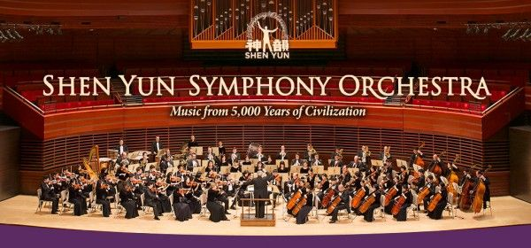
  

神韵交响乐团（神韵艺术团提供）

<a href="#2">➤“与宇宙相连”指挥家赞神韵交响乐宏大无比</a>

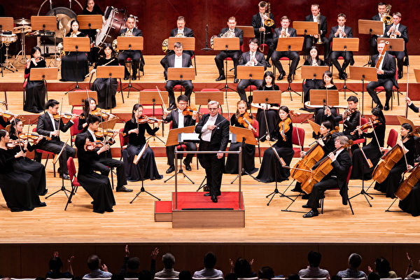
  

2019年9月23日午间，神韵交响乐团在台北国家音乐厅演出。（陈柏州／大纪元）

<a href="#1">➤知名乐评人：神进入神韵音乐 拯救人的灵魂</a>

<a href="https://youtu.be/1Oo4batsd7c">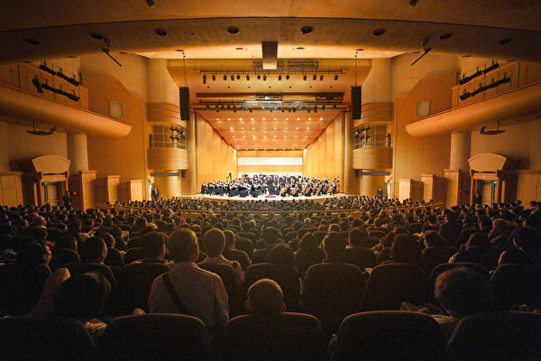</a>
  

2019年10月2日晚间，新竹市文化局演艺厅是神韵交响乐团2019年度在台湾的最后一场演出，演出出现爆满的盛况。（龚安妮／大纪元）

<a href="#3">➤11场连续大爆满 神韵交响乐台湾完美落幕</a>

  

  
<h2><a href="https://youtu.be/1Oo4batsd7c">【预告】新唐人圣诞、新年期间播放神韵交响乐</h2></a>

【大纪元2019年12月17日讯】2019年圣诞节和新年期间，新唐人电视台将独家播出《2018神韵交响乐团音乐会》，即分别在纽约、休斯顿、美西、大陆、欧洲频道播放。同时，新唐人网站（www.ntdtv.com）首页直播窗口和Roku也同步播放，时长90分钟。

神韵交响乐是风靡全球的神韵艺术团原创作品，结合了东西方正统音乐的精髓，以西方管弦乐为基奠烘托中国乐器的特色，再现中华音乐传统、重现失传的美声唱法，每年都推出全新的原创曲目，带给观众盛大的音乐飨宴，好评如潮。

 “神韵的音乐非常灿烂，散发一种能量的光芒。非常不寻常的正面能量，有一种解脱、很安详的气氛，让人回到了反璞归真的感觉。”被列于“牛津世界音乐名人录”的国际钢琴家宋允鹏赞道。

有着百年历史的罗曼德管弦乐团的首席小提琴家伯格丹‧兹沃特安卢（Bogdan Zvoristeanu）赞叹：“音乐极为感人，古今结合的乐器演奏将我们带入另外的时空，带到那遥远的、非常干净、非常纯洁、充满真相的地方。”

应观众要求，新唐人今年圣诞、新年期间将再次播出的《2018神韵交响乐团音乐会》，各频道播出时间：

 
<h2><a href="http://nn.epub.vin/sy">2019圣诞节期间  大陆播出时间</h2></a>

<table>
<tr>
	<td width="290">
日期</td>
  
	<td width="290">
时间</td>
  
	<td width="300">
备注</td>
  
</tr>
<tr>
	<td>
12/24/2019 周二  圣诞节</td>
 
	<td>
20:30</td>
 
	<td>
《2018神韵交响乐团音乐会》  首播</td>
 
</tr>
<tr>
	<td>
12/25/2019 周三  圣诞节</td>
 
	<td>
9:30</td>
 
	<td>
《2018神韵交响乐团音乐会》  重播</td>
 
</tr>

<tr>
	<td>
12/25/2019 周三  圣诞节</td>
 
	<td>
14:00</td>
 
	<td>
《2018神韵交响乐团音乐会》  重播</td>
 
</tr>

</table>
 

 
<h2><a href="http://nn.epub.vin/sy">2020新年期间  大陆播出时间</h2></a>

<table>
<tr>
	<td width="290">
日期</td>
  
	<td width="290">
时间</td>
  
	<td width="300">
备注</td>
  
</tr>
<tr>
	<td>
12/31/2019 周二  新年期间</td>
 
	<td>
20:00</td>
 
	<td>
《2018神韵交响乐团音乐会》  首播</td>
 
</tr>
<tr>
	<td>
1/1/2020 周三  新年期间</td>
 
	<td>
14:00</td>
 
	<td>
《2018神韵交响乐团音乐会》  重播</td>
 
</tr>

</table>
 

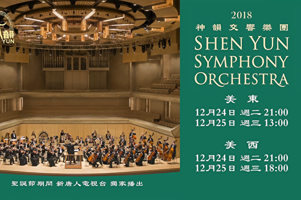
  

  

<h3><a href="http://nn.epub.vin/sy">中国大陆收视《2018神韵交响乐团音乐会》方法(一)</h3></a>
 

  

<h3 align="center"><a href="https://github.com/awwkk/usdom/blob/master/dong/Green_iPPOTV.exe?raw=true">◆ 可通过爱博电视收看新唐人中国频道，请选用中国频道400收看。◆ </h3</a>

	
<table>
<tr>
<td width="450"><a href="https://github.com/awwkk/usdom/blob/master/dong/Green_iPPOTV.exe?raw=true"><h5 align="center">爱博电视桌机版.下载  (完全免费 .安全. 无毒)</a></h4></td>

<td width="450"><a href="https://github.com/awwkk/usdom/blob/master/vidio/ippotvm.mp4?raw=true"><h5 align="center">爱博电视桌机板 (安裝教学).下载 </a></h4></td>
</tr>
</table>
   
  
 
  一款用于实时视频流共享的软件平台，高效稳定的视频传输技术带给用户崭新的视听体验。爱博电视具有突破封锁的得天独厚的优势。

  
  
 

  

  

  
<h4><a href="http://nn.epub.vin/sy">中国大陆收视《2018神韵交响乐团音乐会》方法(二)</h4></a>
 

<h3 align="center"><a href="http://nn.epub.vin/sy">◆ 可通过韩星五A号的新唐人中国频道收看</a></h3>

  

<h3>韩星5A号的播出参数</h3>

<table>	
<tr>
<td width="450">
参数</td>

<td width="440">
数值 </td>

</tr>
	
<tr>
	<td width="450">
Frequency(频率)</td>

	<td width="440">
12618 MHz(或取整数) </td>

</tr>
<tr>
	<td>
Pol(极化)</td>

	<td>
V(垂直)</td>

</tr>
<tr>
	<td>
Symbol Rate(符率)</td>

	<td>
03900 ks/s</td>

</tr>
<tr>
	<td>
纠错率: (FEC)</td>

	<td>
-1/2</td>

</tr>
<tr>
	<td>
Video PID（视频）</td>

	<td>
0512</td>

</tr>
<tr>
	<td>
Audio PID（音频）</td>

	<td>
4112</td>

</tr>
<tr>
	<td>
Clock PID（时钟）</td>

	<td>
0512</td>

</tr>
</table>
 

<h3>韩星5A号</h3>

因为韩星5号卫星寿命到期，其播出已经由韩星5A号接替。卫星位置和参数不变, 卫星接收天线不需要作任何调整。预计东北地区信号会有所增强，内陆部分地区信号会有所减弱。

谘询电话001-800-558-9045或电邮至feedback@ntdtv.com。

新唐人电视台 2018年9月16日

  
 

  

<h3><a href="http://kk.epub.vin/sy">中国大陆收视《神韵交响乐团》方法(三)</h3></a>
 

<h3><a href="http://kk.epub.vin/sy">◆ 请通过翻墙软件自由门、无界浏览或 iNTD TV 、爱博电视收看 ，并请锁定中国频道这个网址：ntdtv.com/gb/television  </a></h3>
 

   

 

<a href="https://github.com/sodore/dsds/blob/master/fonts.md"><h3>◆ 翻墙软件下载 (完全免费 .安全. 无毒)</a></h3>

<table>
<tr>
	
<td>
<a href="https://github.com/awwkk/usdom/blob/master/dong/fg--+769p.zip?raw=true"><h4 align="center">(自由门)桌机版 769p zip</a> </h4></td>
<td>
<a href="https://github.com/awwkk/usdom/blob/master/dong/fg++769++p.exe?raw=true"><h4 align="center">(自由门)桌机版 769p exe</a> </h4></td>

<td><a href="https://github.com/awwkk/usdom/blob/master/dong/fgma=3.2.apk?raw=true"><h4 align="center">(自由门)安卓版 3.2 apk</a></h4></td>
	
<td><a href="https://github.com/awwkk/usdom/blob/master/dong/u=19.02.zip?raw=true"><h4 align="center">(无界)桌机版 19.02 zip</a></h4></td>

<td><a href="https://github.com/awwkk/usdom/blob/master/dong/u=19.02.exe?raw=true"><h4 align="center">(无界)桌机版 19.02 exe</a></h4></td>

<td><a href="https://github.com/awwkk/usdom/blob/master/dong/um=4.6.apk?raw=true"><h4 align="center">(无界)安卓版4.6 apk</a></h4></td>
<tr>
<td><a href="https://github.com/awwkk/usdom/blob/master/dong/iNTD_TVsp1.apk?raw=true"><h4 align="center">新唐人电视 (安卓版)</a></h4></td>

<td><a href="https://github.com/awwkk/usdom/blob/master/dong/Green_iPPOTV.exe?raw=true"><h4 align="center">(爱博电视)桌机版</a></h4></td>

<td><a href="https://github.com/awwkk/usdom/blob/master/vidio/ippotvm.mp4?raw=true"><h4 align="center">爱博电视 (安裝教学)</a></h4></td>

</tr>
</table>
  

  

<a href="https://github.com/awwkk/usdom/blob/master/dong/iNTD_TVsp1.apk?raw=true"><h4 align="center">新唐人安卓版 iNTD TV 可以用于安卓机顶盒，平板电脑，和手机。在安装安卓版 iNTD TV 后，中国大陆用户无需借助翻墙工具，可以直接通过安卓版 iNTD TV 收看新唐人直播或点播节目。</a></h4>

  

<a href=#list><h4 align="right">回上方</a></h4>

 
<a name=1><h2>知名乐评人：神进入神韵音乐 拯救人的灵魂</h2>
 

  

2019年9月23日午间，神韵交响乐团在台北国家音乐厅演出。（陈柏州／大纪元）

【大纪元2019年09月24日讯】（大纪元台湾台北记者站报导）9月23日下午，享誉全球的神韵交响乐团来到台北国家音乐厅，为大台北政商、企业、艺文等各界名流带来温馨丰美的午后时光。神韵美妙乐音让满场观众为之陶醉，二首安可曲更将全场气氛带到最高点，观众起立鼓掌，欲罢不能。

知名音乐家、乐评人徐家元首度现场聆赏神韵交响乐，他盛赞：“这是我在台湾听过最好的乐团，觉得非常感动。”他同时感受到音乐中强大的神性力量，“就好像神活在我们人间的感觉。”

徐家元表示，神韵交响乐团水准很高，“有好的编曲，而且有国际级的音乐家，最好的指挥，然后他们的合奏能力很强，独奏家演奏得非常好，整体的气质很好，感染力很强。”

神韵交响乐的原创乐曲，根植于五千年文明，是神韵音乐获得巨大回响的关键因素。徐家元说，“原创的旋律很美，作曲家编曲，呈现出有东方味的西方交响曲，听了会让人很感动。”

“编曲把交响乐团的配器，乐器的特性表现得很好。”他说，“整个音乐轮转都很顺，再加上有各种民族乐器，二胡、琵琶跟锣鼓，气势很雄壮，婉转的时候很优雅，所以很感人，扣人心弦。”

徐家元特别赞赏指挥米兰‧纳契夫，“非常棒，炉火纯青，又有幽默感，他指挥得非常好，能带动整个乐团，把大家的心都聚在一起，很整齐划一。他的指挥动作非常潇洒，尤其是最后结尾那种感觉，会让你觉得很英俊潇洒。”

神韵交响乐团历年演出的CD早已广受爱乐人士喜爱，“我听过很多次录音，但是看现场觉得特别感动，现场的感动力是超过听录音的。”徐家元说。

<b>神进入神韵音乐 拯救人的灵魂</b>

徐家元也感受到，神韵动人的乐音中，具有强大的神性内涵，让他体悟到，“这个音乐是从信仰来的，作曲家的灵感来自于神性，神韵音乐的美，就好像神活在我们人间的感觉。”

他谈到更深一层的体会，“神有各种像会在人面前呈现，音乐就是一个像，神进入这个神韵音乐，让你感动，经由作曲家的作品，把神韵音乐创造出来。”

他说，在神韵音乐中，“我听到一种善良的心，就是一种同情心（慈悲心），对所有的生灵，在这个地球上，我感觉到这个。”

他并强调，“因为音乐是融合的，她（神韵音乐）有一种跟宇宙谐和的感觉，让我们人性跟神性能够合在一起，她带领人提升，还可以拯救人的灵魂。”

“因为这个音乐已经将东西方融合在一起了，所以我认为这音乐是对全世界的人都有感应的，也就是说，不分民族不分肤色，都可以感受到这个音乐（内涵）。”徐家元说。

<b>音乐家是真理的传递者 内外皆美</b>

徐家元提到，神韵音乐能感动人，除了音乐家本身高超的音乐素养和技巧，他认为和音乐家的修为也有关系。“所有的音乐家都是真理的传递者，我们（观众）是接受者。”

“他们的仪态都非常的好，走出来那种神态都特别好，外表也很美，内心也很美，所以是蛮特别的一个乐团，给人观感很好。”

他说，“那么多的国际音乐家他们都能够融入这个音乐，他们吹这个音乐的旋律都能够互相学习、互相映照，指挥可以把它都统合在一起，我认为他们大家有共同的信仰，才能做到这一点。”

<b>从微缩世界 看到宇宙之大</b>

神韵交响乐团今年巡演最新的原创曲目《康熙大帝》，让徐家元感受深刻，“这个曲子的结构比较大，她里面的旋律有很多是有一种中华民族满汉蒙回藏的音乐，还有宫廷音乐，不过因为她还有马背上的民族的味道，有北方游牧民族的味道。”

“当他进了中国、进了中原以后，她就有那种宫廷的味道，气势很庞大，就是有一种民族融合的感觉，还有版图很大的盛世的感觉。”

他说，这首曲子把康熙皇朝那个盛世完全展现出来了，“她的民谣素材取的很好，音乐是东方的感觉，东方音乐有她的文化底蕴，但是康熙那时候他已经有受到西方传教士的影响，所以也展现出东西融合的境界。”

徐家元最后推荐大家：“听过神韵的名字的人，应该来现场听这交响乐，一定要来现场听，她没有舞蹈也没有戏剧，就是要来听现场。”

他说：“台上交响乐是一个微缩的世界，但可以让你感觉到这个宇宙之大，所以没有来听过的，很推荐你一定要来听，你听了就会感动。”

责任编辑：于嫚

<a href=#list><h4 align="right">回上方</a></h4>

 
<a name=2><h2>“与宇宙相连”指挥家赞神韵交响乐宏大无比</h2>
 

 

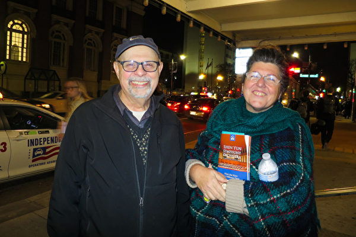

  
指挥家Arthur Comegno与友人Kathleen（护士）于10月25日晚，在波士顿交响乐厅，聆听了神韵交响乐团的音乐演奏会。（甄秀欣／大纪元）

 
  
【大纪元2019年10月26日讯】（大纪元记者甄秀欣美国波士顿报导）“神韵交响乐团宏大无比。”指挥家Arthur Comegno盛赞神韵交响乐团的音乐“神奇美妙”，他表示自己也想加入其中，共享音乐中的神性内涵。

神韵交响乐团于10月25日晚，在波士顿交响乐厅（Boston Symphony Hall）拉开了当地演出的序幕。指挥家Arthur Comegno与友人Kathleen当晚观看后非常的兴奋，他们在惊叹之余频频赞叹，Comegno说：“我觉得感受到内心的震撼，这是发自内心深处的感动。”

他感到神韵音乐具有神圣的启迪与宇宙相关，他认为，“音乐是有共性的”，在听到某些乐句时，Comegno有着独特的体验，“他们好像飞到了云端、飞向了神。特别是用弦乐器的比萨卡托（pizzicato，用指弹的拨奏曲），好似在战车上俯视战马，冲向天空。”他说，“有很多的爱和情感，我试图描绘——将每个曲目中的每个段落整合起来，太优美了！”

“我看到了神韵音乐与宇宙的相连，表现了爱、神性所有这些事情，我看到他们之间的连接。”他认为神韵交响乐团诠释了“一个非常好的理念”，“我希望回来再听一遍。”

Comegno有着丰富的指挥经验，指挥过许多大型音乐会，同时，他还做过专业小提琴手，培训过许多音乐人；他也是一名演员、导演，毕业于伊士曼音乐学院和哈佛大学。他从神韵音乐中看到了“西方音乐与亚洲音乐、中国音乐的结合”。他表示，“我也曾学过中国琴。我知道一些关于中国音乐的东西。”

他认为神韵交响乐团东西方合璧让整场音乐会中的乐声更加“美妙动听”，他觉得神韵“非常宏大”。“作为一个音乐家，我非常密切地看着交响乐团，数着七个低音演奏家、十个大提琴、十四个第一小提琴、十四个二级小提琴、中提琴，有趣的是，指挥有一个中提琴谱架，第一中提琴手的谱架。” Comegno娓娓道来。

“打击乐做了所有这些奇妙的事情，还有特殊的中国乐器。”他说，“我能说的最好的事情是：这是一场精彩的音乐会，我很惊讶和不知所措，所以我很高兴我来了。”

他赞叹神韵演奏家的技艺非凡，“哦，他们太棒了！我真的很喜欢他们。”

Kathleen也赞佩道：“神性贯穿在整个交响乐团，你能感觉到她。她美丽，令人沉思、反省，以及充满了能量活力。这是探索中国文化的另一部分。所以我很高兴我们今晚来了。”

责任编辑：夏晶

<a href=#list><h4 align="right">回上方</a></h4>

 
<a name=3><h2>“11场连续大爆满 神韵交响乐台湾完美落幕</h2>
 

  

2019年10月2日晚间，新竹市文化局演艺厅是神韵交响乐团2019年度在台湾的最后一场演出，演出出现爆满的盛况。（龚安妮／大纪元）

 

【大纪元2019年10月03日讯】（大纪元台湾新竹记者站报导）“安可、安可、安可、安可”全场观众有节奏性的鼓掌、呼喊，希望能再听一曲！2019年神韵交响乐团在台湾巡回演出的最后一站来到新竹市文化局演艺厅，演出结束后，观众起立鼓掌致敬，在两首安可曲后，全场观众仍意犹未尽，持续喊着“安可”、“Encore！”长达近10分钟的掌声，让全场气氛沸腾到最高点，最后艺术家们两次谢幕向观众致意，也为神韵交响乐团的压轴演出划下完美的句点。观众都说：“手都拍到好痛，但真的好好听、好过瘾！” 

今年是神韵交响乐团第四年在台湾巡回演出，在九大城市巡回11场演出，全台的售票率几乎百分百，再度创下场场大爆满的票房纪录！再次创下台湾艺文界票房奇迹，有知名艺文团体私下透过管道询问，“神韵到底是怎么办到的？”

神韵交响乐热在台湾持续发烧，最后一场更有许多观众不断致电主办方询问购票，主办方表示，“观众知道神韵交响乐的每张票都很珍贵，真的是一票难求了！”还有粉丝特地从高雄北上、台北南下，甚至远从印尼、香港、大陆等地慕名前来的观众也不在少数。散场时，观众各个笑开怀、赞不绝口，纷纷表示：“太精彩了！明年还要再来！”

 

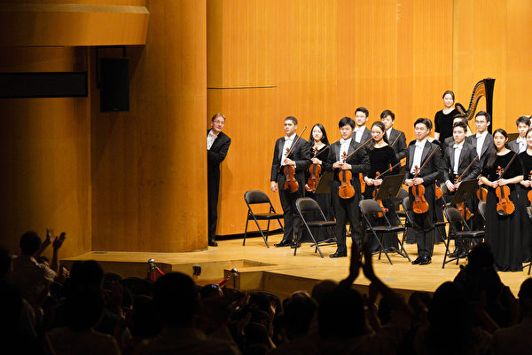

 
2019年10月2日晚间，神韵交响乐团在新竹市文化局演艺厅举行2019年度在台湾的最后一场演出，观众欢声雷动的掌声与安可声，让指挥迪密萃‧鲁苏偷瞄一下观众有多热情，逗得观众掌声更加热烈。（龚安妮／大纪元）

10月2日晚间，众多各地名流精英纷纷赶在最后一天入场观赏神韵交响乐，新竹县长杨文科、新竹市长林智坚、新竹市议会议长许修睿特致赠花篮祝贺演出成功。神韵音乐家高超卓越的艺术造诣，让走出剧院的精英们赞赏“犹如天籁之音”、“感受到天人合一的境界”、“有被宇宙拥抱的感觉”。

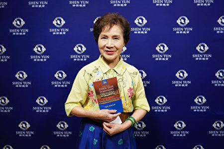

 
2019年10月2日晚间，前立法委员张蔡美观赏神韵交响乐团在新竹市文化局演艺厅的演出。（龚安妮／大纪元）

“今天总算圆梦了！”前立法委员张蔡美说，“已经向往这个演出三年了，这次运气好，总算可以观赏这个温馨又震撼的演出。”她说，一进神韵的会场就感觉很不一样，“从头到尾，我的情绪几乎跟着音符一起浮动。”她笑着指着她的脸，“我脸上这个光圈就是神韵团队带给我的。”

神韵交响乐东西乐器合璧的乐音也让张蔡美非常惊艳，“我也很惊讶很惊艳的一些事情，能够这样融合，真的很不容易，我觉得是创造者真的值得我们去敬佩。”她说，今晚的音乐会让她“满心喜悦”。

 
2019年10月2日晚间，立法委员林为洲观赏神韵交响乐团在新竹市文化局演艺厅的演出。（龚安妮／大纪元）

“今天可以静下心来听，真的很享受。”立法委员林为洲陶醉在神韵音乐中，静静地感受着玄妙能量，他赞赏神韵音乐是“天籁之音，非常悦耳，是全新的听觉飨宴”。

“我们从政者每天在立法院都是很紧绷、很紧张的，有时候甚至会有冲突。”他说，每天在这种生活之下，能有此机缘聆赏神韵音乐，“真的好像天籁之音一样，调剂我的身心。”

他赞叹道，神韵音乐能量很强，可以洗涤心灵，“音乐会净化人心，短暂休息之后可以重新面对自己，然后去思索很多内在的事情。”

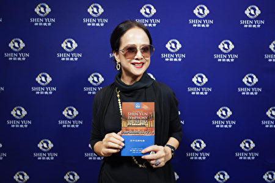

 
2019年10月2日晚间，艺人汤兰花观赏神韵交响乐团在新竹市文化局演艺厅的演出。（龚安妮／大纪元）

“我真的非常感动，（神韵音乐）从编曲到演奏的方式，都充满感情与东方的味道。”知名艺人汤兰花赞赏，“中国几千年的文化，通过音乐展现出来，这真的是美的飨宴，太棒了！”

汤兰花盛赞神韵让她领悟音乐的震撼，并带她进入一个新的层次，“她（神韵）让人提升到一个想听，能看到画面的层次，我感觉自己一直在提升。”眼睛刚动过手术的汤兰花说，她闭着眼睛仔细聆听，让她领悟音乐的震撼，并带她进入一个新的层次。

“神韵的水准真的很高。”她说，演出让她对音乐的感受度往上升华，这是一次相当美妙的学习经历，“我静静地听，好像看见了鸟儿在丛林里飞翔，好像看见一位穿着古装的古典美女，在树林里飘渺地出现。”

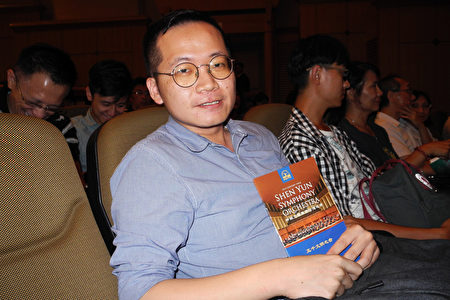

 
2019年10月2日晚间，知名音乐家、乐评人吴毓庭观赏神韵交响乐团在新竹市文化局演艺厅的演出。（龙芳／大纪元）

“这个乐团基本上有一种很明亮的感觉。”音乐家、知名乐评人吴毓庭赞赏神韵交响乐团，“无论是音色的选择或者力度的选择，都很有自信，很明亮。”他觉得，“神韵的特色来源于自信，给人很愉悦的感觉。”

神韵交响乐团今年巡演最新的原创曲目《康熙大帝》，让许多观众感动，吴毓庭则感受到一种力量，“一种不断一直堆叠的力量，然后所有的音乐家都是全神贯注，感觉他们已经到顶点，但是他们还可以再往前、往上推上去，还可以继续延伸、继续酝酿。”

他表示从中可以感受到这个团队背后的精神力量，“他们的意志力是很强的，他的精神是无限的。”他说，“这首让我感觉他们内心有无限的潜力，在这个音乐当中，他们也透过这个演出，发挥自己心里面的一种力量。”

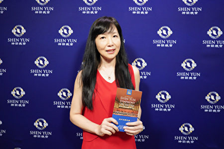

 
2019年10月2日晚间，风雅颂古筝乐团团长徐惠绮观赏神韵交响乐团在新竹市文化局演艺厅的演出。（龚安妮／大纪元）

“神韵像神仙的音乐一样，让我忘忧。”台湾知名的古筝演奏家、古筝乐团团长徐惠绮二度聆听神韵交响乐团赞赏，“我在神韵看到的一种精神吧！就是传递音乐，就算是听不懂、没有学过音乐的，不管是长者或者是年轻的小朋友。”她赞佩地说：“就是能够让大人、小孩听了都这么感动，这一点值得我们学习，能够让音乐做到这样的层次。”

她说，“我每次坐在台下听完之后，我觉得身心舒畅，全身非常的舒畅，就像人家讲的‘音乐丰富我们的心灵’，神韵真的让我有这种非常强烈的感觉。”

“在神韵台湾巡演九大城巿11场的演出中，今天最后一场我看到了，我觉得我很荣幸。”徐惠绮最后开心地说。

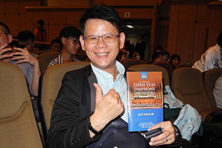

 
2019年10月2日晚间，国际生命线台湾总会副总会长、公司董事长陈宗圣观赏神韵交响乐团在新竹市文化局演艺厅的演出。（龙芳／大纪元）

“音乐充满生命力！”环保公司董事长、同时担任国际生命线台湾总会副总会长的陈宗圣说，“神韵不只是音乐，她还有很强的表现力和感染力！”整晚徜徉在曼妙旋律中，对神韵音乐创造出来的丰富意境，万分珍惜地使尽耳目感官所能去品味，他开心地笑说，“亮点很多，我今晚好忙啊！”

整场音乐会的压卷之作《康熙大帝》，令他深深折服，“我听到的是一种盛世，从争战的沙场到光荣凯旋，然后创造了一个人民祥和的局面，然后是一个非常‘盛世’ 的朝代，让人感受到那种（精神上的）振奋。” 他感动地说。

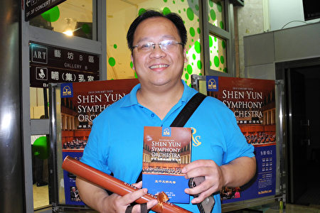

 
2019年10月2日晚间，建设公司执行长魏木忠观赏神韵交响乐团在新竹市文化局演艺厅的演出。（龙芳／大纪元）

 
 “神韵交响乐是中西合璧的天地音乐！”建设公司执行长魏木忠赞赏，“从至刚至柔的音乐中，我感受到天地交泰，天人合一的境界。”

“神之乐，神之韵，这一定是来自天上！”魏木忠以为，神韵乐章非等闲之作，不是人类的精心创制，这得天地共谱，人们经由神之启示，再由音乐家的虔心发想而成。

魏木忠表示，聆听神韵交响乐，是一段很特别的、难以形容的爱的体验过程，“在神韵音乐里，她有太多宇宙美好的元素，我感受到一种振奋、一种洗涤、一种启示，就在我们的内心涌动。”

“神韵交响乐是至刚、至柔的一种音乐，在这二者之间，撞击出的能量跟磁场，会让你看到那个善跟美的画面。”魏木忠说，“你所看到的那个景象，让你从一颗心、从一个念都感到很舒服，仿佛被拥抱——被我们这个宇宙（拥抱）。而我们，已然就此融合在一起了！”

 
 

 
2019年10月2日晚间，生物科技公司董事长陈良荣观赏神韵交响乐团在新竹市文化局演艺厅的演出。（龚安妮／大纪元）

 
 生物科技公司董事长陈良荣首次观赏神韵交响乐的演出，“真的很震撼，东西方乐器融合在一起，配得非常的完美，而且非常雄伟，尤其最后一首《康熙大帝》，非常澎湃，很壮观。”

陈良荣非常佩服作曲家，“作曲做得非常好，把中西这个乐器很顺地交融在一起，这是不容易的。”他希望没有听过神韵交响乐的朋友不要错过，“会让你觉得东方的美学跟西方的美学交融在一起，迸出来的火花，令人印象深刻。”

 
 

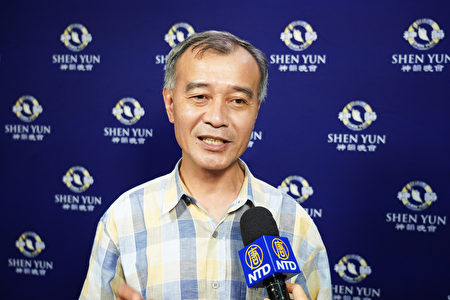

 
2019年10月2日晚间，新竹县建筑师公会理事长林清恕观赏神韵交响乐团在新竹市文化局演艺厅的演出。（龚安妮／大纪元）

 
 “非常厉害，那个作曲家真的很厉害！”新竹县建筑师公会理事长林清恕说，一般的交响乐都是西方乐器，可是神韵交响乐可以把西方、东西的乐器融合，“结合得那种妙，可以说是无缝接轨。”他赞叹地说，神韵音乐可以表现康熙皇朝的磅礴气势，“那种盛世的画面，感觉我就坐在皇宫里”，又可以表现《彝舞倩妹》那种在山林里跳舞的画面，“整个曲风完全是传统的中国味，编曲真是厉害！”

“太完美了！”林清恕说，平常大家都忙，很少有休闲娱乐，聆赏神韵交响乐让他很重拾传统文化的美好记忆，“传统的文化，这个社会已经好像很久没有感受到这种东西，尤其这个时代已经不一样，以前我们的教育是比较接受到传统的历史文化，现在社会好像很少，这方面越来越弱了。这乐音会让人怀念那些传统的文化。”

 
  

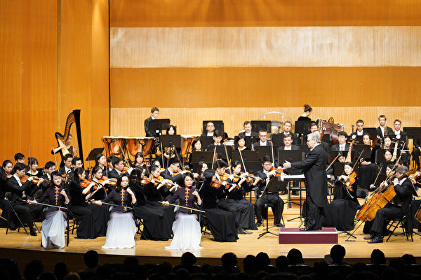

 
2019年10月2日晚间，神韵交响乐团在新竹市文化局演艺厅演出，前排为二胡演奏家戚晓春（左）、王真（中）、琴露（右）。（龚安妮／大纪元）

 

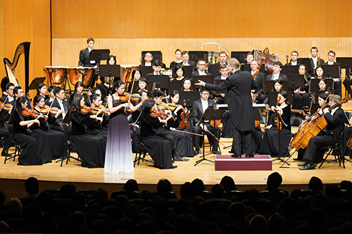

 
2019年10月2日晚间，神韵交响乐团在新竹市文化局演艺厅演出，图为小提琴独奏家郑媛慧。（龚安妮／大纪元）

 

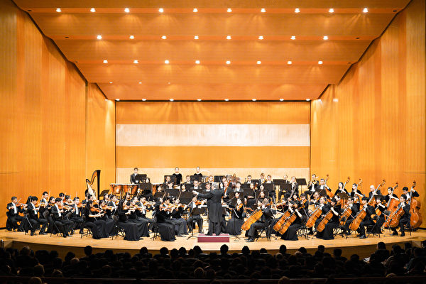

 
2019年10月2日晚间，神韵交响乐团在新竹市文化局演艺厅演出。（龚安妮／大纪元）

 
 

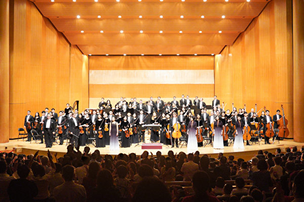

 
2019年10月2日晚间，神韵交响乐团在新竹市文化局演艺厅演出的谢幕。（龚安妮／大纪元）

 
 责任编辑：夏晶 #

 
 
 

 

  

