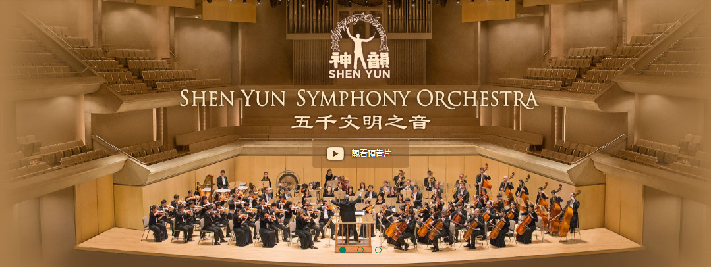

  

  

 
<h2><a href="http://36.228.2.212"> 观看更多影片  http://36.228.2.212  </h2></a>

 
<h3><a href="https://youtu.be/1Oo4batsd7c">请大家告诉大家，错过可能得等一年！</h3> 

 

 2019年圣诞节和新年期间，新唐人电视台将独家播出《2018神韵交响乐团音乐会》。（新唐人）

  
  
<h2><a href="https://youtu.be/1Oo4batsd7c">【预告】新唐人圣诞新年期间播放神韵交响乐</h2></a>

【大纪元2019年12月17日讯】2019年圣诞节和新年期间，新唐人电视台将独家播出《2018神韵交响乐团音乐会》，即分别在纽约、休斯顿、美西、大陆、欧洲频道播放。同时，新唐人网站（www.ntdtv.com）首页直播窗口和Roku也同步播放，时长90分钟。

神韵交响乐是风靡全球的神韵艺术团原创作品，结合了东西方正统音乐的精髓，以西方管弦乐为基奠烘托中国乐器的特色，再现中华音乐传统、重现失传的美声唱法，每年都推出全新的原创曲目，带给观众盛大的音乐飨宴，好评如潮。

 “神韵的音乐非常灿烂，散发一种能量的光芒。非常不寻常的正面能量，有一种解脱、很安详的气氛，让人回到了反璞归真的感觉。”被列于“牛津世界音乐名人录”的国际钢琴家宋允鹏赞道。

有着百年历史的罗曼德管弦乐团的首席小提琴家伯格丹‧兹沃特安卢（Bogdan Zvoristeanu）赞叹：“音乐极为感人，古今结合的乐器演奏将我们带入另外的时空，带到那遥远的、非常干净、非常纯洁、充满真相的地方。”

应观众要求，新唐人今年圣诞、新年期间将再次播出的《2018神韵交响乐团音乐会》，各频道播出时间：

 
<h2><a href="http://nn.epub.vin/sy">2019圣诞节期间  大陆播出时间</h2></a>

<table>
<tr>
	<td width="290">
日期</td>
  
	<td width="290">
时间</td>
  
	<td width="300">
备注</td>
  
</tr>
<tr>
	<td>
12/24/2019 周二  圣诞节</td>
 
	<td>
20:30</td>
 
	<td>
《2018神韵交响乐团音乐会》  首播</td>
 
</tr>
<tr>
	<td>
12/25/2019 周三  圣诞节</td>
 
	<td>
9:30</td>
 
	<td>
《2018神韵交响乐团音乐会》  重播</td>
 
</tr>

<tr>
	<td>
12/25/2019 周三  圣诞节</td>
 
	<td>
14:00</td>
 
	<td>
《2018神韵交响乐团音乐会》  重播</td>
 
</tr>

</table>
 

 
<h2><a href="http://nn.epub.vin/sy">2020新年期间  大陆播出时间</h2></a>

<table>
<tr>
	<td width="290">
日期</td>
  
	<td width="290">
时间</td>
  
	<td width="300">
备注</td>
  
</tr>
<tr>
	<td>
12/31/2019 周二  新年期间</td>
 
	<td>
20:00</td>
 
	<td>
《2018神韵交响乐团音乐会》  首播</td>
 
</tr>
<tr>
	<td>
1/1/2020 周三  新年期间</td>
 
	<td>
14:00</td>
 
	<td>
《2018神韵交响乐团音乐会》  重播</td>
 
</tr>

</table>
 

<h3><a href="http://nn.epub.vin/sy">中国大陆收视《2018神韵交响乐团音乐会》方法(一)</h3></a>
 

  

<h3 align="center"><a href="https://github.com/awwkk/usdom/blob/master/dong/Green_iPPOTV.exe?raw=true">◆ 可通过爱博电视收看新唐人中国频道，请选用中国频道400，收看《2018神韵交响乐团音乐会》◆ </h3</a>

	
<table>
<tr>
<td width="450"><a href="https://github.com/awwkk/usdom/blob/master/dong/Green_iPPOTV.exe?raw=true"><h4 align="center">爱博电视桌机版.下载  (完全免费 .安全. 无毒)</a></h4></td>

<td width="450"><a href="https://github.com/awwkk/usdom/blob/master/video/ippotvm.mp4?raw=true"><h4 align="center">爱博电视桌机板 (安裝教学).下载 </a></h4></td>
</tr>
</table>
   
  
 
  一款用于实时视频流共享的软件平台，高效稳定的视频传输技术带给用户崭新的视听体验。爱博电视具有突破封锁的得天独厚的优势。

    
  
  

  

  
<h4><a href="http://nn.epub.vin/sy">中国大陆收视《神韵晚会》方法(二)</h4></a>
 

<h3 align="center"><a href="http://nn.epub.vin/sy">◆ 可通过韩星五A号的新唐人中国频道收看《2018神韵交响乐团音乐会》</a></h3>

  

<h3>韩星5A号的播出参数</h3>

<table>	
<tr>
<td width="450">
参数</td>

<td width="440">
数值 </td>

</tr>
	
<tr>
	<td width="450">
Frequency(频率)</td>

	<td width="440">
12618 MHz(或取整数) </td>

</tr>
<tr>
	<td>
Pol(极化)</td>

	<td>
V(垂直)</td>

</tr>
<tr>
	<td>
Symbol Rate(符率)</td>

	<td>
03900 ks/s</td>

</tr>
<tr>
	<td>
纠错率: (FEC)</td>

	<td>
-1/2</td>

</tr>
<tr>
	<td>
Video PID（视频）</td>

	<td>
0512</td>

</tr>
<tr>
	<td>
Audio PID（音频）</td>

	<td>
4112</td>

</tr>
<tr>
	<td>
Clock PID（时钟）</td>

	<td>
0512</td>

</tr>
</table>
 

<h3>韩星5A号</h3>

因为韩星5号卫星寿命到期，其播出已经由韩星5A号接替。卫星位置和参数不变, 卫星接收天线不需要作任何调整。预计东北地区信号会有所增强，内陆部分地区信号会有所减弱。

谘询电话001-800-558-9045或电邮至feedback@ntdtv.com。

新唐人电视台 2018年9月16日

  
 

 

<h3><a href="http://kk.epub.vin/sy">中国大陆收视《神韵交响乐团》方法</h3></a>
 

<h3><a href="http://kk.epub.vin/sy">◆ 请通过翻墙软件自由门、无界浏览或 iNTD TV 、爱博电视收看 ，并请锁定中国频道这个网址：ntdtv.com/gb/television  </a></h3>
 

   

 

<a href="https://github.com/sodore/dsds/blob/master/fonts.md"><h3>◆ 翻墙软件下载 (完全免费 .安全. 无毒)</a></h3>

<table>
<tr>
	
<td>
<a href="https://github.com/awwkk/usdom/blob/master/dong/fg--+769p.zip?raw=true"><h4 align="center">(自由门)桌机版 769p zip</a> </h4></td>
<td>
<a href="https://github.com/awwkk/usdom/blob/master/dong/fg++769++p.exe?raw=true"><h4 align="center">(自由门)桌机版 769p exe</a> </h4></td>

<td><a href="https://github.com/awwkk/usdom/blob/master/dong/fgma=3.2.apk?raw=true"><h4 align="center">(自由门)安卓版 3.2 apk</a></h4></td>
	
<td><a href="https://github.com/awwkk/usdom/blob/master/dong/u=19.02.zip?raw=true"><h4 align="center">(无界)桌机版 19.02 zip</a></h4></td>

<td><a href="https://github.com/awwkk/usdom/blob/master/dong/u=19.02.exe?raw=true"><h4 align="center">(无界)桌机版 19.02 exe</a></h4></td>

<td><a href="https://github.com/awwkk/usdom/blob/master/dong/um=4.6.apk?raw=true"><h4 align="center">(无界)安卓版4.6 apk</a></h4></td>
<tr>
<td><a href="https://github.com/awwkk/usdom/blob/master/dong/iNTD_TVsp1.apk?raw=true"><h4 align="center">新唐人电视 (安卓版)</a></h4></td>

<td><a href="https://github.com/awwkk/usdom/blob/master/dong/Green_iPPOTV.exe?raw=true"><h4 align="center">(爱博电视)桌机版</a></h4></td>

<td><a href="https://github.com/awwkk/usdom/blob/master/video/ippotvm.mp4?raw=true"><h4 align="center">爱博电视 (安裝教学)</a></h4></td>

</tr>
</table>
  

  

<a href="https://github.com/awwkk/usdom/blob/master/dong/iNTD_TVsp1.apk?raw=true"><h4 align="center">新唐人安卓版 iNTD TV 可以用于安卓机顶盒，平板电脑，和手机。在安装安卓版 iNTD TV 后，中国大陆用户无需借助翻墙工具，可以直接通过安卓版 iNTD TV 收看新唐人直播或点播节目。</a></h4>

  

 

  

