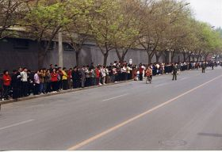

<a name=list><b>目录</b>
<table>
 
<tr>
<td width=900>
<a href="#0">➤ 纽约学员中领馆前纪念四·二五</a></td></tr> 
 
<tr>
<td width=900>
<a href="#1">➤ 纽约盛大游行纪念四·二五 民众感佩</a></td></tr>
 
<tr><td width=900>
 <a href="#2">➤ 台北千人集会炼功纪念四·二五（图）</a></td></tr>

<tr><td width=900>
 <a href="#3">➤ 新加坡学员纪念4·25和平上访20周年
</a></td></tr>

<tr><td width=900>
 <a href="#4">➤ 多伦多学员纪念四·二五　政要到场支持(图)
</a></td></tr>

<tr><td width=900>
 <a href="#5">➤ 承接平和力量 传播真相传递希望
</a></td></tr>

<tr><td width=900>
 <a href="#6">➤ 中领馆前反迫害　马来西亚学员纪念四·二五
</a></td></tr>

<tr><td width=900>
 <a href="#7">➤ 西班牙法轮功学员呼吁制止迫害、法办元凶（图）
</a></td></tr>

<tr><td width=900>
➤ 迫害法轮功是死路 明白真相是生路 https://git.io/tr 
</td></tr>

<tr><td width=900>
 <a href="#8">➤ 芝加哥学员纪念四·二五和平上访二十周年
</a></td></tr>

<tr><td width=900>
 <a href="#9">➤ 参与各种迫害法轮功学员的事件，自己得承担罪责，冤判的“判决书”就是你的签名。
</a></td></tr>

<tr><td width=900>
 <a href="#10">➤ 报应如响，天无妄降之灾。
</a></td></tr>

<tr><td width=900>
 <a href="#11">➤ 迫害法轮功的急先锋 相继落马 报应已然现前
</a></td></tr>

<tr><td width=900>
 ➤ 迫害大法弟子遭恶报   https://git.io/Eph
</a></td></tr>

<tr><td width=900>
 <a href="#12">➤ 将功补过，为自己的未来预留后路。
</a></td></tr>

<tr><td width=900>
 <a href="#13">➤ 国际社会强烈谴责 中共活摘良心犯器官罪行
</a></td></tr>

<tr><td width=900>
➤ 海外三退大潮 https://git.io/zbdodo
</a></td></tr>
</table>

<a href=#list><h4 align="right">回目錄</a></h4>

<a name=0><h2 align="center">纽约学员中领馆前纪念四·二五</a></h2>
【明慧网二零一九年四月二十四日】二零一九年四月二十日，夜幕低垂之时，纽约部份法轮功学员在纽约中领馆前，举行烛光夜悼活动，纪念“四二五”上万名法轮功学员和平上访二十周年，悼念因坚持真、善、忍信仰而被迫害致死的法轮功学员，同时呼吁国际社会共同解体中共，停止迫害。

 

 

图1～5：二零一九年四月二十日傍晚，纽约部份法轮功学员在纽约中领馆前，举行烛光夜悼活动。当天下午六时许，法轮功学员开始集体炼功，场面庄严祥和。

图6～8：华灯初上时，学员们手捧莲花灯，神情肃穆，默默哀悼被中共迫害致死的同修。

据明慧网报导，过去二十年中，通过突破重重封锁能够获悉的、有名有姓被迫害致死的法轮功学员有4296人。

在夜幕中，法轮功学员韩雨手举莲花灯，神情哀伤，她的父亲韩俊清于二零零四年五月四日被非法抓捕关押迫害三个月后撒手人寰，遗体在火化前，韩雨看到爸爸的脸上有许多伤痕，左眼底下的组织不见了，她的姑姑和她的叔叔在公安的严密监视下，还是把韩俊清衣服解开了，看到刀口一直开到肚子，他们用手压她爸爸的肚子，发现里面根本没有内脏，全是冰块……那天房山区上百个警察在旁边监视，并强行命令不准带相机、不准请记者，看完强行送去火葬场进行火化。

图9：当天活动中，部份法轮功学员面对街对面的中领馆，打出“法办江泽民”、“停止迫害法轮功”等抗议横幅；来自长春的法轮功学员，打出标语，要求中共当局立即释放目前被关押的长春法轮功学员李晶、穆君奎。

图10：来自山东的法轮功学员张袆（中间穿黄衣者）的母亲张爱丽，自去年十一月起被非法关押在看守所迄今，他要求中共立即无罪释放他的母亲。

<b>上访亲历者忆当年</b> 

当年曾参加“四·二五”上访的法轮功学员李殿琴表示，当时上万名法轮功学员，是抱着信任政府的诚意和澄清误解的心愿，自发地来到国务院和平理性、合法上访，没有喧哗没有吵闹声，更没有口号、标语，告诉政府法轮功对社会、对人民有百利而无一害，离开时他们连地上的垃圾都带走。她说当时她看到，一个女警察把手下警察都叫过来说：“你们往地上看看，这就是德。”

图11～12：当年“四二五”上访，站在北京府右街西侧便道上的上访的法轮功学员。

另一位当年参加“四·二五”和平上访的法轮功学员田天表示，当时上访的学员非常安静有序，还有人自发维持现场秩序，连附近的公共厕所里，都有同修在自愿地维护秩序和打扫现场卫生，这是修炼人发自内心的严格自律，以及不约而同所表现出来的对大法坚定维护的心。虽然迫害持续了二十年，但是中国大陆大法弟子对信仰始终坚定不移。

法轮功学员孔维京表示，整整十几个小时，无论是在府右街、文津街、西安门、北海还是长安街等，上万名法轮功学员和平地表达维护大法的心声，离去后，没有留下一张纸片，连执勤警察扔的烟头都给捡起来了，法轮功学员从大法“真善忍”中所修炼出来的非凡勇气和心性境界，铸就人类道德的丰碑。然而，江泽民以其卑劣至极的小人之心、妒嫉之心发动了空前残酷的迫害运动，把中华民族拖入到最黑暗的历史阶段。

<b>民众：这些人的抗议场面如此平静与平和</b> 

哈德逊河畔，不少民众被法轮功学员慈悲、感人的氛围所吸引。一位MTA的工作人员拿过法轮功的简介，并感动地说，“这些人的抗议场面如此平静与平和。”

图13：路人正在了解真相

图14：执勤警察接过法轮功学员赠送的“法轮大法好”的小莲花，表示他们都知道法轮大法好，都知道共产党迫害法轮功。

一名在耶鲁大学就读的华人学生，看到了夜悼的情景，倾听法轮功学员讲述的真相，同意以“光明”为化名，退出曾经加入过的共青团。

<a href=#list><h4 align="right">回目錄</a></h4>
   

<a name=1><h2 align="center">纽约盛大游行纪念四·二五 民众感佩</a></h2>

【明慧网二零一九年四月二十二日】二零一九年四月二十日中午，纽约法拉盛，上千名法轮功学员举行了盛大的游行集会，纪念法轮功学员“四·二五”和平上访二十周年，并声援三亿三千多万中国人退出中共的党、团、队组织。

  

  

图1：上千名法轮功学员在纽约法拉盛举行盛大游行，纪念“四·二五”和平上访二十周年。

  
  

  

图2：法轮功学员在纽约法拉盛举行集会，纪念 “四·二五”和平上访二十周年

  
  当天早上一直下雨，在游行开始前一小时雨水戛然而止，天空放晴，人们涌上街头。缅街最热闹的街面上，法轮大法的旗帜迎风飘扬，学员们个个精神抖擞容光焕发。沿途观看的民众，为游行队伍的壮观所震撼，更为法轮功学员风雨二十载，勇气正信不变感到敬佩。有的当场流泪，对着记者的镜头说，“法轮大法好，这场迫害应该停止了。”

<b>游行队伍声势浩大</b> 
  
  

  

  
  

  

  
  

  

  
  

  

  
   

  

  
  

  

  
  

  

  
   

  

   
图3～10：法轮功学员在纽约法拉盛举行大游行，纪念 “四·二五”和平上访二十周年。

  

  游行队伍分成三大方阵：“法轮大法好”、“停止迫害法轮功”以及“声援三亿多勇士退出中共”。 

法拉盛中心最繁华的缅街上，十二点准时，“天国乐团”奏响了游行的号角，演奏了《法轮大法好》、《神圣的歌》、《法鼓法号震十方》等多首经典曲目。紧随其后的是中英文《转法轮》书模、巨型法轮图形、花车、法轮功功法演示队、舞龙队、舞狮队、小花船队、腰鼓队、旗阵、中英文横幅队……传递着“法轮大法好”、“世界需要真善忍”的福音以及反迫害、解体中共的真相。 

法轮功学员打出“坚守真善忍铸就道德丰碑”、“法轮功反迫害二十周年”、“解体中共结束迫害”、“三退顺天神灵护，九评进户福德随”等横幅。街道两旁的民众、包括维安的警察，纷纷接过法轮功学员派发的“法轮大法好”小莲花。

游行队伍所到之处，街上的民众目不转睛地观看，被法轮功学员身上散发的浩然正气和慈悲的能量场所笼罩和感染，很多人用手机拍照摄像。并且踊跃发声，支持法轮功。

<b>民众：我们支持真善忍　支持正义</b> 

原来在中国官方大媒体工作的刘女士，是大陆共产党家庭的红二代。她表示，她原来对法轮功不太了解，但是在二零零八年法拉盛图书馆门前亲眼看到共产党派出的一伙人打法轮功学员，而法轮功学员并没有还手，她说，相比之下，谁是善良的谁是邪恶的，一目了然。

看到这么多法轮功学员出来游行，她感到很震撼，“前几年法拉盛的五毛很多，但是今天你看，支持的人、看游行的人多很多了。其实中国人心里都有一杆秤，就是在国内被共产党统治怕的，有一种恐惧的心理。我没想到法轮功这么多人，我感到很震撼。我们支持真善忍，我们支持正义！”

看到街道一侧手里举着邪党血旗的几个人，她非常气愤。因为她有时候给政府做翻译，知道这些人的底细。“他们很多都是以政治庇护申请留在美国的，现在却替共产党干事；还有一些是五毛，共产党的代理人，他们都是邪恶的坏人！美国原来在奥巴马、希拉里治下就是太左了，对这些人太宽容了，现在川普正在拨乱反正。快让FBI来查查这些人的底细，一查一个准，把他们遣送回国，让他们到中国举红旗去！”

在山东媒体工作的刘先生从外州来，第一次看到法轮功的游行，一直用手机录像。“我很激动！这是国内看不到的。我支持善良的人，因为法轮功信仰真善忍，我一直支持他们。”

<b>民众落泪：法轮功一定是最好的</b> 

西语裔民众埃利亚娜·萨希克斯（Eliana Sasics）对着新唐人电视台的镜头，流着眼泪说，“我希望全球的民众都能听到（法轮功）的声音，这是很重要的。迫害不应该在世界上发生，不应该在中国发生。对人权的虐待持续了这么多年，我们在美国有平静的生活，但是在中国发生着残忍的迫害。因为法轮功学员受到迫害，我的心很痛。”

第一次看游行的李女士声音哽咽地说，“对于中共迫害法轮功学员，我很难受。我看着这队伍都想哭了，法轮功学员这么长时间还能坚持反迫害，很感谢，很震撼。”她又说法轮功是最好的，“法轮功受迫害这么长时间，现在还这么多人在学，而且还越来越壮大，说明（法轮功）一定是最好的。

  
   

  

   
图11：李先生说，“法轮功被中共迫害，他们很不容易，我同情法轮功。”

  

  
  李比尔（Bill）先生说，自己因在大陆从事民主运动，被国安“请喝茶”。他说，法轮功学员在中国被迫害，他们很不容易。他同情法轮功，“共产党宣传的东西我们都不相信”，“如果中国信仰自由，谁愿意背井离乡呢？”

  
   

  

   
图12：陈先生说，他曾亲眼目睹了自己修炼法轮功的同事所遭受的迫害。”

  

  
  曾经在大陆“无锡造船厂”工作的陈先生眼睛湿润地说，“今年看了好激动，哭了，（他们）把法轮功的正气拿出来了。”他又说，当年无锡造船厂有几十人炼法轮功，他亲眼目睹了自己的同事所遭受的迫害，“有一个领导被打残了，他们把他关进监狱，后半生只能爬着走。还有的明明是好好的人被他们（中共）弄得呆呆傻傻的，不正常了。不让人说法轮功好，说好就打……单位的人都知道，都知道法轮功好，他们都偷偷地炼。现在的老百姓都不入党。”“他们（中共）为什么把法轮功（学员）迫害成这样？没有道理的事情。在这里我可以讲这些发生的事实，在大陆可不能讲，共产党抓你、整死你。”“共产党不下台，它就要迫害这些好人。” 

<b>民众：法轮功创造了一个奇迹</b> 

高女士在路边用一只手举着手机拍游行，一只手竖起大拇指，嘴里赞叹：“太壮观了！太震撼了！” 

观众陈先生说，他们（法轮功）很棒，体现中华民族传统。 

刚从中国来到美国的王清营说，第一次看到法轮功的游行和集会，“从来没有见过有这么多中国人反对共产党的。共产党是魔鬼，人类历史最邪恶的组织。古今中外没有一个组织干尽这么多坏事，屠杀成千上万的中国人。”他又说，“真正在海外形成规模的唯有法轮功，法轮功创造了一个奇迹，我最佩服！”

<b>“四·二五”和平上访　铸就道德丰碑</b> 

一九九二年五月法轮功传出后，神奇的祛病健身效果、注重道德和心性的修炼，使其在很短的时间内以“人传人、心传心”的方式，迅速传遍中华大地，到一九九九年已有上亿中国人在学炼。 

一九九九年四月，前政法委书记罗干的连襟、“科痞”何祚庥在杂志上发表了诬蔑法轮功的文章，天津的一些法轮功学员从四月十八日开始，前往天津教育学院向发表污蔑文章的杂志编辑部交涉和反映实情。但天津当局出动武警殴打法轮功学员，并抓捕了四十五人。为此，法轮功学员在四月二十五日到中南海附近（府右街）的国务院信访办公室和平上访，要求合法、宽松的修炼环境。 

上访的法轮功学员没有口号，没有标语，没有过激的行为，出于对政府的信任，平和理性去反映情况。当时的国务院总理朱镕基见状后，安排国务院信访局的官员与法轮功学员代表展开了对话。四月二十五日晚上，在获悉被抓的法轮功学员获释后，上访的法轮功学员迅速地离去。他们以修炼出来的高尚道德准则，以及为别人着想的心要求自己，他们离去时，地上干干净净，一片碎纸片也没有留下，连警察丢弃的烟头都捡起来带走。

“四·二五”和平上访，开创了中国政府首次和民众和平对话、解决分歧的先河。同时，法轮功学员为捍卫信仰所展现出的非凡道德勇气，铸就了一座永恒的道德丰碑。
  
 
  
  <a href=#list><h4 align="right">回目錄</a></h4>
  
  

<a name=2><h2 align="center">台北千人集会炼功纪念四·二五（图）</a></h2>
【明慧网二零一九年四月二十二日】（明慧记者郑语焉、黄宇生、沈容台湾台北报道）二零一九年四月二十一日，北台湾地区一千二百名法轮功学员，在台北市政府前的市民广场举行记者会和集体炼功，纪念“四·二五”法轮功学员和平上访二十周年，揭露中共残酷迫害的恶行及其邪恶本质，呼吁社会各界及联合国等国际组织持续关注中共对人权的迫害，制止迫害。

  
  

  
  

  
  

  
  

  
   

图1～4：逾千名法轮功学员于台北市民广场集会炼功，纪念“四·二五”上访二十周年。

  
  多位议员到场支持当天的活动，严厉谴责中共暴行，呼吁世人、尤其是生活在自由地区的台湾人认清中共谎言，千万不要对中共存有任何幻想。他们并对法轮功学员多年来坚毅卓绝的和平理性讲真相的风范，表达钦佩与敬意。

  
  

  
   

图5：台湾法轮大法学会理事长张锦华呼吁世人认清共产专政的邪恶本质。

  
  集会上，台湾法轮大法学会理事长张锦华表示，四·二五事件在世人眼前，所展现出的理性平和与道德文明，受到国内外一致肯定和赞扬。但不幸的是，中共党𣁽江泽民竟将和平上访歪曲造谣为“围攻中南海”，并发动党政暴力机器，滥权抓捕、酷刑迫害，无法无天的程度，国际社会已通过多项宣言或法案严辞谴责。

张锦华沉痛地说，二十年来，成千上万的法轮功学员失去亲人、健康、家庭、甚至生命，但依旧坚守真、善、忍的精神，理性、和平、勇敢地揭露迫害，呼吁世人认清共产专政的邪恶本质。她强调：“中共不等于中国，反共不等于反中，让我们持续的坚守慈悲良善，不断的揭露中共谎言，告诉世人真相。”

<b>市议员张茂楠：法轮功的精神值得大家实践</b> 
  
   

  
   

图6：台北市议员张茂楠强烈谴责中共暴行，并对法轮功学员表达敬意。

  
  台北市议员张茂楠首先对法轮功学员的勇气表达肯定与感谢，他说：“我与法轮功学员心中都流着正气与坚持的血，二十年来如果没有正气、坚持，我们没有办法走到今天。”张茂楠表示法轮功学员充满正气，没有违反任何国家的法令，却受到酷刑和虐杀，甚至被活摘器官。他对中共违反人权民主的作法，企图利用暴力政权无所不用其极的打压，予以强烈谴责，并称中共是“最烂的政权”。

张茂楠认为法轮功的精神值得大家去实践，在全球各地都不容许中共利用暴政企图消灭、抹黑法轮功。他并对法轮功表达十二万分的敬意，承诺明年、后年、每一年都会用行动来支持，和法轮功学员一起坚持往前走。

<b>市议员洪健益：无惧暴政　一定和法轮功站在一起</b> 
  
  

  
   

图7：台北市议员洪健益谴责中共罪行，呼吁国际关注中国人权问题。

  
  担任民意代表十三年的台北市议员洪健益表示，法轮功遭受迫害已二十年，今年是他第十二年参加制止迫害的集会活动。他谈到，中共默许活摘器官的存在，完完全全漠视人权，相较之下，台湾的民主、人权、自由非常可贵。法轮功学员之所以站在这里，无非是坚持正确的理念和信仰，让来自全世界的游客，特别是大陆旅客，认清中共根本毫无人权可言。

洪健益呼吁，我们要让全世界都知道中共漠视人权，甚至活摘器官残害生命。他表示自己对中共暴政无所畏惧，一定和法轮功学员站在一起！也希望更多朋友能站出来支持法轮功，共同谴责江泽民、谴责中共。

<b>新竹县议员余筱菁：千万不要对中共存有任何幻想</b> 
  
   

  
   

图8：新竹县议员余筱菁远道而来声援，呼吁勿对中共抱存任何幻想。

  
  新竹县议员余筱菁远赴而来，她说：“二十年前的和平上访，换来的却是中共大规模抓捕法轮功学员，使非常多的家庭失散、非常多的孩子没有家。”她呼吁：“在台湾享受自由民主空气的人们，千万不要对中共存有任何幻想。”

余筱菁表示法轮功学员一直在台湾和全世界扮演安定社会力量的角色，她要献上最高敬意：“法轮功学员在中共压迫之下，持续以和平、非暴力的方式说出真相，体现出慈悲与宽容。我希望受难者早日得救，也希望信仰自由的那一天早点来临。在台湾这片民主自由的土地上，我们会永远守护大家。”

<b>大陆游客明真相</b> 
  
  

  
   

  
   

  
  

 
  

 
  

 
 

 
  

 
  

  

图9～17：大陆游客为法轮功学员集会场景所吸引，不少人拍照摄影。

 
 法轮功学员集会炼功的场面庄严殊胜又祥和，深深吸引过路行人和旅客的目光，有的驻足、有的举起手机拍照，也有的在展板前细阅真相。一团接着一团的中国游客，有的打从国父纪念馆景点出来，经过市民广场走向距离不远的台北101大楼景点，有的则是从101大楼往国父纪念馆方向而来，看到集会场景惊呼：“法轮功！”不少人感叹这里真自由。许多人拿起相机拍摄或录像，即使队伍中有人嚷嚷着：不要拍、不要看；但也不乏明白真相的导游说：这是言论自由和集会自由的人权，在台湾是合法的。
 

 
  

 
 

 

图18～19：法轮功学员向游客讲真相。

 
 因受不明真相导游的箝制，一位五十来岁的女士把真相资料折叠成巴掌大小，递给法轮功学员并悄声说：“其实我们都明白真相，可惜这些资料我们没办法带走。”学员告诉她：“心里明白就好，这是最重要的。”围在身边的多位同伴用力点头，更有人竖起大拇指表示明白与赞同。

<b>议员助理：两岸大不同　台湾民主共产专制</b> 
 
 

 

图20：王牧民表示，法轮功在台湾能合法集会，见证台湾民主的珍贵。

 
 台北市议会议员助理王牧民，在集会现场一旁专注的照相。受访时表示，谈到对法轮功的认识，“是一种修炼团体，纯粹希望生活走向更正向的一个团体，但是因为中共不喜欢人民聚集在一起，以至于法轮功遭受很严重的迫害，甚至还被活摘器官的问题。”他进一步补充，“因为修炼法轮功，会让身体更健康，所以，成为中共摘取健康的最佳对像。”

同一种信仰，在海峡两岸被天壤地别的不同对待。对此，王牧民表示，“他认为台湾是一个民主自由的国家，这是和对岸共产专制制度最大的不同。”王牧民认为，这么多人在一起集会的画面，在中国大陆是不可能发生的，眼前的场景如果换成在中国，一定一群公安就冲出来了。“光是可以享有自由集会的这个制度，就可以见证台湾民主自由最美好、也是最可贵的地方。”

<b>西人游客：静坐画面祥和　充满正的能量</b> 
 
 

 

图21：史达吉·格迪克（Stage Geadink）和托马斯·范·霍尔德（Thomas Van Holder）来台旅游，第一次听闻法轮功的真相。

 史达吉·格迪克（Stage Geadink）和托马斯·范·霍尔德（Thomas Van Holder）两位外籍青年，经过集会的场合，不但拿起相机拍摄，更主动向在场学员询问集会诉求。他们表示，第一次来到台湾旅旅游，也是第一次听闻法轮功这个功法。他们后来明白，法轮功在台湾可以自由学炼；而在中国，却因为人多遭到中共的打压和迫害。他们表示：看到一群学员静坐的画面，他们感到法轮功是“祥和（Peaceful）”、“正的能量（Energy）”的功法。

<b>陆生：尊重信仰自由</b> 

在台湾知名大学修习资工相关课程的陆生曹同学（化名），和同学行经集会场合，并拿起相机拍摄眼前的画面。他表示，他母亲也修炼过法轮功，记忆中，因为修炼，一些反映在身上的不适，如感冒常不药而愈。

他本人没有修炼法轮功，但是认为信仰是个人意愿，他选择尊重。但是对于法轮功为何在大陆被迫害，曹同学的认识，仍停留在中共污蔑法轮功学员开膛剖肚，就会看到法轮等造谣的宣传。当知道法轮功书籍教人做“真、善、忍”，并且珍惜生命时，为此语塞而顾左右言他。看到眼前的画面，也许摄影留下的画面，让他震撼之余，也能重新思考真相为何。

<b>室内装潢工程师：得法后　人生转好运</b> 

板桥的吴光辉先生，在朋友推荐了十年，他才开始修炼法轮功，至今已八年。他表示，“修炼后，在思想上是突飞猛进。也因为学法，才知道社会就像一个大染缸，人人在其中被污染着；学法后才知道大染缸是同流合污，跳脱出来回头一看，才知道常人合法的事情，修炼人往往会用更高的理来对待。”

 

 

图22：吴光辉修炼法轮功，懂得用更高标准自我要求。

 
 吴光辉认为，人很渺小，以为自己可以主宰一切，其实，都是“神在安排，人为力量都有限。”得法前的他，工作不是很顺利，也不是常有工作。得法后，他按照李洪志师父的法理在生活实修，没想到人生跟着转运。一位长期包揽很多工程的朋友，便把关于室内设计装潢的工程全部交给吴光辉。“没想到说出那一句：以后工程都是我来做……”之后，生活条件变好，他深信：“那一念是善的，就会兑现。”为感谢大法的救度之恩，吴光辉运用自己的专长，负责相关证实大法、讲真相活动的前置作业，比如场地架设等设备。

士林区学员吴秉原，从小就对修炼感兴趣，也对灵修方面有所接触，但总觉过于粗浅，尤其没有人能把修炼讲得清楚，所以并不满意。二零零七年二月底，大学同学向他推荐法轮功，恭读完《转法轮》之后欲罢不能，又接着拜读各地讲法，因而得法修炼大法。

 

图23：吴秉原修炼大法后身心健康，也明白了真善忍对社会与世人的重要。

脾气和人际关系一向不错的吴秉原表示，尚未修炼之前，和一般年轻人一样，一听人说道德就不爱听，认为是冬烘唠叨，修炼大法之后，回头一看才知人类社会道德下滑得很厉害，黑浪滚滚，而自己内心也隐藏了很多不好的思想念头，没有修炼大法的话根本就体察不出来，因此对“世界需要真善忍”有深刻的认识，认为四·二五的纪念活动深具意义，他说更多人站出来让更多人明白真相，越多人心存真善忍，这个社会风气自然就导正过来，因此很荣幸参与这个活动。

<b>物理治疗师：修炼大法后，医病关系如亲友</b> 

新庄的杨琼宜看到同事老是抱着同一本书百看不厌，心生好奇，借来一阅之后深受触动，她说：“书中讲的道理，做人要非常正，要用善心对待旁人，行事作风反求诸己，深深触动了我。”二零零四年五月份，她走进大法修炼行列。

 

图24：物理治疗师杨琼宜修炼大法后，用真、善、忍标准要求自己，成为病人的朋友和讲心事的信任者。

担任物理治疗师的杨琼宜表示所照顾的对象大多是中风患者，需要很大的耐心，修炼前，尽量提醒自己但还是耐心度不够，有时病人没达到期望的标准，口气急了起来，无形中伤了患者的心。

得法后，时时刻刻把自己当作修炼人，凡事用真善忍的标准要求自己，善待对方，懂得观察病人的神色，讲出这句话、做出这个动作，对方是否承受的了。她一改往常一板一眼的严肃作风，怀抱善意用较轻松幽默的方式引导病人复健，医病关系变朋友，而病人也常会把她当成吐露心事的信任者。

杨琼宜表示只要人在台湾，她必定参加四·二五纪念活动，因为这是提醒世人，中共对善良人的迫害还在继续，并没有停止，它的邪恶本质未变，杨琼宜说：“我们希望藉由这个活动唤醒周遭的人们，甚至唤醒一些松懈的同修，所以觉得很有意义，也必定会来参加。”

 
   <a href=#list><h4 align="right">回目錄</a></h4>
   

  
  
  <a name=3><h2 align="center">新加坡学员纪念4·25和平上访20周年</a></h2>
  
  【明慧网二零一九年四月二十一日】二零一九年四月十五日，新加坡法轮功学员在芳林公园举办活动，纪念“四·二五”法轮功学员北京和平上访二十周年。

二十年前，一九九九年四月二十五日，在中国北京，一场震惊中外的和平上访，让国际社会意外的看到了一个善良平和的群体。在中南海国务院信访局附近，府右街、文津街旁，一万多民众排起了长长的队列，秩序井然、安静祥和。他们来自北京、天津、河北、东北等地，此行要求当局释放被抓捕的四十五名天津法轮功学员，及合法的炼功环境。四·二五上访是法轮功学员在中共迫害升级的情况下，为阻止全面迫害的发生，所采取的一次合法的反迫害努力。事件和平落幕，赢得国际社会的一致赞誉。

然而，中共江泽民一伙却把事件构陷成“围攻中南海”。三个月后，中共发动了对法轮功的镇压，残酷的迫害持续至今。二十年来在巨难中，世界各地的法轮功学员秉持“四·二五”精神，一如既往地向各界广传真相，今天，越来越多的世人站出来反对这场迫害，法轮功在和平反迫害中也传遍五洲四海。

  
  

  
  

 

图1～2：二零一九年四月十五日，新加坡部分法轮功学员在芳林公园纪念“四·二五”和平上访二十周年。图为学员们正在演示功法。

  
 <b>游客：四·二五精神应被发扬光大</b> 

当天途经芳林公园的各国游客和在新加坡工作生活的民众，有的停下脚步与法轮功学员攀谈，有的驻足观看展板，也有的录影拍照留念。不少人因初次听闻法轮功真相，希望了解更多资讯。

  
   

  
   

  
  

 

图3～5：人们停下脚步与法轮功学员攀谈，有的驻足观看展板，也有的录影拍照留念。

  
  来自澳洲的英语文学教师吉米（Jimmy）到新加坡旅游，恰巧路过活动现场，便驻足拍照。他表示自己早就知道中共践踏人权，强摘死囚器官，但这是他首次听闻法轮功被迫害的真相。他对着印有“法轮大法”的展板拍照，想要回去上网搜索相关信息。有学员递给他真相资料，他接受后表示，自己强烈反对中共迫害人权，他了解六四天安门武力镇压学生的事件。他也反对中共封锁网络，他认为人人都应有知情权、言论自由及信仰自由。

他说：“人不应该因自己的信仰遭到迫害。”他憎恶中共陷百姓于恐惧之中，因此此次六个月的亚洲之行，他没有选择去中国大陆，而是到了台湾和香港。他感到，如果更多中国人能觉醒，站出来反对强权统治，形成多数，中共就有可能解体，暴政就会终结。因此，他认为法轮功学员在“四·二五”事件中所展现的精神是应被发扬光大的。

在新加坡工作了三年的印度籍销售经理阿希什（Ashish）表示反对中共强摘器官。他接过了真相资料后说，会好好阅读，因为他想了解更多。

许多路人惊讶于在新加坡这个禁止游行抗议的社会，法轮功学员竟然能合法集会，举行揭露中共暴行的纪念活动。意外之余，他们都表示想要更多的了解法轮功真相。

来自中国西北的李先生说，自己的太太就炼法轮功，开始的时候他反对，看到太太的身体越炼越好，他转而支持。看到学员们祥和的炼功场面，他表示，如果在中国也能这样公开出来集体炼功就好了。

一对来自拉脱维亚的年轻夫妇也停下脚步，观看炼功场面，并与学员攀谈。

看到平静的炼功人群，他们询问中共为何要镇压这样的修炼人。学员告诉他们：“法轮功教人修心向善，同时祛病健身，功效显著，传播迅速，在迫害发生前已经吸引了七千万到一亿中国民众修炼，这使得时任中共党魁江泽民心生妒嫉和恐慌。”夫妇二人表示，他们年幼时经历过共产时代，共产党宣扬无神论，他们对那种压抑氛围仍有印象。女士谈到，她的父亲曾是共产党员，但在家里仍会谈论对神的信仰，所幸拉脱维亚终于摆脱了共产阴影，人民获得了信仰和言论的自由。

这对夫妇第一次听闻法轮功，愉快地接受了真相资料。他们还询问了炼功的一些具体问题，并说回去后会做进一步了解。

<b>亲历四·二五 平静中见坦荡</b> 

今年八十岁的孙先生是四·二五事件的亲历者。回忆当年上访的历史画面，他内心感受最深的是平静与坦荡。作为一位老北京，无数次见识了中共整人运动的恐怖，可那次的上访他心里却很踏实，很坦然。他说：“二十年前我六十岁，修炼法轮功已经五年了。我是在一九九四年去天津听师父传功讲法班得法的。早在上个世纪七十年代，我就开始练气功，可是一直不满意，一个深深的感觉就是那些功法都太小，就一直在找。直到有缘得大法，如获至宝，再也不找了，心里明白这就是我要找的。”

“通过学法炼功，不断提高心性，我的身心很快发生了巨变。此前我的身体状况是很糟的，如果不得法我可能早就不在世了，自己的身体自己知道。炼功前，五十多岁的我低着头弓着腰，象六十多岁的人，人家都叫我老孙头。炼功后身轻体健，腰板也直起来了，腿脚也灵活了，吃得香睡得好，看人看事的心态都变了。”“每当听到或看到谁病了住院了，谁得癌症了走了，自己心里总有一番滋味，一方面感叹人生之艰辛，另一方面又感到自己修炼大法简直太幸运了。修炼大法使我放下了这些烦恼，生老病死也自然置之度外。”

当年天津警察无理抓捕法轮功学员的事件发生后，“我们是在四月二十四日听说的，当时北京炼功的人也多，大家都在互相传，很快就传开了，去不去是自己决定的。我没有想那么多，就是一个目的去的，希望被抓的学员能尽快放出来。”“第二天一早去了很多人，我自己感觉有好几万人，人多但是不乱，很有秩序，气氛很祥和。”“有人自动拿着垃圾袋收垃圾，大法弟子谁都不会往地上扔东西。法轮功讲修心性，每个人都感觉自己是大法弟子的一员，也要做好。”“那天连警察都很少，有几个警察远远地在抽烟、聊天。”

孙先生说：“就是感觉自己做的堂堂正正，问心无愧，也没有伤害任何人，因此没有什么想法，也没有任何害怕，就是很坦荡，很平静。”“我们从早晨八、九点钟，一直站到大约晚上九点多，听说天津放人了，大家就自动从四面八方散去了，很快人就没了。虽然站了一整天，也不感觉累，我自己就慢慢往家走。”

在随后中共对法轮功的全面打压中，孙先生也经历过被非法关押迫害，二十年来历经风雨，他说：“一路走来完全靠大法在支撑着。我能够健康长寿都是大法的恩德。每每从书架上拿起大法书，越看越爱看，都不舍得往回放，师父的法讲得太好了，句句是真理。真希望更多的人能明真相，也能受益。”

<b>四·二五时，新加坡学员齐心讲真相</b> 

法轮功学员高女士在中国大陆开始学炼法轮功，已经修炼二十五年了。当年“四·二五”发生时，她正在新加坡进修。她记得，事件的第二天，新加坡学员自发前往《联合早报》和《海峡时报》向编辑记者们讲清法轮功真相。其后，学员们多次前往中国驻新加坡大使馆澄清事实，并致信中共领导人、中共驻新大使等官员说明法轮功有百利而无一害。与此同时，也有学员主动向新加坡政府部门反映真实情况。

她说：“（四·二五）那天傍晚我们在一个公园集体炼功，是个星期天，有同修告诉我们，北京、天津的学员去中南海附近的信访局反映情况，因为有学员被抓了。”“身在国外，我们很担心国内学员的安危，我们也知道中共迫害人的手段。”“当晚回到家看电视，就觉得很震惊，全世界都在关注，还有，这么多人去和平上访，这在中国社会是非常、非常罕见的，尤其在‘六四’以后，很多中国人都是明哲保身的心态。”

面对突如其来的事态，新加坡的同修们开始自发地向外界讲真相，“全世界都在报导北京法轮功的事情。那么我们很多人就自动自发地去了本地的华文报社、英文报社，要求见他们的编辑，因为我们是这里的法轮功学员，针对此事想反映情况。我们除了上门约谈，也投稿给报社，介绍法轮功是祛病健身、净化心灵的功法。我们的努力起到了一定效果，不少编辑和我们谈话时都点头称是，报社也刊发了一些学员投稿。”

当时法轮功学员们也不约而同地去了中国大使馆澄清事实。学员们善意的沟通和朴实的话语收到了很好的效果。高女士说：“我们也去过中共驻新加坡的大使馆，不同的学员自发、分头去过很多次。就是在靠近门口有个小厅，里面会有接待人员出来跟我们谈。一般是同一个炼功点的一组学员，或者住的靠近的，大家三五成群地去，到了大使馆才看到：你也来了，我也来了，他也来了，很感人的！其中有来自北京的、河南的、山东的，在这边工作、上学的，当然也有很多本地的新加坡学员，也有马来西亚学员。接待我们的使馆官员大多愿意倾听，我们的现身说法是很有作用的。后来在迫害发生以后，二零零一年十一月，大使馆举办攻击法轮功的邪恶展览，我们很多学员当场站出来说，这个展览是污蔑诽谤。当时有一名使馆的工作人员，他以前曾经接待过我们，他的目光中流露出钦佩和赞许，这给我留下很深的印象。”

“当时大家没有想到中共会发动镇压，而且迫害会那样惨烈，持续了这么长时间。而法轮功学员一直不放弃信仰，坚守正念，直到现在，海内海外齐心协力。法轮功在反迫害的同时，在世界各国蓬勃发展，这是人类历史上非常罕见的现象，可以说带动了中国民众和全人类道德良知的觉醒。回顾这二十年的历程，真的令人感慨，二十年对一个人来说，是很长的一段时间。这二十年的历史也记载了是非善恶的一切。又逢‘四·二五’，法轮功学员在世界各地举行纪念活动，不同种族的上亿的修炼人，在世间坚守和实践着信仰，这真的应当引起人们的关注和思考。”

  
 
   <a href=#list><h4 align="right">回目錄</a></h4>
   

  
  <a name=4><h2 align="center">多伦多学员纪念四·二五　政要到场支持(图)</a></h2>
  【明慧网二零一九年四月二十二日】（明慧记者章韵多伦多报道）二零一九年四月二十日，多伦多法轮功学员在加拿大安省议会大厦前集会举行“四·二五”二十周年的纪念活动。这一天多伦多是下雨天，上午十点半开始大炼功，学员们在风雨中以祥和的心态屹然不动地炼功。

  
  

  
   

  
   

   
图1～3：二零一九年四月二十日，多伦多法轮功学员在加拿大安省议会大厦前集会举行“四·二五”二十周年的纪念活动。早上十点半开始的冒雨大炼功。

  
  中午一点半开新闻发布会，在横幅“坚守正信的辉煌”前面站着的，是四十六位二十年前万名法轮功学员理性上访的亲历者。他们表示从当年的“四·二五”一起走到今天都是保持着大法弟子和平的风貌去给世人讲真相，让更多的人明白真相后退出中共邪党组织，达到平安美满的目的。几位长期支持法轮功学员的加拿大政要，冒雨来现场支持，并和法轮功学员一起欢呼：“法轮大法好！”

二十年前万名法轮功学员为争取他们的信仰权利，到北京上访，创造了一个人类和平争取权利的里程碑。二十年时光中，法轮功学员在持续争取这天赋人权，而且感动了国际社会。

一九九九年四月二十五日，是一个让所有人都难忘的日子，作为大法弟子，他不仅难忘，更是正法时期大法弟子整体跨出的第一步，具有辉煌的历史意义，法轮大法一下子走向了世界的舞台。那一天，风和日丽，天气格外好。上万人上访，古今仅有，平静的来，平静的走，没有喧哗，没有暴力，只想要求还给法轮功学员基本的人权、信仰自由。二十年大法弟子风风雨雨走过来了，不管镇压多么的邪恶，面对海外的环境里很多人的不理解，“四·二五”的那种和平的精神一直是大法弟子坚持到现在都是这样的一种状态去对待世人。
  
   

  
 

  
图5：几位长期支持法轮功学员的加拿大政要，冒雨来现场发言支持，并和法轮功学员一起欢呼“法轮大法好！”

 
  
  <b>国会议员称和法轮功学员站在一起是荣幸</b> 
  
  

  
图6：加拿大国会议员肯特（Peter Kent）到集会现场发言。”

 
  
  加拿大国会议员肯特（Peter Kent）是国会法轮功之友组织主席， 他说：“二十年前的四月二十五日，过万名法轮功学员和平上访，要求可以自​​由地修炼法轮大法。几个月后，中共开始迫害法轮功，手段包括酷刑，非法监禁，等等，这迫害已持续了二十年。”
 

“我们今天的集会很重要，是在提醒中共政府，数以百万计的人还在要求自由。”他说，法轮功学员仍在争取“信仰真、善、忍的自由”。
 

“今天和你们站在一起，是我的荣幸”肯特说，“我希望，那些可能在监视我们的中共代理人，将这信息传递给中共政府：尊重自由，人权，法治。”
 

<b>前参议员赞亲历者是英雄</b> 
   

  
图7：迪尼诺转身对前面的现场听众说：“他们是英雄。”

 
  
 加拿大前参议员迪尼诺（Consiglio Di Nino）首先面对着四十六位当年的亲历者说：“你们是见证人，欢迎你们来到自由的加拿大，请继续为人权和自由抗争。我们将和你们在一起。”然后，迪尼诺转身对前面的现场听众说：“他们是英雄。”
 

他说，是中国共产党犯下了这些反人类的罪。“我们将继续做这事（反迫害）。只要我还活着，我都会参加，因为我不想让这病魔扩散到我们的国家。我们不允许这些发生在中国的，反人性的事在这里出现。”迪尼诺表示，要想让中国人获得人权和自由，需要有人每天站出来，说迫害是错的。“我们会在这里，和被迫害的人在一起，我们将尽一切努力，结束这迫害。”

“我认为，自第二次世界大战以来，今天的世界更需要法轮大法。”他说，人们已看到世界上发生了很多没人性的事。“我为你们喝彩，因为你们持续站出来，以一种非暴力的形式，和平地展示对人权和自由的诉求。”迪尼诺最后说：“只要我还活着，我将和你们在一起，谢谢你们所做的这一切。”

<b>前国会议员期望反迫害成功 </b> 
  

  
图8：加拿大前国会议员李申（Wladslaw Lizon）在现场发言。

 
  
  加拿大前国会议员李申（Wladslaw Lizon）在演讲中说，他在当时的共产国家波兰长大，他父亲曾对他讲，这共产专制很强大，难以改变。后来，波兰出现了团结运动，并成功推翻了共产政权。
 

他说，在很多国家，在中欧和东欧，共产政权都倒塌了。“我们在这集会很重要。最重要的是，让那些在中国的法轮大法学员和其他中国人知道，他们不孤独。”“谢谢你们回顾二十年前所见证过的事件，谢谢你们的勇气。”李申说，“我们生活在自由国家，可以集会，抗议。当我们看到那些基本人权在其它国家被践踏时，我们必须做出反应，并团结在一起。”
 

他说：“真、善、忍将继续前行，我期望在不久的将来，当我们聚在一起时，我们庆祝胜利。”
 

<b>社区领袖：民主自由是最大保障</b> 
  
   

  
图9：世界民主自由联盟—海外发展委员会委员邢增辉冒雨来支持当天的活动。

 
  
 世界民主自由联盟—海外发展委员会委员邢增辉冒雨来支持当天的活动，他说民主自由最重要的理念是：“就算你的看法和我的不一样，我还是要尊重你的看法，甚至我要牺牲我的生命，去维护你的自由。”
 

“我觉得，人是最重要的。”邢增辉说，“我在越南出生，我看到过战争，看到过共产党，我知道（那些故事）。唯有民主自由能够给我们最大的保障。”
 

新闻发布会期间，政要们和法轮功学员一起高呼：“法轮大法好！”这呼声回荡在空中，雨也停了！
 

 <b>亲历者的回顾：中共江泽民之流所谓“围攻中南海”纯属诬陷 </b> 
  
   

  
图10：来自北京的法轮功学员杨秀华回顾了自己当年参加“四·二五”的场景。

 
  
  来自北京的法轮功学员杨秀华回顾了自己当年参加“四·二五”的场景，发言中她说：中共江泽民之流所谓“围攻中南海”纯属诬陷！法轮功学员向国务院信访办反映情况时，当时的总理朱镕基亲自出面安排工作人员与法轮功学员进行了会谈，并答复了法轮功学员提出的诉求，天津公安也不得不将非法抓捕的法轮功学员释放，法轮功学员立即撤离现场。那么，这是“围攻”吗？
 

法轮功学员只是静静地有秩序地站在府右街的西侧和西安门大街的北侧，而中南海的南面长安街，东面是水，根本就没有法轮功学员，这怎么说是“围”？至于说“攻”，更是无稽之谈，他们手无寸铁，没喊口号，没有标语，不大声喧哗，无任何过激的行动，只是静静的等待代表和朱总理安排的人会谈的结果。甚至在当天下午，罗干的连襟科癖何柞庥从中南海西门出来，阴阳怪气的向法轮功学员挑衅，大家都不理睬它，仍然静静的站着。
 

待到晚上九点多，大家一听到天津那边已释放了被非法抓捕的法轮功学员和朱总理重申了国家不会干涉群众炼功的政策后，一万多人大约半个小时即静静地迅速地离开了府右街。而且，大法弟子边走边捡沿街地上的纸屑，塑料袋和警察扔下的烟头等，这么多人走后，地上干干净净！不少在京的年轻大法学员还把外地的学员送到火车站或长途汽车站。这正是修炼真善忍的法轮大法学员的精神风貌的真实展现！

中共江泽民之流所谓“围攻中南海”只能说这是恶意的诬陷栽赃，为他们以后残酷迫害法轮功制造一个借口。

杨秀华学员强调：法轮功学员“四·二五”上访和平理性，是行使公民的权利，是面对强权暴政，坚持信仰、坚持对良心负责、坚持对社会负责。这一史无前例的最和平理性的上访事件，是一次法轮功学员践行真、善、忍的真实见证！是一个展现法轮大法弟子纯真善良的伟大历史事件！

新闻发布会结束后，下午学员们继续转到唐人街筑起了“真相长城”给路人讲真相，一直到晚上八点又回到省政府楼前举办烛光悼念，纪念二十年来被中共迫害致死的法轮功学员。
 
  
   

  
   

  
   

  
 

  
图11～17：晚上八点至十点，多伦多法轮功学员在安省政府楼前举办烛光悼念，纪念二十年来被中共迫害致死的法轮功学员。

 

  
   <a href=#list><h4 align="right">回目錄</a></h4>
   

  
  <a name=5><h2 align="center">承接平和力量 传播真相传递希望</a></h2>
  
  
英国法轮功学员纪念“四·二五”和平上访二十周年

  
  【明慧网二零一九年四月二十三日】（明慧记者方元伦敦采访报道）（明慧记者方元伦敦采访报道）四月二十一日的伦敦阳光普照，晴空万里，是二零一九年迄今最温暖的一天。当天，英国法轮功学员在伦敦市中心，以及中共大使馆前、伦敦唐人街和大英博物馆门前开展系列活动，纪念“四·二五”和平上访二十周年。

当天活动中，学员们通过炼功、发传单、讲真相和征签等活动，以理智平和的精神风貌向来自世界各地的广大民众展示法轮大法的美好，揭露中共二十年来残酷迫害法轮功、活摘法轮功学员器官的罪行。恰逢复活节假期，游客很多，了解真相后，人们纷纷签名支持制止迫害。有民众感受到祥和的能量场而现场学炼法轮功。

  
  

  
  

 
  
 

   
  
  

 
   
图1～4：二零一九年四月二十一日，英国法轮功学员在位于伦敦市中心的特拉法加广场（Trafalgar Square）北平台集体炼功、发传单、讲真相、征签反迫害，纪念“四·二五”和平上访二十周年。

  
  
 

 
   
  

 
   
  

   
图5～7：许多民众驻足了解真相 

 
   
  

   
图8：一群来伦敦旅游的法国年轻人在现场尝试学炼法轮功第二套功法动作。学员问他们第一次尝试炼功的感受时，她们回答：感到“美好”、“平和”、“愉悦”。 

  
   
<b>爱沙尼亚中学生：法轮功展示的平和带给我希望</b> 

四月二十一日适逢复活节，爱沙尼亚中学生玛利亚（Maria）和妈妈艾丽（Ela）利用复活节假期来伦敦旅游，在特拉法加广场第一次遇见法轮功。她们说：“看到人们因为炼功而被伤害，我感到难过，让我为未来感到非常担心。”“他们（法轮功学员）就是想变得更好，每个人都接受别人，互相善待，我认为这是非常美好的信息，真需要去传播这样的信息，世界，包括欧洲真需要了解这些。” 
  
   
 

   
图9：爱沙尼亚中学生玛利亚（Maria）和妈妈艾丽（Ela）在特拉法加广场签名支持法轮功反迫害。 

   
   
 玛丽亚很赞赏法轮功学员的平和理念：“他们很安静，很平和，这让我觉得很有希望，实际上看到有人这样做事，我感到高兴，这是非常好的传播信息的方式，他们（法轮功学员）应该继续做下去。”
  

她还说：“在家里我的祖父母给我讲过去的故事，我们非常了解在残酷统治者的国家里生活是啥样的，知道人权被侵犯的感受，因此我认为这（中共迫害法轮功）必须被改变，我们必须为此做出自己的努力。”

<b>伦敦女士：见到“真善忍”立即感觉自己很富有</b> 

五十七岁的伦敦女士莎伦（Sharron）在特拉法加广场第一次遇到法轮功，看到“真、善、忍”横幅，径直找法轮功学员要学炼法轮功。她说：“刚才我坐在广场那边觉得自己啥也不是啥也没有，而我一走上台阶看到这个我立刻感觉我有了巨大财富（I feel I am a big bearer）。”  
  
   
   

   
图10：法轮功学员正在给莎伦（Sharron）介绍法轮功。 

  
   
   原本要拄拐杖走路的莎伦回想自己似乎毫不费劲走上台阶来了解法轮功，她欣喜地说：“我坐在广场上，听到了音乐，我就想‘这是什么，我要去看看’，我就顺着音乐走了过来，回过头来才意识到自己轻松地走上了这么多台阶，而往日我每次上这些台阶可费劲呢。”
  

莎伦说正在炼功的法轮功学员让她感受到宁静和放松，她希望有平和的能量充满自己的世界：“我感到非常平静，我真想有个椅子在这我好坐在这里听上一天。”她要尽快找炼功点去学功， “这是我需要的。”

<b>印度裔退休教授：法轮功展示的平和对当今世界非常重要</b> 

嘉格迪西·卡可拉博提（Jagadish Chakraborty）是印度裔英国人，曾是教生物化学的大学教授，现在住在吉尔福德（Guilford）。他和妻子、儿子、儿媳全家人都喜欢冥想练习。当天，他与家人一起路径法轮功学员纪念“四·二五”二十周年的活动时，立即被法轮功功法展示吸引住了，非常认真地跟着炼了近二十分钟。有长期冥想打坐经验的他立即感受到法轮功功法不一般，蕴涵强大能量：“人们不明白，这（法轮功）是一个看似简单，但事实上非常深奥的事情”，“他们的思想如此集中，这可是不容易的，你的思想需要集中在你在做的这件事（炼功）上，你的心必须是清净的，你的身体里（能量）就可以在系统里流动起来。”
  
   
   

   
图11：嘉格迪西·卡可拉博提（Jagadish Chakraborty）（中）一边观看学员炼功，一边模仿炼功动作。 

  
  
“我认为这是因为他们清净的心与系统身体运动相结合， 让他们的思想非常平和。”卡可拉博提教授认为法轮功学员展示的平和对当今世界非常重要，有助于世人保持思考能力，恢复加强自我约束力：“当今社会人们为物质追求所奴役，很多人失去了思考能力，对金钱的无节制追求伴随着无处不在的挫折感失落感。”他希望更多的人能驻足感知一下法轮功带来的启示，他准备回去后继续了解法轮功。
  

卡可拉博提教授赞扬法轮功学员和平传递真相的努力：“他们（法轮功学员）没有在说教，不是在兜售什么，他们就是给你展示能做什么，告诉你有用的东西，你如果想受益，那你就自己去发现。”

<b>音乐人：世界上人人要为坚守“真善忍”普世价值而努力</b> 

 

   
图12：美国音乐人大卫·哈里斯（David Harris）在特拉法加广场（Trafalgar Square）北台阶认真了解真相后由衷赞叹法轮功。 

  

大卫·哈里斯（David Harris）介绍自己从事音乐创作演奏，研习佛教十年了，曾为特赦国际工作过，目前住在美国洛杉矶，利用复活节假日访问伦敦，今天路过广场，立即被“关”在模拟牢笼里的法轮功学员所吸引，“法轮功是世界最大的良心犯群体”的信息直击他的心灵。在随后大约一个小时里，他停下来认真观看法轮功学员的各种真相展示，并与多位法轮功学员交谈。
 

他称赞法轮功学员和平坚守和展示信仰的正义行为具有重大历史意义：“这样的和平抗议很好，这是正在遭受磨难的人们自己在冥想打坐，在专注地做着自己，而且做的非常非常好。在这样一个美丽天气里，在复活节礼拜日，他们在这里向每个人发出呼唤：请停一下，请想一想，不要错过这重大的历史画面。这是一个美好一刻：他们（法轮功学员）在做着他们该做的，做着他们选择做的，在自己的生命进程认真虔诚地实践信仰，他们做的百分之百正确。”

说到法轮大法教导的“真、善、忍”原则，哈里斯先生认为世界上每一个人都应该努力遵循这些理想的普世价值，而且是可以实现的：“一个人选择了‘真、善、忍’信仰并坚守下去，这样做没有任何错，因为不是为了个人的私利，而是为了给别人带来益处。这是为他的良心，每个人都该有良心。”

哈里斯先生强烈感受到正在炼功的法轮功学员发放着正面能量，正在积极地影响着环境：“这里的每一位（法轮功学员）看起来都那么宁静（tranquil），他们散发的能量影响着我”，说到此处时，一声洪亮庄重的钟声从正在打坐的法轮功学员那边传出，闻之，哈里斯先生停顿交谈，感受片刻后连声说：“这太神奇了，我喜欢，我绝对喜欢这个（钟响），让我清醒，我非常高兴我在这里，见证了这个时刻。我真希望我能在这多停留一些时间。”

哈里斯先生强烈谴责中共对信仰“真、善、忍”的法轮功修炼者的迫害，称赞法轮功学员坚持和平反迫害代表着人类的方向：“从长远看，他们（法轮功学员）正在做的是非常积极的事，平和，没有叫喊，没有嘈杂，非常宁静。看，看他们（正在打坐的法轮功学员）的手势，这是在展示和平，他们做得非常非常棒。”“内心的平静，这是世上每个人应该努力的目标。”

<b>在伦敦唐人街上　各国游客与法轮功真相相连</b> 

  

 

 

图13～14：二零一九年四月二十一日，英国法轮功学员在伦敦唐人街炼功、发传单讲真相，明白真相的民众签名支持法轮功学员反迫害

 

两名西班牙游客主动签名反迫害后告诉法轮功学员说，她们刚去过中国，留下的最深印象是在那里处处遇到警察，她们很高兴看到法轮功学员能够在伦敦唐人街上自由炼功，和平表达反迫害诉求。
 

有父母和儿子一家三口主动走过来签名，他们刚从南非搬到英国生活，第一次听法轮功，他们在真相展板前驻足认真阅读，听法轮功学员进一步讲真相，希望了解“法轮功是什么”、“中共为什么迫害法轮功”、“活摘器官罪行是怎么发生的”，他们对这么残酷的迫害在中国发生并持续二十年之久感到“非常悲哀”，他们感谢法轮功学员告诉他们真相，并表示“愿神保佑（法轮功学员）”。

<b>在大英博物馆前，更多民众主动找寻真相、反思历史</b> 

当天，多位英国法轮功学员照旧在大英博物馆门前炼功、发放法轮功真相资料和传单，讲真相，不时有人主动走过来签名支持法轮功学员反迫害。当天在进出博物馆料的人流中不乏华人面孔，他们当中有些人驻足观看展板，有些人在经过时脚步没停下，但法轮功学员展示的真相信息，“真善忍”、“法轮大法好”、“停止迫害法轮功”，还有正在炼功的法轮功学员双目微闭的平和神情触及到他们的目光。
 

图15：二零一九年四月二十一日，大英博物馆门前，两位法轮功学员在打坐，一位西人默默走过来签名。

 

图16：这位华人男士正在认真观看揭露中共“自焚”伪案的真相展板。

 

图17：希腊人安东尼（Anthony）在大英博物馆门前签名支持法轮功学员反迫害。

 

一位法轮功学员正在展示法轮功第二套功法，希腊人安东尼（Anthony）静静地走过来在征签表签名，支持法轮功学员反迫害。法轮功学员告诉他，中共活摘器官罪行是中共专制下的国家系统犯罪，中共企图消灭法轮功、二十年来残酷迫害法轮功修炼团体是中共大规模活摘法轮功学员器官的历史背景。闻此，安东尼感到震惊，认识到“共产党太邪恶了”，“人类要反对共产主义，反对法西斯主义”。
 

安东尼认为中国有着最古老最有神性的文化，法轮功学员告诉他中共怎样系统地破坏中华传统文化几近崩溃，安东尼马上说“这表示中国共产党是邪恶的。”他表示，看到“真、善、忍”三个字，他感受到无限的慈悲，他看到了光。
 
<a href=#list><h4 align="right">回目錄</a></h4>
   

  
  <a name=6><h2 align="center">中领馆前反迫害　马来西亚学员纪念四·二五</a></h2>
  
  【明慧网二零一九年四月二十三日】举世闻名的“四·二五”上万名法轮功学员和平上访，已经过去整整二十年。部份马来西亚法轮功学员于二零一九年四月二十日，来到中共驻马大使馆附近举行和平集会，揭露中共对法轮功学员的群体灭绝迫害，同时呼吁各界共同制止中共活摘法轮功学员器官罪行，法轮功学员代表再次向中领馆递交抗议信，抗议中共对法轮功长达二十年的残酷迫害。

  
  

图1：纪念“四·二五”和平上访二十周年，部份马来西亚法轮功学员在中共驻马大使馆前举行集会，吸引许多官员前来了解法轮功“四·二五”和平上访 真相。

 
  
   

图2：法轮功学员代表林先生现场宣读马来文文告。

 
  
   

 
  
   

图3～4：法轮功学员代表向中领馆递交抗议信，抗议中共对法轮功长达二十年的残酷迫害。

 
  
  在集会上，法轮功学员代表分别以中文和马来文回顾当年“四·二五”事件的经过，并指出：“四·二五”和平上访展示了法轮功修炼者的和平理性和善良，受到各界普遍的高度赞扬，法轮功所提倡的善良和宽容精神是解决社会纷扰的有效途径，而当时的中国总理对此事的开明处理获得海内外的赞誉。这些都让中共独裁者江泽民感到恐惧、嫉妒。当时，丧失理智的江泽民不顾其他六个政治局常委的反对，执意要迫害法轮功，于是在一九九九年七月二十日发动了这场对法轮功学员的血腥残酷迫害。
 

“四·二五”上访所展现的和平理性和无私无畏，一直贯穿于法轮功学员二十年反迫害、讲真相的历程中。目前真相已渐明，有三亿多中国人明真相后退出中共邪党组织，以及越来越多的中共官员在了解真相后，不再配合江泽民集团参与迫害法轮功，这说明中共的黑暗迫害已走向失败，光明的未来即将到来。
 

最后，法轮功学员郑重呼吁那些还在跟随江泽民迫害法轮功的人，在这历史时刻，给自己一个了解真相的机会，赶快清醒过来，停止迫害法轮功，举证罪恶、协助诉江、争取立功赎罪，为自己选择美好的未来。

马来西亚法轮功学员秉承“四·二五”精神，在中领馆前反迫害，风雨无阻已经持续了十多年，向人们展示法轮功的大善大忍，唤醒正义与良知，希望有更多的民众了解真实的法轮功，早日结束中共对法轮功的迫害。

卓女士是一九九八年得法的老学员，她说，“因为迫害已经持续二十年之久，大陆学员连最基本的按真善忍做好人的权利都被中共剥夺了，而我们这些身在国外正常社会的修炼者，更应该责无旁贷地走出来向世人揭露这种残酷的迫害。所以我今天来到中领馆和平请愿，借此机会向现场的警察及民众讲述当年‘四·二五’和平上访的经过及法轮功受迫害的真相，希望唤醒更多世人的良知与善念，共同制止这场迫害。”

以前从事屋业发展现已退休的张佩礼先生于十年前开始修炼法轮功。他表示，自己修炼不长时间，什么病症都一一消失了，身体顿时感觉轻松自在，人从此精神起来了，走多远都不觉得累。 “这些年的修炼中，我们一家人也跟着受益匪浅。”

张先生说，“今天我来到中领馆参与纪念‘四·二五’二十周年活动是为了延续‘四·二五’精神，维护正义良知及按真善忍做好人与强身健体的普世人权。虽然经历了二十年的迫害魔难，法轮功学员还是以平和理性大忍的胸怀去讲真相抵制迫害，没有以暴制暴，足以见证了真善忍的美好。希望不明真相的世人能够识破中共挑动民众仇恨和歧视法轮功和法轮功学员的卑鄙伎俩，早日为自己及家人选择一个美好的未来。”
 

 <a href=#list><h4 align="right">回目錄</a></h4>
   

  
  <a name=7><h2 align="center">西班牙法轮功学员呼吁制止迫害、法办元凶（图）</a></h2> 
  
  【明慧网二零一九年四月二十三日】为纪念法轮功学员“四·二五”和平上访二十周年，西班牙法轮功学员在首都马德里举行系列活动，谴责中共二十年来对修炼真善忍的法轮功学员的残酷迫害，让更多民众和游客了解法轮功及在中国所遭受的迫害，要求中共立即停止对法轮功的迫害，法办迫害元凶江泽民。

  
   

 
  
   

   
图1～2：西班牙法轮功学员在中国驻西班牙大使馆前集会，要求中共立即停止对法轮功的迫害

 
  
 

   
图3：当地民众在了解法轮功真相后签字支持法轮功反迫害

   
  
  <b>西班牙大使馆前呼吁停止迫害</b> 

二零一九年四月六日的马德里春风料峭。上午九点开始，在中国驻西班牙大使馆前的绿地上，法轮功学员们手举“法轮大法真、善、忍”，“制止中共活摘法轮功学员器官”，“停止迫害法轮功”，“法办元凶江泽民”等横幅标语，呼吁善良的人们共同制止中共对法轮功持续二十年的邪恶迫害，要求法办迫害元凶江泽民。法轮功学员伴随着优美的炼功音乐，向市民展示法轮功功法，并向路人征签，呼吁共同制止中共对法轮功的迫害。
  

西班牙维权律师卡洛斯·伊格莱西亚斯到现场发言，他谴责中共对法轮功持续二十年的疯狂迫害，尤其是中共在西班牙干扰神韵演出，干涉西班牙内政的可耻行径。卡洛斯律师告诫中共驻西班牙大使馆工作人员，西班牙是民主和法制国家，任何在西班牙领土上的犯罪都会受到法律的追究。

中午时分开始下雨，法轮功学员们在风雨中继续向人们讲述着真相，呼吁共同制止迫害。路人冒雨在征签簿上签名，场面十分感人。过往车辆的司机也在等待红灯的间隙纷纷拉下车窗接真相传单，迫不及待地了解真相。
  
  
 

   
  
  

   
  
   

   
  
  

    

   
图4～8：过往民众了解法轮功真相后纷纷签字声援法轮功，谴责中共暴行

   

<b>马德里市中心反迫害活动</b> 

四月二十日，法轮功学员在马德里市中心最繁华的卡约尔广场举行征签活动，当“法轮大法洪传世界”的横幅及法轮功真相展板刚摆放好，马上就有过往民众过来观看，当人们了解了法轮功及被中共迫害的真相后，纷纷签字声援法轮功反迫害。

签字的人中有年轻学生，有老人，有带着孩子的年轻父母，有本地市民也有各个族裔的外国游客。当人们得知在中国还在发生着对法轮功学员的残酷迫害甚至活摘器官，都感到万分震惊。

一个委内瑞拉旅游团经过，看了真相传单和反迫害展板后说：“我们知道共产党的邪恶，迫害自己的人民，把国家和人民搞得很惨，中共是慢慢渗透，西班牙也得小心。”

一个年轻人的团体来到真相展板前观看，当看到中共对法轮功学员实施残酷迫害并活摘法轮功学员器官贩卖的罪恶非常震惊和气愤，他们说：不可以让这样的罪恶再继续下去。他们表示要将中共迫害法轮功的罪恶行径放在他们的网页上，让更多的人知道真相。这一团体的每位成员都认真郑重地在征签表上签上了自己的名字。

<b>华人明真相三退</b> 

在来来往往的人群中，也不乏中国人，有两位留学生看到横幅后，其中一位看起来有些紧张，面对迎上来送给她真相报纸的法轮功学员连连摆手拒绝，拉着另一位同学想赶紧离开，但是另一位同学却停下脚步说：“我想了解一下法轮功。”学员抓紧时机给她们讲真相，从大法开传亿万人修炼获得身心健康道德回升，获得中外数千褒奖到中共迫害，天安门自焚伪案，活摘法轮功学员器官等，两位学生听得很认真，临走时对学员表示感谢，并接受了真相报纸。

还有一位中年人，学员告诉他三退保平安，他说自经过六四后，中共血腥屠杀手无寸铁的学生和市民后，就知道了中共的邪恶，所以他在那时就离开了中国，并且那时就坚决退出了中共。

 <a href=#list><h4 align="right">回目錄</a></h4>
   

  
  <a name=8><h2 align="center">芝加哥学员纪念四·二五和平上访二十周年</a></h2> 

  【明慧网二零一九年四月二十三日】二零一九年四月二十日，美国芝加哥法轮功学员在中领馆前集会，炼功，纪念“四·二五”法轮功学员万人和平上访二十周年。

一九九九年四月二十五日，逾万名法轮功学员自发前往北京国务院信访办和平请愿，要求释放被非法抓捕的45名天津法轮功学员，请求政府给予法轮功学员合法的炼功环境。整个过程中，法轮功学员安静祥和，时任国家总理亲自接见上访代表，释放了被非法抓捕的法轮功学员，当天晚上法轮功学员静静离去，和平上访圆满结束。“四·二五”和平上访事件将法轮功推上世界舞台，赢得国际社会的一致赞誉。

然而，中共江泽民一伙出于小人的妒嫉，将事件构陷成“围攻中南海”。三个月后，发动中共国家机器，开始了对法轮功的残酷镇压，这场对法轮功的迫害持续至今。

  
  

 
  
  

  
  
  

   
图1～3：芝加哥法轮功学员在中领馆前集会，纪念“四·二五”万人和平上访二十周年。

   
  
  <b>回忆“四·二五” 见证法轮大法真、善、忍普世价值</b> 

集会上，当年的北京清华大学学生王为宇和黄奎回忆了四·二五经过。
   

“一九九九年四月二十五日，周日。清晨我们如往常一样在清华大学的学生炼功点炼功。此时，我听说了天津同修被抓捕的消息，决定立即去北京府右街的上访办上访，让政府能够了解大法的实际情况。”
   

“天津学员和我们都同修一部大法，抓他们就等于抓我们；作为朋友，我们也有义务站出来说句公道话。”黄奎回忆着当时为什么要去上访，“天津是直辖市，要想处理天津的事件，只能找它的上一级――国务院信访办上访。这一切都是合情合理合法的。”

王为宇回忆道，当他坐公车到达府右街时，发现已经有很多法轮功学员在那里，人数虽多，但安静有序。他问一个学员为何不去府右街的信访办，回答说“信访办说人太多，站不下”，然后大家就被警察带着离开信访办，引导到中南海对面的人行道上。

“学员或安静站立，或静静地坐着，整齐有序，没有喧哗，更没有口号。”“大家都在等待政府部门的接待，从而可以反映实际情况。”

“武警和警察就跟大法学员面对面站着。大法学员慈悲、善良而又无畏的笑容和行为，慢慢感染了这些执行任务的武警和警察，他们懂得这些都是好人，于是从开始的紧张对立，慢慢松弛下来。”

“后来我听说几个同修被邀请进入中南海跟政府的领导人交谈……最后，我们听说总理同意让天津释放学员，大家都高兴的离去了，很多同修离开之前，特意将警察们留下来的烟头和垃圾一起清理或带走了。”

但他也注意到，当时有武警和便衣手持录像机沿街录像，“熟悉中共历史的人都知道，这是为‘秋后算账’所做的记录。”在他后来因坚持信仰被强制休学时，学校党委书记找他谈话时也提到，早在一九九八年就开始对他修炼法轮功进行调查了。

黄奎也说道：“法轮功学员在‘四·二五’事件中所展现的行为规范与道德风范，颠覆了外界对当代中国人不讲道德、不守秩序的负面印象。”然而中共前恶首江泽民“无法容忍法轮功学员的高风亮节，抛出一系列恶毒的造谣与诽谤”，“不到三个月后的九九年‘七·二零’，中共和江泽民迫不及待的发动了对法轮功的全面镇压。”

因修炼法轮功黄奎被多次非法抓捕，被非法判刑五年。其间经受过奴工生产、野蛮灌食、电棍电击、批斗会、剥夺睡眠、洗脑迫害等多种酷刑。

王为宇因修炼法轮功被国安特务秘密绑架，被非法判刑八年，在北京清河前进监狱受尽非人折磨，二零一三年逃离中国。

“四·二五”事件过去整整二十年了。但它就象一座历史的丰碑，记载着法轮大法修炼者大善大忍的胸怀。

正如黄奎所说：二十年在人类历史长河中只是短暂的一瞬，然而法轮功学员却走过了极不平凡的二十年。他们没有被邪恶吓倒，他们秉持真、善、忍的原则，多年来一直坚持用各种方式向人民讲清真相。当后人回顾这段历史的时候，会更加明白“四·二五”的伟大。历史终将走过这一页，作恶的坏人会遭到最严厉的惩罚，未来的人将无限感恩法轮功！

<b>了解真相，民众赞誉法轮大法</b> 

法轮功学员在中领馆对面打出“纪念四·二五法轮功学员和平上访二十周年”、“法轮大法好”、“停止迫害法轮功”等横幅，并在路边的人行道上平静的进行集体炼功，或派发法轮功真相传单，呼吁人们关注这场持续了二十年的迫害。很多行人驻足观看展板，对法轮功学员炼功的场面拍照录像，有的向法轮功学员拿取传单，希望了解更多资讯，并对法轮功和平反迫害表示支持。
   
  

   
图4，来自塞尔维亚的Jelena和Dragana被法轮功学员的活动所吸引，前来了解详情。

    
  
  来自塞尔维亚的Jelena和Dragana途经中领馆时，法轮功学员还在陆续到来，她们被法轮功炼功音乐和学员祥和的炼功场面所吸引，欣然拿出手机拍录，听到学员介绍法轮大法和当天活动的缘由，她们高兴的在“法轮大法教真善忍”横幅前合影留念。
    
  
  

   
图5：芝加哥居民Destiney 和Alfredo赞同法轮大法“真善忍”的原则。

  
  
  在附近上班的芝加哥居民Destiney 和Alfredo，一边观看学员炼功，一边拿出手机马上上网查询。当学员走到他们面前要讲真相时，他们说：我都知道了，我刚刚在网上都看到了。他们表达了对法轮大法“真善忍”原则的认同和赞誉。
  
  
   <a href=#list><h4 align="right">回目錄</a></h4>
   

  
  <a name=9><h2 align="center">中领馆前反迫害　马来西亚学员纪念四·二五</a></h2> 
  
  
  
  
  
  
 <a href=#list><h4 align="right">回目錄</a></h4>
   

  
  <a name=6><h2 align="center">中领馆前反迫害　马来西亚学员纪念四·二五</a></h2> 
  
