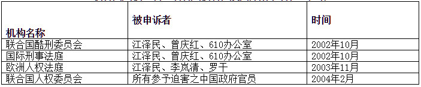
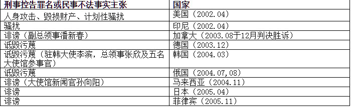

<table>
<tr>
<td>
<h2 align="center">全球法轮功学员控告中共前党魁江泽民及其党羽一览表</h2>
<h4 align="center">（2001年至2010年10月）</h4>

江泽民及其党羽非法镇压迫害法轮功，在联合国等国际人权组织经过深入查证属实之后，已成为国际瞩目的人权事件。目前全球各地人权律师形成联合网，在各国法院对江泽民及其追随参与犯罪的中共官员进行迫害的刑事追诉或民事起诉，诉讼规模之庞大被称为「二十一世纪最大的国际人权诉讼」：

<h2 align="center">联合国人权组织、欧洲人权法庭及国际刑事法庭之控诉</h2>

<h2 align="center">全球各地法轮功学员控告中国使领馆＆使馆官员一览表</h2>

<h2 align="center">全球各地控告「处理法轮功问题领导小组办公室」及其首脑一览表</h2>

<h2 align="center">全球各地控告迫害法轮功学员之中共官员一览表</h2>

<h2 align="center">全球各地法轮功学员控告中共操控的媒体一览表 </h2>

</td>
 </tr>
</table>

