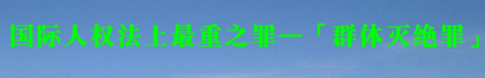

<table>
<tr>
<td width=900>
<h3 align="center"><b>反人类罪</b></h3>

危害人类罪或反人类罪，旧译违反人道罪，于2002年7月1日生效的《国际刑事法院罗马规约》将该罪名中文译名确定为危害人类罪。 规约中的定义为“是指那些针对人性尊严极其严重的侵犯与凌辱的众多行为构成的事实。 这些一般不是孤立或偶发的事件，或是出于政府的政策，或是实施了一系列被政府允许的暴行。

危害人类罪- 维基百科，自由的百科全书 - Wikipedia   
https://zh.wikipedia.org/zh-tw/危害人类罪</td></tr>

<tr>
<td width=900>
 <h3 align="center"><b>群体灭绝罪</b></h3>

 种族灭绝（英语：genocide）或群体灭绝，是指人为的、系统性地、有计划地对一个或一些种族、民族、宗教或国民团体进行全体性或局部性的屠杀。但法律学者对于种族灭绝中局部性的程度，仍存在争议。该词最早由波兰籍犹太法律学者拉斐尔·莱姆金在1944年提出。其中“genos”来源于希腊语“genos”，意思为部落或家庭；后缀“-cide”来源于拉丁语“cidium”或法语“cide”，意思为杀害。

1948年12月9日，联合国大会通过第260A号决议《防止及惩治灭绝种族罪公约》，简称CPPCG条约。该条约于1951年1月12日生效，其中第二条对种族灭绝行为定义如下：

蓄意全部或局部消灭某一国族、族群、种族或宗教团体，犯有下列行为之一者：

◆ 杀害该团体的成员。 
◆ 致使该团体的成员在身体上或精神上遭受严重伤害。 
◆ 故意使该团体处于某种生活状况下，以毁灭其全部或局部的生命。 
◆ 强制施行办法，意图防止该团体内成员生育。 
◆ 强迫转移该团体之儿童至另一团体。 

种族灭绝- 维基百科，自由的百科全书 - Wikipedia  
https://zh.wikipedia.org/zh-cn/种族灭绝</td></tr>

<tr>
<td width=900>
<h3 align="center"><b>酷刑罪</b></h3>

 酷刑，属于一种会对人的肉体或精神造成极大痛苦的刑罚，其属于一种手段，目的往往在于处罚某种不法行为或是以此取得特定的资讯，后者也称为刑求。

根据联合国禁止酷刑和其他残忍、不人道或有辱人格的待遇或处罚公约第1条的定义：

“酷刑”是指为了向某人或第三者取得情报或供状，为了他或第三者所作或涉嫌的行为对他加以处罚，或为了恐吓或威胁他或第三者，或为了基于任何一种歧视的任何理由，蓄意使某人在肉体或精神上遭受剧烈疼痛或痛苦的任何行为，而这种疼痛或痛苦是由公职人员或以官方身份行使职权的其他人所造成或在其唆使、同意或默许下造成的。纯因法律制裁而引起或法律制裁所固有或附带的疼痛或痛苦不包括在内。

酷刑- 維基百科，自由的百科全書 - Wikipedia  
https://zh.wikipedia.org/zh-cn/酷刑</td></tr>

<tr>
<td width=900>
 <h3 align="center"><b>普遍管辖权</b></h3>

 普遍管辖权或普遍性原则是国际法“原则”之一。根据这一原则，无论被控犯罪之人的国籍、居住国或与起诉国关系如何，即使该罪行是在起诉国领土之外犯下的，该国也可以对该人行使刑事管辖权。由于所犯罪行被认为是危害全人类的，并且罪行极为严重，不容有管辖权投机，因此任何国家都有权对其加以惩罚。

普遍管辖权- 维基百科，自由的百科全书 - Wikipedia  
https://zh.wikipedia.org/zh-cn/普遍管辖权

</td></tr>

</table>

 <h3 align="center"><b>什么是“群体灭绝罪(GENOCIDE)”</b></h3>

【明慧网二零零三年五月十六日】在美国的词典里，Genocide——“ 灭绝种族罪”被解释为对一个种族，一个信仰群体，一个文化群体，或一个政治群体的一种蓄意地有系统的整体毁灭行为，所以对Genocide更确切的翻译应该是“群体灭绝罪”。

最典型的例子就是二战期间对犹太人的屠杀，对所有的犹太人，能找到的就杀，目的就是要在地球上彻底灭尽犹太种族。现在人们一想到“灭绝种族”这个词，马上就会联想到二战对犹太人的灭绝性屠杀。

二战时的东方战场，日本军队杀害的中国人比德国杀的犹太人还要多，可日本军队的所为并不算“灭绝种族罪”因为它并不是有目的、有计划、系统地杀掉所有中国人。

总而言之，“群体灭绝罪”(genocide)是有组织地对一群人的灭杀（并不仅限于种族），目的是灭除这一个群体。按惯例迫害者是国家机构。

在国际刑事法中，灭绝种族罪是这么定义的：“灭绝种族罪是指蓄意全部或局部消灭某一民族、族裔、种族或宗教团体而实施的下列任何一种行为：

1、杀害该团体的成员；2、致使该团体的成员在身体上或精神上遭受严重伤害；3、故意使该团体处于某种生活状况下，毁灭其全部或局部的生命；4、强制施行办法，意图防止该团体内的生育；5、强迫转移该团体的儿童至另一团体；”

2002年10月，部分法轮功学员以“群体灭绝罪”控告江泽民。江泽民迫害法轮功，实行的政策叫做“名誉上搞臭、经济上截断、肉体上消灭”，没有比这个法案更确切地定义江氏集团对法轮功修炼群体在过去三年里的迫害了。法轮功学员被迫害致死的报导几乎每天都在网站上读到，还有众多无法越过封锁传到海外的死亡案例。迫害更常用的手段是残酷的折磨，包括电刑、老虎凳、水牢、剥夺睡眠、曝晒、冰冻、火烙、强迫重体力劳动……等等，被迫害致残无数。更有甚者，将健康人强行送进精神病院，注射损害神经的药物，使人遭受精神上的严重伤害。以上已严重触犯了灭绝种族罪的前两条。

另外，江氏集团有系统的在国家控制的电视台、广播电台、报纸等媒体上大量造谣诬蔑和恶毒攻击法轮功，迫使学校、政府部门及各种企事业单位对法轮功学员进行迫害，使法轮功学员无法上学，无法工作，无法有正常的社会交往，无数的家庭破裂，无数人流离失所，众多的法轮功学员无法生存。这正是法案中所说的第三条。

其实这场灭绝法轮功的目的是针对法轮功的信仰。他们所采取的一切手段就是迫使所有的法轮功学员放弃法轮功的信仰，从而灭绝法轮功的存在。他们试图转化法轮功学员的思想，把所有坚持修炼的人都送去洗脑。转化的目的就是要从精神上消灭这种信仰。这场迫害是在江泽民所指导的610办公室有目的、有组织地系统地进行的，极尽群体灭绝罪行的最邪恶手段。

对犹太人的群体灭绝罪行是在迫害结束后二十多年里，才被人们逐渐地广泛认识的。今天，对法轮功所进行的种族灭绝，人们如果能够在迫害进行之中就能认识到它的存在，并尽力制止，人类的美好未来就指日可望了。

（本文2003年1月10日首发于明慧。）

 <h3 align="center"><b>国际人权法上最重之罪——“群体灭绝罪”</b></h3>

【大纪元2013年05月21日讯】（大纪元记者陈熙暖荷兰报导）群体灭绝罪是国际人权法中最难以取证的罪行，同时也是最严重的罪行。

源自于希腊文的“种族”、“群体”(Genos)一词，加以拉丁词源的后缀“杀死(cide)”，形成“群体灭绝罪”一词，联合国对这一罪行的定义为“故意毁灭全部或部分国家、民族、种族或信仰群体的行为。”

这个名词在1944年以一位波兰犹太人——拉菲尔‧莱姆金(Raphael Lemkin)——为契机而出现，他当时在美国政治避难，向世界公开描述了德国纳粹的大屠杀。而“群体灭绝罪”首次在司法场合出现，是1945在纽伦堡国际军事法庭上对纳粹头子的审判中，但是这些受审战犯最后只被定罪反人类罪。1948年始，随着联合国公约的出现，群体灭绝罪开始受到关注。

1985年联合国正式宣布，1915年造成数十万人死亡的亚美尼亚大屠杀为群体灭绝罪，随后，诸多国家和组织正式使用并谴责这一罪行——1987年欧洲议会谴责亚美尼亚屠杀为群体灭绝罪、1998年比利时、2001年法国、2003年瑞士和希腊，俄罗斯的下议院在1994年也谴责亚美尼亚为群体灭绝罪。

1998年，“群体灭绝罪”开始成为具有法律效力的名词，2007年联合国最高司法机关——国际法院确认1995年发生的斯雷布雷尼察大屠杀为群体灭绝罪，这宗屠杀发生在波斯尼亚内战中，超过8000名穆斯林男性成人和青少年被塞族武装杀死。

巴尔干半岛战争的军事法庭——前南斯拉夫国际刑事法庭（ICTY）也宣判了数宗群体灭绝罪的起诉。

目前，在柬埔寨的金边(Phnom Penh)有3名前红色高棉政权的领导人正在接受群体灭绝罪名和其他战争罪行的审判，随后联合国将拨款进行正式审判。

苏丹总理巴席尔（Omar al-Bashir）因在达富尔（Darfur）地区对平民的屠杀，被国际刑事法庭以群体灭绝罪通缉。

成立于1992年位于海牙的国际刑事法庭是唯一常设的审判群体灭绝罪的国际法庭。

责任编辑：李云帆

<table>
<tr>
<td>
<h2 align="center">全球法轮功学员控告中共前党魁江泽民及其党羽一览表</h2>
<h4 align="center">（2001年至2010年10月）</h4>

江泽民及其党羽非法镇压迫害法轮功，在联合国等国际人权组织经过深入查证属实之后，已成为国际瞩目的人权事件。目前全球各地人权律师形成联合网，在各国法院对江泽民及其追随参与犯罪的中共官员进行迫害的刑事追诉或民事起诉，诉讼规模之庞大被称为「二十一世纪最大的国际人权诉讼」：

<h2 align="center">联合国人权组织、欧洲人权法庭及国际刑事法庭之控诉</h2>

<h2 align="center">全球各地法轮功学员控告中国使领馆＆使馆官员一览表</h2>

<h2 align="center">全球各地控告「处理法轮功问题领导小组办公室」及其首脑一览表</h2>

<h2 align="center">全球各地控告迫害法轮功学员之中共官员一览表</h2>

<h2 align="center">全球各地法轮功学员控告中共操控的媒体一览表 </h2>

</td>
 </tr>
</table>

